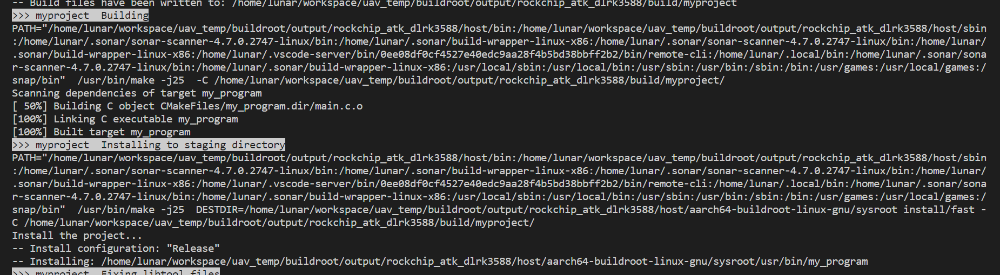
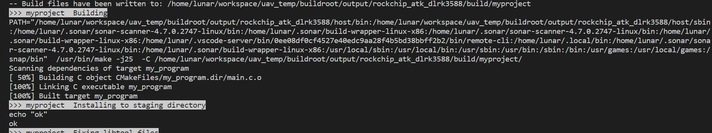
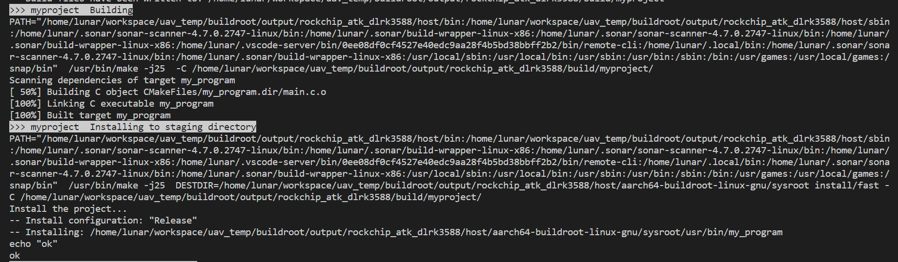

## 正文

实现方式其实是参考 buildroot/package/pkg-cmake.mk 的代码，你必需知道，我们再向buildroot添加一个包时，会编写mk文件，里面会有很多预定义的宏，最常见的：XX_INSTALL_STAGING_CMDS 和 XX_INSTALL_TARGET_CMDS，两者区别是：XX_INSTALL_STAGING_CMDS是往构建根目录安装一些文件、XX_INSTALL_TARGET_CMDS是往目标（下位机根文件系统）目录安装一些文件。一旦我们的mk文件定义了这两命令，这两命令的默认值就会被覆盖。

XX_INSTALL_STAGING_CMDS 和 XX_INSTALL_TARGET_CMDS这两命令的默认行为就是使用原项目当中的cmake install代码。我们只需要参考 buildroot/package/pkg-cmake.mk 文件默认安装命令的实现，然后再此基础上自定义我们的内容就能实现“双install”的效果。

废话不多说，直接上代码：

<!-- more -->

Config.in文件实现如下：

```
config BR2_PACKAGE_MYPROJECT
    bool "my project"
    help
        this configuration is used to enable or disable myproject.
```

- 首先我们不定义XX_INSTALL_STAGING_CMDS命令，查看其默认安装行为：mk文件如下：

    ```makefile
    ifeq ($(BR2_PACKAGE_MYPROJECT), y)
    # ONVIF_SRVD_VERSION =
    MYPROJECT_SITE = $(TOPDIR)/../external/myproject
    MYPROJECT_SITE_METHOD = local
    MYPROJECT_DEPENDENCIES = rockchip-mpp
    MYPROJECT_INSTALL_STAGING = YES
    endif

    ifeq ($(BR2_PACKAGE_MYPROJECT), y)
    $(eval $(cmake-package))
    endif
    ```

    编译效果如下：

    

    可以看到，默认的编译效果会使用cmake文件当中的安装代码。

- 然后我们尝试定义XX_INSTALL_STAGING_CMDS命令，查看默认行为是否会被覆盖：

    ```makefile
    ifeq ($(BR2_PACKAGE_MYPROJECT), y)
    # ONVIF_SRVD_VERSION =
    MYPROJECT_SITE = $(TOPDIR)/../external/myproject
    MYPROJECT_SITE_METHOD = local
    MYPROJECT_DEPENDENCIES = rockchip-mpp
    MYPROJECT_INSTALL_STAGING = YES
    endif

    define MYPROJECT_INSTALL_STAGING_CMDS
        echo "ok"
    endef

    ifeq ($(BR2_PACKAGE_MYPROJECT), y)
    $(eval $(cmake-package))
    endif
    ```

    效果如下

    

    很明显，默认的安装行为已经被覆盖，只执行了我们后来自定义的安装代码，也就是只打印了ok。

- 最后我们在定义XX_INSTALL_STAGING_CMDS命令最前面，参考buildroot/package/pkg-cmake.mk加上默认安装行为，mk文件如下：

    ```makefile
    ifeq ($(BR2_PACKAGE_MYPROJECT), y)
    # ONVIF_SRVD_VERSION =
    MYPROJECT_SITE = $(TOPDIR)/../external/myproject
    MYPROJECT_SITE_METHOD = local
    MYPROJECT_DEPENDENCIES = rockchip-mpp
    MYPROJECT_INSTALL_STAGING = YES
    endif

    define MYPROJECT_INSTALL_STAGING_CMDS
        $(TARGET_MAKE_ENV) $(MYPROJECT_MAKE_ENV) $(MYPROJECT_MAKE) $(MYPROJECT_MAKE_OPTS) $(MYPROJECT_INSTALL_STAGING_OPTS) -C $(MYPROJECT_BUILDDIR)
        echo "ok"
    endef

    ifeq ($(BR2_PACKAGE_MYPROJECT), y)
    $(eval $(cmake-package))
    endif
    ```

    结果如下：

    

    结果正是我们想要的，不仅执行了cmake当中的安装行为，也执行了我们后来追加的安装行为。

---

**本章完结**