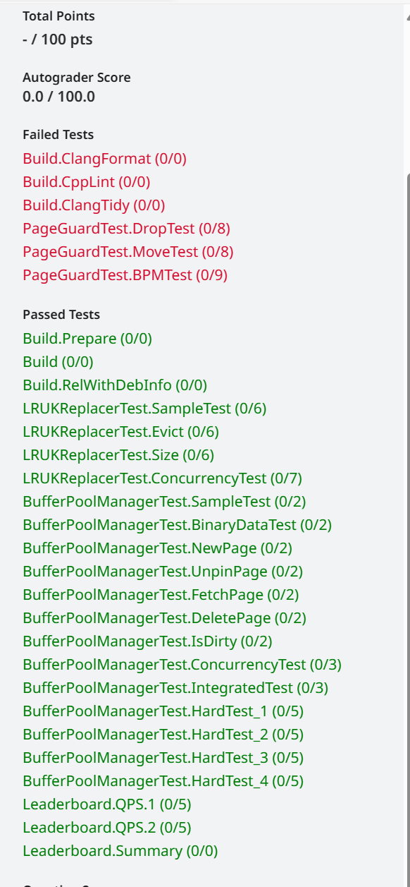
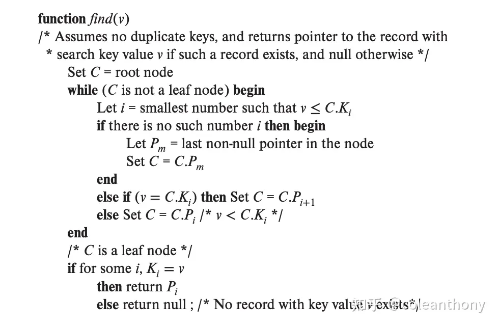
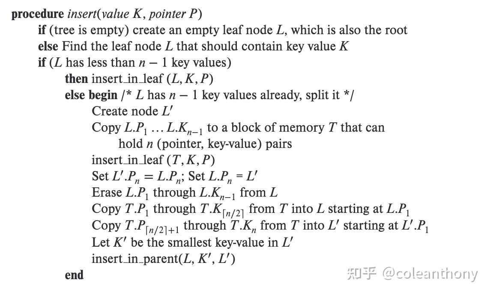
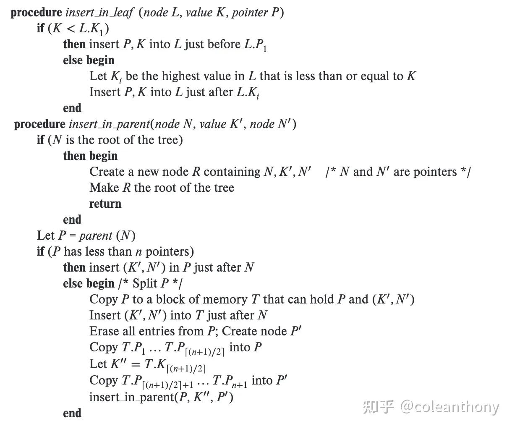
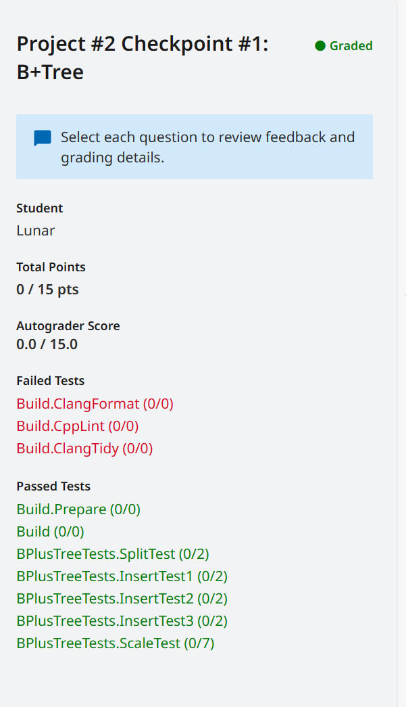
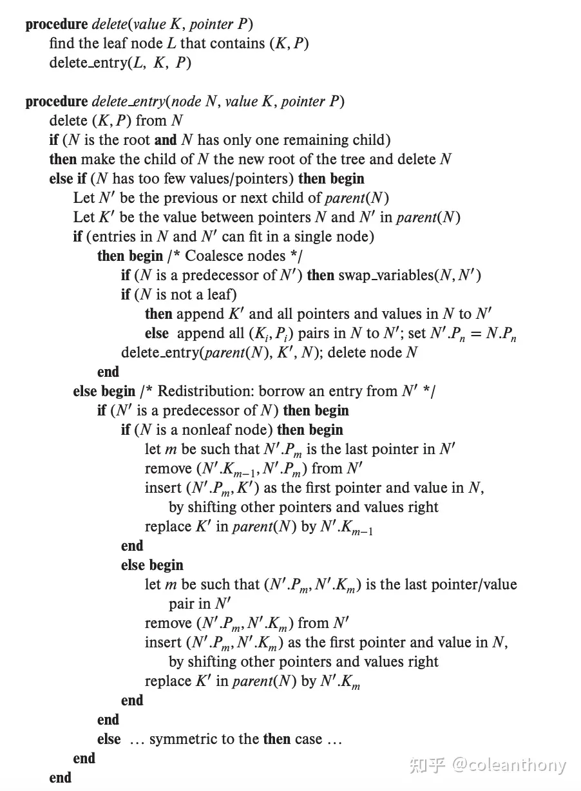
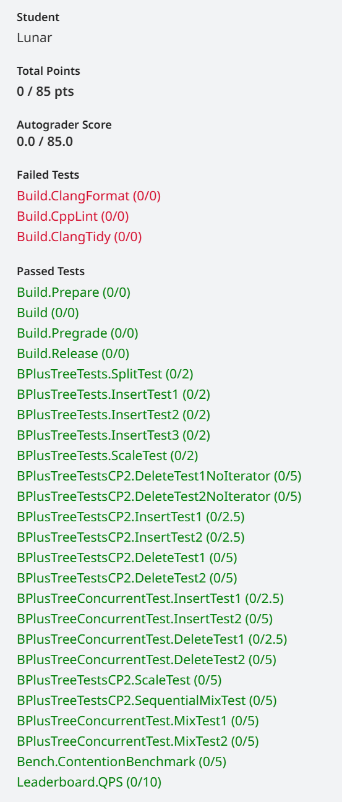
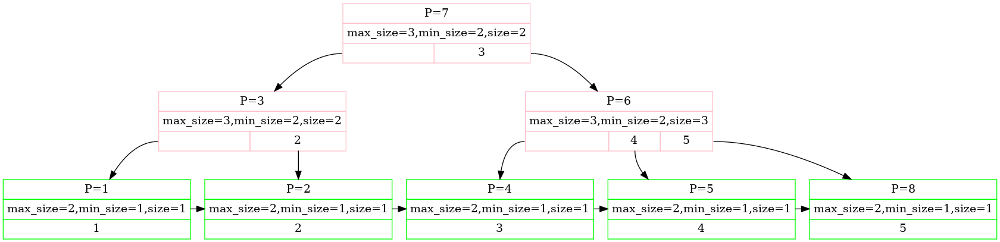

**背景**

菜鸟博主是2024届毕业生，学历背景太差，导致23年秋招无果，准备奋战春招。此前有读过LevelDB源码的经历，对数据库的了解也仅限于LevelDB。奔着”有对比才能学的深“的理念，以及缓解自身就业焦虑的想法，于是乎在2024.2.16日开始CMU15445（关系性数据库）实验之旅。目前进度：将P2做完了。

所以，本博客仅是对p1（Buffer Pool）和p2（B+Tree）的总结。

因为C++的基础还凑合，而且时间紧迫，于是跳过了p0实验，建议之前没学过C++同学，可以做做p0以熟悉现代C++的语法。

**资源分享：**

课程主页链接：[https://15445.courses.cs.cmu.edu/spring2023/](https://15445.courses.cs.cmu.edu/spring2023/)

B站有一位up主“Moody-老师”，对着CMU15445的ppt按照自己的理解复现了每一次的讲座，链接如下：[https://space.bilibili.com/23722270](https://space.bilibili.com/23722270)
<!-- more -->

## Project #1 - Buffer Pool

**总结**

该模块是基于LRU-K Replacement Policy实现了一个内存池。简单来讲LRU-K Replacement Policy就是类似操作系统的内存页面置换。

P1模块实现的内存池，和LevelDB的Cache有相似的作用，只是LevelDB的Cache中实现的内存替换策略是最简单的LRU算法，同时，LevelDB并没有像本实验中那样一上来就分配那么多内存进行内存复用，而是采用了动态内存分配与释放的方式，新的Block(或者Table)加到Cache中时，使用malloc分配内存，淘汰时，使用free直接释放内存。可能这就是在BusTub中叫内存池，而在LevelDB中叫Cache的原因。

BufferPoolManager最开始就会申请N个内存页，同时这N个内存页都会被挂到free_list（空闲链表），程序在读写磁盘页时只会通过内存页间接操作，最开始在需要读取磁盘页时会直接从BufferPoolManager的free_list（空闲链表）上去取空闲的内存页，随着程序的运行，空闲链表所有的内存页都会被占用，此时如果程序还需要从磁盘上读取一个内存中不存在的**磁盘页page**时，就会执行`LRUKReplacer::Evict`，该函数会在现有的内存页中选取前k次访问的时间间隔最久的那一个**内存页frame**，将该页淘汰回硬盘，获取的**内存页frame**就被**磁盘页page**使用。当然，内存中正在使用的磁盘页（具体是否正在使用可以通过引用计数来判断）不会参与淘汰。

这里建议实现一个辅助函数：

```cpp
auto BufferPoolManager::NewFrameUnlocked(frame_id_t &frame_id) -> Page *
```

该函数可以依据内存页的情况，直接到free_list（空闲链表）取内存页或者调用`LRUKReplacer::Evict`去在已有内存页上去淘汰磁盘页，从而获取空闲的内存页。

本实验进行的比较顺利，唯一主要弄清楚的是Frame和Page的区别。

- **Frame(4K):** 就是内存页，Frame有两种状态：当Frame没有绑定磁盘页数据时，可以称为空闲内存页；当Frame绑定了磁盘页数据时，也可以称为Page。相应的frame_id就是Buffer Manager最开始申请的每个内存页的唯一id号。

- **Page(4K):** 就是磁盘页，相应的page_id就是磁盘上每一页的id号。

理清这两个术语，接下来直接复现本模块的业务代码即可。

**实现小技巧：**

1. 在实现`class BufferPoolManager`时，可以实现一个`NewFrameUnlocked`成员函数，方便在BufferPoolManager中获得空闲内存页(Frame)。

2. 明确`class Page`的读写锁是保护`data_`的，在`class BufferPoolManager`中无需对Page再加读写锁，因为对Page除data_外的成员变量的写操作都是拿到BufferPoolManager的锁后才进行的，假设其他位置的读不会有影响，所以无需再加Page的读写锁，在实现的时候可能更好理解这点。

3. LRUKReplacer的实现中记录每个frame的k次访问历史的**时间戳**，可以考虑使用**逻辑时间戳**（因为用实际意义的时间来作为时间戳的话，可能精度不太够，所以不现实），这里的逻辑时间戳的概念在LevelDB中也有用到（即SequenceNumber），做法是这样的：定义一个全局变量，每次调用RecordAccess函数都可以将逻辑时间戳自增一，并且将其记录到对应的frame上。

**Gradescope测试**

关于6个Fail的解释

前三个是关于代码规范的测试，没有通过。。。

后三个是关于PageGuard的测试，我的实现参考了`std::lock_guard`，在构造时加读写锁、在析构时，解读写锁。但是因为出现了死锁，猜测测试程序可能不支持这么实现，但其实并没有错误。而且后续的B+树索引实验在使用PageGuard时并没有出现死锁。（续注，看了一下p3，好像确实不让在构造函数中获取读写锁，已改，并通过p1的这三个测试）



## Project #2 - B+Tree

**总结**

该模块就是基于磁盘（结合Buffer Pool Manager）实现一个B+树的增删查改，另外要保证线程安全。

和LevelDB对比，LevelDB使用LSM Tree的结构，其数据结构使用的是跳表、内存按层的方式，每层内部存储SSTable文件的元数据，作为表级索引，SSTable文件尾部存储着数据块的索引，作为块级索引，而每个数据块的尾部存储着数据索引，作为数据索引。在检索一个key-value对时，由于LevelDB一层的各个部分之间是有序不重叠的，所以以二分为主。查询方面，可能LevelDB会略差，但是增删改，LevelDB可以做到“O(1)”（忽略内存插入跳表的操作）的时间复杂度，而使用B+的数据库增删查改时间复杂度都是O(logn)。LevelDB其实将真正的删改延迟到了压缩阶段。具体细节有兴趣的读者可以自行看LevelDB的源码。


### B+树的实现

考虑到递归方式调试困难，我采用了迭代式实现了B+树

由于B+树只在叶节点存数据，所有迭代式只需要保存从根节点定位到key的路径然后根据规则进行调整即可。

约定：

1. internal_page的kv关系如下：... key1 <= value1（value所代表的page中的key） < key2 <= value2 ...

**需了解的是：B+树internal_page，索引为0的entry，其key是无效value是有效。即，B+树internal_page中，key的数量 = value数量 - 1。而leaf page中，kv数量一样。也正是存在这种关系，使得在插入和删除时，internal page的处理更为复杂。**

关于对我帮助很大的链接：

调试B+树可视化调试方式可以参考这篇文章：[https://www.cnblogs.com/wangzming/p/17479777.html](https://www.cnblogs.com/wangzming/p/17479777.html)

经验贴：[https://zhuanlan.zhihu.com/p/665802858?utm_id=0](https://zhuanlan.zhihu.com/p/665802858?utm_id=0)

#### B+树-查找

我实现了一个辅助函数：

```cpp
INDEX_TEMPLATE_ARGUMENTS
void BPLUSTREE_TYPE::FindPath(const KeyType &key, Context& ctx, bool write, Transaction *txn)
```

可以查找key并保存路径。后面的插入和删除都用到了该函数。

流程如下：

从root_page开始，根据key找到leaf_page，同时保存沿路的internal_page。

官方提供查找的伪代码：



#### B+树-插入

插入也是先调用FindPath记录并锁住沿路的page，然后自下而上迭代操作。

插入需要注意的是节点达到MAXSize时需要分裂。

**对于leaf page的分裂**

假设parent_page中有如下entry：

> ... 、<kn-2, vn-2>、<kn-1, vn-1>、<kn, vn> 、<kn+1, vn+1>...

要分裂page_id为vn-1的**leaf_page**，流程如下：

1. 以leaf_page的1/2处的kv作为分裂点，假设为<ki, vi>

2. 将leaf_page节点中，索引为i（包括i）之后的所有的entry移动到new_leaf_page（index从0开始）中。

3. 将leaf_page的next_page_id赋值给new_leaf_page的next_page_id。

4. 将new_leaf_page_id赋值给leaf_page的next_page_id。

5. 左孩子为vn-1（leaf_page的id），key为ki，右孩子为new_leaf_page_id（new_leaf_page的id）

6. 将ki插到parent_page中。（即插到parent_page的index为n的地方）

分裂后parent_page的entry如下：

> ... 、<kn-2, vn-2>、<kn-1, vn-1>、<ki, new_page_id>、<kn, vn> 、<kn+1, vn+1>...

**由于new_leaf_page中index为0处key还是有效的，所以，leaf page的分裂中，分裂点ki是复制并上移的。**


**对于internal page的分裂**

假设parent_page中有如下entry：

> ... 、<kn-2, vn-2>、<kn-1, vn-1>、<kn, vn> 、<kn+1, vn+1>...

要分裂page_id为vn-1的**internal_page**，流程如下：

1. 以internal_page的1/2处的kv作为分裂点，假设为<ki, vi>

2. 将internal_page节点中，索引为i（包括i）之后的所有的entry移动到new_internal_page（index从0开始）中。

3. 左孩子为vn-1（internal_page的id），key为ki，右孩子为new_internal_page_id（new_internal_page的id）

4. 将ki插到parent_page中。（即插到parent_page的index为n的地方）

分裂后parent_page的entry如下：

> ... 、<kn-2, vn-2>、<kn-1, vn-1>、<ki, new_page_id>、<kn, vn> 、<kn+1, vn+1>...

注意和leaf_page分裂时的区别。

**由于new_internal_page中index为0处key是无效的，所以，internal page的分裂中，分裂点ki是上移的。**

官方提供的插入伪代码：





**Gradescope测试**

关于3个Fail的解释

这三个是关于代码规范的测试，所以没有通过。



#### B+树-删除

删除也是先调用FindPath记录并锁住沿路的page，然后自下而上迭代操作。

删除比较麻烦，需要考虑的情况比较多，但是一步一步，理清思路还是很好实现的。按规律来说，不能拆借就一定能合并，反之亦然。至于拆借和合并的时机，本文不过多赘述。


**对于leaf page的拆借与合并**

**向left sibling拆借**

假设parent_page中有如下entry：

> ... 、<kn-2, vn-2>、<kn-1, vn-1>、<kn, vn> 、<kn+1, vn+1>、...

page_id为vn-1的**leaf_page**向left sibling借其最右端的entry，流程如下：

1. 找到left sibling的page_id假设中是vn-2。移除并获得其最右端的entryi，假设为<ki, vi>

2. 根据上面的[约定1]，将parent_page中的entryn-1（<kn-1, vn-1>）中的key更新为：ki。

3. 将<ki, vi>插到page_id为vn-1的leaf page最前方。

向left sibling拆借后，parent_page的entry如下：

> ... 、<kn-2, vn-2>、<ki, vn-1>、<kn, vn> 、<kn+1, vn+1>、...


**向left sibling合并**

我实现的合并，以大页向小页追加为原则

假设parent_page中有如下entry：

> ... 、<kn-2, vn-2>、<kn-1, vn-1>、<kn, vn> 、<kn+1, vn+1>、...

page_id为vn-1的**leaf_page**和left sibling合并，流程如下：

1. 找到left sibling的page_id假设中是vn-2。

2. 将leaf_page所有的entry都追加到left_sibling中去。

3. 将leaf_page的next_page_id赋值给left sibling的next_page_id。

4. 删除parent_page中index为n-1的entry。

和left sibling合并后，parent_page的entry如下：

> ... 、<kn-2, vn-2>、<kn, vn> 、<kn+1, vn+1>、...


**向right sibling拆借**

假设parent_page中有如下entry：

> ... 、<kn-2, vn-2>、<kn-1, vn-1>、<kn, vn> 、<kn+1, vn+1>、...

page_id为vn-1的**leaf_page**向right sibling借其最左端的entry，流程如下：

1. 找到right sibling的page_id假设中是vn。移除并获得其最左端的entryi，假设为<ki, vi>，为方便将entryi的下一个entry设为entryi+1<ki+1, vi+1>。

2. 根据上面的[约定1]，将parent_page中的entryn（<kn, vn>）中的key更新为：ki+1。

3. 将<ki, vi>插到page_id为vn-1的leaf page最后方。

向right sibling拆借后，parent_page的entry如下：

> ... 、<kn-2, vn-2>、<kn-1, vn-1>、<ki+1, vn> 、<kn+1, vn+1>、...


**向right sibling合并**

还是以大页向小页追加为原则

假设parent_page中有如下entry：

> ... 、<kn-2, vn-2>、<kn-1, vn-1>、<kn, vn> 、<kn+1, vn+1>、...

page_id为vn-1的**leaf_page**和right sibling合并，流程如下：

1. 找到right sibling的page_id假设中是vn。

2. 将right_sibling所有的entry都追加到leaf_page中去。

3. 将right_sibling的next_page_id赋值给leaf_page的next_page_id。

4. 删除parent_page中index为n的entry。

和right sibling合并后，parent_page的entry如下：

> ... 、<kn-2, vn-2>、<kn-1, vn-1>、<kn+1, vn+1>、...


**对于internal page的拆借与合并**

**向left sibling拆借**

假设parent_page中有如下entry：

> ... 、<kn-2, vn-2>、<kn-1, vn-1>、<kn, vn> 、<kn+1, vn+1>、...

page_id为vn-1的**internal_page**向left sibling借其最右端的entry，流程如下：

1. 找到left sibling的page_id假设中是vn-2。移除并获得其最右端的entryi，假设为<ki, vi>

2. 根据上面的[约定1]，parent_page的key更新如下：

    - entryn-1（<kn-1, vn-1>） -> entryn-1（<ki, vn-1>）
    - entryi（<ki, vi>） -> entryi（<kn-1, vi>）（描述成<vi, kn-1>更合适）

3. 将<kn-1, vi>**按kv关系插**到page_id为vn-1的internal page最前方。

向left sibling拆借后，parent_page的entry如下：

> ... 、<kn-2, vn-2>、<ki, vn-1>、<kn, vn> 、<kn+1, vn+1>、...


**向left sibling合并**

以大页向小页追加为原则

假设parent_page中有如下entry：

> ... 、<kn-2, vn-2>、<kn-1, vn-1>、<kn, vn> 、<kn+1, vn+1>、...

page_id为vn-1的**internal_page**和left sibling合并，流程如下：

1. 找到left sibling的page_id假设中是vn-2。

2. 将internal_page所有的entry（包括index为0，尽管key是无效的）都追加到left_sibling中去。

3. 在left sibling中找到原来internal_page中index为0的entry（其key是无效key），将kn-1设为其key。

4. 删除parent_page中index为n-1的entry。

和left sibling合并后，parent_page的entry如下：

> ... 、<kn-2, vn-2>、<kn, vn> 、<kn+1, vn+1>、...


**向right sibling拆借**

假设parent_page中有如下entry：

> ... 、<kn-2, vn-2>、<kn-1, vn-1>、<kn, vn> 、<kn+1, vn+1>、...

page_id为vn-1的**internal_page**向right sibling借其最左端的entry，流程如下：

1. 找到right sibling的page_id假设中是vn。取right sibling的entry0的value，以及entry1的key，组成entryi，假设为<k1, v0>。（描述成<v0, k1>更合适）

2. 根据上面的[约定1]，parent_page的key更新如下：

    - entryn（<kn, vn>） -> entryn（<k1, vn>）
    - entryi（<k1, v0>） -> entryi（<kn, v0>）

3. 将<k1, v0>插到page_id为vn-1的internal page最后方。

向right sibling拆借后，parent_page的entry如下：

> ... 、<kn-2, vn-2>、<kn-1, vn-1>、<k1, vn> 、<kn+1, vn+1>、...


**向right sibling合并**

还是以大页向小页追加为原则

假设parent_page中有如下entry：

> ... 、<kn-2, vn-2>、<kn-1, vn-1>、<kn, vn> 、<kn+1, vn+1>、...

page_id为vn-1的**internal_page**和right sibling合并，流程如下：

1. 找到right sibling的page_id假设中是vn。

2. 将right_sibling所有的entry（包括index为0，尽管key是无效的）都追加到internal_page中去。

3. 在internal_page中找到原来right_sibling中index为0的entry（其key是无效key），将kn设为其key。

4. 删除parent_page中index为n的entry。

和right sibling合并后，parent_page的entry如下：

> ... 、<kn-2, vn-2>、<kn-1, vn-1>、<kn+1, vn+1>、...


官方提供的删除伪代码如下：



**Gradescope测试**

关于3个Fail的解释

这三个是关于代码规范的测试，所以没有通过。



最终B+树的样子就是这样：



## 大总结

p1+p2两个lab，大概花了10天，效率还是比较满意的。后面还剩两个project、目前核心在春招，所以准备放一放了。

CMU15445的lab做的还是爽的，就调试而言，起码比6.824的lab友好很多了。

---

**本章完结**