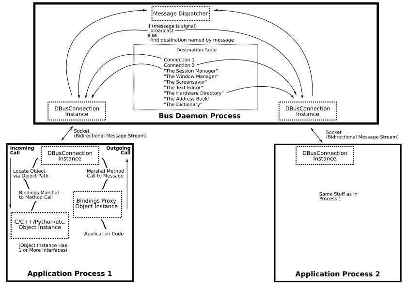

参考链接：

1. 中文博客：

    [https://www.e-learn.cn/topic/1808992](https://www.e-learn.cn/topic/1808992)

    [https://blog.csdn.net/u011942101/article/details/123383195](https://blog.csdn.net/u011942101/article/details/123383195)

    [https://blog.csdn.net/weixin_44498318/article/details/115803936](https://blog.csdn.net/weixin_44498318/article/details/115803936)
    
    [https://www.e-learn.cn/topic/1808992](https://www.e-learn.cn/topic/1808992)

    [https://blog.csdn.net/Dontla/article/details/122530765](https://blog.csdn.net/Dontla/article/details/122530765)
<!-- more -->

2. D-Bus Specification：

    [https://dbus.freedesktop.org/doc/dbus-specification.html](https://dbus.freedesktop.org/doc/dbus-specification.html)

    [https://pythonhosted.org/txdbus/dbus_overview.html](https://pythonhosted.org/txdbus/dbus_overview.html)

    [https://dbus.freedesktop.org/doc/dbus-tutorial.html](https://dbus.freedesktop.org/doc/dbus-tutorial.html)

本文主要记录一下我对dbus的认知，当然可能会存在一些错误，欢迎读者指正。

## DBus安装

命令如下：

```bash
# 安装dbus
sudo apt-get install dbus

# 安装d-feet工具，用于查看 session bus 和 system bus
sudo apt-get install d-feet

# 安装glib2.0
sudo apt-get install libgtk2.0-dev

# 安装 dbus-glib
apt-get install libdbus-glib-1-dev

# for dbus-launch
apt install dbus-x11
```

c_cpp_properties.json配置：

主要注意includePath

```json
{
    "configurations": [
        {
            "name": "Linux",
            "includePath": [
                "${workspaceFolder}/**",
                "/usr/include/dbus-1.0/",
                "/usr/include/glib-2.0/",
                "/usr/lib/x86_64-linux-gnu/glib-2.0/include/"
            ],
            "defines": [],
            "compilerPath": "/usr/bin/clang",
            "cStandard": "c17",
            "cppStandard": "c++14",
            "intelliSenseMode": "linux-clang-x64"
        }
    ],
    "version": 4
}
```

## DBus整体结构

DBus是基于本地套接字实现的IPC框架，可用于进程间的通信或进程与内核的通信。

这里贴一张官方提供的dbus整体架构图：



DBUS的优点：

1. 因为DBUS主要应用在同一台机器上，不会跨主机进行IPC通信。所以使用二进制协议，省去序列化的代价。但是如果需要传递像字符串指针的话，就需要通过地址将字符串拷贝到Message中，所以或多或少还是存在一些序列化的过程。

2. DBUS的“报文”在传递时，避免了往返的开销。并且支持异步操作。

3. 报文以消息的方式传递而不是（类似于TCP）字节流。

4. D-Bus 库的封装方式可以让开发人员利用其框架现有的对象/类型系统，而无需学习新的IPC的特点，然后重构他们的项目。

这里简单解释一下dbus整体架构图的一个交互流程：

在DBUS中，一个完整的IPC交互流程包括三个部分：Bus Daemon Process、Client Application Process、Server Application Process。Bus Daemon Process有两类：Session Bus、System Bus，这里本文主要讨论Session Bus，这两类Bus主要区别在于：Session Bus是主要负责应用程序之间的一个交互，而System Bus主要负责内核和应用程序之间的一个交互。Bus Daemon Process在两个应用程序交互之中起路由作用。从图中可以看到所有的应用程序和Bus Daemon Process的连接都是通过本地socket。

主要流程：

0. app1（client）和app2（server）都通过Bus Daemon Process的套接字地址连接上去。

1. app1请求一个叫com.app1.client的**Bus Name**，app2请求一个叫com.app2.server的**Bus Name**。

2. app1构造一个**method calls消息**，method calls消息至少包括：Dest Bus Name（目的地址，假设这里是com.app2.server）、Object Path、Interface Name 、Method Name（包括参数，这里假设是int add(int n1, int n2)），然后将消息报文发送给Bus Daemon Process。

3. Bus Daemon Process根据消息的Dest Bus Name，将消息路由给app2。

4. app2根据消息的Object Path、Interface Name 、Method Name调用相应的方法（add函数），然后根据返回值以及接收到的**method calls消息**封装成一条**method returns消息**，发回给Bus Daemon Process，进而路由给app1。

5. app1接收到**method returns消息**后解析出里面的返回值，于此一次交互完成。

dbus中消息有四种类型：

1. signals：信号，一般用于广播，不会有目的地址和返回值。

2. method calls：方法调用，定向传播，有目的地址，可能有返回值。

3. method returns：方法返回，简单理解就是method calls的返回值。

4. errors：错误，简单理解就是错误码。

上面流程主要用到method calls、method returns两种消息类型。

梳理了一下dbus的交互流程，其实会发现dbus和RPC非常像。不同点在于**dbus更像是一种本地专用的RPC。**

dbus-daemon的地址保存在环境变量DBUS_SESSION_BUS_ADDRESS中，用于表示当前登录用户的session的dbus-daemon进程的地址，可以使用下面命令查看。

```bash
root@lunar-virtual-machine:~# echo $DBUS_SESSION_BUS_ADDRESS
unix:path=/run/user/0/bus
```

session bus由用户登录时dbus-launch脚本自动启动，当然，你也可以自己在**终端启动**一个bus-daemon，方便调试：

```bash
root@lunar-virtual-machine:~# DBUS_VERBOSE=1 dbus-daemon --session --print-address
unix:abstract=/tmp/dbus-49gl7TnTcs,guid=864158a61bb94df92e3e1ac866936bd1

```

然后将DBUS_SESSION_BUS_ADDRESS修改为：unix:abstract=/tmp/dbus-49gl7TnTcs,guid=864158a61bb94df92e3e1ac866936bd1，再启动应用程序即可连接到自己启动的dbus-daemon上。

## DBus深入理解

先下载一个dbus实例：[http://www.fmddlmyy.cn/down2/hello-dbus3-0.1.tar.gz](http://www.fmddlmyy.cn/down2/hello-dbus3-0.1.tar.gz)

四步构建并运行dbus服务器

```bash
./autogen.sh
./configure
make
./example-service
```

然后另起一个终端，执行d-feet命令，会弹出一个窗口：


双击Methods下的Add方法，会弹出一个对话框，输入参数并确认后你就会看到相加的结果。这个具体的交互过程和。上面我们分析的流程是一样的。

下面通过该窗口逐步了解DBUS的相关概念。

**Bus Name：** 应用和消息总线的**连接标识符**，有两类，包括：well-known name（熟知名）和unique name（唯一名）

well-known name形如：”org.fmddlmyy.Test“

unique name形如：”:1.114“

well-known name可以被多个连接（**非同时**）所拥有，unique name在所有连接中是唯一的。一个连接可以同时拥有well-known name和unique name，well-known name，但是唯一名是必须的，但熟知名不是必须的。**well-known name可以类比于网络中的域名，unique name可以类比于网络中的IP地址。**

当多个应用连接到消息总线，要求提供同一个公共名的服务。消息总线会把这些连接排在链表中，并选择一个连接提供公共名代表的服务。可以说这个提供服务的连接拥有了这个公共名。如果这个连接退出了，消息总线会从链表中选择下一个连接提供服务。

**Native Objects and Object Paths：** Native Objects类似java中的java.lang.Object、QT中的QObject等等。在最底层的dbus中纯在形式只是一个字符串。

Object Paths形如：”/TestObject“

**Methods and Signals（Name）：** Methods表示被具体调用的方法，而Signals就是信号。Method可以有返回值，Signals一定没有返回值，此外，Signals可以进行广播，应用程序可以向bus订阅要接收的信号的Interface，一旦注册，只要DBUS收到信号，就会根据的信号的接口，将信号广播给相应的应用程序。在最底层的dbus中纯在形式只是一个字符串。

**Interfaces（Name）：** 相当于C++中的纯虚类。每个对象都有一个或者多个接口，一个接口就是多个方法和信号的集合。在最底层的dbus中纯在形式只是一个字符串。

形如：
org.fmddlmyy.Test.Basic

org.freedesktop.DBus.Introspectable （由消息总线提供的标准接口

org.freedesktop.DBus.Properties （由消息总线提供的标准接口

在基于C实现的最底层的dbus中的对象、接口、方法、信号等概念可能很难去理解，我最开始也是比较困惑，但是如果你对dbus框架感兴趣的话，可以去了解一下dbus在面向对象的语言在的用法，比如dbus-c++，他里面的这些概念就非常直观。

因为D-BUS的底层接口没有对象相关概念，所以它的Object、Methods、Signals、Interfaces都是以**字符串的形式标识**。在面向对象的语言对dbus进行封装后，我们可以通过编写XML来定义接口和方法，并且通过我们编写的XML来**生成**相应的接口代码。接口里面就会包括方法和信号的定义。用户只用去继承这些**接口**，然后去**实现它里面的方法**即可。当然用户还需要去根据这些接口去定义相应的**对象**。

这里我故意漏掉了一个概念---**Proxies：** 代理对象用来表示其他的remote object。当触发了proxy对象的method时，将会在D-Bus上发送一个method_call的消息，并等待答复，根据答复返回。总线上的对象一般通过代理来访问。总线上的对象位于客户进程以外，而客户可以调用本地接口与对象通信，此时，本地接口充当了代理的角色。当触发了代理对象的方法时，将会在D-Bus上发送一个method_call的消息，并等待答复返回，**就象使用一个本地对象一样**。重点关注最后一句话！代理能够使用户去调用一个本地接口，该本地接口代替你向总线发消息，去调用另一个进程方法，并且接收返回值。**简而言之，代理的概念还是要配合面向对象的语言对dbus的封装才好理解。**

比如不用代理：

```cpp
Message message = new Message("/remote/object/path", "MethodName", arg1, arg2); 
Connection connection = getBusConnection();           
connection.send(message);           
Message reply = connection.waitForReply(message);           
if (reply.isError()) {                         
}
else {              
	Object returnValue = reply.getReturnValue();           
} 
```

用代理就是：

```cpp
Proxy proxy = new Proxy(getBusConnection(), "/remote/object/path");           
Object returnValue = proxy.MethodName(arg1, arg2);
```

dbus规定了一个统一的接口：org.freedesktop.DBus.Introspectable，通过该接口的Introspect方法，可以**递归遍历一个连接的对象树**，包括server的接口和其方法、信号。另外因为Bus Daemon Process也属于进程，应用进程也可以请求Bus Daemon Process的接口和方法。Bus Daemon Process的Bus Name为：org.freedesktop.DBus，利用总线的org.freedesktop.DBus.Introspectable.Introspect方法我们可以查看消息总线对象支持的接口以及其方法、信号。此外我们还可以调用总线的\对象的org.freedesktop.DBus.ListNames方法，来获取消息总线上已连接的所有连接名，包括所有公共名和唯一名。

这些内容具体细节在[https://www.e-learn.cn/topic/1808992](https://www.e-learn.cn/topic/1808992)有深入讲解，感兴趣的读者可以去看一看。

dbus是支持提供server的应用程序按需启动，在client请求的server应用程序没有启动时，daemon bus首先会依据配置起一个server应用程序。通过总线的/对象的org.freedesktop.DBus.ListActivatableNames方法，可以获取所有能够自启动的服务。

要想让自己的server应用程序自启动，需要添加一个配置文件，如下：

```bash
vim /usr/share/dbus-1/services/org.fmddlmyy.Test.service

# [D-BUS Service]
# Name=org.fmddlmyy.Test    # 定义Bus Name
# Exec=/home/lvjie/work/dbus/hello-dbus3-0.1/src/example-service    # 提供可执行程序的路径
```

dbus的方法参数、返回值类型可以是基本类型，也可以是复合类型，具体语法可以参考：[https://pythonhosted.org/txdbus/dbus_overview.html](https://pythonhosted.org/txdbus/dbus_overview.html)。

这里简单列举一下复合类型：

**数组：**

ai - 32位整型数组

a(ii) - 元素类型为两个32位整型的结构体的数组

aai - 元素类型为32位整型的数组的数组

**字典：**

a{ss} - key为string，value为string

a{is} - key为32位整数 ⇒ value为string

a{s(ii)} - key为string ⇒ value为包含2个32位整数的数组

a{sa{ss}} - key为string ⇒ value也是字典。

## DBus示例代码

Server Application：不断处理来自Client Application的方法调用。

```c
#include <stdio.h>
#include <stdlib.h>
#include <string.h>
#include <dbus/dbus.h>
#include <unistd.h>

void reply_to_method_call(DBusMessage *msg, DBusConnection *conn){
	DBusMessage *reply;
	DBusMessageIter arg;
	char *param = NULL;
	dbus_bool_t stat = TRUE;
	dbus_uint32_t level = 2010;
	dbus_uint32_t serial = 0;
	
	//从msg中读取参数
	if(!dbus_message_iter_init(msg, &arg))
		printf("Message has noargs\n");
	else if(dbus_message_iter_get_arg_type(&arg) != DBUS_TYPE_STRING)
		printf("Arg is notstring!\n");
	else
		dbus_message_iter_get_basic(&arg, &param);
	if(param == NULL) return;
	
	
	//创建返回消息reply
	reply = dbus_message_new_method_return(msg);
	//在返回消息中填入两个参数，和信号加入参数的方式是一样的。这次我们将加入两个参数。
	dbus_message_iter_init_append(reply, &arg);
	if(!dbus_message_iter_append_basic(&arg, DBUS_TYPE_BOOLEAN, &stat)){
		printf("Out ofMemory!\n");
		exit(1);
	}
	if(!dbus_message_iter_append_basic(&arg, DBUS_TYPE_UINT32, &level)){
		printf("Out ofMemory!\n");
		exit(1);
	}
	//发送返回消息
	if(!dbus_connection_send(conn, reply, &serial)){
		printf("Out of Memory\n");
		exit(1);
	}
	dbus_connection_flush(conn);
	dbus_message_unref(reply);
}


void listen_dbus()
{
	DBusMessage *msg;
	DBusMessageIter arg;
	DBusConnection *connection;
	DBusError err;
	int ret;
	char *sigvalue;
	
	dbus_error_init(&err);
	//创建于session D-Bus的连接
	connection = dbus_bus_get(DBUS_BUS_SESSION, &err);
	if(dbus_error_is_set(&err)){
		fprintf(stderr, "ConnectionError %s\n", err.message);
		dbus_error_free(&err);
	}
	if(connection == NULL)
		return;
	//设置一个BUS name：test.wei.dest
	ret = dbus_bus_request_name(connection, "test.wei.dest", DBUS_NAME_FLAG_REPLACE_EXISTING, &err);
	if(dbus_error_is_set(&err)){
		fprintf(stderr, "Name Error%s\n", err.message);
		dbus_error_free(&err);
	}
	if(ret != DBUS_REQUEST_NAME_REPLY_PRIMARY_OWNER)
		return;
	
	//要求监听某个singal：来自接口test.signal.Type的信号
	dbus_bus_add_match(connection, "type='signal', interface='test.signal.Type'", &err);
	dbus_connection_flush(connection);
	if(dbus_error_is_set(&err)){
		fprintf(stderr, "Match Error%s\n", err.message);
		dbus_error_free(&err);
	}
	
	while(1){
		dbus_connection_read_write(connection, 0);
		msg = dbus_connection_pop_message(connection);
	
		if(msg == NULL){
			sleep(1);
			continue;
		}
	
		if(dbus_message_is_signal(msg, "test.signal.Type", "Test")){
			if(!dbus_message_iter_init(msg, &arg))
				fprintf(stderr, "Message Has no Param");
			else if(dbus_message_iter_get_arg_type(&arg) != DBUS_TYPE_STRING)
				fprintf(stderr, "Param isnot string");
			else{
                dbus_message_iter_get_basic(&arg, &sigvalue);
                fprintf(stdout, "[method_call]Got Singal withvalue : %s\n", sigvalue);
            }
		}else if(dbus_message_is_method_call(msg, "test.method.Type", "Method")){
			//我们这里面先比较了接口名字和方法名字，实际上应当现比较路径
			if(strcmp(dbus_message_get_path(msg), "/test/method/Object") == 0){
				reply_to_method_call(msg, connection);
                fprintf(stdout, "[method_call]Got method_call, reply to it!\n");
            }
		}
		dbus_message_unref(msg);
	}
}

int main(int argc, char **argv){
	listen_dbus();
	return 0;
}
```

Client Application：发送Method Call消息或者信号。

```c
#include <stdio.h>
#include <stdlib.h>
#include <string.h>
#include <dbus/dbus.h>
#include <unistd.h>

//建立与session D-Bus daemo的连接，并设定连接的名字，相关的代码已经多次使用过了
DBusConnection* connect_dbus()
{
	DBusError err;
	DBusConnection *connection;
	int ret;
	
	//Step 1: connecting session bus
	
	dbus_error_init(&err);
	
	connection = dbus_bus_get(DBUS_BUS_SESSION, &err);
	if(dbus_error_is_set(&err)){
		fprintf(stderr, "ConnectionErr : %s\n", err.message);
		dbus_error_free(&err);
	}
	if(connection == NULL)
		return NULL;
	
	//step 2: 设置BUS name，也即连接的名字。
	ret = dbus_bus_request_name(connection, "test.wei.source", DBUS_NAME_FLAG_REPLACE_EXISTING, &err);
	if(dbus_error_is_set(&err)){
		fprintf(stderr, "Name Err :%s\n", err.message);
		dbus_error_free(&err);
	}
	if(ret != DBUS_REQUEST_NAME_REPLY_PRIMARY_OWNER)
		return NULL;
	
	return connection;
}

void send_a_method_call(DBusConnection *connection,char *param)
{
	DBusError err;
	DBusMessage *msg;
	DBusMessageIter arg;
	DBusPendingCall *pending;
	dbus_bool_t *stat;
	dbus_uint32_t *level;
	
	dbus_error_init(&err);
	
	//针对目的地地址，请参考图，创建一个method call消息。Constructs a new message to invoke a method on a remote object.
	msg = dbus_message_new_method_call("test.wei.dest", "/test/method/Object", "test.method.Type", "Method");
	if(msg == NULL){
		fprintf(stderr, "MessageNULL");
		return;
	}
	
	//为消息添加参数。Appendarguments
	dbus_message_iter_init_append(msg, &arg);
	if(!dbus_message_iter_append_basic(&arg, DBUS_TYPE_STRING, &param)){
		fprintf(stderr, "Out of Memory!");
		exit(1);
	}
	
	//发送消息并获得reply的handle。Queues amessage to send, as withdbus_connection_send() , but also returns aDBusPendingCall used to receive a reply to the message.
	if(!dbus_connection_send_with_reply(connection, msg, &pending, -1)){
		fprintf(stderr, "Out of Memory!");
		exit(1);
	}
	
	if(pending == NULL){
		fprintf(stderr, "Pending CallNULL: connection is disconnected ");
		dbus_message_unref(msg);
		return;
	}
	
	dbus_connection_flush(connection);
	dbus_message_unref(msg);
	
	//waiting a reply，在发送的时候，已经获取了methodreply的handle，类型为DBusPendingCall。
	// block until we recieve a reply， Block until the pendingcall is completed.
	dbus_pending_call_block(pending);
	//get the reply message，Gets thereply, or returns NULL if none has been received yet.
	msg = dbus_pending_call_steal_reply(pending);
	if (msg == NULL) {
		fprintf(stderr, "ReplyNull\n");
		exit(1);
	}
	// free the pendingmessage handle
	dbus_pending_call_unref(pending);
	// read the parameters
	if(!dbus_message_iter_init(msg, &arg))
		fprintf(stderr, "Message hasno arguments!\n");
	else if (dbus_message_iter_get_arg_type(&arg) != DBUS_TYPE_BOOLEAN)
		fprintf(stderr, "Argument isnot boolean!\n");
	else
		dbus_message_iter_get_basic(&arg, &stat);
	
	if (!dbus_message_iter_next(&arg))
		fprintf(stderr, "Message hastoo few arguments!\n");
	else if (dbus_message_iter_get_arg_type(&arg) != DBUS_TYPE_UINT32 )
		fprintf(stderr, "Argument isnot int!\n");
	else
		dbus_message_iter_get_basic(&arg, &level);
	
	printf("Got Reply: %d,%d\n", stat, level);
	dbus_message_unref(msg);
}

int send_a_signal(DBusConnection *connection, char *sigvalue)
{
	DBusError err;
	DBusMessage *msg;
	DBusMessageIter arg;
	dbus_uint32_t  serial = 0;
	int ret;
	
	//步骤3:发送一个信号
	//根据图，我们给出这个信号的路径（即可以指向对象），接口，以及信号名，创建一个Message
	if((msg = dbus_message_new_signal("/test/signal/Object", "test.signal.Type", "Test"))== NULL){
		fprintf(stderr, "MessageNULL\n");
		return -1;
	}
	//给这个信号（messge）具体的内容
	dbus_message_iter_init_append(msg, &arg);
	if(!dbus_message_iter_append_basic(&arg, DBUS_TYPE_STRING, &sigvalue)){
		fprintf(stderr, "Out OfMemory!\n");
		return -1;
	}
	
	//步骤4: 将信号从连接中发送
	if(!dbus_connection_send(connection, msg, &serial)){
		fprintf(stderr, "Out of Memory!\n");
		return -1;
	}
	dbus_connection_flush(connection);
	printf("Signal Send\n");
	
	//步骤5: 释放相关的分配的内存。
	dbus_message_unref(msg);
	return 0;
}

int main(int argc, char **argv)
{
	DBusConnection *connection;
	connection = connect_dbus();
	if(connection == NULL)
		return -1;
	
    if (argc > 1) {
        send_a_method_call(connection,"Hello, D-Bus");
    } else {
        send_a_signal(connection, "Hello,world!");
    }


	return 0;
}
```

```bash
gcc -Wall -o server server.c -ldbus-1 -I/usr/include/dbus-1.0/ -I/usr/include/glib-2.0/ -I/usr/lib/x86_64-linux-gnu/glib-2.0/include/ -I/usr/lib/x86_64-linux-gnu/dbus-1.0/include/

gcc -Wall -o client client.c -ldbus-1 -I/usr/include/dbus-1.0/ -I/usr/include/glib-2.0/ -I/usr/lib/x86_64-linux-gnu/glib-2.0/include/ -I/usr/lib/x86_64-linux-gnu/dbus-1.0/include/
```

结果如下：


---

**本章完结**