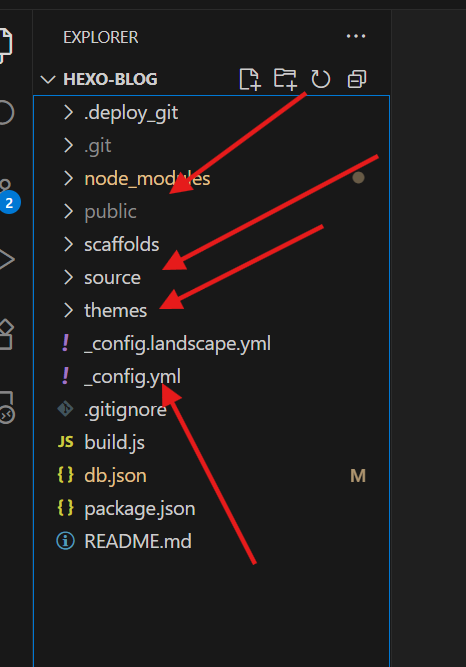
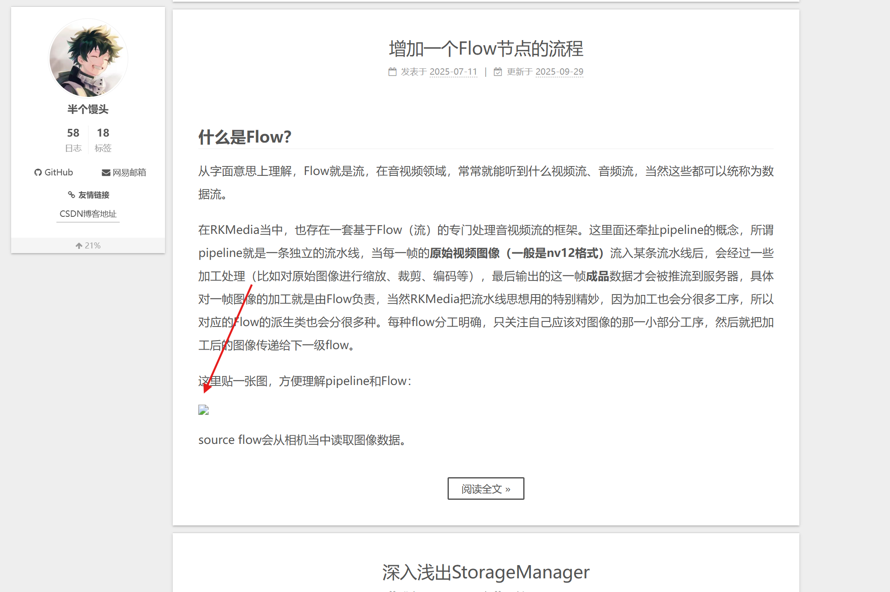
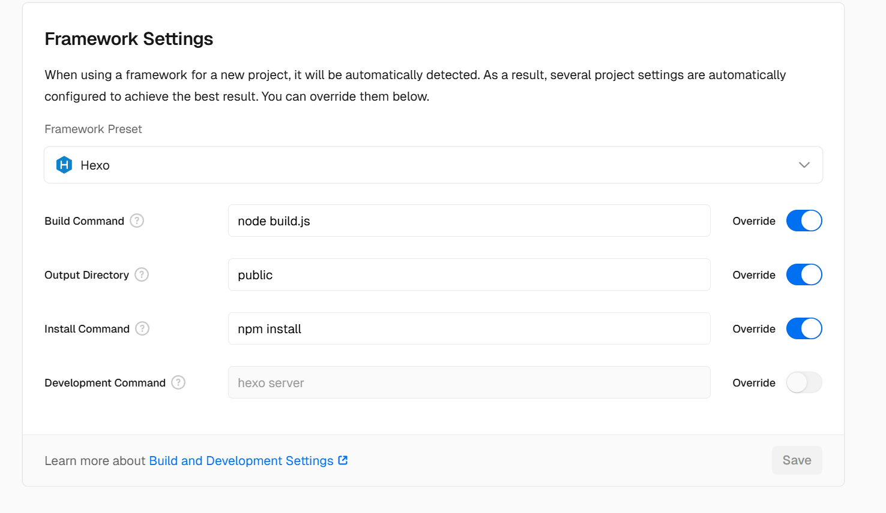

# Hexo搭建/部署个人博客教程

## 前言

参考：

- Hexo基本环境搭建: [https://blog.csdn.net/weixin_45019350/article/details/121901433](https://blog.csdn.net/weixin_45019350/article/details/121901433)。
- NexT主题仓库：[https://github.com/theme-next/hexo-theme-next](https://github.com/theme-next/hexo-theme-next)
- NexT主题使用配置教程：[NexT主题使用配置教程文档](https://hexo-next.readthedocs.io/zh-cn/latest/next/)
_ Vercel部署Hexo博文：[vercel部署hexo](https://www.chipmunk.top/posts/Vercel%E9%9D%99%E6%80%81%E9%A1%B5%E9%9D%A2%E9%83%A8%E7%BD%B2%E4%B8%8E%E5%9F%9F%E5%90%8D%E9%85%8D%E7%BD%AE%E6%95%99%E7%A8%8B/)

也是一时兴起，花了两三天时间使用Hexo搭建了一个个人博客，个人博客链接： [https://www.halfmantou.xyz/](https://www.halfmantou.xyz/) 。目前已经将CSDN所有的博客迁移过去了。当然为了通用性，CSDN的博客还是会持续同步更新。

搭建和部署的过程当中也是或多或少遇到了一些奇奇怪怪的问题，于是特意写此篇阅读来记录一些点点滴滴。

<!-- more -->

## Hexo博客搭建

需要预先准备的环境如下：

> - Node.js v18.19.0（我当前电脑本身装的是这个版本，版本其实不做什么要求！）
> - Git（不限版本）
> - Win11

**本文是Hexo教程，默认用户是了解Git的，所以对于Git、Nodejs环境搭建和使用不做任何讲解！！！**

搭建hexo博客命令如下：

```bash

# 创建一个目录work，进入work目录执行如下命令：

# 安装cnpm
npm install -g cnpm --registry=https://registry.npm.taobao.org

# 安装hexo
cnpm install -g hexo-cli

# hexo 初始化
hexo init hexo-blog
cd hexo-blog

# 安装依赖
cnpm install
```

网站生成与测试：

```bash
# 网站生成
hexo generate

# 网站启动
hexo server
```

> 根据日志提示在浏览器当中输入localhost:4000可以访问到一个最简单的hexo欢迎页。

目前项目结构如下：



- public: `hexo generate` 命令生成的html静态网页。
- source: 我们.md博客存放的目录。主要放在_posts文件夹下。
- themes: 主题代码存放目录，后面我们会给hexo换主题。
- _config.yml: hexo的一些配置信息。

本小节参考自：[https://blog.csdn.net/weixin_45019350/article/details/121901433](https://blog.csdn.net/weixin_45019350/article/details/121901433)。该文当中还讲解了如何将hexo部署到github。最终是将hexo生成的pulibc目录部署到了github，可以通过形如：https://用户名.github.io/方式去访问。并且也提到了由于github访问速度过慢，采用国内的gitee page的方式部署hexo，但是gitee page 机制在2024年已停止使用。所以找来找去，我采用了 花7块钱买了一个国内域名 + vecerl + github的部署方式。成功保证国内可以流程访问我的个人博客，具体部署方式在后面小结进行详细讲解。

## 移植换主题

挑来挑去，我最终选择了NextT主题：[https://github.com/theme-next/hexo-theme-next](https://github.com/theme-next/hexo-theme-next)，具体主题的移植方式可以参考github仓库docs当中的 [文档](https://github.com/theme-next/hexo-theme-next/blob/master/docs/INSTALLATION.md)。该文档是对linux用户友好的，使用的是curl命令组合。在win用户可以直接把发布的最新版本下载下来，然后解压到themes目录，重命名为next。然后修改顶层_config.yml文件：

```yml
theme: next
```

使用 `hexo clean && hexo server` 命令可以看到博客页面主题效果。

一眼看去，你一定会觉得不太对劲，为啥导航栏可能只要 首页/归档 两个页面？和想像的不一样啊？这是因为主题配置文件默认配置比较简单，并且我们的source目录下本来就没有创建关于/标签/分类/归档页面。

[NexT主题使用配置教程文档](https://hexo-next.readthedocs.io/zh-cn/latest/next/)有你想要的关于next配置一切问题的解答，这里就不过多废话。

## 博客迁移

博客迁移的过程当中，最大的问题是就是markdown文件当中图片路径问题。经过一番搜索，需要改顶层的_config.json

```yml
post_asset_folder: true
marked:
  prependRoot: true
  postAsset: true
```

这样按道理hexo会在xxx.md文件同级目录下生成xxx目录，用于存放图片。此时md当中可以使用./xxx/p.png的方式使用相对路径用于图片。

但是，图片还是加载不出来，调试半天发现网页在请求图片时，路径不太对。使用浏览器调试抓包请求路径如下：

```bash
http://localhost:4000/.com//photo/PipelineAndFlow.png
```

这肯定就不对，经过一番搜寻网上大部分结果都是建议将hexo-blog/node_modules/hexo-asset-image/index.js当中的：

```js
$(this).attr('src', config.root + link + src);
console.info&&console.info("update link as:-->"+config.root + link + src);
```

修改为：

```js
$(this).attr('src',  src);
console.info&&console.info("update link as:-->"+ src);
```

这么改确实可以解决在我们点进文章后，图片加载失败的问题。但是我后来发现，在首页预览文章时，如果带有图片，图片还是没加载出来，经过浏览器抓包，文章内部图片请求路径没有问题，但是首页请求图像路径还是存在问题。**最终调试hexo-asset-image的代码发现首页请求的路径居然是相对路径。**



其实应该这么改：

```js
'use strict';
var cheerio = require('cheerio');

// http://stackoverflow.com/questions/14480345/how-to-get-the-nth-occurrence-in-a-string
function getPosition(str, m, i) {
  return str.split(m, i).join(m).length;
}

hexo.extend.filter.register('after_post_render', function(data){
  var config = hexo.config;
  if(config.post_asset_folder){
    var link = data.permalink;
    var beginPos = getPosition(link, '/', 3) + 1;
    var appendLink = '';
    // In hexo 3.1.1, the permalink of "about" page is like ".../about/index.html".
    // if not with index.html endpos = link.lastIndexOf('.') + 1 support hexo-abbrlink
    if(/.*\/index\.html$/.test(link)) {
      // when permalink is end with index.html, for example 2019/02/20/xxtitle/index.html
      // image in xxtitle/ will go to xxtitle/index/
      appendLink = 'index/';
      var endPos = link.lastIndexOf('/');
    }
    else {
      var endPos = link.lastIndexOf('/');
    }
    link = link.substring(beginPos, endPos) + '/' + appendLink;

    var toprocess = ['excerpt', 'more', 'content'];
    for(var i = 0; i < toprocess.length; i++){
      var key = toprocess[i];

      var $ = cheerio.load(data[key], {
        ignoreWhitespace: false,
        xmlMode: false,
        lowerCaseTags: false,
        decodeEntities: false
      });

      $('img').each(function(){
        if ($(this).attr('src')){
          // For windows style path, we replace '\' to '/'.
          var src = $(this).attr('src').replace('\\', '/');
          if(!(/http[s]*.*|\/\/.*/.test(src)
            || /^\s+\//.test(src)
            || /^\s*\/uploads|images\//.test(src))) {
            // For "about" page, the first part of "src" can't be removed.
            // In addition, to support multi-level local directory.
            var linkArray = link.split('/').filter(function(elem){
              return elem != '';
            });
            var srcArray = src.split('/').filter(function(elem){
              return elem != '' && elem != '.';
            });
            if(srcArray.length > 1)
            srcArray.shift();
            src = srcArray.join('/');

            $(this).attr('src', config.root + link + src);
            console.info&&console.info("update link as:-->"+config.root + link + src);
          }
        }else{
          console.info&&console.info("no src attr, skipped...");
          console.info&&console.info($(this));
        }
      });
      data[key] = $.html();
    }
  }
});
```

和源码对比，其实就改了一行：

将原来的：

```js
var endPos = link.lastIndexOf('.');
```

改成了：

```js
var endPos = link.lastIndexOf('/');
```

至此图片路径问题就解决了。

## 博客部署到Vercel

前面提到我的部署方式为： 花7块钱买了一个国内域名 + vecerl + github的部署方式

首先在github创建一个仓库名为hexo-blog（可以任意取名），然后需要将我们创建的 hexo-blog 目录推送到GitHub，命令如下：

```bash
echo "# hexo-blog" >> README.md
git init
git commit -m "first commit"
git branch -M main
git remote add origin https://github.com/LunarStore/hexo-blog.git
git push -u origin main
```

然后就是注册vercel账号、创建vercel项目、购买一个国内域名、为域名设置记录等操作。具体流程可以参考：[vercel部署hexo](https://www.chipmunk.top/posts/Vercel%E9%9D%99%E6%80%81%E9%A1%B5%E9%9D%A2%E9%83%A8%E7%BD%B2%E4%B8%8E%E5%9F%9F%E5%90%8D%E9%85%8D%E7%BD%AE%E6%95%99%E7%A8%8B/)。根据链接一步步来按道理是没有问题。在我们每次更新博文后忽略pulibc等目录，将md和配置更新部分推送到github，vercel会自动到github仓库拉取最新代码，然后编译部署。

但总是有意外，vercel拉取仓库后，在 Hexo build 阶段报错：

```bash
sh: line 1: /vercel/path0/node_modules/.bin/hexo: Permission denied Error: Command "hexo generate" exited with 126
```

也是各种尝试，**最终是修改了在vercel项目创建阶段设置的build命令，并且在 hexo-blog 项目根目录添加了build.js脚本，绕过了使用/vercel/path0/node_modules/.bin/hexo，解决了该问题。**

目前我的Vercel项目 Build Command、Output Directory、 Install Command配置如下：



build.js脚本如下：

```js
const Hexo = require('hexo');

async function build() {
  const hexo = new Hexo(process.cwd(), {
    silent: false
  });
  
  try {
    await hexo.init();
    await hexo.call('generate', {});
    await hexo.exit();
    console.log('Hexo build completed!');
  } catch (error) {
    console.error('Hexo build failed:', error);
    process.exit(1);
  }
}

build();
```

---

**本章完结**