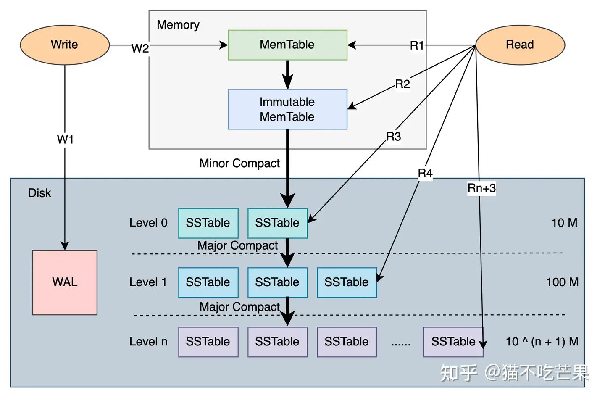
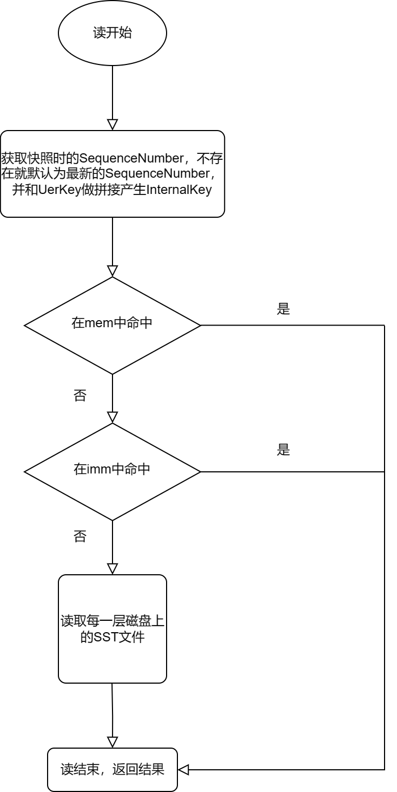
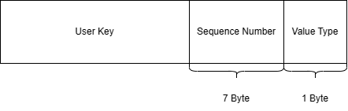
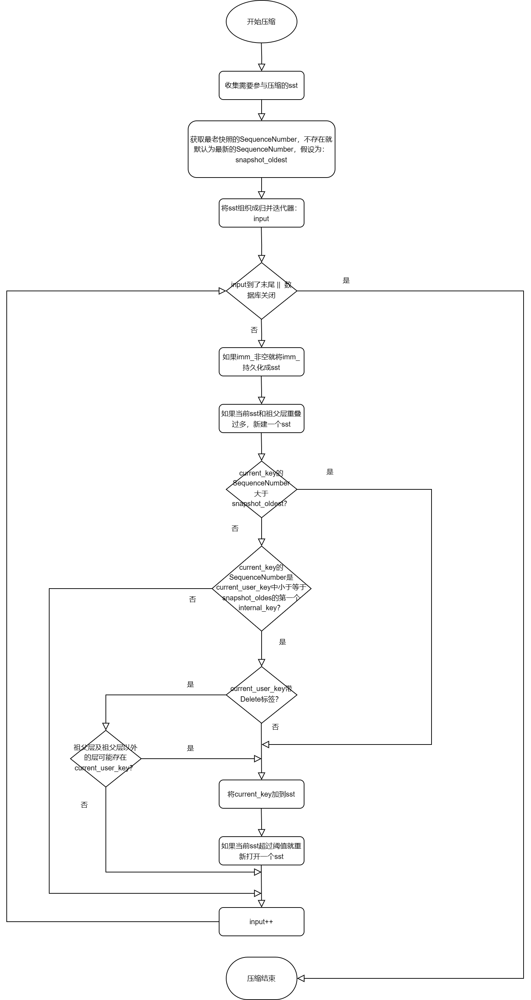

**LeveDB源码笔记系列：**

[LevelDB源码阅读笔记（0、下载编译leveldb）](./Start.md)

[LevelDB源码阅读笔记（1、整体架构）](./Framework.md)

**前言**

对LevelDB源码的博客，我准备采用总-分的形式进行记录，我觉得先了解一下LevelDB整体流程，再往后讲解各个基础组件的话，读者会更容易理解这样设计的用意。

## 性能简介

数据参考自leveldb的README：[https://github.com/google/leveldb](https://github.com/google/leveldb)。
<!-- more -->

### 写性能

分析如下：

1. 顺序写：保证数据按key递增插入到数据库中。因为一个sst中的数据密集，key之间差距不会特别大，所以压缩的时候相邻两层参与压缩的sst不会很多，压缩的压力不会特别大。

2. 每次写入执行sync同步操作：不测也能知道性能不会高到哪里去。

3. 随机写入：程序随机生成key值，插到leveldb中，相对于顺序写，这样会导致一个sst中的数据稀疏，key之间间隔过大，压缩的时候参与压缩的sst可能会更多，所以压缩的压力就会相对大点。

4. 修改或删除数据：结果和随机写入类似，插入和删除会导致一个sst文件的key变的稀疏，导致和随机写差不多的性能。

数据如下：

```
# 顺序写
fillseq      :       1.765 micros/op;   62.7 MB/s

# 每次写入执行sync同步操作
fillsync     :     268.409 micros/op;    0.4 MB/s (10000 ops)

# 随机写入
fillrandom   :       2.460 micros/op;   45.0 MB/s

# 修改或删除数据
overwrite    :       2.380 micros/op;   46.5 MB/s
```

### 读性能

分析如下：

1. 随机读：具备不确定性，可能需要读n多个sst文件，如果sst文件不在cache中，又会涉及单个sst文件data index block的磁盘寻道和解压缩（可能需要解析n多个不在cache中的sst文件。）。所以性能上不去。

2. 顺序读：level读数据是创建一个外部归并迭代器，顺序读从一定程度上减少了对一个sst文件的反复解析（因为cache有限，被缓存的sst会被lru算法置换出去），同时也减轻了data_block的反复解压和磁盘寻道的代价。

3. 反向读：因为leveldb的sst文件data_block它的key是存在前缀压缩的，每个key相当于是一个增量key，想从一个key知道前一个key，必须从重启点重新解析，这个过程涉及到一个while循环，所以反向读性能会比顺序读要差点。


数据如下：

```
# 随机读
readrandom  : 16.677 micros/op;  (approximately 60,000 reads per second)

# 顺序读
readseq     :  0.476 micros/op;  232.3 MB/s

# 反向读
readreverse :  0.724 micros/op;  152.9 MB/s
```

根据leveldb的源码实现，考虑数据量很大，cache不命中的情况下，开销主要在每次读key至少都要进行的2次磁盘寻道（读data index block和data block），同时带来的data block的反复解压也是瓶颈所在，所以增大cache的大小一定程度上能改善leveldb的读性能。如下：

```
readrandom  : 9.775 micros/op;  (approximately 100,000 reads per second before compaction)
readrandom  : 5.215 micros/op;  (approximately 190,000 reads per second after compaction)
```

## 架构简介

图片引用自知乎（[https://zhuanlan.zhihu.com/p/206608102](https://zhuanlan.zhihu.com/p/206608102)）若有侵权，可联系我将其删除，另外这篇文章也是讲LevelDB的，讲的非常好，推荐大家也可以去看看。LevelDB架构图如下：



LevelDB内存中使用了跳表：mem_（内存跳表）、imm（只读内存跳表）。

LevelDB在磁盘数据结构上：设计了SSTable只读磁盘数据结构。并且SST是按分层组织的。

使用两种形式的内存跳表：mem_和imm_，mem_相当于是前台的buff供用户读写数据，而imm_为写满了的mem_充当一种临时容器，这样做的好处是能让imm_和后台Compaction线程打交道（置换）。当后台Compaction线程繁忙时，不至于说写满了的mem_没地方放，从而需要阻塞去等待后台Compaction线程的压缩。imm_的角色本质上和Muduo异步日志的AsyncLogging::buffers_是一样的。当然LevelDB的前台缓存：mem_、imm_，后台Compaction线程的设计，是双缓冲技术的实践。

### LevelDB的快照读流程

1. 获取快照时的SequenceNumber，不存在默认为最新的SequenceNumber。

2. 先读取内存中的跳表：mem_（内存跳表），找到返回，没找到继续。

3. 再读内存中的只读跳表：imm_（只读内存跳表），找到返回，没找到继续。

4. 按层查找sst文件。

    - 对于第0层sst文件，由于第0层sst文件之间是存在重叠的，所以会顺序查找第0层的每个和key有重叠的sst文件。（涉及多个sst文件）。

    - 对于其他层，由于leveldb在压缩的时候就保证了其sst之间是不存在重叠的，所以，其他层的查找就会采用二分的形式去定位可能包含key的sst文件，当然，这种情况下，其他层的key的查找最多涉及一个sst文件。（最多涉及一个sst文件）。

5. 找到返回OK和对应的value，找不到返回NotFound。

从后面SST以及双层迭代器的源码分析我们就可以看到，因为sst结构设计的精妙，LevelDB对SST的查找也是使用了二分。这里就不过多赘述。

LevelDB的读流程图如下：



### LevelDB的写流程（删除，插入，修改

1. 如果存在多个线程并发写，将请求写的所有线程放到一个队列里面，仅让位于对头的线程执行下面真正的写操作，其他线程阻塞在条件变量上。

2. 执行MakeRoomForWrite，确保mem_有足够的空间写。如果第0层的sst文件数达到阈值config::kL0_SlowdownWritesTrigger(默认8个sst)，就触发慢写（sleep1000微妙后再来尝试MakeRoomForWrite）；如果第0层的sst文件达到阈值config::kL0_StopWritesTrigger（默认12个sst），就触发停止写（阻塞在条件变量上，等待Compaction线程的唤醒）；如果mem_满了 && imm_为nullptr，就将mem_转换为imm_，并清空mem_；如果mem_满了 && imm_非nullptr，也即后台Compaction线程繁忙，来不及压缩imm_，就阻塞在条件变量上，等待后台Compaction线程的唤醒。

3. 做一个BuildBatchGroup的操作：将其他线程请求写的kv对 合并。

4. 将3合并的数据写到WAL日志中。

5. 将3合并的数据统一写到mem_中。

6. 唤醒其他阻塞的线程，并且从队列中移除。同时，必要的话，唤醒下一个队头执行写操作。

在LevelDB中，删除、插入、修改均是向mem_中插入一条包装过的key（InternalKey）。

InternalKey的组成：



- UserKey：用户提供的key。

- **SequenceNumber：由全局逻辑计时器提供，能保证key不重复，并方便实现快照读，有效解决了并发情况下的幻读、脏读的问题。**

- ValueType：存在两个值：kTypeDeletion和kTypeValue。

删除：是插入一条ValueType为kTypeDeletion的InternalKey。插入和修改：都是插入一条带kTypeValue的InternalKey。

那么LevelDB是如何确定一个key最新状态是删除还是插入呢？如果对key进行了修改，又如何知道它的最新值能？删除也是插入key的话，怎么保证删除之前的key删除干净呢？

要解决上面的问题，SequenceNumber字段就起到了关键作用。LevelDB整体上会以UserKey升序，当UserKey相同时，会以SequenceNumber降序排列。因为SequenceNumber最大的靠前排，这样就保证了在查询的时候最先获取到一个key的最新状态（是否删除、没删除的话最近一次修改的Value是多少？）。而真正的删除会在压缩阶段进行。

同时SequenceNumber可以很好的实现快照读，而快照读就是，用户可以拍下数据库某一时刻的快照（会记录当时的SequenceNumber），然后拿着这份快照（SequenceNumber）可以随时访问当时的数据。

引用陈硕的话，这其实是一种记流水账的思想（追加写），不管是删除、插入还是修改，都是在末尾记录一下，而不会去动以前的记录。这也是LevelDB精华所在。

### LevelDB的压缩流程

压缩作为LSMTree的核心组件之一，在LevelDB中由后台专门的一个线程执行。本质上讲压缩就是剔除最老的快照时的的冗余key，只保留key最新的记录。压缩过程中同样重要的有：压缩时机？压缩哪一层的哪一个sst？对sst以什么策略进行分割？如何控制sst和祖父间的关系？为什么LevelDB设置成7层？sst文件大小为什么默认2M？每层的sst文件数量为什么默认是那么多？

这些问题LevelDB都有具体的策略和参数进行控制，目前作者的功力有限，有些地方还未能完全明白用意，所以此处仅简述一下大概的压缩流程。

压缩流程图如下：



具体流程如下述：

1. 确定要压缩的sst文件，假设该sst文件在level层，收集level层和level + 1层和sst文件有重叠的所有sst文件。

2. 获取最老的快照的SequenceNumber，不存在默认为最新的SequenceNumber这里假设为snapshot_oldest。

3. 将1中收集到的sst文件建立成一个多路归并迭代器。并将迭代器指向首个元素（最小的）。

4. 遍历归并迭代器，迭代器的元素按UserKey升序 && UserKey相同的按SequenceNumber降序排列。就同一个key来说，用以下规则决定其去留。

    - 对于SequenceNumber大于snapshot_oldest的，全部保留。而小于等于snapshot_oldest的以如下规则压缩。

    - 只对第一个小于等于snapshot_oldest的key继续下面的判断，其他的太老的直接忽略。

    - 对于带TypeDeletion标签的key（假设Internal Key为kD），如果level + 2以及以外的层不可能也包含k，该key就会在本次压缩中直接删除。如果level + 2以及以外的层可能也包含k，kD会保留下来，写到sst文件中，在随后的压缩中再一起删除干净。
    
    - 对于带kTypeValue标签的key保留即可。

5. 在遍历归并迭代器过程中，会按序建立sst文件，建立sst文件的过程中，还会按设定大小对sst文件进行一个切割，防止单个sst文件过大。单个sst文件与祖父层重叠大小太大也会被切割，重新建立一个新的sst文件。

6. 将输出的sst文件放到level + 1层。

## 总结

理想情况下:

- LevelDB的读操作：最多会涉及2次磁盘IO（读data index block和data block）。

- LevelDB的写操作（插入、修改、删除）：是直接插到内存，不涉及磁盘IO。但在随后的压缩的过程中，可能会涉及一些磁盘IO（在归并迭代器中遍历sst时涉及磁盘读，将压缩的数据输出到磁盘时涉及磁盘顺序写）。

---

**本章完结**