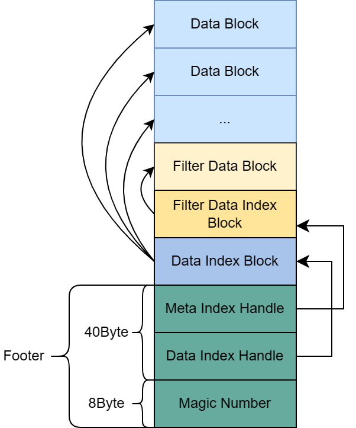
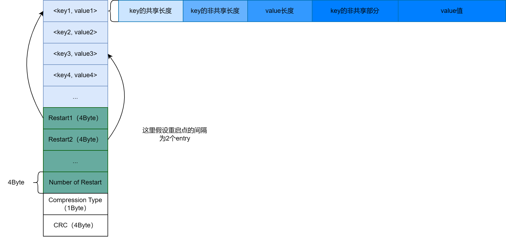
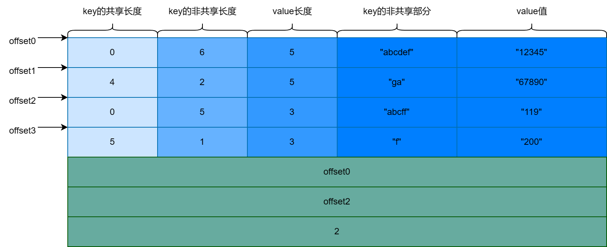
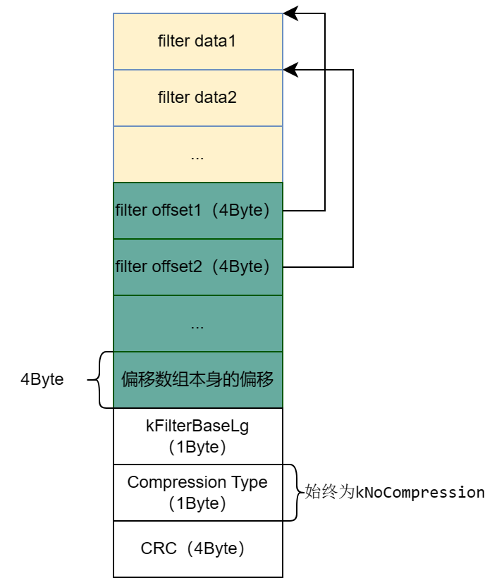

**LeveDB源码笔记系列：**

[LevelDB源码阅读笔记（0、下载编译leveldb）](./Start.md)

[LevelDB源码阅读笔记（1、整体架构）](./Framework.md)

[LevelDB源码阅读笔记（2、SSTable源码分析）](./SSTable.md)

**前言**

本文讨论的Key都是LevelDB里面的Internal Key，至于什么是Internal Key请看[LevelDB源码阅读笔记（1、整体架构）](./Framework.md)。另外本文的源码分析涉及Bloom过滤器的应用，不懂什么是Bloom过滤器的读者需自行学习。

SSTable的结构有关的的文件全部放在table目录下：
<!-- more -->

1. block_builder：组建一个block结构。data_block、filter_index_block、data_indedx_block都在使用该结构。

2. block：创建一个迭代器，对一个block结构进行读取。该迭代器也是LevelDB最小单元的迭代器。

3. filter_block：在LevelDB中就是bloom data block，区别于block结构。

4. format：对SSTable的Footer进行序列化和反序列化，此外还有从sst文件中读取block结构的功能。

5. iterator：对单层迭代器做定义。

6. merger：对归并迭代器做定义。

7. table_builder：组建一个sst文件。

8. table：解析一个sst文件。

9. two_level_iterator：对双层迭代器做定义。**该迭代器的设计非常精妙，是LevelDB查找的基石。**

## SSTable整体结构

### 总览

SSTable文件结构如图所示：




对各个部分的解释：

1. Data Block：递增的存储键值对。

2. Filter Data Block：本质是bloom过滤器映射块，映射了Data Block中的每一条键值对，减少了无效查询的IO，优化了查询性能。

3. Filter Data Index Block：内部结构和Data Block是一样的，只不过Key代表Filter Data Block的名字，而Value存的是Filter Data Block的文件偏移和大小。

4. Data Index Block：内部结构和Data Block是一样的，只不过Key是Data Block最后一条键值对的Key，而Value存的是Data Block的文件偏移和大小。

5. Footer：存放Meta Index Handle + Data Index Handle + Magic Number。

**注意，这里的Meta Index Handle就是Filter Data Index Block的文件偏移和大小； Data Index Handle就是Data Index Block的文件偏移和大小。**


### SSTable的写入流程

通过leveldb::TableBuilder组建一个sst的流程如下：

1. 通过Add函数，不断将输入的<key, value>写入data_block，同时在filter_data_block（（bloom过滤器）中记录该key。当一个data_block大于4k（默认情况下是4k）时，就将data_block  flush到文件并切换新的data_block继续写。同时还会记录每块data_block最后一条key值以及data_block到文件开始的偏移 和 其大小（ Data Block Handle）。将这些信息也作为一对键值对（<data_block_last_key, data_block_handle>）写入到data_index_block中。

2. 当sst达到2M（默认是2M）就会调用Finish函数结束sst的构建，结束过程如下。

3. 将不足4k的data_block 像1一样Flush到文件。

4. 将filter_data_block写到文件，创建filter_data_block_handle记录其文件偏移和大小

5. 将filter_name作为key、filter_data_block_handle作为value写到一个filter_data_index_block中，并将filter_data_index_block写入文件，创建filter_data_index_block_handle记录filter_data_index_block的文件偏移和大小。

6. 将data_index_block写到文件，创建data_index_block_handle记录其偏移和大小。

7. 将filter_data_index_block_handle（Meta Index Handle）、data_index_block_handle（Data Index Handle）以及MagicNumber作为Footer一起写到文件中。至此sst文件构建完毕。


部分代码如下：

```cpp
void TableBuilder::Add(const Slice& key, const Slice& value) {
  Rep* r = rep_;
  assert(!r->closed);
  if (!ok()) return;
  if (r->num_entries > 0) {
    // 输入的key一定是递增的！
    assert(r->options.comparator->Compare(key, Slice(r->last_key)) > 0);
  }
 // 延迟追加index_block，因为需要计算合适的key
  if (r->pending_index_entry) { 
    // 下一个datablock写入第一条数据之前，data_block为空
    assert(r->data_block.empty());
    // 保证大于等于真正的last_key且小于key的前提压缩last_key
    r->options.comparator->FindShortestSeparator(&r->last_key, key);
    std::string handle_encoding;
    r->pending_handle.EncodeTo(&handle_encoding);
    r->index_block.Add(r->last_key, Slice(handle_encoding));
    r->pending_index_entry = false;
  }

  if (r->filter_block != nullptr) {
    // filter和datablock对应
    r->filter_block->AddKey(key);
  }

  r->last_key.assign(key.data(), key.size());
  r->num_entries++;
  r->data_block.Add(key, value);

  const size_t estimated_block_size = r->data_block.CurrentSizeEstimate();
  if (estimated_block_size >= r->options.block_size) {  // 未压缩的block
    Flush();
  }
}

Status TableBuilder::Finish() {
  Rep* r = rep_;
   // 将不足4k的datablock存到文件中 data_block
  Flush(); 
  assert(!r->closed);
  r->closed = true;

  BlockHandle filter_block_handle, metaindex_block_handle, index_block_handle;

  // Write filter block// 将filter_data_block写到文件，记录其文件偏移和大小
  if (ok() && r->filter_block != nullptr) { //filter_data_block
    WriteRawBlock(r->filter_block->Finish(), kNoCompression,
                  &filter_block_handle);
  }

  // Write metaindex block// 将filter_data_block的信息写到一个filter_data_index_block中
  if (ok()) {     // filter_data_index_block
    BlockBuilder meta_index_block(&r->options);
    if (r->filter_block != nullptr) {
      // Add mapping from "filter.Name" to location of filter data
      std::string key = "filter.";
      key.append(r->options.filter_policy->Name());
      std::string handle_encoding;
      filter_block_handle.EncodeTo(&handle_encoding);
      meta_index_block.Add(key, handle_encoding);
    }
    // 并将filter_data_index_block写入文件，记录filter_data_index_block的文件偏移和大小。
    // TODO(postrelease): Add stats and other meta blocks
    WriteBlock(&meta_index_block, &metaindex_block_handle);
  }

  // Write index block
  if (ok()) {     // data_index_block
    if (r->pending_index_entry) {
      r->options.comparator->FindShortSuccessor(&r->last_key);
      std::string handle_encoding;
      r->pending_handle.EncodeTo(&handle_encoding);
      r->index_block.Add(r->last_key, Slice(handle_encoding));
      r->pending_index_entry = false;
    }
    // 将data_index_block写到文件，并记录其偏移和大小。
    WriteBlock(&r->index_block, &index_block_handle);
  }

  // Write footer   // 将filter_data_index_block、data_index_block的文件偏移和大小以及MagicNumber作为Footer一起写到文件中。至此sst文件构建完毕。
  if (ok()) {
    Footer footer;
    footer.set_metaindex_handle(metaindex_block_handle);
    footer.set_index_handle(index_block_handle);
    std::string footer_encoding;
    footer.EncodeTo(&footer_encoding);
    r->status = r->file->Append(footer_encoding);
    if (r->status.ok()) {
      r->offset += footer_encoding.size();
    }
  }
  return r->status;
}
```

**这里还需注意，凡是block的结构在写入SSt文件前都会被压缩，比如data_block、filter_data_index_block、data_index_block，而filter data block是未被压缩的！**


我们可以看到Add函数中有对key做了一个断言，断言内容大致是要保证key必须是递增的，所以SST文件内部就是有序的键值对，data_block内部是递增 -> 每个data_block最后一条key之间也是递增 -> data_index_block的key值也会是递增，这样带来的好处就是可以**通过二分查找的方式帮助我们快速定位一个key的位置**，在下面Block块的解析我们就会恍然大悟。


### SSTable的解析流程

了解了SSTable的写入流程，其解析流程就非常明了了，如下。

1. 先读取SSTable的48字节的Footer，可以获取到Meta Index Handle和Data Index Handle。

2. 通过Data Index Handle可以读到SSTable文件中的data_index_block。并将data_index_block存到rep_成员中。有了data_index_block就可以定位所有的data_block了。

3. 通过Meta Index Handle找到filter_data_index_block。

4. 通过filter_data_index_block从sst中读出filter_data_block，并将其存入rep_的成员中。在查找sst的键值对时，先会在filter_data_block（bloom过滤器）中查看键是否存在，存在，才再磁盘上去读取和解压具体的data_block。

5. 至此解析完毕，有了filter_data_block和data_index_block足以定位每一个data_block以及里面的键值对。

**需要注意的是和构建SSTable对称的是，每一个data_block、data_index_block、filter_data_index_block从文件中读取后都会涉及到解压！**

### SSTable的查询流程

**不使用双层迭代器**

1. 调用Table::InternalGet接口。

2. 获取data_index_block（结构和data_block一样）的迭代器，对其进行二分查找，找到第一个大于等于traget的data_block的handle_value。

3. 到filter_data_lock中验证traget的存在性，不存在直接返回，否者继续。

4. 根据handle_value从磁盘中读取data_block。（当然data_block可能被LRU Cache缓存下来）。

5. 根据data_block创建一层迭代器对traget进行二分查找。

**使用双层迭代器**

调用Table::NewIterator接口，创建一个二层迭代器，该迭代器里面有两个迭代器，一个index迭代器，另一个是data迭代器。基于SSTable创建的双层迭代器其index迭代器是index_data_block的单层迭代器，data迭代器是每一个动态创建的data_block的单层迭代器。双层迭代器的巧妙之处就是能够根据index迭代器，去动态创建data迭代器。这样的特性在进行外部归并排序时是非常有用的！此外双层迭代器还有嵌套的玩法，LevelDB就有利用嵌套双层迭代器去遍历LevelDB的某一层（level > 0，不包括0层，因为0层不具备有序不重叠的特性）。

## Data Block的整体结构

### 总览

Data Block的具体细节如下图：




这里难理解的可能就是前缀压缩那块，举个例子有连续的键值对如下：

> { <abcdef, 12345>, <abcdga, 67890>, <abcff, 119>, <abcfff, 200> }

重启点间隔为2的话，在data_block中会被前缀压缩成如下结构：




前缀压缩的好处是，sst消耗的磁盘空间减少了，但其坏处是在查找的时候，考虑到复原重启点间隔内的键需要参考前一个条目的键，就需要从重启点开始进行一段顺序查找。幸运的是，LevelDB提供了设置重启点间隔的参数，Options::block_restart_interval默认值是16，当block_restart_interval太大，会导致压缩率更大而查询性能会降低；当block_restart_interval太小，会导致压缩率更小而查询性能会增加。用户可以根据实际的需求调节参数进行适当的取舍。

### Data Block的写入流程

Data Block的写入流程相对容易理解，如下：

1. 写入key的共享长度。当然如果位于重启点，共享长度恒为0

2. 写入key的非共享长度。

3. 写入value长度。

4. 写入key的非共享长度。

5. 写入value值。

6. 当data_block大于4K，就会调用Finish函数，Finish函数会将重启数组以及其大小追加到data_block的末尾。

7. data_block在写入文件前会进行一次算法层面的压缩（kSnappyCompression / kZstdCompression），并会进行校验和的计算。压缩类型和校验和 会作为data_block的Footer一起写入sst文件中。

代码如下：

```cpp

class BlockBuilder {
    /*
    *   ...
    */

 private:
  const Options* options_;
  std::string buffer_;              // Destination buffer
  std::vector<uint32_t> restarts_;  // Restart points
  int counter_;                     // Number of entries emitted since restart
  bool finished_;                   // Has Finish() been called?
  std::string last_key_;
};

void BlockBuilder::Reset() {
  buffer_.clear();
  restarts_.clear();
  restarts_.push_back(0);  // First restart point is at offset 0
  counter_ = 0;
  finished_ = false;
  last_key_.clear();
}

size_t BlockBuilder::CurrentSizeEstimate() const {
  return (buffer_.size() +                       // Raw data buffer
          restarts_.size() * sizeof(uint32_t) +  // Restart array
          sizeof(uint32_t));                     // Restart array length
}

Slice BlockBuilder::Finish() {
  // Append restart array
  for (size_t i = 0; i < restarts_.size(); i++) {
    PutFixed32(&buffer_, restarts_[i]);
  }
  PutFixed32(&buffer_, restarts_.size());
  finished_ = true;
  return Slice(buffer_);
}
//递增的顺序加进来
//使用前缀共享的方式微压缩了一下
void BlockBuilder::Add(const Slice& key, const Slice& value) { 
  Slice last_key_piece(last_key_);
  assert(!finished_);
  assert(counter_ <= options_->block_restart_interval);
  assert(buffer_.empty()  // No values yet?
         || options_->comparator->Compare(key, last_key_piece) > 0);
  size_t shared = 0;
  if (counter_ < options_->block_restart_interval) {
    // See how much sharing to do with previous string
    const size_t min_length = std::min(last_key_piece.size(), key.size());
    while ((shared < min_length) && (last_key_piece[shared] == key[shared])) {
      shared++;
    }
  } else {
    // 记录重启点
    // Restart compression
    restarts_.push_back(buffer_.size());
    counter_ = 0;
  }
  const size_t non_shared = key.size() - shared;

  // Add "<shared><non_shared><value_size>" to buffer_
  PutVarint32(&buffer_, shared);
  PutVarint32(&buffer_, non_shared);
  PutVarint32(&buffer_, value.size());

  // Add string delta to buffer_ followed by value
  buffer_.append(key.data() + shared, non_shared);
  buffer_.append(value.data(), value.size());

  // Update state
  last_key_.resize(shared);
  last_key_.append(key.data() + shared, non_shared);
  assert(Slice(last_key_) == key);
  counter_++;
}
```

**在Add函数的前面，我们又可以看到保证key递增的断言。**

### Data Block的解析和查询流程

#### 解析

1. 先根据data_block的Footer核对校验和，然后根据Footer的指示对data_block进行解压。

2. 获取重启数组大小，计算重启数组在data_block的偏移。将重启数组的偏移记录在Block::restart_offset_中.

伪代码如下：

```cpp
inline uint32_t Block::NumRestarts() const {
  assert(size_ >= sizeof(uint32_t));
  return DecodeFixed32(data_ + size_ - sizeof(uint32_t));
}
//Block Reader
Block::Block(const BlockContents& contents)
    : data_(contents.data.data()),
      size_(contents.data.size()),
      owned_(contents.heap_allocated) {
    
    // 这里的size_就是data_block的大小，减去重启数组本身和重启数组大小值的大小，即可定位到重启数组的偏移。
    restart_offset_ = size_ - (1 + NumRestarts()) * sizeof(uint32_t);
}

// 从sst中根据handle去解析一个data_block
Status ReadBlock(RandomAccessFile* file, const ReadOptions& options,
                 const BlockHandle& handle, BlockContents* result) {
  result->data = Slice();
  result->cachable = false;	// 是否可cache
  result->heap_allocated = false;	// 是否需要手动free？

  // Read the block contents as well as the type/crc footer.
  // See table_builder.cc for the code that built this structure.
  size_t n = static_cast<size_t>(handle.size());
  char* buf = new char[n + kBlockTrailerSize];
  Slice contents;
  Status s = file->Read(handle.offset(), n + kBlockTrailerSize, &contents, buf);
  if (!s.ok()) {
    delete[] buf;
    return s;
  }
  if (contents.size() != n + kBlockTrailerSize) {
    delete[] buf;
    return Status::Corruption("truncated block read");
  }

	// 检测校验和。
  // Check the crc of the type and the block contents
  const char* data = contents.data();  // Pointer to where Read put the data
  if (options.verify_checksums) {
    const uint32_t crc = crc32c::Unmask(DecodeFixed32(data + n + 1));
    const uint32_t actual = crc32c::Value(data, n + 1);
    if (actual != crc) {
      delete[] buf;
      s = Status::Corruption("block checksum mismatch");
      return s;
    }
  }

  switch (data[n]) {
    case kNoCompression:
	// 解压...
      break;
    case kSnappyCompression: {
	// 解压...
      break;
    }
    case kZstdCompression: {
	// 解压...
      break;
    }
    default:
      delete[] buf;
      return Status::Corruption("bad block type");
  }

  return Status::OK();
}

```

至此data_block的解析完毕，接下来介绍data_block如何查询一个key。

#### 查询

首先要明确的是，重启点的key是完整的，可以直接进行比较。

1. 对重启数组进行二分，查询最后一个小于target的重启点

2. 从被定位到的重启点开始，顺序扫描去解析还原每一个key，知道找到了第一个大于等于target的entry。

二分代码如下：

```cpp
class Block::Iter : public Iterator {
  void Seek(const Slice& target) override {
    uint32_t left = 0;
    uint32_t right = num_restarts_ - 1;
    int current_key_compare = 0;

    if (Valid()) {
      current_key_compare = Compare(key_, target);
      if (current_key_compare < 0) {    // 初步缩小二分范围
        // key_ is smaller than target
        left = restart_index_;
      } else if (current_key_compare > 0) {
        right = restart_index_;
      } else {
        // We're seeking to the key we're already at.
        return;
      }
    }
    //找最后一个小于target的重启点
    while (left < right) {
      //向上取整以免只有两个元素时死循环
      uint32_t mid = (left + right + 1) / 2;
      uint32_t region_offset = GetRestartPoint(mid);
      uint32_t shared, non_shared, value_length;
      const char* key_ptr =
          DecodeEntry(data_ + region_offset, data_ + restarts_, &shared,
                      &non_shared, &value_length);
      if (key_ptr == nullptr || (shared != 0)) {
        CorruptionError();
        return;
      }
      Slice mid_key(key_ptr, non_shared);   //重启点的非共享key就是完整的key
      if (Compare(mid_key, target) < 0) {
        left = mid;
      } else {
        right = mid - 1;
      }
    }

    assert(current_key_compare == 0 || Valid());
    bool skip_seek = left == restart_index_ && current_key_compare < 0;   //如果target所在重启区域和原本的key所在重启区域相同，且target在原本key的右方，就不用重置重启点
    if (!skip_seek) {
      SeekToRestartPoint(left);
    }
    // 顺序解析，找第一个大于等于target的key
    while (true) {   
      if (!ParseNextKey()) {
        return;
      }
      if (Compare(key_, target) >= 0) {
        return;
      }
    }
  }
};
```

## Filter Data Block整体结构

### 总览

filter_data_block的结构如下：




**注意，这里filter data本质就是bloom过滤器的位数组。**

简单理解，LevelDB为每个data_block块都分配了一个filter_data，深入源码分析，其实随着用户对data_block默认大小的调节，当data_block够小时，不同的data_block可能共用同一个filter_data的（多个data_block共用偏移数组的同一个entry）；当data_block够大时，一个data_block可能会占用偏移数组的多个entry（1个、2个、3个...） 我们在filter_data_block的写入分析中做更详细的解释。

### Filter Data Block的写入流程

filter_data_block的写入流程如下：

1. 搜集传进来的key。

2. 每当一个data_block写入完毕，SST那里就会调用一下FilterBlockBuilder::StartBlock，该函数会根据传进来的**下一个data_block在文件中的偏移（假设为data_block_next_offset）**计算data_block_next_offset在偏移数组中的下标。这里的计算是指求data_block_next_offset / kFilterBase值，**并且其间的间隔，都会以上一个filter_data的结尾偏移来填充。**

3. SSTable调用的TableBuilder::Finish()时，filter_data_block会调用自己的FilterBlockBuilder::Finish()，计算剩余的filter_data的bloom位数组，然后将偏移数组、将偏移数组本身的偏移、kFilterBaseLg（11）写到filter_block中。

代码如下：

```cpp
// Generate new filter every 2KB of data
static const size_t kFilterBaseLg = 11;
static const size_t kFilterBase = 1 << kFilterBaseLg;

FilterBlockBuilder::FilterBlockBuilder(const FilterPolicy* policy)
    : policy_(policy) {}
// block_offset 是一个data块（被压缩过的）在sst文件中的偏移
void FilterBlockBuilder::StartBlock(uint64_t block_offset) {
  uint64_t filter_index = (block_offset / kFilterBase);
  assert(filter_index >= filter_offsets_.size());
  // 重点!!!
  // block_ofsset就是block_data到文件头的偏移，filter_offset.size()要和每次传进来的block_offset / kFilterBase算出来的index保持一致,
  // 过大就用filterdata结束偏移填充。


  // 两次传入的block_offset计算出来的filter_index差值可能过大（大于2），
  // 此时除了第一次调用的GenerateFilter填充上一个bllom_filter的起点外，
  // 其余的GenerateFilter循环直接用上一个bloom_filter终点填充
  while (filter_index > filter_offsets_.size()) {
    GenerateFilter();
  }
}

void FilterBlockBuilder::AddKey(const Slice& key) {
  Slice k = key;
  start_.push_back(keys_.size());
  keys_.append(k.data(), k.size());
}

Slice FilterBlockBuilder::Finish() {
  if (!start_.empty()) {
    GenerateFilter();
  }

  // Append array of per-filter offsets
  const uint32_t array_offset = result_.size();
  for (size_t i = 0; i < filter_offsets_.size(); i++) {
    PutFixed32(&result_, filter_offsets_[i]);
  }

  PutFixed32(&result_, array_offset);
  result_.push_back(kFilterBaseLg);  // Save encoding parameter in result
  return Slice(result_);
}

void FilterBlockBuilder::GenerateFilter() {
  const size_t num_keys = start_.size();
  if (num_keys == 0) {
    // Fast path if there are no keys for this filter
    filter_offsets_.push_back(result_.size());
    return;
  }

  // Make list of keys from flattened key structure
  start_.push_back(keys_.size());  // Simplify length computation // 方便长度计算
  tmp_keys_.resize(num_keys);
  for (size_t i = 0; i < num_keys; i++) {   // 从keys中提取每个key，并保存到tmp_keys中
    const char* base = keys_.data() + start_[i];
    size_t length = start_[i + 1] - start_[i];
    tmp_keys_[i] = Slice(base, length);
  }

  // Generate filter for current set of keys and append to result_.
  filter_offsets_.push_back(result_.size());// 压入当前bloom块的偏移量
  policy_->CreateFilter(&tmp_keys_[0], static_cast<int>(num_keys), &result_);

  tmp_keys_.clear();
  keys_.clear();
  start_.clear();
}
```

这段代码可能难理解的就是：FilterBlockBuilder::StartBlock函数里面的while循环，使用while循环的目的是，data_block的文件偏移到filter_data_block的偏移数组映射的同步。如果data_block的默认大小被用户调的特别大，每个data_block的 **data_block的文件偏移 / kFilterBase** 的值差异会非常大，反映在filter_data_block的偏移数组上就是：相邻两个data_block在偏移数组上的索引相差会很大（相差3个、4个、n个索引。）而这段filter data offset所有的值会用后一个data_block的filter_data的起始偏移填充。所以while循环就是起到同步索引的效果。这里要好好体会其涉设计的妙处。

### Filter Data Block的读取流程

Filter Data Block在构造函数中会：提取偏移数组的偏移、kFilterBaseLg（11），计算偏移数组的大小。

1. 根据传进来的block_offset计算它在偏移数组的下标。

2. 读取filter_data。

3. 通过bloom位数组判断target是否存在。

部分代码如下：

```cpp
FilterBlockReader::FilterBlockReader(const FilterPolicy* policy,
                                     const Slice& contents)
    : policy_(policy), data_(nullptr), offset_(nullptr), num_(0), base_lg_(0) {
  size_t n = contents.size();
  if (n < 5) return;  // 1 byte for base_lg_ and 4 for start of offset array
  base_lg_ = contents[n - 1];
  uint32_t last_word = DecodeFixed32(contents.data() + n - 5);
  if (last_word > n - 5) return;
  data_ = contents.data();
  offset_ = data_ + last_word;
  num_ = (n - 5 - last_word) / 4;
}

bool FilterBlockReader::KeyMayMatch(uint64_t block_offset, const Slice& key) {
  uint64_t index = block_offset >> base_lg_;
  if (index < num_) {
    uint32_t start = DecodeFixed32(offset_ + index * 4);
    uint32_t limit = DecodeFixed32(offset_ + index * 4 + 4);
    if (start <= limit && limit <= static_cast<size_t>(offset_ - data_)) {
      Slice filter = Slice(data_ + start, limit - start);
      return policy_->KeyMayMatch(key, filter);
    } else if (start == limit) {
      // Empty filters do not match any keys
      return false;
    }
  }
  return true;  // Errors are treated as potential matches
}
```


---

**本章完结**