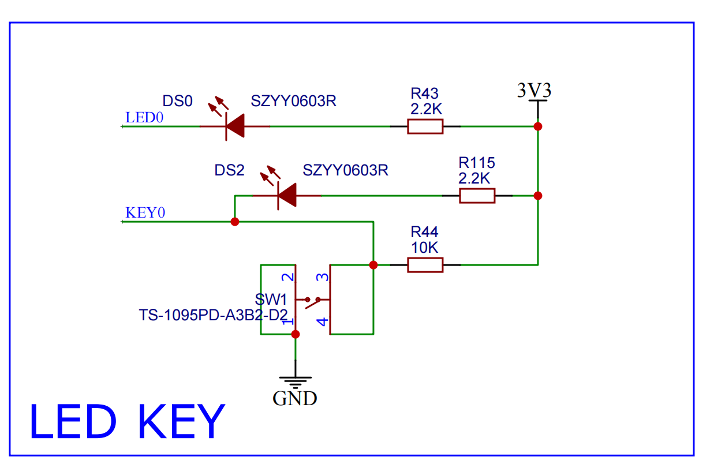
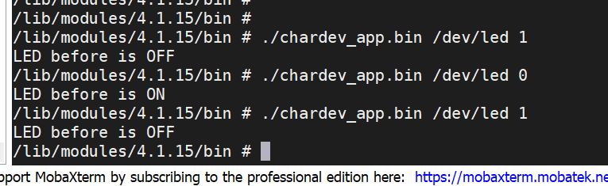
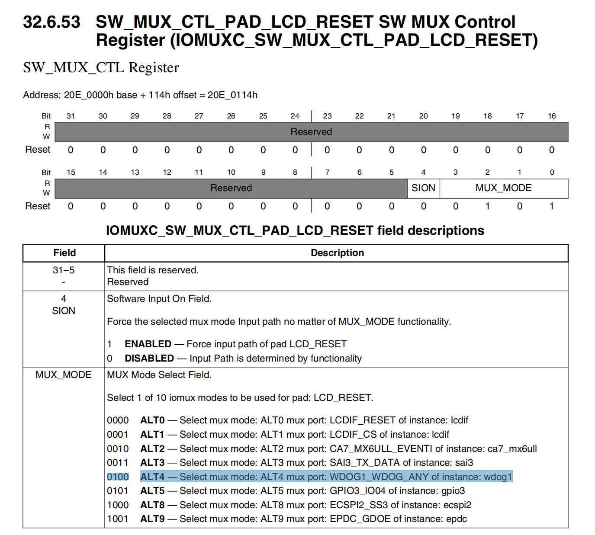
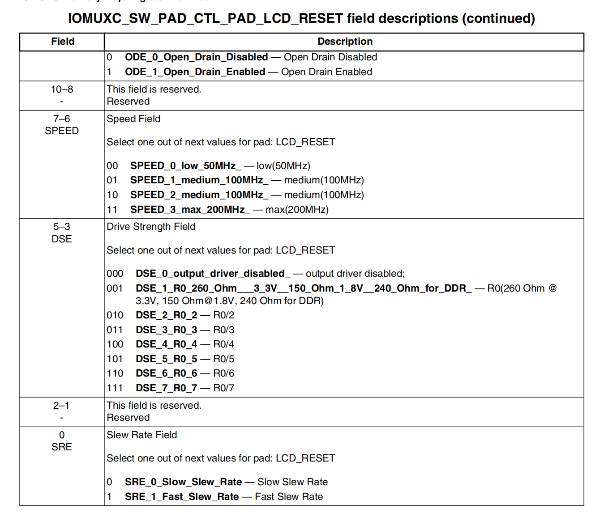
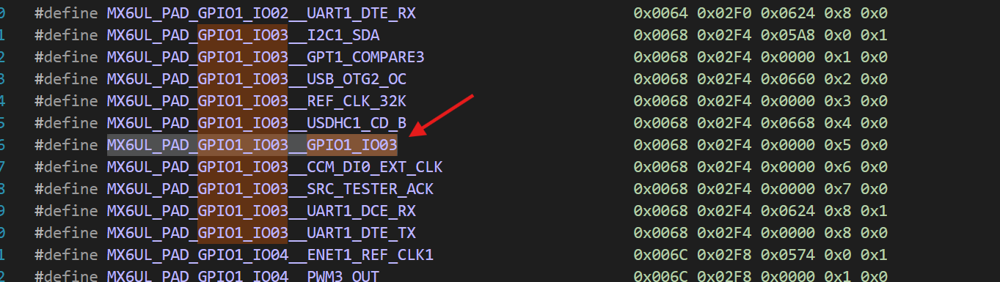

## 前言

笔者使用开发板型号：正点原子的IMX6ULL-alpha开发板。ubuntu版本为：20.04。写此文也是以备忘为目的。

## 字符设备驱动

本小结将以直接操作寄存器的方式控制一个LED灯，可以通过read系统调用可以获取灯的状态（开/关）；通过write系统调用可以控制灯的开关。

LED原理图如下：



从图中可以了解到，我们需要控制LED0所接的GPIO口输出低电平可以点亮led灯，输出高电平可以关闭led灯。查手册得知LED0对应为GPIO1_IO03。
<!-- more -->

驱动程序如下：

```c
#define LED_MAJOR		200		/* 主设备号 */
#define LED_NAME		"led" 	/* 设备名字 */

#define LEDOFF 	0				/* 关灯 */
#define LEDON 	1				/* 开灯 */
#define LEDSTA  3               /* 获取开关灯状态 */
 
/* 寄存器物理地址 */
#define CCM_CCGR1_BASE				(0X020C406C)	
#define SW_MUX_GPIO1_IO03_BASE		(0X020E0068)
#define SW_PAD_GPIO1_IO03_BASE		(0X020E02F4)
#define GPIO1_DR_BASE				(0X0209C000)
#define GPIO1_GDIR_BASE				(0X0209C004)

/* 映射后的寄存器虚拟地址指针 */
static void __iomem *IMX6U_CCM_CCGR1;
static void __iomem *SW_MUX_GPIO1_IO03;
static void __iomem *SW_PAD_GPIO1_IO03;
static void __iomem *GPIO1_DR;
static void __iomem *GPIO1_GDIR;

int led_switch(u8 sta) {
    int rt = -1;
	u32 val = 0;
	if (sta == LEDON) {
		val = readl(GPIO1_DR);
		val &= ~(1 << 3);	
		writel(val, GPIO1_DR);
        rt = LEDON;
	} else if (sta == LEDOFF) {
		val = readl(GPIO1_DR);
		val|= (1 << 3);	
		writel(val, GPIO1_DR);
        rt = LEDOFF;
	} else {
        val = readl(GPIO1_DR);
        rt = val & (1 << 3) ? LEDOFF : LEDON;
    }
    return rt;
}

static ssize_t led_read(struct file *filp, char __user *buf, size_t cnt, loff_t *offt) {
	int retvalue;
	unsigned char databuf[1];
	unsigned char ledstat;

    retvalue = led_switch(LEDSTA);
    if (retvalue < 0) {
        retvalue = -EIO;
        goto error;
    }
    databuf[0] = retvalue;
	retvalue = copy_to_user(buf, databuf, cnt);

error:
	return retvalue;
}

static ssize_t led_write(struct file *filp, const char __user *buf, size_t cnt, loff_t *offt) {
	int retvalue;
	unsigned char databuf[1];
	unsigned char ledstat;

	retvalue = copy_from_user(databuf, buf, cnt);
	if(retvalue < 0) {
		printk("kernel write failed!\r\n");
		return -EFAULT;
	}

	ledstat = databuf[0];		/* 获取状态值 */

	if(ledstat == LEDON) {	
		led_switch(LEDON);		/* 打开LED灯 */
	} else if(ledstat == LEDOFF) {
		led_switch(LEDOFF);		/* 关闭LED灯 */
	}
	return 0;
}

/* 设备操作结构体 */
static struct file_operations led_fops = {
	.owner = THIS_MODULE,
	.read = led_read,
	.write = led_write,
};

static int __init led_init(void) {
	int retvalue = 0;
	u32 val = 0;

	/* 初始化LED */
	/* 1、寄存器地址映射 */
  	IMX6U_CCM_CCGR1 = ioremap(CCM_CCGR1_BASE, 4);
	SW_MUX_GPIO1_IO03 = ioremap(SW_MUX_GPIO1_IO03_BASE, 4);
  	SW_PAD_GPIO1_IO03 = ioremap(SW_PAD_GPIO1_IO03_BASE, 4);
	GPIO1_DR = ioremap(GPIO1_DR_BASE, 4);
	GPIO1_GDIR = ioremap(GPIO1_GDIR_BASE, 4);

	/* 2、使能GPIO1时钟 */
	val = readl(IMX6U_CCM_CCGR1);
	val &= ~(3 << 26);	/* 清楚以前的设置 */
	val |= (3 << 26);	/* 设置新值 */
	writel(val, IMX6U_CCM_CCGR1);

	/* 3、设置GPIO1_IO03的复用功能，将其复用为
	 *    GPIO1_IO03，最后设置IO属性。
	 */
	writel(5, SW_MUX_GPIO1_IO03);
	
	/*寄存器SW_PAD_GPIO1_IO03设置IO属性
	 *bit 16:0 HYS关闭
	 *bit [15:14]: 00 默认下拉
     *bit [13]: 0 kepper功能
     *bit [12]: 1 pull/keeper使能
     *bit [11]: 0 关闭开漏输出 --- 推挽输出
     *bit [7:6]: 10 速度100Mhz
     *bit [5:3]: 110 R0/6驱动能力
     *bit [0]: 0 低转换率
	 */
	writel(0x10B0, SW_PAD_GPIO1_IO03);

	/* 4、设置GPIO1_IO03为输出功能 */
	val = readl(GPIO1_GDIR);
	val &= ~(1 << 3);	/* 清除以前的设置 */
	val |= (1 << 3);	/* 设置为输出 */
	writel(val, GPIO1_GDIR);

	/* 5、默认关闭LED */
	val = readl(GPIO1_DR);
	val |= (1 << 3);	
	writel(val, GPIO1_DR);

	/* 6、注册字符设备驱动 */
	retvalue = register_chrdev(LED_MAJOR, LED_NAME, &led_fops);
	if(retvalue < 0){
		printk("register chrdev failed!\r\n");
		return -EIO;
	}
	return 0;
}


static void __exit led_exit(void) {
	/* 取消映射 */
	iounmap(IMX6U_CCM_CCGR1);
	iounmap(SW_MUX_GPIO1_IO03);
	iounmap(SW_PAD_GPIO1_IO03);
	iounmap(GPIO1_DR);
	iounmap(GPIO1_GDIR);

	/* 注销字符设备驱动 */
	unregister_chrdev(LED_MAJOR, LED_NAME);
}

module_init(led_init);
module_exit(led_exit);
MODULE_LICENSE("GPL");
MODULE_AUTHOR("lulang");

```

应用程序如下：

```c
#define LEDOFF 	0
#define LEDON 	1
#define LEDSTA  3

int main(int argc, char *argv[]) {
	int fd, retvalue;
	char *filename;
	unsigned char databuf[1], state_buf = LEDSTA;
	
	if(argc != 3) {
		printf("Error Usage!\r\n");
		return -1;
	}

	filename = argv[1];

	/* 打开led驱动 */
	fd = open(filename, O_RDWR);
	if(fd < 0) {
		printf("file %s open failed!\r\n", argv[1]);
		return -1;
	}

	databuf[0] = atoi(argv[2]);	/* 要执行的操作：打开或关闭 */

    retvalue = read(fd, &state_buf, sizeof(state_buf));

	if(retvalue < 0) {
		printf("LED read Failed!\r\n");
		close(fd);
		return -1;
	}

    printf("LED before is %s\n", state_buf == LEDON ? "ON" : "OFF");

	/* 向/dev/led文件写入数据 */
	retvalue = write(fd, databuf, sizeof(databuf));
	if(retvalue < 0){
		printf("LED Control Failed!\r\n");
		close(fd);
		return -1;
	}

	retvalue = close(fd);
	return 0;
}
```

为操作方便，这里我写了一个同时能编译驱动和应用程序的Makefile脚本：

```makefile
KERNELDIR := /home/lunar/workspace/imx6ull/resource/linux_quickstart/
CURRENT_PATH := $(shell pwd)
LUNAR_GCC = arm-linux-gnueabihf-gcc
LUNAR_CFLAGS = -Wall -O
OUTPUT_DIR = ${CURRENT_PATH}/build

obj-m := chardev/led.o

LED_CHARDEV = build/chardev/led_app.c.o

build/%.c.o: %.c
	mkdir -p ${@D}
	${LUNAR_GCC} ${LUNAR_CFLAGS} -o $@ -c $<

bin/chardev_app.bin: ${LED_CHARDEV}
	mkdir -p ${@D}
	${LUNAR_GCC} ${LUNAR_CFLAGS} -o $@ $^

all: kernel_modules \
	bin/chardev_app.bin

kernel_modules:
	$(MAKE) -C $(KERNELDIR) M=$(CURRENT_PATH) modules

clean:
	$(MAKE) -C $(KERNELDIR) M=$(CURRENT_PATH) clean
	rm -rf ./bin/*
	rm -rf ./build/*
```

bash脚本作为简化编译流程的工具：

```bash
# ! /bin/bash
nfs_dest="/home/lunar/workspace/nfs_root/rootfs/lib/modules/4.1.15"

if [ "$1" == "clear" ]; then
    echo "clear ..."
    make clean
    echo "rm app in ${nfs_dest}"
    rm -rf ${nfs_dest}/bin/*

    echo "rm driver in ${nfs_dest}"
    rm -f  ${nfs_dest}/*.ko
    exit 0
else
    make all
fi

echo "cp app to ${nfs_dest}"
cp -rf ./bin ${nfs_dest}

echo "cp driver to ${nfs_dest}"
cp -f ./chardev/led.ko ${nfs_dest}

echo "done"
```


测试：

0. 使用命令：`sudo env PATH=$PATH bash ./build.sh`，编译驱动程序和app。（前面一定要接`sudo env PATH=$PATH bash`，否则会报没有权限的错误！）
1. 在下位机创建modules目录：/lib/modules/4.1.15/bin。（第一次需要）
2. 下位机执行`depmod`命令。（每次有新驱动都需要）
3. 加载驱动：`modprobe led.ko`。
4. 下位机创建设备节点：`mknod /dev/led c 200 0`。
5. 下位机控制led灯：`./ledApp /dev/led 1`。

    

    同时可以看到灯确实会受到app的控制。

这里备忘几条命令：

```bash
# 可以查看系统当前设备号的分配情况
cat /proc/devices

Character devices:
  1 mem
  4 /dev/vc/0
  4 tty
  5 /dev/tty
  5 /dev/console
  5 /dev/ptmx
...
200 led
...

# 查看系统当前加载的驱动
lsmod
Module                  Size  Used by    Tainted: G
led                     1854  0

# 卸载驱动
rmmod led.ko
```


在IMX6ULL当中，直接操作GPIO寄存器点亮一个LED主要分6步：

1. 将寄存器物理地址映射为内核态的虚拟地址。
2. 使能GPIO（所在总线）的时钟。
3. 配置GPIO1_IO03复用为GPIO。
4. 配置GPIO1_IO03本身的属性。
5. 配置GPIO1_IO03的方向（输入/输出）。
6. 通过写入GPIO1_IO03的数据寄存器达到控制输出的目的。

linux下驱动开发再直接操作寄存器笔者表示有点HOLD不住了！因为这太原始了。这里使用直接操作寄存器编写驱动的目的是考虑到：到目前为止你对linux驱动是完全一无所知的。后面的小结会慢慢将这段原始的代码变得更优雅。

这里的驱动代码缺点有三个：

1. 直接操作寄存器。
2. 一个主设备号将其下的所有次设备号都占用了。
3. 设备节点需要我们手动创建。

下面两小节会一一解决这两个问题。

## pinctrl子系统

对于pinctrl子系统主要工作内容如下：

1. 获取设备树中 pin 信息。
2. 根据获取到的 pin 信息来设置 pin 的复用功能。
3. 根据获取到的 pin 信息来设置 pin 的电气特性，比如上/下拉、速度、驱动能力等。

对于我们使用者来讲，只需要在设备树里面设置好某个 pin 的相关属性即可，其他的初始化工作均由 pinctrl 子系统来完成，pinctrl 子系统源码目录为 drivers/pinctrl。当然pinctrl最终还是会操作寄存器，而pingctrl最底层的驱动，也即操作寄存器的这部分代码芯片厂家一般会提供好。这里体现了linux分层分离的思想。极大减轻了驱动开发人员的负担，开发驱动的专心开发驱动。

在imx6ull.dtsi文件下搜索可以找到iomuxc节点，该节点下面有各种pinctrl的配置，**从iomuxc节点的compatible属性可以找到pinctrl的最底层驱动**，iomuxc节点部分属性如下：

```
/ { /* 整个芯片 */
	soc {	/* 片上系统 */
		aips1: aips-bus@02000000 {	/* 片上系统的总线 */
			iomuxc: iomuxc@020e0000 {	/* 片上系统的总线的io复用控制寄存器 */
				compatible = "fsl,imx6ul-iomuxc";
				reg = <0x020e0000 0x4000>;
			};
		}
	}
}
```

可以看到iomuxc的compatible属性值为："fsl,imx6ul-iomuxc"，暗示着imx6ull芯片厂家所提供的pinctrl的底层驱动当中必定有该字符串——"fsl,imx6ul-iomuxc"。通过搜索该字符串可以定位到pinctrl最底层的驱动。感兴趣的读者可以去研读一下。

## gpio子系统

如果 pinctrl 子系统将一个 PIN 复用为 GPIO 的话，那么接下来就要用到 gpio 子系统了。

对于gpio子系统主要工作内容如下：

1. 设置gpio输入输出状态。设置gpio中断模式（上升沿、下降沿、双边沿触发）。
2. 控制gpio输入输出。
3. 读取gpio状态。

同样的，和pinctrl类似，gpio 子系统的主要目的就是方便驱动开发者使用 gpio，驱动开发者在设备树中添加 gpio 相关信息，然后就可以在驱动程序中使用 gpio 子系统提供的 API函数来操作 GPIO。不同点在于用户是需要操作gpio的，所以gpio子系统**提供了供用户使用的统一接口**，而pinctrl是针对一个gpio做配置，一旦配置完毕，无需再修改，所以只要你配置好设备树，整个初始化过程都是自动的，无需用户干什么。两者底层最终肯定是操作寄存器的，而且最底层操作寄存器的驱动代码完全由厂家提供好了。

```
/ { /* 整个芯片 */
	soc { /* 片上系统 */
		aips1: aips-bus@02000000 { /* 片上系统的总线 */
			gpio1: gpio@0209c000 { /* 片上系统的总线上的gpio1的寄存器 */
				compatible = "fsl,imx6ul-gpio", "fsl,imx35-gpio";
				reg = <0x0209c000 0x4000>;
				interrupts = <GIC_SPI 66 IRQ_TYPE_LEVEL_HIGH>,
					     <GIC_SPI 67 IRQ_TYPE_LEVEL_HIGH>;
				gpio-controller;
				#gpio-cells = <2>;
				interrupt-controller;
				#interrupt-cells = <2>;
			};
		}
	}
}

&tsc {
	pinctrl-names = "default";
	pinctrl-0 = <&pinctrl_tsc>;
	xnur-gpio = <&gpio1 3 GPIO_ACTIVE_LOW>;	/* 对gpio1的引用 */
	measure-delay-time = <0xffff>;
	pre-charge-time = <0xfff>;
	status = "okay";
};
```

对于上面的配置，重点关注一下gpio1节点下的#gpio-cells属性，#name-cells的命名方式和[设备树](./device_tree.md)当中的#address-cells和#size-cells 属性很类似。不同的是：#address-cells和#size-cells作用于定义节点的子节点，描述子节点reg属性的格式。而#gpio-cells属性，就我目前所知，它定义了引用了gpio1后描述gpio的格式。比如上面代码片段当中，gpio1定义#gpio-cells为2，在tsc这个设备节点当中引用了gpio1，那么在&gpio1之后需要两个元素来组成一个cell。

如果你前面了解过#address-cells，那么肯定会有疑问：为什么#gpio-cells被定义成2，在tsc引用的时候不是填了3个元素吗？

实际上#gpio-cells描述的数值是从第二个元素开始算起的。#gpio-cells = <2> 的意思是，**这个 GPIO 控制器（gpio1）**需要两个单元来描述每个 GPIO 引脚。通常这两个单元分别代表：

第一个单元：GPIO 引脚的编号（通常是一个整数值，表示 GPIO 引脚的具体编号）。

第二个单元：GPIO 的属性，通常是一个标志，表示 GPIO 的电平状态、触发类型等，像是 GPIO_ACTIVE_LOW 或 GPIO_ACTIVE_HIGH，以及是否启用中断等。

在 cd-gpios = <&gpio1 19 GPIO_ACTIVE_LOW> 中：

- &gpio1 是一个指向 gpio1 节点的引用。
- 19 是 GPIO 引脚的编号。
- GPIO_ACTIVE_LOW 表示该引脚的电平为低电平有效。

这三个元素看起来像是三个单元，但实际上是将两个单元（引脚编号和电平状态）传递给了 gpio1 节点中的 GPIO 控制器。

## 字符设备驱动最终版本

首先添加pinctrl节点。先熟悉一下IMX6ULL本身自带的dts是如何配置pnctrl的，挑了一个最简单的pinctrl节点，它的配置参考如下这段代码：

```dts
&iomuxc {
	pinctrl-names = "default";
	pinctrl-0 = <&pinctrl_hog_1>;
	imx6ul-evk {
		/* ... */
		pinctrl_wdog: wdoggrp {
			fsl,pins = <
				MX6UL_PAD_LCD_RESET__WDOG1_WDOG_ANY    0x30b0
			>;
		};
	}
}
```

重点观察一下wdoggrp节点的配置，从整体上看，可以了解到：

1. &iomuxc代表这一大段内容会被追加到iomuxc节点。iomuxc节点定义在imx6ull.dti头文件。头文件当中定义的iomuxc节点的内容很少，可以参考上面pinctrl小结所贴出来的代码。
2. wdoggrp节点标签为：pinctrl_wdog，以pinctrl作为前缀，节点名为：wdoggrp。
3. wdoggrp属性只有一个：fsl,pins，它的值比较关键，当设备树当中有某一处以形如：
	```dts
	&wdog1 {
		pinctrl-names = "default";
		pinctrl-0 = <&pinctrl_wdog>;
		fsl,wdog_b;
	};
	```
	方式引用了wdoggrp节点，pinctrl子系统就会根据wdoggrp节点的fsl,pins属性值来初始化复用/电气属性控制寄存器。从上面pinctrl_wdog的配置可以了解到它的值为：`MX6UL_PAD_LCD_RESET__WDOG1_WDOG_ANY  0x30b0`，那么这代表什么含义呢？这就需要找到`MX6UL_PAD_LCD_RESET__WDOG1_WDOG_ANY`的定义在哪儿。一路从头文件往上找：`imx6ull.dtsi -> imx6ull-pinfunc.h -> imx6ul-pinfunc.h`

	从imx6ul-pinfunc.h头文件的开头我们可以了解到宏定义有5个单元，每个单元的含义如下：
	```cpp
	/*
	* The pin function ID is a tuple of
	* <mux_reg conf_reg input_reg mux_mode input_val>
	*/
	```
	|	mux_reg	|	conf_reg	|	input_reg	|	mux_mode	|	input_val	|
	|	:-:		|	:-:			|	:-:			|	:-:			|	:-:			|
	|	复用寄存器（偏移）地址（引脚复用为什么功能？）|	引脚电器属性配置寄存器（偏移）地址（上拉/下拉，阻抗多大？推挽开漏输出？）	|	暂时还没能去了解:-(		|	mux_reg的值	|	input_reg寄存器的值	|

	比如`MX6UL_PAD_LCD_RESET__WDOG1_WDOG_ANY`宏定义展开后如下：
	```c
	#define MX6UL_PAD_LCD_RESET__WDOG1_WDOG_ANY                       0x0114 0x03A0 0x0000 0x4 0x0
	```
	1. mux_reg = 0x0114：通过查阅芯片手册得知该值为IOMUXC_SW_MUX_CTL_PAD_LCD_RESET寄存器地址，该寄存器可选功能如下：

	

	选中部分对应mux_mode = 0x4。

	2. conf_reg = 0x03A0：对应IOMUXC_SW_PAD_CTL_PAD_LCD_RESET寄存器地址，该寄存器设置引脚电器属性，参考如下表（截取部分配置）：

	

	3. input_reg = 0x0000：可以看到wdoggrp节点将其设置为零，我们可以大胆猜测0x0000是无意义值，类比于nullptr。所以在pnctrl初始化wdoggrp时，并没使用input_reg。并且input_val = 0x0。

	细心的读者一定会发现：MX6UL_PAD_LCD_RESET__WDOG1_WDOG_ANY宏定义展开后并没有发现conf_reg（引脚电器属性）寄存器对应的值。它的值其实交由用户去定义，在wdoggrp节点当中，fsl,pins属性值最后一个数值0x30b0定义了conf_reg寄存器的值。

了解完了pinctrl_wdog: wdoggrp节点的来龙去脉，我们可以试着手动添加一个led灯的pnctrl，并通过gpio子系统来点亮led灯。具体步骤如下：

1. 添加pinctrl节点，通过文章开头的led原理图得知，我们需要在imx6ul-pinfunc.h找到GPIO1_IO03相关的宏定义，将其复用为GPIO1_IO03，然后修改设备树，在系统移植时创建的.dts文件下的&iomuxc节点后面追加一条pinctrl配置：

	
	
	```dts
	&iomuxc {
		pinctrl_led: ledgrp {
			fsl,pins = <
				MX6UL_PAD_GPIO1_IO03__GPIO1_IO03    0x10b0
			>;
		};
	};
	```
	经查表得知将GPIO配置成推挽输出。其他电气属性位读者可自行查阅芯片手册进行验证。
2. 在根节点下添加设备节点，所谓添加设备节点，其实就是配置设备所需的gpio编号并引用一下相应gpio的pinctrl，确保pinctrl子系统将gpio的复用/电气属性寄存器正确初始化。配置如下：
	```dts
	/{
		led_dev {
			compatible = "company,imx6ull-led";
			pinctrl-names = "default";
			pinctrl-0 = <&pinctrl_led>;
			led-gpio = <&gpio1 3 GPIO_ACTIVE_LOW>;
			status = "okay";
		};
	}
	```
	正常情况下，我们需要一个gpio口控制灯，我们认为灯打开就是active状态。对于一个程序员来说，我们可以封装一个函数，写1就是打开灯，写0就是关灯。但是对于硬件来说，变化的是gpio口的电平状态。如果gpio输出高电平灯亮，那么这就是高有效。如果硬件设计是gpio输出低电平灯亮，那么就是低有效。对于一个软件工程师来说，我们的期望是写1就是亮灯，写0就是关灯。GPIO_ACTIVE_LOW的意思就是物理硬件在低电平是有效的，当应用程序通过gpio_set_value接口写逻辑1时，实际上对应物理的0。（**好像并非如此，经过测试，GPIO_ACTIVE_LOW和GPIO_ACTIVE_HIGH测试结果都一样，gpio_set_value写0才是开、写1才是关。需要进一步探究**）
3. 检查设备树当中有没有其他设备占用了GPIO1_IO03，如果有，需要将设备屏蔽。

接下来就是led点灯驱动程序的最终版，其应用程序同上：

```c
#define CHARLED_CNT			1	/* 设备号个数 */
#define LED_MAJOR		200		/* 主设备号 */
#define LED_NAME		"led_device_tree" 	/* 设备名字 */

#define LEDOFF 	0				/* 关灯 */
#define LEDON 	1				/* 开灯 */
#define LEDSTA  3               /* 获取开关灯状态 */

/* newchrled设备结构体 */
struct chrled_dev{
	dev_t devid;			/* 设备号 	 */
	struct cdev cdev;		/* cdev 	*/
	struct class *class;		/* 类 		*/
	struct device *device;	/* 设备 	 */
	int major;				/* 主设备号	  */
	int minor;				/* 次设备号   */
	struct device_node	*nd; /* 设备节点 */
	int led_gpio;			/* led所使用的GPIO编号		*/
};

struct chrled_dev chrled;	/* led设备 */

static ssize_t led_read(struct file *filp, char __user *buf, size_t cnt, loff_t *offt)
{
	int retvalue;
	unsigned char databuf[1];

    retvalue = (gpio_get_value(chrled.led_gpio) == 0) ? LEDON : LEDOFF;
    if (retvalue < 0) {
        retvalue = -EIO;
        goto error;
    }
    databuf[0] = retvalue;
	retvalue = copy_to_user(buf, databuf, cnt);

error:
	return retvalue;
}

static ssize_t led_write(struct file *filp, const char __user *buf, size_t cnt, loff_t *offt)
{
	int retvalue;
	unsigned char databuf[1];
	unsigned char ledstat;

	retvalue = copy_from_user(databuf, buf, cnt);
	if(retvalue < 0) {
		printk("kernel write failed!\r\n");
		return -EFAULT;
	}

	ledstat = databuf[0];						/* 获取状态值 */

	if(ledstat == LEDON) {	
        gpio_set_value(chrled.led_gpio, 0);		/* 打开LED灯 */
	} else if(ledstat == LEDOFF) {
        gpio_set_value(chrled.led_gpio, 1);		/* 关闭LED灯 */
	}
	return 0;
}


static struct file_operations led_fops = {
	.owner = THIS_MODULE,
	.read = led_read,
	.write = led_write,
};


static int __init led_init(void)
{
    int ret = 0;
	/* 根据设备树配置，申请GPIO */
	/* 1、获取设备节点：gpioled */
	chrled.nd = of_find_node_by_path("/led_dev");
	if(chrled.nd == NULL) {
		printk("gpioled node not find!\r\n");
		return -EINVAL;
	} else {
		printk("gpioled node find!\r\n");
	}

	/* 2、 获取设备树中的gpio属性，得到LED所使用的LED编号 */
	chrled.led_gpio = of_get_named_gpio(chrled.nd, "led-gpio", 0);
	if(chrled.led_gpio < 0) {
		printk("can't get led-gpio");
		return -EINVAL;
	}
	printk("led-gpio num = %d\r\n", chrled.led_gpio);

    /* 3、申请gpio，避免多个驱动同时操作一个gpio口的情况发生 */
	ret = gpio_request(chrled.led_gpio, "led_gpio");
	if (ret) {
		pr_err("could not request power off GPIO\n");
		return -EINVAL;
	}
	/* 4、设置GPIO1_IO03为输出，并且输出高电平，默认关闭LED灯 */
	ret = gpio_direction_output(chrled.led_gpio, 1);
	if(ret < 0) {
		printk("can't set gpio!\r\n");
	}

	/* 注册字符设备驱动 */
	/* 1、创建设备号 */
	if (chrled.major) {							/*  定义了设备号 */
		chrled.devid = MKDEV(chrled.major, 0);
		register_chrdev_region(chrled.devid, CHARLED_CNT, LED_NAME);
	} else {									/* 没有定义设备号 */
		alloc_chrdev_region(&chrled.devid, 0, CHARLED_CNT, LED_NAME);	/* 申请设备号 */
		chrled.major = MAJOR(chrled.devid);		/* 获取分配好的主设备号 */
		chrled.minor = MINOR(chrled.devid);		/* 获取分配好的次设备号 */
	}
	printk("newcheled major=%d,minor=%d\r\n",chrled.major, chrled.minor);	
	
	/* 2、初始化cdev */
	chrled.cdev.owner = THIS_MODULE;
	cdev_init(&chrled.cdev, &led_fops);
	
	/* 3、添加一个cdev */
	cdev_add(&chrled.cdev, chrled.devid, CHARLED_CNT);

	/* 4、创建类 */
	chrled.class = class_create(THIS_MODULE, LED_NAME);
	if (IS_ERR(chrled.class)) {
		return PTR_ERR(chrled.class);
	}

	/* 5、创建设备 */
	chrled.device = device_create(chrled.class, NULL, chrled.devid, NULL, LED_NAME);
	if (IS_ERR(chrled.device)) {
		return PTR_ERR(chrled.device);
	}
	
	return 0;
}

static void __exit led_exit(void)
{
    gpio_set_value(chrled.led_gpio, 1);
    gpio_free(chrled.led_gpio);

	device_destroy(chrled.class, chrled.devid);

	class_destroy(chrled.class);

	/* 注销字符设备驱动 */
	cdev_del(&chrled.cdev);								/*  删除cdev */
	unregister_chrdev_region(chrled.devid, CHARLED_CNT); /* 注销设备号 */
}

module_init(led_init);
module_exit(led_exit);
MODULE_LICENSE("GPL");
MODULE_AUTHOR("lulang");
```

设备注册流程如下：

1. （在设备树当中）查找设备节点。
2. （根据设备节点）获取gpio编号。
3. 申请gpio。
4. （如果未指定的话）动态分配设备号。
5. 初始化cdev。
6. 添加一个cdev
7. 创建类。
8. 创建设备。（此处会自动在dev目录下创建一个设备文件。

**注销过程依照注册过程逆序注销。**实验表明，如果在输出模式下读取gpio的状态，led_read函数当中gpio_get_value函数返回值是恒为零的。

---

**本章完结**