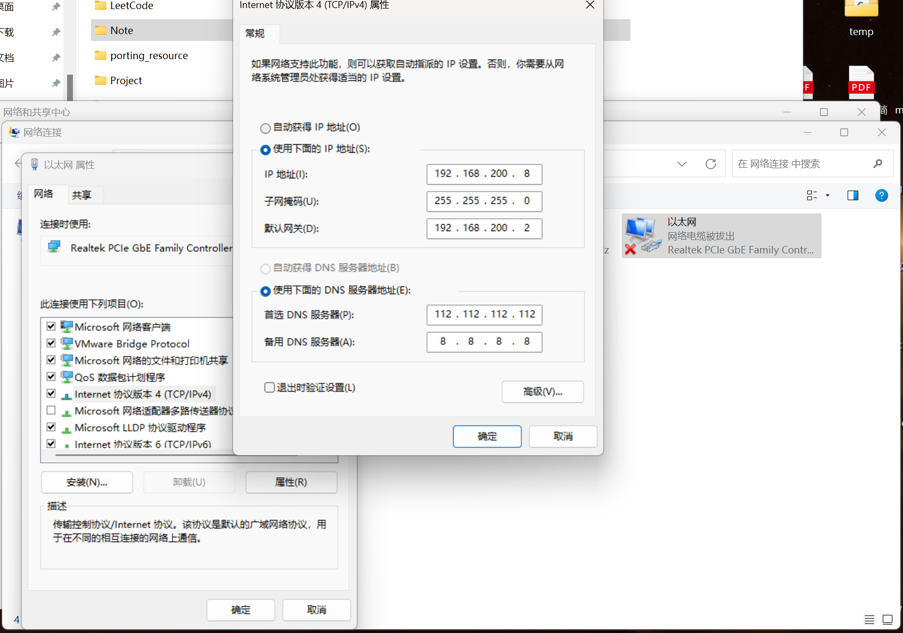

## 环境介绍

本博客使用x6818开发板。

公司：三星

ARM架构

Cortex-A53核

型号：S5P6818

特性：8核，最高主频2GHz
<!-- more -->

## 烧写uboot

### 使用网络烧写

网络烧写上位机是Ubuntu虚拟机。

0. 先利用上位机，给TF卡烧写uboot，然后将TF卡插到下位机的TF0卡槽中。连接好电源口、网口、串口。电源口给开发板供电，网口用于传输可执行文件、系统镜像等，串口用于传输uboot命令、打印调试等。Ubuntu虚拟机配置成桥接模式，桥接到主机的以太网网卡上，用一根网线直接连接电脑网口和开发板网口。在下位机上电时，cpu会以TF0->TF1->MCC的顺序去读取uboot信息，并将uboot加载到内存同时cpu会跳到uboot，去执行其代码。因为我们将烧写了uboot的TF卡插到了TF0卡槽，所以cpu会直接读取TF0上的uboot。

1. Ubuntu安装tftp服务

    ```
    apt-get install tftpd-hpa 
    ```

2. 如果需要的话可以通过tftp的配置文件修改共享目录的位置，如下：

    ```
    # 修改TFTP_DIRECTORY参数即可修改共享目录。
    vim /etc/default/tftpd-hpa
    ```

3. 为Ubuntu虚拟机配置一个静态ip，ip可以随便取，我取Ubuntuip为192.168.200.3、网关为192.168.200.2子网掩码是255.255.255.0。这里配置静态ip的教程参考[Ubuntu配置静态ip](../memo/memo.md)。

4. 通过串口工具SecureCRT，向uboot发送命令，配置下位机uboot的ip地址、serverip、网关：

    ```
    # 打印uboot环境变量，注意重要的两个环境变量：
    # ipaddr=192.168.1.165      // 此乃开发板的IP地址
    # serverip=192.168.1.164    // 此乃上位机的IP地址
    # gatewayip=192.168.1.2     // 网关
    print 
	
    # 设置本机的IP地址为192.168.200.4
    setenv ipaddr 192.168.200.4

    # 设置服务器的IP地址为192.168.200.3
    setenv serverip 192.168.200.3

    # 设置网关的IP地址为192.168.200.2
    setenv gatewayip 192.168.200.2
    # 保存
    saveenv

    # 再次确保环境变量是对滴!
    print

    # 下位机ping上位机
    # 如果出现is not alive:表示失败，继续ping一下，第一次总是不成功的
    # 如果出现is alive：表示成功，继续后续网络下载操作
    ping 192.168.200.3
    ```

5. 从上位机Ubuntu共享目录下载uboot：

    ```
    # 将上位机的ubootpak.bin文件下载到下位机的内存0x48000000处，
    tftp 0x48000000 ubootpak.bin

    ```

6. 将内存中的uboot数据烧写到mmc：

    ```
    # 烧写到mmc上，以0x200（512）作为起始地址，烧写0x78000这么多字节，这里是以字节为单位！
    update_mmc 2 2ndboot 0x48000000 0x200 0x78000
    ```

7. 拔掉TF0卡槽的TF卡，按下复位键，可以观察到串口工具SecureCRT有uboot的打印信息。

至此uboot网络烧写介绍完毕！如果你希望宿主机可以利用vscode的remote插件连接上桥接在以太网卡的虚拟机，可以把宿主机的以太网卡手动配置一个静态ip，**注意，ip的网络地址、子网掩码、网关地址一定要和虚拟机保持一致！**如下：



### 使用USB烧写

这里演示Win作为上位机，USB烧写uboot，Ubuntu其实是一样的道理。

0. 同样，先利用上位机，给TF卡烧写uboot，然后将TF卡插到下位机的TF0卡槽中。连接好电源口、OTG USB口、串口。电源口给开发板供电，USB口用于传输可执行文件、系统镜像等，串口用于传输uboot命令、打印调试等。在下位机上电时，cpu会以TF0->TF1->MCC的顺序去读取uboot信息，并将uboot加载到内存同时cpu会跳到uboot，去执行其代码。因为我们将烧写了uboot的TF卡插到了TF0卡槽，所以cpu会直接读取TF0上的uboot。

1. 串口工具执行fastboot命令，此时命令行终端卡住不动，等待上位机fastboot客户端程序发送要下载的文件。

2. 上位机（windows）注意安装fastboot驱动。

3. 在windows自带的终端执行命令：

    ```
    # 对于ubuntu系统：
    # 先安装fastboot：sudo apt-get install fastboot
    # 再运行此烧写命令:sudo fastboot flash ubootpak ubootpak.bin
    fastboot flash ubootpak ubootpak.bin
    ```

4. 拔掉TF0卡槽的TF卡，按下复位键，可以观察到串口工具SecureCRT有uboot的打印信息。

USB烧写uboot介绍完毕！

## 烧写linux镜像以及根文件系统

rootfs_ext4.img：根文件系统。

uImage：linux内核的二进制可执行文件。

两个文件都文件位于：porting_resource目录下

开发板mmc的分区规划如下：

```
   EMMC分区规划如下：
   0-------512----------1M--------------65M---------------819M--------------剩余
      保留      uboot	        uImage	        rootfs	            大片
		        第一分区	    第二分区        第三分区            暂时不分
               mmcblk0boot0   	mmcblk0p1    mmcblk0p2	# linux内核给每个分区指定的名称
```

### 使用网络烧写

1. 将文件uImage拷贝到上位机Ubuntu下的/srv/tftp共享目录，保证上下位机网络通畅

2. 通过串口，使用uboot自带的分区命令fdisk（**以字节为单位**），对下位机的mmc进行分区：fdisk 2 2 0x100000:0x4000000 0x4100000:0x2f200000

    第一个参数：首先TF卡,SD卡,EMMC硬件特性一模一样，统称MMC。如果传递0：表示对SD0卡槽的TF进行分区。如果传递1：表示对SD1卡槽的TF进行分区。如果传递2：表示对EMMC进行分区。

    第二个参数：表示要分两个分区，分别是uImage和rootfs所在的分区。注意：uboot所在的分区由linux内核自己来分。

    最后两个参数：0x100000:0x4000000:指定第二分区uImage所在的分区起始地址和大小。0x4100000:0x2f200000：指定第三分区rootfs所在的分区起始地址和大小

3. 利用SecureCRT通过串口发送uboot命令控制下位机的uboot，使用tftp命令从上位机共享文件中拷贝uImage、rootfs_ext4.img，并将其烧录到mmc：

    ```
    # 以下命令都是通过串口发送给uboot执行

    # 利用tftp服务从上位机的共享目录中下载uImage到下位机内存0x480000000
    tftp 0x48000000 uImage  

    # 将uImage从内存的0x48000000写入到EMMC的0x800起始地址(以sector=512字节为单位)，烧写0x3000这么多块(6M)
    mmc write 0x48000000 0x800 0x3000 

    # 利用tftp服务从上位机的共享目录中下载rootfs_ext4.img到下位机内存0x480000000
    tftp 0x48000000 rootfs_ext4.img 

    # 将rootfs从内存的0x48000000写入到EMMC的0x20800起始地址(以sector=512字节为单位)，烧写0x32000这么多块(100M)
    mmc write 0x48000000  0x20800  0x32000
    ```

4. 设置uboot的环境变量，让其启动后，加载内核到内存指定地址，并且为内核提供启动参数，指定根文件系统的位置：

    ```
    # 以下命令都是通过串口发送给uboot执行

    # 设置加载启动内核的环境变量，从参数中我们可以看到，uboot会将内核放在0x48000000处
    setenv bootcmd mmc read  0x48000000 0x800 0x3000 \; bootm 0x48000000
    # 保存
    saveenv

    # 设置内核启动之后定位根文件系统的启动参数
    # root=/dev/mmcblk0p2:告诉linux内核将来要挂接找的根文件系统rootfs在第三分区
    # init=/linuxrc:linux内核一旦找到根文件系统rootfs，执行的第一个进程就是根目录下的linuxrc程序,注意：linuxrc会帮你启动第一号进程:/sbin/init
    # console=ttySAC0,115200:指定将来linux内核打印输出的信息通过第一个串口来输出到上位机上，波特率115200
	# ttySAC0:第一个串口
	# ttySAC1:第二个串口
			...
    # maxcpus=1:只启动一个CPU核，CPU0核
    # lcd=wy070ml:指定LCD显示屏的型号
    # tp=gslx680-linux:指定触摸屏的型号
    setenv bootargs root=/dev/mmcblk0p2 init=/linuxrc console=ttySAC0,115200 maxcpus=1 lcd=wy070ml  tp=gslx680-linux
    # 保存
    saveenv
    ```
5. 使用uboot命令启动操作系统：

    ```
    # 以下命令都是通过串口发送给uboot执行

    # 直接运行bootcmd环境变量的命令启动下位机linux系统
    boot

    # 等待系统启动就OK了！
    ```

### 使用USB烧写

1. 同网络烧写步骤2，进行emmc分区。

2. 串口工具执行fastboot命令，此时命令行终端卡住不动，等待上位机fastboot客户端程序发送要下载的文件。

3. linux镜像以及根文件系统的烧写使用fastboot命令进行USB烧写：

    ```
    # 使用fastboot，烧写到emmc的地址是在uboot的配置文件已经配置好的，不需要用户手动指定。
    # 如有需要，可以更改uboot的配置文件重新编译uboot、烧写uboot，可以使USB烧写地址改变。

    # 将uImage烧写到下位机EMMC的第二分区上，注意：uI(大写的i)mage。
    fastboot  flash boot uImage
    # 将rootfs_ext4.img烧写到EMMC第三分区上
    fastboot  flash system rootfs_ext4.img
    ```

4. 配置步骤同网络烧写步骤4、5。


---

**本章完结**