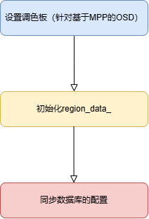
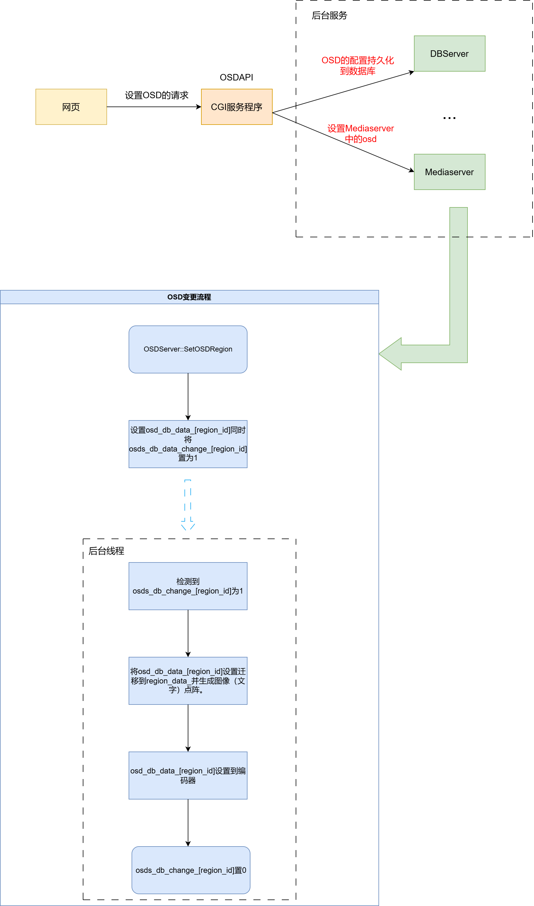

## 前言

本文简单记录一下我在学习IPCamera项目的的OSD的原理的过程。

在学习OSD的过程当中，可能需要补充的基础知识：

1. OSD是什么？

2. BMP图像文件格式大致组成？

3. 图像调色（Palette）的原理？

4. RGA常用接口的使用？
<!-- more -->

涉及的项目的文件路径：

1. osd服务：app/mediaserver/src/utils/osd。最关键的应该是osd_server.h/cpp文件。阅读完这个文件的代码，基本就能了解osd大概的实现原理，然后其他的文件都是实现细节相关的。

2. 编码器的实现，包括如下文件：
    - 编解码器基类头文件：external/rkmedia/include/easymedia/encoder.h和codec.h

    - 编解码器基类源文件：external/rkmedia/src/encoder.cc

    - rkmpp编码器的封装：external/rkmedia/src/rkmpp/mpp_encoder和mpp_final_encoder

3. OSD绘制：包括使用RGA“手动”绘制OSD和使用瑞芯微提供的底层mpp接口“自动”绘制。

## OSD是什么？

首先需要了解OSD是什么？有什么意义？一句话概括：OSD就是给一段原生的实时视频或者录像的每一帧加上一点东西，包括但不限于：logo、时间日期，提示语等。

## 在IPCamera中，OSD是如何实现的？

在IPCamera中，OSD是作为一个服务来实现。实现于mediaserver层。我这里直接放上一段OSD实现最核心的代码：

```cpp
// 位于文件：app/mediaserver/src/utils/osd/osd_server.cpp
static void *ServerProcess(void *arg) {
  auto os = reinterpret_cast<OSDServer *>(arg);
  char thread_name[40];
  snprintf(thread_name, sizeof(thread_name), "OSDServer[%d]", os->GetWidth());
  prctl(PR_SET_NAME, thread_name);
  LOG_DEBUG("osd ServerProcess in\n");
  int time_count = 0;
  while (os->status() == kThreadRunning) {
    os->UpdateTimeDate();   // 更新日期
    os->UpdateImage();      // 更新logo
    os->UpdateMask();       // 屏蔽某一区域
    os->UpdateBlink();      // 闪烁
    if (time_count == 30) {
      os->UpdateText();     // 更新文本
      time_count = 0;
    }
    time_count++;
    std::this_thread::sleep_for(std::chrono::milliseconds(os->GetDelayMs()));
  }
  LOG_DEBUG("osd ServerProcess out\n");
  return nullptr;
}
```

从函数命名就可以很清晰的看出，OSDServer中会起一个线程来运行ServerProcess函数，函数会间隔一定时间去更新最终画到视频帧上的OSD的内容。

在IPCamera当中，**每个OSD是和video_encoder_flow绑定的。并且OSD是被video_encoder_flow在编码前绘制到每一帧图像上的。**

仔细阅读源码的话，就会发现，因为时间是不断变化的，所以UpdateTimeDate函数能保证每次时间有变化时，都会调用easymedia::video_encoder_set_osd_region，去更新编码器绘制的osd的内容。相反的，因为logo和提示文字因为是几乎不变的，所以只会在系统最开始或者被变更时才会真正调用easymedia::video_encoder_set_osd_region去更新编码器的osd的内容。

那么系统怎样监视一个OSD是否有更新呢？答案就是简单的通过一个整型数组。为1代表该种osd需要被更新到编码器中，为0就无需更新。这个数组对应osd_server头文件中的osds_db_data_change_。

为什么是一个数组呢？没错，结合之前提到过的，一帧图像的OSD可能有好几种，每种OSD负责展示不同的信息。所以数组的存在的很有必要的。从osd_server的实现中能更清楚的理解这一点。

谈到监视更新的变量就不得不提到OSDServer的两个核心成员：osds_db_data_、region_data_，这两成员都是数组，每个元素的类型定义如下：

```cpp
// osds_db_data_（长度为15的数组）
typedef struct osd_data {
  int type;             // 图像还是文本还是边框
  union {
    const char *image;
    text_data_s text;
    border_data_s border;
  };
  int width;            // osd宽
  int height;           // osd高
  uint8_t *buffer;      // osd内容的buffer
  uint32_t size;        // buffer大小

  int origin_x;         // x
  int origin_y;         // y
  int enable;           // 是否使能？

} osd_data_s;

// region_data_（长度为8的数组）
typedef struct {
  uint8_t *buffer; // Content: ID of palette
  uint32_t pos_x;
  uint32_t pos_y;
  uint32_t width;
  uint32_t height;
  uint32_t inverse;
  uint32_t region_id; // max = 8.
  uint8_t enable;
  REGION_TYPE region_type;
  uint32_t cover_color; // for REGION_TYPE_COVER
} OsdRegionData;
```

从OSDServer的构造函数中，我们可以看到在一个OSDServer对象创建时会进行一些比较重要的初始化操作，如下：



1. 设置调色板。

2. 初始化region_data_。

3. 查询数据库对osd的配置，并设置到osds_db_data_数组设置osds_db_data_change_相应元素为1，使后台线程能察觉到osd配置的改变，并同步给编码器。

## OSD更新的详细流程

这里梳理一下OSD更新的详细流程：

1. 用户通过网页对OSD进行设置。

2. 下位机服务器收到并解析请求。将设置持久化到数据库。（mediaserver那边其实会收到dbus的signal）。

3. 服务器向mediaserver发送设置osd的dbus请求。

4. mediaserver收到请求然后调用OSDServer::SetOsdRegion(region_id, map)函数进行osd的设置。（dbus请求的参数会被转换成map然后作为OSDServer::SetOsdRegion参数）。

5. 根据map设置osds_db_data_[region_id]。并且相应的osds_db_data_change_[region_id]被设置为1。

6. 后台线程检测到osds_db_data_change_[region_id]为1，**根据osds_db_data_[region_id]的配置，生成图像（字体）点阵**，将点阵设置到region_data_数组中。

7. 调用easymedia::video_encoder_set_osd_region函数，将osd配置到编码器中。

如下图：



**图中红色字体表示Dbus发出的请求，黑色字体代表普通网络请求。**

上文一直在回避三个个比较重要的细节：什么是点阵？字体和图像是怎么绘制成点阵的？编码器是如何将osd绘制到视频的每一帧上的？下面两节就专门来解释这几个问题。

## 点阵与调色

点阵也是一个比较有意思的东西，这里推荐可以先去了解一下RGA里面怎么进行调色的。可以参考external/linux-rga/samples/rgaColorPalette下的实例，这里面是使用rga相关的接口对图像进行调色的一个demo，**源图像就是一个点阵（每个像素是一Byte），通过一个长度为256的数组（调色板，每个元素4Byte），将点阵映射成RGBA格式的图像（目的图像）。**

上面一段粗体其实就已经很好的解释了点阵的作用。总结一下：

1. 如果你想用点阵来显示一段文字（不管中文还是英文），直接将仿照文字的笔画，将你所需要的字节置为一即可。然后告诉mpp/rga用什么调色板，将绘制好的位图传给它们，它们就能够将点阵钻换成文字显示到一帧帧画面上了。在OSDServer中，FontFactory类就是封装了ft2build库，在点阵中绘制文字。

2. 如果你想用点阵绘制一幅图片，（参考OSDServer的做法）使用bmp图像，bmp图像具体格式的学习参考[链接](https://blog.csdn.net/weixin_43455834/article/details/105988433)，bmp里面使用位图数据来表示图像。OSDServer调用BMPReader类的LoadYuvaMapFromFile函数将RGB格式的位图数据通过find_color函数将三通道（rgb）的数据转换成yuva调色板的索引（一通道），这样拿到yuva的调色板后mpp/osd就能将点阵转换成图像。

对于文字的点阵生成参考mediaserver的osd下的font_factory的实现，对于图像的点阵生成参考mediaserver的osd下的bmp_reader的实现。原理其实都是差不多的，只不过文字只有一个颜色，所以点阵中点亮的值恒为1。而图像则是多彩的，所以索引值有多种。

利用点阵+调色板的方式有两个很好的优势：

1. 点阵是确定的，但调色板是灵活的，用户可以根据自己的喜好，使用不同的调色板映射调色板。

2. 典型的点阵每个像素只有1Byte，占用空间小。

最后，我认为点阵源码最重要的是color_table.h文件下的find_color函数。该函数功能是根据rgb三通道反向查找在调色板中**最匹配**的一个索引。

代码如下：

```cpp
uint8_t inline find_color(const uint32_t *pal, uint32_t len, uint8_t r,
                          uint8_t g, uint8_t b) {
    uint32_t i = 0;
    uint8_t pixel = 0;
    unsigned int smallest = 0;
    unsigned int distance = 0;
    int rd, gd, bd;
    uint8_t rp, gp, bp;

    smallest = ~0;

    // LOG_DEBUG("find_color rgba_value %8x", (0xFF << 24 | r << 16 | g <<8 | b
    // <<0));

    for (i = 0; i < len; ++i) {
        // rgb : 从低到高
        bp = (pal[i] & 0xff000000) >> 24;
        gp = (pal[i] & 0x00ff0000) >> 16;
        rp = (pal[i] & 0x0000ff00) >> 8;

        rd = rp - r;
        gd = gp - g;
        bd = bp - b;
        // 计算方差
        distance = (rd * rd) + (gd * gd) + (bd * bd);
        if (distance < smallest) {
            pixel = i;

            /* Perfect match! */
            if (distance == 0)
            break;

            smallest = distance;
        }
    }

    // LOG_DEBUG("find_color pixel %d pal[%d][%d] %8x", pixel, pixel/6, pixel%6,
    // pal[pixel]);

    return pixel;
}
```

这里备忘一个名词，**色深：色彩深度又叫色彩位数，即位图中要用多少个二进制位来表示每个点的颜色，是分辨率的一个重要指标。**

## 编码器

IPCamera的OSD的实现是基于编码器的。而在编码器中，OSD有两种绘制方式：让MPP去绘制或者利用RGA进行OSD的绘制。因为RGA的绘制比较直观，而MPP的绘制需要深入到MPP的API中，目前这方面的基础知识尚缺，所以这里主要介绍一下RGA的绘制方式。

OSDServer向编码器设置OSD的函数调用连如下：

1. easymedia::video_encoder_set_osd_region()

2. enc_flow->Control(VideoEncoder::kOSDDataChange, pbuff);

3. enc->RequestChange(request, value);

4. (request, value)会被挂到VideoEncoder的编码器设置链表上。

++++++++++++++++++++++++++++++++++++++++++++++

当有图片到达VideoEncoderFlow后，里面的回调函数会继续调用：

5. 进入函数：MPPEncoder::Process(src, dst, extra_dst);

    1. 处理编码器的设置链表：
    ```cpp
    while (HasChangeReq()) {
        auto change = PeekChange();
        if (change.first && !CheckConfigChange(change))
        return -1;
    }
    ```

    对于RGA的OSD，MPPEncoder类中也会有8个类型为RgaOsdData的数组，OSDServer的设置最终通过上面的循环变更到这里。

    2. RgaOsdRegionProcess，该函数负责调用improcess将各个osd绘制到即将编码的图像帧上。

为了方便梳理流程，最后贴一下MPPEncoder::Process(src, dst, extra_dst)中OSD相关的伪代码：

```cpp

int MPPEncoder::Process(const std::shared_ptr<MediaBuffer> &input,
                        std::shared_ptr<MediaBuffer> &output,
                        std::shared_ptr<MediaBuffer> extra_output) {

    // 处理编码器配置链表
    while (HasChangeReq()) {
        auto change = PeekChange();
        if (change.first && !CheckConfigChange(change))
            return -1;
    }

    // ...
    // 使用RGA绘制所有的OSD
#ifdef RGA_OSD_ENABLE
    if (rga_osd_cnt > 0)
    RgaOsdRegionProcess(hw_buffer);
#endif

    //...
    return 0;
}
```

RGA的绘制其实就是按一定比例使用图像blend（混合）的方式进行叠加的。RGA的作用呢包括：对图像缩放、裁剪、混合、调色、拷贝等。它是基于RGA硬件独立于CPU的去做这些操作的，所提供的接口以及用法可以参考external/linux-rga。对于MPP对OSD的绘制，作者暂时还未能深入了解，感兴趣的读者可以自行深入研究。

---

**本章完结**