adb push src dest

file 可执行文件     获取可执行文件架构


modetest命令可以查看图层信息

## RKMedia的各个组件及其交互

首先上图：

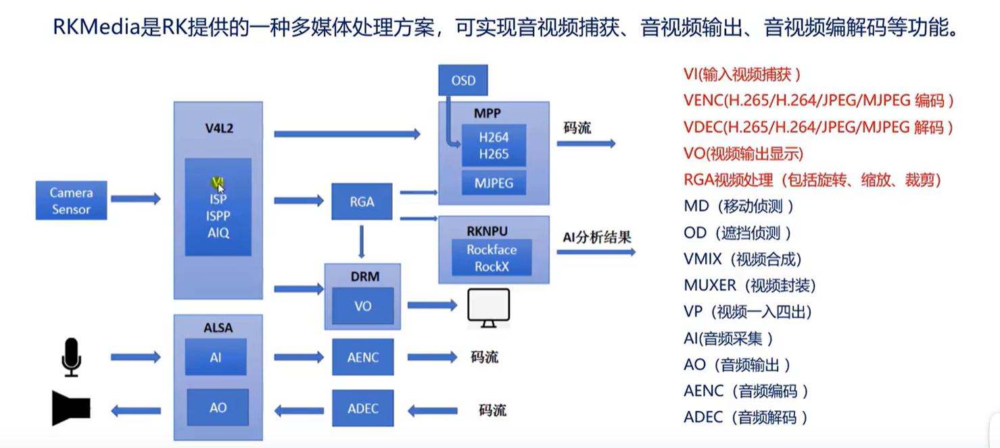

<!-- more -->
考虑到公司业务主要是相机，所以，主要去关注图像数据流，对于音频数据流直接忽略。

图像数据流向：

1. Camera Sensor将光信号转换成电信号（Raw数据） ->

2. ISP（ image signal peocess）初步对raw数据进行一些处理，此时数据格式变成了（yuv420的变种）NV12格式 ->

3. NV12格式数据下面的流向大体有三种：MPP、RGA、DRM。

4. 首先是MPP，在rkmedia中，该模块主要对传送过来的图像数据做编码操作，比如将数据编码成H264、H265格式。这些格式能极大的压缩图像数据的大小。具体H264里面的结构，文章后面有详细介绍。OSD对于框图中MPP上面的OSD模块，可以为MPP中每一帧图像添加一些额外的标记吧。OSD模块和MPP是 **相互绑定** 的，至少我目前在代码中看到的是这样。

5. 其次是RGA，该模块独立存在，并且可以对输入的NV12图像进行裁剪、缩放、旋转，然后将处理都图像数据发送给MPP模块。

6. 最后是DRM模块，该模块就是一个图像显示框架，可以直接将输入的数据显示到屏幕上。

7. 在经过MPP模块编码后的图像，最后还会一个叫Muxer的模块，该模块会将编码后的图像数据和音频数据进行打包，打包成MP4或者flx等格式，最后推流给服务器。

raw原始图像格式有四种包括：BGGR、RGGB、GBRG、GRBG。也称Bayer raw。

VI基于v4l2接口实现

RKMedia接收者和发送者绑定限制：

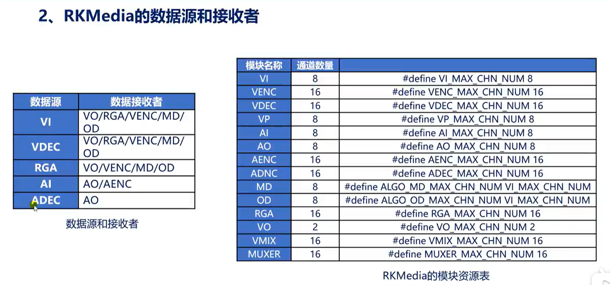

### 摄像头的工作方式

摄像头有三种工作方式：

```cpp
typedef enum {
    RK_AIQ_WORKING_MODE_NORMAL,                 // 又称单帧模式
    RK_AIQ_WORKING_MODE_ISP_HDR2    = 0x10,     // 两帧和成一帧
    RK_AIQ_WORKING_MODE_ISP_HDR3    = 0x20,     // 三帧合成一帧
//    RK_AIQ_WORKING_MODE_SENSOR_HDR = 10, // sensor built-in hdr mode
} rk_aiq_working_mode_t;
```

hdr解释为高动态范围，能显示的亮度范围更大，三帧合一中的三帧对应：欠曝光帧，正常曝光帧，过度曝光帧。

一般使用常规单帧

关于MIPI接口标准也是很复杂，本文先在应用层简单了解一下它的使用，具体细节，后面需要再去深究。这里还是贴一张它的框图：

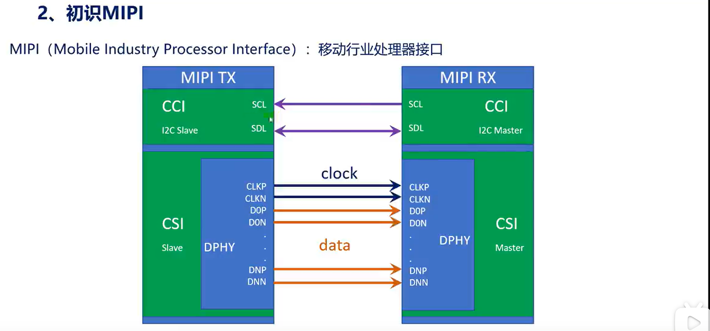

上面的CCI就是相机控制接口，使用I2C进行通信。下面CSI就是相机串行接口，主要是传输数据用的。

接下来根据ISP的初始化代码来进一步了解ISP：

代码如下：

```cpp
// RK_S32 SAMPLE_COMM_ISP_Init(RK_S32 CamId, rk_aiq_working_mode_t WDRMode,
//                             RK_BOOL MultiCam, const char *iq_file_dir) 


rk_aiq_working_mode_t hdr_mode = RK_AIQ_WORKING_MODE_NORMAL;
int fps = 30;
SAMPLE_COMM_ISP_Init(s32CamId, hdr_mode, bMultictx, pIqfilesPath);
SAMPLE_COMM_ISP_Run(s32CamId);

// 设置isp处理帧率非视频显示帧率
SAMPLE_COMM_ISP_SetFrameRate(s32CamId, fps);
```

CamId：代表使用哪个mipi csi，0代表mipi csi0，1代表mipi csi1，如果只有一个摄像头就可以为0，不管摄像头插在哪个接口（默认id就是0），如果有两个摄像头，就必须有camid的区分。

WDRMode：就是上面提到的三种工作模式。

MultiCam：false代表开启一个摄像头的isp，true代表开启多个摄像头的isp，一个摄像头设置为false即可。

iq_file_dir：并且ISP的工作会依赖iq配置文件，所以函数SAMPLE_COMM_ISP_Init中iq_file_dir就是iq文件所在目录。

此外，**当多个摄像头使用一个isp会分时复用，**

注意这里提一下ISPP输出码流格式限制：

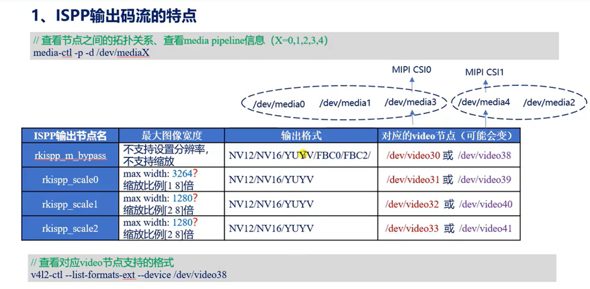

### RGA模块的使用

接下来深入认识一下RGA模块的使用：

```cpp
RGA_ATTR_S stRgaAttr;
memset(&stRgaAttr, 0, sizeof(stRgaAttr));
stRgaAttr.bEnBufPool = RK_TRUE;             // 使用缓冲池
stRgaAttr.u16BufPoolCnt = 3;                // 缓冲池的数量
stRgaAttr.u16Rotaion = 90;                  // 旋转90度
stRgaAttr.stImgIn.u32X = 0;                 // 在输入图像的横坐标为x处取样
stRgaAttr.stImgIn.u32Y = 0;                 // 在输入图像的纵坐标为y处取样
stRgaAttr.stImgIn.imgType = IMAGE_TYPE_NV12;// 输入图像格式
stRgaAttr.stImgIn.u32Width = video_width;   // 输入图像宽
stRgaAttr.stImgIn.u32Height = video_height; // 输入图像高
stRgaAttr.stImgIn.u32HorStride = video_width; // 水平跨距
stRgaAttr.stImgIn.u32VirStride = video_height;  // 垂直跨距
stRgaAttr.stImgOut.u32X = 0;                    // 相对stImgIn.u32X
stRgaAttr.stImgOut.u32Y = 0;                    // 相对stImgIn.u32Y
stRgaAttr.stImgOut.imgType = IMAGE_TYPE_RGB888; // 输出图像格式
stRgaAttr.stImgOut.u32Width = disp_width;       // 输出宽
stRgaAttr.stImgOut.u32Height = disp_height;     // 输出高
stRgaAttr.stImgOut.u32HorStride = disp_width;   // 含义同输入
stRgaAttr.stImgOut.u32VirStride = disp_height;  // 含义同输入
ret = RK_MPI_RGA_CreateChn(0, &stRgaAttr);
```

前后还其实涉及VI模块、以及VI和RGA模块的绑定，考虑到篇幅太大，这里就掠过了，主要看RGA模块的配置。

总结一下：stImgIn可以利用stImgIn.u32X、stImgIn.u32Y进行裁剪，stImgOut可以利用stImgOut.u32Width、stImgOut.u32Height进行缩放。

RGA模块对图像格式的支持也是有限的，参考如下：

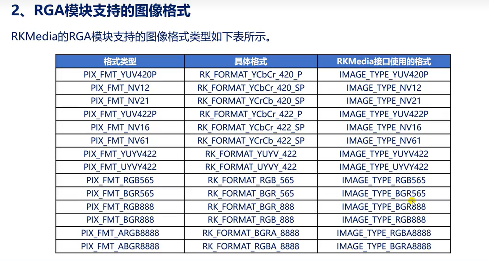


modetest命令可查看各个图层支持的格式

VOP对  VO_PLANE_PRIMARY = 0,
  VO_PLANE_OVERLAY,两层有裁剪功能。并且VO_PLANE_OVERLAY还支持缩放

  VO_PLANE_OVERLAY -> win0
  VO_PLANE_PRIMARY -> win2
  VO_PLANE_CURSOR -> 背景层（rv1126不支持）

### 杂项

**I帧（IDR帧，Instantaneous Decoding Refresh）** ：帧内编码帧是一种自带全部信息的独立帧，无需参考其它图像便可独立进行解码，视频序列中的第一个帧始终都是I帧。 属于帧内压缩，压缩质量好，压缩比例小。IDR帧一定是I帧，I帧不一定是IDR帧。

**P帧** ：前向参考，采用帧内、帧间压缩。

**B帧** ：前后参考，采用帧内、帧间压缩，实时视频传输会关闭B帧。未来无法预测，需要先将B帧缓冲，等待后面的帧解码后，再从B帧往后开始播放。

压缩比：B>P>I

**GOP** ：H264中GOP就是一个图像序列，即从I帧开始到最后一个连续的非I帧为止的一组帧，一般而言同一组GOP的帧之间相似度很高。
  
GOP又分两种：

- open GOP：不同GOP之间的P、B帧可以跨GOP进行参考
  
- close GOP：不同GOP之间的P、B帧不能跨GOP参考，也即不能参考IDR帧之前的帧。

RKKmedia的GOP有三种模式：如下：

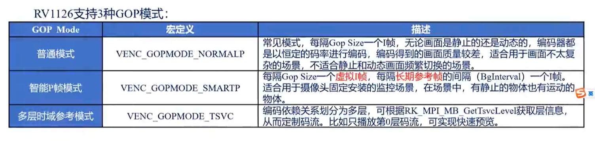

### 再细分

一帧图像可以划分成一个或者多个slice，slice称为片或者条带。

slice：I条带、P条带、B条带。为支持不同编码流之间的切换，还定义了SI条带、SP条带。

设置条带的目的就是为了并行编码，使编码片之间相互独立进行编码，能够限制误码的扩散和传播。

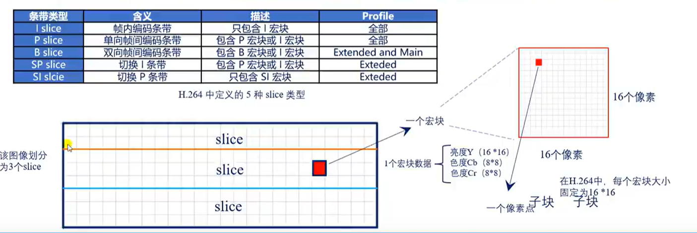

宏块就是视频压缩的基本单位、H264固定16*16。

H265：编码单元的名称叫：CTU（树形编码单元），大小是64*64像素，每个CTU包含3个CTB（树形编码快），每个CTU包含若干CU（编码单元），CU还能进行更灵活的细分。

8*8小宏块压缩比小，但图像质量好

16*16大宏块压缩比大，但图像质量查，一些些细节存在失真

---
---
---

## YUV

参考：[https://zhuanlan.zhihu.com/p/113122344](https://zhuanlan.zhihu.com/p/113122344)

首先了解一下RGB，RGB以三原色（红绿蓝）来表示一张图片，以一张1280 * 720 大小的图片为例，因为每个像素都有三个字节来控制颜色，所以占用 **1280 * 720 * 3 / 1024 / 1024 = 2.63 MB 存储空间**

而YUV 颜色编码采用的是 **明亮度** 和 **色度** 来指定像素的颜色。

**色度** 又定义了颜色的两个方面：色调和饱和度

也即yuv中每个像素也可以使用三个字节来控制其颜色。

**但是：** 对于 YUV 图像来说，**并不是每个像素点都需要包含了 Y、U、V 三个分量，根据不同的采样格式，可以每个 Y 分量都对应自己的 UV 分量，也可以几个 Y 分量共用 UV 分量。**Y 和 UV 分量是可以分离的，如果没有 UV 分量一样可以显示完整的图像，只不过是 **黑白的。**

yuv和rgb可以相互转化，一般来说，传输会使用yuv（节省带宽），显示的时候会使用rgb。公式如下：

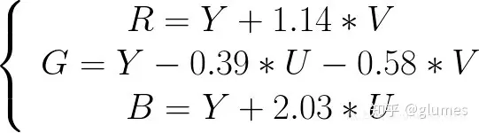

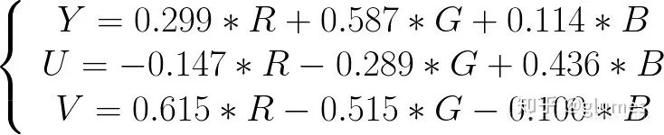


接下来就是yuv图像的采样，yuv图像的采样就是**基于上面rgb转换成yuv后的数据进行采样**，YUV 图像的主流采样方式有如下三种：

- YUV 4:4:4 采样

- YUV 4:2:2 采样

- YUV 4:2:0 采样

### YUV 4:4:4 采样

YUV 4:4:4 采样是完整的将rgb->yuv，不存在分量的丢失

形如：

```
rgb->yuv：

假如图像像素为：[Y0 U0 V0]、[Y1 U1 V1]、[Y2 U2 V2]、[Y3 U3 V3]

对yuv进行采样：

采样后的yuv码流：Y0 U0 V0 Y1 U1 V1 Y2 U2 V2 Y3 U3 V3

对采样后的yuv码流进行网络传输：...

将采样后的yuv码流->“完整”的yuv：

最后映射出的像素点依旧为 [Y0 U0 V0]、[Y1 U1 V1]、[Y2 U2 V2]、[Y3 U3 V3] 
```

可以看出来，其图像大小和rgb一样，没有达到节省带宽的目的。

YUV 4:4:4 也是采样进行的第一步，先将rgb码流转换成完整的yuv码流，再根据需求，对vu分量按比例进行采样。（**注意：y分量不可漏采！**）

### YUV 4:2:2 采样

表示uv分量占y分量的一半，形如：

```
rgb->yuv：

假如图像像素为：[Y0 U0 V0]、[Y1 U1 V1]、[Y2 U2 V2]、[Y3 U3 V3]

对yuv进行采样：

采样后的yuv码流为：Y0 U0 Y1 V1 Y2 U2 Y3 V3 

对采样后的yuv码流进行网络传输：...

将采样后的yuv码流->“完整”的yuv：

最后映射出的像素点为 [Y0 U0 V1]、[Y1 U0 V1]、[Y2 U2 V3]、[Y3 U2 V3]
```

**采样规则**： 每采样过一个像素点，都会采样其 Y 分量，而 U、V 分量就会 **间隔一列** 采样。也即uv分量是YUV 4:4:4的1/2

可以看到再最后将采样后的yuv”还原“成”完整“的yuv后，第一个像素和第二个像素共用一个uv分量。第三像素和第四像素也一样。并且采样后的yuv码流大小为：**（1280 * 720 * 1 + （1280 * 720） / 2 + （1280 * 720） / 2）/ 1024 / 1024 = 1.7578125 MB** 可以看到压缩了近三分之一的带宽。

### YUV 4:2:0 采样

YUV 4:2:0采样会比较难理解，举个例子，如下：

```
rgb->yuv：
 
假设图像像素为：
 
[Y0 U0 V0]、[Y1 U1 V1]、 [Y2 U2 V2]、 [Y3 U3 V3]
[Y5 U5 V5]、[Y6 U6 V6]、 [Y7 U7 V7] 、[Y8 U8 V8]
 
对yuv进行采样：

采样后的yuv码流为：Y0 U0 Y1 Y2 U2 Y3 Y5 V5 Y6 Y7 V7 Y8

对采样后的yuv码流进行网络传输：...
 
将采样后的yuv码流->“完整”的yuv：

最后映射出的像素点为：

[Y0 U0 V5]、[Y1 U0 V5]、[Y2 U2 V7]、[Y3 U2 V7]
[Y5 U0 V5]、[Y6 U0 V5]、[Y7 U2 V7]、[Y8 U2 V7]
```

**采样规则：** 每采样过一个像素点，都会采样其 Y 分量，而 U、V 分量就会交替 **间隔一行** 采样，并且一行采样中，**隔一列** 采样。也即uv分量是YUV 4:2:2 采样的1/2

最后在将采样的yuv”还原“成”完整“的yuv后，每四方格像素会共用一个uv分量。并且采样后的yuv码流大小为： **（1280 * 720 * 1 + （（1280  / 2） * （720 / 2）） + （（1280  / 2） * （720 / 2）））/ 1024 / 1024 = 1.318359375 MB** 将原来的rgb码流大小压缩了1/2倍！


### YUV 4:2:2 变种

YUV 4:2:2 采样又有很多变种，比如：YUYV 格式、UYVY 格式、YUV 422P 格式。

**YUYV（打包格式）形如：**

```
rgb->yuv：

假如图像像素为：[Y0 U0 V0]、[Y1 U1 V1]、[Y2 U2 V2]、[Y3 U3 V3]

对yuv进行采样：

采样后的yuv码流为：Y0 U0 Y1 V0 Y2 U1 Y3 V1 

对采样后的yuv码流进行网络传输：...

将采样后的yuv码流->“完整”的yuv：

最后映射出的像素点为 [Y0 U0 V0]、[Y1 U0 V0]、[Y2 U1 V1]、[Y3 U1 V1]
```

**采样规则：** 每采样过一个像素点，都会采样其 Y 分量，而 U、V 分量**逐帧依次**采样。

**UYVY（打包格式）** 和YUYV同理，仅仅存储的顺序不同。

**YUV 422P（平面格式）** ：先存储所有Y分量，再存储U，最后V。

### YUV 4:2:0 变种

主要包括两大类：YUV 420P 和 YUV 420SP，YUV 420P对应YU12、YV12，YUV 420SP对应NV12、NV21。YUV 420P 和 YUV 420SP都是基于平面模式存储。这里就不展开讨论。

---
---
---

## H264

可以参考网站： [https://www.zzsin.com/article/avc_0_start.html](https://www.zzsin.com/article/avc_0_start.html)

H264没有音频、没有时间戳，处理图像本身，啥都没有。

H264又称avc，由一个个nalu组成。

有两种标准：AnnexB、avcC

AnnexB，nalu之间**使用起始码分隔**（一般是001或者0001（每位代表一字节）），并且类型为**sps、pps的nalu当作普通nalu处理**。当然，如果原数据中本身存在001字节序列，为使其正常传输，在发送数据前，会将原数据中的所有的”已定义字符“（001/0001）转义一下，这也是防竞争字节的概念。规则如下：

```
0 0 0 => 0 0 3 0
0 0 1 => 0 0 3 1
0 0 2 => 0 0 3 2
0 0 3 => 0 0 3 3
```

avcC，在每个nalu前面有一个固定长度的字节，这些字节会描述紧跟着的nalu有效载荷数据的长度。并且在一路采用 avcC 打包的 H.264 流之中，我们首先看到的将是一段被称之为 extradata 的数据，这段数据定义了这个 H.264 流的基本属性数据，当然，也包含了 SPS 和 PPS 数据。和AnnexB不同，avcC会将SPS和PPS放到extradata中（也可以把extradata看作协议头）。extradata还会定义，固定长度的字节的固定长度。extradata格式如下：

|长度(bits)	|名称	                                      |备注                               |
|:-        |:-                                        |:-                                |
|8	        |version	                                  |总是等于 0x01                      |
|8	        |avc profile	                              |所存放第一个 SPS 的第一个字节        |
|8	        |avc compatibility	                        |所存放第一个 SPS 的第二个字节        |
|8	        |avc level	                                |所存放第一个 SPS 的第三个字节        |
|6	        |reserved	                                  |保留字段                             |
|2	        |NALULengthSizeMinusOne	                    |NALU Body Length 数据的长度减去 1    |
|3	        |reserved	                                  |保留字段                             |
|5	        |number of SPS NALUs	                      |有几个 SPS，一般情况下这里是 1         |
|           |for(int i=0; i<number of SPS NALUs; i++){	|~                                  |
|16	        |SPS size	                                  |SPS 的长度                           |
|变长	       |SPS NALU data	                             |SPS NALU 的数据                     |
|            |}	                                         |~                                   |
|8	         |number of PPS NALUs	                        |有几个 PPS，一般情况下这里是 1       |
|           |for(int i=0; i<number of PPS NALUs; i++){	|~                                    |
|16	        |PPS size	                                  |PPS 的长度                           |
|变长	       |PPS NALU data	                             |PPS NALU 的数据                     |
|           |}	                                         |~                                   |

nalu的第一个字节依次存放：禁止位、该nalu的重要性、nalu的类型。格式如下：

|nal_unit( NumBytesInNALunit )	|C	  |Descriptor|
|:-:                            |:-:  |:-:|
|forbidden_zero_bit	            |All	|f(1)|
|nal_ref_idc	                  |All	|u(2)|
|nal_unit_type	                |All	|u(5)|
|...	                          |...	|...|

典型的nalu类型有：

nalu的类型为sps（Sequence Paramater Set）的level表示视频质量（5.1）

nalu的类型为sps（Sequence Paramater Set）的profile表示码流压缩档次（100）

nalu的类型为sei：补充增强信息单元。存放用户自定义的信息（可有可无

其余的参考下图：

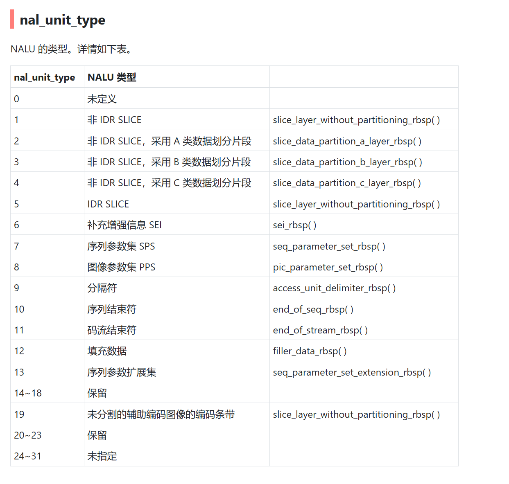

sps的profile值可以参考如下：

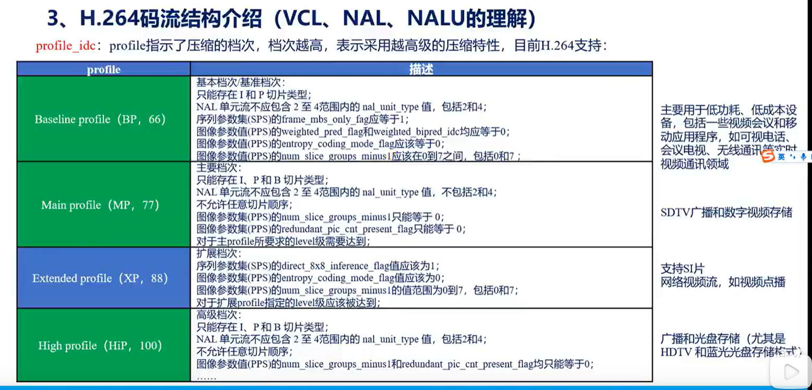

nalu后续字节就是图像的有效载荷。

---
---
---

## 杂项

H264中，码率控制模式（RCMode）包括：CBR、VBR、AVBR

1. CBR：恒定码率，码率变化平稳，但是当有运动画面时，图像质量会变差只考虑带宽、不考虑图像质量，可以使用这种模式

2. VBR：可变码率，码率会**依据图像质量的变化而变化**，在意图像质量可以使用该模式。

3. AVBR：自适应可变码率，会**自动检测当前编码的图像画面是运动的还是静止的**，如果是运动的，会提高码率，否则会降低码率，同时考虑带宽和图像质量就使用该模式。结合了CBR和VBR的优点。

RKMedia中有专门的成员来配置选择哪种模式。

ROI：region of interest：感兴趣的区域。

SVC和AVC都属于H264但是属于不同标准

---

**本章完结**