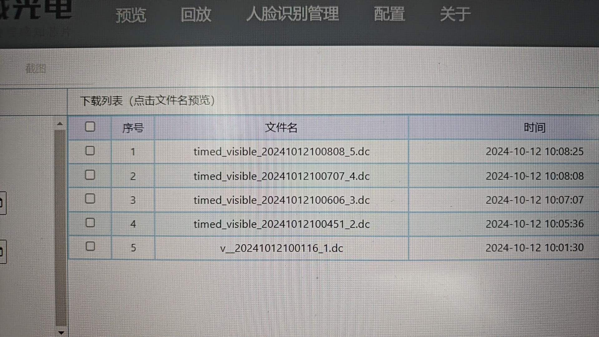
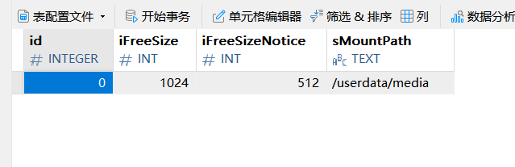
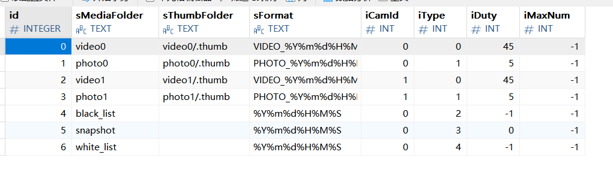
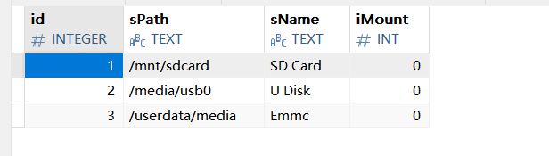
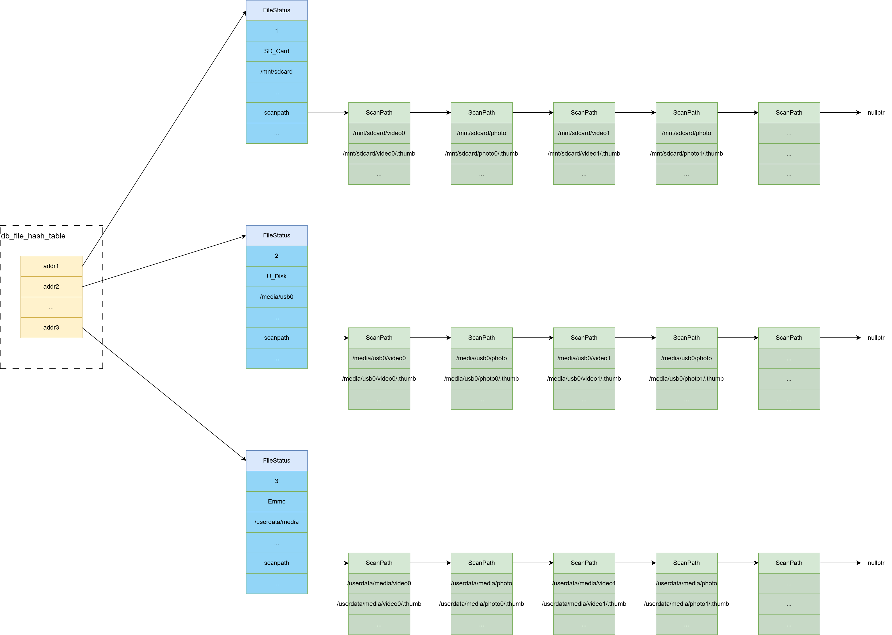

## 前言

首先说明一下StorageManager在IPC中起到的作用：从英文命名可以大致猜出它的作用——存储管理，主要功能就是维护存储的目录结构以及数据库。

进一步的：这些目录里面会放什么？数据库里面会放什么？

下面一一回答这些问题：

1. 目录主要会存放手动/自动录制的**视频**以及抓拍的**照片**。

2. 数据库主要记录录制视频、照片的**文件名**。在网页如下页面中的视频/照片列表的数据来源就是这个数据库。

如下表数据就来自StorageManager独自维护的数据库当中：
<!-- more -->



这里强调一下，StorageManager和自动存储功能需要区分开，自动存储并不由StorageManager实现，而是在mediaserver中由SchedulesManager来实现，该模块会在以后的博客进行讲解，本文主要集中在StorageManager。

其实在看StorageManager之前我是带着一些疑问的：

在IPC网页上进行手动/自动视频录制时，产生的视频文件放在了哪里？视频的文件名肯定是保存在数据库当中的。所以首要的目标就是找到存储视频文件名的数据库。经过深入阅读rkmedia下的muxer_flow，发现视频文件的创建和写入就是在这个类中进行，但奇怪的是我搜遍了mediaserver，没一处是向数据库中写入录制视频的文件名的。（PS：我当时并不知道存储视频文件名的数据库是在StorageManager当中。）

苦苦寻找很久，最后准备转变思路看看网页在删除录制的视频文件时会和哪个数据库产生关联？结果前端在点击删除视频文件时，后端会做如下操作：

```cpp
// ipcweb-backend/src/storage_api.cpp
int media_file_delete(std::string delete_type, nlohmann::json file_list) {
    int path_id = file_path_get(delete_type);
    if (path_id < 0) {
        return 0;
    }
    char *str = storage_manager_get_media_path();
    nlohmann::json scan_path = nlohmann::json::parse(str).at("sScanPath");
    std::string path = scan_path.at(path_id).at("sMediaPath");
    for (auto &x: nlohmann::json::iterator_wrapper(file_list)) {
        std::string delete_name = x.value();
        if (delete_name.find("/") == std::string::npos) {
            std::string delete_path = path + "/" + delete_name;
            int rst = unlink((char *)delete_path.c_str());
        } else {
            minilog_debug("media_file_delete: unlaw name is %s", (char *)delete_name.c_str());
        }
    }
    return 1;
}
```

什么？删除文件直接unlink？？？这也太暴力了，并且这块也没有删除数据库的操作啊，网页上显示数据库确实 **（通过某种方式）检测** 到文件被unlink了并且自动删除数据库中对应的文件名。这种操作也太奇怪了！此时我注意到了：“sScanPath”、“sMediaPath”等字眼。所以经过一番跟踪，了解真相原来在StorageManager当中。并且在muxer_flow创建一个视频文件时，也是 **通过某种方式检测** 到文件被create并且自动将其添加到数据库当中。

所以接下来让我们一步一步去解析。

## StorageManager的实现

首先贴上StorageManager核心初始化代码，篇幅有限，这里省略和dbserver重合的初始化代码：

```cpp
static void *main_init(void *arg) {
    LOG_INFO("storage_manager init\n");
    msg_init();
    remove(db_file);
    rkdb_init(db_file);
    db_monitor_init();
    manage_init();          // 消息处理线程在此处启动
    uevent_monitor_init();
    LOG_INFO("storage_manager init finish\n");
}

int main( int argc , char ** argv) {
    pthread_create(&thread_id, NULL, (void*)main_init, NULL);
}
```

### 消息机制 - msg_init()

msg_init会初始化一个消息队列，它的实现很简单，主要在msg_process.c文件，对StorageManager的任何操作都是先将其封装成一条带类型的消息，然后将其放到消息队列当中，等待消息处理线程的消费。没错，这就是经典的**生产者消费者问题**的简单实现。

### StorageManager核心 - db_monitor_init()

如小标题所言，db_monitor_init所做的初始化正是StorageManager的核心所在，它会构建出存储目录的结构，并且每次开机都**新建**一个数据库，将所有的视频文件和图片名**重新**添加到数据库当中。并通过一种类似eopll的消息机制来监视视频文件的变化。

db_monitor_init所做的初始化如下：

```cpp
void db_monitor_init(void)
{
    disable_loop();
#ifdef AUTO_ADJUST_MEDIAPATH
    if (access("/dev/block/by-name/media", F_OK)) {
        LOG_INFO("/dev/block/by-name/media folder does not exist, using /userdata/ as emmc path\n");
        while (set_emmc_path("/userdata") != 0) {
            LOG_INFO("set_emmc_path, wait dbserver.\n");
            usleep(50000);
        }
    } else {
        LOG_INFO("/dev/block/by-name/media folder exist\n");
    }
#endif
    while (get_storage_config() != 0) {
        LOG_INFO("dbserver_get_storage_config, wait dbserver.\n");
        usleep(50000);
    }
    while (get_meida_folder() != 0) {
        LOG_INFO("dbserver_get_meida_folder, wait dbserver.\n");
        usleep(50000);
    }

    while (get_disk_path() != 0) {
        LOG_INFO("dbserver_get_disk_path, wait dbserver.\n");
        usleep(50000);
    }
    dbus_monitor_signal_registered(DBSERVER_STORAGE_INTERFACE, DS_SIGNAL_DATACHANGED, &signal_storage_datachanged);
}
```

因为main中会主动开启dbus的loop所以，这里调用了一下disable_loop防止dbus_monitor_signal_registered函数在注册信号时自动又开启一个loop。

从上面的代码可以看到有四个while循环，我们下面把注意主要放在最后三个while循环上。

#### 配置默认使用的挂载点 - get_storage_config

代码如下：

```cpp
static int get_storage_config(void) {
    char *json_str = dbserver_get_storage_config();

    if (json_str) {
        add_db_storage_config(json_str);
        g_free(json_str);
        return 0;
    }

    return -1;
}
```

该函数首先会向dbserver读取默认挂载点的配置，如下：



经过阅读源码得知，该MountPath就是emmc的挂载目录。

然后调用add_db_storage_config函数向消息队列中添加一条配置当前存储路径的消息，存储路径正是使用的数据库当中的默认配置：/userdata/media。正是这个原因，在系统最开始的时候，打开网页，我们录制的视频默认都会放在emmc的挂载目录下。

消息处理函数如下：

```cpp
static void add_storage_config(char *json_str)
{
    json_object *j_ret = json_tokener_parse(json_str);
    json_object *j_array = json_object_object_get(j_ret, "jData");
    int len = json_object_array_length(j_array);

    for (int i = 0; i < len; i++) {
        json_object *j_obj = json_object_array_get_idx(j_array, i);
        char *path = (char *)json_object_get_string(json_object_object_get(j_obj, "sMountPath"));
        if (storage_config.mountpath)
            g_free(storage_config.mountpath);
        storage_config.mountpath = g_strdup_printf("%s", path);
        storage_config.id = (int)json_object_get_int(json_object_object_get(j_obj, "id"));
        storage_config.freesize = (int)json_object_get_int(json_object_object_get(j_obj, "iFreeSize"));
        storage_config.freesizenotice = (int)json_object_get_int(json_object_object_get(j_obj, "iFreeSizeNotice"));
    }
    json_object_put(j_ret);
    signal_update_media_path();
}
```

函数实现非常简单，就是解析数据库里的数据，然后填充到storage_config变量上。

其中storage_config全局变量会记录当前存储系统使用的存储介质的挂载点。它的结构体定义如下：

```cpp
struct StorageConfig {
    int id;
    int freesize;
    int freesizenotice;
    char *mountpath;    // 挂载点
};
```

#### 构造db_media_folder_list目录链表 - get_meida_folder

代码如下：

```cpp
static int get_meida_folder(void) {
    char *json_str = dbserver_get_storage_media_folder();

    if (json_str) {
        add_db_media_folder(json_str);
        g_free(json_str);
        return 0;
    }

    return -1;
}
```

该函数会先查询dbserver的StorageMediaFolder表，在我们的项目中，该表有如下数据：



这里解释一下表中各个字段的意义：

|   id      |   sMediaFolder    |   sThumbFolder        |   sFormat                 |   icamld          |   iType   |   iDuty   |   iMaxNUI |
|   :-:     |   :-:             |   :-:                 |   :-:                     |   :-:             |   :-:     |   :-:     |   :-:     |
|   目录ID  | 目录名             |   缓存文件目录名       | 目录当中文件所使用的格式    |   目录属于（当前）拼接码流还是融合码流（0：拼接，1：融合）|   目录存放文件类型（0：video，1：photo，其他（PS目前还不太清楚））|   目录中文件总大小超过介质的多少（百分比）开始回滚（删除最早视频）|   目录中文件总的数量超过该值即开始回滚    |


**拿到所有的entry后，会让每个entry作为一个节点，构造成一个链表：**

```cpp
static void add_media_folder(char *json_str)
{
    json_object *j_ret = json_tokener_parse(json_str);
    json_object *j_array = json_object_object_get(j_ret, "jData");

    int len = json_object_array_length(j_array);

    for (int i = 0; i < len; i++) {
        struct DbMediaFolder *mediafolder = malloc(sizeof(struct DbMediaFolder));
        if (db_media_folder_list) {
            struct DbMediaFolder *tmp = db_media_folder_list;
            while (tmp->next) {
                tmp = tmp->next;
            }
            tmp->next = mediafolder;
        } else {
            db_media_folder_list = mediafolder;
        }
        json_object *j_obj = json_object_array_get_idx(j_array, i);
        mediafolder->media_folder = g_strdup((char *)json_object_get_string(json_object_object_get(j_obj, "sMediaFolder")));
        /* 省略... */
        mediafolder->maxnum = (int)json_object_get_int(json_object_object_get(j_obj, "iMaxNum"));
        mediafolder->next = NULL;
    }
    json_object_put(j_ret);
}
```

这段尾插构造链表的代码也不过多啰嗦了，最终形成如下结构：

```bash
db_media_folder_list -> (DbMediaFolder{.media_folder=video0，.thumb_folder=video0/.thumb, ...})
                                    |
                                    V
                        (DbMediaFolder{.media_folder=photo0，.thumb_folder=photo0/.thumb, ...})
                                    |
                                    V
                        (DbMediaFolder{.media_folder=video1，.thumb_folder=video1/.thumb, ...})
                                    |
                                    V
                        (DbMediaFolder{.media_folder=photo1，.thumb_folder=photo1/.thumb, ...})
                                    |
                                    V
                        (DbMediaFolder{.media_folder=black_list, ...})
                                    |
                                    V
                        (DbMediaFolder{.media_folder=snapshot, ...})
                                    |
                                    V
                        (DbMediaFolder{.media_folder=white_list, ...})
                                    |
                                    V
                                nullptr
```

#### 构造存储路径结构链表 - get_disk_path

代码如下：

```cpp
static int get_disk_path(void) {
    char *json_str = dbserver_get_storage_disk_path(NULL);

    if (json_str) {
        add_db_disk_path(json_str);
        g_free(json_str);
        return 0;
    }

    return -1;
}
```

先是查询dbserver的StorageDiskPath表，在项目中，该表的数据如下：



该表各个字段的含义如下：

|   id          |   sPath           |   sName       |   iMount          |
|   :-:         |   :-:             |   :-:         |   :-:             |
|   就是ID嘛    |   存储介质挂载点  |   存储介质的名字  |   是否已经被挂载  |

拿到所有的entry后，也是封装成一条消息，消息的处理函数的逻辑是这样的：**结合上一节的db_media_folder_list，分别为每个介质的挂载点构造一条目录路径链表。（PS，如果你学习过数据库笛卡尔积的概念，可能这样解释会更加清晰一点：这里的处理函数其实就是在将StorageDiskPath表 和 上一节构造的db_media_folder_list做笛卡尔积）**

```cpp
static void add_disk_path(char *json_str)
{
    json_object *j_ret = json_tokener_parse(json_str);
    json_object *j_array = json_object_object_get(j_ret, "jData");
    int len = json_object_array_length(j_array);

    for (int i = 0; i < len; i++) {
        json_object *j_obj = json_object_array_get_idx(j_array, i);

        char *path = (char *)json_object_get_string(json_object_object_get(j_obj, "sPath"));
        struct FileStatus *status = g_hash_table_lookup(db_file_hash, path);

        if (status == NULL) {
            status = malloc(sizeof(struct FileStatus));
            memset(status, 0, sizeof(struct FileStatus));
            pthread_mutex_init(&(status->mutex), NULL);
            pthread_cond_init(&(status->cond), NULL);
            g_hash_table_replace(db_file_hash, g_strdup(path), (gpointer)status);
        }
        status->mountpath = g_strdup(path);
        status->id = (int)json_object_get_int(json_object_object_get(j_obj, "id"));
        status->name = g_strdup((char *)json_object_get_string(json_object_object_get(j_obj, "sName")));
        status->mount = (int)json_object_get_int(json_object_object_get(j_obj, "iMount"));

        struct DbMediaFolder *media_folder = db_media_folder_list;
        struct ScanPath *scanpath_last = NULL;
        while (media_folder) {
            struct ScanPath *scanpath = (struct ScanPath *)calloc(1, sizeof(struct ScanPath));
            if (scanpath_last == NULL) {
                status->scanpath = scanpath;
            } else {
                scanpath_last->next = scanpath;
            }
            scanpath_last = scanpath;
            scanpath->media_path = g_strdup_printf("%s/%s", status->mountpath, media_folder->media_folder);
            if (media_folder->thumb_folder && (!g_str_equal(media_folder->thumb_folder, "")))
                scanpath->thumb_path = g_strdup_printf("%s/%s", status->mountpath, media_folder->thumb_folder);
            else
                scanpath->thumb_path = NULL;
            scanpath->db_media_folder = media_folder;
            media_folder = media_folder->next;
        }
        file_scan_run(status->mountpath);
    }
    json_object_put(j_ret);
}
```

看到自己贴了这么一大段代码其实挺愧疚的，其实如果你认真阅读下来，一点也不复杂。本来想删减一些不重要的东西，但是又感觉都挺重要的。每次写博客，写着写着，不知不觉就开始无情的贴代码，导致通篇代码比例占比特别高，挺烦躁的。为平衡一下代码和文字的比例，提高博文质量，这里画了一下最终会形成的一种结构：



好了，storage manager维护的整体目录结构已经在我们的脑海中有了一个清晰的轮廓。

回到文章开头的几个问题：管理录像文件名的数据库在啥时候创建的？当flow_muxer创建一个录像文件时，或者用户删除数据库时，storage manager这么得知这些事件的产生的？storage manager又是怎么知道要删除的录像文件名的？

注意上面代码for循环中最后执行的file_scan_run函数，我可以明确的告诉你，所有的秘密都在scan_run函数当中：

```cpp
static void file_scan_run(char *path)
{
    struct FileStatus *status;

    status = g_hash_table_lookup(db_file_hash, path);

    if (status != NULL && status->run == 0) {
        char *dev = NULL;
        char *type = NULL;
        char *attributes = NULL;

        if (checkdev(path, &dev, &type, &attributes) == 0) {    // 如果挂载点存在
            /* ... */
            status->dev = dev;
            status->type = type;
            status->attributes = attributes;
            status->run = 1;
            status->mount_status = 1;
            LOG_DEBUG("befpre pthread: path: %s\n", path);
            pthread_create(&status->scan_tid, NULL, file_scan_thread, status);
        }
    }
}
```

继续跟file_scan_thread！（PS：以狂热而且热切并且迫不及待的语气）

```cpp
static void *file_scan_thread(void *arg)
{
    char *db;

    char *col_para = "id INTEGER PRIMARY KEY AUTOINCREMENT," \
                     "iPATHID INT DEFAULT 0," \
                     "sNAME TEXT," \
                     "sSIZE TEXT," \
                     "iTIME INT";

    struct FileStatus *status;
    prctl(PR_SET_NAME, "file_scan_thread", 0, 0, 0);
    status = (struct FileStatus *)arg;

    // 将挂载目录转换成数据库表名。
    db = pathtodb(status->mountpath);
    // 创建并清空数据库
    g_free(rkdb_create(db, col_para));
    g_free(rkdb_delete(db, NULL));
    if (status->db)
        g_free(status->db);
    status->db = db;            // 表明记录到FileStatus中

    // 初始化操作
    checkdisksize(status->mountpath, &status->total_size, &status->free_size);
    signal_update_disks_status(status->mountpath);
    LOG_INFO("%s: mount path:%s\n", __FUNCTION__, status->mountpath);

    // 扫描挂载点当中所有文件，并将所有文件加入到数据库当中
    scanfile(status);

    if (status->run) {
        // 创建文件增加、删除事件监听线程，监视挂载点文件的修改，并同步到数据库当中
        pthread_create(&status->scan_monitor_tid, NULL, file_monitor_thread, status);
        // 创建回滚线程，当挂载点文件数量或大小达到设定值就回滚删除最老的文件
        pthread_create(&status->delete_file_tid, NULL, delete_file_thread, status);
    }

    /* ... */
}
```

主要就是干了四件事：

1. 根据挂载点的名字创建一张表。

2. 进入挂载点目录，扫描里面的文件，将其同步到数据库表当中。

3. 创建文件增加、删除事件监听线程，监视挂载点文件的修改，并同步到数据库当中。

4. 创建回滚线程，当挂载点文件数量或大小达到设定值就回滚删除最老的文件。

终于真相大白，下面只需要深入细节看看它们的实现。这里就只简单聊一下3、4的做法。

对于第2件事，它的实现非常简单，就调用了linux几个操作目录的接口来扫描所有的文件，然后将文件添加到数据库。仅此而已。感兴趣的读者可以自行查看源码。

对于第3监事，也即file_monitor_thread线程回调函数的实现如下：

```cpp
static void *file_monitor_thread(void *arg)
{
    int fd;
    int len;
    int nread;
    char buf[BUFSIZ];
    struct inotify_event *event;
    int i;
    struct FileStatus *status;
    status = (struct FileStatus *)arg;

    // 创建notify套接字，然后添加需要监听的目录及事件
    fd = inotify_init();
    struct ScanPath *scanpath = status->scanpath;
    while (scanpath) {
        scanpath->wd = inotify_add_watch(fd, scanpath->media_path, IN_CREATE | IN_MOVED_TO | IN_DELETE | IN_MOVED_FROM | IN_CLOSE_WRITE);
        scanpath = scanpath->next;
    }

    buf[sizeof(buf) - 1] = 0;
    while ((len = read(fd, buf, sizeof(buf) - 1)) > 0) {
        nread = 0;
        while (len > 0) {
            event = (struct inotify_event *)&buf[nread];

            for (i = 0; i < EVENT_NUM; i++) {
                if ((event->mask >> i) & 1) {
                    if (event->len > 0) {
                        scanpath = status->scanpath;
                        while (scanpath) {
                            if (event->wd == scanpath->wd) {
                                if (g_str_equal(event_str[i], "IN_CREATE") || g_str_equal(event_str[i], "IN_MOVED_TO")) {
                                    // 新建文件，同步到数据库
                                    // ... 
                                } else if (g_str_equal(event_str[i], "IN_DELETE") || g_str_equal(event_str[i], "IN_MOVED_FROM")) {
                                    // 文件删除，同步到数据库
                                    // ...
                                } else if (g_str_equal(event_str[i], "IN_CLOSE_WRITE")) {
                                    // 写完更新数据库当中文件的大小
                                    // ...
                                 }
                                break;
                            }
                            scanpath = scanpath->next;
                        }
                    }
                }
            }
            nread = nread + sizeof(struct inotify_event) + event->len;
            len = len - sizeof(struct inotify_event) - event->len;
        }
    }
    pthread_detach(pthread_self());
    pthread_exit(NULL);
}
```


inotify是一种强大的、细粒度的、异步的文件系统事件监控机制，linux内核从2.6.13起，加入了inotify支持，通过Inotify可以监控文件系统添加、删除、移动、修改等各种事件，利用这个内核接口，第三方软件就可以监控文件系统下文件的各种变化情况。Inotify可用于检测单个文件，也可以检测整个目录。当检测的对象是一个目录的时候，目录本身和目录里的内容都会成为检测的对象。可以使用select、poll、epoll这些接口来监听，当有事件发生是，inotify文件描述符会可读。

这里不得不感叹一下linux的强大，提供了这么优雅的接口。虽然相对整个storage manager是异步，但是直接开一个单独的线程去同步监听处理还是很暴力的。考虑到我们ipc项目存储相关的业务不是特别复杂，所以这里的用法还是可以接受的。

最后就是回滚删除线程：

```cpp
static void *delete_file_thread(void *arg)
{
	  struct FileStatus *status = (struct FileStatus *)arg;

    while (status->run) {
        int i;
        long total = 0;
        checkdisksize(status->mountpath, &status->total_size, &status->free_size);

        total = status->free_size;
        struct ScanPath *scanpath = status->scanpath;
        size_t media_size = 0;
        while (scanpath) {
            while ((scanpath->db_media_folder->maxnum >= 0) && (scanpath->num > scanpath->db_media_folder->maxnum)) {
                struct OldFile *oldfile = get_old_file(status, scanpath);
                // 如果文件数量超过限制，删除最老的文件
                // ...
            }

            scanpath = scanpath->next;
        }

        if ((status->free_size < (storage_config.freesize * 1024)) && (total > 0)) {
            scanpath = status->scanpath;
            while (scanpath) {
                float duty = (float)scanpath->totalsize * 100 / total;
                if (duty > scanpath->db_media_folder->duty && scanpath->db_media_folder->duty >= 0) {
                    // 如果视频/图像文件大小占比超过设定值，删除最老的文件
                    // ...
                }

                scanpath = scanpath->next;
            }
        } else {
            usleep(2000000);
        }
    }
}
```

所以从整体来看，storage manager会为每个（**被checkdev探测到已存在的**）挂载点都创建一个单独的目录事件监听线程和删除线程。

一旦在挂载点的某个目录下新增/删除某个文件，都会被file_monitor_thread线程检测到，此时file_monitor_thread线程就会将操作同步到数据库。当（视频/图片）文件超过一定数量/大小，都会被delete_file_thread线程注意到，此时delete_file_thread线程就会执行回滚操作，删除最老的文件。产生一种新文件覆盖老文件的现象。

至此，storage manager核心功能、以及开头的问题都已解释清楚。

---

**本章完结**