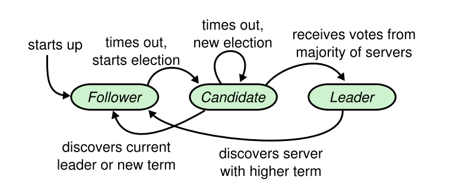

**资源分享：**

官网地址：[http://nil.csail.mit.edu/6.5840/2023/](http://nil.csail.mit.edu/6.5840/2023/)

Raft论文地址：[http://nil.csail.mit.edu/6.5840/2023/papers/raft-extended.pdf](http://nil.csail.mit.edu/6.5840/2023/papers/raft-extended.pdf)

官方学生指导（又称官方避坑指导）：[https://thesquareplanet.com/blog/students-guide-to-raft/](https://thesquareplanet.com/blog/students-guide-to-raft/)

**总结：**

**简单来说，Raft算法是：可以让一条数据备份到多台机器上，而在外部看来，好像只有一台机器的样子。** ，实验做完到现在，也过去了很久了，在这里只能模模糊糊还原当时遇到的一些印象比较深的BUG，千言万语，还是亲身体验一下这些坑，印象才会深刻。


<!-- more -->
## 算法整体流程概述

这里只对算法整体流程做一个总结。如果想从代码上实现一个Raft，请移步到Raft论文的Figure 2，许多非常精妙的细节还需按照论文中的描述一步一步去实现，要不然BUG真的满天飞。学生指导也是这么强调。

首先引用论文中的Figure 4：



**算法涉及两个定时器：** 选举定时器、心跳定时器。

0. **初始化状态：** 所有节点处于Follower状态，选举定时器开启，心跳定时器关闭。

1. **作为Leader：** 进行日志复制，将一条日志通过RPC，发送给其他节点，从而保持一致性。当然如果某一个节点落后太多，过早的日志被压缩了，Leader会给节点发送快照。拥有心跳定时器，超时就向所有其他节点发送心跳，给自己续命，防止其他节点发起选举，心跳也是一种特殊的日志。

2. **作为Follower：** 接收Leader发来的日志和快照。处理其他节点投票的请求。拥有选举定时器，超时就转为Candidate，开始选举。

3. **作为Candidate：** 给所有其他节点发送RequestVote RPC拉票。期间，如果获得大多数节点的投票就成为Leader。拥有选举定时器，超时就转为Candidate，重新选举。

**所有节点都会存在的逻辑：** 意识到有新Leader已经诞生就变成Follower状态，**当然之前如果是Leader状态，转变成Follower前需要开启选举定时器并关闭心跳定时器。** 不断的向应用层Apply日志，直到首个未被提交的日志为止。


## 细节描述 & 踩坑记录

我的Raft结构体大概长这个样子：

```go
type Raft struct {
	mu        sync.Mutex          // 全局锁
	peers     []*labrpc.ClientEnd // 其他节点的rpc对象
	persister *Persister          // 本端必要数据持久化的对象
	me        int                 // 本端在peers的索引
	dead      int32               // set by Kill()

	// Your data here (2A, 2B, 2C).
	// Look at the paper's Figure 2 for a description of what
	// state a Raft server must maintain.
	// table map[uint]map[uint]uint
	electTimer     *time.Timer  	// 选举超时定时器（Fllower和Candidate有效
	heartbeatTimer *time.Timer  	// 心跳超时定时器（发送心跳
	applyCh        chan ApplyMsg    // raft层和应用层通信的chan
	wakeupApply    chan interface{} // 唤醒后台协程去Apply日志
	wakeupSnapshot chan ApplyMsg	// 唤醒后台协程去Apply快照
	state          uint //当前服务器扮演的角色

	// Persistent state on all servers:
	currentTerm      int32  		// 当前节点的时期
	votedFor         int32  		// 当前节点将票投给了谁？
	logs             []LogEntry 	// 产生的日志
	lastIncludeIndex int32  		// 最后一条被压缩的日志的索引
	lastIncludeTerm  int32  		// 最后一条被压缩的日志的时期
	// Volatile state on all servers:
	commitIndex int32   			// 提交成功的日志索引
	lastApplied int32   			// 被上层应用成功的日志的索引

	// Volatile state on leaders:
	nextIndex  []int32  			// Leader下一次应该从哪里发日志给对端
	matchIndex []int32  			// Leader对端当前和本段哪里匹配

	snapshotCount int32 			// 有几个协程正在安装快照，确保快照安装的原子性
}
```

其中每个成员的作用，已经注明。


### 1. 关于加锁-解锁-又加锁带来的问题

这个BUG我并没有遇到，一开始写代码的时候就考虑到了这种情况，也算是迸现了一点点码感吧。只不过确实很容易踩坑，所以在这里记录一下。常听到的**一把大锁保平安**的缘由，就在这。在一个代码块中，如果间断性加解锁，新手很容易出现一些奇奇怪怪的线程安全问题。举个例子，有如下逻辑：

```go
func (data *Data) Task() {
	data.mu.Lock()
	// 临界区1

	// 对data做一些条件判断
	if !data.has{
		return
	}
	// ...
	data.mu.Unlock()

	DoLongTimeWork()

	data.mu.Lock()
	// 临界区2

	// 因为data.hash == true 所以做一些后续处理。
}
```

这段间断加锁的代码看似没什么逻辑问题，但是在多线程（协程）情况下，**临界区1做的条件判断，对于临界区2是无效的**，临界区2做的处理不能依赖临界区1的判断。因为临界区1到临界区2是有一段未持锁的区间的。在该区间，可能发生切换，导致有其他协程对data的成员发生了更改（data.has被置为false），从而导致之前临界区2做出错误的处理。要修复这个BUG就需要在临界区2上锁后，再进行一次判断（“冗余”判断），如下：

```go
func (data *Data) Task() {
	data.mu.Lock()
	// 临界区1

	// 对data做一些条件判断
	if !data.has{
		return
	}
	// ...
	data.mu.Unlock()

	DoLongTimeWork()

	data.mu.Lock()
	// 临界区2
	if !data.has {
		return
	}
	// 因为data.hash == true 所以做一些后续处理。
}
```

这是编写多线程程序非常容易出现的一个问题。在MIT6.824的Raft实现中很多地方的需求是必须使用阶段性加锁的逻辑，比如Leader进行日志复制时，需要解锁调用RPC。RPC调用完成后，再加锁，需要检查reqArgs.Term是否和节点当前的Term一致，不一致需要直接返回，因为**节点只能处理同一Term发送的RPC请求。** 从直觉上，也应该这么做。学生指导好像也提到过这个问题。

于此同时，我做实验碰到的一个相关的低级BUG是，**调用RPC后没有接它的返回值去判断RPC调用成功了没有！！！** 这点一定要注意。


### 2. 关于index等于0的日志的含义的抽象。

在实现lab2的 `Part 2D: log compaction (hard)`前，需要保证index为0的日志是Term为0的“守护”日志，logs数组初始化长度为1。这样做的原因是防止有节点落后Leader太多，所有日志都和Leader不匹配，从而回退到了index为1的日志，此时我们定义的index为0的日志作用就生效了，因为每一个节点的index为0的日志其index和Term一定是一样的，保证了日志复制在index为1时绝对的成功性。

在实现lab2的 `Part 2D: log compaction (hard)`后，由于我的实现是利用了logs[0]的日志。而在系统刚启动时，对于index为0的日志我将其抽象成了lastIncludeIndex为0、lastIncludeTerm也为0的默认已经被压缩过的日志，当Leader需要向其他节点复制index为1的日志时，也保证了其绝对的成功性。


### 3. 选举定时器的重置时机的讲究

做实验前，本人就没有好好的去阅读官方的避坑指南，所以在这里就栽了跟头。导致了莫名奇妙的活锁。

**错误复现：** 最开始的实现是，除了选举时、成功收到日志时会重置选举定时器外，一旦节点意识到有新Leader产生，我都会将选举定时器重置。

**正确实现：** 查阅官方避坑指南后，重置定时器有三个时期：

1. 从当前Leader那里收到AppendEntries RPC（本端Term和arg中的Term一定要一致！）。

2. 开始一次选举

3. 被请求投票时，同意将票投给对方。

此外还要注意，保证定时器类型的正确性。当转换成Leader时，要开启心跳定时器 && 关闭选举定时器。当转换成Follower或者Candidate时，要关闭心跳定时器 && 开启选举定时器！在Candidate选举失败时，注意找时机回到Follower状态！


### 4. 别把心跳不当日志，当然，正常的日志也能当成是一次心跳！

关于心跳定时器的重置时期：每次发送日志都可以重置一下心跳定时器。

当对某个节点已经达成一致，没有可复制的日志时，实现中还是要发一条Entries为0的日志。我的实现中，利用go语言的for实现了一种do while的结构，如下：

```go
for{
	// 做一些工作
	// ...

	if 条件不满足 {
		break
	}
}
```

### 5. 日志回退加速的优化

Raft论文中，认为日志回退加速的优化是没有必要的，因为在实际中，逐步回退完全够用。但是MIT6.824要求实现这一优化。

根据官方避坑指导，应该这样做：

在AppendEntries RPC的reply中加上两个字段：conflictIndex、conflictTerm 。

对于AppendEntries RPC的接收方

- 如果prevLogIndex 不在logs的表示的范围内，就将conflictIndex置为最后一条日志的index + 1，并且conflictTerm为non。

- 如果prevLogIndex 在logs的表示的范围内，但是prevLogTerm对不上，conflictTerm置为本端索引为prevLogIndex的日志的Term，conflictIndex置为Term为conflictTerm的第一个日志的索引。（当然要保证conflictIndex > rf.lastIncludeIndex）

对于AppendEntries RPC的发送方

- 如果接收方的logs中有可能找到Term为conflictTerm的日志，将相应的next置为最后一个Term为conflictTerm的日志的index + 1

- 否则，说明既然当前作为Leader的我没有该Term，你Follower就别保留和该Term的日志了，直接将相应的next置为conflictIndex即可。

官方避坑指南说，可以只实现conflictIndex，我为了偷懒，就是只实现了conflictIndex，最后也能稳定通过测试。


### 6. 快照Apply的原子性

这个BUG是我在做lab4时发现的。因为应用层偶尔会出现，日志回退导致出现，except index is n, but is n - 10，的情况，经过痛苦的查看日志。最后发现Follower处理InstallSnapshot RPC的逻辑是：

0. rf.mu.Lock()

1. 根据快照修改raft层的成员数据

2. rf.mu.Unlock()

3. 通知后台向应用层Apply快照。

这里1、3步骤不是连续的，导致在应用层安装快照前，Raft层有其他协程修改了1中相关的数据成员，就造成了不一致。解决办法是：Raft中增加一个快照计数器，在0到2之间对计数器增1。在其他可能修改1中相关数据成员的地方，在修改前，判断计数器是否为0，不为零就放弃更改。


### 7. 对Figure 8的深入理解

关于Figure 8要表达的东西，在这篇文章中讲解的非常清楚了：[https://zhuanlan.zhihu.com/p/369989974](https://zhuanlan.zhihu.com/p/369989974)

论文Figure 2中的右下角中：

> If there exists an N such that N > commitIndex, a majority of matchIndex[i] ≥ N, and **log[N].term == currentTerm**: set commitIndex = N (§5.3, §5.4)

加粗的部分的判断非常精妙！也非常必要！这里的意思要求Leader不能直接提交以前任期的日志，只能通过当前任期的日志来间接提交以前任期的日志

这里简单总结一下：

1. 只有拥有最新的日志的Candidate才能当选Leader。

2. Leader不能提交以前任期的日志，只能间接提交，否者根据Figure 8的情况，会出现日志回滚覆盖，导致同一index的日志，重复提交了两次的危险情况。不让提交以前任期的日志能保证即使覆盖了以前的被复制到了大多数节点的日志也没有关系，因为没有提交过。

3. 需要在Leader当选时，发送一条no-op 日志（区别于心跳的空日志，这里的日志会被追加到logs中，但上层执行该日志时，不会做任何操作），这个操作保证了让Raft能够迅速间接提交以前的日志。etcd 中有实现这个。


### 8. 死锁避免

这里列举一个Raft常见的死锁，虽然课程官方有提到：Raft层在向上层通过applyCh提交日志或快照时，不要占着Raft的锁，因为上层在处理日志时，也会请求Raft的锁。当applyCh满时，会导致Raft层占锁阻塞等待上层去处理日志，而上层处理日志又需要Raft的这把锁，导致日志一直无法被处理，从而造成死锁。

---

**本章完结**