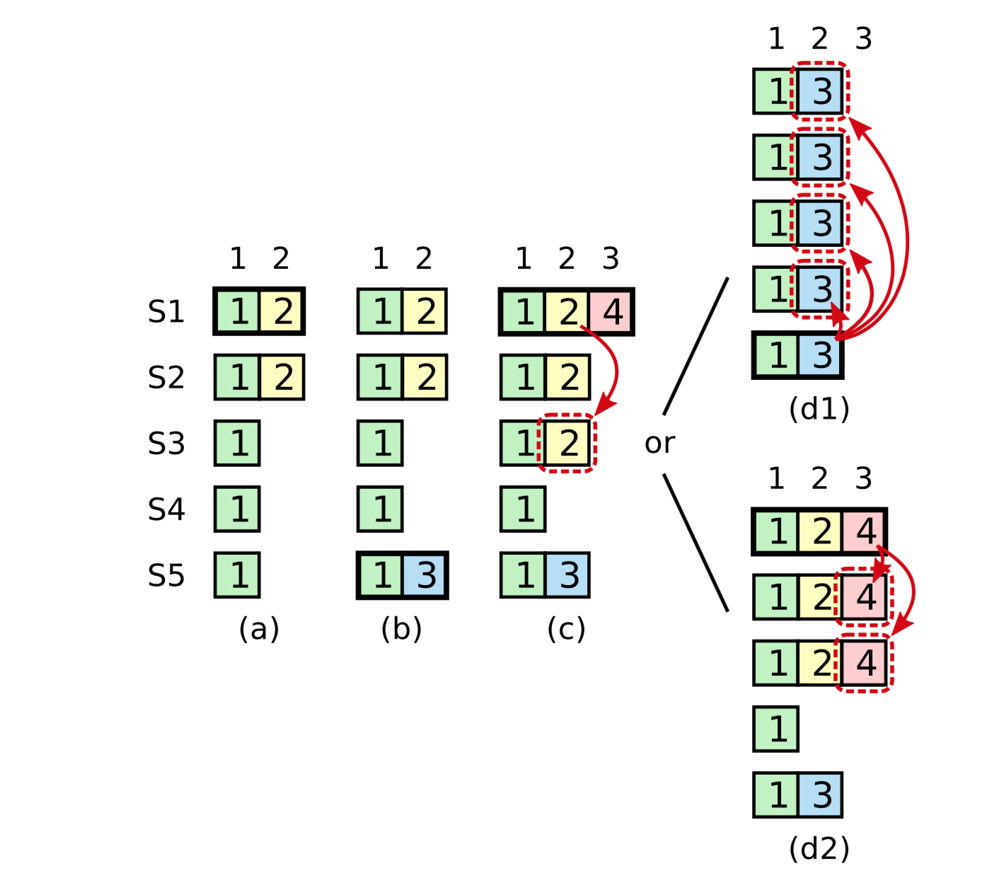

**资源分享：**

官网地址：[http://nil.csail.mit.edu/6.5840/2023/](http://nil.csail.mit.edu/6.5840/2023/)

Raft论文地址：[http://nil.csail.mit.edu/6.5840/2023/papers/raft-extended.pdf](http://nil.csail.mit.edu/6.5840/2023/papers/raft-extended.pdf)

官方学生指导（又称官方避坑指导）：[https://thesquareplanet.com/blog/students-guide-to-raft/](https://thesquareplanet.com/blog/students-guide-to-raft/)

**总结：**

**简单来说，Raft算法是：可以让一条数据备份到多台机器上，而在外部看来，好像只有一台机器的样子。** ，实验做完到现在，也过去了很久了，在这里只能模模糊糊还原当时遇到的一些印象比较深的BUG，千言万语，还是亲身体验一下这些坑，印象才会深刻。


<!-- more -->
## 算法整体流程概述

这里只对算法整体流程做一个总结。如果想从代码上实现一个Raft，请移步到Raft论文的Figure 2，许多非常精妙的细节还需按照论文中的描述一步一步去实现，要不然BUG真的满天飞。学生指导也是这么强调。

首先引用论文中的Figure 4：


**算法涉及两个定时器：** 选举定时器、心跳定时器。

0. **初始化状态：** 所有节点处于Follower状态，选举定时器开启，心跳定时器关闭。

1. **作为Leader：** 进行日志复制，将一条日志通过RPC，发送给其他节点，从而保持一致性。当然如果某一个节点落后太多，过早的日志被压缩了，Leader会给节点发送快照。拥有心跳定时器，超时就向所有其他节点发送心跳，给自己续命，防止其他节点发起选举，心跳也是一种特殊的日志。

2. **作为Follower：** 接收Leader发来的日志和快照。处理其他节点投票的请求。拥有选举定时器，超时就转为Candidate，开始选举。

3. **作为Candidate：** 给所有其他节点发送RequestVote RPC拉票。期间，如果获得大多数节点的投票就成为Leader。拥有选举定时器，超时就转为Candidate，重新选举。

**所有节点都会存在的逻辑：** 意识到有新Leader已经诞生就变成Follower状态，**当然之前如果是Leader状态，转变成Follower前需要开启选举定时器并关闭心跳定时器。** 不断的向应用层Apply日志，直到首个未被提交的日志为止。


## 细节描述 & 踩坑记录

我的Raft结构体大概长这个样子：

```go
type Raft struct {
	mu        sync.Mutex          // 全局锁
	peers     []*labrpc.ClientEnd // 其他节点的rpc对象
	persister *Persister          // 本端必要数据持久化的对象
	me        int                 // 本端在peers的索引
	dead      int32               // set by Kill()

	// Your data here (2A, 2B, 2C).
	// Look at the paper's Figure 2 for a description of what
	// state a Raft server must maintain.
	// table map[uint]map[uint]uint
	electTimer     *time.Timer  	// 选举超时定时器（Fllower和Candidate有效
	heartbeatTimer *time.Timer  	// 心跳超时定时器（发送心跳
	applyCh        chan ApplyMsg    // raft层和应用层通信的chan
	wakeupApply    chan interface{} // 唤醒后台协程去Apply日志
	wakeupSnapshot chan ApplyMsg	// 唤醒后台协程去Apply快照
	state          uint //当前服务器扮演的角色

	// Persistent state on all servers:
	currentTerm      int32  		// 当前节点的时期
	votedFor         int32  		// 当前节点将票投给了谁？
	logs             []LogEntry 	// 产生的日志
	lastIncludeIndex int32  		// 最后一条被压缩的日志的索引
	lastIncludeTerm  int32  		// 最后一条被压缩的日志的时期
	// Volatile state on all servers:
	commitIndex int32   			// 提交成功的日志索引
	lastApplied int32   			// 被上层应用成功的日志的索引

	// Volatile state on leaders:
	nextIndex  []int32  			// Leader下一次应该从哪里发日志给对端
	matchIndex []int32  			// Leader对端当前和本段哪里匹配

	snapshotCount int32 			// 有几个协程正在安装快照，确保快照安装的原子性
}
```

其中每个成员的作用，已经注明。


### 1. 关于加锁-解锁-又加锁带来的问题

这个BUG我并没有遇到，一开始写代码的时候就考虑到了这种情况，也算是迸现了一点点码感吧。只不过确实很容易踩坑，所以在这里记录一下。常听到的**一把大锁保平安**的缘由，就在这。在一个代码块中，如果间断性加解锁，新手很容易出现一些奇奇怪怪的线程安全问题。举个例子，有如下逻辑：

```go
func (data *Data) Task() {
	data.mu.Lock()
	// 临界区1

	// 对data做一些条件判断
	if !data.has{
		return
	}
	// ...
	data.mu.Unlock()

	DoLongTimeWork()

	data.mu.Lock()
	// 临界区2

	// 因为data.hash == true 所以做一些后续处理。
}
```

这段间断加锁的代码看似没什么逻辑问题，但是在多线程（协程）情况下，**临界区1做的条件判断，对于临界区2是无效的**，临界区2做的处理不能依赖临界区1的判断。因为临界区1到临界区2是有一段未持锁的区间的。在该区间，可能发生切换，导致有其他协程对data的成员发生了更改（data.has被置为false），从而导致之前临界区2做出错误的处理。要修复这个BUG就需要在临界区2上锁后，再进行一次判断（“冗余”判断），如下：

```go
func (data *Data) Task() {
	data.mu.Lock()
	// 临界区1

	// 对data做一些条件判断
	if !data.has{
		return
	}
	// ...
	data.mu.Unlock()

	DoLongTimeWork()

	data.mu.Lock()
	// 临界区2
	if !data.has {
		return
	}
	// 因为data.hash == true 所以做一些后续处理。
}
```

这是编写多线程程序非常容易出现的一个问题。在MIT6.824的Raft实现中很多地方的需求是必须使用阶段性加锁的逻辑，比如Leader进行日志复制时，需要解锁调用RPC。RPC调用完成后，再加锁，需要检查reqArgs.Term是否和节点当前的Term一致，不一致需要直接返回，因为**节点只能处理同一Term发送的RPC请求。** 从直觉上，也应该这么做。学生指导好像也提到过这个问题。

于此同时，我做实验碰到的一个相关的低级BUG是，**调用RPC后没有接它的返回值去判断RPC调用成功了没有！！！** 这点一定要注意。


### 2. 关于index等于0的日志的含义的抽象。

在实现lab2的 `Part 2D: log compaction (hard)`前，需要保证index为0的日志是Term为0的“守护”日志，logs数组初始化长度为1。这样做的原因是防止有节点落后Leader太多，所有日志都和Leader不匹配，从而回退到了index为1的日志，此时我们定义的index为0的日志作用就生效了，因为每一个节点的index为0的日志其index和Term一定是一样的，保证了日志复制在index为1时绝对的成功性。

在实现lab2的 `Part 2D: log compaction (hard)`后，由于我的实现是利用了logs[0]的日志。而在系统刚启动时，对于index为0的日志我将其抽象成了lastIncludeIndex为0、lastIncludeTerm也为0的默认已经被压缩过的日志，当Leader需要向其他节点复制index为1的日志时，也保证了其绝对的成功性。


### 3. 选举定时器的重置时机的讲究

做实验前，本人就没有好好的去阅读官方的避坑指南，所以在这里就栽了跟头。导致了莫名奇妙的活锁。

**错误复现：** 最开始的实现是，除了选举时、成功收到日志时会重置选举定时器外，一旦节点意识到有新Leader产生，我都会将选举定时器重置。

**正确实现：** 查阅官方避坑指南后，重置定时器有三个时期：

1. 从当前Leader那里收到AppendEntries RPC（本端Term和arg中的Term一定要一致！）。

2. 开始一次选举

3. 被请求投票时，同意将票投给对方。

此外还要注意，保证定时器类型的正确性。当转换成Leader时，要开启心跳定时器 && 关闭选举定时器。当转换成Follower或者Candidate时，要关闭心跳定时器 && 开启选举定时器！在Candidate选举失败时，注意找时机回到Follower状态！


### 4. 别把心跳不当日志，当然，正常的日志也能当成是一次心跳！

关于心跳定时器的重置时期：每次发送日志都可以重置一下心跳定时器。

当对某个节点已经达成一致，没有可复制的日志时，实现中还是要发一条Entries为0的日志。我的实现中，利用go语言的for实现了一种do while的结构，如下：

```go
for{
	// 做一些工作
	// ...

	if 条件不满足 {
		break
	}
}
```

### 5. 日志回退加速的优化

Raft论文中，认为日志回退加速的优化是没有必要的，因为在实际中，逐步回退完全够用。但是MIT6.824要求实现这一优化。

根据官方避坑指导，应该这样做：

在AppendEntries RPC的reply中加上两个字段：conflictIndex、conflictTerm 。

对于 **AppendEntries RPC的接收方**

- **规则一：** 如果prevLogIndex（过大） 不在logs的表示的范围内，就将conflictIndex置为最后一条日志的index + 1，并且conflictTerm为non。

- **规则二：** 如果prevLogIndex 在logs的表示的范围内，但是prevLogTerm对不上，conflictTerm置为本端索引为prevLogIndex日志的Term，conflictIndex置为 **Term为conflictTerm的第一个日志的索引**。（当然要保证conflictIndex > rf.lastIncludeIndex，如果conflictIndex到等于rf.lastIncludeIndex都没找到的话，将conflictIndex置为rf.lastIncludeIndex，此时leader端会发送自身的快照）

对于 **AppendEntries RPC的发送方**

- **规则一：** **如果接收方的logs中有可能找到Term为conflictTerm的日志，将相应的next置为最后一个Term为conflictTerm的日志的index + 1**

- **规则二：** 否则，说明既然当前作为Leader的我没有该Term，你Follower就别保留和该Term的日志了，直接将相应的next置为conflictIndex即可。

官方避坑指南说，可以只实现conflictIndex，我为了偷懒，就是只实现了conflictIndex，最后也能稳定通过测试。

这里比较难以理解应该就是 **AppendEntries RPC的发送方** 的规则一。规则一为什么可以直接将next置为最后一个Term为conflictTerm的日志的index + 1？我们可以用一张图来直观说明这个问题：


图示当中，leader节点准备发送位置为nextIndex以及后面的所有时期为 termM 的日志。但是Follower发现index0处的日志出现不匹配，于是根据上方 **AppendEntries RPC的接收方** 规则二，返回冲突索引 `ConflictIndex = indexi`、冲突时期 `ConflictTerm = termN` 。对于 **AppendEntries RPC的发送方** 来说显然我们的图示是符合规则一的。那么在什么情况下，raft会出现这种局面呢？我的理解是：图示当中Follower相对于Leader来说处在旧的时期（termN），也即Follower的旧Leader突然宕机了，并且indexi之后的时期为termN的日志并未复制到大多数节点上， **而图示当中Follower是作为少数复制了多数termN时期未被提交日志的节点，图示Leader在旧时期（termN）作为Follower没有复制太多termN时期的日志的节点** 。注意这里存在很关键的大小关系： **termM > termN 并且 在第二轮日志复制的请求当中indexi < nextIndex1** 。综上，作为 **AppendEntries RPC的发送方** 我们可以大胆基于规则二去利用conflictTerm加速日志的回退！ 

批判思维强的人可能会考虑：nextIndex置为 **最后一个** Term为conflictTerm的日志的索引 + 1？那么，有没有可能存在 **AppendEntries RPC的发送方** 收到 conflictTerm 后，定位到的最后一个任期为 conflictTerm 的日志索引超过nextIndex？我的回答是不可能。因为在日志回退的次轮请求当中，如果Leader节点存在最后一个任期为 conflictTerm 的日志索引超过nextIndex 第一轮rpc请求就应该能成功将日志复制给Follower。


### 6. 快照实现的一堆坑以及疑问

**快照Apply的原子性:**

> 这个BUG是我在做lab4时发现的。因为应用层偶尔会出现，日志回退导致出现，except index is n, but is n - 10，的情况，经过痛苦的查看日志。最后发现Follower处理InstallSnapshot RPC的逻辑是：
> 
> 0. rf.mu.Lock()
> 
> 1. 根据快照修改raft层的成员数据
> 
> 2. rf.mu.Unlock()
> 
> 3. 通知后台向应用层Apply快照。
> 
> 这里1、3步骤不是连续的，导致在应用层安装快照前，Raft层有其他协程修改了1中相关的数据成员，就造成了不一致。解决办法是：Raft中增加一个快照计数器，在0到2之间对计数器增1。在其他可能修改1中相关数据成员的地方，在修改前，判断计数器是否为0，不为零就放弃更改。

**为什么InstallSnapshot回调需要将rf.lastApplied置为args.LastIncludeIndex？如果原来rf.lastApplied大于args.LastIncludeIndex不会重复提交日志吗？:**

> 理解将rf.lastApplied置为args.LastIncludeIndex，可以从 MIT6.824/src/raft/config.go 文件对 快照的处理 方式来入手，参考如下：
> 
> ```go
> // returns "" or error string
> func (cfg *config) ingestSnap(i int, snapshot []byte, index int) string {
> 	if snapshot == nil {
> 		log.Fatalf("nil snapshot")
> 		return "nil snapshot"
> 	}
> 	r := bytes.NewBuffer(snapshot)
> 	d := labgob.NewDecoder(r)
> 	var lastIncludedIndex int
> 	var xlog []interface{}
> 	if d.Decode(&lastIncludedIndex) != nil ||
> 		d.Decode(&xlog) != nil {
> 		log.Fatalf("snapshot decode error")
> 		return "snapshot Decode() error"
> 	}
> 	if index != -1 && index != lastIncludedIndex {
> 		err := fmt.Sprintf("server %v snapshot doesn't match m.SnapshotIndex", i)
> 		return err
> 	}
> 	cfg.logs[i] = map[int]interface{}{}
> 	for j := 0; j < len(xlog); j++ {
> 		cfg.logs[i][j] = xlog[j]
> 	}
> 	cfg.lastApplied[i] = lastIncludedIndex	// 重点是这一行，测试程序在安装快照后，直接将lastApplied置为了lastIncludedIndex。
> 	return ""
> }
> 
> const SnapShotInterval = 10
> 
> // periodically snapshot raft state
> func (cfg *config) applierSnap(i int, applyCh chan ApplyMsg) {
> 	cfg.mu.Lock()
> 	rf := cfg.rafts[i]
> 	cfg.mu.Unlock()
> 	if rf == nil {
> 		return // ???
> 	}
> 
> 	for m := range applyCh {
> 		err_msg := ""
> 		if m.SnapshotValid {
> 			cfg.mu.Lock()
> 			err_msg = cfg.ingestSnap(i, m.Snapshot, m.SnapshotIndex)
> 			cfg.mu.Unlock()
> 		} else if m.CommandValid {
> 
> 			// ...
> 
> 			if (m.CommandIndex+1)%SnapShotInterval == 0 {
> 				w := new(bytes.Buffer)
> 				e := labgob.NewEncoder(w)
> 				e.Encode(m.CommandIndex)
> 				var xlog []interface{}
> 				for j := 0; j <= m.CommandIndex; j++ {
> 					xlog = append(xlog, cfg.logs[i][j])
> 				}
> 				e.Encode(xlog)
> 				rf.Snapshot(m.CommandIndex, w.Bytes())
> 			}
> 		} else {
> 			// Ignore other types of ApplyMsg.
> 		}
> 	}
> }
> ```
> 
> 其实按道理来讲，既然都安装新快照了，基于之前快照应用的日志就失去了意义，所以我们的raft层也需要重置lastApplied为从新快照的lastIncludedIndex。即使日志可能apply两次。**注意，这里是apply两次。而不是提交两次！**

### 7. 对Figure 8的深入理解

关于Figure 8要表达的东西，在这篇文章中讲解的非常清楚了：[https://zhuanlan.zhihu.com/p/369989974](https://zhuanlan.zhihu.com/p/369989974)，该文讲明白了几个困惑人的问题：

1. raft论文当中Figure 8提到的，提交的日志被覆盖的问题是如何解决的？
2. 为什么Leader只能提交本任期的日志？（实际上解决了1）
3. 为什么需要 no-op 日志？（实际上完善了2引入的旧任期日志提交时间过长的问题）

**这里我斗胆将该文的内容拷贝的这里，如有侵权，可以联系我删除！：**

> **正文**
> 
> Figure 8 用来说明为什么 Leader 不能提交之前任期的日志，只能通过提交自己任期的日志，从而间接提交之前任期的日志。
> 
> 
> 
> 先按 **错误的情况** ，也就是 Leader 可以提交之前任期的日志。那么上述的流程：
> 
> - (a) S1 是任期 2 的 Leader(**仔细看，有个黑框**)，日志已经复制到了 S2。
> - (b) S1 宕机，S5 获得 S3、S4 和 S5 的选票成为 Leader，然后写了一条日志 index=2 & term=3。
> - (c) S5 刚写完就宕机了，S1 重新当选 Leader，currentTerm = 4， **此刻还没有新的请求进来** ，S1 将 index=2 & term = 2 的日志复制到了 S3，多数派达成，S1 提交了这个日志( **注意，term=2 不是当前任期的日志，我们在讨论错误的情况** )。然后请求进来，刚写了本地 index=3 & term=4 的日志，S1 就故障了。
> - (d) 这时候 S5 可以通过来自 S2、S3、S4 和自己的投票，重新成为 Leader(currentTerm>=5)，并将 index=2 && term=3 的日志复制到其他所有节点并提交，此时 **index=2 的日志提交了两次** ！一次 term=2，一次term=3，这是绝对不允许发生的，已经提交的日志不能够被覆盖！
> - (e) 这里的情况是，S1 在宕机之前将自己 term=4 的日志复制到了大多数机器上，这样 S5 就不可能选举成功。这是 S1 不发生故障，正确复制的情况。
> 
> 这里主要通过 (c) 和 (d) 来说明问题所在。其实这张图用 Raft 大论文的图会比较好理解。(d) 和 (e) 分别对应 term=4 有没有复制到多数派的情况。
> 
> 
> 
> 所以，我们要 **增加提交的约束，不让 (d) 这种情况发生** 。这个约束就是， **Leader 只能提交自己任期的日志** 。
> 
> 我们再来看看，加了约束后会变成什么样？前面 (a) 和 (b) 没有任何改变，我们从 (c) 开始。
> 
> - (c) 还是将 index=2 & term=2 复制到大多数， **由于 currentTerm = 4，所以不能提交这条日志** 。如果 S1 将 term = 4 的日志复制到多数派，那么 Leader 就可以提交日志，index=2 & term=2 也会间接一起提交，其实这就是 (e) 的情况，1-2-4 都被提交。
> - (d) 的情况我觉得是理解问题的关键。如果 S1 只将 term=4 写入自己的日志，然后宕机了；S5 选举成功成为 Leader，然后将 index=2 & term=3 的日志复制到所有节点， **现在 index=2 是没有提交过的，S5 能提交 index=2 & term=3 的日志吗？**
>
> **答案是不能** 。因为 S5 在 S1(term=4) 选举出来后 currentTerm 至少是 5，也可能是 6、7、8……我们假设就是 5，但这条日志 term = 3， **Leader 不能提交之前任期的日志，所以这条日志是不能提交的** 。只有等到新的请求进来，超过半数节点复制了 1-3-5 后，term=3 的日志才能跟着 term=5 的一起提交。
>
> 虽然加了这个约束不会重复提交了，但如果一直没新的请求进来，index=2 & term=3 岂不是就一直不能提交？那这里不就阻塞了吗？如果这里是 kv 数据库，问题就很明显了。假设 (c) 或 (d) 中 index=2 那条日志里的 Command 是 Set("k", "1")，S5 当选 Leader 后，客户端来查询 Get("k")，Leader 查到日志有记录但又不能回复 1 给客户端(因为按照约束这条日志未提交)，线性一致性要求不能返回陈旧的数据，Leader 迫切地需要知道这条日志到底能不能提交。
> 
> 所以 raft 论文提到了引入 no-op 日志来解决这个问题。这个在 etcd 中有实现。
> 
> **引入 no-op 日志**
> 
> no-op 日志即只有 index 和 term 信息，command 信息为空。也是要写到磁盘存储的。
> 
> 具体流程是在 Leader 刚选举成功的时候，立即追加一条 no-op 日志，并立即复制到其它节点，no-op 日志一经提交，Leader 前面那些未提交的日志全部间接提交，问题就解决了。像上面的 kv 数据库，有了 no-op 日志之后，Leader 就能快速响应客户端查询了。
> 
> 本质上，no-op 日志使 Leader 隐式地快速提交之前任期未提交的日志，确认当前 commitIndex，这样系统才会快速对外正常工作。
> 
> > 另外说一句，6.824 的实验不需要实现 no-op 日志。

论文Figure 2中的右下角中：

> If there exists an N such that N > commitIndex, a majority of matchIndex[i] ≥ N, and **log[N].term == currentTerm**: set commitIndex = N (§5.3, §5.4)

加粗的部分的判断非常精妙！也非常必要！这里的意思要求Leader不能直接提交以前任期的日志，只能通过当前任期的日志来间接提交以前任期的日志

这里简单总结一下：

1. 只有拥有最新的日志的Candidate才能当选Leader。

2. Leader不能提交以前任期的日志，只能间接提交，否者根据Figure 8的情况，会出现日志回滚覆盖，导致同一index的日志，重复提交了两次的危险情况。不让提交以前任期的日志能保证即使覆盖了以前的被复制到了大多数节点的日志也没有关系，因为没有提交过。

3. 需要在Leader当选时，发送一条no-op 日志（区别于心跳的空日志，这里的日志会被追加到logs中，但上层执行该日志时，不会做任何操作），这个操作保证了让Raft能够迅速间接提交以前的日志。etcd 中有实现这个。


### 8. 死锁避免

这里列举一个Raft常见的死锁，虽然课程官方有提到：Raft层在向上层通过applyCh提交日志或快照时，不要占着Raft的锁，因为上层在处理日志时，也会请求Raft的锁。当applyCh满时，会导致Raft层占锁阻塞等待上层去处理日志，而上层处理日志又需要Raft的这把锁，导致日志一直无法被处理，从而造成死锁。更详细一点：

基于上方 **6. 快照实现的一堆坑以及疑问** 所列的applierSnap函数考虑这样一个时序：假设应用协程 applierSnap 执行到了 `rf.Snapshot(m.CommandIndex, w.Bytes())` 这一行，在进入函数之前，raft层正好向 `applyCh` 发送日志或者快照，由于应用协程 applierSnap 正在处理raft层发送的上一条消息，所以 raft层向 `applyCh` 发送日志或者快照的协程就会阻塞，假设阻塞前它是带着raft层的锁的，应用协程 applierSnap 继续执行的 `rf.Snapshot` 函数里面也需要加这把锁，于是形成了死锁局面。所以这里特别强调：**在向rf.applyCh写东西时不要带锁！不然上层rf.applyCh处理函数调用Snapshot也需要带锁，导致死锁局面！**

---

**本章完结**