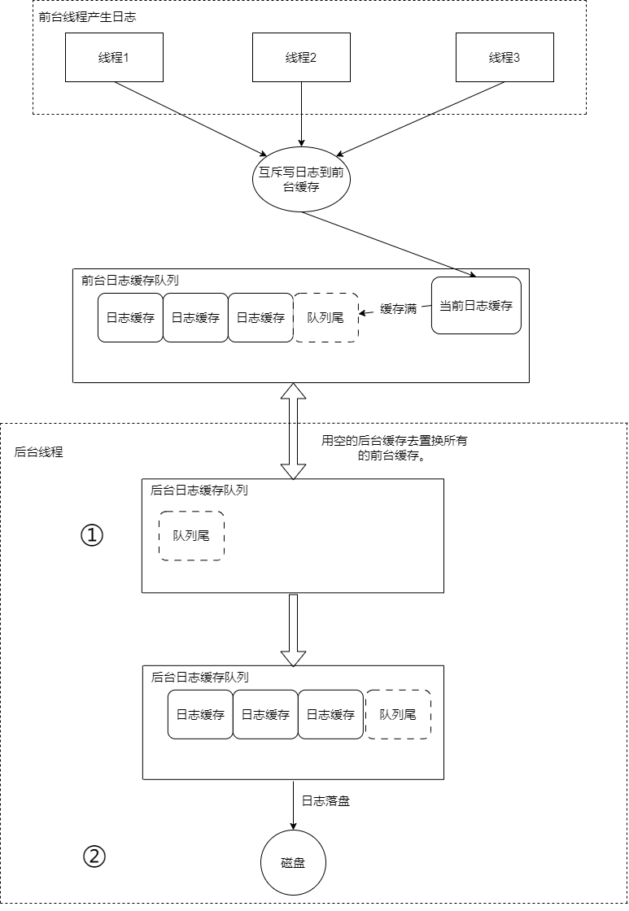

**Muduo源码笔记系列：**

[muduo源码阅读笔记（0、下载编译muduo）](./Start.md)

[muduo源码阅读笔记（1、同步日志）](./SynLogging.md)

[muduo源码阅读笔记（2、对C语言原生的线程安全以及同步的API的封装）](./ThreadSafeAndSync.md)

[muduo源码阅读笔记（3、线程和线程池的封装）](./ThreadAndThreadPool.md)

[muduo源码阅读笔记（4、异步日志）](./AsyncLogging.md)

[muduo源码阅读笔记（5、Channel和Poller）](./ChannelAndPoller.md)

[muduo源码阅读笔记（6、ExevntLoop和Thread）](./EvevntLoopAndThread.md)

[muduo源码阅读笔记（7、EventLoopThreadPool）](./EventLoopThreadPool.md)

[muduo源码阅读笔记（8、定时器TimerQueue）](./TimerQueue.md)

[muduo源码阅读笔记（9、TcpServer）](./TcpServer.md)

[muduo源码阅读笔记（10、TcpConnection）](./TcpConnection.md)

**前言**

Muduo的异步日志支持：异步日志输出，日志回滚。本文重点在异步日志输出，主要集中在AsyncLogging.cc文件的实现，至于日志回滚，属于文件IO管理范畴，不会细讲，这部分的代码主要集中在LogFile.cc、FileUtil.cc文件，代码量也不大，感兴趣的读者可以自行深入阅读。

## 正文

Muduo异步日志的实现是典型的多对一的，多生产者，单消费者模型。简单来说就是程序中的多个线程（前台线程）产生日志，然后由一个日志同步线程（后台线程）消化日志，将日志同步给磁盘。

**术语纠正**

阅读过Muduo源码的朋友都应该知道，Muduo实现的异步日志是**双缓冲**的，但是我阅读过很多Muduo有关异步日志的博客，有的人说Muduo里面**双缓冲**指的是currentBuffer_和nextBuffer_两块缓存，也有人说，Muduo的双缓冲是指前台的缓存和后台线程的缓存。

**查阅资料得知：**

**定义：** 双缓冲技术是一种通过使用两个缓冲区（buffers）来实现某种功能的技术。**通常，这两个缓冲区会交替使用，一个用于写入数据，另一个用于读取数据，或者在某种操作完成后进行交换。**

在不同的领域中，双缓冲技术有不同的应用，以下是一些常见的应用场景：

1. 图形学： 在图形学中，双缓冲技术通常用于解决图像闪烁的问题。一个缓冲区用于显示当前图像，而另一个缓冲区则用于在**后台**绘制下一帧图像。当绘制完成后，两个缓冲区进行交换，确保只显示完整的图像，从而避免了闪烁。
<!-- more -->

2. 计算机图形渲染： 在图形渲染中，双缓冲技术可以用于提高性能。例如，使用一个缓冲区进行渲染，同时在另一个缓冲区进行**后台**计算或处理，然后交换缓冲区。这样可以实现更平滑的图形渲染效果。

3. 日志系统： 在日志系统中，双缓冲技术可以用于异步日志的实现。一个缓冲区用于应用程序写入日志，而另一个缓冲区用于异步写入磁盘。当一个缓冲区满了之后，可以交换缓冲区，实现高效的异步日志记录。

4. 网络传输： 在网络传输中，双缓冲技术可以用于提高数据传输的效率。一个缓冲区用于发送数据，而另一个缓冲区用于填充新的数据。这样，在一个缓冲区发送的同时，可以在另一个缓冲区准备下一批数据。

**综上，Muduo异步日志的双缓冲就是指的前台的缓存和后台线程的缓存。**

## 实现

**提供的接口：**

```cpp
class AsyncLogging : noncopyable{
public:

    AsyncLogging(const string& basename,
                off_t rollSize,
                int flushInterval = 3);

    ~AsyncLogging(){
        if (running_){
            stop();
        }
    }

    void append(const char* logline, int len);

    void start(){
        running_ = true;
        thread_.start();    // 启动线程
        latch_.wait();  // 等待启动
    }

    void stop() NO_THREAD_SAFETY_ANALYSIS{
        running_ = false;
        cond_.notify();
        thread_.join();
    }

private:

    void threadFunc();

    typedef muduo::detail::FixedBuffer<muduo::detail::kLargeBuffer> Buffer;   // 4M的缓存
    typedef std::vector<std::unique_ptr<Buffer>> BufferVector;  // 使用独占智能指针管理
    typedef BufferVector::value_type BufferPtr;

    const int flushInterval_; // 将日志同步到磁盘上的间隔
    std::atomic<bool> running_; // 后台同步线程正在运行？
    const string basename_; // 文件前缀名
    const off_t rollSize_;  // 日志文件回滚大小
    muduo::Thread thread_;  // 后台日志同步线程
    muduo::CountDownLatch latch_; // 确保同步回调函数跑起来了
    muduo::MutexLock mutex_;
    muduo::Condition cond_ GUARDED_BY(mutex_);  // 等待有至少一个Buffer满了
    BufferPtr currentBuffer_ GUARDED_BY(mutex_);  // 接收日志的buff
    BufferPtr nextBuffer_ GUARDED_BY(mutex_); // 替补的buff，为减少分配内存的开销
    BufferVector buffers_ GUARDED_BY(mutex_); // 满载日志的buff队列
};
```

**异步日志架构图：**

简单画了一下Muduo异步日志的架构图，忽略了currentBuffer_、nextBuffer_等细节。如图所示。



**实现的伪代码：**

```cpp
/*
* 构造函数就省略了，主要做的事：
* 1. 将AsyncLogging::threadFunc作为后台线程的回调。
* 2. 构造currentBuffer_和nextBuffer_。
*/

// ...

void AsyncLogging::append(const char* logline, int len){
    muduo::MutexLockGuard lock(mutex_); // 持锁
    if (currentBuffer_->avail() > len){  //当前缓存没满
        currentBuffer_->append(logline, len); // 先写到前台缓存
    }else{ //满了
        buffers_.push_back(std::move(currentBuffer_));  // 放到缓存队列

        if (nextBuffer_){  // 优先考虑替补缓存，没有分配内存的开销，性能更高。
            currentBuffer_ = std::move(nextBuffer_);
        }else { // 最坏的情况，替补缓存也用光了，只能去申请内存。
            currentBuffer_.reset(new Buffer); // Rarely happens
        }
        currentBuffer_->append(logline, len);
        cond_.notify(); // 提醒一下后台线程，前台缓存队列非空。
    }
}

void AsyncLogging::threadFunc(){
    assert(running_ == true);
    latch_.countDown();
    LogFile output(basename_, rollSize_, false);  // 日志文件管理类，实现了日志回滚。
    BufferPtr newBuffer1(new Buffer); // 提前缓存两块buff减少内存开销
    BufferPtr newBuffer2(new Buffer);
    newBuffer1->bzero();
    newBuffer2->bzero();
    BufferVector buffersToWrite;
    buffersToWrite.reserve(16);
    while (running_){
        // 后台线程的buff在向前台buff置换日志前，保证后台线程的buff是被清空的。
        assert(newBuffer1 && newBuffer1->length() == 0);
        assert(newBuffer2 && newBuffer2->length() == 0);
        assert(buffersToWrite.empty());

        {
            muduo::MutexLockGuard lock(mutex_);
            if (buffers_.empty()){  // unusual usage!
                /*
                * 1. 因前台日志队列非空而被唤醒。（AsyncLogging::append）
                * 2. 超时。
                */
                cond_.waitForSeconds(flushInterval_);
            }
            // 不管currentBuffer_中是否有日志，都归入前台的日志队列。可以保证所有日志都归入到了前台的日志队列。
            buffers_.push_back(std::move(currentBuffer_)); 
            currentBuffer_ = std::move(newBuffer1); // 补充currentBuffer_
            buffersToWrite.swap(buffers_);  // 将前台的日志队列，置换到后台的日志队列，置换后前台的日志队列被清空
            if (!nextBuffer_){ // 前台的nextBuffer_也被用了。
                // nextBuffer_也需要补充
                nextBuffer_ = std::move(newBuffer2);
            }
        }

        assert(!buffersToWrite.empty());  // 至少为1

        if (buffersToWrite.size() > 25){ // 避免日志洪流
            char buf[256];
            snprintf(buf, sizeof buf, "Dropped log messages at %s, %zd larger buffers\n",
                    Timestamp::now().toFormattedString().c_str(),
                    buffersToWrite.size()-2);
            fputs(buf, stderr);
            output.append(buf, static_cast<int>(strlen(buf)));
            buffersToWrite.erase(buffersToWrite.begin()+2, buffersToWrite.end());
        }

        for (const auto& buffer : buffersToWrite){ // 日志落盘
            // FIXME: use unbuffered stdio FILE ? or use ::writev ?
            output.append(buffer->data(), buffer->length());
        }

        if (buffersToWrite.size() > 2){ // 保留两块buff，填充newBuffer1、newBuffer2
            // drop non-bzero-ed buffers, avoid trashing
            buffersToWrite.resize(2);
        }

        if (!newBuffer1){
            assert(!buffersToWrite.empty());
            newBuffer1 = std::move(buffersToWrite.back());
            buffersToWrite.pop_back();
            newBuffer1->reset();
        }

        if (!newBuffer2){
            assert(!buffersToWrite.empty());
            newBuffer2 = std::move(buffersToWrite.back());
            buffersToWrite.pop_back();
            newBuffer2->reset();
        }

        buffersToWrite.clear(); // 清空后台日志队列。
        output.flush(); // 文件同步。
    }
    output.flush();
}

```

**套路总结**

这里是一份经典的降低锁的粒度的套路模板，也是Muduo异步日志高效的核心：

```cpp
// 临界区外面处理临界区的数据

// 定义临界区的数据结构
struct CriticalData {
    // 数据成员...
};

void processCriticalData(const CriticalData& data) {
    // 在临界区外面处理数据
    // 可以进行计算、拷贝、异步处理等操作
}

// 在临界区内使用局部变量进行处理
void criticalSection(const CriticalData& sharedData) {
    CriticalData localCopy
    // 进入临界区
    // ...

    // 拷贝数据到局部变量
    localCopy.swap(sharedData);

    // 离开临界区
    // ...

    // 在临界区外面处理局部变量
    processCriticalData(localCopy);
}
```

## 细节明细：

**疑问：**

Muduo的异步日志为什么日志过多就删除一些日志？

**解答：**

在Muduo库的异步日志系统中，删除一些日志的策略可能是为了防止日志积累过多导致系统资源消耗过大，以及为了保持日志的存储大小在可控范围内。具体的删除策略可能会根据应用程序的需求和性能考虑而定，通常包括以下一些原因：

1. 资源限制： 大量的日志可能会占用大量磁盘空间，特别是在长时间运行的系统中。删除一些日志可以确保系统的磁盘空间不被过多消耗，避免磁盘空间不足的问题。

2. 性能考虑： 当日志量非常大时，写入和处理大量日志会对系统性能产生影响。删除一些日志可以降低写入和处理的负担，确保系统的性能得到维持。

3. 避免日志洪流： 在某些情况下，产生大量的日志可能并不是问题的根本原因，而是问题的表征。删除一些日志可以帮助集中关注真正的问题，而不被大量的无关日志所干扰。

**疑问：**

Muduo异步日志中nextBuffer_是不是冗余了？currentBuffer_满了的话，不是可以再new一个Buffer吗？为什么要额外提供一个nextBuffer_？

**解答：**

 预先分配并循环使用多个缓冲区（包括 nextBuffer_）可以减少内存分配的频率。如果只使用一个 currentBuffer_，每次都需要在 currentBuffer_ 满了之后重新分配一个新的缓冲区，这可能导致频繁的内存分配和释放操作，影响性能。

 综上提供nextBuffer_主要是为了减少内存分配次数

---

**本章完结**