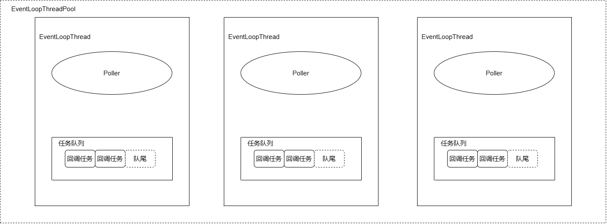

**Muduo源码笔记系列：**

[muduo源码阅读笔记（0、下载编译muduo）](./Start.md)

[muduo源码阅读笔记（1、同步日志）](./SynLogging.md)

[muduo源码阅读笔记（2、对C语言原生的线程安全以及同步的API的封装）](./ThreadSafeAndSync.md)

[muduo源码阅读笔记（3、线程和线程池的封装）](./ThreadAndThreadPool.md)

[muduo源码阅读笔记（4、异步日志）](./AsyncLogging.md)

[muduo源码阅读笔记（5、Channel和Poller）](./ChannelAndPoller.md)

[muduo源码阅读笔记（6、ExevntLoop和Thread）](./EvevntLoopAndThread.md)

[muduo源码阅读笔记（7、EventLoopThreadPool）](./EventLoopThreadPool.md)

[muduo源码阅读笔记（8、定时器TimerQueue）](./TimerQueue.md)

[muduo源码阅读笔记（9、TcpServer）](./TcpServer.md)

[muduo源码阅读笔记（10、TcpConnection）](./TcpConnection.md)

**前言**

与base文件夹下的通用线程池相比，EventLoopThreadPool更加专门化，专为为EventLoopThread而生，专为EventLoop而生，专为One Loop Per Thread而生，专为网络事件驱动而生，专为Muduo而生！

## 实现

**提供的接口：**

<!-- more -->
```cpp
class EventLoopThreadPool : noncopyable{
public:
    typedef std::function<void(EventLoop*)> ThreadInitCallback;

    EventLoopThreadPool(EventLoop* baseLoop, const string& nameArg);
    ~EventLoopThreadPool();
    void setThreadNum(int numThreads) { numThreads_ = numThreads; }
    void start(const ThreadInitCallback& cb = ThreadInitCallback());

    // valid after calling start()
    /// round-robin
    EventLoop* getNextLoop();

    /// with the same hash code, it will always return the same EventLoop
    EventLoop* getLoopForHash(size_t hashCode);

    std::vector<EventLoop*> getAllLoops();

    bool started() const
    { return started_; }

    const string& name() const
    { return name_; }

private:

    EventLoop* baseLoop_; // 启动EventLoopThreadPool的EventLoop
    string name_; // 线程池名
    bool started_;  // 启动了？
    int numThreads_;  // EventLoopThread线程的数量
    int next_;    // 使用round-robin算法做线程的负载均衡，调度到了哪一个线程？
    std::vector<std::unique_ptr<EventLoopThread>> threads_; // 线程池本体
    std::vector<EventLoop*> loops_; // 每个线程对应的EventLoop
};
```

结合[muduo源码阅读笔记（6、ExevntLoop和Thread）](./EvevntLoopAndThread.md)简单画了一下EventLoopThreadPool的架构图：



**实现的伪代码：**

```cpp
EventLoopThreadPool::EventLoopThreadPool(EventLoop* baseLoop, const string& nameArg)
  : baseLoop_(baseLoop),
    name_(nameArg),
    started_(false),
    numThreads_(0),
    next_(0){
}

EventLoopThreadPool::~EventLoopThreadPool(){
    // Don't delete loop, it's stack variable
}

void EventLoopThreadPool::start(const ThreadInitCallback& cb){
    assert(!started_);
    baseLoop_->assertInLoopThread();

    started_ = true;

    for (int i = 0; i < numThreads_; ++i){
        char buf[name_.size() + 32];
        snprintf(buf, sizeof buf, "%s%d", name_.c_str(), i);
        EventLoopThread* t = new EventLoopThread(cb, buf);
        threads_.push_back(std::unique_ptr<EventLoopThread>(t));
        loops_.push_back(t->startLoop()); // 启动线程
    }
    if (numThreads_ == 0 && cb){
        cb(baseLoop_);
    }
}

EventLoop* EventLoopThreadPool::getNextLoop(){ // round-robin算法做负载均衡
    baseLoop_->assertInLoopThread();
    assert(started_);
    EventLoop* loop = baseLoop_;  // 线程数为0，就让baseLoop返回

    if (!loops_.empty()){
        // round-robin
        loop = loops_[next_];
        ++next_;
        if (implicit_cast<size_t>(next_) >= loops_.size()){
            next_ = 0;
        }
    }
    return loop;
}

EventLoop* EventLoopThreadPool::getLoopForHash(size_t hashCode){ // hash散列做负载均衡
    baseLoop_->assertInLoopThread();
    EventLoop* loop = baseLoop_;// 线程数为0，就让baseLoop返回

    if (!loops_.empty()){
        loop = loops_[hashCode % loops_.size()];
    }
    return loop;
}

std::vector<EventLoop*> EventLoopThreadPool::getAllLoops(){
    baseLoop_->assertInLoopThread();
    assert(started_);
    if (loops_.empty()){
        return std::vector<EventLoop*>(1, baseLoop_);
    }else{
        return loops_;
    }
}
```

## 细节明细

**疑问：**

关于`EventLoopThreadPool::getNextLoop()`、`EventLoopThreadPool::getLoopForHash`的作用？

**解答：**

小到线程之间，大到服务器集群之间，都需要保证负载均衡，以免大量的连接集中在某一个线程或者某一台机器，导致压力过大，而使连接任务无法有效处理。

**疑问：**

Muduo为什么大量使用unique_ptr智能指针，而不是使用sahred_ptr智能指针？

以下是一些可能的原因：

1. **所有权的清晰性： std::unique_ptr表示独占所有权，这意味着每个指针拥有对其指向对象的唯一所有权。这种所有权模型有助于明确代码中哪个部分负责释放资源。**

2. 线程安全性： Muduo是一个面向多线程的网络库，而std::shared_ptr的引用计数是原子操作，可能在高并发环境下带来额外的竞争，从而影响性能。相比之下，std::unique_ptr的独占所有权模型更适合并发环境。

3. 性能开销： std::shared_ptr通常会维护一个引用计数，用于跟踪共享对象的所有权信息。这样的引用计数可能引入额外的性能开销，特别是在高并发的网络编程场景下，性能是一个关键因素。

4. 避免循环引用： 使用std::shared_ptr可能导致循环引用的问题，特别是在涉及到复杂的对象关系时。这可能导致资源无法被释放，从而引发内存泄漏。

---

**本章完结**