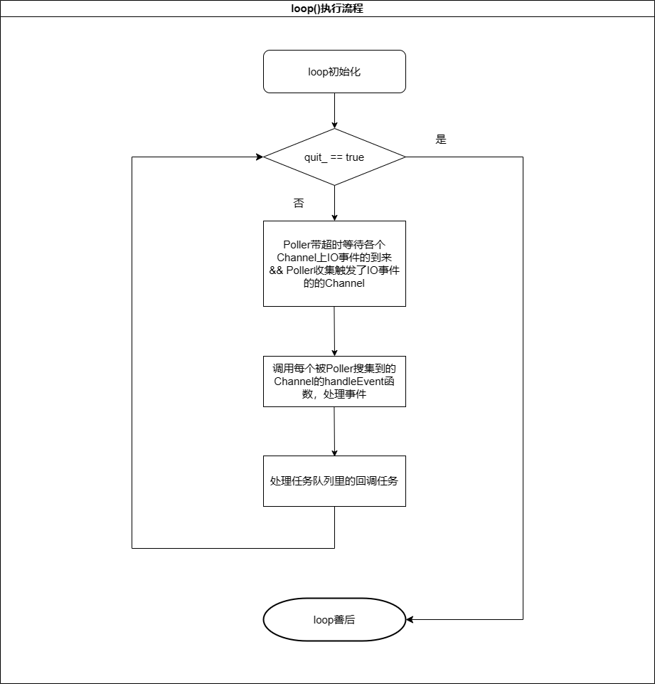

**Muduo源码笔记系列：**

[muduo源码阅读笔记（0、下载编译muduo）](./Start.md)

[muduo源码阅读笔记（1、同步日志）](./SynLogging.md)

[muduo源码阅读笔记（2、对C语言原生的线程安全以及同步的API的封装）](./ThreadSafeAndSync.md)

[muduo源码阅读笔记（3、线程和线程池的封装）](./ThreadAndThreadPool.md)

[muduo源码阅读笔记（4、异步日志）](./AsyncLogging.md)

[muduo源码阅读笔记（5、Channel和Poller）](./ChannelAndPoller.md)

[muduo源码阅读笔记（6、ExevntLoop和Thread）](./EvevntLoopAndThread.md)

[muduo源码阅读笔记（7、EventLoopThreadPool）](./EventLoopThreadPool.md)

[muduo源码阅读笔记（8、定时器TimerQueue）](./TimerQueue.md)

[muduo源码阅读笔记（9、TcpServer）](./TcpServer.md)

[muduo源码阅读笔记（10、TcpConnection）](./TcpConnection.md)

**前言**

终于到了Muduo网络库最最核心的部分，这里还是建议大家亲自看看源码。源码很好读，博客最多起到辅助作用。因为EventLoop和Thread是绑定的，所以，可能这两部分放在一起更适合。

了解ExevntLoop和Thread后，对One Loop Per Thread思想，就有了一个大体的轮廓，这种设计思想，真的很高效，因为，每个线程都有自己的资源，比如epoll、IO事件处理，定时器、任务队列等。每个线程内部资源都是自我维护的（自己的事情自己做）， **除了对线程的任务队列进行操作时有一段极小的临界区需要加锁外，不涉及任何锁的竞争。这里为每个线程设置自己的任务队列的思想特别关键，正是利用每个线程只处理自己任务队列里面的回调任务，实现了将并行任务串行化的效果。** 将原本的并发（涉及线程安全，需要加锁）操作，封装成任务（无需加锁）回调，添加到各自的任务队列中，交给线程自己处理。实现了**线程的隔离**、**无锁化编程**，巧妙的利用单线程天生串行执行的优势。活该Muduo高性能、高并发。

## EventLoop的实现

**提供的接口：**

<!-- more -->
```cpp
class EventLoop : noncopyable{
public:
    typedef std::function<void()> Functor;

    EventLoop();
    ~EventLoop();  // force out-line dtor, for std::unique_ptr members.

    ///
    /// Loops forever.
    ///
    /// Must be called in the same thread as creation of the object.
    ///
    void loop();

    /// Quits loop.
    ///
    /// This is not 100% thread safe, if you call through a raw pointer,
    /// better to call through shared_ptr<EventLoop> for 100% safety.
    void quit();

    /// Runs callback immediately in the loop thread.
    /// It wakes up the loop, and run the cb.
    /// If in the same loop thread, cb is run within the function.
    /// Safe to call from other threads.
    void runInLoop(Functor cb);
    /// Queues callback in the loop thread.
    /// Runs after finish pooling.
    /// Safe to call from other threads.
    void queueInLoop(Functor cb);

    size_t queueSize() const;

    // timers

    // ...

    // internal usage
    void wakeup();
    void updateChannel(Channel* channel);
    void removeChannel(Channel* channel);

    // pid_t threadId() const { return threadId_; }
    void assertInLoopThread()

    bool isInLoopThread() const { return threadId_ == CurrentThread::tid(); }
    // 获取当前线程的EventLoop
    static EventLoop* getEventLoopOfCurrentThread();

private:
    void abortNotInLoopThread();
    void handleRead();  // waked up
    void doPendingFunctors();

    typedef std::vector<Channel*> ChannelList;

    bool looping_; /* atomic */ // 在loop()中？
    std::atomic<bool> quit_;  // EventLoop是否退出
    bool eventHandling_; /* atomic */ // 正在处理事件？
    bool callingPendingFunctors_; /* atomic */  // 正在处理任务回调？
    int64_t iteration_;   // loop()循环的次数
    const pid_t threadId_;  // EventLoop和哪个线程绑定？
    Timestamp pollReturnTime_;  // epoll_wait返回时的时间戳
    std::unique_ptr<Poller> poller_;  // epoll/poll
    std::unique_ptr<TimerQueue> timerQueue_;  // 定时器
    int wakeupFd_;  // tickleFd，用于手动唤醒epoll_wait，以便即使处理任务
    // unlike in TimerQueue, which is an internal class,
    // we don't expose Channel to client.
    std::unique_ptr<Channel> wakeupChannel_;  // 管理tickleFd的channel
    boost::any context_;  // 待定

    // scratch variables
    ChannelList activeChannels_;   // poller_收集到的fd（channel）事件
    Channel* currentActiveChannel_; // loop()正在处理的channel

    mutable MutexLock mutex_; // 只对pendingFunctors_提供保护
    std::vector<Functor> pendingFunctors_ GUARDED_BY(mutex_); // 任务队列
};
```

Muduo在EventLoop中，使用了Linux系统中EventFd，作为wakeupChannel_的成员。这里主要为了将线程即时唤醒处理回调任务。如果你阅读过sylar的源码应该在这里会有所感知，`EventLoop::wakeup()`函数其实作用和sylar中的`IOManager::tickle()`类似。

此外，为了和Muduo的EventLoop适配，Muduo定时器的实现也是利用Linux上提供的TimeFd，在TimerQueue构造函数中，也会为该fd构造一个Channel，并将该Channel注册到EventLoop的Poller中，这样极大的方便了定时器的管理与维护。

简单画了一下EventLoop中核心函数`EventLoop::loop()`的执行流程图：



**实现的伪代码：**

```cpp
// 线程全局变量，for将线程和EventLoop绑定
__thread EventLoop* t_loopInThisThread = 0;

EventLoop::EventLoop()
  : // ...
    threadId_(CurrentThread::tid()),
    poller_(Poller::newDefaultPoller(this)),    // epoll
    timerQueue_(new TimerQueue(this)),      // Muduo定时器采用的是timerfd的接口，TimerQueue对象内部也构造了对应的channel，在构造时，会向EventLopp的Poller中注册该fd。
    wakeupFd_(createEventfd()),   // 创建一个非阻塞eventfd，作为tickle
    wakeupChannel_(new Channel(this, wakeupFd_)){ // 将eventfd封装成channel

    LOG_DEBUG << "EventLoop created " << this << " in thread " << threadId_;
    if (t_loopInThisThread){
        LOG_FATAL << "Another EventLoop " << t_loopInThisThread
                << " exists in this thread " << threadId_;
    }else{
        t_loopInThisThread = this;  // 设置线程局部变量
    }
    // 为eventfd设置读回调
    wakeupChannel_->setReadCallback(
        std::bind(&EventLoop::handleRead, this));
    // we are always reading the wakeupfd
    wakeupChannel_->enableReading();
}

EventLoop::~EventLoop(){
    // 善后
    LOG_DEBUG << "EventLoop " << this << " of thread " << threadId_
            << " destructs in thread " << CurrentThread::tid();
    wakeupChannel_->disableAll();
    wakeupChannel_->remove();
    ::close(wakeupFd_);
    t_loopInThisThread = NULL;
}

void EventLoop::loop(){
    assert(!looping_);
    assertInLoopThread(); // 在自己的线程中？
    looping_ = true;
    quit_ = false;  // FIXME: what if someone calls quit() before loop() ?
    LOG_TRACE << "EventLoop " << this << " start looping";

    while (!quit_){
        activeChannels_.clear();
        pollReturnTime_ = poller_->poll(kPollTimeMs, &activeChannels_); // epoll_wait
        ++iteration_;
        if (Logger::logLevel() <= Logger::TRACE){
            printActiveChannels();
        }
        // TODO sort channel by priority
        eventHandling_ = true;  // 开始处理每一个fd被触发的事件
        for (Channel* channel : activeChannels_){
            currentActiveChannel_ = channel;
            currentActiveChannel_->handleEvent(pollReturnTime_);  // 利用channel处理事件
        }
        currentActiveChannel_ = NULL;
        eventHandling_ = false; // 所有fd的事件被处理完
        doPendingFunctors();  // 处理任务回调
    }

    LOG_TRACE << "EventLoop " << this << " stop looping";
    looping_ = false;
}

void EventLoop::quit(){
    quit_ = true;
    // 有线程安全问题
    // There is a chance that loop() just executes while(!quit_) and exits,
    // then EventLoop destructs, then we are accessing an invalid object.
    // Can be fixed using mutex_ in both places.
    if (!isInLoopThread()){  // 其他线程调用quit，不确定线程是否是Active的，需要调用wakeup();
        wakeup();
    } // 在处理事件或者任务回调时，内部自己调用了quit，说名此时线程是Active的，不用去唤醒
}

void EventLoop::runInLoop(Functor cb){
    if (isInLoopThread()) {// 线程自己调用runInLoop，本来就是Active，直接顺手处理
        cb();
    }else{  // 其他线程调用runInLoop，需要加锁
        queueInLoop(std::move(cb));
    }
}

void EventLoop::queueInLoop(Functor cb){
    {
        MutexLockGuard lock(mutex_);
        pendingFunctors_.push_back(std::move(cb));  // 任务放入任务队列
    }

    if (!isInLoopThread() || callingPendingFunctors_){ 
        // 其他线程调用queueInLoop || 线程在处理任务队列中的任务时调用了queueInLoop
        //以便让线程不要阻塞在epoll_wait上从而及时处理任务回调。
        wakeup();
    }
}

void EventLoop::updateChannel(Channel* channel){
    assert(channel->ownerLoop() == this);
    assertInLoopThread();
    poller_->updateChannel(channel);
}

void EventLoop::removeChannel(Channel* channel){
    assert(channel->ownerLoop() == this);
    assertInLoopThread();
    if (eventHandling_){
        // channel只有自己能remove自己，其他的channel禁止删除并非自己的channel
        assert(currentActiveChannel_ == channel ||
            std::find(activeChannels_.begin(), activeChannels_.end(), channel) == activeChannels_.end());
    }
    poller_->removeChannel(channel);
}
// 唤醒线程
void EventLoop::wakeup(){
    uint64_t one = 1;
    // tickle一下
    ssize_t n = sockets::write(wakeupFd_, &one, sizeof one);
    if (n != sizeof one){
        LOG_ERROR << "EventLoop::wakeup() writes " << n << " bytes instead of 8";
    }
}

void EventLoop::handleRead(){
    uint64_t one = 1;
    // tickle 回调处理
    ssize_t n = sockets::read(wakeupFd_, &one, sizeof one);
    if (n != sizeof one){
        LOG_ERROR << "EventLoop::handleRead() reads " << n << " bytes instead of 8";
    }
}

void EventLoop::doPendingFunctors(){
    std::vector<Functor> functors;
    callingPendingFunctors_ = true;
    // 写时置换，同异步日志，即减少持锁时间，又减少死锁可能。
    {
        MutexLockGuard lock(mutex_);
        functors.swap(pendingFunctors_);
    }

    for (const Functor& functor : functors){
        functor();
    }
    callingPendingFunctors_ = false;
}
```

### 细节明细：

在EventLoop类的成员变量的定义顺序中，poller_的定义位于timerQueue_之上，这个定义的顺序很关键，首先在EventLoop在构造时，先按成员变量的定义顺序构造成员变量，再会构造EventLoop本身。在析构的时候，会先析构自身，再会去按成员变量的定义顺序的倒序，去析构成员变量。考虑到timerQueue_的析构是依赖poller_的，Muduo的定义顺序（先析构timerQueue_，再析构poller_），正好规避了这个问题。

## EventLoopThread的实现

简单讲，EventLoop作用就是让EventLoop::loop()跑在线程上。

EventLoopThread的实现代码是自解释的，代码量很少，也很容易理解。

**提供的接口：**

```cpp
class EventLoopThread : noncopyable{
public:
    typedef std::function<void(EventLoop*)> ThreadInitCallback;

    EventLoopThread(const ThreadInitCallback& cb = ThreadInitCallback(),
                    const string& name = string());
    ~EventLoopThread();
    EventLoop* startLoop();

private:
    void threadFunc();

    EventLoop* loop_ GUARDED_BY(mutex_);  // 依赖EventLoop
    bool exiting_;  // 线程是否living
    Thread thread_; // 线程实体
    MutexLock mutex_;
    Condition cond_ GUARDED_BY(mutex_);
    ThreadInitCallback callback_;
};
```

有了EventLoop和EventLoopThread后，结合[muduo源码阅读笔记（3、线程和线程池的封装）](./ThreadAndThreadPool.md)一个EventLoopThread线程启动流程如下：

1. EventLoopThread::startLoop() ->

2. Thread::start()  -> 

3. pthread_create(..., &detail::startThread,...)    -> 

4. startThread(void* obj)   ->

5. ThreadData::runInThread()    -> 

6. Thread::func_()  ->

7. EventLoopThread::threadFunc()    ->

8. EventLoop::loop()


**实现的伪代码：**

```cpp
EventLoopThread::EventLoopThread(const ThreadInitCallback& cb,
                                 const string& name)
  : loop_(NULL),
    exiting_(false),
    thread_(std::bind(&EventLoopThread::threadFunc, this), name),
    mutex_(),
    cond_(mutex_),
    callback_(cb){
}

EventLoopThread::~EventLoopThread(){
    exiting_ = true;
    if (loop_ != NULL){ // not 100% race-free, eg. threadFunc could be running callback_.
        // still a tiny chance to call destructed object, if threadFunc exits just now.
        // but when EventLoopThread destructs, usually programming is exiting anyway.
        loop_->quit();
        thread_.join();
    }
}

EventLoop* EventLoopThread::startLoop(){
    assert(!thread_.started());
    thread_.start();

    EventLoop* loop = NULL;
    {
        MutexLockGuard lock(mutex_);
        while (loop_ == NULL){  // 解决条件变量惊群效应/虚唤醒
            cond_.wait();
        }
        loop = loop_;
    }

    return loop;
}

void EventLoopThread::threadFunc(){
    EventLoop loop;

    if (callback_){
        callback_(&loop);
    }

    {
        MutexLockGuard lock(mutex_);
        loop_ = &loop;
        cond_.notify();
    }

    loop.loop();
    //assert(exiting_);
    MutexLockGuard lock(mutex_);
    loop_ = NULL;
}
```

## 总结

在Muduo网络库的设计中，EventLoop 统一使用文件描述符（file descriptor）的方式来处理事件，主要是基于以下一些好处和设计原则：

1. 一致性： 使用文件描述符作为事件的抽象，使得对于不同类型的事件（包括套接字、定时器等）的处理方式一致。这种一致性简化了 EventLoop 内部的设计和实现，使得对于事件的处理更加通用。

2. 多路复用： 文件描述符是多路复用（Multiplexing）机制的核心。通过将多个文件描述符注册到同一个 EventLoop 中，可以使用诸如 select、poll、epoll 等多路复用技术，实现同时监听多个事件并进行有效的事件分发。

3. 高效性： 文件描述符的处理在操作系统层面已经高度优化，使用多路复用机制可以高效地管理和调度大量的事件。这对于实现高性能的网络库尤为重要。

**如果读者有阅读其他网络库源码就会不可思议的发现，Muduo的One Loop Per Thread设计思想太精妙了，这种设计几乎不存在锁的竞争！！！**

---

**本章完结**