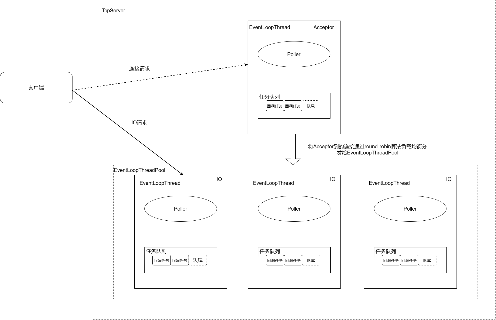

**Muduo源码笔记系列：**

[muduo源码阅读笔记（0、下载编译muduo）](./Start.md)

[muduo源码阅读笔记（1、同步日志）](./SynLogging.md)

[muduo源码阅读笔记（2、对C语言原生的线程安全以及同步的API的封装）](./ThreadSafeAndSync.md)

[muduo源码阅读笔记（3、线程和线程池的封装）](./ThreadAndThreadPool.md)

[muduo源码阅读笔记（4、异步日志）](./AsyncLogging.md)

[muduo源码阅读笔记（5、Channel和Poller）](./ChannelAndPoller.md)

[muduo源码阅读笔记（6、ExevntLoop和Thread）](./EvevntLoopAndThread.md)

[muduo源码阅读笔记（7、EventLoopThreadPool）](./EventLoopThreadPool.md)

[muduo源码阅读笔记（8、定时器TimerQueue）](./TimerQueue.md)

[muduo源码阅读笔记（9、TcpServer）](./TcpServer.md)

[muduo源码阅读笔记（10、TcpConnection）](./TcpConnection.md)

**前言**

本章涉及的文件有：

1. TcpServer.h/cc：一个主从Reactor模型的TcpServer，主EventLoop接收连接，并且将连接sock fd负载均衡分发给一个IOLoop。

2. Acceptor.h/cc：一个监听套接字的包装器，内部创建了一个Channel管理连接套接字的回调。

3. Socket.h/cc：封装原生socket，提供绑定、监听、接受连接、设置socket属性等接口。

4. SocketsOps.h/cc：Socket.h/cc接口的底层实现，在创建套接字（::socket()/::accept()）时，会将socketfd设置为非阻塞。

5. InetAddress.h/cc：对sockaddr_in/sockaddr_in6网络地址进行封装，使其更方便使用。

本章重点集中在1、2，对于3、4、5，见名知意即可，感兴趣的读者，可以自行深入阅读。

## Acceptor的实现

**提供的接口：**
<!-- more -->

```cpp
///
/// Acceptor of incoming TCP connections.
///
class Acceptor : noncopyable{
public:
    typedef std::function<void (int sockfd, const InetAddress&)> NewConnectionCallback;

    Acceptor(EventLoop* loop, const InetAddress& listenAddr, bool reuseport);
    ~Acceptor();

    void setNewConnectionCallback(const NewConnectionCallback& cb)
    { newConnectionCallback_ = cb; }

    void listen();

    bool listening() const { return listening_; }

    // Deprecated, use the correct spelling one above.
    // Leave the wrong spelling here in case one needs to grep it for error messages.
    // bool listenning() const { return listening(); }

private:
    void handleRead();

    EventLoop* loop_; // 绑定在哪个EventLoop上
    Socket acceptSocket_; // accept sock fd
    Channel acceptChannel_; // 对accept sock fd channel的封装
    NewConnectionCallback newConnectionCallback_;   // 连接sock fd分发器
    bool listening_;  // accept sock fd已经listen？
    int idleFd_;  // 预留一个fd，以免文件描述符消耗完毕，无法继续处理连接。
};
```

其实从成员变量就可以看出来，Acceptor和TimeQueue有着及其相似的地方。


**实现的伪代码：**

```cpp
Acceptor::Acceptor(EventLoop* loop, const InetAddress& listenAddr, bool reuseport)
  : loop_(loop),
    acceptSocket_(sockets::createNonblockingOrDie(listenAddr.family())),
    acceptChannel_(loop, acceptSocket_.fd()),
    listening_(false),
    idleFd_(::open("/dev/null", O_RDONLY | O_CLOEXEC)){

    assert(idleFd_ >= 0);
    acceptSocket_.setReuseAddr(true);       // 地址重用
    acceptSocket_.setReusePort(reuseport);  // 端口重用
    acceptSocket_.bindAddress(listenAddr);  // 地址绑定
    acceptChannel_.setReadCallback(         // 设置回调
        std::bind(&Acceptor::handleRead, this));
}

Acceptor::~Acceptor(){
    acceptChannel_.disableAll();
    acceptChannel_.remove();
    ::close(idleFd_);
}

void Acceptor::listen(){
    loop_->assertInLoopThread();
    listening_ = true;
    acceptSocket_.listen(); // sock fd 开始listen
    acceptChannel_.enableReading(); // 向Poller注册sock fd
}

void Acceptor::handleRead(){
    loop_->assertInLoopThread();
    InetAddress peerAddr;
    //FIXME loop until no more
    int connfd = acceptSocket_.accept(&peerAddr);
    if (connfd >= 0){
        // string hostport = peerAddr.toIpPort();
        // LOG_TRACE << "Accepts of " << hostport;
        if (newConnectionCallback_){
            newConnectionCallback_(connfd, peerAddr);   // 连接分发器
        }else{
            sockets::close(connfd);
        }
    }else{
        LOG_SYSERR << "in Acceptor::handleRead";
        // Read the section named "The special problem of
        // accept()ing when you can't" in libev's doc.
        // By Marc Lehmann, author of libev.
        if (errno == EMFILE) { // 超过文件描述符最大限制
            ::close(idleFd_);   // 归还预留的idleFd_，利用idleFd_来接收连接
            idleFd_ = ::accept(acceptSocket_.fd(), NULL, NULL); // 接受连接
            // 什么也不做就关闭连接。
            ::close(idleFd_);
            idleFd_ = ::open("/dev/null", O_RDONLY | O_CLOEXEC);    // 继续预留fd。
        }
    }
}
```

### 细节明细：

**疑问**

Acceptor::idleFd_成员变量存在的意义？Acceptor::handleRead函数中为什么出现EMFILE错误时，关闭idleFd_，::accept接受连接，又关闭idleFd_，又打开idleFd_？

**解答**

出现EMFILE错误，关闭 idleFd_ 后，执行 ::accept 操作，通常情况下这个操作并不会失败。这是因为在 ::accept 函数成功返回时，会返回一个值和关闭idleFd_前值相同的连接文件描述符，这个文件描述符会被用于处理新连接。这里主要目的是消耗一个连接，尽管什么也不做。但可以确保服务器能够继续正常运行。

## TcpServer的实现

**提供的接口：**

```cpp
///
/// TCP server, supports single-threaded and thread-pool models.
///
/// This is an interface class, so don't expose too much details.
class TcpServer : noncopyable{
public:
    typedef std::function<void(EventLoop*)> ThreadInitCallback;
    enum Option{
        kNoReusePort,
        kReusePort,
    };
    TcpServer(EventLoop* loop,
            const InetAddress& listenAddr,
            const string& nameArg,
            Option option = kNoReusePort);
    ~TcpServer();  // force out-line dtor, for std::unique_ptr members.

    const string& ipPort() const { return ipPort_; }
    const string& name() const { return name_; }
    EventLoop* getLoop() const { return loop_; }

    // 必须再start前调用
    void setThreadNum(int numThreads);
    void setThreadInitCallback(const ThreadInitCallback& cb)
    { threadInitCallback_ = cb; }
    /// valid after calling start()
    std::shared_ptr<EventLoopThreadPool> threadPool()
    { return threadPool_; }

    /// Starts the server if it's not listening.
    ///
    /// It's harmless to call it multiple times.
    /// Thread safe.
    void start();

    /// Set connection callback.
    /// Not thread safe.
    void setConnectionCallback(const ConnectionCallback& cb)
    { connectionCallback_ = cb; }

    /// Set message callback.
    /// Not thread safe.
    void setMessageCallback(const MessageCallback& cb)
    { messageCallback_ = cb; }

    /// Set write complete callback.
    /// Not thread safe.
    void setWriteCompleteCallback(const WriteCompleteCallback& cb)
    { writeCompleteCallback_ = cb; }

private:
    /// Not thread safe, but in loop
    void newConnection(int sockfd, const InetAddress& peerAddr);
    /// Thread safe.
    void removeConnection(const TcpConnectionPtr& conn);
    /// Not thread safe, but in loop
    void removeConnectionInLoop(const TcpConnectionPtr& conn);

    typedef std::map<string, TcpConnectionPtr> ConnectionMap;

    EventLoop* loop_;  // the acceptor loop
    const string ipPort_; // ip:port
    const string name_; // TcpServer Name
    std::unique_ptr<Acceptor> acceptor_; // avoid revealing Acceptor
    std::shared_ptr<EventLoopThreadPool> threadPool_; // 线程池
    ConnectionCallback connectionCallback_; // 连接建立和断开回调
    MessageCallback messageCallback_;   // 读数据回调
    WriteCompleteCallback writeCompleteCallback_;   // 数据发送完毕的回调
    ThreadInitCallback threadInitCallback_;
    AtomicInt32 started_; // TcpServer启动了？
    // always in loop thread
    int nextConnId_;  // 连接计数器
    ConnectionMap connections_; // 连接信息维护
};
```

简单画了一下TcpServer整体架构图：



整体流程就是：

1. 客户端发送连接请求。

2. listen套接字所在的EventLoop（假设为base loop）接受连接请求并创建io套接字。

3. base loop 通过EventLoopThreadPool的负载均衡算法选择一个io EventLoop，将io套接字传给该loop。

4. 客户端和指定的loop进行TCP通信。

---

**实现伪代码：**

```cpp

TcpServer::TcpServer(EventLoop* loop,
                     const InetAddress& listenAddr,
                     const string& nameArg,
                     Option option)
  : loop_(CHECK_NOTNULL(loop)),
    ipPort_(listenAddr.toIpPort()),
    name_(nameArg),
    acceptor_(new Acceptor(loop, listenAddr, option == kReusePort)),
    threadPool_(new EventLoopThreadPool(loop, name_)),
    connectionCallback_(defaultConnectionCallback),
    messageCallback_(defaultMessageCallback),
    nextConnId_(1){

    acceptor_->setNewConnectionCallback(    // 设定连接分发器
        std::bind(&TcpServer::newConnection, this, _1, _2));    
}

TcpServer::~TcpServer(){
    loop_->assertInLoopThread();
    LOG_TRACE << "TcpServer::~TcpServer [" << name_ << "] destructing";

    for (auto& item : connections_){
        TcpConnectionPtr conn(item.second);
        item.second.reset();    // 释放引用计数
        conn->getLoop()->runInLoop( // 在自己的loop中执行连接销毁。
            std::bind(&TcpConnection::connectDestroyed, conn));
    }
}
// 在start前调用
void TcpServer::setThreadNum(int numThreads){
    assert(0 <= numThreads);
    threadPool_->setThreadNum(numThreads);
}

void TcpServer::start(){
    if (started_.getAndSet(1) == 0){
    threadPool_->start(threadInitCallback_);

    assert(!acceptor_->listening());
    loop_->runInLoop(
        std::bind(&Acceptor::listen, get_pointer(acceptor_)));  // get_pointer(acceptor_)获取裸指针。
    }
}

void TcpServer::newConnection(int sockfd, const InetAddress& peerAddr){
    loop_->assertInLoopThread();
    EventLoop* ioLoop = threadPool_->getNextLoop();
    char buf[64];
    snprintf(buf, sizeof buf, "-%s#%d", ipPort_.c_str(), nextConnId_);
    ++nextConnId_;
    string connName = name_ + buf;

    LOG_INFO << "TcpServer::newConnection [" << name_
            << "] - new connection [" << connName
            << "] from " << peerAddr.toIpPort();
    InetAddress localAddr(sockets::getLocalAddr(sockfd));
    // FIXME poll with zero timeout to double confirm the new connection
    // FIXME use make_shared if necessary
    TcpConnectionPtr conn(new TcpConnection(ioLoop,
                                            connName,
                                            sockfd,
                                            localAddr,
                                            peerAddr));
    connections_[connName] = conn;
    conn->setConnectionCallback(connectionCallback_);
    conn->setMessageCallback(messageCallback_);
    conn->setWriteCompleteCallback(writeCompleteCallback_);
    conn->setCloseCallback(
        std::bind(&TcpServer::removeConnection, this, _1)); // FIXME: unsafe
    ioLoop->runInLoop(std::bind(&TcpConnection::connectEstablished, conn));
}

void TcpServer::removeConnection(const TcpConnectionPtr& conn){
    // FIXME: unsafe
    loop_->runInLoop(std::bind(&TcpServer::removeConnectionInLoop, this, conn));    // 尽管conn是引用，bind包装后也会增加引用计数
}

void TcpServer::removeConnectionInLoop(const TcpConnectionPtr& conn){
    loop_->assertInLoopThread();
    LOG_INFO << "TcpServer::removeConnectionInLoop [" << name_
            << "] - connection " << conn->name();
    size_t n = connections_.erase(conn->name());
    (void)n;
    assert(n == 1);
    EventLoop* ioLoop = conn->getLoop();
    ioLoop->queueInLoop(
        std::bind(&TcpConnection::connectDestroyed, conn));
}
```

**这里简单备忘一下**

连接建立的回调过程：

1. base loop中listen套接字触发可读事件，调用Acceptor::handleRead函数处理事件（由Acceptor::acceptChannel_注册）

2. 调用::accept接受连接并创建sockfd。将sockfd作为参数，调用Acceptor::newConnectionCallback_连接分发回调，也即TcpServer::newConnection（由TcpServer构造函数设置）

3. 利用负载均衡算法，选择一个合适的ioloop，然后为连接拼接一个唯一的connect name，并用sockfd、ioloop等创建一个TcpConnection对象（智能指针），设置好回调。将 **<key : connect name, value : TcpConnection>** 作为TcpServer::connections_的一个记录（TcpConnection对象引用计数加一）。最后向ioloop的任务队列中添加一项回调任务：TcpConnection::connectEstablished，并将TcpConnection对象作为回调任务的参数。

4. 执行TcpConnection::connectEstablished，连接建立。


连接拆除的回调过程：

1. 调用TcpConnection::closeCallback_回调，即TcpServer::removeConnection，传入TcpConnection对象（引用）作为参数。

2. 向base loop任务队列添加一项回调任务：TcpServer::removeConnectionInLoop，传入TcpConnection对象（引用）作为参数。

3. 执行TcpServer::removeConnectionInLoop：通过TcpConnection对象的name，在TcpServer::connections_上删除连接记录（智能指针引用计数减一），然后向TcpConnection对象的ioloop的任务队列添加一项回调任务：TcpConnection::connectDestroyed，同样以TcpConnection对象作为回调任务的参数。

**本章完结**