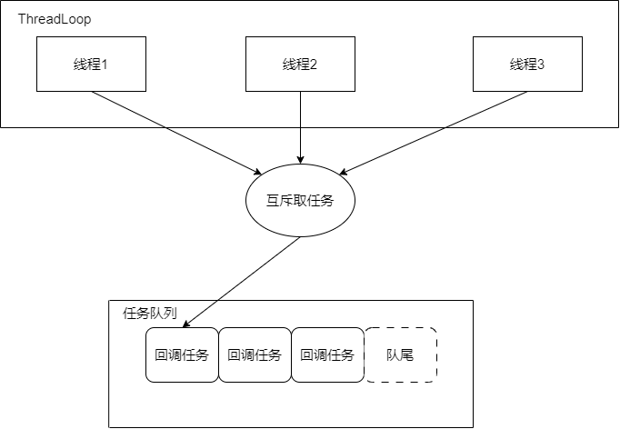

[muduo源码阅读笔记（0、下载编译muduo）](./Start.md)

[muduo源码阅读笔记（1、同步日志）](./SynLogging.md)

[muduo源码阅读笔记（2、对C语言原生的线程安全以及同步的API的封装）](./ThreadSafeAndSync.md)

[muduo源码阅读笔记（3、线程和线程池的封装）](./ThreadAndThreadPool.md)

[muduo源码阅读笔记（4、异步日志）](./AsyncLogging.md)

[muduo源码阅读笔记（5、Channel和Poller）](./ChannelAndPoller.md)

[muduo源码阅读笔记（6、ExevntLoop和Thread）](./EvevntLoopAndThread.md)

[muduo源码阅读笔记（7、EventLoopThreadPool）](./EventLoopThreadPool.md)

[muduo源码阅读笔记（8、定时器TimerQueue）](./TimerQueue.md)

[muduo源码阅读笔记（9、TcpServer）](./TcpServer.md)

[muduo源码阅读笔记（10、TcpConnection）](./TcpConnection.md)

**闲聊**

Muduo对线程和线程池的封装，涉及得到源码也不多，大概加一起300多行，这部分读者可以好好精读一下。

## 线程

在阅读cpp的源码，分析一个类具体的实现的时候，首先应该看类的.h文件，主要看类的成员变量有哪些，毕竟成员函数，就是对成员变量进行代码层面的操作的。

**提供的接口：**

<!-- more -->
```cpp
class Thread : noncopyable {
public:
    typedef std::function<void ()> ThreadFunc;

    explicit Thread(ThreadFunc, const string& name = string());
    // FIXME: make it movable in C++11
    ~Thread();

    void start();
    int join(); // return pthread_join()

    bool started() const { return started_; }
    // pthread_t pthreadId() const { return pthreadId_; }
    pid_t tid() const { return tid_; }
    const string& name() const { return name_; }

    static int numCreated() { return numCreated_.get(); }

private:
    void setDefaultName();

    bool       started_;    // 线程正在运行？
    bool       joined_;     // 有其他线程对该线程join？
    pthread_t  pthreadId_;  // Posix中的线程id
    pid_t      tid_;        // 线程真实的id（进程id）
    ThreadFunc func_;       // 线程回调函数
    string     name_;       // 线程名
    CountDownLatch latch_;  // 在父线程继续运行前，确保创建的子线程正在运行

    static AtomicInt32 numCreated_; // 对已经创建的线程计个数，所有线程对象共享的变量，线程默认名可能会用到
};
```

**线程启动流程：**

1. Thread::start()  -> 

    2. pthread_create(..., &detail::startThread,...)    -> 

        3. startThread(void* obj)   ->

            4. ThreadData::runInThread()    -> 

                5. Thread::func_()

**实现的伪代码：**

```cpp

struct ThreadData {
    typedef muduo::Thread::ThreadFunc ThreadFunc;
    ThreadFunc func_;
    string name_;
    pid_t* tid_;
    CountDownLatch* latch_;

    ThreadData(ThreadFunc func,
                const string& name,
                pid_t* tid,
                CountDownLatch* latch)
    : func_(std::move(func)),
        name_(name),
        tid_(tid),
        latch_(latch)
    { }

    void runInThread(){
        *tid_ = muduo::CurrentThread::tid();  // 获取&&缓存tid，并赋值给Thread::tid_对象
        tid_ = NULL;  // 取消对Thread::tid_的指向，保证安全
        latch_->countDown();  // 倒计数器减为0（初始化为1），通知父线程，子线程启动完毕
        latch_ = NULL;  // 取消对Thread::latch__的指向，保证安全

        muduo::CurrentThread::t_threadName = name_.empty() ? "muduoThread" : name_.c_str(); // 将线程名赋值给线程全局变量
        ::prctl(PR_SET_NAME, muduo::CurrentThread::t_threadName); // 设置真正的线程的进程名。
        try{
            func_();  // 真正开始执行Thread的回调函数
            muduo::CurrentThread::t_threadName = "finished";
        }
        catch (...){
            // 异常处理...
        }
    }
};

/*
* pthread_create回调函数
*/
void* startThread(void* obj){
    ThreadData* data = static_cast<ThreadData*>(obj);
    data->runInThread();
    delete data;
    return NULL;
}

Thread::Thread(ThreadFunc func, const string& n)
  : started_(false),
    joined_(false),
    pthreadId_(0),
    tid_(0),
    func_(std::move(func)),
    name_(n),
    latch_(1){
    setDefaultName();
}

Thread::~Thread(){
    /*
    * 如果线程启动了并且没有任何线程join过该线程，就调用pthread_detach将该线程分
    * 离，接触父子关系，让该线程自生自灭。
    */
    if (started_ && !joined_){
        pthread_detach(pthreadId_);
    }
}

void Thread::setDefaultName(){
    int num = numCreated_.incrementAndGet();  // 原子自增
    if (name_.empty()){  // 如果用户没有设置name
        char buf[32];
        snprintf(buf, sizeof buf, "Thread%d", num); // 利用numCreated_构造一个唯一的name
        name_ = buf;
    }
}

void Thread::start(){
    assert(!started_);
    started_ = true;
    /*
    * ThreadData对象的创建是为了父子线程数据的初始化和传输，比如，Thread对象最开始被创建
    * 在父线程，子线程要执行的回调函数，以及其线程名，而且，Thread对象的一些成员变量还要等
    * 子线程启动后，才能得知，比如tid，此外，父子线程同步也要依附子线程的启动。
    */
    // FIXME: move(func_)
    detail::ThreadData* data = new detail::ThreadData(func_, name_, &tid_, &latch_);
    if (pthread_create(&pthreadId_, NULL, &detail::startThread, data)){
        started_ = false;
        delete data; // or no delete?
        LOG_SYSFATAL << "Failed in pthread_create";
    }else{
        latch_.wait();  // 父子线程的同步，在子线程启动后，会调用latch_.down()唤醒父线程。
        assert(tid_ > 0);
    }
}
  /*
  * 简单的调用join即可
  */
int Thread::join(){
    assert(started_);
    assert(!joined_);
    joined_ = true;
    return pthread_join(pthreadId_, NULL);
}
```

### 细节明细：

**疑问：**

Muduo网络库在封装Thread时，为什么不直接向子线程传递Thread对象本身，反而去创建一个ThreadData对象去传递呢？

**解答：**

Muduo网络库在封装Thread时选择创建一个ThreadData对象而不是直接向子线程传递Thread对象本身，有一些合理的设计考虑：

1. 线程安全性： 直接向子线程传递Thread对象可能会引入线程安全的问题。Thread对象的生命周期和线程的执行是相关联的，如果在子线程中直接访问或修改Thread对象，可能导致竞态条件和不确定的行为。通过ThreadData的设计，可以更好地封装线程私有数据，确保线程安全性。

2. 封装线程私有数据： ThreadData的存在允许封装线程私有数据，这些数据对于特定线程是独立的。如果直接传递Thread对象，就需要确保Thread对象的成员变量在多线程环境下的正确性和安全性，而通过ThreadData可以更容易实现这一点。

3. 用户数据传递： ThreadData允许用户在创建线程时传递额外的用户数据。这使得用户可以通过ThreadData传递一些上下文信息，而不必直接依赖Thread对象。

4. 解耦设计： 通过ThreadData的设计，Thread类的内部实现与线程的具体执行逻辑解耦。Thread对象可以专注于线程的管理，而线程的执行逻辑则通过ThreadData实现，提高了代码的模块化和可维护性。

**Muduo中，对Posix线程调用fork函数的处理:**

**背景：** 我有写过一个deamo，结果表明，posix线程在调用fork后，子进程并不会复制父进程的所有线程，即子进程只有一个线程（也是子线程的主线程），该线程就是父进程调用fork函数的子线程的上下文复制版。

**Muduo中的处理：** Muduo设计了一个ThreadNameInitializer类，该类定义了一个全局对象，在程序创建时，构造函数会调用pthread_atfork函数，设置了chile回调`afterFork()`，在子进程被创建时，系统会调用`afterFork()`回调，重新设置子进程中主线程的线程局部变量包括：t_cachedTid、t_threadName等。

回调代码如下：

```cpp
void afterFork(){
    muduo::CurrentThread::t_cachedTid = 0;
    muduo::CurrentThread::t_threadName = "main";
    CurrentThread::tid();
    // no need to call pthread_atfork(NULL, NULL, &afterFork);
}
```

## 线程池

Muduo设计的线程池，可以直接当模板来使用，设计的非常精妙。不仅线程池的初始化和运行，而且**线程池的析构停止**做的也非常清晰。

**架构图：**
简单画一下线程池的架构图吧：



线程池的每个线程执行的线程回调，都是处于一个while循环中，循环往复的执行：

1. 到任务队列取回调任务。
2. 执行回调任务。
3. 回到1。

当然，如果线程池停止了，就会跳出循环。

**提供的接口：**

```cpp
class ThreadPool : noncopyable{
public:
    typedef std::function<void ()> Task;

    explicit ThreadPool(const string& nameArg = string("ThreadPool"));
    ~ThreadPool();

    // Must be called before start().
    void setMaxQueueSize(int maxSize) { maxQueueSize_ = maxSize; }
    void setThreadInitCallback(const Task& cb)
    { threadInitCallback_ = cb; }

    void start(int numThreads);
    void stop();

    const string& name() const
    { return name_; }

    size_t queueSize() const;

    // Could block if maxQueueSize > 0
    // Call after stop() will return immediately.
    // There is no move-only version of std::function in C++ as of C++14.
    // So we don't need to overload a const& and an && versions
    // as we do in (Bounded)BlockingQueue.
    // https://stackoverflow.com/a/25408989
    void run(Task f);

private:
    bool isFull() const REQUIRES(mutex_);
    void runInThread();
    Task take();

    mutable MutexLock mutex_;                       // 线程池全局互斥锁
    Condition notEmpty_ GUARDED_BY(mutex_);         // 等待任务队列非空的条件变量
    Condition notFull_ GUARDED_BY(mutex_);          // 等待任务队列未满的条件变量
    string name_;                                   //线程池的名，线程名就是依据它来拼接
    Task threadInitCallback_;                       // 线程池中，线程共享的线程初始化的回调
    std::vector<std::unique_ptr<muduo::Thread>> threads_; // 线程池本体，除了调用start时会写，其他时期都是读，可以不受mutex保护
    std::deque<Task> queue_ GUARDED_BY(mutex_);     // 任务队列
    size_t maxQueueSize_;                           //任务队列中，最多存放任务数，不受互斥锁保护。（原生数据类型在很少去写的情况下（可能不太严格，但是为了性能，也无所谓）看成是原子的）
    bool running_;                                  // 线程池是否正在运行，不受互斥锁保护。（原生数据类型在很少去写的情况下（可能不太严格，但是为了性能，也无所谓）看成是原子的）
};
```

**注意：**

线程池中，在调用`ThreadPool::start()`启动线程池之前，必须先调用`ThreadPool::setMaxQueueSize`来设定任务队列的最大任务数。

**实现的伪代码：**

```cpp
ThreadPool::ThreadPool(const string& nameArg)
  : mutex_(),
    notEmpty_(mutex_),
    notFull_(mutex_),
    name_(nameArg),
    maxQueueSize_(0),
    running_(false){
}

ThreadPool::~ThreadPool(){
    /*
    * 如果线程池在析构时，没有停止，就调用stop()回收。
    */
    if (running_){
        stop();
    }
}
/*
* 调用start前先设置任务队列的最大任务数。
* 参数：提供创建线程池的线程数
*/
void ThreadPool::start(int numThreads){
    assert(threads_.empty());
    running_ = true;
    threads_.reserve(numThreads);   // 提前预留好内存
    for (int i = 0; i < numThreads; ++i){   // 创建numThreads个线程，并起名。
        char id[32];
        snprintf(id, sizeof id, "%d", i+1);
        threads_.emplace_back(new muduo::Thread(
                std::bind(&ThreadPool::runInThread, this), name_+id));
        threads_[i]->start();   // 启动
    }
    if (numThreads == 0 && threadInitCallback_){
        // 如果numThreads为零，就让父线程作为任务执行线程，并调用线程初始化函数。
        threadInitCallback_();
    }
}

void ThreadPool::stop(){
    {
        MutexLockGuard lock(mutex_);
        running_ = false;
        notEmpty_.notifyAll();  // 唤醒所有调用notFull_.wait()的函数
        notFull_.notifyAll();   // 唤醒所有调用notEmpty_.wait()的函数
    }
    for (auto& thr : threads_){
        // 除了调用start时会写，其他时期都是读，可以不受mutex保护
        thr->join();
    }
}

size_t ThreadPool::queueSize() const{
    MutexLockGuard lock(mutex_);
    return queue_.size();
}

void ThreadPool::run(Task task){
    if (threads_.empty()){  // 既然无线程可用，线程就自己执行任务。
        task();
    }else{
        MutexLockGuard lock(mutex_);
        while (isFull() && running_){
            // while解决惊群，可能会被take（任务队列未满）或stop（线程池停止）唤醒
            notFull_.wait();
        }
        if (!running_) return;
        assert(!isFull());

        queue_.push_back(std::move(task));  // 存任务
        notEmpty_.notify(); // 任务队列至少有一个任务，所以非空，调用一下notEmpty_.notify();
    }
}

ThreadPool::Task ThreadPool::take(){
    MutexLockGuard lock(mutex_);
  // always use a while-loop, due to spurious wakeup
    while (queue_.empty() && running_){
        // while解决惊群，可能会被run（任务队列非空）或stop（线程池停止）唤醒
        notEmpty_.wait();
    }

    Task task;
    if (!queue_.empty()){   // 任务队列为空，就返回空任务，一般是调用stop停止线程池导致。
        task = queue_.front();  // 取任务。
        queue_.pop_front();     // pop任务

        if (maxQueueSize_ > 0){ 
            /*
            * 如果任务太多，达到了上限，如果其他线程还想，加入任务，会阻塞在run函数的
            * notFull_.wait()上。保证任务队列任务数量不超过上限，此时在take函数中占
            * 锁取走了一个任务，任务队列一定未满，所以放心调用notFull_.notify()通知
            * run函数即可。
            */
            notFull_.notify();  
        }// else 若maxQueueSize_ == 0，说明任务队列大小无限，不存在执行notFull_.wait()分支的线程，无需调用notFull_.notify()。
    }
    return task;
}

bool ThreadPool::isFull() const{
    mutex_.assertLocked();
    return maxQueueSize_ > 0 && queue_.size() >= maxQueueSize_;
}

void ThreadPool::runInThread(){
    try{
        if (threadInitCallback_){
            threadInitCallback_();  // 执行一下初始化回调
        }
        while (running_){   // 就算要停止了，如果任务队列里面还有任务不继续消化任务吗？
            Task task(take());  // 取任务
            if (task){  // 空任务一般发生在线程池停止阶段。
                task(); // 执行任务。
            }
        }
    }catch (...){
        // 异常处理...
    }
}

```

### 细节明细：

**疑问：**

Muduo的线程池中为什么要设置一个maxQueueSize_成员来限制任务队列的大小？

**解答：**

在Muduo网络库的线程池中设置maxQueueSize_成员来限制任务队列的大小是为了防止无限制的任务积压，以保护系统的稳定性和资源管理。这样的设计有以下几个原因：

1. 资源控制： 通过设置任务队列的最大大小，可以控制线程池在高负载情况下的资源占用。如果不限制任务队列大小，当任务提交速度远远大于线程池处理速度时，可能会导致任务队列无限增长，消耗大量内存资源，最终导致系统资源耗尽。

2. 避免任务积压： 如果任务队列无限制增长，可能导致待处理的任务数量不断累积，进而导致系统的响应时间变长。通过设置最大队列大小，可以避免任务积压，确保系统对任务的响应是有限度的。

3. 反馈机制： 当任务队列达到最大大小时，新的任务可能会被拒绝或者触发一些警告机制。这样的反馈机制可以让开发者或者系统管理员及时感知到系统的负载情况，并采取相应的措施，如调整线程池大小、优化任务处理逻辑等。（**尽管在Muduo中，在代码实现上并没有实现这一点**）

**疑问：**

在ThreadPool::runInThread函数中，如果线程池要停止了（running_ == false），假如任务队列里面还有任务不继续消化任务吗？我看Muduo的实现是，线程池停止，即使任务队列还有任务，ThreadPool::runInThread()也会直接跳出循环。为什么要这样设计？

**解答：**

线程池的停止有两种：

1. Graceful Shutdown： 线程池的停止过程可能是优雅的，即允许已经在任务队列中的任务执行完毕，但不再接受新的任务。在这种情况下，可以通过设置running_为false来触发线程池停止，但允许已在队列中的任务继续执行。

2. 快速停止： 另一种设计考虑是快速停止，即立即停止线程的执行，无论任务队列中是否还有任务。这可能是为了迅速释放线程池占用的资源，例如在应用程序关闭时。在这种情况下，即使有未执行的任务，也可以选择快速停止线程池。

具体选择采用哪种停止方式取决于应用程序的需求和设计目标。如果对任务的完成有严格的要求，可以选择优雅停止，确保所有任务得以执行。如果更注重迅速释放资源，可以选择快速停止。

在Muduo中的设计选择了快速停止，一旦running_为false，即使任务队列中还有任务，线程也会直接退出。这种设计可能符合Muduo网络库的使用场景和性能需求。

**maxQueueSize_ == 0的特殊含义：**

在Muduo网络库中，仔细梳理线程池的源码逻辑可以发现，如果maxQueueSize_的大小被设置为0，表示任务队列的大小没有限制，即队列可以无限增长。ThreadPool::isFull函数会始终返回false，此时在调用ThreadPool::run向任务队列添加任务时，会无条件将任务添加到任务队列，而且ThreadPool::take函数中，由于maxQueueSize_ == 0，也不会去调用notFull_.notify()通知阻塞在ThreadPool::run的线程，因为在maxQueueSize_ == 0条件下根本不可能有线程会阻塞在ThreadPool::run中。

---

**本章完结**