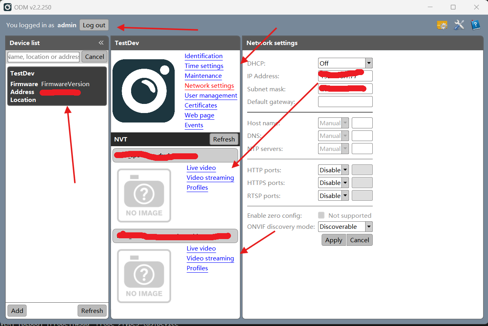

## 总览

当前项目github仓库：[https://github.com/LunarStore/onvif_srvd](https://github.com/LunarStore/onvif_srvd)。

onvif服务原参考项目：[https://github.com/KoynovStas/onvif_srvd/tree/master](https://github.com/KoynovStas/onvif_srvd/tree/master)，原项目当中，作者把服务发现和onvif服务分成了两个项目。我已经将这两项目合并，onvif_srvd包含服务发现与onvif服务。**onvif_srvd实现了Onvif所需的最少接口。**（注意：甚至连Profile S标准都未达到，并且为了适配H265，引入了media2.wsdl，按规范来讲我们需要完整的实现Profile T标准）

调试工具：ODM + OnvifTestTool。

**Onvif Device Test Tool工具能高效帮忙对onvif服务进行调试，可以利用Onvif Device Test Tool查看和分析 来自onvif服务的gsoap报文。如果你需要开发onvif，该工具一定要学会使用！！！它一定能是你调试onvif的利器。**

onvif服务项目结构：

<!-- more -->
```bash
ipcamera/app/onvif_srvd
├── CHANGELOG.md        # 可忽略
├── cmake
├── CMakeLists.txt
├── gsoap-2.8           # 必要！不可删除！
├── lib
├── LICENSE             # 可忽略
├── patch               # 可忽略
├── README.md
├── SDK
├── src
├── start_scripts
└── wsdl
```

- SDK: 包含gsoap-2.8.zip文件。
- cmake： cmake模块。
- CMakeLists.txt: cmake构建脚本。
- gsoap-2.8: gsoap-2.8.zip解压后的项目。但不完全是gsoap-2.8.zip解压后的项目，根据实际情况对少数文件进行过修改（不然编译不通过！），onvif_srvd的构建依赖该项目。
- lib: 依赖库。
- src: onvif源码所在目录。
- start_scripts: 启动脚本。暂未使用。
- wsdl: onvif服务接口的描述文件。gsoap会利用它来生成接口代码。

## 移植与调试

这里准备了一份ipc项目当中onvif_srv服务的X86版本。方便以后onvif服务的扩展与移植

编译命令如下：

```bash
cmake -B build . -DWSSE_ON=1 -DUSE_GSOAP_STATIC_LIB=1
cd build && make
```

编译成功如下：


编译成功后，build/generated目录会生成如下代码：

```bash
onvif_srvd/build/generated
├── DeviceBinding.nsmap
├── Media2Binding.nsmap
├── MediaBinding.nsmap
├── onvif.h
├── PTZBinding.nsmap
├── RemoteDiscoveryBinding.nsmap
├── soapC.cpp
├── soapDeviceBindingService.cpp
├── soapDeviceBindingService.h
├── soapH.h
├── soapMedia2BindingService.cpp
├── soapMedia2BindingService.h
├── soapMediaBindingService.cpp
├── soapMediaBindingService.h
├── soapPTZBindingService.cpp
├── soapPTZBindingService.h
├── soapRemoteDiscoveryBindingService.cpp   # 该服务可以忽略，我们项目没有实现该服务的接口。
├── soapRemoteDiscoveryBindingService.h
├── soapStub.h
├── soapwsddService.cpp                     # 服务发现重点关注的文件。
├── soapwsddService.h
├── version.h
└── wsdd.nsmap
```

和onvif_srvd/src当中的代码对比，如下：

```bash
onvif_srvd/src
├── client_events.cpp       # 基于该文件实现的函数也能实现服务发现，但是我们没有使用该文件当中的函数实现服务发现。已弃用
├── daemon.cpp              
├── daemon.h
├── eth_dev_param.cpp
├── eth_dev_param.h
├── onvif_srvd.cpp
├── service_context.cpp
├── service_context.h
├── service_device.cpp
├── service_media2.cpp
├── service_media.cpp
├── service_PTZ.cpp
├── service_WSDD.cpp
├── smacros.cpp
├── smacros.h
├── soapClient.c
├── utils.cpp
└── utils.h
```

onvif_srvd/src下源文件和onvif_srvd/build/generated下源文件的关系：

- daemon: 守护进程的实现。
- eth_dev_param: 网口配置工具文件。
- onvif_srvd: main函数所在文件。
- service_context: onvif服务配置管理实现文件，管理包括码流等信息。
- service_device: wsdl 设备管理服务接口实现文件，对build/generated目录下的soapDeviceBindingService接口进行实现。
- service_media1: wsdl media1服务接口实现文件，对build/generated目录下的soapMediaBindingService接口进行实现。仅支持jpeg、mpeg4、h264。
- service_media2: wsdl media2服务接口实现文件，对build/generated目录下的soapMedia2BindingService接口进行实现。包含service_media1所支持的格式，此外增加了对h265的支持。
- service_PTZ: wsdl PTZ控制服务接口实现文件，对build/generated目录下的soapPTZBindingService接口进行实现。我们的项目当中目前没实现PTZ云台功能，所以，该服务可以暂时忽略，只是因为原项目当中存在，所以我就保留下来了。
- service_WSDD: 对wsdl WSDD服务接口进行实现，是我们项目当前服务发现所采用的方式。如果需要修改服务发现实现相关代码，主要修改该文件。
- smacros: 通用宏，定义了包括日志的实现。
- soapClient: 该文件由gsoap生成。无需深入了解。
- utils: 工具文件。

编译完成后，将你的PC以太网和笔记本相连。然后给以太网设置一个ip，我这里设置的是：192.168.1.77。子网掩码设置成255.255.255.0。如下：


编译完成后，在onvif项目的build目录下，会生成 onvif_srvd 这样一个可执行文件。前面的工作准备好后，我们可以使用如下命令来启动我们的服务。

```bash
# --no_fork : 不启用子线程。
# --no_close: 不关闭输入输出。
# --ifs     : 指定onvif绑定的网口。
sudo ./onvif_srvd --no_fork --no_close --ifs eno1
```

正常启动后会输出类似如下日志：


然后打开笔记本上安装的ODM，在左上角输入用户名和密码：

- 用户名：admin
- 密码：*** (密码是在代码当中写死的！，参考：onvif_srvd\src\utils.cpp: onvif_access_control函数。

登录后，可以看到虚拟相机的信息，包括虚拟相机设备地址、设备基本信息、码流信息等。当点击Live video时会出现**没有信号的提示**，这是正常现象，因为我们onvif当中设置的码流url是测试使用实际上并不存在，因为我们的pc机没有提供这样的码流。



## Onvif服务请求链路流程介绍（搭配海康录像机）

onvif服务逻辑链路如下：

首先，相机网口和录像机使用网线直连，录像机和相机上电。录像机连接显示器，然后输入录像机用户名和密码。为方便，我们相机的onvif服务密码和录像机密码是一致的。在点击录像机的配置，然后点击在线设备列表的刷新，上面就会出现两路我们相机的码流。


正常情况下，双击两路被发现的码流，在预览界面，录像机会预览显示我们相机的超宽光谱和双光谱码流。

报文交互逻辑是：

1. 录像机向网口发送服务发现的广播报文。
2. 录像机的onvif_srvd服务当中的Service Discover接收到录像机发来的服务发现soap报文，Service Discover会将onvif服务的url发送给录像机。
3. 录像机收到相机onvif服务的url，拿着onvif服务的url再向onvif服务发送服务查询soap报文（请求onvifDeviceBindingService::GetServices接口）。
4. onvif服务会返回所支持服务列表（Device Server、Media Service、Media2 Service、PTZ Service）。
5. 经过一次次交涉，录像机最终会请求MediaBindingService::GetStreamUri接口，获取设备支持的所有RTSP码流URL。然后一一拉流预览显示。

## Onvif服务添加一个WSDL

WSDL下载网站：https://www.onvif.org/profiles/specifications/

1. 将下载下来的wsdl放到ipcamera/app/onvif_srvd/wsdl。
2. 如果下载下来的wsdl当中的内容，有引用onvif.xsd、b-2.xsd、bf-2.xsd、common.xsd、t-1.xsd，需要将依赖路径修改成./xxx.xsd。
3. 在CMakeLists.txt当中添加gsoap编译生成的代码文件。形如：
    
    当然如果你不知道你将添加的wsdl将生成什么文件名，你可以先将wsdl移植到x86版本的onvif_srvd当中。待cmake完成后，查看build/generated目录所生成的文件名。然后按照soapDeviceBindingService（对应devicemgmt.wsdl生成的源文件）在CMakeLists.txt当中照猫画虎添加对应的.cpp和.h文件即可。
4. 参考soapDeviceBindingService的接口实现文件，给新添加的wsdl在onvif_srvd/src当中增加接口实现文件。当然，也别忘了将接口实现文件添加到CMakeLists.txt当中去。

## Onvif服务接口实现

接口实现参考的辅助网站：[https://www.onvif.org/onvif/ver20/util/operationIndex.html](https://www.onvif.org/onvif/ver20/util/operationIndex.html)

假设我们现在需要添加系统重启的接口（SystemReboot）：

1. 从上面网站当中我们可以得知，我们需要修改设备管理的实现接口文件-service_device.cpp。
2. 到service_device.cpp文件底部可以看到接口的默认实现：
    
    SOAP_EMPTY_HANDLER这个宏定义了接口默认实现，即什么都不干。查看onvif_srvd/build/generated下产生的soapDeviceBindingService.h，找到SystemReboot的签名，在service_device.cpp文件当中实现该接口。
3. 如果你由仔细观察每个实现的接口，在函数最开头都会有一段形如ACCESS_CONTROL的鉴权的代码。在onvif当中，每一个接口都需要进行鉴权，不同的用户等级对接口有不同的访问权限。以我们即将添加的SystemReboot接口为例，参考文档：doc/ipcamera/ONVIF-Official-documents-master/网络接口规范/ONVIF-Core-Specification.pdf。
    
    从文档当中，可以了解到，SystemReboot接口访问级别为UNRECOVERABLE，结合文档列出的权限表格得知，只有系统管理员才能调用接口重启系统：
    。
4. 最终接口的实现可能如下：
    ```cpp
    int DeviceBindingService::SystemReboot(_tds__SystemReboot *tds__SystemReboot, _tds__SystemRebootResponse &tds__SystemRebootResponse) {
        DEBUG_MSG("Device: %s\n", __FUNCTION__);
        ACCESS_CONTROL(soap, AccessClassesType::UNRECOVERABLE);

        tds__SystemRebootResponse.Message = "ok!";
        system("reboot");
        return SOAP_OK;
    }
    ```