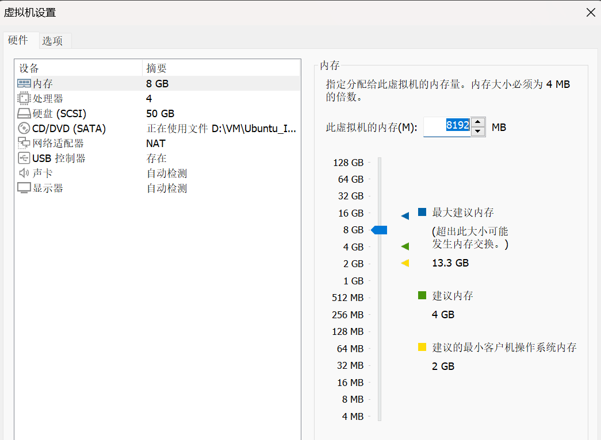
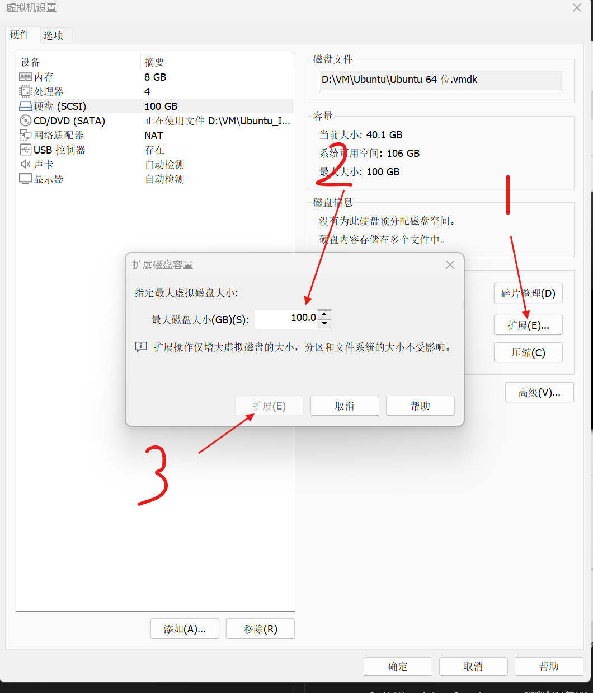

## 前排提示

因为Ubuntu再安装时，根分区是没有使用LVM进行磁盘管理的，所以如果想扩展根分区，我们不得不使用另外一种暴力的方法。简单来说就是利用fdisk删除原来的根分区再基于原来的起始块号重新建立一个根分区。从而达到扩展根分区的目的。

## 步骤

0、我在创建虚拟机的时候，硬盘只分配了50G，我的虚拟机基本配置如下：



1、首先使用df和lsblk查看我分区情况：

<!-- more -->
```
root@lunar-virtual-machine:~/workspace# 
root@lunar-virtual-machine:~/workspace# df -h
Filesystem      Size  Used Avail Use% Mounted on
tmpfs           790M  2.0M  788M   1% /run
/dev/sda3        49G   30G   17G  65% /
tmpfs           3.9G     0  3.9G   0% /dev/shm
tmpfs           5.0M  4.0K  5.0M   1% /run/lock
/dev/sda2       512M  6.1M  506M   2% /boot/efi
tmpfs           790M   76K  790M   1% /run/user/128
tmpfs           790M   60K  790M   1% /run/user/0
root@lunar-virtual-machine:~/workspace# 
root@lunar-virtual-machine:~/workspace# 
root@lunar-virtual-machine:~/workspace# lsblk
NAME   MAJ:MIN RM   SIZE RO TYPE MOUNTPOINTS
loop0    7:0    0     4K  1 loop /snap/bare/5
loop1    7:1    0  63.9M  1 loop /snap/core20/2264
loop2    7:2    0  74.2M  1 loop /snap/core22/1122
loop3    7:3    0  63.9M  1 loop /snap/core20/2318
loop4    7:4    0  74.2M  1 loop /snap/core22/1380
loop5    7:5    0   497M  1 loop /snap/gnome-42-2204/141
loop6    7:6    0 349.7M  1 loop /snap/gnome-3-38-2004/143
loop7    7:7    0 268.3M  1 loop /snap/firefox/4090
loop8    7:8    0 505.1M  1 loop /snap/gnome-42-2204/176
loop9    7:9    0 269.6M  1 loop /snap/firefox/4136
loop10   7:10   0  91.7M  1 loop /snap/gtk-common-themes/1535
loop11   7:11   0  12.9M  1 loop /snap/snap-store/1113
loop12   7:12   0  12.3M  1 loop /snap/snap-store/959
loop13   7:13   0  38.7M  1 loop /snap/snapd/21465
loop14   7:14   0  40.4M  1 loop /snap/snapd/20671
loop15   7:15   0   476K  1 loop /snap/snapd-desktop-integration/157
loop16   7:16   0   452K  1 loop /snap/snapd-desktop-integration/83
sda      8:0    0    50G  0 disk 
├─sda1   8:1    0     1M  0 part 
├─sda2   8:2    0   513M  0 part /boot/efi
└─sda3   8:3    0  49.5G  0 part /var/snap/firefox/common/host-hunspell
                                 /
sr0     11:0    1   4.7G  0 rom  
root@lunar-virtual-machine:~/workspace# 
```

2、关闭虚拟机，修改硬盘大小：



3、启动虚拟机，再次使用df、lsblk查看分区情况，从lsblk命令的输出可以看到/dev/sda设备的容量变成了100G，但是因为我们还没进行分区，剩余的50G无法被投入使用，所以下一步开始准备扩展分区：

```
root@lunar-virtual-machine:~/workspace# 
root@lunar-virtual-machine:~/workspace# df -h
Filesystem      Size  Used Avail Use% Mounted on
tmpfs           790M  2.0M  788M   1% /run
/dev/sda3        49G   30G   17G  65% /
tmpfs           3.9G     0  3.9G   0% /dev/shm
tmpfs           5.0M  4.0K  5.0M   1% /run/lock
/dev/sda2       512M  6.1M  506M   2% /boot/efi
tmpfs           790M   76K  790M   1% /run/user/128
tmpfs           790M   60K  790M   1% /run/user/0
root@lunar-virtual-machine:~/workspace# 
root@lunar-virtual-machine:~/workspace# 
root@lunar-virtual-machine:~/workspace# lsblk
NAME   MAJ:MIN RM   SIZE RO TYPE MOUNTPOINTS
loop0    7:0    0     4K  1 loop /snap/bare/5
loop1    7:1    0  63.9M  1 loop /snap/core20/2264
loop2    7:2    0  74.2M  1 loop /snap/core22/1380
loop3    7:3    0  74.2M  1 loop /snap/core22/1122
loop4    7:4    0  63.9M  1 loop /snap/core20/2318
loop5    7:5    0 268.3M  1 loop /snap/firefox/4090
loop6    7:6    0 269.6M  1 loop /snap/firefox/4136
loop7    7:7    0 349.7M  1 loop /snap/gnome-3-38-2004/143
loop8    7:8    0   497M  1 loop /snap/gnome-42-2204/141
loop9    7:9    0 505.1M  1 loop /snap/gnome-42-2204/176
loop10   7:10   0  91.7M  1 loop /snap/gtk-common-themes/1535
loop11   7:11   0  12.9M  1 loop /snap/snap-store/1113
loop12   7:12   0  12.3M  1 loop /snap/snap-store/959
loop13   7:13   0  40.4M  1 loop /snap/snapd/20671
loop14   7:14   0  38.7M  1 loop /snap/snapd/21465
loop15   7:15   0   476K  1 loop /snap/snapd-desktop-integration/157
loop16   7:16   0   452K  1 loop /snap/snapd-desktop-integration/83
sda      8:0    0   100G  0 disk 
├─sda1   8:1    0     1M  0 part 
├─sda2   8:2    0   513M  0 part /boot/efi
└─sda3   8:3    0  49.5G  0 part /var/snap/firefox/common/host-hunspell
                                 /
sr0     11:0    1   4.7G  0 rom  
root@lunar-virtual-machine:~/workspace# 
```

4、使用fdisk命令进行扩容，具体步骤是：使用p查看一下初始分区情况，一定要记住sda3的起始块号：1054720，然后使用d删除第3分区（**此时很关键，一定不要使用w保持退出！**），然后再n一个3分区，然后起始块就是1054720，最后一块默认就行了，将所有块都分配给根分区。然后w保持退出。

```
root@lunar-virtual-machine:~/workspace# fdisk /dev/sda

Welcome to fdisk (util-linux 2.37.2).
Changes will remain in memory only, until you decide to write them.
Be careful before using the write command.

This disk is currently in use - repartitioning is probably a bad idea.
It's recommended to umount all file systems, and swapoff all swap
partitions on this disk.

Command (m for help): m

Help:

  GPT
   M   enter protective/hybrid MBR

  Generic
   d   delete a partition
   F   list free unpartitioned space
   l   list known partition types
   n   add a new partition
   p   print the partition table
   t   change a partition type
   v   verify the partition table
   i   print information about a partition

  Misc
   m   print this menu
   x   extra functionality (experts only)

  Script
   I   load disk layout from sfdisk script file
   O   dump disk layout to sfdisk script file

  Save & Exit
   w   write table to disk and exit
   q   quit without saving changes

  Create a new label
   g   create a new empty GPT partition table
   G   create a new empty SGI (IRIX) partition table
   o   create a new empty DOS partition table
   s   create a new empty Sun partition table


Command (m for help): p
Disk /dev/sda: 100 GiB, 107374182400 bytes, 209715200 sectors
Disk model: VMware Virtual S
Units: sectors of 1 * 512 = 512 bytes
Sector size (logical/physical): 512 bytes / 512 bytes
I/O size (minimum/optimal): 512 bytes / 512 bytes
Disklabel type: gpt
Disk identifier: 14A69C2D-E6FB-4626-A7E6-10A16A052F8D

Device       Start       End   Sectors  Size Type
/dev/sda1     2048      4095      2048    1M BIOS boot
/dev/sda2     4096   1054719   1050624  513M EFI System
/dev/sda3  1054720 104855551 103800832 49.5G Linux filesystem

Command (m for help): d
Partition number (1-3, default 3): 3

Partition 3 has been deleted.

Command (m for help): p
Disk /dev/sda: 100 GiB, 107374182400 bytes, 209715200 sectors
Disk model: VMware Virtual S
Units: sectors of 1 * 512 = 512 bytes
Sector size (logical/physical): 512 bytes / 512 bytes
I/O size (minimum/optimal): 512 bytes / 512 bytes
Disklabel type: gpt
Disk identifier: 14A69C2D-E6FB-4626-A7E6-10A16A052F8D

Device     Start     End Sectors  Size Type
/dev/sda1   2048    4095    2048    1M BIOS boot
/dev/sda2   4096 1054719 1050624  513M EFI System

Command (m for help): n
Partition number (3-128, default 3): 
First sector (1054720-209715166, default 1054720): 1054720
Last sector, +/-sectors or +/-size{K,M,G,T,P} (1054720-209715166, default 209715166): 

Created a new partition 3 of type 'Linux filesystem' and of size 99.5 GiB.
Partition #3 contains a ext4 signature.

Do you want to remove the signature? [Y]es/[N]o: y

The signature will be removed by a write command.

Command (m for help): w
The partition table has been altered.
Syncing disks.

root@lunar-virtual-machine:~/workspace# 
```

5、此时再用命令查看一下分区情况，我可以看到lsblk命令将剩余的50G算作根分区的容量，但是df命令显示的根分区还是50个G。这点很好解决，继续下面步骤。

```
root@lunar-virtual-machine:~/workspace# lsblk
NAME   MAJ:MIN RM   SIZE RO TYPE MOUNTPOINTS
loop0    7:0    0     4K  1 loop /snap/bare/5
loop1    7:1    0  63.9M  1 loop /snap/core20/2264
loop2    7:2    0  74.2M  1 loop /snap/core22/1380
loop3    7:3    0  74.2M  1 loop /snap/core22/1122
loop4    7:4    0  63.9M  1 loop /snap/core20/2318
loop5    7:5    0 268.3M  1 loop /snap/firefox/4090
loop6    7:6    0 269.6M  1 loop /snap/firefox/4136
loop7    7:7    0 349.7M  1 loop /snap/gnome-3-38-2004/143
loop8    7:8    0   497M  1 loop /snap/gnome-42-2204/141
loop9    7:9    0 505.1M  1 loop /snap/gnome-42-2204/176
loop10   7:10   0  91.7M  1 loop /snap/gtk-common-themes/1535
loop11   7:11   0  12.9M  1 loop /snap/snap-store/1113
loop12   7:12   0  12.3M  1 loop /snap/snap-store/959
loop13   7:13   0  40.4M  1 loop /snap/snapd/20671
loop14   7:14   0  38.7M  1 loop /snap/snapd/21465
loop15   7:15   0   476K  1 loop /snap/snapd-desktop-integration/157
loop16   7:16   0   452K  1 loop /snap/snapd-desktop-integration/83
sda      8:0    0   100G  0 disk 
├─sda1   8:1    0     1M  0 part 
├─sda2   8:2    0   513M  0 part /boot/efi
└─sda3   8:3    0  99.5G  0 part /var/snap/firefox/common/host-hunspell
                                 /
sr0     11:0    1   4.7G  0 rom  
root@lunar-virtual-machine:~/workspace# df -h
Filesystem      Size  Used Avail Use% Mounted on
tmpfs           790M  2.0M  788M   1% /run
/dev/sda3        49G   30G   17G  65% /
tmpfs           3.9G     0  3.9G   0% /dev/shm
tmpfs           5.0M  4.0K  5.0M   1% /run/lock
/dev/sda2       512M  6.1M  506M   2% /boot/efi
tmpfs           790M   76K  790M   1% /run/user/128
tmpfs           790M   60K  790M   1% /run/user/0
```

6、利用df -Th命令查看根分区的文件系统类型，可以看到挂载在/目录下的文件系统是ext4类型文件系统，所以，我们可以使用resize2fs /dev/sda命令可以更新分区情况。至此，根分区扩展完毕。

```
root@lunar-virtual-machine:~/workspace# df -Th
Filesystem     Type   Size  Used Avail Use% Mounted on
tmpfs          tmpfs  790M  2.0M  788M   1% /run
/dev/sda4      ext4    49G   30G   17G  65% /
tmpfs          tmpfs  3.9G     0  3.9G   0% /dev/shm
tmpfs          tmpfs  5.0M  4.0K  5.0M   1% /run/lock
/dev/sda2      vfat   512M  6.1M  506M   2% /boot/efi
tmpfs          tmpfs  790M   76K  790M   1% /run/user/128
tmpfs          tmpfs  790M   60K  790M   1% /run/user/0


root@lunar-virtual-machine:~/workspace# resize2fs /dev/sda
resize2fs 1.46.5 (30-Dec-2021)
resize2fs: Device or resource busy while trying to open /dev/sda
Couldn't find valid filesystem superblock.
root@lunar-virtual-machine:~/workspace# resize2fs /dev/sda3
resize2fs 1.46.5 (30-Dec-2021)
Filesystem at /dev/sda3 is mounted on /; on-line resizing required
old_desc_blocks = 7, new_desc_blocks = 13
The filesystem on /dev/sda3 is now 26082555 (4k) blocks long.

root@lunar-virtual-machine:~/workspace# 
root@lunar-virtual-machine:~/workspace# 
root@lunar-virtual-machine:~/workspace# df -h
Filesystem      Size  Used Avail Use% Mounted on
tmpfs           790M  2.0M  788M   1% /run
/dev/sda3        98G   30G   64G  32% /
tmpfs           3.9G     0  3.9G   0% /dev/shm
tmpfs           5.0M  4.0K  5.0M   1% /run/lock
/dev/sda2       512M  6.1M  506M   2% /boot/efi
tmpfs           790M   76K  790M   1% /run/user/128
tmpfs           790M   60K  790M   1% /run/user/0
root@lunar-virtual-machine:~/workspace# lsblk
NAME   MAJ:MIN RM   SIZE RO TYPE MOUNTPOINTS
loop0    7:0    0     4K  1 loop /snap/bare/5
loop1    7:1    0  63.9M  1 loop /snap/core20/2264
loop2    7:2    0  74.2M  1 loop /snap/core22/1380
loop3    7:3    0  74.2M  1 loop /snap/core22/1122
loop4    7:4    0  63.9M  1 loop /snap/core20/2318
loop5    7:5    0 268.3M  1 loop /snap/firefox/4090
loop6    7:6    0 269.6M  1 loop /snap/firefox/4136
loop7    7:7    0 349.7M  1 loop /snap/gnome-3-38-2004/143
loop8    7:8    0   497M  1 loop /snap/gnome-42-2204/141
loop9    7:9    0 505.1M  1 loop /snap/gnome-42-2204/176
loop10   7:10   0  91.7M  1 loop /snap/gtk-common-themes/1535
loop11   7:11   0  12.9M  1 loop /snap/snap-store/1113
loop12   7:12   0  12.3M  1 loop /snap/snap-store/959
loop13   7:13   0  40.4M  1 loop /snap/snapd/20671
loop14   7:14   0  38.7M  1 loop /snap/snapd/21465
loop15   7:15   0   476K  1 loop /snap/snapd-desktop-integration/157
loop16   7:16   0   452K  1 loop /snap/snapd-desktop-integration/83
sda      8:0    0   100G  0 disk 
├─sda1   8:1    0     1M  0 part 
├─sda2   8:2    0   513M  0 part /boot/efi
└─sda3   8:3    0  99.5G  0 part /var/snap/firefox/common/host-hunspell
                                 /
sr0     11:0    1   4.7G  0 rom  
```

这里额外记录一下，第6步最后的刷新文件系统状态的命令，不同的文件系统需要使用不同的命令：

- resize2fs /dev/sda 针对文件系统ext2 ext3 ext4  （一般是Ubuntu上使用

- xfs_growfs /dev/sda 针对文件系统xfs    （一般是centos上使用，而centos是使用lvm来扩展根分区的。

**磁盘分区小干货：**

硬盘分区有三种，主磁盘分区、扩展磁盘分区、逻辑分区。

三种分区必须满足以下限制：

1. 一个硬盘主分区至少有1个，最多4个。

2. 扩展分区可以没有，最多1个。（扩展分区其实也算一种**特殊的主分区**）

3. 主分区+扩展分区总共不能超过4个。

4. 逻辑分区可以有若干个。

关于分区号：

- 1~4号：只能被主分区和扩展分区使用。

- 5~n号：被逻辑分区使用。

**主分区可以包含一个操作系统（例如Linux、Windows）。**

**扩展分区本身不能包含文件系统，只能包含逻辑分区。**

---

**本章完结**