## SonarQube介绍

Sonar (SonarQube)是一个开源平台，用于管理源代码的质量。支持Java、kotlin、Scala、python、JavaScrip等二十几种编程语言的代码质量管理与检测。支持将代码扫描集成到现有的工作流，以便在项目分支和拉取请求之间进行连续的代码检查。

分为社区版、开发版、企业版数据中心版。对于静态检测，只有开发版、企业版支持C/C++，而我们的业务以C/C++为主，故选择需要破解的企业版。

## 安装

环境搭建参考博客：[https://www.codestar.top/2024/10/10/Linux/Ubuntu-docker%E6%90%AD%E5%BB%BAsonarqube%E7%A4%BE%E5%8C%BA%E7%89%88/](https://www.codestar.top/2024/10/10/Linux/Ubuntu-docker%E6%90%AD%E5%BB%BAsonarqube%E7%A4%BE%E5%8C%BA%E7%89%88/)

### Docker安装PostgreSQL容器

<!-- more -->
直接上命令：

```bash
docker pull postgres
```

如下：

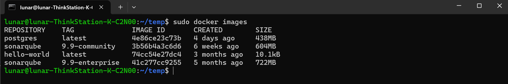

启动容器：

```bash
docker run --name postgresql \
    --restart=always \
    -e POSTGRES_USER=admin \
    -e POSTGRES_PASSWORD=123456 \
    -e POSTGRES_DB=sonarqube_db \
    -p 5432:5432 \
    -v /opt/postgres:/var/lib/postgresql/data \
    -e ALLOW_IP_RANGE=0.0.0.0/0 \
    -d postgres
```

参数含义如下：

- --name：后接容器名
- --restart=always：dcoker启动后，自动重启容器
- POSTGRES_USER：pg数据库用户名
- POSTGRES_PASSWORD：pg数据库密码
- POSTGRES_DB：创建一个名为sonarqube_db的pg数据库
- -p 5432:5432：端口映射
- -v：主机目录->容器目录的映射
- ALLOW_IP_RANGE=0.0.0.0/0：允许任何主机访问
- -d：守护进程方式创建容器
- 最后一个参数：镜像名。

pg容器创建好后如图所示：

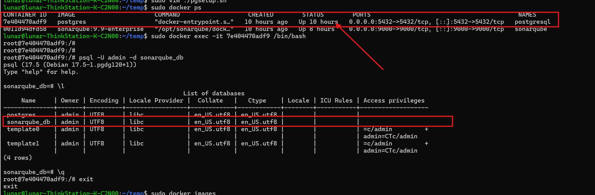

### Docker安装SonarQube容器

获取企业版sonarqube镜像：

```bash
docker pull sonarqube:9.9-enterprise
```

如下：

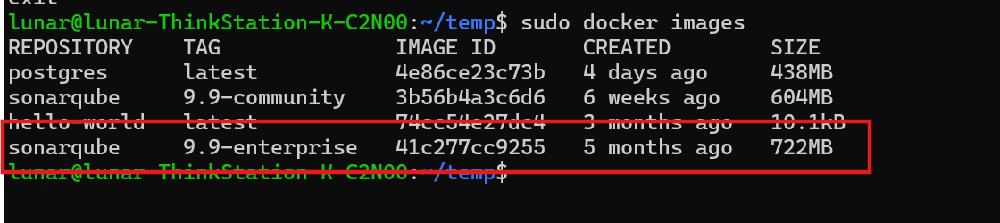

我们可以使用如下命令创建并启动sonarqube容器：

```bash
# docker run --name 容器名(可任意) -d -p 内部端口:外部端口 镜像名
docker run --name sonarqube -p 9000:9000 -d sonarqube:9.9-enterprise
```

**但是我们不能向上面那样干！它默认会使用H2嵌入式数据库，并且数据库是存在于内存当中的，如果我们的docker容器重启，那么之前所有的数据都将丢失！**

和pg容器创建不同，这里需要手动创建主机到容器映射目录，并将其权限修改为777.

```bash
mkdir -p /opt/sonarqube/data /opt/sonarqube/extensions /opt/sonarqube/logs /opt/sonarqube/conf

sudo chmod 777 -R /opt/sonarqube
```

然后创建SonarQube容器实例：

```bash
docker run --name sonarqube \
        --restart=always \
    -e SONAR_JDBC_URL=jdbc:postgresql://192.168.0.135:5432/sonarqube_db \
    -e SONAR_JDBC_USERNAME=admin \
    -e SONAR_JDBC_PASSWORD=dc123 \
    -p 9000:9000 \
    -v /opt/sonarqube/data:/opt/sonarqube/data \
    -v /opt/sonarqube/extensions:/opt/sonarqube/extensions \
    -v /opt/sonarqube/logs:/opt/sonarqube/logs \
    -v /opt/sonarqube/conf:/opt/sonarqube/conf \
    -d sonarqube:9.9-enterprise
```

参数含义如下（同前面重复的省略）：

- SONAR_JDBC_URL：pg数据库的url，ip根据主机实际情况填写
- SONAR_JDBC_USERNAME：pg数据库用户名
- SONAR_JDBC_PASSWORD：pg数据库密码
- extensions目录：sonarsube插件存放目录
- logs：日志目录
- conf: 配置目录

不出意外，容器状态会一直是restart状态，此时需要使用docker logs -f sonarqube查看对应的日志信息检查错误点。

一般是因为容器卷映射目录权限问题，或者是需要修改主机的系统参数（报错：max virtual memory areas vm.max_map_count [65530] is too low）。

权限问题好解决，直接chmod修改/opt/sonarqube目录权限为777即可。

而系统参数问题解决方法参考如下：

在主机上（宿主机，非docker容器！docker容器会继承宿主机的系统参数。）修改系统参数：

```bash
vim /etc/sysctl.conf

# 最后一行添加:
vm.max map count=262144
vm.max map count=524288

sysctl -p # 加载生效
```
然后重启docker：

```bash
docker start sonarqube
```


实例运行情况：

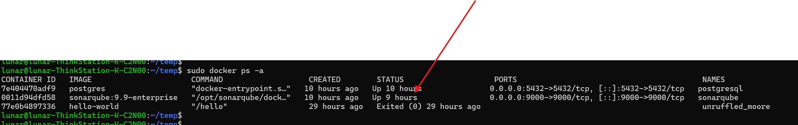

在ubuntu浏览器当中输入http://localhost:9000/ ，默认管理员用户及密码：admin/admin。
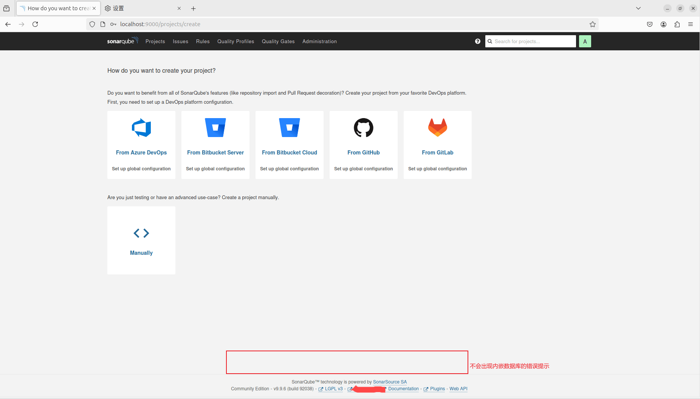

### SonarQube汉化插件安装

进入到插件商城，搜索插件`chinese`，按下面操作进入到插件主页进行下载：

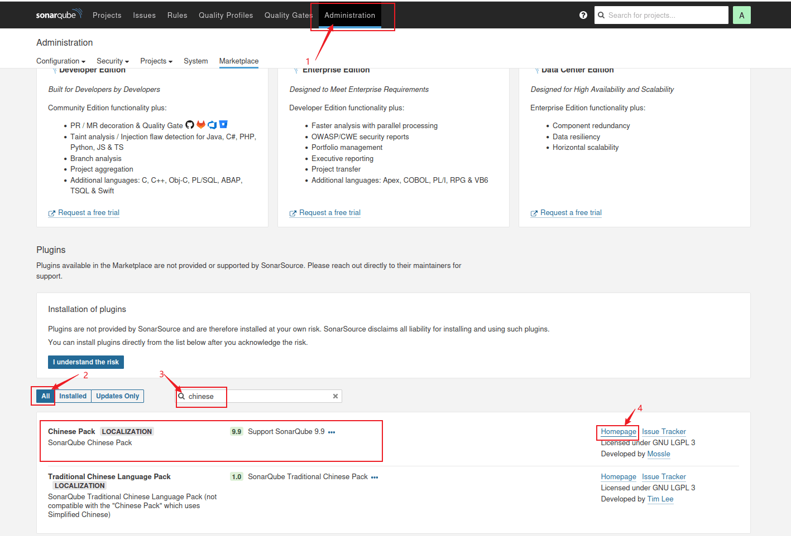

进入汉化github插件仓库，进入标签发布页，找到9.9版本的中文插件，点击即可下载：

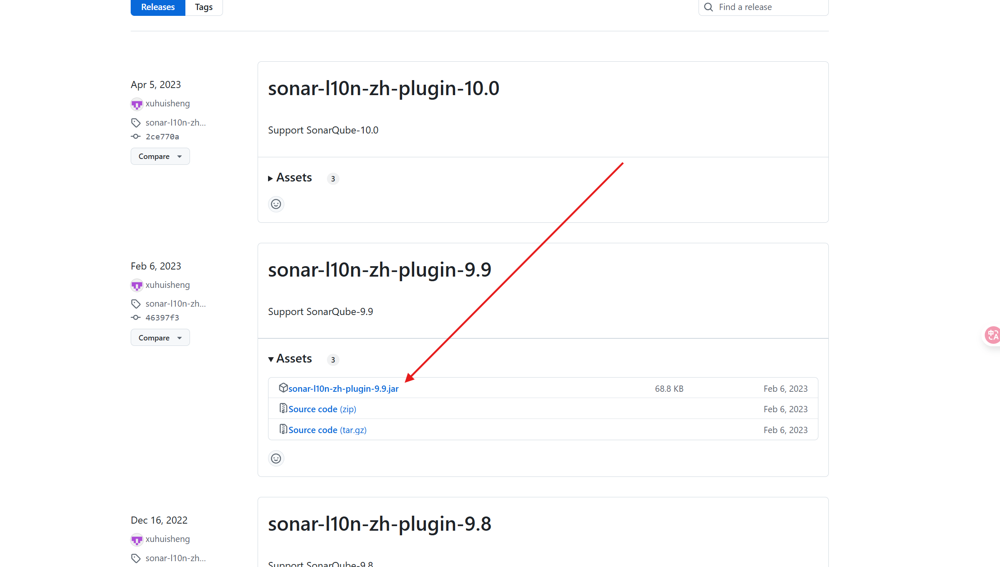

下载完成后，将插件拷贝到主机的/opt/sonarqube/extensions/plugins目录下（**plugins目录需要手动创建**），再次重启sonarqube容器，重新登录http://localhost:9000/，可以看到提示变成了中文，说明我们的插件安装成功了！

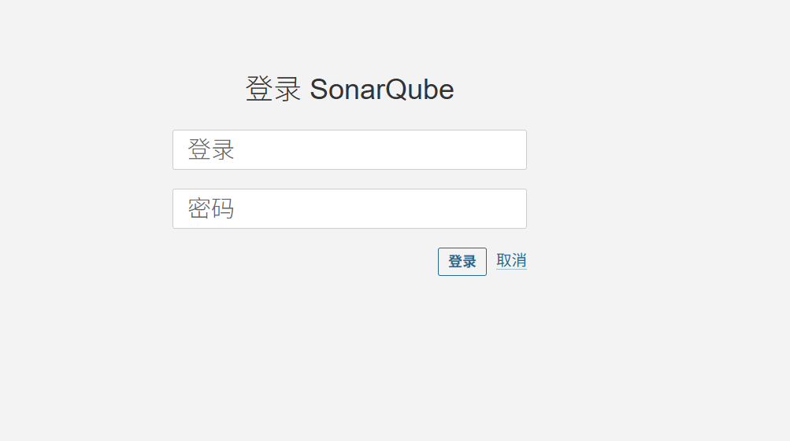

## 破解

破解参考博客：[https://dashenxian.github.io/post/SonarQube%E7%A0%B4%E8%A7%A3](https://dashenxian.github.io/post/SonarQube%E7%A0%B4%E8%A7%A3)

### 生成license

将如下这段信息全部复制，然后进行base64加密就是license的内容：

```bash
Company=Unknown
Digest=NotRequired
Edition=Enterprise
EditionLabel=Enterprise
Expiration=2099-01-01
MaxLoc=9223372036854775806
Plugins=abap,cpp,plsql,security,sonarapex,swift,tsql,vbnet,cobol,pli,rpg,vb
Features=*
ServerId=*
Support=false
Type=ny0c
```

同理，如果是开发版，只需将Enterprise替换为Developer。

Base64转换如下：

```bash
Q29tcGFueT1Vbmtub3duCkRpZ2VzdD1Ob3RSZXF1aXJlZApFZGl0aW9uPUVudGVycHJpc2UKRWRpdGlvbkxhYmVsPUVudGVycHJpc2UKRXhwaXJhdGlvbj0yMDk5LTAxLTAxCk1heExvYz05MjIzMzcyMDM2ODU0Nzc1ODA2ClBsdWdpbnM9YWJhcCxjcHAscGxzcWwsc2VjdXJpdHksc29uYXJhcGV4LHN3aWZ0LHRzcWwsdmJuZXQsY29ib2wscGxpLHJwZyx2YgpGZWF0dXJlcz0qClNlcnZlcklkPSoKU3VwcG9ydD1mYWxzZQpUeXBlPW55MGM=
```

### 配置agent

首先下载agent jar包：[SonarQubeAgent-1.2-SNAPSHOT.jar。](https://dashenxian.github.io/static/posts/2023/2023-12-19-SonarQube%E7%A0%B4%E8%A7%A3-SonarQubeAgent-1.2-SNAPSHOT.jar)

使用docker命令，将下载好的agent jar包拷贝到容器当中，这里为方便，我直接拷贝到根目录下面。：

```bash
docker cp ./SonarQubeAgent-1.2-SNAPSHOT.jar sonarqube:9.9-enterprise:/
```

在sonarqube的配置文件conf/sonar.properties（**sonar.properties文件需要手动创建**），里面新增如下内容：

```txt
sonar.web.javaOpts=-javaagent:/SonarQubeAgent-1.2-SNAPSHOT.jar -Xmx1G -Xms128m -XX:+HeapDumpOnOutOfMemoryError
sonar.ce.javaOpts=-javaagent:/SonarQubeAgent-1.2-SNAPSHOT.jar -Xmx2G -Xms128m -XX:+HeapDumpOnOutOfMemoryError
```

重启sonarqube容器，然后License Manager当中填入上文获取的证书即可：

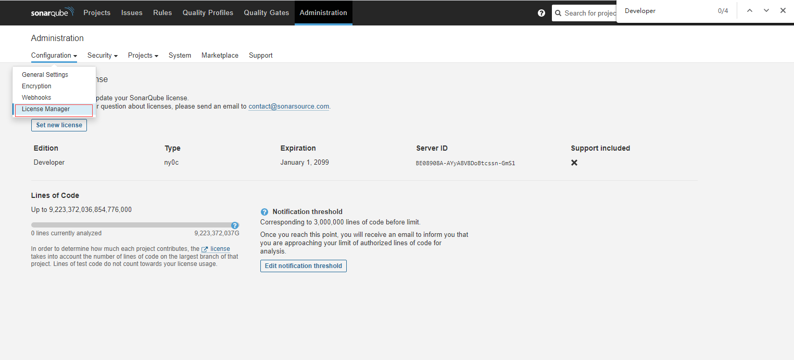

## 使用

这里主要叙述手工代码审查的步骤：

1. 主页右上角 -> 新增项目 -> 手工

    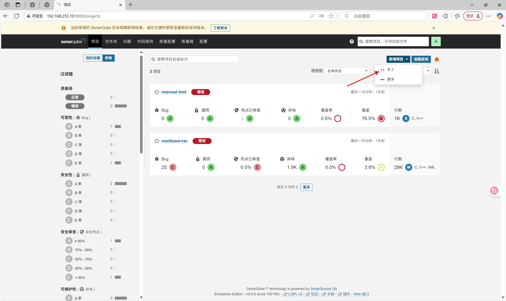

2. 按需填写显示名和项目标识符：

    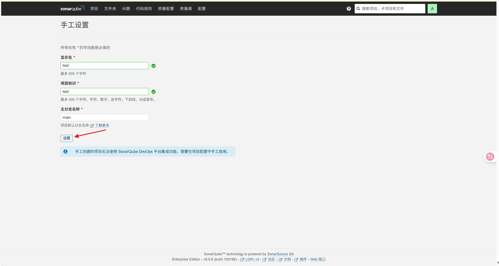

3. 选择本地：

    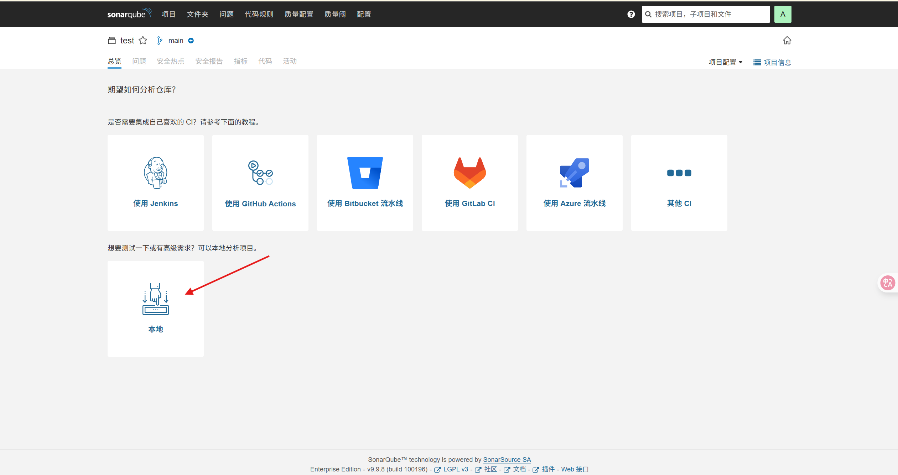

4. （按需）将令牌修改为永不过期：

    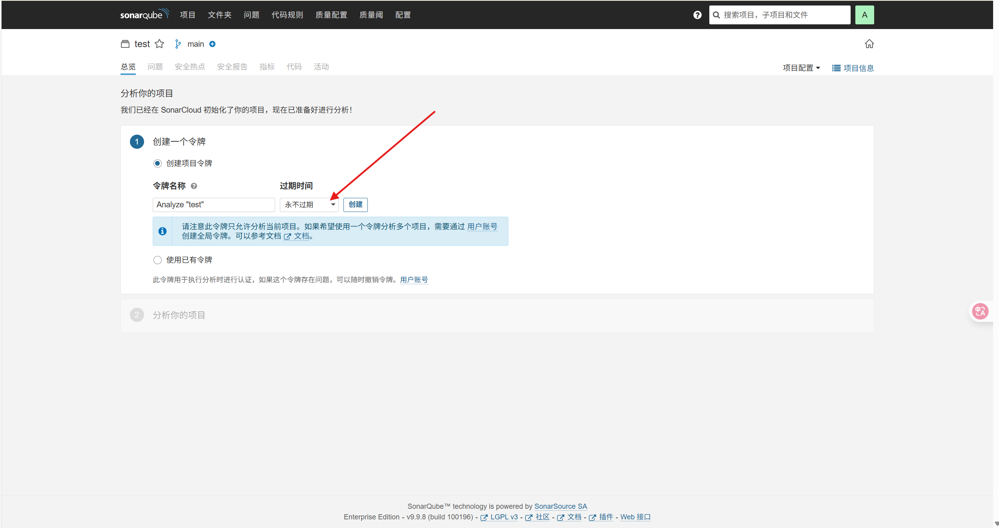

5. 记住这个令牌：

    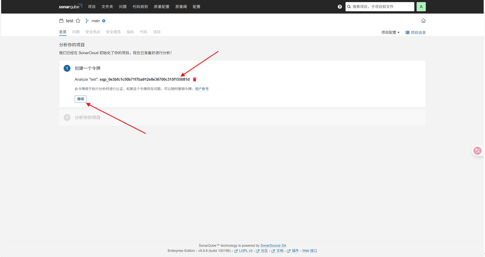

6. 选择C，C++或ObjC -> Linux，下面会出现下载必要的应用包、扫描器以及在项目当中扫描器的使用教程，相关步骤代码如下：

    （**注意下面这些配置都是属于客户主机的配置，即你所要审查的项目代码所在的那台主机**）应用包、扫描器的安装以及环境变量的配置：

    ```bash
    curl --create-dirs -sSLo $HOME/.sonar/build-wrapper-linux-x86.zip http://192.168.0.135:9000/static/cpp/build-wrapper-linux-x86.zip
    unzip -o $HOME/.sonar/build-wrapper-linux-x86.zip -d $HOME/.sonar/

    export PATH=$HOME/.sonar/build-wrapper-linux-x86:$PATH
    export SONAR_SCANNER_VERSION=4.7.0.2747
    export SONAR_SCANNER_HOME=$HOME/.sonar/sonar-scanner-$SONAR_SCANNER_VERSION-linux

    curl --create-dirs -sSLo $HOME/.sonar/sonar-scanner.zip https://binaries.sonarsource.com/Distribution/sonar-scanner-cli/sonar-scanner-cli-$SONAR_SCANNER_VERSION-linux.zip
    unzip -o $HOME/.sonar/sonar-scanner.zip -d $HOME/.sonar/

    export PATH=$SONAR_SCANNER_HOME/bin:$PATH
    export SONAR_SCANNER_OPTS="-server"

    export SONAR_TOKEN=sqp_0e3bfc1c50b71f7ba912e8e36700c315f155081d
    ```

    **其中ip地址以及令牌根据实际情况填写！**

    - 在独立的cmake项目当中使用sonarqube：

        项目结构如下：

        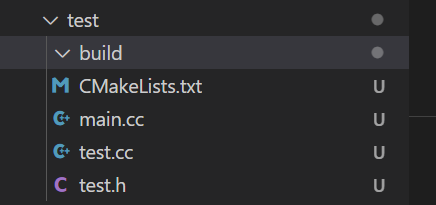

        进入build目录，执行`cmake ..`，然后执行如下命令进行编译：

        ```bash
        cd build
        build-wrapper-linux-x86-64 --out-dir bw-output make
        ```

        执行完成后会在build目录下生成一个bw-output目录，里面比较重要的是build-wrapper-dump.json文件，如果你看到该文件生成了很多配置（大几十行），说明你的配置是正确的，否则如果只有少数几行，说明配置存在问题，需要查看是否有步骤缺失。`build-wrapper-linux-x86-64`命令实际上会hook住编译器，从而获取项目当中各个源文件以及其依赖关系。接下来的`sonar-scanner`命令才是真正执行代码审查的主体。

        然后回到项目根目录，使用扫描器进行代码审查，分析结果会传到sonarqube所属项目当中：

        ```bash
        cd ..
        sonar-scanner \
        -Dsonar.projectKey=test \
        -Dsonar.sources=. \
        -Dsonar.cfamily.build-wrapper-output=build/bw-output \
        -Dsonar.host.url=http://192.168.0.135:9000 \
        -Dsonar.login=sqp_0e3bfc1c50b71f7ba912e8e36700c315f155081d
        ```

        这里主要关注这两个参数：

            - -Dsonar.cfamily.build-wrapper-output：build-wrapper-linux-x86-64命令生成配置文件路径。
            - -Dsonar.sources：源码根路径

        步骤如下：

        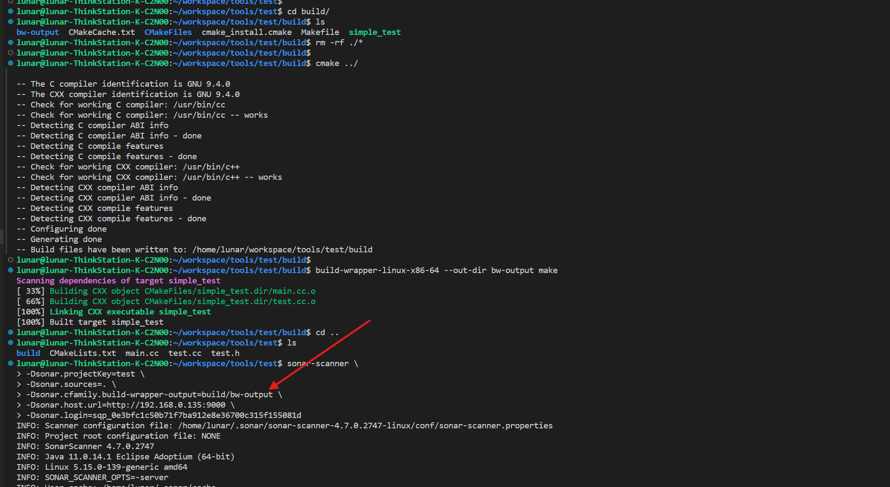

        等待执行完成后，输出：

        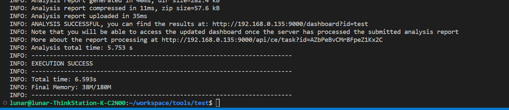

        此时同样的会在项目根目录产生一个配置目录：.scannerwork，结合上述，现在项目结构为：

        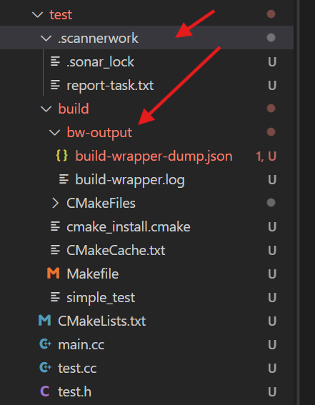

        在sonarqube网页上可以看到分析结果：

        

    - 在buildroot项目当中使用sonarqube：

        有了cmake项目使用sonarqube的经验，buildroot项目其实也类似，高度重复的部分会直接省略：

        首先是环境变量的配置，参考步骤6的开头部分，然后是使用build-wrapper-linux-x86-64命令对buildroot包进行编译，并自动创建bw-output，这里以编译mediaserver为例：

        ```bash
        # 更换项目令牌
        export SONAR_TOKEN=sqp_60cd6b366e2852a5fdb5f7629c5e6c73b6c94d6c
        build-wrapper-linux-x86-64 --out-dir bw-output make mediaserver
        ```

        在buildroot下生成了bw-output目录：

        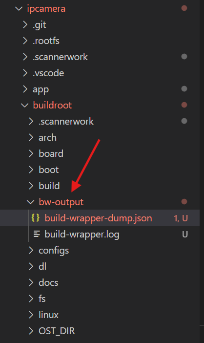

        进入到buildroot/output/dc_rv1126_ipc/build/mediaserver/目录（合理修改`-Dsonar.sources`、`-Dsonar.cfamily.build-wrapper-output`参数路径可以无需cd来cd去，前者代表源码根路径，后者代表执行`build-wrapper-linux-x86-64`命令时所指定的--out-dir的目录路径），执行如下代码：

        ```bash
        sonar-scanner \
        -Dsonar.projectKey=mediaserver \
        -Dsonar.sources=. \
        -Dsonar.cfamily.build-wrapper-output=../../../../bw-output \
        -Dsonar.host.url=http://192.168.0.135:9000 \
        -Dsonar.login=sqp_60cd6b366e2852a5fdb5f7629c5e6c73b6c94d6c \
        -Dsonar.scm.disabled=true \
        -Dsonar.scm.exclusions.disabled=true
        ```

        结果如下：

        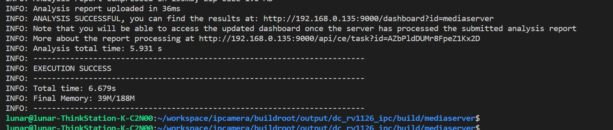

        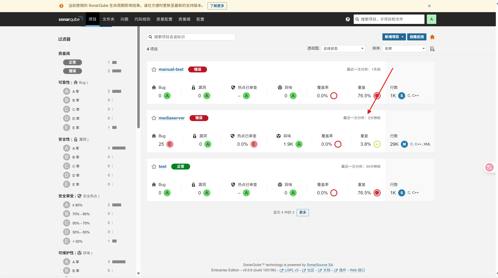

---

**本章完结**