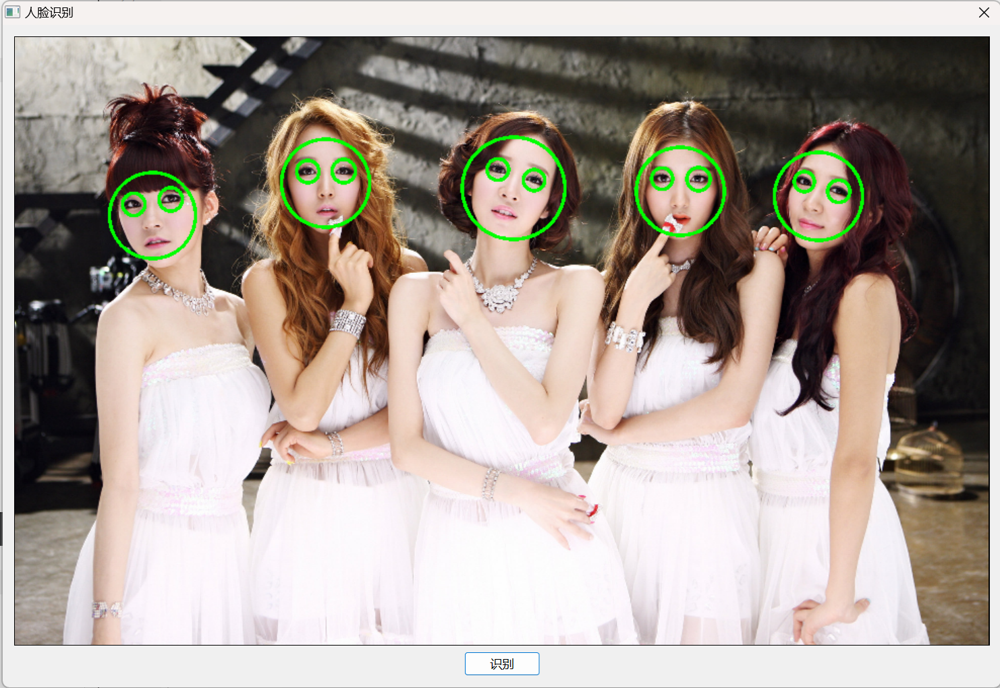

## 编译出错记录

### 背景

因为主要使用qt，并且官网下载的win版本的编译好的opencv默认是vc的，所以我们需要自己下载opencv的源码使用mingw自行编译，我直接使用的vscode。

**报错**

报错如下：

```
Fatal error: can't write 9 bytes to section ... file too big
```
<!-- more -->

参考github上opencv项目的[issue](https://github.com/opencv/opencv/issues/13546)，解决方案如下：

先按常规动作编译一下，然后在生成的build目录中，向cmake的中间文件：CMakeFiles\3.27.2-msvc1\CMakeCXXCompiler.cmake文件（其中3.27.2-msvc1目录名可能会有所不同，找同样带数字的就可以了）追加一行cmake代码：

> set(CMAKE_CXX_FLAGS ${CMAKE_CXX_FLAGS} "-O3")

错误即可解除。

**安装**

找了很久通过vscode按钮自定义安装路径的方法，没有找到。。。

于是还是顺从使用linux的习惯，使用终端通过命令进行编译OpenCV命令如下：

```
mkdir build && cd build
cmake -DCMAKE_BUILD_TYPE=Release -DCMAKE_INSTALL_PREFIX=D:/DevelopmentToolRoot/Library/OpenCV ..
# 更改cmake生成的cmake中间文件，防止报错
# 添加内容：set(CMAKE_CXX_FLAGS ${CMAKE_CXX_FLAGS} "-O3")
...
make -j4 && make install
```

cmake的-DCMAKE_INSTALL_PREFIX选项也是查了很久，最开始是在生成的makefile发现生成的`make install`的实现如下：

```makefile
# Special rule for the target install
install: preinstall
	@$(CMAKE_COMMAND) -E cmake_echo_color "--switch=$(COLOR)" --cyan "Install the project..."
	D:\DevelopmentToolRoot\Complier\VS2022\Root\Common7\IDE\CommonExtensions\Microsoft\CMake\CMake\bin\cmake.exe -P cmake_install.cmake
.PHONY : install
```

显然，执行安装时会执行cmake_install.cmake文件，通过查看文件中的内容发现真正影响安装路径的是CMAKE_INSTALL_PREFIX，然后继续反向查找，在项目CMakeLists.txt文件中发现，有段判断CMAKE_INSTALL_PREFIX是否初始化的代码：

```cmake
if(CMAKE_INSTALL_PREFIX_INITIALIZED_TO_DEFAULT)  # https://cmake.org/cmake/help/latest/variable/CMAKE_INSTALL_PREFIX_INITIALIZED_TO_DEFAULT.html
  if(NOT CMAKE_TOOLCHAIN_FILE)
    if(WIN32)
      set(CMAKE_INSTALL_PREFIX "${CMAKE_BINARY_DIR}/install" CACHE PATH "Installation Directory" FORCE)
    else()
      set(CMAKE_INSTALL_PREFIX "/usr/local" CACHE PATH "Installation Directory" FORCE)
    endif()
  else()
    # any cross-compiling
    set(CMAKE_INSTALL_PREFIX "${CMAKE_BINARY_DIR}/install" CACHE PATH "Installation Directory" FORCE)
  endif()
endif()
```
可见，如果在使用cmake时用户没有设置CMAKE_INSTALL_PREFIX，系统会默认安装路径为build/install目录下。

注意添加环境变量。

如果在qt中使用opencv的时候有报错：无法定位程序入口点...。

试着将mingw/bin目录下的libstdc++-6动态库复制到C:\Windows\System32下。

**如果还报错，直接在网上找别人编译好的库吧，自己编译太麻烦了，也没有必要浪费时间。推荐直接下载的链接：[https://github.com/huihut/OpenCV-MinGW-Build?tab=readme-ov-file](https://github.com/huihut/OpenCV-MinGW-Build?tab=readme-ov-file)。**

## QT + Opencv图片人脸识别小demo

1. QT.pro文件添加opencv的include文件和静态库文件的配置，如下：

    ```qt
    INCLUDEPATH += D:\DevelopmentToolRoot\Library\OpenCV\OpenCV-MinGW-Build-OpenCV-3.4.8-x64\OpenCV-MinGW-Build-OpenCV-3.4.8-x64\include
    LIBS += D:\DevelopmentToolRoot\Library\OpenCV\OpenCV-MinGW-Build-OpenCV-3.4.8-x64\OpenCV-MinGW-Build-OpenCV-3.4.8-x64\x64\mingw\lib\libopencv_*.a
    ```

    具体路径和你opencv安装路径有关，相对路径是：OpenCV/include、OpenCV/x64/mingw/lib/libopencv_*.a。

2. 另外还需要，将OpenCV/etc下的haarcascade_eye_tree_eyeglasses.xml和haarcascade_frontalface_alt.xml文件拷贝到qt工程目录的根目录下。

QT代码如下：

```cpp
// ...
#include <opencv2/opencv.hpp>
using namespace cv;

class FaceDialog : public QDialog
{
    Q_OBJECT

public:
    FaceDialog(QWidget *parent = nullptr);
    ~FaceDialog();

private slots:
    void on_m_btnRecognize_clicked();

private:
    Ui::FaceDialog *ui;
    Mat m_image;
};


FaceDialog::FaceDialog(QWidget *parent)
    : QDialog(parent)
    , ui(new Ui::FaceDialog)
{
    ui->setupUi(this);

    cvtColor(imread(QString("C:/Users/root/Desktop/Face/tahiti.jpg").toLatin1().data()),
        m_image, COLOR_BGR2RGB);

    ui->m_labImage->resize(m_image.cols / 2, m_image.rows / 2);
    setWindowFlag(Qt::MSWindowsFixedSizeDialogHint);

    ui->m_labImage->setPixmap(QPixmap::fromImage(QImage(
        m_image.data, m_image.cols, m_image.rows,
        QImage::Format_RGB888).scaled(ui->m_labImage->size(),
        Qt::KeepAspectRatio)));
}

FaceDialog::~FaceDialog()
{
    delete ui;
}

void FaceDialog::on_m_btnRecognize_clicked()
{
    // 人脸分类器
    CascadeClassifier faceClassifier;
    faceClassifier.load("C:/Users/root/Desktop/Face/haarcascade_frontalface_alt.xml");
    // 眼睛分类器
    CascadeClassifier eyesClassifier;
    eyesClassifier.load("C:/Users/root/Desktop/Face/haarcascade_eye_tree_eyeglasses.xml");

    // 灰度图
    Mat gray;
    cvtColor(m_image, gray, COLOR_RGB2GRAY);
    equalizeHist(gray, gray); // 直方图均衡化亮度增强

    Mat canvas = m_image.clone(); // 用于输出识别结果的图像

    vector<Rect> faces; // 存放多张人脸矩形的向量
    faceClassifier.detectMultiScale(gray, faces); // 人脸识别
    for (Rect const& face : faces) // 遍历每一张人脸的包络矩形
    {
        // 绘制人脸包络矩形的内切椭圆
        // 第三个参数表示椭圆长半轴和短半轴
        ellipse(canvas,
            Point(face.x + face.width / 2,
                  face.y + face.height / 2),
            Size(face.width / 2, face.height / 2),
            0, 0, 360, Scalar(0, 255, 0), 6, 8, 0);

        vector<Rect> eyes; // 存放多只眼睛矩形的向量
        eyesClassifier.detectMultiScale(gray(face), eyes); // 眼睛识别
        for (Rect const& eye : eyes) // 遍历每一只眼睛的包络矩形
            // 绘制眼睛包络矩形的内切椭圆
            ellipse(canvas,
                Point(face.x + eye.x + eye.width / 2,
                      face.y + eye.y + eye.height / 2),
                Size(eye.width / 2, eye.height / 2),
                0, 0, 360, Scalar(0, 255, 0), 6, 8, 0);
    }

    ui->m_labImage->setPixmap(QPixmap::fromImage(QImage(
        canvas.data, canvas.cols, canvas.rows,
        QImage::Format_RGB888).scaled(ui->m_labImage->size(),
        Qt::KeepAspectRatio)));
}
```

程序结果如下：

输入图片：


输出图片：



---

**本章完结**