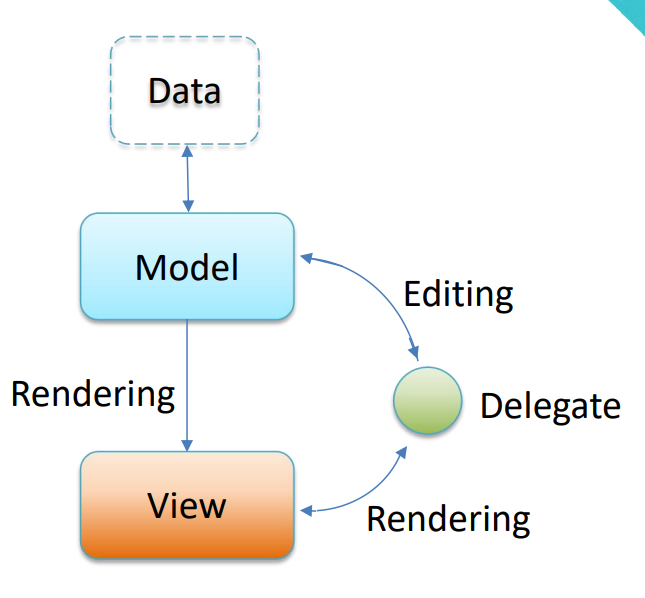
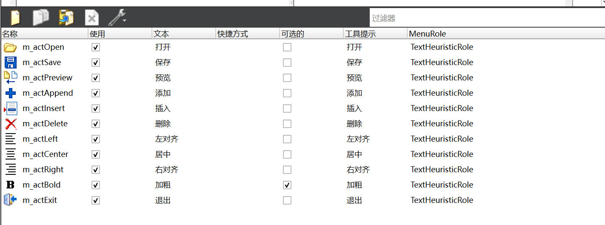
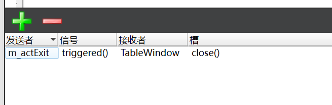
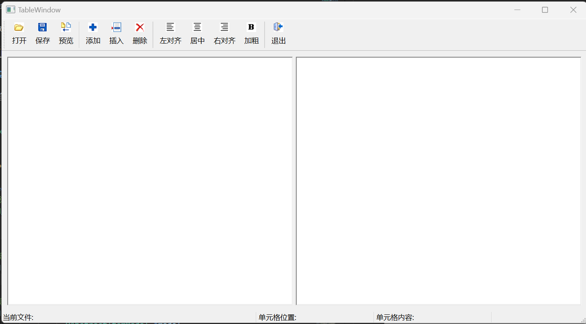
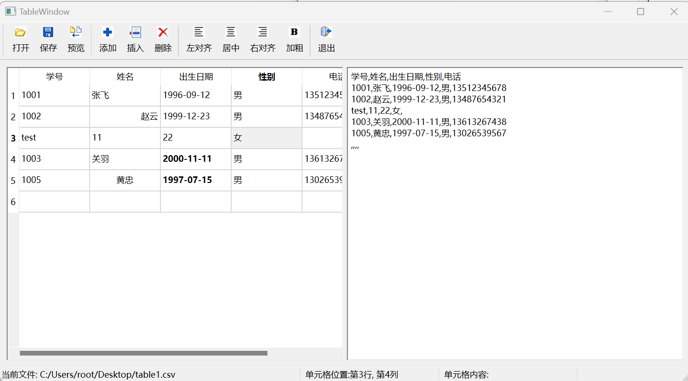

## 关于MV架构的简单介绍

在Qt框架中，代理（Delegate）、模型（Model）和视图（View）之间的关系构成了MVVM（Model-View-ViewModel）架构的一部分，尽管Qt通常使用Model-View架构。这三者之间的关系可以这样理解：

**1. Model（模型）**

Model是数据的核心代表，它负责存储和管理应用程序的数据。Model提供了数据的接口，允许View查询和修改数据。Model与View的交互是通过信号和槽机制来完成的，当Model中的数据发生变化时，它会发出信号通知View进行更新。

**2. View（视图）**

View是Model数据的展示层，它负责将数据以用户友好的形式展示出来，并接收用户的交互操作。在Qt中，View通常是通过一些控件来实现的，比如QListView、QTableView、QTreeView等。View不处理数据的逻辑，它只是简单地展示Model提供的数据。

**3. Delegate（代理）**
<!-- more -->

Delegate位于Model和View之间，充当了一个中介的角色。它允许开发者为View中的每个项创建自定义的编辑器或显示组件。代理的作用是处理View中的项的创建、显示和编辑。当用户与View交互时，代理负责将用户的输入转换为对Model的修改，同时也负责将Model的数据转换为View中的显示形式。

**代理、模型和视图之间的关系**

Model与View：Model和View之间通过数据接口进行交互。Model提供数据，View展示数据。Model通过信号通知View数据的变化，View通过槽来响应这些信号并更新显示。

Model与Delegate：Model提供了数据的接口，而Delegate负责将这些数据以特定方式显示在View中。Delegate从Model获取数据，并将其转换为用户可以理解的形式。

View与Delegate：View使用Delegate来创建和管理每个项的显示和编辑。Delegate为View中的项提供自定义的外观和行为，使得View可以展示复杂的数据项。

Delegate作为中介：Delegate作为Model和View之间的中介，它处理用户的输入并将这些输入转换为对Model的操作。同时，它也负责将Model的数据格式化并展示在View中。

**需要注意的是，MV架构中，默认的代理使用的是单行文本框！**



## UI设计

本博客需要的资源[链接](https://pan.baidu.com/s/1Yd0X1r_JTKfT6bP1HeLS2A )。提取码：14ml。

0. 创建项目，选择QMainWindow作为主窗口的基类。主窗口名为：TableWindow。

1. 为项目添加一个资源文件，将项目用到的图标引用到资源文件中。

2. 双击ui文件，移除菜单栏，添加工具栏，保留状态栏。添加数个QAction，如下图：

    

3. 界面设计：

    | 控件名 | bjectname | frameShape | frameShadow | readOnly |
    | -     | - | - | - | - |
    |  QTableView | m_table | winpanel | sunken | \ |
    |  QPlainTextEdit | m_edit | winpanel | sunken | √ |

4. 系统信号和系统槽的连接：

    

5. 系统信号和自定义槽的连接（鼠标右击创建的QAction，选择转到槽）：

    | QAction | 要连接的信号 |
    | - | - |
    | 加粗 | triggered(bool) |
    | 其余的QAction（除退出外） | triggered() |

整体效果如下：



## 功能实现

添加一个自定义代理类，类名为ComboBoxDelegate，基类为：QStyledItemDelegate

```cpp
class ComboBoxDelegate : public QStyledItemDelegate
{
public:
    ComboBoxDelegate();

protected:
    // 创建一个编辑框
    QWidget * createEditor(QWidget *parent,
                           const QStyleOptionViewItem &option,
                           const QModelIndex &index) const override;

    // 将模型中指定索引位置的数据设置到编辑框组件中
    void setEditorData(QWidget *editor,
                       const QModelIndex &index) const override;

    // 将编辑框中的数据放回到模型中
    void setModelData(QWidget *editor,
                      QAbstractItemModel *model,
                      const QModelIndex &index) const override;

    // 根据视图的样式调整编辑组件的几何形状
    void updateEditorGeometry(QWidget *editor,
                              const QStyleOptionViewItem &option,
                              const QModelIndex &index) const override;
};


ComboBoxDelegate::ComboBoxDelegate()
{

}

/*
 *  1.创建一个编辑框
 *  参数:
 *      参数1 - 新创建的编辑器的父部件
 *      参数2 - 渲染视图的样式选项
 *      参数3 - 要编辑位置的模型索引
*/
QWidget * ComboBoxDelegate::createEditor(QWidget *parent,
                       const QStyleOptionViewItem &option,
                       const QModelIndex &index) const
{
    Q_UNUSED(option);
    Q_UNUSED(index);

    QComboBox* editor = new QComboBox(parent );
    editor->addItem("男");
    editor->addItem("女");

    return editor;
}

/*
 *  1.将模型中的数据放到编辑框中
 *      参数1:编辑组件
 *      参数2:需要设置数据的模型索引
 *
 *  创建的组件是QComboBox - 给的是QWidget
 */
void ComboBoxDelegate::setEditorData(QWidget *editor,
                   const QModelIndex &index) const
{
    static_cast<QComboBox*>(editor)->setCurrentText(
                index.model()->data(index, Qt::EditRole).toString());
}

/*
    1.将编辑框中的数据给到模型
*/
void ComboBoxDelegate::setModelData(QWidget *editor,
                  QAbstractItemModel *model,
                  const QModelIndex &index) const
{
    // index - 将数据放到模型的哪个位置
    model->setData(index,
                   static_cast<QComboBox*>(editor)->currentText(),
                   Qt::EditRole);
}

void ComboBoxDelegate::updateEditorGeometry(QWidget *editor,
                          const QStyleOptionViewItem &option,
                          const QModelIndex &index) const
{
    Q_UNUSED(index);

    editor->setGeometry(option.rect);
}
```

在TableWindow类中，添加Model、和标签，此外手动添加一个m_selection成员的currentChanged信号的槽函数。定义如下：

```cpp
class TableWindow : public QMainWindow
{
    Q_OBJECT

private slots:
/*
    ...
*/
    // item选择发生了改变
    void on_m_selection_currentChanged(const QModelIndex &current,
                                        const QModelIndex &previous);
private:
    void  initModel(QStringList const& strings);

    Ui::TableWindow *ui;

    QLabel* m_labCurFile;   // 状态栏显示信息
    QLabel* m_labCellPos;   // 状态栏显示信息
    QLabel* m_labCellText;  // 状态栏显示信息

    QStandardItemModel* m_model;
    QItemSelectionModel* m_selection;

};
```

TableWindow的构造函数实现如下：

```cpp
TableWindow::TableWindow(QWidget *parent)
    : QMainWindow(parent)
    , ui(new Ui::TableWindow)
    , m_labCurFile(new QLabel("当前文件: "))
    , m_labCellPos(new QLabel("单元格位置: "))
    , m_labCellText(new QLabel("单元格内容: "))
    , m_model(new QStandardItemModel(this))
    , m_selection(new QItemSelectionModel(m_model))
{
    ui->setupUi(this);

    m_labCurFile->setMinimumWidth(420);
    ui->statusBar->addWidget(m_labCurFile);
    m_labCellPos->setMinimumWidth(190);
    ui->statusBar->addWidget(m_labCellPos);
    m_labCellText->setMinimumWidth(190);
    ui->statusBar->addWidget(m_labCellText);

    ui->m_table->setModel(m_model); // view和model的绑定
    ui->m_table->setSelectionModel(m_selection);

    connect(m_selection,SIGNAL(currentChanged(QModelIndex,QModelIndex)),
            this, SLOT(on_m_selection_currentChanged(QModelIndex,QModelIndex)));
    // 默认代理是一个编辑框。 
    // 添加一个自定义代理
    // 选择对于某一列的数据添加自定义代理
    ui->m_table->setItemDelegateForColumn(3, new ComboBoxDelegate);
}
```

加粗的实现：

```cpp
// 加粗Action的槽函数
void TableWindow::on_m_actBold_triggered(bool checked)
{
    // selectedIndexes - 获取所有的选中的项的索引
    for(QModelIndex const& index :
        m_selection->selectedIndexes()){
        QStandardItem* item = m_model->itemFromIndex(index);
        QFont font = item->font();// 获取该item的字体
        font.setBold(checked);
        item->setFont(font);
    }
}
```

打开文件的实现：

```cpp
// 打开Action的槽函数
void TableWindow::on_m_actOpen_triggered()
{
    // 1.获取文件的路径
    QString path = QFileDialog::getOpenFileName(this, "打开",
                       QCoreApplication::applicationDirPath(),
                        "逗号分隔符文件(*.csv);;所有文件(*.*)");
    if(path.isEmpty())
        return;
    //2.打开文件
    // 构造一个QFile对象表示的就是path所指向的文件
    QFile file(path);
    // 打开file指向的文件 - 以只读和文本模式打开该文件
    if(!file.open(QIODevice::ReadOnly | QIODevice::Text))
        return;
    // 3.读取文件
    QTextStream stream(&file);// 构建文本流对象, 关联已经打开的文件
    //  stream.setCodec("utf-8");

    QStringList strings;
    // readLine - 读一行  atEnd - 文件末尾
    // 将数据读出来后 - 放到strings列表中
    while(!stream.atEnd())
        strings.append(stream.readLine());

    file.close();
    initModel(strings);

    m_labCurFile->setText("当前文件: " + path);
}

void  TableWindow::initModel(QStringList const& strings)
{
    m_model->clear();

    // 1.strings.at(0)   获取的是strings字符串列表中的第一个字符串
    // 设置列的标题 - 参数1:使用逗号将数据分割, 参数2:忽略空字符串
    // 将分割后的字符串作为列的标题
    m_model->setHorizontalHeaderLabels(
                    strings.at(0).split(",", Qt::SkipEmptyParts));

    // 2.填充数据 - 填充n-1次
    // values = 1001 张飞 1996-09-12 男 13512345678
    // 2.3.根据列数获取要循环放入数据的次数
    int rowCount = strings.count() - 1;
    for(int row = 0; row < rowCount; row++){
        QStringList values = strings.at(row + 1).split(",",
                                                       Qt::SkipEmptyParts);
        int columnCount = values.size();
        for(int column = 0; column < columnCount; column++){
            m_model->setItem(row, column,
                             new QStandardItem(values.at(column)));
        }
    }

    m_selection->setCurrentIndex(
                m_model->index(0,0), QItemSelectionModel::Select);
}
```

保存的实现：

```cpp
//  保存Action对应的槽函数
void TableWindow::on_m_actSave_triggered()
{
    // 1.获取保存文件路径
    QString path = QFileDialog::getSaveFileName(this, "保存",
                       QCoreApplication::applicationDirPath(),
                        "逗号分隔符文件(*.csv);;所有文件(*.*)");
    if(path.isEmpty())
        return;
    // 2.打开文件
    // 构造一个QFile对象表示的就是path所指向的文件
    QFile file(path);
    // 打开file指向的文件 - 以可读可写和文本模式  + 清空原文件打开该文件
    if(!file.open(QIODevice::ReadWrite | QIODevice::Text | QIODevice::Truncate))
        return;
    // 3.写入文件
    QTextStream stream(&file);// 构建文本流对象, 关联已经打开的文件
    //  stream.setCodec("utf-8");

    // 4.写入列标题
    // 学号  姓名  出生日期  性别  电话
    // 循环遍历模型的列 逐列写入标题到文件中
    int columnCount = m_model->columnCount();
    for(int col = 0; col < columnCount; col++){
        stream << m_model->horizontalHeaderItem(col)->text() <<
                  (col == columnCount - 1 ? "\n" : ",");
    }

    // 5.写入数据行
    int rowCount = m_model->rowCount();
    for(int row = 0; row < rowCount; row++)
    {
        for(int col = 0; col < columnCount; col++)
        {
            stream << m_model->item(row, col)->text() <<
                      (col == columnCount - 1 ? "\n" : ",");
        }
    }

    // 6.关闭文件
    file.close();
}
```

预览的实现：

```cpp
//预览Action对应的槽函数
void TableWindow::on_m_actPreview_triggered()
{
    // 1.清空QPlainTextEdit内容
    ui->m_edit->clear();

    // 2.显示列标题
    QString text;
    int columnCount = m_model->columnCount();
    for(int col = 0; col < columnCount; col++)
    {
        text += m_model->horizontalHeaderItem(col)->text()
                + (col == columnCount - 1 ? "" : ",");
    }
    ui->m_edit->appendPlainText(text);


    // 3.显示数据行
    int rowCount = m_model->rowCount();
    for(int row = 0; row < rowCount; row++)
    {
        QString text;
        for(int col = 0; col < columnCount; col++)
        {
            text += m_model->item(row, col)->text() +
                    (col == columnCount - 1 ? "" : ",");
        }
        ui->m_edit->appendPlainText(text);
    }
}
```

添加的实现：

```cpp
// 添加Action对应的槽函数
void TableWindow::on_m_actAppend_triggered()
{
    // 1.先获取有多少列
    int columnCount = m_model->columnCount();
    if(!columnCount)
        return;

    // 2.创建空数据项
    // 创建新的空数据行 - 需要columnCount个数据项
    QList<QStandardItem*> items;// 用于存储空的数据项
    for(int col = 0; col < columnCount; col++)
        items << new QStandardItem;
    // 3.插入新行
    m_model->insertRow(m_model->rowCount(), items);

    // 4.设置当前选择
    m_selection->clearSelection();
    m_selection->setCurrentIndex(
                m_model->index(m_model->rowCount() -1, 0), QItemSelectionModel::Select);
}
```

插入的实现：

```cpp
// 插入Action对应的槽函数
void TableWindow::on_m_actInsert_triggered()
{
    // 1.先获取有多少列
    int columnCount = m_model->columnCount();
    if(!columnCount)
        return;

    // 2.创建空数据项
    // 创建新的空数据行 - 需要columnCount个数据项
    QList<QStandardItem*> items;// 用于存储空的数据项
    for(int col = 0; col < columnCount; col++)
        items << new QStandardItem;

    // 3.获取当前的模型索引
    QModelIndex current = m_selection->currentIndex();
    m_model->insertRow(current.row(), items);

    // 4.设置当前选择
    m_selection->clearSelection();
    m_selection->setCurrentIndex(current, QItemSelectionModel::Select);
}
```

删除的实现：

```cpp
// 删除Action对应的槽函数
void TableWindow::on_m_actDelete_triggered()
{
    // 1.先获取当前位置的索引
    // 1.1.获取上一行,同一列的位置(上一行, 同一列)
    // 1.2.判断当前行是否是最后一行
    QModelIndex current = m_selection->currentIndex();
    QModelIndex above = m_model->index( current.row() - 1, current.column());
    bool last = current.row() == m_model->rowCount() - 1;

    // 2.移除选中行
    m_model->removeRow(current.row());
    m_selection->setCurrentIndex(last ? above : current,
                                 QItemSelectionModel::Select);
}
```

对齐的实现：

```cpp
// 左对齐Action对应的槽函数
void TableWindow::on_m_actLeft_triggered()
{
    // 1.遍历选中的索引
    for(QModelIndex const& index : m_selection->selectedIndexes())
    {
        m_model->itemFromIndex(index)->setTextAlignment(
                    Qt::AlignLeft | Qt::AlignVCenter);
    }
}
// 中对齐Action对应的槽函数
void TableWindow::on_m_actCenter_triggered()
{
    // 1.遍历选中的索引
    for(QModelIndex const& index : m_selection->selectedIndexes())
    {
        m_model->itemFromIndex(index)->setTextAlignment(
                    Qt::AlignHCenter | Qt::AlignVCenter);
    }
}
// 右对齐Action对应的槽函数
void TableWindow::on_m_actRight_triggered()
{
    // 1.遍历选中的索引
    for(QModelIndex const& index : m_selection->selectedIndexes())
    {
        m_model->itemFromIndex(index)->setTextAlignment(
                    Qt::AlignRight | Qt::AlignVCenter);
    }
}
```

状态栏文本动态变化的实现：

```cpp
// 选择项改变对应的槽函数
void TableWindow::on_m_selection_currentChanged(const QModelIndex &current,
                                                const QModelIndex &previous){
    Q_UNUSED(previous);

    if(!current.isValid())
        return;

    // 添加单元格位置
    m_labCellPos->setText(
                QString(" 单元格位置:第%1行, 第%2列 ").
                arg(current.row() + 1).
                arg(current.column() + 1));
    // 添加单元格内容
    QStandardItem* item = m_model->itemFromIndex(current);
    m_labCellText->setText(" 单元格内容: " + item->text());

    // 检查并更新粗体显示状态
    // item->font().bold() - 判断选中的item的字体是否为 粗体
    ui->m_actBold->setChecked(item->font().bold());
}
```

运行效果如下：



---

**本章完结**