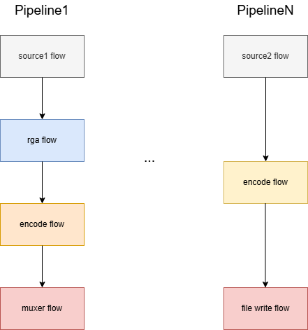

## 什么是Flow？

从字面意思上理解，Flow就是流，在音视频领域，常常就能听到什么视频流、音频流，当然这些都可以统称为数据流。

在RKMedia当中，也存在一套基于Flow（流）的专门处理音视频流的框架。这里面还牵扯pipeline的概念，所谓pipeline就是一条独立的流水线，当每一帧的**原始视频图像（一般是nv12格式）**流入某条流水线后，会经过一些加工处理（比如对原始图像进行缩放、裁剪、编码等），最后输出的这一帧**成品**数据才会被推流到服务器，具体对一帧图像的加工就是由Flow负责，当然RKMedia把流水线思想用的特别精妙，因为加工也会分很多工序，所以对应的Flow的派生类也会分很多种。每种flow分工明确，只关注自己应该对图像的那一小部分工序，然后就把加工后的图像传递给下一级flow。

这里贴一张图，方便理解pipeline和Flow：



source flow会从相机当中读取图像数据。
<!-- more -->

rga对图像进行缩放。

encode对对图像进行编码。

muxer flow会将音视频进行一个再封装。然后推流到服务器。

## Flow上下级如何交互的？

首先是有一个pipeline和flow的配置文件，配置文件描述了有几条pipeline，以及每条pipeline内部flow节点之间是什么关系，还有flow内部初始化必要的参数。

在我们的项目中，主要使用的是：ipcamera/app/mediaserver/src/conf/dc-rv1126-ipc/ipc-yuyv.conf。要添加一个flow节点首先就需要在此配置文件中定义一下flow必要的属性。

截取部分配置如下：

```json
{
    "Pipe_0": {
        "Flow_0": {
            "flow_index": {
                "flow_index_name": "source_0",
                "flow_type": "source",
                "stream_id": "0",
                "stream_type": "camera",
                "upflow_index_name": "none"
            },
            "flow_name": "source_stream_mipi",
            "flow_param": {
                "name": "v4l2_capture_stream"
            },
            "stream_param": {
                "device": "rkispp_m_bypass",
                "frame_num": "6",
                "height": "1520",
                "output_data_type": "image:nv12",
                "use_libv4l2": "1",
                "v4l2_capture_type": "VIDEO_CAPTURE",
                "v4l2_mem_type": "MEMORY_DMABUF",
                "virtual_height": "1520",
                "virtual_width": "2688",
                "width": "2688"
            }
        },

        // ...
    },
	"Pipe_1": {
        // ...
    },
    // ...
}

```

在app下的Mediaserver中，flowmanager会根据配置文件中的flow_name的值通过反射创建具体的flow对象。每个flow的派生类都会在其构造函数中调用父类的Flow::InstallSlotMap方法去**创建输入槽和输出槽**，这两种槽可以简单理解为输入缓冲池和输出缓存池。

flowmanager在创建flow后会对flow进行初始化，此时会根据配置文件所描述的flow之间的上下级关系来调用上级的Flow::AddDownFlow，将**父级的输出槽和子级Flow做绑定**。将来，父级flow调用Flow::SetOutput可将处理后的图像数据传递给子级的flow。

这里补充一个细节：在调用Flow::InstallSlotMap方法时，除了槽的描述信息之外，还会向flow注册一个回调函数，该回调函数就是flow处理流进来的图像的核心函数，对于flow_type为io的flow，会在该回调函数的结尾调用Flow::SetOutput，最后会导致加工后的图像流向下一级flow。

于此，我们就有了向rkmedia添加flow节点的思路。

## 在项目中添加Flow的流程

事先声明一下，为方便，我这里直接添加了一个flow_type为sink的flow，添加io类型的flow其实同理。

### 修改配置文件

在配置文件ipcamera/app/mediaserver/src/conf/dc-rv1126-ipc/ipc-yuyv.conf，Pipe_0最后添加一个flow节点，配置如下：

```json
{
    "Pipe_0": {
        // ...

        "Flow_7": {
            "flow_index": {
                "flow_index_name": "test_flow",
                "flow_type": "sink",
                "in_slot_index_of_down": "0",
                "out_slot_index": "0",
                "stream_type": "file",
                "upflow_index_name": "video_enc_0"
            },
            "flow_name": "test_flow",
            "flow_param": {
                "mode": "w+",
                "path": "/userdata/media/photo0",
                "file_prefix": "rga_test",
                "file_suffix": ".jpeg",
                "save_mode": "single_frame"
            },
            "stream_param": {}
        }
    },
	"Pipe_1": {
        // ...
    },
    // ...
}
```

我定义的flow_name为rga_flow，为使反射匹配成功，程序相应的getflowname函数必须返回rga_flow。

并且rga_flow的上级flow的flow_index_name为video_enc_0，video_enc_0其实就是一个编码器。

in_slot_index_of_down和out_slot_index定义了将rga_test放在上级输出槽的哪个槽以及上级处理完图像后，将图像帧输出到子级的那个输入槽。

### 编写flow派生类

Flow的编写可以参考ipcamera/external/rkmedia/src/flow的实现。如下：

```cpp
namespace easymedia {
static bool test_flow_cb(Flow *f, MediaBufferVector &input_vector);

class TestFlow : public Flow {
public:
  TestFlow(const char *param);
  virtual ~TestFlow();
  static const char *GetFlowName() { return "test_flow"; }
private:
  friend bool test_flow_cb(Flow *f, MediaBufferVector &input_vector);

private:
  // for test
  std::chrono::steady_clock::time_point last_print_time_;
};

TestFlow::TestFlow(const char *param) : last_print_time_(std::chrono::steady_clock::now()){
  std::map<std::string, std::string> params;
  // flow_param
  if (!parse_media_param_map(param, params)) {
    SetError(-EINVAL);
    return;
  }

  /* to do ... parse config file. */

  SlotMap sm;
  sm.input_slots.push_back(0);
  sm.thread_model = Model::ASYNCCOMMON;
  sm.mode_when_full = InputMode::DROPFRONT;
  sm.input_maxcachenum.push_back(0);        // 0就是input buffer大小无限制
  sm.process = rga_flow_cb;
  // no output

  if (!InstallSlotMap(sm, "TestFlow", 0)) {
    RKMEDIA_LOGI("Fail to InstallSlotMap for FileWriteFlow\n");
    return;
  }
  SetFlowTag("TestFlow");
}

TestFlow::~TestFlow() {
  StopAllThread();
}

bool test_flow_cb(Flow *f, MediaBufferVector &input_vector) {
    RGAFlow *flow = static_cast<RGAFlow *>(f);
    auto &buffer = input_vector[0];
    UNUSED(buffer);

    long int interval =
      (std::chrono::duration_cast<std::chrono::seconds>(
            std::chrono::steady_clock::now() - flow->last_print_time_))
          .count();
    // 每5秒打印一条日志
    if (interval > 5) {
      RKMEDIA_LOGI("TestFlow: hello world!\n");
      flow->last_print_time_ = std::chrono::steady_clock::now();
    }

    // Is sink, so no need to call Flow::SetOutput
    // 如果是io类型的flow还需要调用Flow::SetOutput将处理后的图像传递给下一级
    return true;
}

DEFINE_FLOW_FACTORY(TestFlow, Flow)
const char *FACTORY(TestFlow)::ExpectedInputDataType() { return nullptr; }
const char *FACTORY(TestFlow)::OutPutDataType() { return ""; }

} // namespace easymedia
```

结果如下：

>> 每5秒向终端输出一条内容为：TestFlow: hello world! 的日志。

---

本章结束