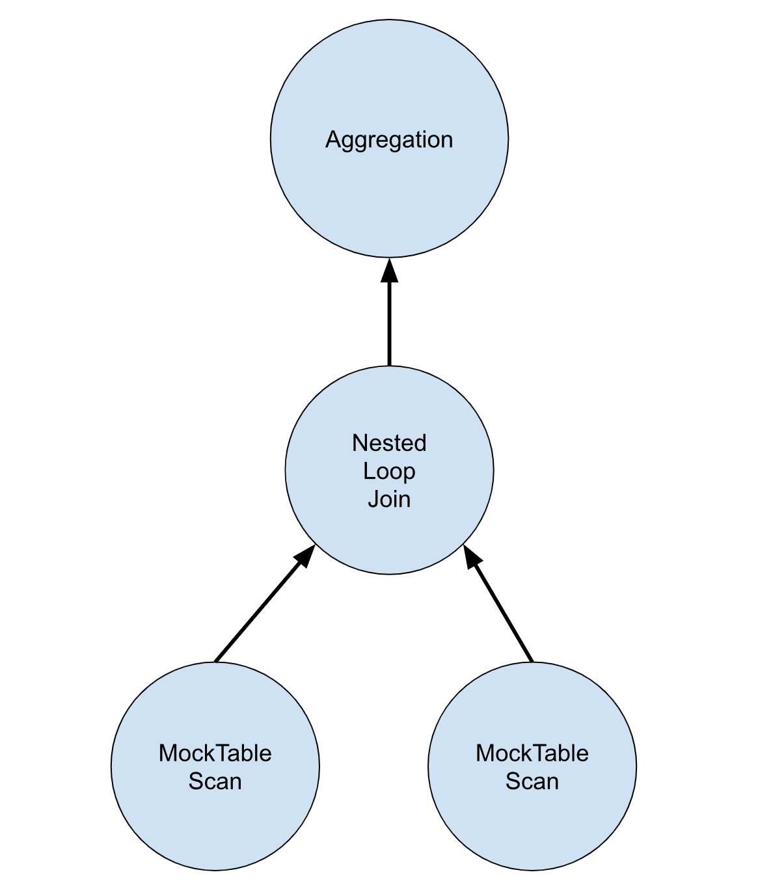
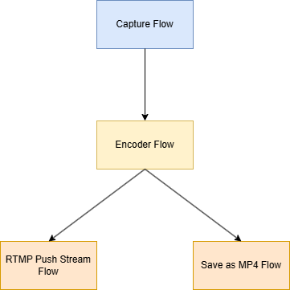
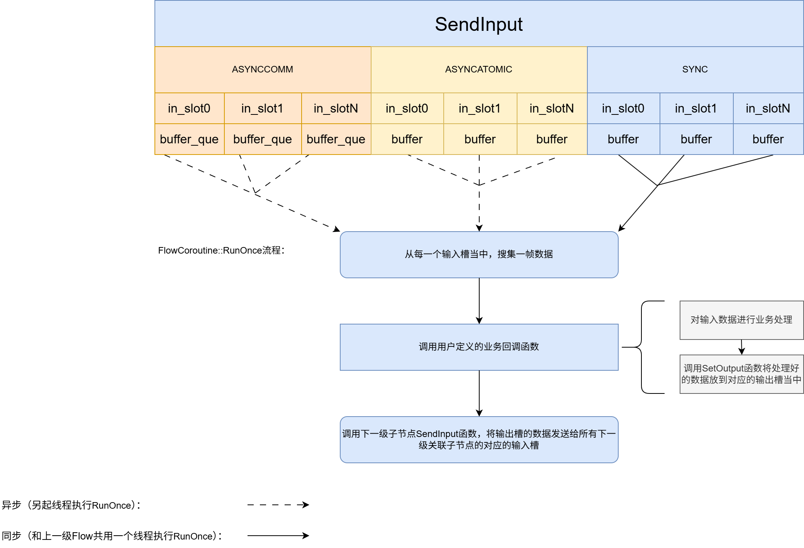
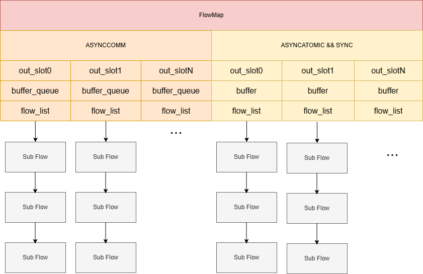

## 前言

谈到Flow其实绕不开Pipeline的概念，而Pipeline就是字面意思——流水线。一条Pipeline由多个flow节点构成。每个flow节点会对输入进来的数据做特殊的处理，再将数据发送给下一级flow节点，因此不同的flow节点承担不同的任务。

在数据库领域也存在PipeLine的工程实践：一条查询sql语句最终会被解析成一个个查询计划（查询计划会被连接成Pipeline形式的树形结构），执行器会利用所绑定的查询计划，对传来的表数据进行处理，然后讲处理好的表数据传递给下一级节点。这里放上一张一条聚合查询语句被解析后所构建的Pipeline模型：



上图是如下sql语句被解析后所构建的Pipeline：

<!-- more -->
```bash
bustub> EXPLAIN (o) SELECT colA, MAX(colB) FROM
  (SELECT * FROM __mock_table_1, __mock_table_3 WHERE colA = colE) GROUP BY colA;
=== OPTIMIZER ===
Agg { types=[max], aggregates=[#0.1], group_by=[#0.0] }
  NestedLoopJoin { type=Inner, predicate=(#0.0=#1.0) }
    MockScan { table=__mock_table_1 }
    MockScan { table=__mock_table_3 }
```

从图中可以看到，在执行聚合查询时，表的扫描、表的连接、聚合操作分别由不同的节点承担。表数据的流向从下到上，所以又称为**火山模型**。

在音视频当中，我们可以不严格的将flow分为三类：Source、IO、Sink。而一般数据流向顺序为：Source -> IO -> ...(可能经过**多个类型为IO的有不同业务逻辑的flow节点处理**) -> IO -> Sink。

- Source：专门利用V4L2接口负责从摄像头当中获取图像数据。

- IO：专门对图像数据进行处理，比如：裁剪/缩放、编码、Guard（控制拍摄图片张数）、标定、拼接等（依据具体的业务场景有不同的扩展类型）。

- Sink：专门将编码好的图像数据 推流到rtmp/rtsp服务器、保存成.mp4格式的文件或者JPEG格式的图片。

## 从rkmedia当中认识不同功能flow

前面提到的一些概念其实是比较抽象的，如果你看过一遍，也就看过一遍了。通过代码将抽象的东西具象化，才能在脑海当中加深印象。这里只放出文件，可以提前给大家解个惑，这里所列出的各种xxx_flow.cc其实是我们后面深入要讲的 Flow的派生类。xxx_flow.cc文件核心是实现了一个业务回调函数，用户只需在该回调函数当中根据业务需要编写的纯业务代码。这部分其实和本文主题是有所偏差。这里列出比较常用的几个flow。强烈建议读者学习一下这几个flow的源码，然后可以模仿添加一个自己的flow（即使你写的flow什么也不干）。可以感受一个flow当中，数据获取、处理、发送的套路。

**文件路径：external/rkmedia/src/flow**

|   文件名                      | 作用  |
|   :-:                         |   :-: |
| source_stream_flow.cc         | 类型为Source的flow，利用v4l2接口从摄像头当中获取图像数据。 |
| filter_flow.cc                | 这个flow有段特殊，属于IO flow，可以通过配置，将其配置为不同业务功能的flow，比如前面提到过的裁剪/缩放、Guard等功能，如果对代码足够了解的话，还可以为它编写自己的Filter来实现特定的功能。 |
| video_encoder_flow.cc         | 这个flow同一属于IO类型的flow，专用于对图像数据进行编码，可按需将图像数据编码成H264/H265/JPEG等格式，通过对编码器进行配置可以很容易实现这点。一般会通过需改mediaserver的.conf文件（json格式）来对flow节点进行配置。|
| file_flow.cc | 属于Sink类型的flow，一般将已经编码成JPEG格式的图像数据写入到文件当中。也即保存JPEG图像 |
| muxer_flow.cc/h | 属于Sink类型的flow，将编码成H264/H265的图像数据保存成.mp4文件 或者 推流到rtmp |

上表所列原文件会有一些共同点：

1. 继承自Flow。

2. 在构造函数当中都会解析配置，最重要的是：会创建一个类型为SlotMap的对象，然后**填充好输入/输出属性和业务回调函数** 后统一调用了父类的Flow::InstallSlotMap函数进行安装。

3. 在业务回调函数当中通过f参数拿到派生类对象，通过input_vector拿到从上一级flow节点传过来的图像数据，然后对图像进行处理，最后通过Flow::SetOutput函数，将处理完毕的图像数据发送给下一级节点。

4. 源文件尾部使用统一步骤，向反射工厂注册了自定义的继承自Flow的派生类。方便通过反射机制创建对象。

总结下来，可以按照这一套思路定义自己的Flow节点。可以参考文章：[如何添加一个flow节点？](./add_flow.md) 试着动手添加一个自己的flow节点。

到这里，我相信你心中一定会有很多疑惑：

- 为什么要这样加flow节点？

- 我们自定义的回调函数会在什么时机进行回调？

- 谁会给我们自定义的回调函数传参？

- Flow上下级是如何连接的？

- SlotMap对象各个属性的秘密？

- 调用Flow::SetOutput函数后，数据怎么就传给了下一级节点？

别着急，我们下面会揭晓背后的秘密。

## 从mediaserver当中感受Pipeline的建立

首先贴一张最简单的Pipeline的结构图：



图像数据流向：

capture flow（Source）利用v4l2接口获取图像数据，将图像数据传给编码节点（IO），编码节点将图像数据编码成H264然后分别转发发给 RTMP推流（Sink）节点和 将视频流保存为MP4格式（Sink）节点。

广义上讲，其实Pipeline就是广义上的数据结构——树。当你后面深入了解到flow的实现后，会发现，Pipeline和树的唯一区别：**树的节点仅仅是存储数据的，而Pipeline节点是包含一些处理数据的逻辑资源（包含线程、需要执行的业务代码等）。**

上图Pipeline示例结构在mediaserver当中会以json配置文件的形式存在，如下：

配置文件一般路径：app/mediaserver/src/conf/

```json
{
    "Pipe_0": {
        "Flow_0": {
            "flow_index": {
                "flow_index_name": "source_0",
                "flow_type": "source",
                "stream_id": "0",
                "stream_type": "camera",
                "upflow_index_name": "none"
            },
            "flow_name": "source_stream",
            "flow_param": {
                "name": "v4l2_capture_stream"
            },
            "stream_param": {
                "device": "rkispp_m_bypass",
                "frame_num": "6",
                "height": "2160",
                "output_data_type": "image:nv12",
                "use_libv4l2": "1",
                "v4l2_capture_type": "VIDEO_CAPTURE",
                "v4l2_mem_type": "MEMORY_DMABUF",
                "virtual_height": "2160",
                "virtual_width": "3840",
                "width": "3840"
            }
        },
        "Flow_1": {
            "flow_index": {
                "flow_index_name": "video_enc_0",
                "flow_type": "io",
                "in_slot_index_of_down": "0",
                "out_slot_index": "0",
                "stream_type": "video_enc",
                "upflow_index_name": "source_0"
            },
            "flow_name": "video_enc",
            "flow_param": {
                "input_data_type": "image:nv12",
                "name": "rkmpp",
                "need_extra_merge": "1",
                "output_data_type": "video:h265"
            },
            "stream_param": {
                "input_data_type": "image:nv12",
                "output_data_type": "video:h265",
                "virtual_height": "2160",
                "virtual_width": "3840",
                "width": "3840",
                "height": "2160",
                /* 省略一大串编码相关的配置参数 ... */
            }
        },
        "Flow_2": {
            "flow_index": {
                "flow_index_name": "muxer_0",
                "flow_type": "sink",
                "in_slot_index_of_down": "0",
                "out_slot_index": "0",
                "stream_type": "muxer",
                "upflow_index_name": "video_enc_0"
            },
            "flow_name": "muxer_flow",
            "flow_param": {
                "name": "muxer_flow",
                "path": "rtmp://127.0.0.1:1935/live/mainstream",
                "output_data_type": "flv"
            },
            "stream_param": {}
        },
        "Flow_3": {
            "flow_index": {
                "flow_index_name": "muxer_1",
                "flow_type": "sink",
                "in_slot_index_of_down": "0",
                "out_slot_index": "0",
                "stream_type": "muxer",
                "upflow_index_name": "video_enc_0"
            },
            "flow_name": "muxer_flow",
            "flow_param": {
                "file_duration": "60",
                "file_index": "1",
                "file_time": "1",
                "path": "/userdata/media/video0",
                "file_prefix": "main_vible",
                "name": "muxer_flow",
                "enable_streaming": "false"
            },
            "stream_param": {}
        }
    }
}
```

从json配置文件当中，我们可以直观了解到，上面这段json配置 和 本小段开头所放的Pipeline结构图是相互对应的。我们可以预见，mediaserver会解析json文件，然后自动创建各种类型的flow节点，然后将他们连接起来。那么，mediaserver是怎么去实例化各种各样的flow对象的呢？

如果你认真阅读了上一段讲解手动添加一个flow的部分，你一定留意过，在实现自己的flow时，会必须实现一个静态函数：GetFlowName，该函数会返回一个字符串，代表flow name，同时，在自定义一个flow类后，文件末尾会公式化的添上几行有关反射的代码。这一步实际上会向反射工厂注册我们自定义的Flow节点。

json配置文件当中，每个flow节点的 flow_name 参数指定的值就是配合反射来创建一个个实例化对象的。事实上json文件当中的flow_name值，必须等于我们自定义flow所实现静态函数：GetFlowName的返回值。mediaserver当中会利用json配置文件里面每一个flow节点的flow_name字段到反射工程当中去创建Flow的实例化对象，反射工程会利用我们自定义Flow时所实现的GetFlowName函数返回值和flow_name做比对最终确定去实例化哪一个自定义的Flow。 

现在注意集中在json配置文件当中，从配置文件当中可以了解到，一个flow节点有四个参数：flow_index、flow_name、flow_param、stream_param

- flow_index：这个参数当中的内容是本文我们需要**重点关注**的，**它定义了flow节点上下级关系**以及flow节点的类型。

- flow_name：该参数上面详细描述过，主要告诉反射机制去实例化哪一种类型的flow。

- flow_param：自定义的flow节点在实例化过程中自身可能需要的一些参数。**该参数本节无需重点关心！**

- stream_param：自定义的flow节点可能会借助其他的子插件，来实现自己的业务逻辑，比如编码节点会引用mpp的东西，而mpp本身的创建又需要一些参数，stream_param定义的一些参数就是为实例化子插件而生的。**该参数本节无需重点关心！**

最后，我们将注意集中在mediaserver堆Pipeline的构建上。如下

在app/mediaserver/src/mediaserver.cpp文件当中，mediaserver.cpp是mmediaserver main函数所以文件，里面定义了MediaServer类，main写了什么我们无需关心，理所应当的是，main函数一定创建了MediaServer对象，重点关注MediaServer的构造函数：

```cpp
MediaServer::MediaServer() {
  LOG_DEBUG("media servers setup ...\n");
  // 略 ...
  flow_manager->ConfigParse(media_config);
  flow_manager->CreatePipes();
  // 略 ...
  LOG_DEBUG("media servers setup ok\n");
}
```

第一步，解析json配置，app/mediaserver/src/flows/flow_manager.cpp对ConfigParse的实现：

```cpp
int FlowManager::ConfigParse(std::string conf) {
  LOG_INFO("flow manager parse config\n");
  // 解析json配置文件并构建FlowParser对象（后面会利用FlowParser对象真正创建每一个flow）
  flow_parser_.reset(new FlowParser(conf.c_str()));

  // 将数据库的配置同步到mediaserver当中。
  SyncConfig();
  return 0;
}
```

第二步，构建Pipeline。

```cpp
int FlowManager::CreatePipes() {
  LOG_INFO("flow manager create flow pipe\n");
  for (int index = 0; index < flow_parser_->GetPipeNum(); index++) {
    auto flow_pipe = std::make_shared<FlowPipe>();
    auto &flow_units = flow_parser_->GetFlowUnits(index);
    flow_pipe->CreateFlows(flow_units);
    flow_pipes_.emplace_back(flow_pipe);
  }
  // ...
  for (int index = 0; index < flow_pipes_.size(); index++) {
    auto &flow_pipe = flow_pipes_[index];
    flow_pipe->InitFlows();
  }
  // ...
  return 0;
}
```

利用反射实例化flow对象（**flow之间连接还未建立**）：

```cpp
void FlowPipe::CreateFlows(flow_unit_v &flows) {
  std::string param;
  for (auto &iter : flows) {
    int ret = CreateFlow(iter);
    if (!ret)
      flow_units_.emplace_back(iter);
  }
}

int FlowPipe::CreateFlow(std::shared_ptr<FlowUnit> flow_unit) {
  // ...

  // 反射实例化flow对象
  auto flow = easymedia::REFLECTOR(Flow)::Create<easymedia::Flow>(
      flow_name.c_str(), param.c_str());
  if (!flow) {
    LOG_ERROR("Create flow %s failed\n", flow_name.c_str());
    LOG_ERROR("flow param :\n%s\n", param.c_str());
    exit(EXIT_FAILURE);
  }
  flow->RegisterEventHandler(flow, FlowEventProc);
  flow_unit->SetFlow(flow);
  return 0;
}
```

连接flow，构建Pipeline（**建立flow之间的连接**）：

```cpp

int FlowPipe::InitFlows() {
  for (int flow_index = flow_units_.size() - 1; flow_index >= 0; flow_index--) {
    InitFlow(flow_index);
  }
  return 0;
}

int FlowPipe::InitFlow(int flow_index) {
  auto &flow_unit = flow_units_[flow_index];
  auto &flow = flow_unit->GetFlow();
  auto tsream_type = flow_unit->GetStreamType();
  auto flow_type = flow_unit->GetFlowType();
  if (FlowType::SOURCE == flow_type)
    return 0;
  // ...

  // 节点上级的 flow_index_name
  auto upflow_index_name = flow_unit->GetUpFlowIndexName();
  // 把图像数据传递给本级flow的哪一个输入槽。
  int out_slot_index = flow_unit->GetOutSlotIndex();
  // 本级flow和上级flow哪一个输出槽做绑定。
  int in_slot_index_of_down = flow_unit->GetInSlotIndexOfDown();
  // 一个flow节点可以有多个上级。
  auto v = SplitStringToVector(upflow_index_name);
  for (auto name : v) {
    int upflow_index = GetFlowIndex(name);
    auto &upflow = flow_units_[upflow_index]->GetFlow();
    // 根据输入槽和输出槽，建立flow上下级联系。
    upflow->AddDownFlow(flow, in_slot_index_of_down, out_slot_index);
    out_slot_index++;
  }
  return 0;
}
```

这里备注一下**flow_index_name和flow_name的区别，flow_index_name在同一个pipeline下是**唯一**的，用于唯一索引同一个pipeline下的flow节点。同一Pipeline下，不同的flow_index_name可能有相同的flow_name。flow_name用于给反射机制使用，去实例化不同类型的flow节点。**


有关输入槽/输出槽的概念，读者可能会有些迷糊。不要急，下一小结，将会解答这里的疑惑。

## Flow的实现

前面已经花了大量篇幅，介绍Flow的作用，以及在mediaserver当中，Flow是怎么一步步被构建成PipeLine的。本段将深入讲解Flow的具体实现，一一解答上面抛出的疑问。

源码之前了无秘密。现在把注意力集中在两个**最重要**的文件：

> external/rkmedia/src/flow.cc
>
> external/rkmedia/include/easymedia/flow.h

首先是两个枚举类的定义：

```cpp
enum class Model { NONE, ASYNCCOMMON, ASYNCATOMIC, SYNC };
// PushMode
enum class InputMode { NONE, BLOCKING, DROPFRONT, DROPCURRENT };
```

对`enum class Model`的解释：

- ASYNCCOMMON：Flow节点是异步节点，输入槽是一个队列，输出槽也是一个队列。同时，Flow节点启动时，会创建一个线程，线程不断执行：
  1. 从输入槽当中获取图像数据。
  2. 将图像数据仍给回调函数（此回调函数正是用户自定义的业务回调函数）。
  3. 业务回调函数在处理完数据后，会将图像数据放到对应的输出槽。
  4. 将输出槽当中的图像数据放到下一级子节点的输入槽当中。
- ASYNCATOMIC：大部分特性同ASYNCCOMMON，唯一的区别是输入槽和输出槽使用的不是队列缓存数据，而是使用的Buffer对象指针，方便理解的话，读者可以理解为长度固定为1的队列。同ASYNCCOMMON，会在一个单独的线程当中，执行1~4步逻辑。
- SYNC：代表Flow节点是同步节点，输入/输出槽是一个Buffer对象指针，并且Flow节点启动时不会创建线程。**1~4步逻辑会和父节点使用同一个线程，在Flow节点的父节点处理线程当中执行。**

对于 `enum class InputMode`， **该枚举类仅在flow 为Model::ASYNCCOMMON模式下有意义** ，它代表在节点输入槽队列（如果队列长度有限制的话）满时，Flow::SendInput函数的溢出策略：

- BLOCKING：阻塞，知道队列不满。
- DROPFRONT：丢弃队列前部数据。
- DROPCURRENT：丢弃当前的数据。

前面反复提到上面**输入槽/输出槽，这两个名词分别对应 `Flow::Input`、`Flow::FlowMap`**两个内嵌类。而在Flow输入输出可能有多个槽，所以在Flow当中有两个槽数组：`Flow::v_input`、`Flow::downflowmap`，结合他们的特性以及命名，所以本文我就大胆称其为XX槽。具体输入/输出槽的实现比较简单，这里就不贴代码了，对实现细节有把控读者，可以自行阅读源码。

这里使用一张图来描绘了Flow核心部件以及流程：



比较重要的核心代码：

```cpp
void FlowCoroutine::RunOnce() {
  bool ret = true;
  // 从每一个输入槽当中，获取一帧图像数据
  (this->*fetch_input_func)(in_vector);


  if (flow->GetRunTimesRemaining()) {
    is_processing = true;
    // 执行用户自定义的业务逻辑回调
    ret = (*th_run)(flow, in_vector);
    is_processing = false;

  }

  // 多个输出槽
  for (int idx : out_slots) {
    auto &fm = flow->downflowmap[idx];
    std::list<Flow::FlowInputMap> flows;
    fm.list_mtx.read_lock();
    flows = fm.flows; // 输出槽可能绑定了多个Sub Flow
    fm.list_mtx.unlock();

    // 调用Sub Flow的SendInput函数，将输出槽的数据传递给Sub Flow的输入槽。
    (this->*send_down_func)(fm, in_vector, flows, ret);
  }
  for (auto &buffer : in_vector)
    buffer.reset();

  pthread_yield();
}
```

在上面的图解当中，没能表现输出槽的内部结构，下面对输出槽的内部结构进行补充：



从输出槽的结构我们可以了解到，输出槽是维护一个Flow链表的，这里就可以回答开头提到的第四个问题：Flow上下级是如何连接的？

正是由输出槽来维护一个子节点链表，从而使Flow在处理完图像数据后，将处理完的图像数据分发给**相应的每一个**子节点。在mediaserver的.conf配置文件当中flow_index配置项所描述的输入槽索引/输出槽索引也正是这里输入输出槽数组的索引下标。

在自定义一个Flow节点时，一个Flow节点可能会定义多个输入槽，这取决于特定的业务场景，比如MuxerFlow在打包成.mp4格式的视频可能同时需要视频数据和音频数据、或者双光谱图像的同步节点等。但是一个Flow节点的输入槽只能和一个上级绑定！除非你在业务回调函数当中有办法区分输入的Buffer是来自哪个上级！

一个FLow节点也可能会定义多个输出槽，这取决于特定的业务场景，比如VideoEncoderFlow节点在编码完一张图像后，可能同时需要输出编码好的图像数据和extra data。与输入槽不同，一个FLow节点的输出槽是可以同时绑定多个Sub Flow（子节点）节点的！

一句话总结Flow的实现：不严谨的来说，**每个Flow节点既是消费者又是生产者，并且FLow的Coroutine实际上是一种递归的逻辑。**

由于代码需要兼顾同步和异步模式，所以里面的类包括：FlowCoroutine、Input、FlowMap在构造时会设置大量的回调。至此，Flow的原理已经分析清楚，现在，你可以试着去精读一下external/rkmedia/src/flow.cc文件当中的源代码，重点可以看一下：InstallSlotMap、SetOutput、SendInput、AddDownFlow函数，相信阅读起来会轻松很多。

---

本章结束