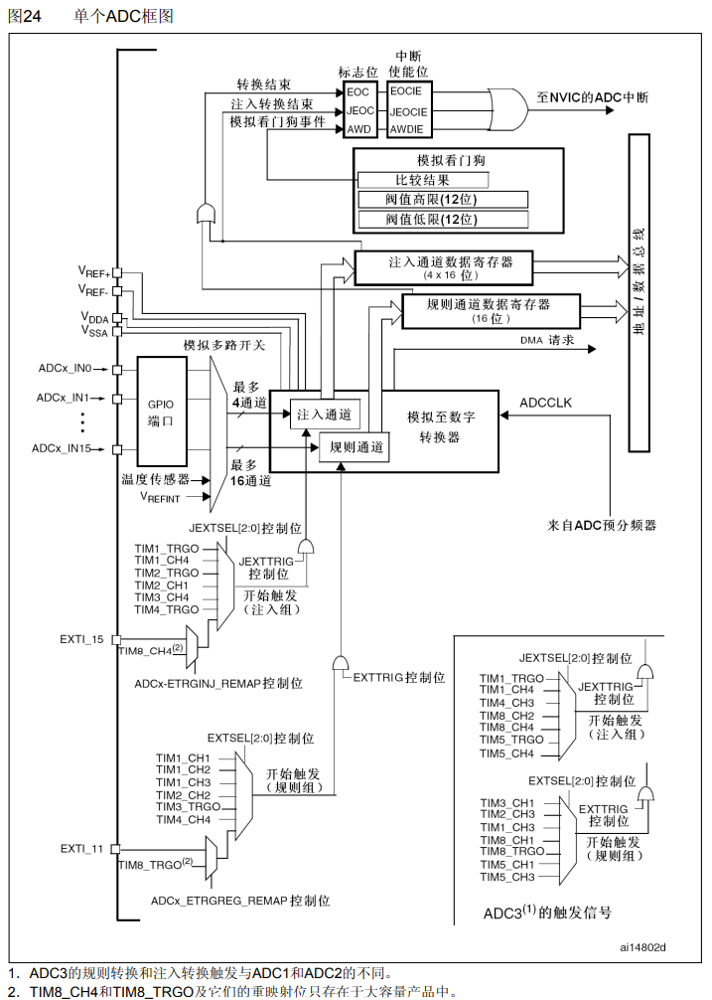
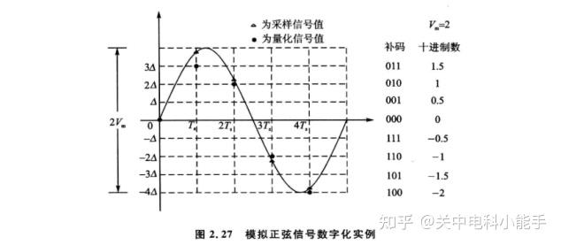
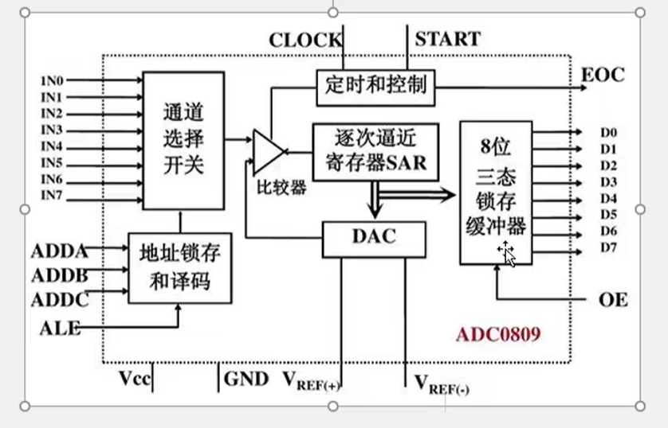
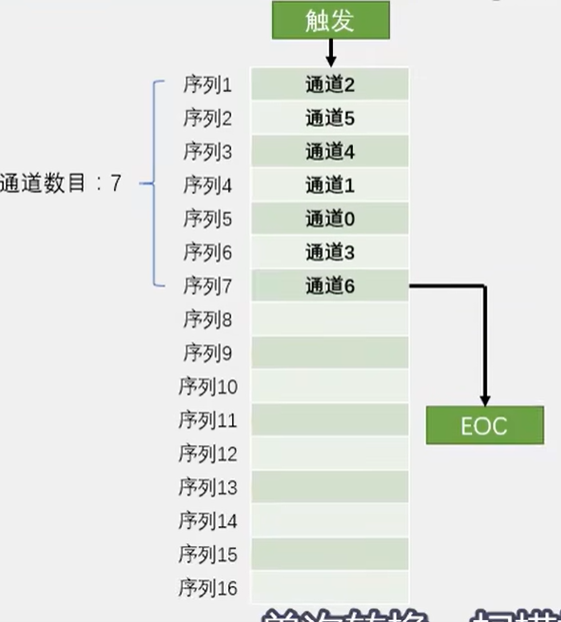
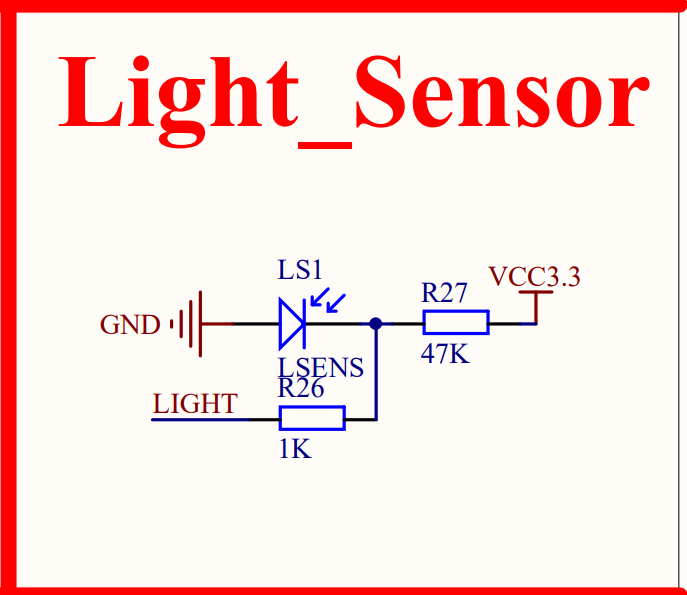
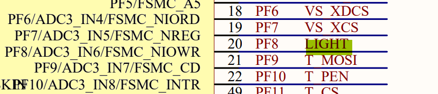
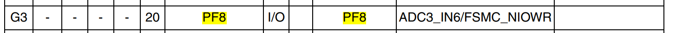
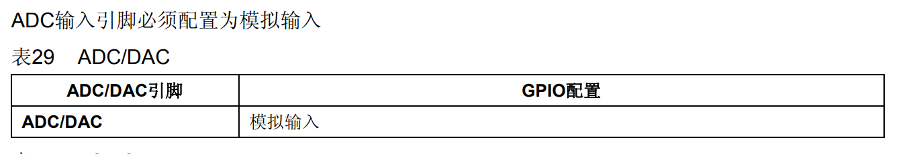

## 前言

ADC数模转换存在的意义就是将一些温度传感器、各自数据传感器产生的模拟信号转换成方便识别和计算的数字信号。

## 导航

图24 通用定时器框图：



图片截取自STM32 F1XX中文参考手册。还是以框图为中心，来叙述我对ADC的理解。

## ACD实现细节
<!-- more -->

### 核心原理

所谓ADC转换目的是为了将连续变化的模拟量转变成数字，方便程序的计算。这里的模拟量不单单指代那些以正弦规律变化的波形，只要是连续变化的波形，我们都称它为模拟量。简单来说，数模转化器就是按一定分辨率对连续变化的模拟信号进行切分，每一段都会给他进行数字编码，当然分辨越大，模拟信号被切分的越细，精度也会越精确。图片引用自知乎，如有侵权，可联系我将其删除，如图：



ADC转换器的实现是：首先对输入的模拟信号进行采样，因为数模转换的精度是确定的，所以会以精度来进行一个二分，每次取命中的精度范围的中间数值，然后将数值通过DA转换，转换成模拟量，然后和采样的模拟量比较，判断大小，再进行一次二分，最终确定采样的模拟量对应的数字编码是多少。这里帖一张简单8位的ADC内部构造的原理图，图片引用自江协科技，如有侵权，联系我将其删除，如图2。



### 图24的中间部分

回到图24，框图左侧ADCx_INx就是各个GPIO端口也称为通道，模拟信号可以从这里输入，旁边的GPIO端口矩形框，内部就是一个硬件开关，STTM32中的ACD一次可以处理多个ADC通道的转换，通道的转换就靠硬件开关来选择。我们这里主要讲规则通道的转换。注入通道原理其实是一样的。规则通道有16路通道，而输出寄存器只有一个，所以在完成一次通道的转换，我们就应该快速讲输出寄存器的值读取走，不然就会覆盖，一般会配合DMA使用。中间的模拟至数字转换器的内部原理就是图2所示。ADCCLK就是给ADC转换器的驱动时钟，和图2的CLOCK引脚对应。

### 图24的上半部分

图2上部分有连接到输出寄存器（包括1个规则通道寄存器、4个注入通道寄存器）的各种标志位，这些标志位都有相应的寄存器，并且也能触发中断。模拟看门狗的作用在图中也描述的非常明了，就是给定一个检测范围，在范围中就会触发标志位或中断。

### 图24的下半部分

下半部分就是描绘数模转换触发的一些方式，这里是支持硬件触发的软件触发。硬件触发包括主模式下定时器的TRGO输出、以及定时器的输出通道、外部中断的触发等。各种触发方式和图2的START引脚对应。

## 实现ADC转换的细节记录

**1. 首先要区分：间断模式和扫描模式、单次转换和连续转换。**

所谓间断模式，就是一次触发只转换部分通道。所谓扫描，就是一次触发将规则组（注入组）的所有待转换的通道都转换完。

所谓单次转换，就是将规则组转换完了，就停止转换。所谓连续转换，就是规则组（注入组）转换完了，就自动从头开始新一轮的转换。

间断模式和扫描模式通过配置ADC_CR1.SCAN[8]可以开启或者关闭扫描模式，规则组和注入组共用这一位。通过配置ADC_CR1.JDISCEN[12]、ADC_CR1.DISCEN[11]分别可以配置注入组或者规则组去启用或禁用间断模式。通过配置ADC_CR1.DISCNUM[15:13]可以配置间断模式下**规则组**一次触发事件转换的通道数目，这里只强调规则组！中文手册并没提到注入组，目前不确认规则组是否也受该位的影响！**扫描模式下，只有最后一个条目转换完毕才会置位EOC。**

具体使用连续转换还是单次转换，由ADC_CR2.CONT[1]控制。

**2. 关于看门狗的细节**

规则组和注入组可以独立的开启模拟看门狗，分别使用ADC_CR1.AWDEN[23]、ADC_CR1.JAWDEN[22]，通过ADC_CR1.AWDSGL[9]位可以实现扫描模式下让看门狗只监控一个特定通道，监视的通道号由ADC_CR1.AWDCH[4:0]位给出。

**3. 模式选择和触发方式**

本文只讲解独立模式的配置，由ADC_CR1.DUALMOD[19:16]可以配置是独立模式还是双模式。规则组和注入组都可以独立配置触发方式。规则组通过ADC_CR2.EXTSEL[19:17]选择触发源。典型值是[111：软件触发SWSTART]，还需要使用ADC_CR2.EXTTRIG[20]使能外部触发源。ADC_CR2.SWSTART[22]置位可激活软件触发，使规则组开始转换。

**4. 规则组和通道的关系**

STM32F103系列规则组可以有16个条目（entry）（标号从1开始，范围[1, 16]），通道一共有18个（标号从0开始，范围[0, 17]）。

ADC1的模拟输入通道16和通道17在芯片内部分别连到了温度传感器和VREFINT。

ADC2的模拟输入通道16和通道17在芯片内部连到了VSS。

ADC3模拟输入通道9、14、15、16、17与Vss相连。

每个通道可以单独配置其采样时间。ADC_SMPRx（x=1、2）。通过配置ADC_SQRx（x=1、2、3）可以配置规则组每个条目指向哪个通道。其中ADC_SQR1.L[23:20]可设置规则组中有效条目的长度（也即通道数目）。

盗取江协科技的图片如下：



## ADC转换的库函数实现

硬件接线图如下：





GPIO对应的ADC如下：



**由表可知，我们需要配置的是ADC3**

GPIO配置如下：



核心代码如下：

```c
void LunarADCInit(void) {
	GPIO_InitTypeDef GPIOF8_Cfg;
	ADC_InitTypeDef ADC3_Cfg;

	// 先配置ADCCLK预分频器		12M HZ
	RCC_ADCCLKConfig(RCC_PCLK2_Div6);
	// 打开ADC1时钟
	RCC_APB2PeriphClockCmd(RCC_APB2Periph_ADC3, ENABLE);

	RCC_APB2PeriphClockCmd(RCC_APB2Periph_GPIOF, ENABLE);
	GPIOF8_Cfg.GPIO_Mode = GPIO_Mode_AIN;
	GPIOF8_Cfg.GPIO_Pin = GPIO_Pin_8;
	GPIOF8_Cfg.GPIO_Speed = GPIO_Speed_50MHz;
	GPIO_Init(GPIOF, &GPIOF8_Cfg);

	ADC3_Cfg.ADC_ContinuousConvMode = ENABLE;					// 连续转换使能
	ADC3_Cfg.ADC_DataAlign = ADC_DataAlign_Left;
	ADC3_Cfg.ADC_ExternalTrigConv = ADC_ExternalTrigConv_None;	// 软件触发
	ADC3_Cfg.ADC_Mode = ADC_Mode_Independent;					// 独立模式
	ADC3_Cfg.ADC_NbrOfChannel = 1;								// 只转换一个序列
	ADC3_Cfg.ADC_ScanConvMode = ENABLE;							// 使用扫描模式
	ADC_Init(ADC3, &ADC3_Cfg);

	ADC_RegularChannelConfig(ADC3, ADC_Channel_6, 1, ADC_SampleTime_7Cycles5);	// 配置规则序列寄存器以及通道采样时间

	ADC_Cmd(ADC3, ENABLE);

	ADC_ResetCalibration(ADC3);
	while (ADC_GetResetCalibrationStatus(ADC3) == SET);	// 硬件置0

	ADC_StartCalibration(ADC3);
	while (ADC_GetCalibrationStatus(ADC3) == SET);	// 硬件置0


	ADC_SoftwareStartConvCmd(ADC3, ENABLE);
	while (ADC_GetFlagStatus(ADC3, ADC_FLAG_STRT) == RESET);
}
 
 int main() {
	// 初始化usart
	LunarInitUSART1();
	LunarADCInit();

	SYSTick_Init();

	LunarNVICInit();

	printf("stm32 启动\n");

	int t = 3;
	while(1) {
		printf("light:%d\r\n", ADC_GetConversionValue(ADC3));
		while (t > 0){
			t--;
			Delay_Ms(1000);
		}
		t= 3;

	}

	return 0;
 }
```

> 实验现象就是手机背光照射光敏电阻时，ADC转换数值变小。

---

**本章完结**