## 前言

支持一对多（一主多从）、多对多传输（多主多从），只支持半双工，一般有两根数据线：SCL（Serial Clock Line）、SDA(Serial Data Line)

I2C有两种实现方式：一种是GPIO软件模拟，另一种是直接使用I2C硬件。

## I2C软件实现

软件实现I2C的好处就是我们可以任意的选取GPIO口作为SDA、SCL线。

### 硬件电路的设计

硬件连接图如下：
<!-- more -->

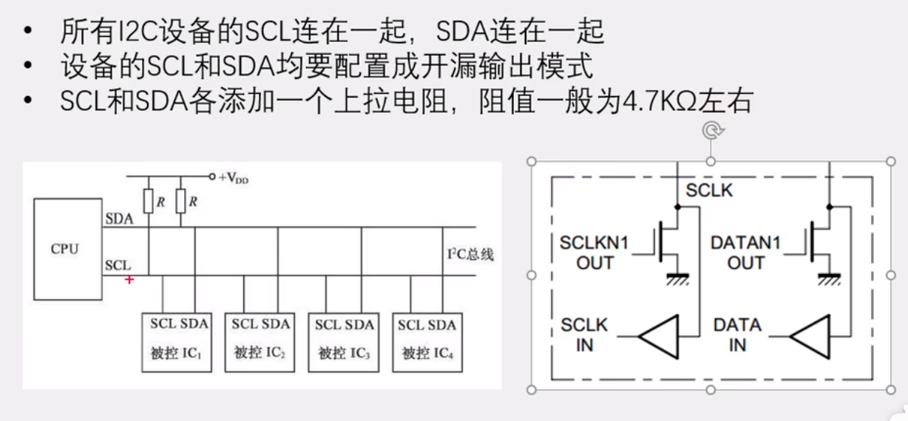

SDA是数据线，SCL是时钟线。时钟线完全由主机控制。而从机只有对SDA的（短暂）控制权。通常使用I2C通通信，SCL和SDA线上都会接一个上拉电阻，要么是在外设的内部，要么是在外面可以直接通过外设的硬件接线图看到。接下来讨论外接电阻存在的意义。

如下：

- 在配置成推挽输出模式下，可以直接读输入寄存器从而获取引脚状态。但推挽输出配置外接电阻是没有任何意义的，因为输出0或输出1完全由IO决定。可以说只要IO口是推挽输出的状态那么SDA线的控制权就不可能移交给从机。想要放弃对SDA的控制就必须将IO口配置成输出的模式。甚至在极端情况下，在主输出1从输出0会造成短路。

- 在配置成开漏输出模式下，也可以直接读输入寄存器从而获取引脚状态，通过置输出寄存器为1这样引脚处于高阻态（引脚悬空）主机可以方便的释放SDA的控制权。不需要像推挽输出那样配置成输入模式。通过读取输入寄存器，可以方便的接收数据。主机、外设引脚都处于开漏模式，需要输出0就向输出寄存器写0，将引脚拉低；需要输出1就向输出寄存器写1将引脚断开，让上拉电阻提供一个弱上拉。并且也不存在短路的风险，即使在主输出1从输出0的情况下，因为高电平是上拉电阻提供，中间怎么都会存在电阻。


所以一因为推挽输出输出的是强高低电平，在同一时刻，主机上拉输出1，某一个从机下拉输出0，这样就造成了短路！！！所以，为了防止这种情况，所有机器的SCL、SDA都被配置成开漏输出，只能输出强低电平0，同时外接一个弱的上拉电阻，以输出弱的高电平，杜绝了短路去危险情况。同时外接上拉电阻 + 开漏输出不需要频繁切换输入输出模式。

所以我们实现的软件I2C也会将SCL、SDA引脚置为开漏输出的模式。

### I2C的起始位 & 停止位

起始位和停止位的波形如下：

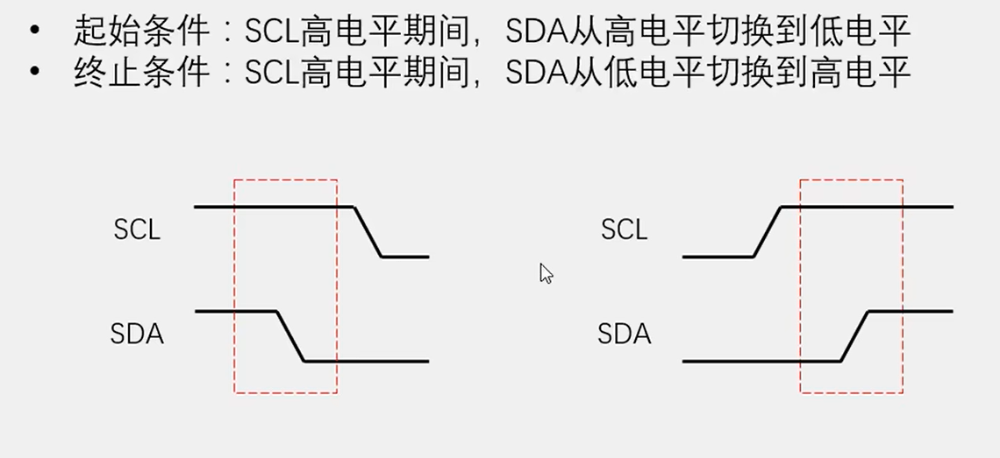

简述一下，起始位就是在SCL高电平期间将SDA拉低，停止位就是在SCL为高电平期间将SDA拉高。

这样设计的目的和I2C数据位的传输有关，I2C中，一个数据位的传输遵循：在SCL低电平期间，写数据的一方向SDA写1（释放SDA）或者写0（拉低SDA），同时读的一方不允许去读数据（SDA）。在SCL高电平期间，读数据的一方在SDA上进行读数据，同时写的一方不想允许更改数据（SDA）。也就是所谓的‘**低电平放，高电平取**’原则。

而起始位和停止位恰好违背上面的原则，让通信双方能够很好的辨识出一个通信的周期。

此外，系统空闲时，两根总线都是被**弱上拉**拉高的高电平状态。至于为什么是弱上拉，我们后面讨论。

### 首部

**紧跟起始位的是：设备地址 + 寄存器地址**

对于7位设备地址：

第一个字节必须是：

```
| 设备地址（7位） | 读写位（1位）|

# 读写位为0代表写，为1代表读。
```

对于10位设备地址：

前两个字节必须是：

```
| 1111 0 | 设备地址（2位） | 读写位（1位） | 

| 设备地址（8位） |

# 读写位为0代表写，为1代表读。
```

本博客主要讨论7位地址的情况。

在**写**设备地址之后的一个字节是要写的寄存器地址，寄存器地址就是要写的设备的寄存器的物理地址，一般是8位地址。I2C中只有写才有寻址的能力（第二个发送的字节为寄存器地址），读只能顺序去读（不能直接发送寄存器地址）。要想实现随机读，就需要在发送一个‘幽灵’写设备地址后重新发送一个：起始位 + 读设备地址，从而实现了随机读。简单讲随机读就是一种复合模式。也即：随机读 = 随机写 + 直接读。


在帧头传输完毕后，就是正式读写数据的传输。

### I2C一个Byte的发送

写遵循低放高取原则，因为是写操作，在传输数据时从机不具备操作SDA的权利，从机的SDA引脚保持高组态，SDA的高低电平由主机决定，主机通过操作SCL控制数据的传输进度。但是当一个Byte位传输完毕，主机会短暂释放SDA等待从机回复一个bit位的ACK，此时从机短暂拥有SDA的控制权。多次写入的数按最开始的寄存器地址依次排列。主机发送停止位代表传输周期结束。

1. 主机发送起始位

2. 主机发送写设备地址

3. 主机获取从机的ack

4. 主机发送寄存器地址

5. 主机获取从机的ack

6. 主机发送待写数据

7. 主机获取从机的ack（重复6~7步可以重复写

8. 主机发送停止位

**注意1：** I2C是高位先行。

**注意2：** 连续的写会纯在单页回滚问题，eeprom默认1页是8Byte，写到8的整数倍会导致指针混滚！这点需要注意。

### I2C一个Byte的读取

读取同样遵循低放高取原则，因为是读操作，在传输数据时主机不具备操作SDA的权利，主机的SDA引脚保持高组态，SDA的高低电平由从机决定，主机通过操作SCL控制数据的传输进度。但是当一个Byte位接收完毕，从机会短暂释放SDA等待主机回复一个bit位的ACK，此时主机短暂拥有SDA的控制权，当主机回复0（ACK），从机会继续发送数据；当主机回复1（NACK），从机会停止发送数据。一般情况下主机回复NACK后会接着回复一个停止位。

直接（顺序）读：

1. 主机发送起始位

2. 主机发送读设备地址
	
3. 主机获取从机的ack

4. 主机读取从机发来的数据

5. 主机发送NACK，结束传输（ACK可以回到4，继续读

6. 主机送停止位

顺序读地址只能从从设备的0开始，每次读，从设备的地址指针会自增1。不存在混滚问题。

随机读：

1. 主机发送起始位

2. 主机发送写设备地址

3. 主机获取从机的ack

4. 主机发送寄存器地址

5. 主机获取从机的ack

6. 主机发送起始位（	 Restart

7. 主机发送读设备地址
	
8. 主机获取从机的ack

9. 主机读取从机发来的数据

10. 主机发送NACK，结束传输（ACK可以回到9，继续读

11. 主机送停止位

总结一下读写特点：写可以寻址（寻址从设备的寄存器），读只能顺序读，随机读 = 随机写 + 顺序读。

### 软件实现核心代码

**需要另外注意的是，如果要对EEPROM外设进行读写，在写后不能直接进行读，需要延时至少5ms，给EEPROM一点操作时间，否则直接读出来的数据我测的是一直为0xff！！！**

代码如下：

```c
/*
    i2c.h
*/

#define SCL_PORT GPIOB
#define SCL_PIN GPIO_Pin_6


#define SDA_PORT GPIOB
#define SDA_PIN GPIO_Pin_7

// ...

/*
    i2c.c
*/

/**
 * @description: I2C端口GPIO初始化
 * @return {*}
 */
void Lunar_I2CInit(void) {
	GPIO_InitTypeDef GPIOB_Cfg;

	// PA
	RCC_APB2PeriphClockCmd(RCC_APB2Periph_GPIOB, ENABLE);

	// 两个引脚都配置为开漏输出
	GPIOB_Cfg.GPIO_Mode = GPIO_Mode_Out_OD;
	GPIOB_Cfg.GPIO_Pin = GPIO_Pin_6 | GPIO_Pin_7;
	GPIOB_Cfg.GPIO_Speed = GPIO_Speed_50MHz;
	GPIO_Init(GPIOB, &GPIOB_Cfg);

    // 最开始都为释放状态的高电平
	Lunar_SetSCL(Bit_SET);
	Lunar_SetSDA(Bit_SET);
}

/**
 * @description: 控制SCL引脚的电平状态，完全由主机控制
 * @param {uint8_t} BitVal
 * @return {*}
 */
void Lunar_SetSCL(uint8_t BitVal) {
    GPIO_WriteBit(SCL_PORT, SCL_PIN, (BitAction)BitVal);
	// 来一点点延时
	Delay_Us(10);
}

/**
 * @description: 控制SDA引脚的状态，可由主机控制，也可由从机控制
 * @param {uint8_t} BitVal
 * @return {*}
 */
void Lunar_SetSDA(uint8_t BitVal) {
    GPIO_WriteBit(SDA_PORT, SDA_PIN, (BitAction)BitVal);
	// 来一点点延时
	Delay_Us(10);
}

/**
 * @description: 获取SDA电平状态
 * @return {uint8_t}
 */
uint8_t Lunar_GetSDA(void) {
    uint8_t rt = GPIO_ReadInputDataBit(SDA_PORT, SDA_PIN);
	// 来一点点延时
	Delay_Us(10);
    return rt;
}


/*************************************************************************************************/

/**
 * @description: 发送一个起始位
 * @return {void}
 */
void Lunar_Start(void) {
	// 先将SCL、SDA拉高
	Lunar_SetSCL(1);
	Lunar_SetSDA(1);

	if (Lunar_GetSDA() == 0) {
		printf("error slave hold the SDA!!!\r\n");
	}

	// 再将SDA拉低
	Lunar_SetSDA(0);
	// 再将SCL拉低、准备发送数据
	Lunar_SetSCL(0);
}

/**
 * @description: 发送一个停止位
 * @return {void}
 */
void Lunar_Stop(void) {
	// 确保SDA为0
	Lunar_SetSDA(0);

	// 将SCL拉高
	Lunar_SetSCL(1);
	// 将SDA拉高
	Lunar_SetSDA(1);
	
	if (Lunar_GetSDA() == 0) {
		printf("error slave hold the SDA!!!\r\n");
	}

	// Lunar_SetSCL(0);
}

/**
 * @description: 写状态下等待从设备ACK的回复
 * @return {uint8_t}：读到ACK还是NACK
 */
uint8_t Lunar_ReadACK(void) {
	uint8_t rt = 0;
	// 释放SDA
	Lunar_SetSDA(1);

	// 拉高SCL
	Lunar_SetSCL(1);

	// 读SDA
	rt = Lunar_GetSDA();

	Lunar_SetSCL(0);

	return rt;

}

/**
 * @description: 读状态下向从设备回复一个ACK
 * @return {*}
 */
void Lunar_WriteACK(void) {
	// SDA置0
	Lunar_SetSDA(0);

	// SCL置1
	Lunar_SetSCL(1);

	// SCL置0
	Lunar_SetSCL(0);

	// 释放SDA拥有权
	Lunar_SetSDA(1);
}

/**
 * @description: 读状态下向从设备回复一个NACK
 * @return {*}
 */
void Lunar_WriteNACK(void) {
	// SDA置1
	Lunar_SetSDA(1);

	// SCL置1
	Lunar_SetSCL(1);

	// SCL置0
	Lunar_SetSCL(0);

	// 释放SDA拥有权
	Lunar_SetSDA(1); // ???
}

/**
 * @description: 读一个Byte
 * @return {uint8_t}：返回读到的Byte
 */
uint8_t Lunar_ReadByte(void) {
	uint8_t rt = 0;
	// 此出主机不应该拥有SDA的控制权！
	Lunar_SetSDA(1);
	for (int i = 0; i < 8; i++) {
		// 先拉高SCL
		Lunar_SetSCL(1);
		// 读SDA
		rt |= Lunar_GetSDA() << (7 - i);
		printf("%d, ", rt);
		// 拉低SCL
		Lunar_SetSCL(0);
	}
		printf("\r\n");
	return rt;
}

/**
 * @description: 写一个Byte
 * @param {uint8_t} data：要写入的数据
 * @return {*}
 */
void Lunar_WriteByte(uint8_t data) {
	// 此处主机应该拥有SDA的控制权
	for (int i = 0; i < 8; i++) {
		// 写一个bit
		Lunar_SetSDA((data >> (7 - i)) & 1);
		// 拉高SCL
		Lunar_SetSCL(1);
		// 拉低SCL
		Lunar_SetSCL(0);
	}
}


/**
 * @description: 获取指定设备指定寄存器地址的值
 * @param {uint8_t} device_addr：设备地址是7位
 * @param {uint8_t} registry_addr
 * @return {uint8_t}
 */
uint8_t Lunar_GetRegistryByte(uint8_t device_addr, uint8_t registry_addr) {
	uint8_t rt = 0;
	uint8_t tag = 0;
	// 发送起始位
	Lunar_Start();

	// 发送设备地址
	Lunar_WriteByte((device_addr << 1) | 0);	// 写设备地址
	// 获取从机的ack
	tag = tag || Lunar_ReadACK();

	// 发送寄存器地址
	Lunar_WriteByte(registry_addr);
	// 获取从机的ack
	tag = tag || Lunar_ReadACK();

	// Restart
	// 发送起始位
	Lunar_Start();

	// 发送设备地址
	Lunar_WriteByte((device_addr << 1) | 1);	// 读设备地址
	// 获取从机的ack
	tag = tag || Lunar_ReadACK();

	// 读取从机发来的数据
	rt = Lunar_ReadByte();
	// 发送NACK，结束传输
	Lunar_WriteNACK();

	// 发送停止位
	Lunar_Stop();

	if (tag) {
		printf("in Lunar_GetRegistryByte Lunar_ReadACK faild!\r\n");
	}
	return rt;
}


/**
 * @description: 设置指定设备指定寄存器地址的值
 * @param {uint8_t} device_addr
 * @param {uint8_t} registry_addr
 * @param {uint8_t} data
 * @return {*}
 */
void Lunar_SetRegistryByte(uint8_t device_addr, uint8_t registry_addr, uint8_t data) {
	uint8_t tag = 0;
	// 发送起始位
	Lunar_Start();

	// 发送设备地址
	Lunar_WriteByte((device_addr << 1) | 0);	// 写设备地址
	// 获取从机的ack
	tag = tag || Lunar_ReadACK();

	// 发送寄存器地址
	Lunar_WriteByte(registry_addr);
	// 获取从机的ack
	tag = tag || Lunar_ReadACK();

	// 发送待写数据
	Lunar_WriteByte(data);
	// 获取从机的ack
	tag = tag || Lunar_ReadACK();

	// 发送停止位
	Lunar_Stop();


	if (tag) {
		printf("in Lunar_SetRegistryByte Lunar_ReadACK faild!\r\n");
	}
}

```

## I2C硬件实现

### 导航

图242 I2C框图：

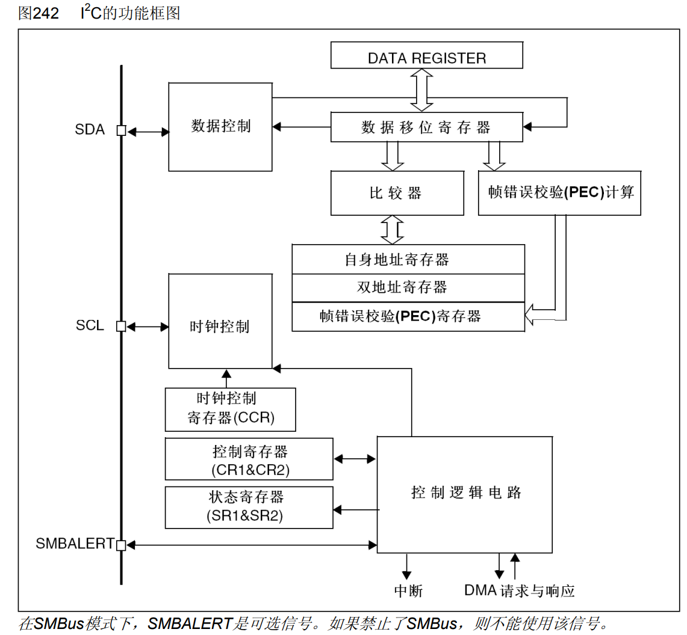

### 实现细节

从图242可以看到，和USART类似，I2C也配备了一组移位寄存器 + 数据寄存器的组合，只不过I2C只有一根数据线，所以只有一组寄存器组合。

对于于比较器和自身地址寄存器，I2C硬件可以在主从两种模式下工作，当作为从模式时，设备就会拥有一个设备地址，自身地址寄存器就是存储该从设备地址的地方，比较器就是完成设备地址匹配的功能。此外，I2C可以通过帧错误校验计算模块完成CRC校验的功能。

然后就是SCL时钟线的时钟控制模块，其作用就是控制SCL线时钟的，具体实现细节我没有去深究，但它的作用肯定是根据I2C规定的协议去控制SCL引脚上的时钟。

最后，左下部分就是一些可以让用户控制的寄存器，这些寄存器的作用都可以在中文手册中查阅。

这里贴一张来自江协科技的I2C简化框图：

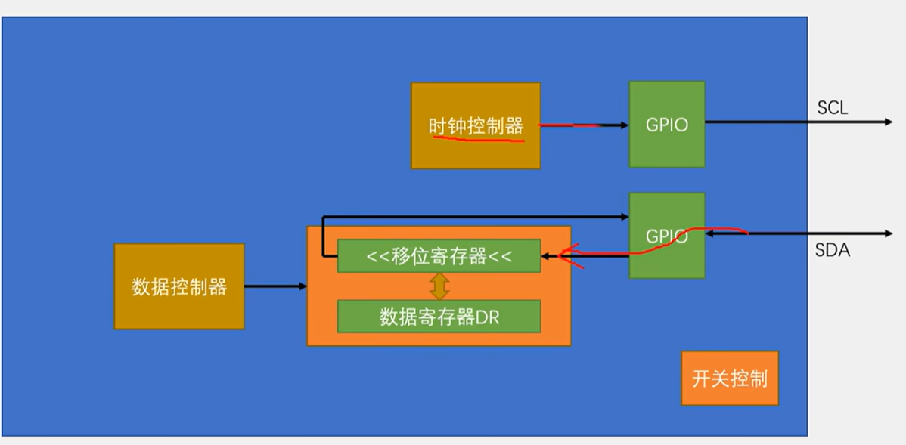

### 使用库函数实现硬件I2C的套路

写流程：

1. 发送起始位。

2. 等待EV5事件，也就是等待BUSY(SCL被拉低) & MSL（处于主模式，在start被发出硬件自动置位） & SB（start被发出） 被置位。

3. 发送写设备地址。

4. 等待EV6（发送）事件，也就是BUSY（SCL被拉低）& MSL（处于主模式，在start被发出硬件自动置位）&& ADDR（设备地址已经发送，并且收到从机的ACK）& TXE（发送寄存器为空） & TRA（发送模式，依据发送设备地址最后一位设置） 被置位。

5.  这里有一个理论上的EV8_1事件，但是库函数没有对应的宏，大体意思就是发送寄存器和发送移位寄存器同时为空。

6. 发送寄存器地址。

7. 等待EV8事件，也就是TRA（发送模式，依据发送设备地址最后一位设置）& BUSY（SCL被拉低） & MSL（处于主模式，在start被发出硬件自动置位） & TXE（发送寄存器为空，收到从机的ACK回复才会置位）被置位。

8. 发送待写数据。

9. 等待EV8_2事件，也就是在EV8事件基础上多了一个BTF标志位，代表发送寄存器和发送移位寄存器都空了，数据线上也没有需要传输的数据了，该发的数据发干净了。

10. 发送停止位，请求停止传输。

**重复执行8~9可实现多次写。**

这里可以配合中文手册的图理解写的套路：

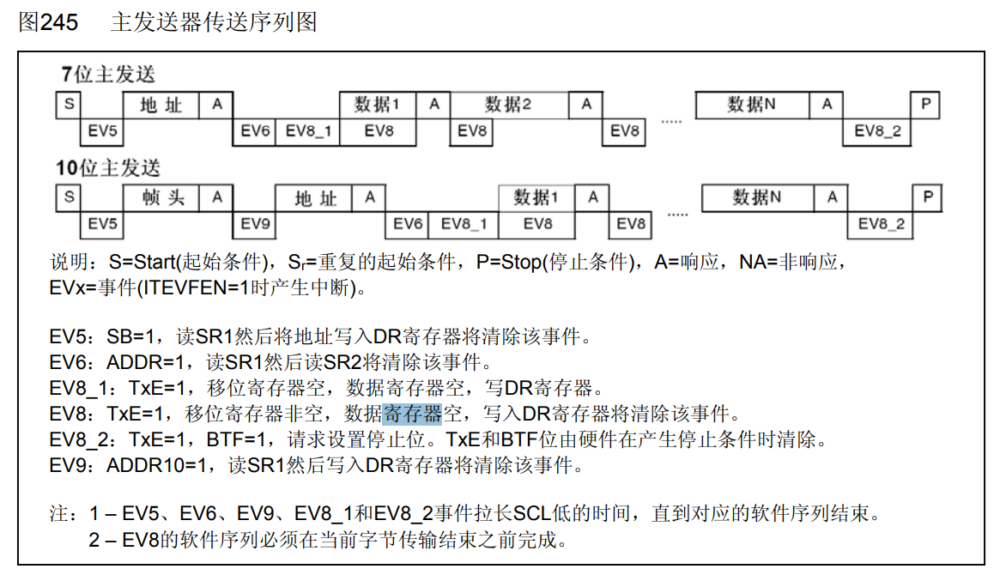

读流程：

1. 发送起始位。

2. 等待EV5事件，也就是等待BUSY(SCL被拉低) & MSL（处于主模式，在start被发出硬件自动置位） & SB（start被发出） 被置位。

3. 发送写设备地址。

4. 等待EV6（发送）事件，也就是BUSY（SCL被拉低）& MSL（处于主模式，在start被发出硬件自动置位）& ADDR（设备地址已经发送，并且收到从机的ACK）& TXE（发送寄存器为空） & TRA（发送模式，依据发送设备地址最后一位设置） 被置位。

5. 这里有一个理论上的EV8_1事件，但是库函数没有对应的宏，大体意思就是发送寄存器和发送移位寄存器同时为空。起提示作用。

6. 发送寄存器地址。

7. 等待EV8_2事件，也就是TRA（发送模式，依据发送设备地址最后一位设置）& BUSY（SCL被拉低） & MSL（处于主模式，在start被发出硬件自动置位） & TXE（发送寄存器为空，收到从机的ACK回复才会置位）& BTF（数据寄存器和移位寄存器都为空）被置位。

8. 发送起始位。

9. 等待EV5事件，也就是等待BUSY(SCL被拉低) & MSL（处于主模式，在start被发出硬件自动置位） & SB（start被发出） 被置位。

10. 发送读设备地址。

11. 等待EV6（接收）事件，也就是BUSY（SCL被拉低）& MSL（处于主模式，在start被发出硬件自动置位）& ADDR（设备地址已经发送，并且收到从机的ACK） 被置位。

12. EV6_1 / EV7_1 需要提前设置ack位和停止产生位。如果想继续读数据，就不执行该步，**循环执行13~14即可实现多次读**。

13. 等待EV7事件，也就是BUSY（SCL被拉低）& MSL（处于主模式，在start被发出硬件自动置位）& RXNE（接收数据寄存器非空）被置位。

14. 接收从机发来的数据。

这里可以配合中文手册的图理解读的套路，手册提供的是直接顺序读的时序，但是前面软件部分说过，需要实现随机读，可以使用‘幽灵’写 + 顺序读的方式实现，上述步骤也正是这样做的。

这里可以配合中文手册的图理解读的套路：

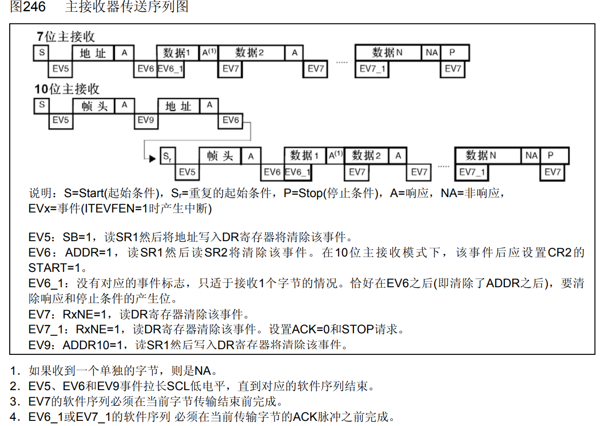

这里提供I2C_CR1寄存器一些相关位的描述，方便读者分析：

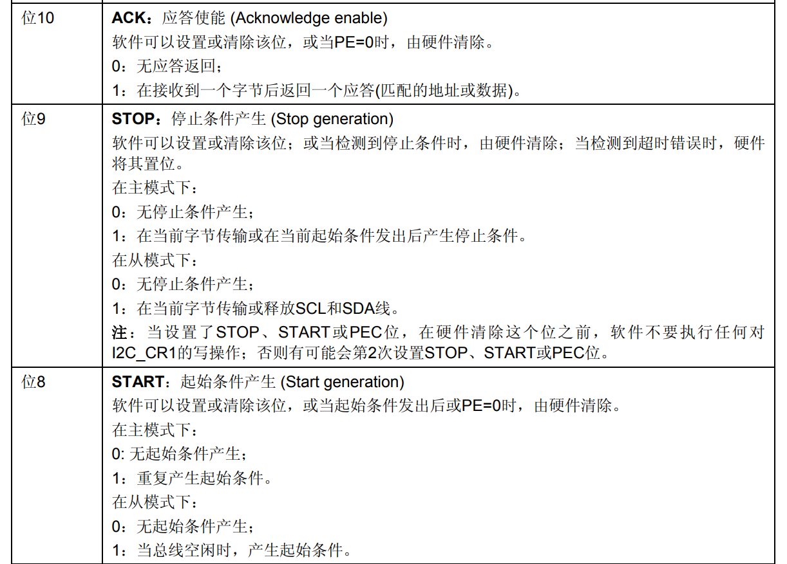

这里提供I2C_SR1寄存器一些相关位的描述，方便读者分析：

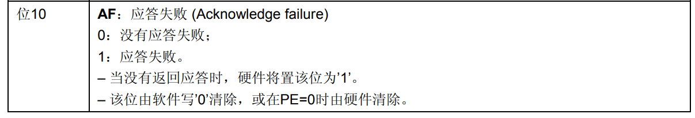

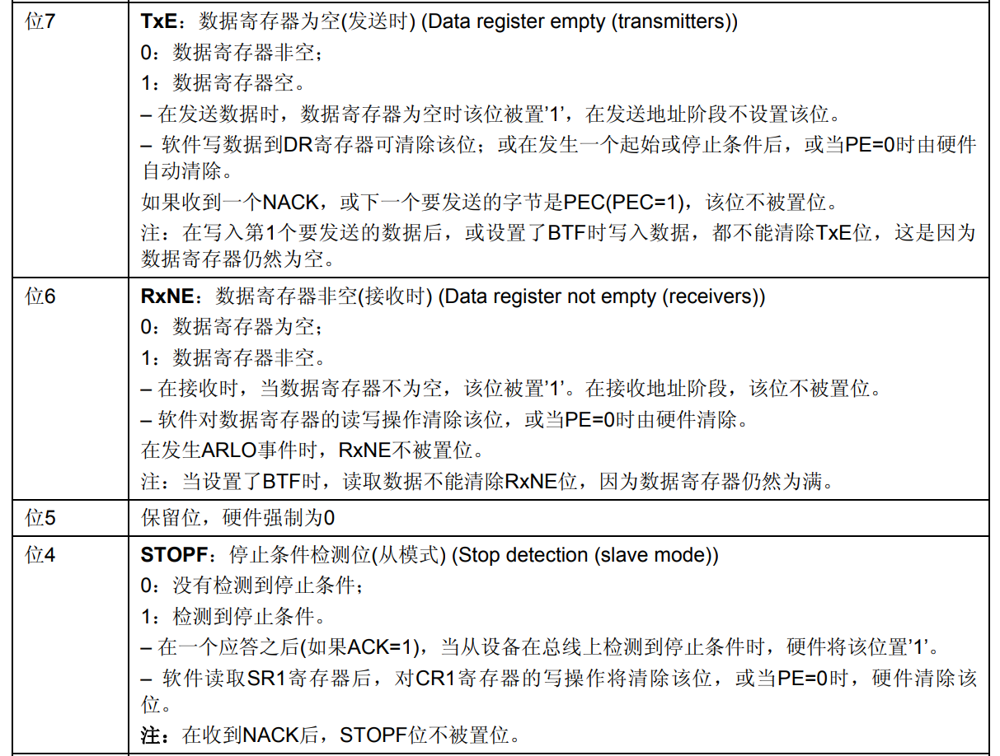

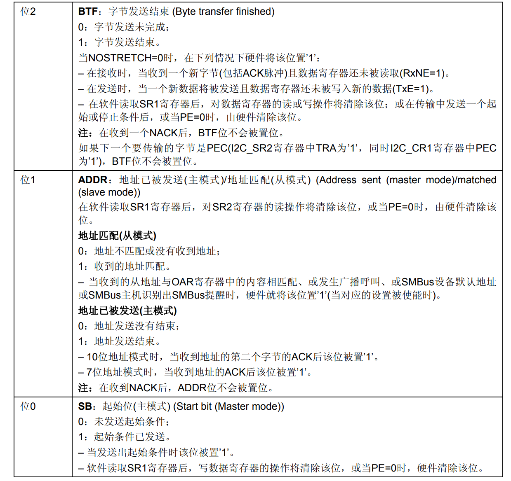

这里提供I2C_SR2寄存器一些相关位的描述，方便读者分析：

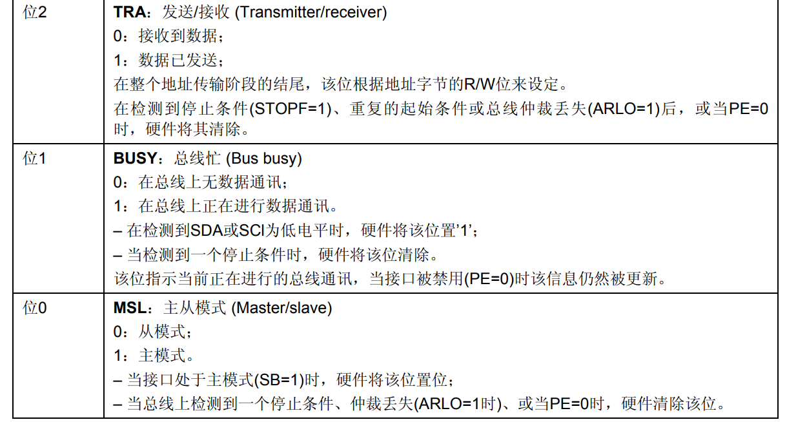

### 库函数实现代码

在实现硬件I2C时，需要将SCL、SDA所在GPIO的引脚都配置为开漏复用输出的模式，复用是为了将IO口控制权交给片上外设，开漏是为了遵循协议。开漏的具体原因在软件部分也进行过深入探讨，这里就不过多赘述。

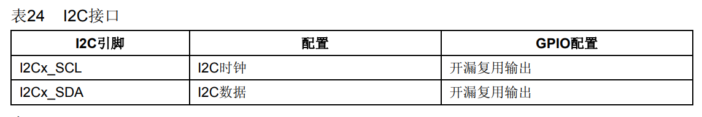

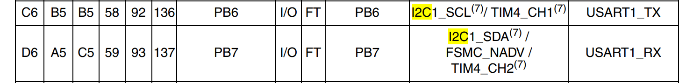

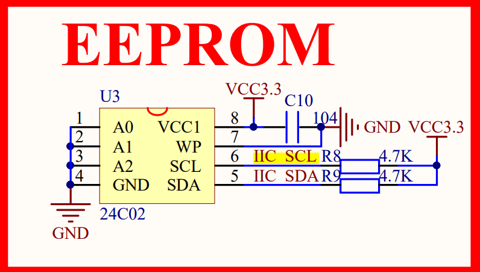

**在写硬件实现I2C的代码的时候，出现了一个非常奇怪的BUG，在第一次执行Lunar_GetRegistryByte时，程序一直卡在Lunar_GetRegistryByte函数的第一个while循环中，查了半天发现是START位发不出去，因为BUSY一直是被置位（总线被拉低，一直处于通信状态）的状态。然后检测Lunar_I2CInit函数，发现只要一开启I2C1时钟，BUSY就是被置位的状态。经过百度，在I2C被初始化前，使用I2C_SoftwareResetCmd库函数进行一次复位才得以解决。**

**最后需要注意的是使用I2C_Send7bitAddress函数发送设备地址需要注意提前将地址左移一位，因为I2C_Send7bitAddress函数的实现它是直接在你提供的设备地址末尾置读写位的。**

硬件实现核心代码如下：

```c
/**
 * @description: I2C端口GPIO初始化
 * @return {*}
 */
void Lunar_I2CInit(void) {
	GPIO_InitTypeDef GPIOB_Cfg;

	I2C_InitTypeDef I2C1_Cfg;
	// PA
	RCC_APB2PeriphClockCmd(RCC_APB2Periph_GPIOB, ENABLE);

	// 两个引脚都配置为复用开漏输出
	GPIOB_Cfg.GPIO_Mode = GPIO_Mode_AF_OD;
	GPIOB_Cfg.GPIO_Pin = GPIO_Pin_6 | GPIO_Pin_7;
	GPIOB_Cfg.GPIO_Speed = GPIO_Speed_50MHz;
	GPIO_Init(GPIOB, &GPIOB_Cfg);


	// 开启I2C1时钟
	RCC_APB1PeriphClockCmd(RCC_APB1Periph_I2C1, ENABLE);

	I2C1_Cfg.I2C_Ack = I2C_Ack_Enable;									// 默认回复ACK
	I2C1_Cfg.I2C_AcknowledgedAddress = I2C_AcknowledgedAddress_7bit;	// 7bit设备地址
	I2C1_Cfg.I2C_ClockSpeed = 50000;									// 50KHZ
	I2C1_Cfg.I2C_DutyCycle = I2C_DutyCycle_2;							// 该位仅对100KHZ ~ 400KHZ的高速频率有效，我们设置的50KHZ其实不起作用，高频率模式下，从下降沿变换到上升沿有一个过程，所以需要适当增大占空比
	I2C1_Cfg.I2C_Mode = I2C_Mode_I2C;
	I2C1_Cfg.I2C_OwnAddress1 = 0x00;									// 随便自定义一个不冲突的主机设备地址
	// 必须使用软件对I2C进行复位，不然，I2C1的BUSY位一直会处于置位的状态！！！
	I2C_SoftwareResetCmd(I2C1, ENABLE);
	I2C_SoftwareResetCmd(I2C1, DISABLE);
	I2C_Init(I2C1, &I2C1_Cfg);
	
	I2C_Cmd(I2C1, ENABLE);	// 使能
	
	// I2C_GenerateSTOP(I2C1, ENABLE);
}


/**
 * @description: 获取指定设备指定寄存器地址的值
 * @param {uint8_t} device_addr：设备地址是7位
 * @param {uint8_t} registry_addr
 * @return {uint8_t}
 */
uint8_t Lunar_GetRegistryByte(uint8_t device_addr, uint8_t registry_addr) {
	uint8_t rt = 0;
	device_addr = device_addr << 1;
	// 发送起始位
	I2C_GenerateSTART(I2C1, ENABLE);

	// 等待EV5事件，
	// 也就是等待BUSY(SCL被拉低) & 
	// MSL（处于主模式，在start被发出硬件自动置位） & 
	// SB（start被发出） 被置位
	while(I2C_CheckEvent(I2C1, I2C_EVENT_MASTER_MODE_SELECT) != SUCCESS);
	// 发送设备地址
	I2C_Send7bitAddress(I2C1, device_addr, I2C_Direction_Transmitter);	// 写设备地址


	// 等待EV6（发送）事件，
	// 也就是BUSY（SCL被拉低）& 
	// MSL（处于主模式，在start被发出硬件自动置位）&
	// ADDR（设备地址已经发送，并且收到从机的ACK）&
	// TXE（发送寄存器为空） & 
	// TRA（发送模式，依据发送设备地址最后一位设置） 被置位。
	while(I2C_CheckEvent(I2C1, I2C_EVENT_MASTER_TRANSMITTER_MODE_SELECTED) != SUCCESS);
	// 这里有一个理论上的EV8_1事件，但是库函数没有对应的宏，大体意思就是发送寄存器和发送移位寄存器同时为空。起提示作用。
	// 发送寄存器地址
	I2C_SendData(I2C1, registry_addr);


	// 等待EV8_2事件，
	// 也就是TRA（发送模式，依据发送设备地址最后一位设置）& 
	// BUSY（SCL被拉低） & 
	// MSL（处于主模式，在start被发出硬件自动置位） & 
	// TXE（发送寄存器为空，收到从机的ACK回复才会置位）& 
	// BTF（数据寄存器和移位寄存器都为空）被置位。
	while(I2C_CheckEvent(I2C1, I2C_EVENT_MASTER_BYTE_TRANSMITTED) != SUCCESS);
	// Restart
	// 发送起始位
	I2C_GenerateSTART(I2C1, ENABLE);

	// 等待EV5事件，
	// 也就是等待BUSY(SCL被拉低) & 
	// MSL（处于主模式，在start被发出硬件自动置位） & 
	// SB（start被发出） 被置位
	while(I2C_CheckEvent(I2C1, I2C_EVENT_MASTER_MODE_SELECT) != SUCCESS);
	// 发送设备地址
	I2C_Send7bitAddress(I2C1, device_addr, I2C_Direction_Receiver);	// 读设备地址

	// 等待EV6（接收）事件，
	// 也就是BUSY（SCL被拉低）& 
	// MSL（处于主模式，在start被发出硬件自动置位）& 
	// ADDR（设备地址已经发送，并且收到从机的ACK） 被置位。
	while(I2C_CheckEvent(I2C1, I2C_EVENT_MASTER_RECEIVER_MODE_SELECTED) != SUCCESS);

	// EV6_1 / EV7_1 需要提前设置ack位和停止产生位。
	I2C_AcknowledgeConfig(I2C1, DISABLE);
	I2C_GenerateSTOP(I2C1, ENABLE);

	// 等待EV7，也就是BUSY（SCL被拉低）& 
	// MSL（处于主模式，在start被发出硬件自动置位）& 
	// RXNE（接收数据寄存器非空）被置位。
	while(I2C_CheckEvent(I2C1, I2C_EVENT_MASTER_BYTE_RECEIVED) != SUCCESS);
	// 接收从机发来的数据
	rt = I2C_ReceiveData(I2C1);

	// 恢复ACK确认
	I2C_AcknowledgeConfig(I2C1, ENABLE);
	return rt;
}


/**
 * @description: 设置指定设备指定寄存器地址的值
 * @param {uint8_t} device_addr
 * @param {uint8_t} registry_addr
 * @param {uint8_t} data
 * @return {*}
 */
void Lunar_SetRegistryByte(uint8_t device_addr, uint8_t registry_addr, uint8_t data) {
	device_addr = device_addr << 1;
	// 发送起始位
	I2C_GenerateSTART(I2C1, ENABLE);
	// 等待EV5事件，
	// 也就是等待BUSY(SCL被拉低) & 
	// MSL（处于主模式，在start被发出硬件自动置位） & 
	// SB（start被发出） 被置位
	while(I2C_CheckEvent(I2C1, I2C_EVENT_MASTER_MODE_SELECT) != SUCCESS);
	// 发送设备地址
	I2C_Send7bitAddress(I2C1, device_addr, I2C_Direction_Transmitter);	// 写设备地址


	// 等待EV6（发送）事件，
	// 也就是BUSY（SCL被拉低）& 
	// MSL（处于主模式，在start被发出硬件自动置位）& 
	// ADDR（设备地址已经发送，并且收到从机的ACK）& 
	// TXE（发送寄存器为空） & 
	// TRA（发送模式，依据发送设备地址最后一位设置） 被置位。
	while(I2C_CheckEvent(I2C1, I2C_EVENT_MASTER_TRANSMITTER_MODE_SELECTED) != SUCCESS);
	// 这里有一个理论上的EV8_1事件，但是库函数没有对应的宏，大体意思就是发送寄存器和发送移位寄存器同时为空。起提示作用
	// 发送寄存器地址
	I2C_SendData(I2C1, registry_addr);


	//  等待EV8事件，
	// 也就是TRA（发送模式，依据发送设备地址最后一位设置）& 
	// BUSY（SCL被拉低） & 
	// MSL（处于主模式，在start被发出硬件自动置位） & 
	// TXE（发送寄存器为空，收到从机的ACK回复才会置位）被置位。
	while(I2C_CheckEvent(I2C1, I2C_EVENT_MASTER_BYTE_TRANSMITTING) != SUCCESS);
	// 发送待写数据
	I2C_SendData(I2C1, data);


	//  等待EV8_2事件，也就是在EV8事件基础上多了一个BTF标志位，代表发送寄存器和发送移位寄存器都空了，数据线上也没有需要传输的数据了，该发的数据发干净了。
	while(I2C_CheckEvent(I2C1, I2C_EVENT_MASTER_BYTE_TRANSMITTED) != SUCCESS);
	// 发送停止位，请求停止传输
	I2C_GenerateSTOP(I2C1, ENABLE);
}
```


感谢江协科技提供的STM32教学视频。

感谢为STM32 f100ZET6中硬件I2C的问题提供解决方案的作者，原帖如下：[https://blog.csdn.net/jatamatadada/article/details/40860619](https://blog.csdn.net/jatamatadada/article/details/40860619)

---

**本章完结**