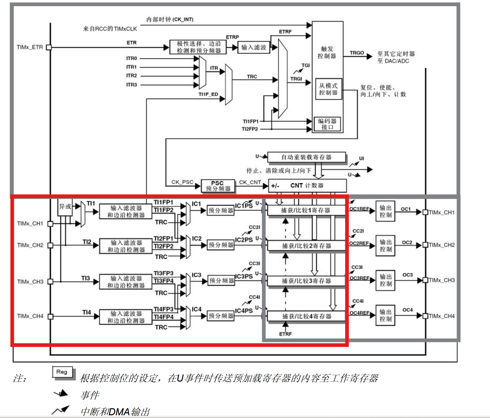
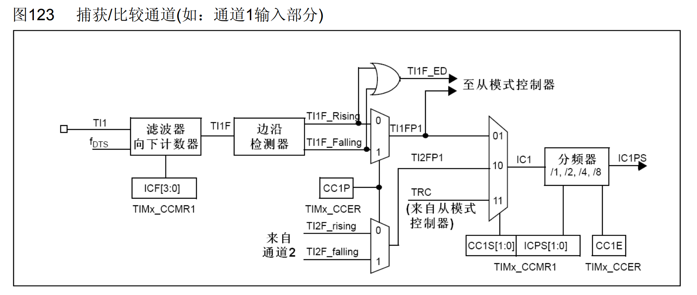
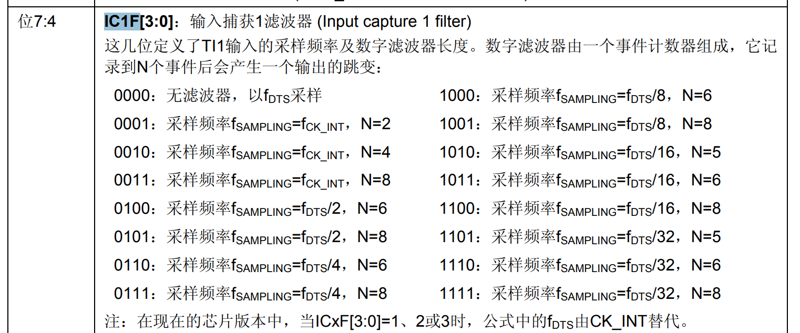
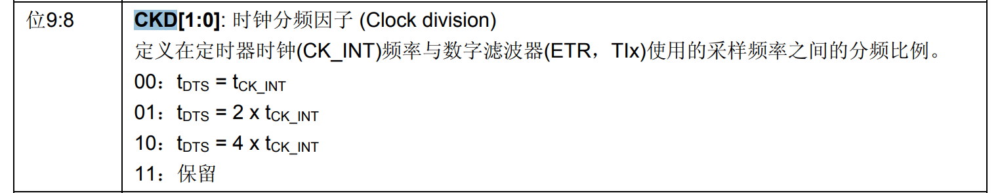
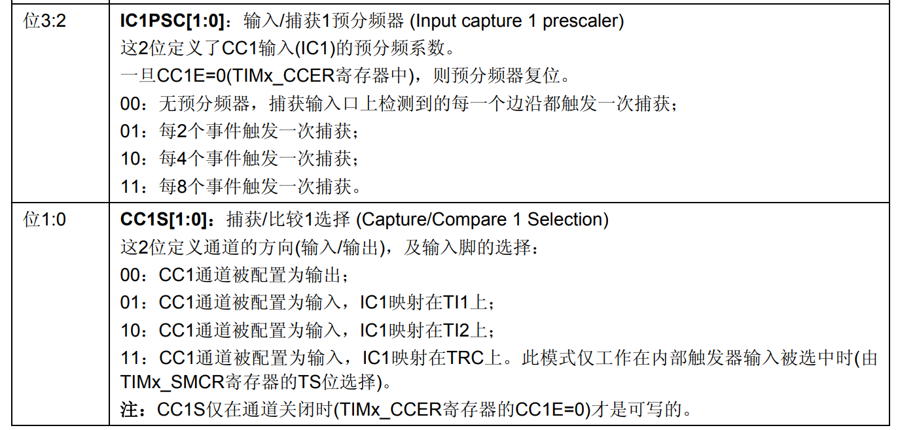
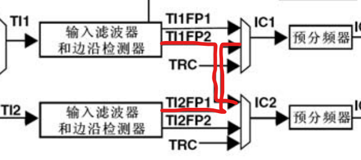
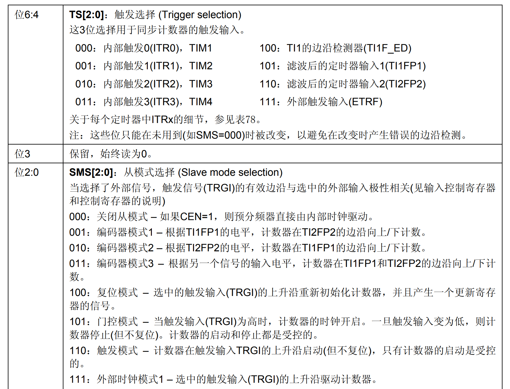
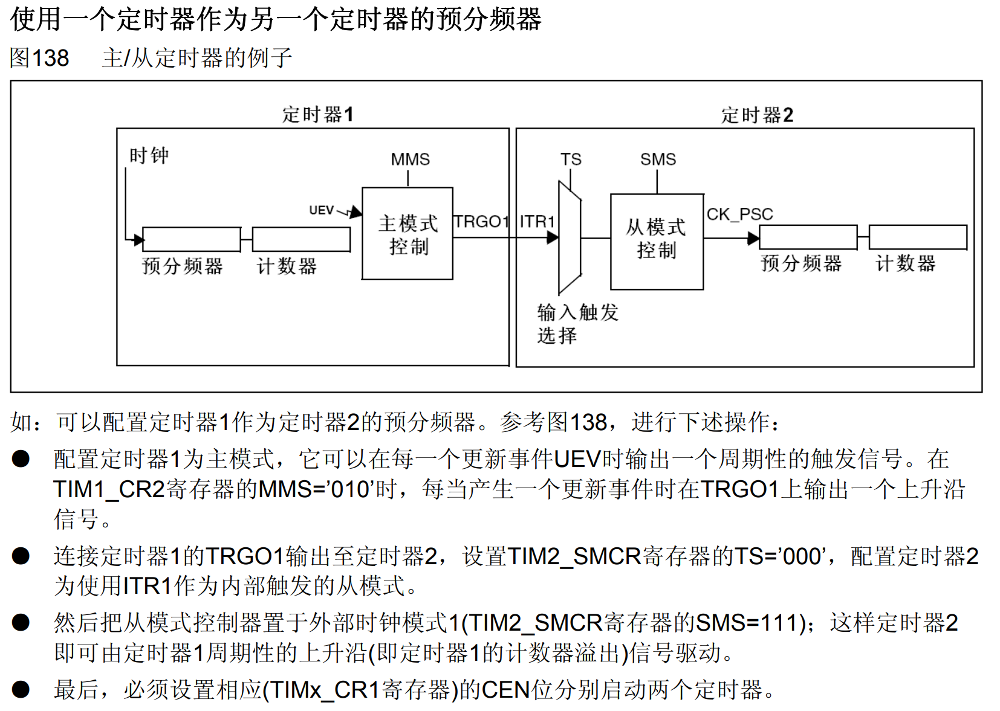
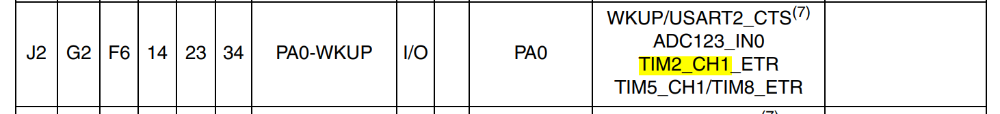
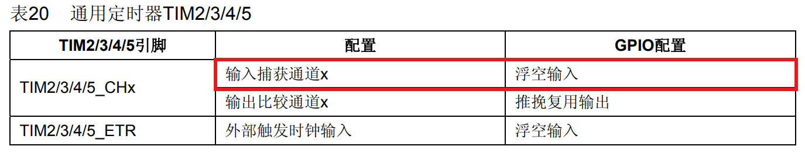

## 前言

本节主要讲解STM32利用通用定时器，在输入引脚出现指定电平跳变时，将CNT的值锁存到CCR寄存器当中，从而计算PWM波形的频率、占空比、脉冲间隔、电平持续时间等。其功能的应用有：波形采样。

## 导航

图98 通用定时器框图：



图片引自STM32 F1XX系列的中文参考手册。在通用定时器章节的定时器架构图中，本章讲解的定时器输入捕获功能位于左下角的红色矩形中。

## 定时器输入捕获的实现细节
<!-- more -->

参考中文手册，实现细节图123如下：



它内部实现是：根据用户设定的极性，采集输入方波信号上升沿/下降沿，将每次上升沿/下降沿的CNT寄存器的值抓取到CCR寄存器中，从而可以获取到输入信号的特性。

### 参考图123，从左向右介绍控制细节

对于一个通用定时器，有四个通道可作为输入（或输出），信号输入进来首先会经过滤波器进行滤波，消除不稳定的干扰信号，用户可以通过配置 `TIMx_CCMR1.IC1F[7:4]` 选择采样模式，可以以不同频率不同次数进行采样滤波。如下图。



采样可选频率来源有F_CK_INT和F_DTS。其中，F_CK_INT就是定时器的内部时钟（F103默认72M HZ），而F_DTS其实间接取自F_CK_INT的分频。通过配置 `TIMx_CR1.CKD[9:8]` 可设置F_DTS的分频系数。如下：



经过滤波器滤波后的信号在图123中被标记为TI1F，TI1F会传入中间部分的边沿检测器，边沿检测器会根据输入的TI1F分拣出波形的每个上升沿和下降沿，根据输入信号的每一个上升沿/下降沿，向上升沿输出引脚/下降沿引脚输出一个**小方波**，从而给后面的选择器进行选择，图中间部分有上下两个矩形，在中文手册中，所有类似这样的矩形都是选择器， `TIMx_CCER.CC1P[1]` 正是通过控制选择器来实现极性的选择。经过极性选择后的波形在图123被标记为TI1FP1。图中还有一个被标记为TI1F_ED的输出，TI1FP1和TI1F_ED的区别是前者是经过选择的上升沿**或**是下降沿的边沿指示信号，而后者是上升沿**和**下降沿的边沿指示信号，频率上来讲TI1F_ED会更高。注意这里边沿指示信号和源信号的区别，我最开始看这张图的中间部分就非常迷糊。

接着看右边最大的那个选择器，该选择器就是配置三路的哪一路作为IC1的输入。三路输入分别是：TI1FP1（对应TIMX_CH1）、TI2FP1（对应TIMX_CH2）、TRC（主从模式下，来自主定时器的信号），通过配置 `TIMx_CCMR1.CC1S[1:0]` 可以控制选择器选择哪一路。同时后面的预分频器可以通过 `TIMx_CCMR1.IC1PSC[3:2]` 来调节。如下图60：



最后配置使能寄存器 `TIMx_CCER.CC1E[0]` 就能使能定时器的输入啦！

### 精妙设计一

细心的读者在看到图98 红色矩形部分时，应该会注意通道TIMX_CH1和通道TIMX_CH2中间部分是存在交叉的，这里放一张特写图。



**这TI1FP1和TI1FP2的信号源都是来自TIMX_CH1，图123的描述其实有些瑕疵。TI1FP1和TI1FP2的信号源相同，并且可以分别独立的控制去选择极性。也就是说完整的图123应该是有两路TI1FP的，并且可以单独的控制其极性。** 如果只使用一路的捕获，我们一次只能测量信号源的频率；而有了这种交叉的设计，我们就可以实现对一个信号源，同时测量其频率和占空比。图60表述了将ICX映射到哪一路，通过配置 `TIMx_CCMR1.CC1S[1:0]` 可以选择。

### 精妙设计二

STM32 F1XX里面定时器的设计特别精妙，利用好定时器的主从模式可以实现硬件全自动化复位操作。比如：我们可以利用TI1FP1的信号实现定时器的自动复位，步骤如下：

1. 配置 `TIMx_SMCR.TS[6:4]` 为101，这样滤波后的定时器输入1(TI1FP1)作为定时器触发源。 这里的主次好像是两个定时器，但实际上都是一个定时器扮演。

2. 配置 `TIMx_SMCR.SMS[2:0]` 为100，这样在收到TI1FP1的触发信号就会将定时器复位。从而达到清零的目的。

涉及的寄存器如下：



此外，还可以实现定时器级联的效果，比如使用一个定时器作为另一个定时器的预分频。根据中文参考手册配置步骤如下：



除了上面提到的用法，定时器其实还要很多奇妙的用法。具体可以查询中文参考手册。中文参考手册很多东西写的其实非常详细了，就是初学者来说，可能很难耐心去阅读。这点真的要好好锤炼，中文都看不下去，更何况以后还要接触英文的。

## 定时器实现输入捕获的步骤

综上，可以总结出配置定时器输入部分的套路：

1. 通过 `TIMx_CCMR1.IC1F[7:4]` 配置滤波器，选择其频率和采样次数。

2. 通过 `TIMx_CCER.CC1P[1]` 配置要捕获的极性（上升沿还是下降沿）。

3. 通过 `TIMx_CCMR1.CC1S[1:0]` 可以配置图123中，右边那个最大的选择器，选择三路的哪一路作为IC1的来源。

4. 通过 `TIMx_CCMR1.IC1PSC[3:2]` 可以配置图123中，右边那个分频器的分频系数。

5. 通过 `TIMx_CCER.CC1E[0]` 可以使能捕获输入。

## 定时器实现输入捕获的库函数实现

**本节输入捕获实验会复用定时器输出PWM（输出在PB5口）的呼吸灯实验的代码，经过查表，会将原PB5端口输出的PWM信号使用杜邦线，引到PA0端口并且作为TIM2定时器输入。** IO口需要的配置如下：





核心代码如下：

```c
void LunarInitTIM3() {
	GPIO_InitTypeDef GPIOB5_Cfg;

	TIM_TimeBaseInitTypeDef TIM3_Cfg;
	TIM_OCInitTypeDef TIM3_OCCfg;

	// 配置GPIO 	BEGIN

	// 开启复用时钟
	RCC_APB2PeriphClockCmd(RCC_APB2Periph_AFIO, ENABLE);
	// 部分重映射
	GPIO_PinRemapConfig(GPIO_PartialRemap_TIM3, ENABLE);
	// 初始化GPIOB5为推挽复用输出
	RCC_APB2PeriphClockCmd(RCC_APB2Periph_GPIOB, ENABLE);

 	GPIOB5_Cfg.GPIO_Mode = GPIO_Mode_AF_PP;
 	GPIOB5_Cfg.GPIO_Pin = GPIO_Pin_5;
 	GPIOB5_Cfg.GPIO_Speed = GPIO_Speed_2MHz;

 	GPIO_Init(GPIOB, &GPIOB5_Cfg);

	// 配置GPIO 	END


    // 定时器时基配置   BEGIN

	// 打开TIM3所需要的时钟 APB1
	RCC_APB1PeriphClockCmd(RCC_APB1Periph_TIM3, ENABLE);
	TIM_TimeBaseStructInit(&TIM3_Cfg);
	// 配置使用内部时钟 72M Hz
	TIM_InternalClockConfig(TIM3);

    // 这里配置定时器更新频率是1000HZ
	TIM3_Cfg.TIM_CounterMode = TIM_CounterMode_Up;
	TIM3_Cfg.TIM_Period = 100 - 1;
	TIM3_Cfg.TIM_Prescaler = 720 - 1;

	TIM_TimeBaseInit(TIM3, &TIM3_Cfg);
	// 因为TIM_TimeBaseInit会置TIMx_EGR.UG[0]为1，产生一个更新事件，
	// 去同步影子寄存器的值，而该更新事件又会产生一个多余的中断，所以，
	// 我们需要在开启中断之前，手动清楚更新事件标志位
	TIM_ClearFlag(TIM3, TIM_FLAG_Update);

    // 定时器时基配置   END

	// 配置TIM3的PWM输出	BEGIN

	TIM_OCStructInit(&TIM3_OCCfg);

	TIM3_OCCfg.TIM_OCMode = TIM_OCMode_PWM1;
	TIM3_OCCfg.TIM_OCPolarity = TIM_OCPolarity_High;
	TIM3_OCCfg.TIM_OutputState = TIM_OutputState_Enable;
	TIM3_OCCfg.TIM_Pulse = 80;

	TIM_OC2Init(TIM3, &TIM3_OCCfg);

	// 配置TIM3的PWM输出	END

	// 使能arr和ccr寄存器的影子功能
	TIM_OC2PreloadConfig(TIM3, TIM_OCPreload_Enable);
	TIM_ARRPreloadConfig(TIM3, ENABLE);

	// 使能更新中断
	// TIM_ITConfig(TIM3, TIM_IT_Update, ENABLE);
	// 开启定时器
	TIM_Cmd(TIM3, ENABLE);
}

void LunarInitTIM2() {
	GPIO_InitTypeDef GPIOA0_Cfg;

	TIM_TimeBaseInitTypeDef TIM2_Cfg;
	TIM_ICInitTypeDef TIM2_IC1Cfg, TIM2_IC2Cfg;

	// 配置GPIO 	BEGIN

	RCC_APB2PeriphClockCmd(RCC_APB2Periph_GPIOA, ENABLE);

	GPIOA0_Cfg.GPIO_Mode = GPIO_Mode_IN_FLOATING;
 	GPIOA0_Cfg.GPIO_Pin = GPIO_Pin_0;
 	GPIOA0_Cfg.GPIO_Speed = GPIO_Speed_2MHz;
 	GPIO_Init(GPIOA, &GPIOA0_Cfg);

	// 配置GPIO 	END

    // 定时器时基配置   BEGIN

	// 打开TIM2所需要的时钟 APB1
	RCC_APB1PeriphClockCmd(RCC_APB1Periph_TIM2, ENABLE);
	TIM_TimeBaseStructInit(&TIM2_Cfg);
	// 配置使用内部时钟 72M Hz
	TIM_InternalClockConfig(TIM2);

    // 这里配置定时器更新频率是1000HZ
	TIM2_Cfg.TIM_CounterMode = TIM_CounterMode_Up;
	// TIM2_Cfg.TIM_Period = 100 - 1;
	TIM2_Cfg.TIM_Period = 0xffff;
	TIM2_Cfg.TIM_Prescaler = 720 - 1;

	TIM_TimeBaseInit(TIM2, &TIM2_Cfg);
	TIM_ClearFlag(TIM2, TIM_FLAG_Update);

	// 定时器时基配置   END

	// 配置TIM2进行输入捕获		BEGIN

	TIM_ICStructInit(&TIM2_IC1Cfg);
	TIM_ICStructInit(&TIM2_IC2Cfg);

	TIM2_IC1Cfg.TIM_Channel = TIM_Channel_1;
	TIM2_IC1Cfg.TIM_ICFilter = 0x4;
	TIM2_IC1Cfg.TIM_ICPolarity = TIM_ICPolarity_Rising;
	TIM2_IC1Cfg.TIM_ICPrescaler = TIM_ICPSC_DIV1;
	TIM2_IC1Cfg.TIM_ICSelection = TIM_ICSelection_DirectTI;
	TIM_ICInit(TIM2, &TIM2_IC1Cfg);

	// 实现同时捕获上升下降沿。
	TIM2_IC2Cfg.TIM_Channel = TIM_Channel_2;
	TIM2_IC2Cfg.TIM_ICFilter = 0x4;
	TIM2_IC2Cfg.TIM_ICPolarity = TIM_ICPolarity_Falling;
	TIM2_IC2Cfg.TIM_ICPrescaler = TIM_ICPSC_DIV1;
	TIM2_IC2Cfg.TIM_ICSelection = TIM_ICSelection_IndirectTI;
	TIM_ICInit(TIM2, &TIM2_IC2Cfg);

	// 配置TIM2进行输入捕获		END

	// 利用从模式配置自动重置。
	TIM_SelectInputTrigger(TIM2, TIM_TS_TI1FP1);
	TIM_SelectSlaveMode(TIM2, TIM_SlaveMode_Reset);

	// 使能arr寄存器的影子功能	// ccr寄存器只读
	TIM_ARRPreloadConfig(TIM2, ENABLE);


	// 使能更新中断
	// TIM_ITConfig(TIM2, TIM_IT_Update, ENABLE);
	// 开启定时器
	TIM_Cmd(TIM2, ENABLE);
}


int main() {
	// 初始化串口
	LunarInitUSART1();

	// 初始化定时器
	LunarInitTIM3();
	LunarInitTIM2();

	SYSTick_Init();
	int dir = 0, cr = 0;
	while(1) {
		Delay_Ms(100);

		printf("PWM f = %d ", 100000 / (TIM_GetCapture1(TIM2) + 1));
		printf("PWM f = %f \n", (float)(TIM_GetCapture2(TIM2) + 1) / (TIM_GetCapture1(TIM2) + 1));
	}

	return 0;
}
```

> 实验结果就是从串口中，我们可以看到PB5输出的PWM波形的频率和占空比值。

---

**本章完结**