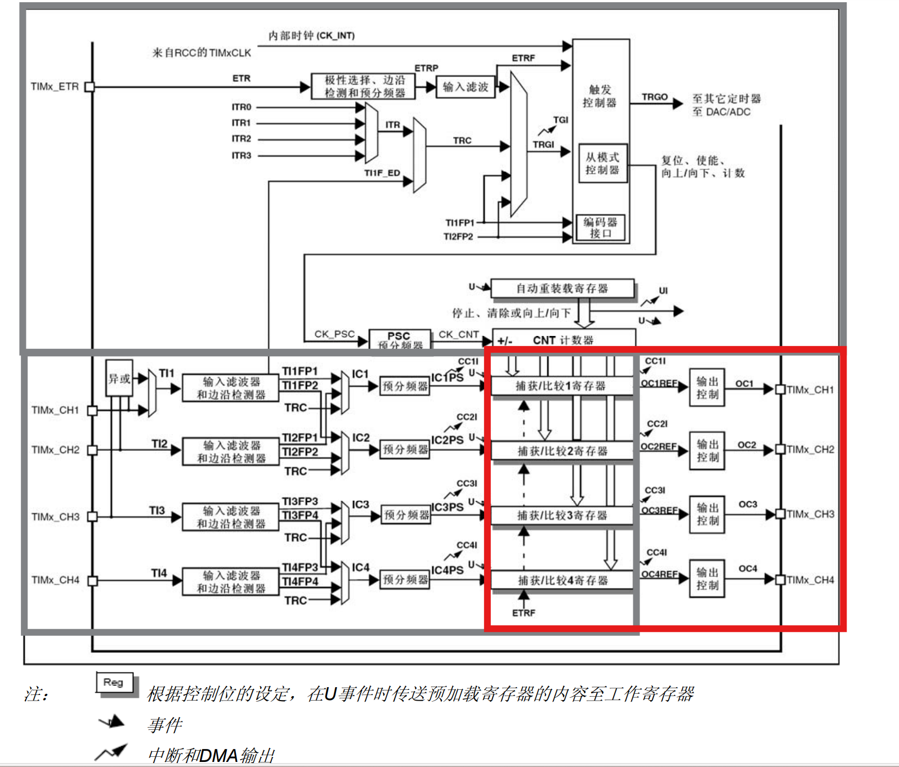
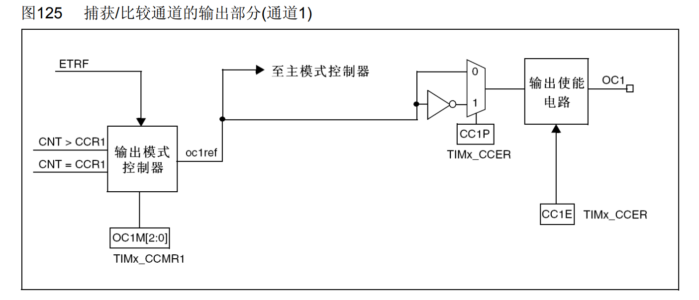
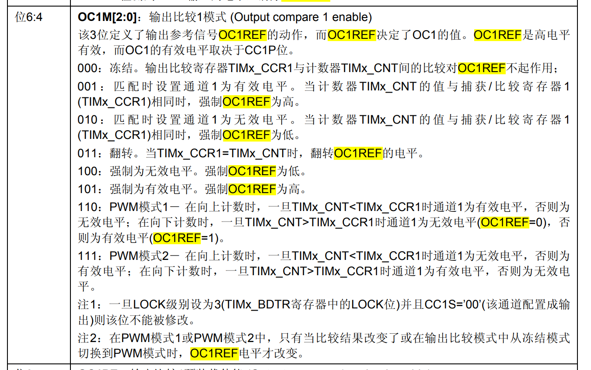
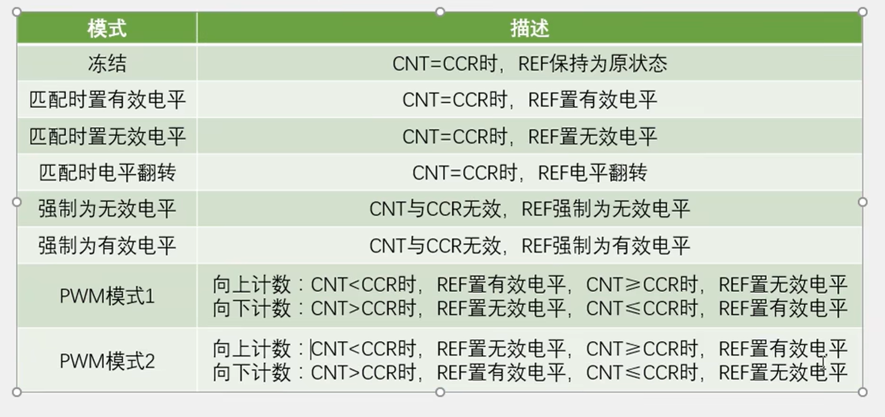
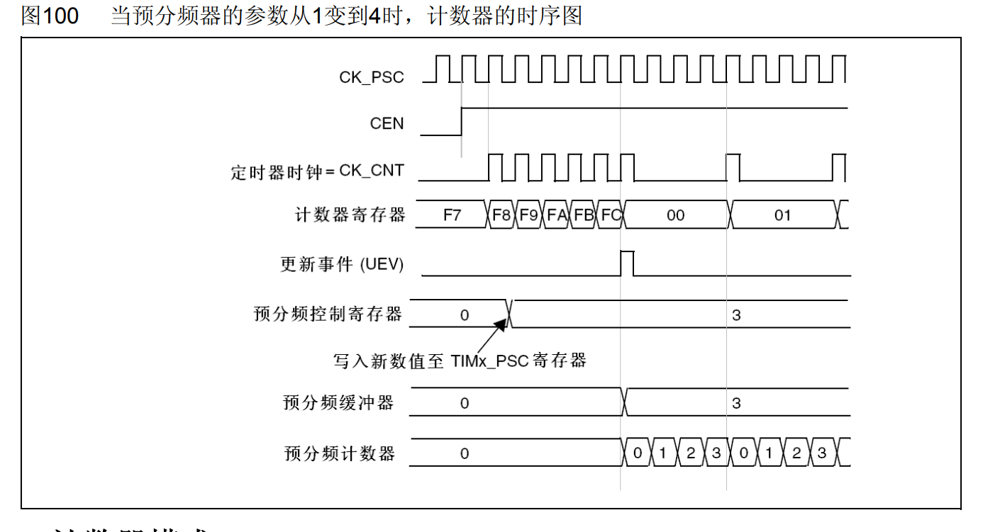
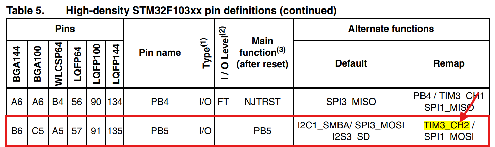
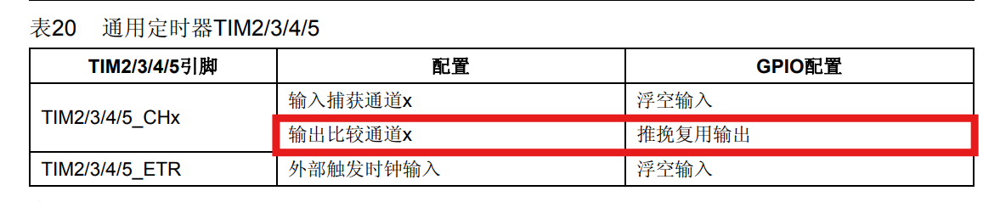

## 前言

本节主要讲解STM32利用通用定时器，利用CCR和CNT寄存器，输出指定占空比和频率的PWM波形。其功能的应用有：实现LED呼吸灯的效果、控制步进电机、控制直流电机转速等。

## 导航

图98 通用定时器框图：



图片引自STM32 F1XX系列的中文参考手册。在通用定时器章节的定时器架构图中，本章讲解的定时器输出功能位于右下角的红色矩形中。

## 定时器实现PWM输出的实现细节
<!-- more -->

参考中文手册，实现细节图125如下：



它内部实现是：输出模式控制器通过比较TIMx_CCR1（比较捕获寄存器）和TIMx_CNT（计数器）的值，由输出模式控制器来确定输出高（有效）电平，还是低（无效）电平，用户可以通过改变TIMx_CCR1寄存器的值来改变PWM的占空比。这通常会将输出模式控制器配置成PWM模式1或PWM模式2，两种模式就是互为取反的关系，同时这两种模式也是输出模式控制器最常用的配置。

**对于原理图125左侧的输出模式控制器：**

该部分作用是：控制输出模式控制器的输出行为。这里将输出模式控制器的输出标记为OC1REF。

输出模式控制器有7种配置，这些配置是通过操作 `TIMx_CCMR1.OC1M[6:4]` 实现，7种配置在中文手册中的描述如下，手册中的描述可能太晦涩，配合江科的表格会更友好：





**对于原理图125右侧：**

右侧包括一个极性选择器和输出使能电路。

该部分作用是：1、对输出电压的极性进行控制。2、控制输出电路的使能。

我们可以通过配置 `TIMx_CCER.CC1P[1]` 控制选择器是直接选择OC1REF波形（输出模式控制器的输出）还是选择OC1REF的反相波形。也就是说，输出模式控制器配置成PWM1/WPM2可以实现对OC1REF的反相，配置 `TIMx_CCER.CC1P[1]` 间接配置选择器也能实现对OC1REF的反相。通过配置 `TIMx_CCER.CC1E[0]` 可以实现对输出电路的使能。

由定时器输出PWM的原理可以得出**调节占空比的公式**，PWM频率就是定时器溢出的周期、占空比就是TIMx_CCR1的值，其计算公式如下：


关于定时器的PWM模块还需提一句的是，有三个寄存器存在缓冲寄存器/影子寄存器的概念的，这三个寄存器分别是：ARR、PSC、CCRx。影子寄存器的存在延续旧值的生命周期，这样让旧值继续该时期的使命。如果用户提供的新值立马生效，系统就会出于一种未定义的状态。有了缓冲寄存器/影子寄存器的概念，**在一个更新周期中真正起作用的是影子寄存器，而用户想要修改预分频控制寄存器，会先将值写到缓冲器中，待这个更新周期过去，才会将缓冲器的值给到影子寄存器**

下面中文手册的的两张时序图可以很好的说明了：



缓冲寄存器 ----> 预分频控制寄存器

影子寄存器 ----> 预分频缓冲器

**还需注意的是：`TIMx_CR1.ARPE[7]`、`TIMx_CCMR1.OC1PE[3]`寄存器可以让用户选择ARR、CCRx是否启用影子寄存器的功能，而PSC寄存器默认必须使用影子寄存器的功能，但是用户可以通过TIM_PrescalerConfig函数动态配置计数器的预分频系数，它的第三个参数可以选择TIM_PSCReloadMode_Immediate，这会让定时器立即产生一个更新事件，间接实现了立即更新的效果。**

## 定时器实现PWM输出的步骤

综上，可以总结出配置定时器输出部分的套路：

1. 我们需要把 `TIMx_CCMR1.CC1S[1:0]` 配置为00，这样CC1通道就被配置为输出

2. 通过配置 `TIMx_CCMR1.OC1M[6:4]` ，这里将输出模式控制寄存器配置成PWM1模式。即110。

3. 配置原理图右部分是否开启反相 `TIMx_CCER.CC1P[1]` ，这里配置为0不反相。

4. 最后使能 `TIMx_CCER.CC1E[0]` 位，来使能原理图右边的输出使能电路。

一般的话，我门还会配置 `TIMx_CCMR1.OC1PE[3]` 、 `TIMx_CR1.ARPE[7]`，分别启用TIMx_CCR1、TIMx_ARR寄存器的影子功能。

## 定时器实现PWM输出的库函数实现

因为我的开发板LED0被焊在了PB5所以，所以需要将定时器的PWM波形输出到PB5上。经过查表需要对TIM3_CH2输出进行一个重映射；此外还要将PB5配置成复用推挽输出的状态。





定时器PWM输出配置，实例代码如下：

```c
void LunarInitTIM3() {
	TIM_TimeBaseInitTypeDef TIM3_Cfg;
	GPIO_InitTypeDef GPIOB5_Cfg;
	TIM_OCInitTypeDef TIM3_OCCfg;

    // 定时器时基配置   BEGIN

	// 打开TIM3所需要的时钟 APB1
	RCC_APB1PeriphClockCmd(RCC_APB1Periph_TIM3, ENABLE);
	TIM_TimeBaseStructInit(&TIM3_Cfg);
	// 配置使用内部时钟 72M Hz
	TIM_InternalClockConfig(TIM3);

    // 这里配置定时器更新频率是1000HZ
	TIM3_Cfg.TIM_CounterMode = TIM_CounterMode_Up;
	TIM3_Cfg.TIM_Period = 100 - 1;
	TIM3_Cfg.TIM_Prescaler = 720 - 1;

	TIM_TimeBaseInit(TIM3, &TIM3_Cfg);
	// 因为TIM_TimeBaseInit会置TIMx_EGR.UG[0]为1，手动产生一个更新事件，
	// 同时会同步影子寄存器的值，而该更新事件又会产生一个多余的中断，所以，
	// 我们需要在开启中断之前，手动清楚更新事件标志位
	TIM_ClearFlag(TIM3, TIM_FLAG_Update);

    // 定时器时基配置   END


	// 配置GPIO 	BEGIN

	// 开启复用时钟
	RCC_APB2PeriphClockCmd(RCC_APB2Periph_AFIO, ENABLE);
	// 部分重映射
	GPIO_PinRemapConfig(GPIO_PartialRemap_TIM3, ENABLE);
	// 初始化GPIOB5为推挽复用输出
	RCC_APB2PeriphClockCmd(RCC_APB2Periph_GPIOB, ENABLE);

 	GPIOB5_Cfg.GPIO_Mode = GPIO_Mode_AF_PP;
 	GPIOB5_Cfg.GPIO_Pin = GPIO_Pin_5;
 	GPIOB5_Cfg.GPIO_Speed = GPIO_Speed_2MHz;

 	GPIO_Init(GPIOB, &GPIOB5_Cfg);

	// 配置GPIO 	END


	// 配置TIM3的PWM输出	BEGIN

	TIM_OCStructInit(&TIM3_OCCfg);

	TIM3_OCCfg.TIM_OCMode = TIM_OCMode_PWM1;
	TIM3_OCCfg.TIM_OCPolarity = TIM_OCPolarity_High;
	TIM3_OCCfg.TIM_OutputState = TIM_OutputState_Enable;
	TIM3_OCCfg.TIM_Pulse = 0;

	TIM_OC2Init(TIM3, &TIM3_OCCfg);

	// 配置TIM3的PWM输出	END

	// 使能arr和ccr寄存器的影子功能
	TIM_OC2PreloadConfig(TIM3, TIM_OCPreload_Enable);
	TIM_ARRPreloadConfig(TIM3, ENABLE);

	// 使能更新中断
	// TIM_ITConfig(TIM3, TIM_IT_Update, ENABLE);
	// 开启定时器
	TIM_Cmd(TIM3, ENABLE);
}

int main() {

	// 初始化定时器
	LunarInitTIM3();
    // 初始化系统定时器
	SYSTick_Init();

	int dir = 0, cr = 0;

	while(1) {
		TIM_SetCompare2(TIM3, cr);
		Delay_Ms(20);

		if (dir == 0) {
			cr++;
			if (cr > 99) {
				dir = 1;
				cr = 99;
			}
		} else {
			cr--;
			if (cr < 0) {
				dir = 0;
				cr = 0;
			}
		}
	}

	return 0;
}
```

> 实验结果就是PB5处的LED灯实现了呼吸的效果。

---

**本章完结**