## 前言

USART串口传输能实现信息在设备之间的点对点传输，支持单工、半双工、全全双工，一般是有三个引脚：TX、RX、SW_RX（共地）。不需要一根线来同步时钟。最大优点是可以和电脑通信，实现程序调试的功能。

## 导航

图248 USART框图：

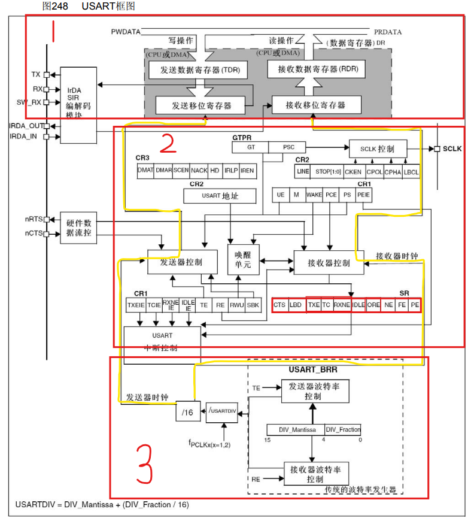

图片引自STM32 F1XX系列的中文参考手册。

## USART发送和接收的实现细节
<!-- more -->

### 第一部分

首先，对于图248的1号矩形框部分。该部分负责数据的发送和接收。（类似人体的四肢

截取了中文手册有关USART的一幅时序图，如下：

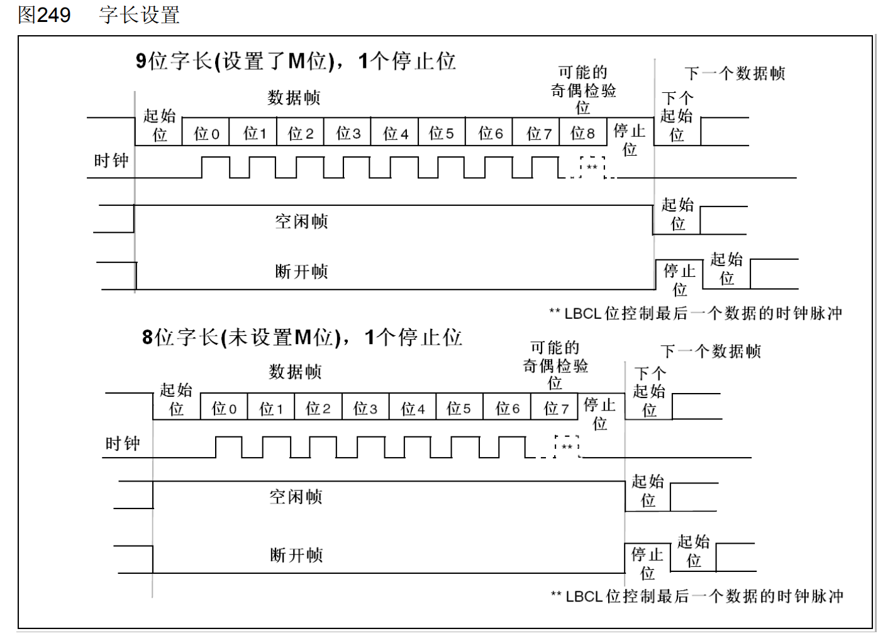

**首先解释一下空闲帧和断开帧：**

从图中可以看到，空闲帧包括了停止位。而断开帧是10位低电平，后跟停止位(当m=0时)；或者11位低电平，后跟停止位(m=1时)。不可能传输更长的断开帧(长度大于10或者11位)。

**发送流程：**

0. 引脚处于空闲状态时，一般是高电平状态。发送使能位被使能：`USART_CR1.TE[3]` 位被置为1。

1. （由用户）数据写到发送数据寄存器。在写之前，用户会等待 `USART_SR.TXE[7]` 被硬件置位，只有该位被置为才说明发送数据寄存器为空，此时写入数据就是安全的，不会造成覆盖的问题。

2. （以下步骤都是由硬件完成）将发送数据寄存器的内容移到发送移位寄存器，同时将`USART_SR.TXE[7]` 置位。以示发送数据寄存器为空。

3. 发送一个起始位。（低电平）

4. 从最低位开始，左移位将发送移位寄存器的值按位发送到TX引脚（对发送方）。

5. 如果用户使能了 `USART_CR1.PCE[10]` ，会根据 `USART_CR1.PS[9]` 发送一个校验位。

6. 最后，根据 `USART_CR2.STOP[13:12]` 的配置发送若干个停止位。(高电平)

7. 将状态寄存器 `USART_SR.TC[6]` 置位，表示数据的一帧发送完成。

**接收流程：**

0. 接收使能位被使能：`USART_CR1.RE[2]`。

1. （以下未特别说明，都是由硬件完成）从RX引脚（对接收方）检测到起始位，接收移位寄存器准备接收数据。

2. 接收移位寄存器从最高位开始，左移位依次按位从RX引脚（对接收方）接收数据。

3. 接收到停止位。

4. 如果使能了校验位的话，根据配置进行数据校验。

5. 校验合格的话，就将接收移位寄存器的值移到接收数据寄存器。

6. 将 `USART_SR.RXNE[5]` 置位，表示接收数据寄存器非空，提醒用户接收到数据了。

7. （由用户）读取接收数据寄存器的数据。


**注意：**

- 虽然用户可以操作的寄存器只有一个USART_DR，但是实际上发送和接收数据寄存器在硬件上是各自一个！这样的设计也是双缓冲的实践。

- 在发送和接收数据之前，用户必须**统一设置**两端的波特率、校验方式、停止位的数量、字长。否则这四项数据不一致，一定会造成传输错误，导致传输无法进行。其原因从上面的传输流程很容易推断。

有关状态寄存器的位的解释如下：

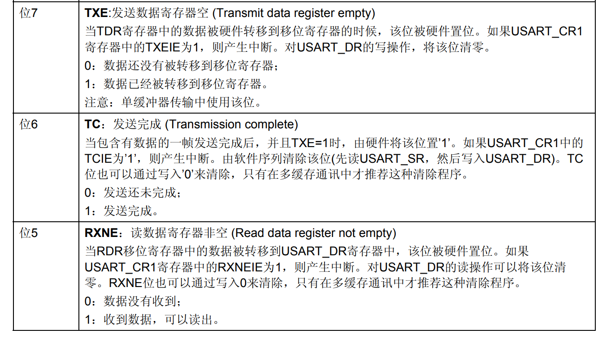

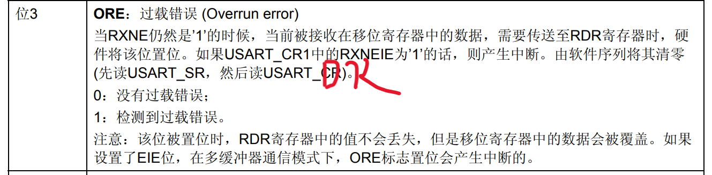

上面对过载错误位做了一个特写。这是因为我再编码的过程中遇到的一个BUG。排查了半天，原因是当RXNEIE接收中断位使能时，发送方的ORE标志位和RXNE标志位的置位都会触发RXNE事件的中断，当中断处理函数在处理完毕后，只复位RXNE标志，而不管ORE，后续还是会不断的产生中断。**所以根据手册（手册其实是有误的），我们需要先读USART_SR，在读USART_DR将ORE标志位清除。（注意！库函数Clear类函数不能清楚ORE位！）**，这里放一张中断请求对应的事件表：

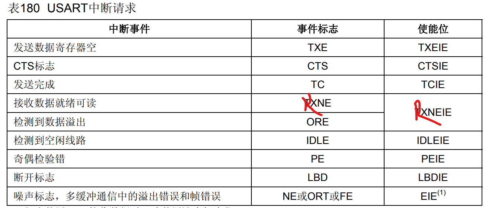

### 第二部分

对于图248的2号矩形框部分。该部分负责接收和发送的控制，（类似人体大脑。

图中可以看到有很多的控制器、控制寄存器、标志寄存器等。我们可以设置相应的寄存器从而控制收发来实现一些功能。具体寄存器的功能可以参考中文手册，这里不过多赘述。

### 第三部分

对于图248的3号矩形框部分。该部分负责控制接收和发送的时钟。接收和发送的时钟也称之为波特率，通过波特率，通信双方就能协调其收发的频率（类似人体心脏。

从图248的3号矩形框部分，可知，发送和接受器时钟是相等的。而时钟最开始是来自F_PCLK，送和接受器的时钟是对F_PCLK进行了一个 (16 * USARTDIV) 分频，USARTDIV是一个可调的定点小数。

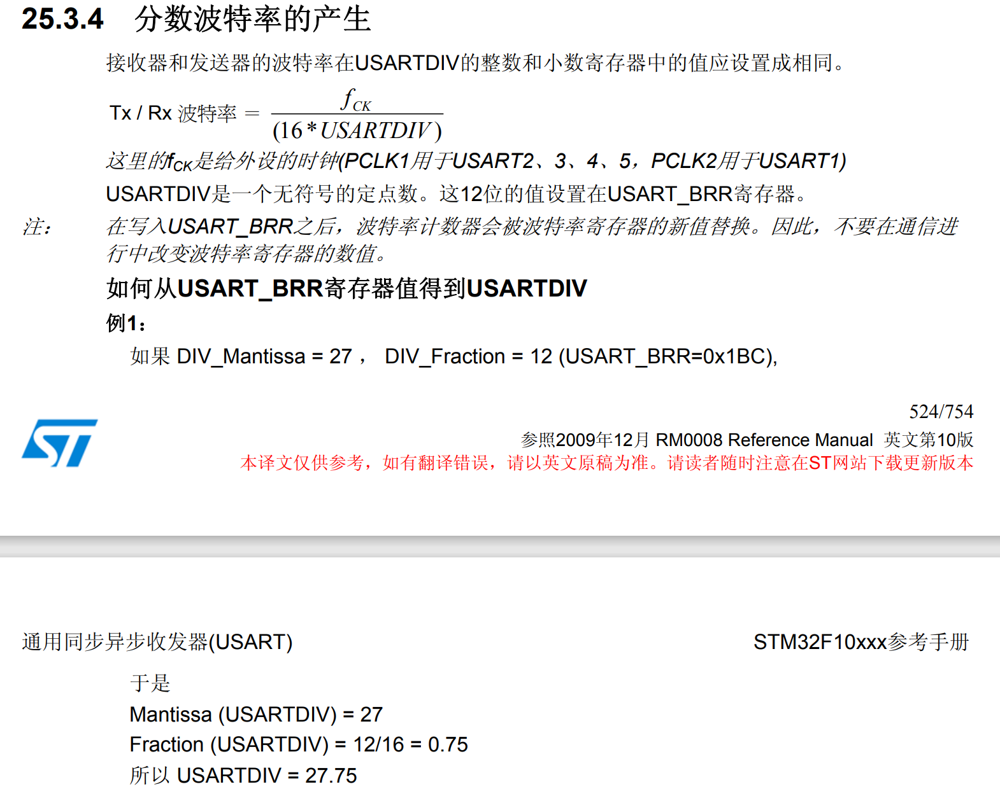

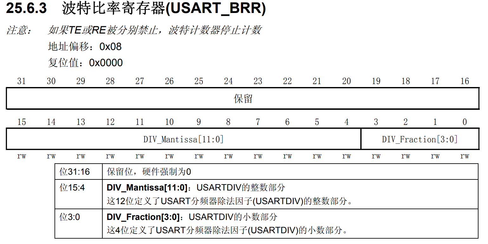

这里解释一下中文手册里面“**如何从USART_BRR寄存器值得到USARTDIV**”的示例一。 最开始看到这个例子我也是很懵的，什么是定点小数？这是怎么用整数来表示小数的？为什么 **<Fraction (USARTDIV) = 12/16 = 0.75>** 这里要除以16？原理是这样的：

USART_BRR寄存器里面按定点小数的方式存放USARTDIV的值。只使用了16位，高12位存放小数的整数部分，低4位存放的是小数部分。整数部分很好说，直接存放进去就好了。而小数部分呢，因为小数部分一定是小于1的，所以，它根据低4位所能代表的值，将1划分成了2^4份，也就是16份，每一份占1/16，所以我们要将小数部分表示成4位整数就将小数乘以16并向上取整即可。溢出的话就向整数部分进一。反之，要从4位整数还原小数，就用4位整数乘以1/16。

中文手册总结了一个公式：

波特率 = F_PCLK / (16 * USARTDIV)

**通信必须维持相同的波特率。双方各自通过调节USARTDIV，就可以在不同环境下将双方但的波特率调成一样的。**

此外，还应该说明的是，公式中，有一个乘以 1 / 16 的操作，这么做的目的是发送接收控制器里面有一个比波特率大16倍的采样频率。采样频率起到很好的滤波效果，它会对每一位进行16次采样。采样对于**起始位**的探测非常的精妙。并且，对于**数据位**，中间的8、9、10次采样会起到决定性作用。

起始位探测：

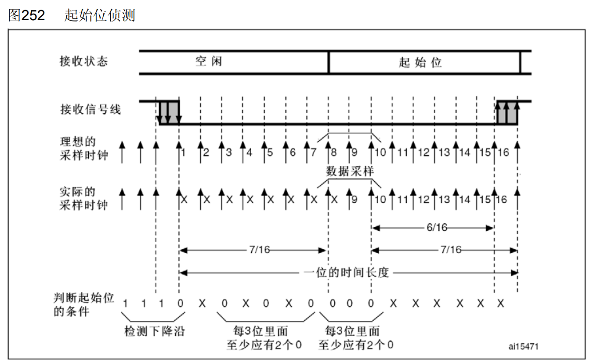

首先，我们称对第3、5、7次采样为第一阶段采样，对第8、9、10次采样为第二阶段采样。

1. 如果该序列不完整，那么接收端将退出起始位侦测并回到空闲状态(不设置标志位)等待下降沿。

2. 两个阶段检测的全是0，则确认收到起始位，这时设置RXNE标志位，如果RXNEIE=1，则产生中断。

3. 如果两阶段中3个采样点上仅有2个是0，那么起始位仍然是有效的，但是会设置NE噪声标志位。如果不能满足这个条件，则中止起始位的侦测过程，接收器会回到空闲状态(不设置标志位)。

4. 如果两个阶段只有一个阶段中3个采样点上仅有2个是’0’，那么起始位仍然是有效的，但是会设置NE噪声标志位。

数据位噪声探测：

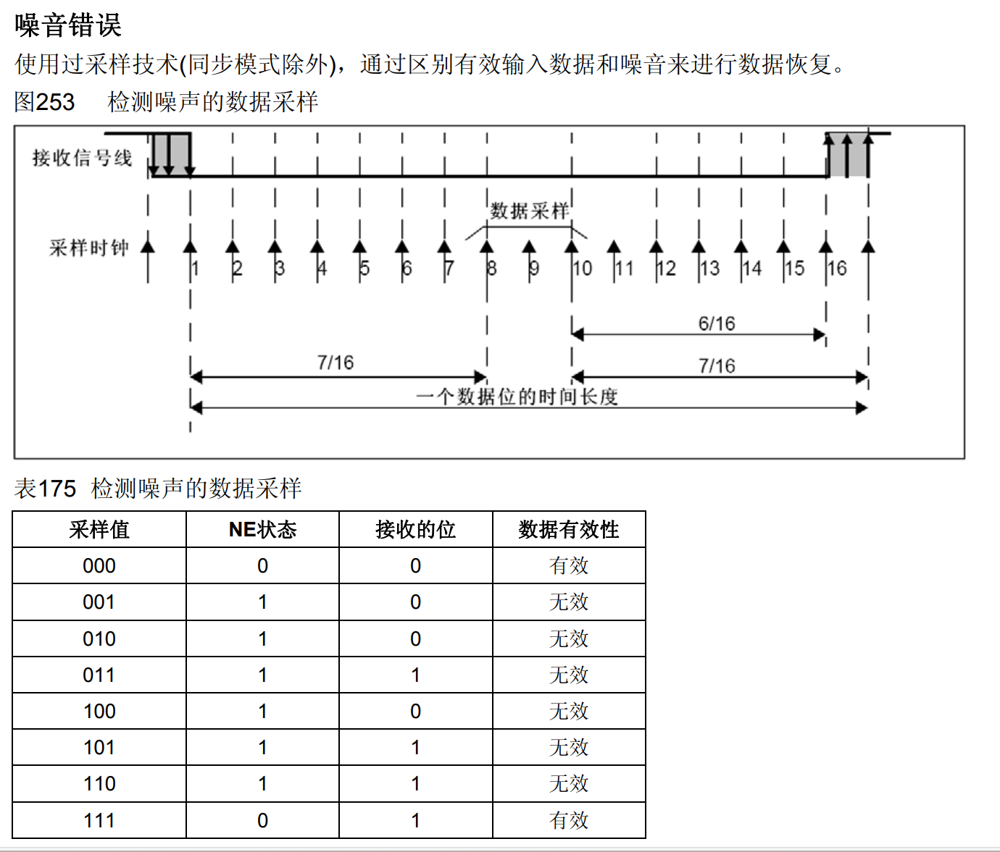

对数据位的采样只有一个阶段采样有效，即对8、9、10次采样。

**上方图片的下面的表格已经规定了采样的值和有效性的映射。读者可以好好的品味一下。**

最后，注意因为定点数表示小数是有精度的，所以波特率的计算是存在误差的，具体误差可以查阅中文手册。此外通过中文手册可知F_PCLK有两种情况：

- PCLK1用于USART2、3、4、5。

- PCLK2用于USART1

## USART发送和接收的配置步骤

USART的配置步骤比较简单。

1. 通信双方确定好波特率、停止位数、校验方式、字长。

2. 通过 `USART_SR.RXNE[5]` 产生的中断（接收数据寄存器非空），去异步接收数据。

3. 通过直接读写USART_DR寄存器可以实现数据的接收和发送。

3. 需要的话，可以等待 `USART_SR.TC[6]` 被硬件置位，来确保发送完成。

4. **处理中断后，一定要注意彻底清除中断相应的标志位！防止中断假触发！**

## USART发送和接收的代码

我的开发板硬件连接图如下，所以本实验使用USART1进行串口通信。

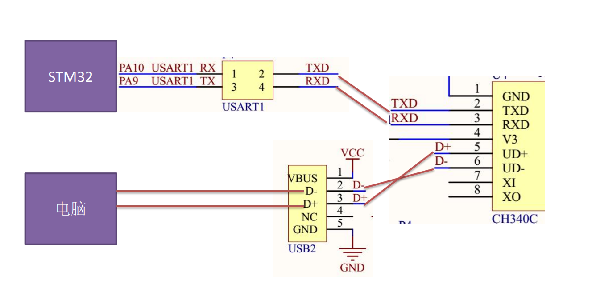

并且，将PA9、PA10分别配置成推挽复用输出、浮空输入或带上拉输入。

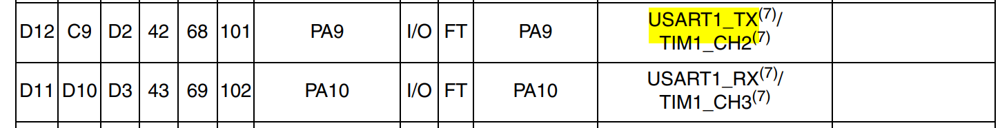

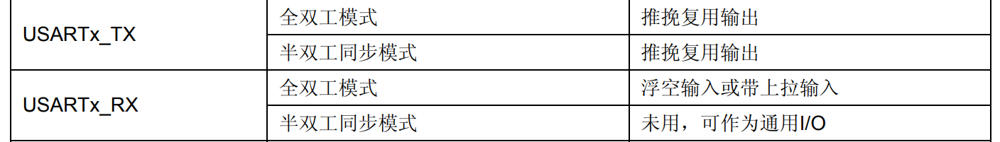

代码如下：

```c
int fputc(int ch,FILE *p) {//函数默认的，在使用printf函数时自动调用
	USART_SendData(USART1,(u8)ch);	
	while(USART_GetFlagStatus(USART1,USART_FLAG_TXE)==RESET);
	return ch;
}

void LunarNVICInit(){
	NVIC_InitTypeDef NVIC_Cfg;
	// 配置系统中断分组
	NVIC_PriorityGroupConfig(NVIC_PriorityGroup_2);
	// CPU上开启USART的中断
	NVIC_Cfg.NVIC_IRQChannel = USART1_IRQn;
	NVIC_Cfg.NVIC_IRQChannelCmd = ENABLE;
	NVIC_Cfg.NVIC_IRQChannelPreemptionPriority = 2;
	NVIC_Cfg.NVIC_IRQChannelSubPriority = 2;

	NVIC_Init(&NVIC_Cfg);

}

void LunarInitUSART1() {
	GPIO_InitTypeDef GPIOA9_Cfg, GPIOA10_Cfg;
	USART_InitTypeDef USART1_Cfg;

	// PA
	RCC_APB2PeriphClockCmd(RCC_APB2Periph_GPIOA,ENABLE);

	// 初始化GPIOA9为复用 （发送
	GPIOA9_Cfg.GPIO_Mode = GPIO_Mode_AF_PP;
	GPIOA9_Cfg.GPIO_Pin = GPIO_Pin_9;
	GPIOA9_Cfg.GPIO_Speed = GPIO_Speed_50MHz;
	GPIO_Init(GPIOA, &GPIOA9_Cfg);

	// 初始化GPIOA10为复用 （接收
	GPIOA10_Cfg.GPIO_Mode = GPIO_Mode_IN_FLOATING;
	GPIOA10_Cfg.GPIO_Pin = GPIO_Pin_10;
	GPIO_Init(GPIOA, &GPIOA10_Cfg);

	// USART1
	RCC_APB2PeriphClockCmd(RCC_APB2Periph_USART1,ENABLE);

	USART1_Cfg.USART_BaudRate = 115200;
	USART1_Cfg.USART_Mode = USART_Mode_Rx | USART_Mode_Tx;
	USART1_Cfg.USART_Parity = USART_Parity_No;
	USART1_Cfg.USART_StopBits = USART_StopBits_1;
	USART1_Cfg.USART_WordLength = USART_WordLength_8b;
	USART1_Cfg.USART_HardwareFlowControl = USART_HardwareFlowControl_None;
	USART_Init(USART1, &USART1_Cfg);

	// 接收中断
	USART_ITConfig(USART1, USART_IT_RXNE, ENABLE);

	// 打开usart
	USART_Cmd(USART1, ENABLE);
}

// 中断处理程序
void USART1_IRQHandler(void) {
	if(USART_GetITStatus(USART1, USART_IT_RXNE) != RESET) {	// 接收数据中断
		uint16_t data = USART_ReceiveData(USART1);

		USART_SendData(USART1, data);

		while(USART_GetFlagStatus(USART1, USART_FLAG_TXE) == RESET);
		
		USART_ClearFlag(USART1, USART_FLAG_TXE);
		
	} else {
		// 其他中断不做处理
	}
	
	// 顺序去读SR和DR清楚ORE位
   if (USART_GetFlagStatus(USART1, USART_FLAG_ORE) != RESET){
		USART_ReceiveData(USART1);
		// USART_ClearFlag(USART1, USART_FLAG_ORE); // 函数USART_ClearFlag清楚不了USART_FLAG_ORE！！！
   }
}
 
 int main() {
	// 初始化usart
	LunarInitUSART1();

	LunarNVICInit();
	printf("stm32 启动\n");
	while(1) {

	}

	return 0;
 }
```

> 实验结果就是上位机通过给串口发送字符串，上位机接收框出现回显的效果。

---

**本章完结**