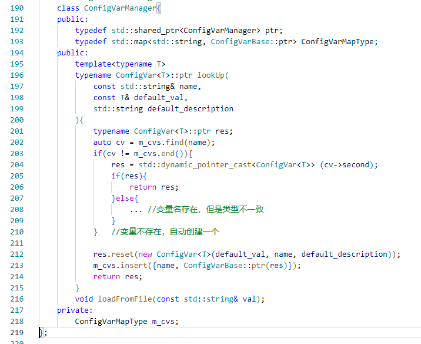

**重写Sylar基于协程的服务器系列：**

[ 重写Sylar基于协程的服务器（0、搭建开发环境以及项目框架 || 下载编译简化版Sylar）](./Start.md)

[ 重写Sylar基于协程的服务器（1、日志模块的架构）](./Log.md)

[重写Sylar基于协程的服务器（2、配置模块的设计）](./Configure.md)

[重写Sylar基于协程的服务器（3、协程模块的设计）](./Fiber.md)

[重写Sylar基于协程的服务器（4、协程调度模块的设计）](./Scheduler.md)

[重写Sylar基于协程的服务器（5、IO协程调度模块的设计）](./IOManager.md)

[重写Sylar基于协程的服务器（6、HOOK模块的设计）](./Hook.md)

[重写Sylar基于协程的服务器（7、TcpServer & HttpServer的设计与实现）](./TcpServerAndHttpServer.md)

**配置模块存在的必要性**

一个服务器软件可能会运行在不同的机器上，机器的配置、网络环境、实际需求等都是千变万化，在服务器软件中，为了适应这些变化，可能就是调整几个变量的值。开发人员不可能每次外在因素的改变就重新编译软件再发布，这明显是不现实的。于是配置模块就在这时发挥它的关键作用，利用好配置模块就不需要再次编译，让配置模块自己加载参数，动态调节就行了。

## 配置模块的设计与实现

### 配置模块序列化和反序列化效果（支持std::各种容器

**YAML 的基本语法如下：**

1. 大小写敏感。

2. 利用缩进表示层级关系，缩进只能使用空格，空格的数量不重要。

3. '#'表示注释。

4. 数据类型：对象，键值对的集合，即K-V对。数组，一组按次序排列的值。纯量（scalars），单个的、不可再分的值，包括字符串、布尔值、整数、浮点数、Null、时间、日期。

测试配置文件定义了一个key为space，value也是一个map类型的节点，该map有两个kv对，它们的key分别是vec、num，value分别是数组类型和纯量类型。如下

**test_config.yml:**

<!-- more -->
```yaml
space:
  vec: [0, 1, 2, 3, 4, 5, 6, 7, 8, 9]
  num: 7
```

**测试代码：**

```cpp
void test_logConfig(){
    // 创建配置变量
    lunar::ConfigVar<std::vector<int>>::ptr vec = 
        lunar::ConfigVarMgr::GetInstance()->lookUp("space.vec", std::vector<int>(), "vec test");
    lunar::ConfigVar<int>::ptr num = lunar::ConfigVarMgr::GetInstance()->lookUp("space.num", int(), "num test");

    // 解析配置文件
    lunar::ConfigVarMgr::GetInstance()->loadFromFile("test_config.yml");

    // 反序列化配置 && 输出到控制台
    LUNAR_LOG_INFO(g_logger) << vec->toString();
    LUNAR_LOG_INFO(g_logger) << num->toString();
}
```

**解析结果：**

```
[root@localhost build]# ../bin/test_config 
2024-01-31 21:02:02     2433    unknow  4294967295      [INFO]  [system]        /root/workspace/lunar/tests/test_config.cc:53       - 0
- 1
- 2
- 3
- 4
- 5
- 6
- 7
- 8
- 9
2024-01-31 21:02:02     2433    unknow  4294967295      [INFO]  [system]        /root/workspace/lunar/tests/test_config.cc:54       7
```

### 配置模块类的设计

在Yaml提供的数据类型的基础上，我们的配置文件还需要支持对象类型，所以我们需要通过模板，以泛型编程的方式实现对复杂数据类型的解析，除此之外，我们还要，对各个配置变量进行集中管理，综上所述，类的设计如下：

1. LexicalCast，对象转换类模板（仿函数），使用C++的模板二次封装Boost库的boost::lexical_cast模板函数，实现基础类型和字符串类型间相互转换。然后对LexicalCast类模板进行偏特化，让其支持C++标准库的容器的序列化与反序列化。所以，我们实现的LexicalCast类模板默认支持基础类型和C++容器，想要支持自定义类型的序列化和反序列化，用户需要自己实现全特化LexicalCast。

2. ConfigVarBase，配置变量基类，抽象出配置参数共有属性和方法比如变量名、对变量的描述、互斥锁、toString()、fromString()等，方便ConfigVarManager类使用多态对配置变量进行统一的管理。

3. ConfigVar，配置变量类模板，继承ConfigVarBase类，含有m_value成员变量，利用LexicalCast类模板，实现toString方法将配置变量序列化成Yaml String，实现fromString方法将Yaml String反序列化成配置变量。此外，还支持变更通知，在set方法中调用变更回调，通知引用配置变量的地方更新变量。

4. ConfigVarManager，配置变量管理类，利用std::map容器管理所有ConfigVar变量，std::map以配置变量名作为key，以配置变量基类智能指针作为value，支持配置变量的查询，用户在查询一条配置变量时，会提供该变量的变量名、默认值、变量描述，如果配置变量不存在，ConfigVarManager还会自动通过new 运算符利用默认值创建一个类型相同的配置变量，然后将<变量名，自动创建的配置变量>插到std::map中并返回给用户，因此ConfigVarManage还有自学习的能力。此外，提供了loadFromYaml函数支持对Yaml文件的解析，通过递归的方式解析Yaml文件中的每个map node节点，因为Yaml文件的map类型就是<key, value>对，这里key，value在配置文件中的含义和成员变量std::map中元素的含义是一致的,所以，取解析到的每个map node节点的key，去查该key是否存在于std::map成员中，如果存在，就调用相应配置变量基类的fronString函数，将map node的value作为参数，反序列化成一个配置变量。

ConfigVarManager的伪代码如下：



yaml配置文件解析的核心代码如下：

```cpp
    // 递归枚举每一个类型为map的节点。
    static void __ListAllYamlNode(std::string prefix,
        const YAML::Node& node,
        std::vector<std::pair<std::string, YAML::Node>>& output){

        output.push_back(std::make_pair(prefix, node));

        if(node.IsMap()){
            for(auto it = node.begin(); it != node.end(); it++){
                __ListAllYamlNode((prefix.empty() ? prefix :prefix + ".") + it->first.Scalar(), it->second, output);
            }
        }
    }

    void ConfigVarManager::loadFromFile(const std::string& val){
        std::vector<std::pair<std::string, YAML::Node>> nodes;
        YAML::Node root = YAML::LoadFile(val);
        __ListAllYamlNode("", root, nodes);

        for(auto it = nodes.begin(); it != nodes.end(); it++){
            ConfigVarBase::ptr var = lookUpConfigVarBaseByName(it->first);
            if(var != nullptr){ // 有配置变量就解析该节点
                std::stringstream ss("");
                ss << it->second;
                var->fromString(ss.str());
                // for debug
                //LUNAR_LOG_DEBUG(LUNAR_LOG_NAME("system")) << var->toString();
            }
        }
    }
```

关于yaml-cpp的使用可以参考官方文档：[https://github.com/jbeder/yaml-cpp/wiki/Tutorial](https://github.com/jbeder/yaml-cpp/wiki/Tutorial)。

感兴趣的同学，可以阅读一下本文实现的源码：[https://github.com/LunarStore/lunar](https://github.com/LunarStore/lunar)

---

**本章完结**