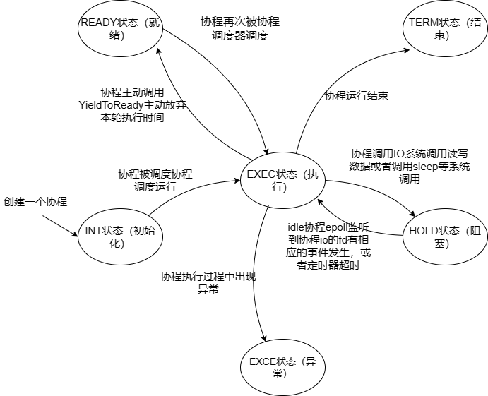
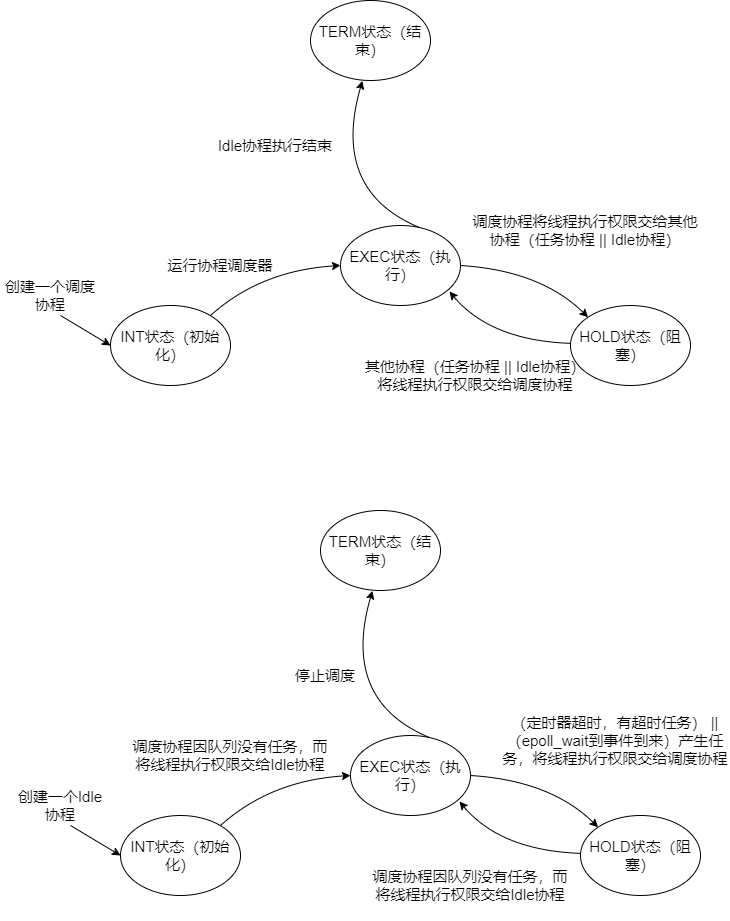
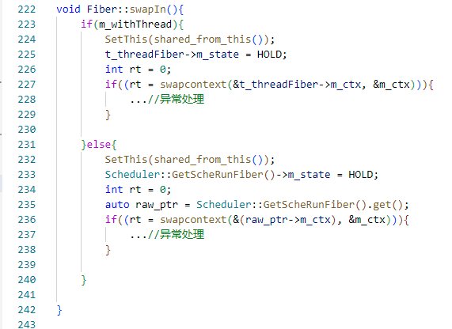
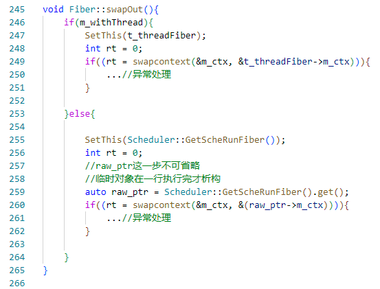

**重写Sylar基于协程的服务器系列：**

[ 重写Sylar基于协程的服务器（0、搭建开发环境以及项目框架 || 下载编译简化版Sylar）](./Start.md)

[ 重写Sylar基于协程的服务器（1、日志模块的架构）](./Log.md)

[重写Sylar基于协程的服务器（2、配置模块的设计）](./Configure.md)

[重写Sylar基于协程的服务器（3、协程模块的设计）](./Fiber.md)

[重写Sylar基于协程的服务器（4、协程调度模块的设计）](./Scheduler.md)

[重写Sylar基于协程的服务器（5、IO协程调度模块的设计）](./IOManager.md)

[重写Sylar基于协程的服务器（6、HOOK模块的设计）](./Hook.md)

[重写Sylar基于协程的服务器（7、TcpServer & HttpServer的设计与实现）](./TcpServerAndHttpServer.md)

**前言**

关于线程以及线程并发的封装在此略过该部分比较简单，有兴趣的朋友可以看一下我原来写的Muduo的博客：[muduo源码阅读笔记（2、对C语言原生的线程安全以及同步的API的封装）](https://blog.csdn.net/m0_52566365/article/details/135524029)、[muduo源码阅读笔记（3、线程和线程池的封装）](https://blog.csdn.net/m0_52566365/article/details/135556047)，或者直接阅读本文配套的简化版sylar的源码：[https://github.com/LunarStore/lunar](https://github.com/LunarStore/lunar)。

## 协程模块的设计与实现

### 协程的状态定义

协程分为：初始化状态、执行状态、阻塞状态、就绪状态、结束状态、异常状态。定义如下：

```cpp
enum State{
    INIT,   // 初始化
    EXEC,   // 执行
    HOLD,   // 阻塞
    READY,  // 就绪
    TERM,   // 结束
    EXCE    // 异常
};
```

### 协程的状态机

**任务协程：**

<!-- more -->
一个任务协程运行时，可能的状态机图，如下图:



可能跟着协程调度模块、io协程调度模块走一遍调度任务协程的流程后，才能清晰的理解该图的意义，这里可以先以整体的视角，看一看一个任务协程的状态切换时机即可。

整体调度流程简述：

系统中的每个线程**最开始会被初始化去执行调度协程**，调度协程会向任务队列中取协程任务，如果任务是回调，也会将它封装成一个协程对象。然后调度协程会去swapIn进去执行任务协程。当任务协程调用了IO系统调用或者类sleep系统调用（这些系统调用有被hook重新实现），任务协程做好切回操作后（向epoll注册事件，并将对应的协程和fd绑定；或者向定时器模块注册一下，将协程和定时器绑定。），就swapOut出去，将线程时间片交给调度协程，调度协程继续去调度任务队列的下一个任务协程。当任务队列中没有协程任务后，调度协程会去执行Idle协程，Idle协程会使线程真正阻塞在epoll_wait上，等待IO事件的到来或者定时器超时事件发生，当有事件到来，Idle协程就会被唤醒，然后将被绑定的协程加入到任务队列中，Idle协程就会swapOut出去，将线程时间片交给调度协程继续去调度任务协程。

**调度协程&&Idle协程：**

正常情况下，调度协程和Idle协程的状态机如下图：



### 协程模块的设计如下

总体来讲，协程模块（Fiber类）主要就是对ucontext_t提供的getcontext、makecontext、swapcontext等函数做了一个封装，为了简化后续调度模块使用协程。要讲清楚协程模块，不得不引入类型为Finer::ptr（就是Fiber对象的智能指针）三个重要的线程全局变量，分别是：线程原始协程（t_threadFiber）、线程当前正在运行的协程（t_fiber）、调度协程（t_scheRunFiber），这三个全局变量在每个线程中都会拥有一份，独立于其他线程。由于引入了协程的概念，我们就应该弱化线程的概念，以一切皆是协程的思想去编写代码。所以一个线程在被创建时，它原始的上下文就可以作为一个协程，我们把它的上下文保存在t_threadFiber中，这样可以待线程的其他协程执行完毕，再切换回来。具体类的设计如下：

1. 构造函数，用户在构造一个协程时，会传入协程的回调函数、协程堆栈大小、指明协程在切入去执行时是和哪个协程做切换（t_threadFiber或者t_scheRunFiber），这里额外再解释一下，因为一个协程的切入可以看成是在另一个协程中进行的，所以一个协程在切入执行前，首先要保存先前协程的上下文，因为我们实现的协程服务器是有调度器的，而且每个线程会执行调度协程进行任务协程的调度，所以，一般任务协程在切入执行前，是要先将上下文保存在t_scheRunFiber中，再将上下文修改成任务协程的上下文。待任务协程执行完毕或者阻塞，再反向操作，先将上下文保存到任务协程中，再将上下文还原成t_scheRunFiber去调度其他协程。  
协程初始化首先会调用getcontext初始化m_ctx成员变量，该成员变量是保存协程的上下文核心数据结构，然后调用makecontext将协程上下文设置成静态成员函数MainFun，在静态成员函数MainFun中，会通过线程局部变量t_fiber（切入时设置）获取到协程当前运行的协程对象，进而回调用户传来的call back函数。

2. 协程默认构造，该构造是私有化的，专门为线程原始的协程打造，内部只调用getcontext函数。

3. swapIn成员函数，根据用户指定调用swapcontext，和t_threadFiber做切换或者和t_scheRunFiber做切换。

    **协程切入伪代码：**

    

4. swapOut成员函数，协程切换回t_threadFiber或t_scheRunFiber时使用，也是调用swapcontet。

    **协程切出伪代码：**

    

5. yieldToHold/yieldToReady，设置协程状态然后调用swapOut。

---

下一章将介绍协程调度模块

感兴趣的同学，可以阅读一下本文实现的源码：[https://github.com/LunarStore/lunar](https://github.com/LunarStore/lunar)

---

**本章完结**