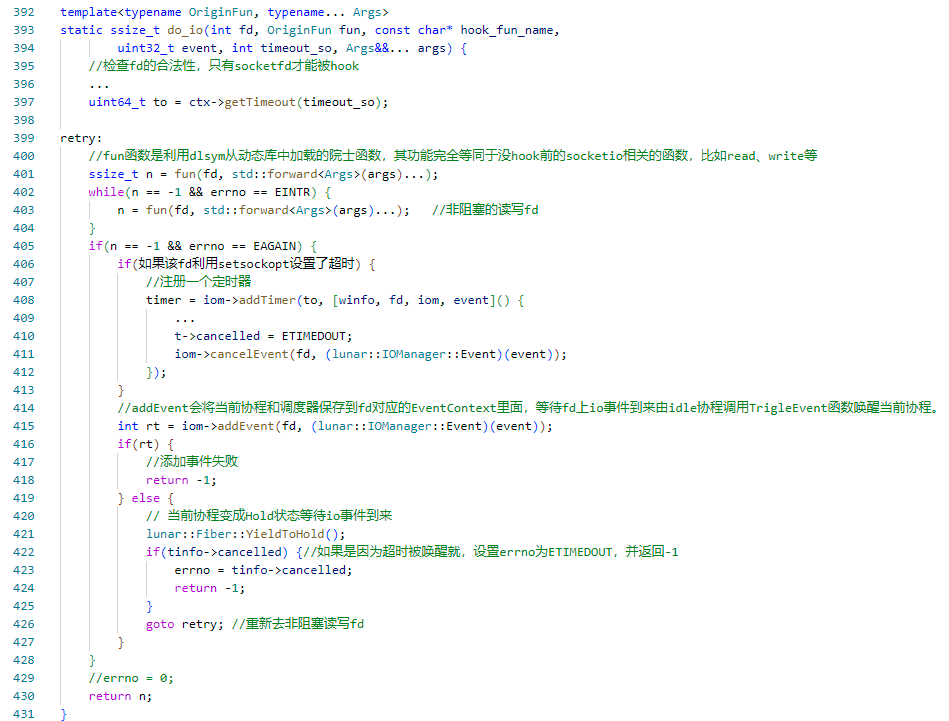
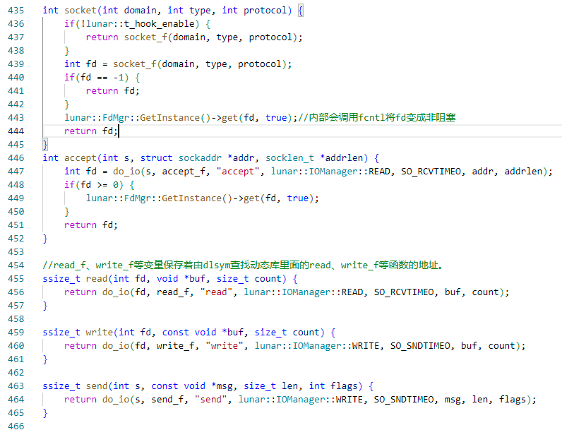

**重写Sylar基于协程的服务器系列：**

[ 重写Sylar基于协程的服务器（0、搭建开发环境以及项目框架 || 下载编译简化版Sylar）](./Start.md)

[ 重写Sylar基于协程的服务器（1、日志模块的架构）](./Log.md)

[重写Sylar基于协程的服务器（2、配置模块的设计）](./Configure.md)

[重写Sylar基于协程的服务器（3、协程模块的设计）](./Fiber.md)

[重写Sylar基于协程的服务器（4、协程调度模块的设计）](./Scheduler.md)

[重写Sylar基于协程的服务器（5、IO协程调度模块的设计）](./IOManager.md)

[重写Sylar基于协程的服务器（6、HOOK模块的设计）](./Hook.md)

[重写Sylar基于协程的服务器（7、TcpServer & HttpServer的设计与实现）](./TcpServerAndHttpServer.md)

**简述**

**HOOK模块存在的必要性：让IO系统调用，以同步写法展现出异步的性能。**

hook实际上就是对系统调用API进行一次封装，将其封装成一个与原始的系统调用API同名的接口，应用在调用这个接口时，会先执行封装中的操作，再执行原始的系统调用API。本文实现的是一种利用dlsym函数实现的侵入式hook。

## HOOK的实现

首先，是hook重新实现accept函数、socket函数，为了高效的cpu利用率，每个被accept函数接受的socketfd、或者socket创建的fd在返回给调用者前，都会使用fcntl函数，将其设置为非阻塞，虽然socketfd被设置成非阻塞的，但是我们的hook机制，能够利用非阻塞的socketfd实现一种在调用者看来是阻塞的socketfd。

其次，为了获取socketfd的超时时间，所有setsockop也会被hook，如果socketfd之前使用setsockop函数设置超时，其超时时间就会被fdmanager类获取，将超时时间记录在对应的fd上。当然，为了善后，close也会被hook，在调用真正close前，会唤醒相应socketfd上的所有监听协程，让协程退出。

最后，将socketIO有关的系统调用（如read、write、accept等）抽象出一个统一的接口do_io，用户在调用socketIO有关函数时，底层统一调用do_io。do_io流程如下。

1. 进入do_io函数内部，首先会检查socketfd的合法性。

2. 如果socketfd是合法的，就去调用fun。（fun是通过do_io参数传进来的真正的io系统调用函数地址）。

3. 如果sockefd是非法的，也会去调用一次fun，fun返回什么，do_io就返回什么，完全依赖原始的系统底层调用对非法socketfd的处理。

4. 对于合法的socketfd调用fun，由于socketfd是非阻塞的，不管是否读取到数据，fun都会立刻返回。如果读到数据，do_io整体就返回读到的字节数。如果没有读到数据，fun会返回-1，errno为EAGAIN，但是do_io不会返回。

5. 然后调用线程当前的IOManager的addEvent函数，根据用户调用的socketIO相关接口对socketfd添加事件相应读写事件，在addEvent函数内部会把<当前协程，当前协程的协程调度器>放入socketfd对应的EventContext结构体里面，等待socketfd上io事件到来并由idle协程调用TrigleEvent函数唤醒当前协程。

6. 然后调用yieldToHold将协程变成Hold状态，等待socketfd上io事件到来时idle协程将该协程唤醒。
<!-- more -->

7. 唤醒后，首先查看是怎么被唤醒的，如果是因为超时被唤醒，do_io就返回超时的错误，如果是因为有io事件到来被唤醒，那么回到第4步。

HOOK模块核心函数do_io伪代码：

do_io的使用（也即read、write系统调用的hook）

下一章将介绍TcpServer模块。

感兴趣的同学，可以阅读一下本文实现的源码：[https://github.com/LunarStore/lunar](https://github.com/LunarStore/lunar)

---

**本章完结**