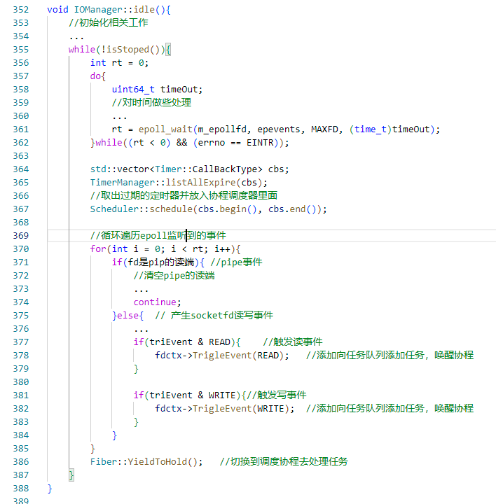
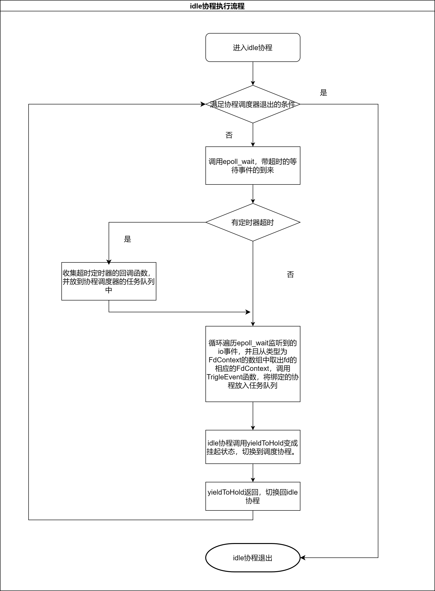

**重写Sylar基于协程的服务器系列：**

[ 重写Sylar基于协程的服务器（0、搭建开发环境以及项目框架 || 下载编译简化版Sylar）](./Start.md)

[ 重写Sylar基于协程的服务器（1、日志模块的架构）](./Log.md)

[重写Sylar基于协程的服务器（2、配置模块的设计）](./Configure.md)

[重写Sylar基于协程的服务器（3、协程模块的设计）](./Fiber.md)

[重写Sylar基于协程的服务器（4、协程调度模块的设计）](./Scheduler.md)

[重写Sylar基于协程的服务器（5、IO协程调度模块的设计）](./IOManager.md)

[重写Sylar基于协程的服务器（6、HOOK模块的设计）](./Hook.md)

[重写Sylar基于协程的服务器（7、TcpServer & HttpServer的设计与实现）](./TcpServerAndHttpServer.md)

**简述**

sylar的IOManager模块本质上就是一个事件池，主要负责向epoll中注册事件和回调。实现了Idle协程的回调，回调是一个阻塞在epoll_wait上的事件循环，将有IO事件发生的协程唤醒。

## 核心数据结构

将socketfd封装成一个结构体FdContext，对于fd上的读写事件封装成EventContext，提供的TrigleEvent函数，在fd有读写事件发生时，将相应读写事件的EventContext::m_fiber成员放到EventContext::m_scheduler调度器中，可以唤醒阻塞的协程。FdContext结构体定义如下。

<!-- more -->
```cpp
struct FdContext {
    typedef Mutex MutexType;
    struct EventContext{
        void reset();
        Fiber::ptr m_fiber = nullptr;
        std::function<void(void)> m_cb = nullptr;
        //记录协程调度器，表示，当事件发生，fiber or callback应该使用哪个协程调度器调度。
        Scheduler* m_scheduler = nullptr;   
    };
    // nolock
    void TrigleEvent(Event event);
    EventContext& getEventContext(Event event);
    void resetEventContext(Event event);
    EventContext read;  //读事件Handle
    EventContext write; //写事件Handle
    Event m_events = NONE;  //记录当前FdContext哪些事件有效
    int m_fd = -1;
    MutexType m_mutex;
};
```

## IOManager成员变量

IOManager的成员变量中有一个类型为std::vector<FdContext*>的数组，以每个socketfd作为数组下标，每个fd都能对应一个FdContext。如下。

```cpp
class IOManager: public Scheduler, public TimerManager{
    /*
        ...
    */
private:
    std::vector<FdContext*> m_fdContexts;   // fd -> FdContext（和muduo的channel类似）
    std::atomic<uint32_t> m_penddingEventCount = { 0 }; // epoll监听的事件数
    int m_pipfd[2]; // 管道fd、也称ticklefd，也称wakefd（Muduo）
    int m_epollfd;
    MutexType m_mutex;  // 全局锁
};
```

## IO协程调度器的设计

IO协程调度模块继承自协程调度模块，重新实现了协程调度的idle函数、isStop函数、tickle函数（功能和Muduo中EventLoop的wakeup函数一样）等。因为IO协程调度器继承自协程调度器，所以，现约定以下出现的协程调度器也指IO协程调度器。

1. 构造函数，创建一对个管道和一个epollfd，并将管道的读端注册到epollfd上，作用是：通知和唤醒阻塞在idle协程的epoll_wait函数上的线程，每次在向调度器任务队列中添加任务时，向管道的写端写入一个字符，以唤醒阻塞的线程，开始处理任务。在构造函数里面会自动启动协程调度器。

2. addEvent，向epollfd注册一个fd的读写事件，并记录到IOManager::m_fdContexts数组里面，等待事件的触发。

3. delEvent / cancelEvent， 向epollfd取消或删除一个fd的读写事件，并记录到IOManager::m_fdContexts数组里面。

4. Idle函数（即idle协程的回调函数），既然调度到了idle协程，说明调度器的任务队列里面没任务了，所以，idle函数首先会调用epoll_wait，带超时的阻塞线程一段时间，超时或者有事件发生时，会检查有无定时器超时，如果有定时器超时就会将超时回调函数放到任务队列中去调度，然后去检查有哪些fd发生了哪些事件，将相关的协程唤醒。


Idle函数伪代码如图：



Idle函数流程图：



下一章将介绍HOOK模块。

感兴趣的同学，可以阅读一下本文实现的源码：[https://github.com/LunarStore/lunar](https://github.com/LunarStore/lunar)

---

**本章完结**