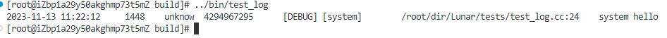
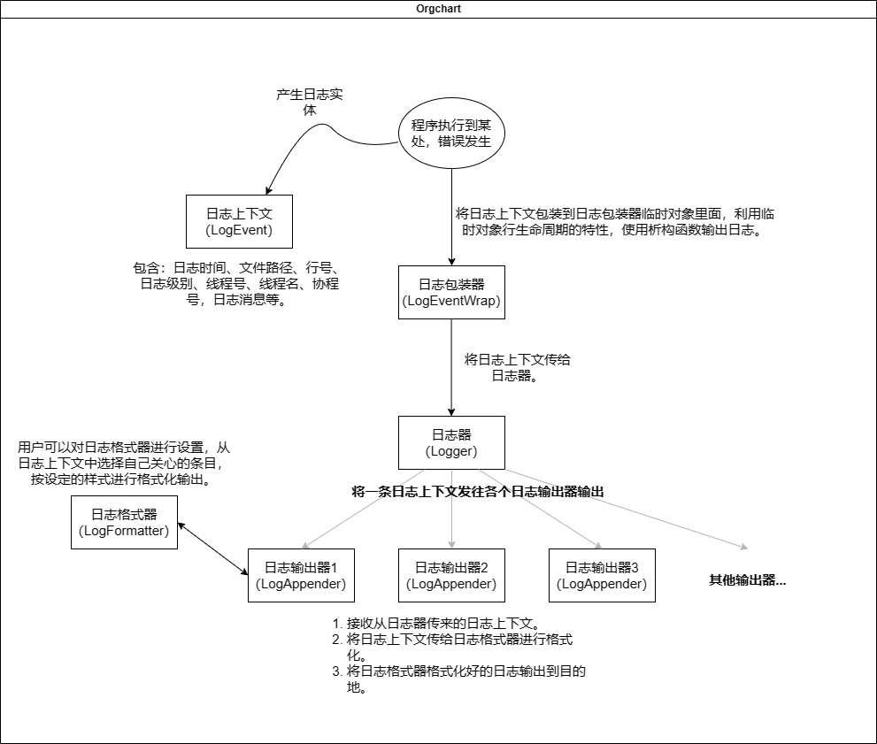
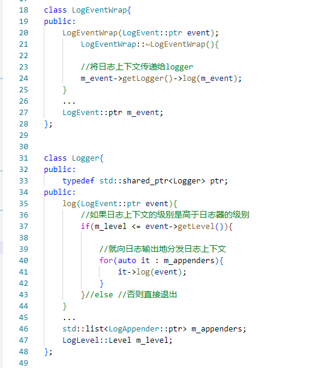
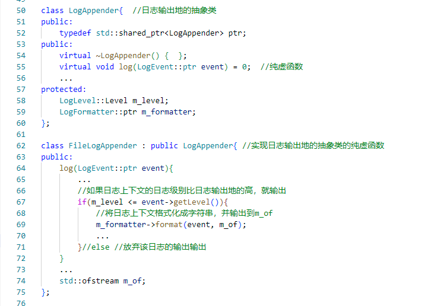

**重写Sylar基于协程的服务器系列：**

[ 重写Sylar基于协程的服务器（0、搭建开发环境以及项目框架 || 下载编译简化版Sylar）](./Start.md)

[ 重写Sylar基于协程的服务器（1、日志模块的架构）](./Log.md)

[重写Sylar基于协程的服务器（2、配置模块的设计）](./Configure.md)

[重写Sylar基于协程的服务器（3、协程模块的设计）](./Fiber.md)

[重写Sylar基于协程的服务器（4、协程调度模块的设计）](./Scheduler.md)

[重写Sylar基于协程的服务器（5、IO协程调度模块的设计）](./IOManager.md)

[重写Sylar基于协程的服务器（6、HOOK模块的设计）](./Hook.md)

[重写Sylar基于协程的服务器（7、TcpServer & HttpServer的设计与实现）](./TcpServerAndHttpServer.md)

**前言**

和Muduo的日志对比，[Muduo的同步日志](../muduo/SynLogging.md)虽然格式固定，但简单高性能。而sylar的日志设计的显得过于冗余，虽然灵活性强、扩展性高，但是性能却不及Muduo。尽管陈硕大大也说过，简单才能保证高性能，日志就没必要设计的那么花里胡哨，但是sylar对日志的设计思想以及设计模式超级超级适合小白去学习。

## 日志格式

由于用户可能并不需要将日志上下文的每一项都进行输出，而是希望可以自由地选择要输出的日志项。并且，用户还可能需要在每条日志里增加一些指定的字符，比如在文件名和行号之间加上一个冒号的情况。为了实现这项功能，LogFormatter使用了一个模板字符串来指定格式化的方式。模板字符串由普通字符和占位字符构成。在构造LogFormatter对象时会指定一串模板字符，LogFormatter会首先解析该模板字符串，将其中的占位符和普通字符解析出来。在格式化日志上下文时，根据模板字符串，将其中的占位符替换成日志上下文的具体内容，普通字符保持不变。下表是支持的占位符的含义。

|   占位符  |   含义    |
|   :---:   |   :---:   |
|   %s      |   普通字符串（直接输出的字符串）|
|   %d	    |   时间    |
|   %t	    |   线程真实id  |
|   %N      |	线程名  |
|   %f      |	协程id  |
|   %p      |	日志级别    |
|   %c      |	日志器名    |
|   %F      |	文件路径    |
|   %l      |	行号    |
|   %m      |	日志消息    |
|   %T      |	Tab缩进 |
|   %n      |	换行    |

以`%d{%Y-%m-%d %H:%M:%S}%T%t%T%N%T%f%T[%p]%T[%c]%T%F:%l%T%m%n`格式串为例，输出效果如图下：

<!-- more -->


时间占位符%d需要带有格式化参数`%Y-%m-%d %H:%M:%S`，这使得日志格式器能对日志上下文收集到的时间戳进行格式化，而对于其他占位符，日志格式器只需要从日志上下文中取来做简单的处理再直接拼接即可。

## 日志模块架构设计

sylar实现的日志中，一条日志数据流向是：日志包装器->日志器->数个日志输出地，如图所示。



关于这几个类的设计如下：

1. LogEvent: 日志上下文，用于记录日志现场，比如该日志的时间，文件路径/行号，日志级别，线程/协程号，日志消息等。

2. LogEventWrap: 日志事件包装类，其实就是将日志事件和日志器一起包装到日志上下文中，因为一条日志只会在一个日志器上进行输出。将日志事件和日志器包装到一起后，方便通过宏定义来简化日志模块的使用（这点和Muduo很像）。另外，LogEventWrap还负责在构建时指定日志事件和日志器，在析构时调用日志器的log方法将日志事件进行输出。

3. Logger: 日志器，负责进行日志输出。一个Logger包含多个LogAppender和一个日志级别，提供log方法，传入日志事件，如果日志事件的级别高于日志器本身的级别就调用每一个LogAppender的log方法将日志进行输出，否则该日志被抛弃。

    日志包装器以及日志器伪代码：

    

4. LogAppender: 日志输出器，用于将一个日志上下文输出到对应的输出地。该类内部包含一个LogFormatter成员和一个log方法，日志事件先经过LogFormatter格式化后再输出到对应的输出地。从这个类可以派生出不同的输出器类型，比如StdoutLogAppender和FileLogAppender，分别表示终端和文件的日志输出器。

    日志输出器伪代码：

    

5. LogFormatter: 日志格式器，用于格式化一个日志事件。该类构建时可以指定pattern并根据提供的pattern调用`init()`进行解析。提供format方法，用于将日志事件格式化成字符串。

    日志格式串的解析：

    ```cpp
        void LogFormatter::init(){
            std::vector<std::tuple<std::string, std::string>> res;
            int len = m_pattern.length();

            //state -- 0 普通字符部分/日志修饰字符
            //state -- 1 格式化字符部分
            //state -- 2 格式化字符参数部分
            int pLt = 0, pRt = 0, state = 0 ;

            //'\0'看成万能字符
            while(pRt <= len){
                if(state == 0){
                    //状态升级
                    if(pRt == len || m_pattern[pRt] == '%'){
                        if(pLt < pRt){
                            res.push_back(std::make_tuple("s", m_pattern.substr(pLt, pRt - pLt)));
                        }
                        state = 1;  //升级
                        pLt = pRt + 1;
                    }
                }else if(state == 1){
                    //状态还原 或 状态升级 
                    //或 此时遇到非{，非%，非字母的字符，则隐式代表格式化字符部分结束
                    if(pRt < len && m_pattern[pRt] == '{'){
                        if(pLt < pRt){
                            res.push_back(std::make_tuple(m_pattern.substr(pLt, pRt - pLt), ""));
                        }else{
                            //错误：没有模式字符只有选项参数
                            res.push_back(std::make_tuple("s", "<parse error> empty format character : "));
                        }
                        state = 2;
                        pLt = pRt + 1;
                    }
                    else if(pRt < len && m_pattern[pRt] == '%'){
                        if(pLt < pRt){
                            res.push_back(std::make_tuple(m_pattern.substr(pLt, pRt - pLt), ""));
                        }
                        state = 0;
                        pLt = pRt;
                        continue;
                    }else if(pRt == len || !isalpha(m_pattern[pRt])){
                        if(pLt < pRt){
                            res.push_back(std::make_tuple(m_pattern.substr(pLt, pRt - pLt), ""));
                        }
                        state = 0;
                        pLt = pRt;
                    }
                }else{  //state == 2
                    //状态还原
                    //缺少}，结尾（"\0"）默认为'}'
                    if(pRt == len || m_pattern[pRt] == '}'){
                        std::get<1>(res.back()) = std::get<1>(res.back()) + m_pattern.substr(pLt, pRt - pLt);
                        state = 0;
                        pLt = pRt + 1;
                    }
                }
                pRt++;
            }

            // ... 省略不重要的部分
        }
    ```

6. LogManager: 日志器管理类，单例模式，用于统一管理所有的日志器，提供日志器的创建与获取方法。LogManager自带一个root Logger，用于为日志模块提供一个初始可用的日志器。

**简化日志使用的宏定义：**

日志宏：

```cpp
#define LUNAR_LOG_LEVEL(logger, level) \
    if((logger)->getLevel() <= level) \
        (lunar::LogEventWrap(lunar::LogEvent::ptr(new lunar::LogEvent(__FILE__, __LINE__,\
        lunar::GetElapse(), lunar::Thread::GetTid(),\
        lunar::GetFiberId(), ::time(nullptr),\
        lunar::Thread::GetName(), level, (logger))))).getMsg()

#define LUNAR_LOG_DEBUG(logger) LUNAR_LOG_LEVEL(logger, lunar::LogLevel::Level::DEBUG)

#define LUNAR_LOG_INFO(logger) LUNAR_LOG_LEVEL(logger, lunar::LogLevel::Level::INFO)

#define LUNAR_LOG_WRONG(logger) LUNAR_LOG_LEVEL(logger, lunar::LogLevel::Level::WRONG)

#define LUNAR_LOG_ERROR(logger) LUNAR_LOG_LEVEL(logger, lunar::LogLevel::Level::ERROR)

#define LUNAR_LOG_FATAL(logger) LUNAR_LOG_LEVEL(logger, lunar::LogLevel::Level::FATAL)
```

## 其他

**关于异步日志**

本着**基于协程淡化线程**的思想，在sylar中，要实现异步日志的前提是，先要基于协程实现一个信号量，然后通过继承LogAppender参考Muduo设计一个异步日志，但是其后台是由一个协程进行落盘。

异步日志的实现涉及到后面的fiber、hook等模块，本文简略带过。

**异步日志和同步日志对比**

| | 优点 | 缺点 |
| :-: | :-: | :-: |
| 异步日志 | 执行效率更高，一般应用程序只用将日志输出到一块缓存中，由另起的线程将缓存中的日志输出到磁盘上，减少了系统的IO负担 | 当系统崩溃时，容易丢失内存中来不及写入的日志。日志本身的代码实现、调试更复杂 |
|同步日志| 事件发生就输出，系统崩溃不会出现丢日志的情况，日志输出顺序可控，代码实现简单 | 效率更低，增加系统IO负担，输出日志时会阻塞工作线程 |

感兴趣的同学，可以阅读一下本文实现的源码：[https://github.com/LunarStore/lunar](https://github.com/LunarStore/lunar)

---

**本章完结**