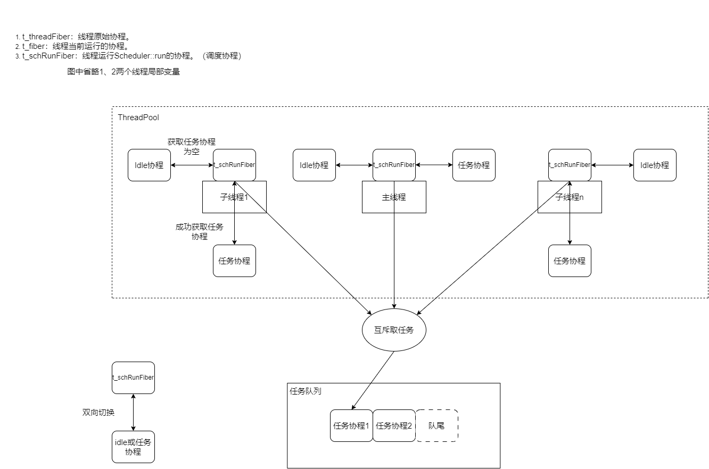
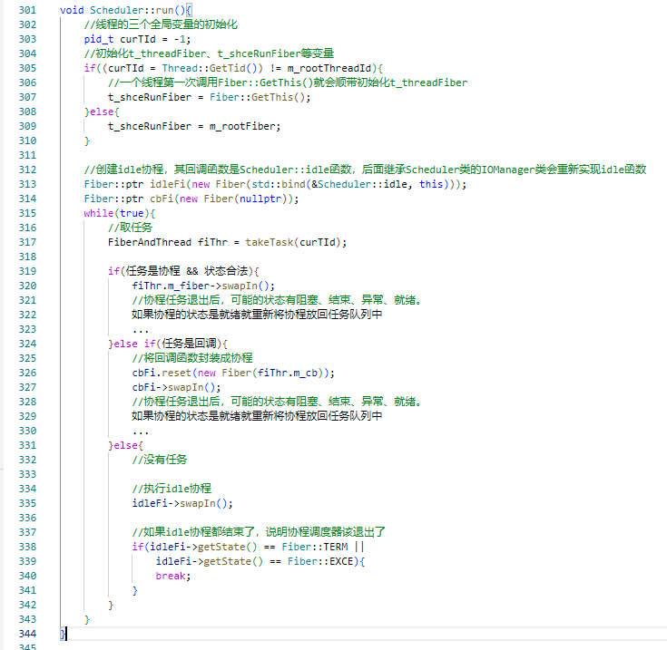

**重写Sylar基于协程的服务器系列：**

[ 重写Sylar基于协程的服务器（0、搭建开发环境以及项目框架 || 下载编译简化版Sylar）](./Start.md)

[ 重写Sylar基于协程的服务器（1、日志模块的架构）](./Log.md)

[重写Sylar基于协程的服务器（2、配置模块的设计）](./Configure.md)

[重写Sylar基于协程的服务器（3、协程模块的设计）](./Fiber.md)

[重写Sylar基于协程的服务器（4、协程调度模块的设计）](./Scheduler.md)

[重写Sylar基于协程的服务器（5、IO协程调度模块的设计）](./IOManager.md)

[重写Sylar基于协程的服务器（6、HOOK模块的设计）](./Hook.md)

[重写Sylar基于协程的服务器（7、TcpServer & HttpServer的设计与实现）](./TcpServerAndHttpServer.md)

**简述**

协程调度模块，让线程池里的每个线程都运行调度协程，并不断切换去执行协程任务。

## 协程调度器整体架构图

sylar实现的协程是**非对称协程**，虽然就调度器的架构看来，很反人类，一眼看去很像是对称协程。

问了一下GPT，回答如下：

实现了 IO Hook 模块的协程通常是非对称协程模型。在异步编程中，IO Hook 通常用于异步 IO 操作，而非对称协程模型更适合处理异步 IO 操作。

在非对称协程模型中，一个主协程（通常是事件循环或主任务）可以通过 IO Hook 来注册感兴趣的 IO 事件，并在事件发生时启动相应的协程执行。这样的模型更适用于事件驱动的编程，其中主协程负责管理整体的控制流，而子协程负责处理具体的 IO 操作。

协程调度器模块的设计是基于线程池来完成的，对线程池进行协程的定制化改造，让线程池模型能够适应协程的切换，如图：

## 协程调度模块设计

1. 构造函数，用户创建协程调度器主要的参数有，设置参与协程调度的线程数量threadCount、主线程是否参与协程调度等，构造函数首先会为主线程原始的上下文创建一个协程（t_threadFiber），其次，如果用户指定了主协程需要参与协程调度，就会为成员变量m_rootFiber创建一个回调函数是Scheduler::run()的协程，并且指定该协程与t_threadFiber做上下文切换。主线程等待后面延迟将m_rootFiber切入，进入Scheduler::run()函数后，t_threadFiber保存主线程原始上下文，t_schRunFiber赋值为m_rootFiber即运行Scheduler::run()函数的协程。而子线程运行的回调函数就是Scheduler::run()函数，所以，子线程的t_threadFiber和t_schRunFiber是同一个协程对象。并且，因为主线程充当了一个调度协程，所以，创建子线程的时候，会少创建一个线程，即子线程的数量等于threadCount-1。当用户没有要使用主线程充当调度协程时，调度器最后会创建threadCount个子线程。

2. Scheduler::run，协程调度部分，进入调度函数最开始会初始化t_threadFiber和t_schRunFiber变量，然后进入调度循环，在调度循环中，首先到任务队列中取任务，取到任务时，判断任务是协程还是回调，如果是协程，判断协程状态的合法性，只有合法的协程才能切入去执行，对于回调，会被封装成协程，再切入去执行。如果没有任务，就会去执行idle协程，idle协程是IO协程调度模块的重点，主要负责等待事件的到来然后唤醒相应任务协程。

    协程调度函数`Scheduler::run`伪代码：
<!-- more -->

    

3. Scheduler::isStop，当用户调用了成员stop函数，且任务队列队列为空，且没有任何线程正在执行协程任务，即可认为整个协程调度器停止了，此时该函数返回true。

下一章将介绍IO协程调度模块。

感兴趣的同学，可以阅读一下本文实现的源码：[https://github.com/LunarStore/lunar](https://github.com/LunarStore/lunar)

---

**本章完结**