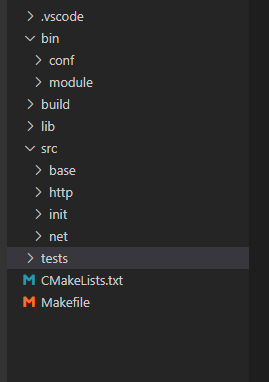
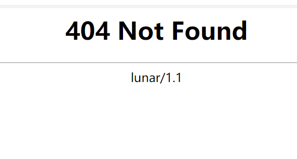

**重写Sylar基于协程的服务器系列：**

[ 重写Sylar基于协程的服务器（0、搭建开发环境以及项目框架 || 下载编译简化版Sylar）](./Start.md)

[ 重写Sylar基于协程的服务器（1、日志模块的架构）](./Log.md)

[重写Sylar基于协程的服务器（2、配置模块的设计）](./Configure.md)

[重写Sylar基于协程的服务器（3、协程模块的设计）](./Fiber.md)

[重写Sylar基于协程的服务器（4、协程调度模块的设计）](./Scheduler.md)

[重写Sylar基于协程的服务器（5、IO协程调度模块的设计）](./IOManager.md)

[重写Sylar基于协程的服务器（6、HOOK模块的设计）](./Hook.md)

[重写Sylar基于协程的服务器（7、TcpServer & HttpServer的设计与实现）](./TcpServerAndHttpServer.md)

**前言**

sylar是一个基于协程的服务器框架。同go语言思想一样，整个框架贯彻协程化的思想，淡化线程的存在。笔者有幸反复阅读sylar数次，并重写过base核心模块。该项目是我真正入门C++的第一个项目，我也将其作为本科毕设，顺利通过答辩。非常感谢sylar的作者能将多年从业经验浓缩在这个项目当中，这真的是为后来者点了一扇关键的灯。

## 环境搭建以及下载安装

**开发环境参考如下表：**

|   环境    |   版本    |
|   :---:   |   :---:   |
|   Linux操作系统   |   CentOS 7.5 64位（2核2G） |
|   G++编译器	    |   4.8.5   |
|   CMake	        |   3.14.5  |
|   C++标准	        |   C++11   |
|   项目调试工具	|   GDB     |
|   项目开发工具	|   VSCode  |

**搭建项目框架：**

本系统的文件结构如图所示。项目根目录有CMakeList文件和Makefile文件，也即有两种编译方式。编译输出的中间文件输出在build目录，二进制文件输出在bin目录下，静态库以及动态库输出在lib目录下，src目录存放项目源码，源码划分为基础模块、网络模块、初始化模块、以及HTTP模块，本文重点集中在基础模块，即src/base目录下的文件。bin目录存放的是二进制可执行程序。bin/conf以及bin/module目录分别存放的是，可执行程序的配置文件以及动态库模块。



**下载、编译、试玩重写的简化版sylar：**

<!-- more -->
去除了sylar原来的负载均衡、数据库连接、protobuff、orm、zk等模块。（实际上是太菜了，这些模块没跟下去。）

```bash
#源码下载
git clone https://github.com/LunarStore/lunar.git 

# 安装boost库
yum install boost-devel # boost库

# 安装yaml-cpp（可能需要升级cmake
git clone https://github.com/jbeder/yaml-cpp.git
cd yaml-cpp
mkdir build && cd build
cmake .. && make -j
sudo make install

# 创建build目录
cd lunar
mkdir build
cd build

# 在build目录生成makefile文件
cmake ..

# 编译
make -j2

# 建立一个必要目录
# 否则会报错：
# 2024-01-28 05:01:06	[ERROR]	[system]	/root/workspace/lunar/src/init/application.cc:116	open pidfile /apps/work/lunar/lunar.pid failed
mkdir -p /apps/work/lunar

# 终端运行，让网站跑起来
../bin/test_application -s

# 关闭防火墙
systemctl stop firewalld
```

浏览器输入`ip:8090`出现默认页如下：



---

**本章完结**