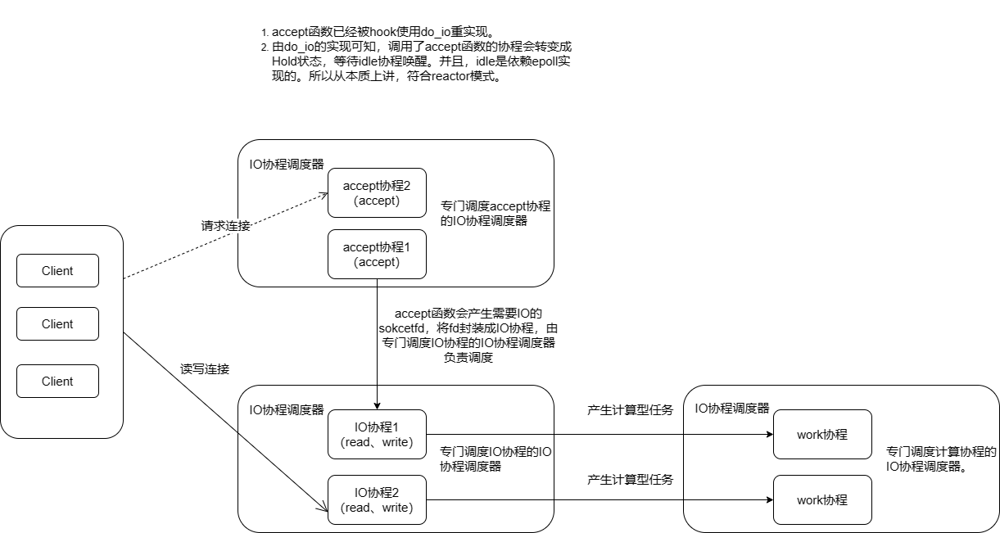
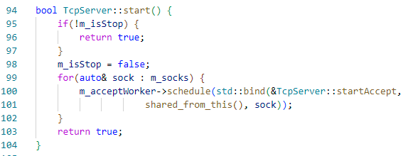
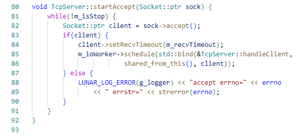
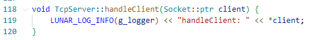
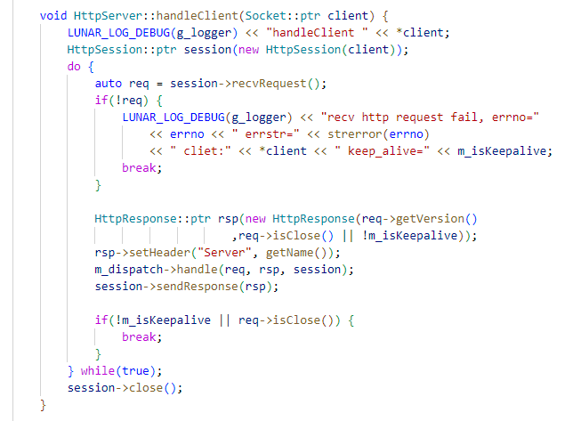

**重写Sylar基于协程的服务器系列：**

[ 重写Sylar基于协程的服务器（0、搭建开发环境以及项目框架 || 下载编译简化版Sylar）](./Start.md)

[ 重写Sylar基于协程的服务器（1、日志模块的架构）](./Log.md)

[重写Sylar基于协程的服务器（2、配置模块的设计）](./Configure.md)

[重写Sylar基于协程的服务器（3、协程模块的设计）](./Fiber.md)

[重写Sylar基于协程的服务器（4、协程调度模块的设计）](./Scheduler.md)

[重写Sylar基于协程的服务器（5、IO协程调度模块的设计）](./IOManager.md)

[重写Sylar基于协程的服务器（6、HOOK模块的设计）](./Hook.md)

[重写Sylar基于协程的服务器（7、TcpServer & HttpServer的设计与实现）](./TcpServerAndHttpServer.md)

## TcpServer模块架构图

将基于线程的主从Reactor模型进行协程的定制化修改，如图所示。

## TcpServer实现

TcpServer类是一个服务器通用类，TcpServer类的实现是Server端专门用来管理Tcp连接的，主要的成员函数及作用如下：

1. 构造函数，用户在构造一个TcpServer时会传三个类型都为IOManager的参数，参数名以功能命名，分别是：worker、io_worker、accept_worker。

2. bind函数，因为一台服务器有可能有多个<ip，端口>对，所以用户在调用bind函数时，可能会传入多个地址对，bind函数就是负责为这些ip地址创建套接字，并且将ip地址和固定端口绑定，开始监听这些套接字。

3. start函数，创建accept协程，并将accept协程放到accept_worker协程调度器里面去，accept协程实际上就是回调函数是TcpServer::startAccept的协程。

    start函数的伪代码：

    

4. startAccept函数，是一个接受客户端连接的回调函数，内部是一个调用accept函数的死循环，在接受到一个socketfd后，将套接字封装成IO协程，并放入io_worker协程调度器中进行调度。IO协程就是回调函数是TcpServer::handleClient函数的协程。

    startAccept函数的伪代码：

    
<!-- more -->

5. handleClient函数，该函数是一个虚函数，是专门用来和客户请求对接的协程，在TcpServer中是一个简单打印连接信息的虚函数，想要实现一个实用的服务器（如HTTP服务器、FTP服务器等）只需要对handleClient函数做定制化重写即可。

    handleClient函数伪代码：

    

## HTTP服务器的实现

HttpServer类继承TcpServer类并重写TcpServer::handleClient函数。
HttpServer类重写了handleClient函数，内部实现为不断调用recvRequest函数的死循环，recvRequest函数底层会调用read函数读取并解析客户请求。在调用revcRequest函数后会将解析的请求提交给Servlet类处理请求，Servlet层会返回回复报文，然后利用sendResponse函数，将回复报文发送回客户端。sendResponse函数底层调用write函数。

handleClient函数重写如下：

于此Sylar基础模块的设计的讲解完结。

除了基于协程的服务器外，推荐读者也可以去看一下Muduo基于线程的网络库的设计。两者对比着学习才能有更好的理解。sylar相对于Muduo来说，性能确实没那么高，但是sylar设计的初衷是奔着框架去的，所以sylar基础设施做的特别好，比如有Muduo没有的配置模块、动态库模块、daemon模块等，sylar另一大优势是对网络编程友好，可以以同步的方式进程网络业务的编写，同时享受异步的性能。而深入阅读Muduo其实就可以发现Muduo网络库One Loop Per Thread的思想，和Nginx的One Loop Per Process有神奇的相似之处，这种模型，靠着每个线程都有自己的loop和任务队列，将需要跨线程执行的任务添加到各自的队列中去串行执行，加锁的临界区会很小，几乎不需要锁。所以Muduo性能很高。

我原来写的的Muduo源码阅读笔记如下：

**Muduo源码笔记系列：**

[muduo源码阅读笔记（0、下载编译muduo）](./Start.md)

[muduo源码阅读笔记（1、同步日志）](./SynLogging.md)

[muduo源码阅读笔记（2、对C语言原生的线程安全以及同步的API的封装）](./ThreadSafeAndSync.md)

[muduo源码阅读笔记（3、线程和线程池的封装）](./ThreadAndThreadPool.md)

[muduo源码阅读笔记（4、异步日志）](./AsyncLogging.md)

[muduo源码阅读笔记（5、Channel和Poller）](./ChannelAndPoller.md)

[muduo源码阅读笔记（6、ExevntLoop和Thread）](./EvevntLoopAndThread.md)

[muduo源码阅读笔记（7、EventLoopThreadPool）](./EventLoopThreadPool.md)

[muduo源码阅读笔记（8、定时器TimerQueue）](./TimerQueue.md)

[muduo源码阅读笔记（9、TcpServer）](./TcpServer.md)

[muduo源码阅读笔记（10、TcpConnection）](./TcpConnection.md)

[muduo源码阅读笔记（11、TcpClient）](./TcpClient.md)

感兴趣的同学，可以阅读一下本文实现的源码：[https://github.com/LunarStore/lunar](https://github.com/LunarStore/lunar)

---

**本章完结**