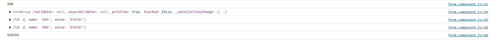

本文主要讲解ANgular在Windows平台的环境搭建。

## 安装Node.JS

1. 官网下载稳定版本的node.js：https://nodejs.org/en/

2. 安装对话框一路默认下一步，当然，可以按需修改安装路径。

3. 安装完成后会自动将Node.JS的根目录添加到环境变量，读者可以自行查询。

4. 在nodejs根目录,创建node_global，node_cache文件夹

5. 以管理人员身份运行CMD。输入如下命令：
<!-- more -->

```bash
# 根据实际安装路径更改路径！
npm config set prefix "D:\DevelopmentToolRoot\WebFront\nodejs\node_global"

npm config set cache "D:\DevelopmentToolRoot\WebFront\nodejs\node_cache"
```

6. 将node_global、node_cache所在路径添加到path环境变量中

7. 全局安装最常用的 express 模块

```bash
npm install express -g
```

8. 配置淘宝镜像并安装cpm ：

```bash
npm config set registry https://registry.npmmirror.com

# 1. 注意修改nodejs安装目录的访问权限，让所有用户都能读写执行。
# 如果之前下载过nodejs，注意删除系统user目录下的package-lock.json文件
# npm install cnpm@7.1.1 -g
npm install -g cnpm
```

9. 可以使用配置查看命令，查看配置是否成功：

```bash
npm config ls
```

## 安装Angular

1. 首先卸载已经安装的版本：

```bash
# 老版本
npm uninstall -g angular-cli
npm uninstall --save-dev angular-cli

# 新版本
npm uninstall -g @angular/cli

# 清空缓存
npm cache verify # npm cache clean --force
```

2. 开始安装，报权限不允许的错误就使用管理员的方式打开cmd！

```bash
# cnpm install -g @angular/cli@8.2.2
cnpm install -g @angular/cli@latest
```

3. 检查是否安装成功

```bash
ng help
```

4. 项目创建

```bash
# 新建一个Angular项目，默认会执行np install
ng new projectName

# 只创建不安装

ng new projectName --skip-install

cd projectName

# npm install、yarn install
cnpm install
```

5. 项目编译&启动

```bash
ng serve --open
```

6. 在浏览器键入：http://localhost:4200/，可看到欢迎页面

---

常见报错：

angular 6中使用socket.io报错：global is not define 
在src/polyfills.ts中添加
```typescript
(window as any).global = window;
```

## 创建一个组件

在项目根目录下使用如下命令：

```bash
D:\root\WorkSpace\AngularRoot\Start>ng g component component/news
CREATE src/app/component/news/news.component.html (19 bytes)
CREATE src/app/component/news/news.component.spec.ts (614 bytes)
CREATE src/app/component/news/news.component.ts (262 bytes)
CREATE src/app/component/news/news.component.scss (0 bytes)
UPDATE src/app/app.module.ts (398 bytes)
```

vscode终端执行ng serve报错：

```bash
ng : 无法加载文件 C:\Users\root\AppData\Roaming\npm\ng.ps1，因为在此系统上禁止运行脚本。有关详细信息，请参阅 https:/go.microsoft.com/fwlink/?LinkID=135170 中的 about_Execution_Policie
s。
所在位置 行:1 字符: 1
+ ng serve
+ ~~
```

在搜索框搜索：Windows PowerShell ISE，执行如下命令并选A（全是）即可解决

```bash
set-ExecutionPolicy RemoteSigned
```

angular不建议使用dom操作来改变class

## 使用Forms模块

在src/app/app.module.ts文件夹中添加：

```typescript
// ...
import { FormsModule } from '@angular/forms';

@NgModule({
  imports: [
    // ...
    FormsModule
  ],

})
```

html 如下：

```html
<div>
    <form class="form" [formGroup]="infoForm">
        <ng-container>
        <div formArrayName="infos">
            <div *ngFor="let info of infos.controls; let i = index">
            <ng-container [formGroupName]="i">
                <label>{{ info.get("name").value}}</label>
                <input type="text" formControlName="value" [id]="i">
            </ng-container>
            </div>
        </div>
        <button (click)="onSubmit()">
            保存
        </button>
        </ng-container>
    </form>
</div>
```

ts代码如下：

```typescript
export class FormComponent implements OnInit {
  // fb:FormBuilder;
  constructor(private fb:FormBuilder) { 
    // this.fb = fb;
  }
  infoForm = this.fb.group ({
    infos: this.fb.array([]),
  });
  get infos(): FormArray {
    return this.infoForm.get('infos') as FormArray;
  }
  ngOnInit() {

    const fm = this.fb.group({
      id: 1,
      name: "aaa",
      value: "aiaiai",

    });
    this.infos.push(fm);

    const fm1 = this.fb.group({
      id:2,
      name:"bbb",
      value:"bibibi",

    });
    this.infos.push(fm1);

    const fm2 = this.fb.group({
      id:3,
      name:"ccc",
      value:"cicici",

    });
    this.infos.push(fm2);

    var playerInterval_dvp = setInterval(() => {
      console.log("aaa")
    });
  }

  onSubmit(){
    console.log(this.infos.at(1).get('name').value);

    console.log((this.infos.at(1)))

    console.log((this.infos.at(1).value))

    console.log((this.infos.at(1).value as MyInfoInterface))

    console.log((this.infos.at(1).value as MyInfoInterface).value)
  }

}


export interface MyInfoInterface {
  id: number;
  name: string;
  value: string;
}
```

点击按钮后，结果如下：



## 创建一个服务

```bash
ng g service service/storage
```

在src/app/app.module.ts文件夹中添加：

```typescript
import { StorageService } from './service/storage.service';

@NgModule({
  // ...
  providers: [StorageService],
  // ...
})
```

在组件文件中添加：

```typescript
import { StorageService } from '../../service/storage.service';

export class SearchComponent implements OnInit {

  public keyword:string="电脑";
  public history:any[]=[];
  storage:StorageService;
  constructor(storage:StorageService) {
    this.storage = storage;
    var hi = this.storage.get("history");
    if (hi) {
      this.history = hi;
    }
  }

  ngOnInit() {
  }
}

```

## DOM操作

DOM操作最好在ngAfterViewInit函数中进行，ngOnInit中操作的话，可能一些dom还没有加载完成导致获取不到DOM

在angular中，操作dom的方式有两种：使用原生js和使用ViewChild

```html
<p #myfirstdom>domopt works!</p>
```

```typescript
import { Component, OnInit, ViewChild} from '@angular/core';

@Component({
  selector: 'app-domopt',
  templateUrl: './domopt.component.html',
  styleUrls: ['./domopt.component.scss']
})
export class DomoptComponent implements OnInit {

  @ViewChild("myfirstdom", {static:true}) myfirstdom:any;
  constructor() { }

  ngOnInit() {
  }

  ngAfterViewInit(){
    console.log(this.myfirstdom);
    this.myfirstdom.nativeElement.innerHTML = "aaa";
  }
}

```

## 父子组件传值

### 方式一：

数据、函数、父组件本身都能通过该方法传递。

父组件中定义:

```typescript
export class NewsComponent implements OnInit {

  public title:string = "新闻";
  @ViewChild("myheader", {static:true}) header:any;
  constructor() { }

  ngOnInit() {
  }

}
```

```html
<app-header #myheader [title]="title"></app-header>
```

子组件中定义：

```typescript
import { Component, OnInit, Input} from '@angular/core';

export class HeaderComponent implements OnInit {
  @Input() title:any;
  constructor() {

  }

  ngOnInit() {
  }
}
```

### 方式二：

子组件通过事件驱动的方式给父组件发消息。

子组件配置：

```typescript
import { Component, OnInit, Input, Output, EventEmitter} from '@angular/core';

export class HeaderComponent implements OnInit {
  @Output() outer = new EventEmitter();
  constructor() {
    console.log(this.dt)
  }

  ngOnInit() {
    this.mvvm="初始值"
  }

  sendParent(){
    console.log("header的sendParent方法");
    this.outer.emit("header的sendParent");
  }
}
```

父组件配置：

```html
<app-header (outer)="run($event)"></app-header>
```

```typescript
import { Component, OnInit, ViewChild } from '@angular/core';

export class NewsComponent implements OnInit {
  constructor() { }

  ngOnInit() {
  }
  run(arg:any){
    alert("新闻中的run方法，还可以直接把整个新闻组件传给header！！！" + arg);
  }
}
```

## 异步处理

有两种：rxjs（observable）或者promise，主要介绍一下rxjs

### 使用rxjs：

```typescript
import {map,filter} from 'rxjs/operators'
import { RequestService } from '../../service/request.service'

export class HomeComponent implements OnInit {
  request:RequestService;

  constructor(request:RequestService) {

  }

  ngOnInit() {
    var streamNum = this.request.getRxjsIntervalTimer();

    streamNum.pipe(
      filter(
        (value)=>{
          if (Number(value)%2 == 0) {
            return true;
          }
          // console.log(Number(value)*Number(value));
          return false;
      }),
      map(
        (val)=>{
            return Number(val)*Number(val);
        })
    ).subscribe((value) => {
      console.log(value);
    });
  }

}
```

RequestServer：

```typescript
import { Observable } from 'rxjs';

export class RequestService {

  constructor() { }

  getRxjsIntervalTimer(){
    var cnt = 0;
    return new Observable(
      (observe)=>{
        setInterval(()=>{
          cnt++;
          // console.log(cnt);
          observe.next(cnt);
        }, 1000);
      }
    );
  }
}
```

## 使用get、post请求

app.module.ts:

```typescript
import { HttpClientModule } from '@angular/common/http'

@NgModule({
  // ...
  imports: [
    // ...
    HttpClientModule,
  ]
  // ...
})
```

http如下：

```html

<button (click)="getRequest()">get请求</button>

<button (click)="postRequest()">post请求</button>

<button (click)="getJsonpData()">jsonp请求</button>

```

请求逻辑如下：

```typescript
import { HttpClient, HttpHeaders } from '@angular/common/http'

export class RequesthttpComponent implements OnInit {
  http:HttpClient;
  constructor(http:HttpClient) {
    this.http = http;
  }

  ngOnInit() {  }

  getRequest(){
    this.http.get("http://a.itying.com/api/productlist").subscribe((value)=>{
      console.log(value);
    });
  }

  postRequest() {
    var httpOptions = { headers: new HttpHeaders({"Content-Type": "application/json"}) };
    this.http.post("www.baidu.com", {"username":"zhangsan", "password":"123"}, httpOptions).subscribe((data)=>{
        console.log(data);
    });
  }

  getJsonpData(){
    this.http.jsonp("http://a.itying.com/api/productlist", "callback").subscribe((value)=>{
      console.log(value);
    }); 
  }
}
```

## 路由

在app-routing.module.ts可配置静态路由：

```typescript
import { NewsComponent } from './components/news/news.component';
import { MovieComponent } from './components/movie/movie.component';
import { GameComponent } from './components/game/game.component';
import { ContentComponent } from './components/content/content.component';

const routes: Routes = [
  {
    path:"news",
    component: NewsComponent,
  },{
    path:"movie",
    component: MovieComponent,
  },{
    path:"game",
    component: GameComponent,
  },{
    path:"content",
    component: ContentComponent,
  },{
    path:"**",
    component: NewsComponent,
  },
];
```

加routerLinkActive可实现激活

```html
<a [routerLink]="'/news'" routerLinkActive="active">新闻</a>
<a [routerLink]="'/movie'" routerLinkActive="active">电影</a>
<a [routerLink]="'/game'" routerLinkActive="active">游戏</a>
```

组件路由并传参：

get路由：

```typescript
{
    path:"content",
    component: ContentComponent,
  }
```

父：

```html
<p>news works!</p>


<ul>
    <li *ngFor="let item of list; let i=index;">
        <a [routerLink]="'/content'" [queryParams]="{aid:i}">{{i}} === {{item}}</a>
    </li>
</ul>
```

子：

```typescript
import { ActivatedRoute } from '@angular/router';

export class ContentComponent implements OnInit {
  router:ActivatedRoute;
  constructor(router:ActivatedRoute) {
    this.router = router;

  }

  ngOnInit() {
    this.router.queryParams.subscribe((value)=>{
      console.log(value);
    });
  }

}

```

动态路由：

```typescript
{
    path:"content/:aid",
    component: ContentComponent,
  }
```

父：

```html
<ul>
    <li *ngFor="let item of list; let i=index;">
        <a [routerLink]="['/content/', i]">{{i}} === {{item}}</a>
    </li>
</ul>
```

子：

```typescript
import { ActivatedRoute } from '@angular/router';

export class ContentComponent implements OnInit {
  router:ActivatedRoute;
  constructor(router:ActivatedRoute) {
    this.router = router;

  }

  ngOnInit() {
    this.router.params.subscribe((value)=>{
      console.log(value);
    });
  }

}
```

js 动态路由：

app-routing.module.ts:

```typescript
{
    path:"content/:aid",
    component: ContentComponent,
  }
```

父

```typescript
import { Router } from '@angular/router';


export class NewsComponent implements OnInit {

  router:Router;
  constructor(router:Router) {
    this.router = router;
  }

  ngOnInit() {
    this.router.navigate(["/content", "123"]);
  }
}
```

子

```typescript
import { ActivatedRoute } from '@angular/router';

export class ContentComponent implements OnInit {
  router:ActivatedRoute;
  constructor(router:ActivatedRoute) {
    this.router = router;

  }

  ngOnInit() {
    this.router.params.subscribe((value)=>{
      console.log(value);
    });
  }

}
```

js get路由：

```typescript
{
    path:"content",
    component: ContentComponent,
  }
```

父：

```typescript
import { Router, NavigationExtras } from '@angular/router';


export class NewsComponent implements OnInit {
  router:Router;
  constructor(router:Router) {
    this.router = router;
  }

  ngOnInit() {
    let params:NavigationExtras = {
      queryParams:{aid:"123"},
      fragment:"anchor"
    }
    this.router.navigate(["/content"], params);
  }
}

```

子：

```typescript

import { ActivatedRoute, Router } from '@angular/router';

export class ContentComponent implements OnInit {
  router:ActivatedRoute;
  constructor(router:ActivatedRoute) {
    this.router = router;

  }

  ngOnInit() {
    this.router.queryParams.subscribe((value)=>{
      console.log(value);
    });
  }

}

```

路由嵌套：

根：

```html
<a [routerLink]="'/news'" routerLinkActive="active">新闻</a>
<a [routerLink]="'/movie'" routerLinkActive="active">电影</a>
<a [routerLink]="'/game'" routerLinkActive="active">游戏</a>
<router-outlet></router-outlet>
```

app-routing.module.ts:

```typescript
import { NgModule } from '@angular/core';
import { Routes, RouterModule } from '@angular/router';

import { NewsComponent } from './components/news/news.component';
import { MovieComponent } from './components/movie/movie.component';
import { GameComponent } from './components/game/game.component';
import { ContentComponent } from './components/content/content.component';

import { SystemsetComponent } from './components/movie/systemset/systemset.component';
import { SystemmaintainComponent } from './components/movie/systemmaintain/systemmaintain.component';
import { GamesetComponent } from './components/game/gameset/gameset.component';
import { GameupdateComponent } from './components/game/gameupdate/gameupdate.component';

const routes: Routes = [
  {
    path:"news",
    component: NewsComponent
  },{
    path:"movie",
    component: MovieComponent,
    children:[
      {
        path:"systemset",
        component:SystemsetComponent,
      },{
        path:"systemmaintain",
        component:SystemmaintainComponent,
      },{
        path:"**",
        component:SystemsetComponent,
      }
    ],
  },{
    path:"game",
    component: GameComponent,
    children:[
      {
        path:"gameset",
        component:GamesetComponent,
      },{
        path:"gameupdate",
        component:GameupdateComponent,
      },{
        path:"**",
        component:GamesetComponent,
      }
    ],
  // },{
  //   path:"content",
  //   component: ContentComponent,
  // },{
  },{
    path:"content",
    component: ContentComponent,
  },{
    path:"**",
    component: NewsComponent,
  },
];

@NgModule({
  imports: [RouterModule.forRoot(routes)],
  exports: [RouterModule]
})
export class AppRoutingModule { }
```

component/movie/movie.component.html

```html
<p>movie works!</p>


<div class="content">

    <div class="left">
        <a [routerLink]="'/movie/systemset'" routerLinkActive="active">系统设置</a>
        <br>
        <br>
        <a [routerLink]="'/movie/systemmaintain'" routerLinkActive="active">系统维护</a>
    </div>

    <div class="right">
        <router-outlet></router-outlet>
    </div>
</div> 
```

component/game/game.component.html

```html
<p>game works!</p>


<div class="content">

    <div class="left">
        <a [routerLink]="'/game/gameset'" routerLinkActive="active">游戏设置</a>

        <br>
        <br>
        <a [routerLink]="'/game/gameupdate'" routerLinkActive="active">游戏更新</a>
    </div>

    <div class="right">
        <router-outlet></router-outlet>
    </div>
</div> 
```

---
---

## Subject和Observable的区别

Observable是Subject的特例，Subject是典型的发布订阅模式，可以将消息传递给多个订阅者，但是Observable只能一对一。

## 关于Renderer2的介绍

Renderer2 是 Angular 提供的一个用于操作 DOM 的服务类。它允许你在不直接访问浏览器的 DOM API 的情况下，通过抽象层安全地操作 DOM。Renderer2 是为了增强跨平台兼容性和更好的安全性而设计的，使得你的应用可以在浏览器、服务器端渲染（如 Angular Universal）以及 Web Workers 等不同的环境中运行。

## 关于dom操作

constructor(
  private Re2: Renderer2,
  private el: ElementRef,
  // 其他依赖项...
) { }

直接访问宿主元素：

1. ElementRef 提供了对 Angular 组件、指令或 HTML 元素的宿主元素的直接引用。通过 el.nativeElement，你可以访问并操作该元素。例如，如果这个 ElementRef 是在一个组件中注入的，那么 el.nativeElement 指向该组件的根 DOM 元素。
与 Renderer2 结合使用：

2. 在你提供的构造函数中，ElementRef 通常与 Renderer2 一起使用。Renderer2 提供了一组安全的方法来操作 DOM，而 ElementRef 提供了操作的目标元素。
例如，在 ngOnInit 或其他方法中，你可能会通过 el.nativeElement 获取 DOM 元素，然后使用 Renderer2 对其应用样式、添加类或处理事件。

## Data URL

例如，一个图像的Data URL可能看起来像这样：

```bash
data:image/png;base64,iVBORw0KGgoAAAANSUhEUgAAAAUAAAAFCAYAAACNbyblAAAAHElEQVQI12P4//8/w38GIAXDIBKE0DHxgljNBAAO9TXL0Y4OHwAAAABJRU5ErkJggg==
```

在这个例子中：

1. image/png 指定了MIME类型，表示这是一个PNG图像。

2. base64 表示数据是使用Base64编码的。

3. 后面的长字符串是图像数据的Base64编码表示。

它允许将小文件直接嵌入到网页或网络请求中，而不需要从服务器上单独请求资源。Data URL 通常用于图像、字体、CSS、JavaScript 和其他小型文件，以减少HTTP请求的数量，从而提高页面加载速度。

---

本章完结