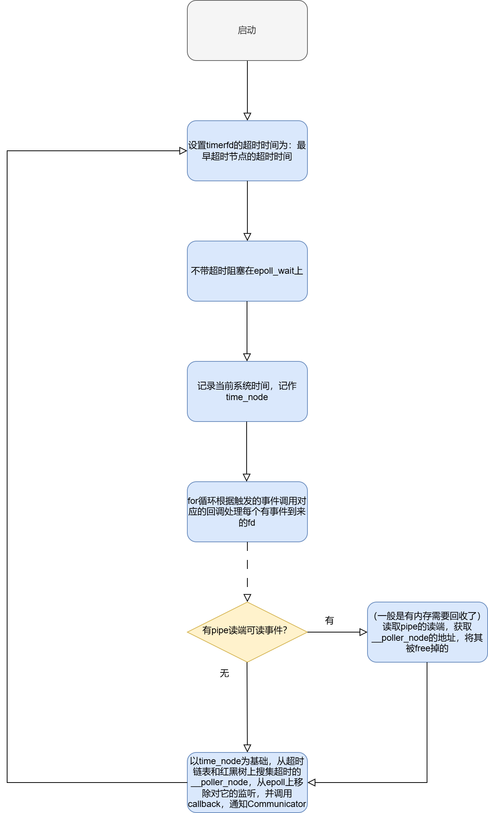
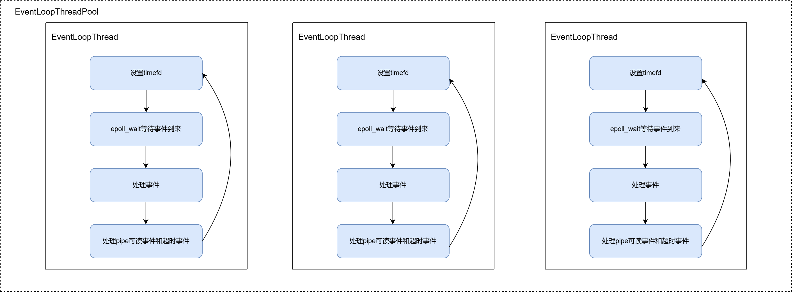

[WorkFlow源码剖析——GO-Task 源码分析](https://blog.csdn.net/m0_52566365/article/details/142903964)

[WorkFlow源码剖析——Communicator之TCPServer（上）](https://blog.csdn.net/m0_52566365/article/details/143452443)

[WorkFlow源码剖析——Communicator之TCPServer（中）](https://blog.csdn.net/m0_52566365/article/details/143493066)

[WorkFlow源码剖析——Communicator之TCPServer（下）](https://blog.csdn.net/m0_52566365/article/details/143605123)

## 前言

上一篇博客已经介绍了一下WorkFlow GO-Task的实现原理。本文会介绍一下WorkFlow Tcp Server端的一些实现细节以及有趣的思想。因为这部分涉及的内容有点多，一些有趣的细节也希望能完整的叙述出来，所以我可能会将TCPServer拆分成上中下三个部分。三个部分分别对应：poller的实现（即对IO对路复用事件池的封装，属于最底层），Communicator的实现（对连接对象生命周期的管理，属于中间层），最后就是TCPServer的实现（利用中间层实现一个TCPServer）。文件异步IO相关的内容，后面抽空会补上。

<!-- more -->

这里声明一下：

关于workflow的线程池，其实最终的目的就是实现一个线程池嘛，知道它是个什么东西，看一下它的接口，其实就差不多了。原理都是一样的，就是实现细节上各有各的特点。workflow的线程池简单描述它的特点就是一种链式的线程池。它所涉及的源码也不多就200多行，如果专门起一篇博客去讲解它，以我的表达能力和理解的深度，估计到时候代码的比例又会占大头。成了纯纯的贴代码的博客是我不愿意看到的。所以如果你对workflow线程池的实现感兴趣，建议你亲自去看看它的源码。我始终认为，如果你想了解一个项目的源码，博客写的再好，也只能作为辅助，它只能在你看源码有疑惑时给你一些指点，或者说作为你在读完源码后，回头巩固的一种手段。最终亲眼看看代码才是正道。

关于消息队列，和线程池紧密相关的就是任务（/消息）队列。我最大的收货就是：我们以往再写线程池任务队列时，读写都是一把锁，而workflow线程的任务队列却有两把锁，**读和写分别持有一把**，巧妙的降低了锁的竞争。具体细节，感兴趣的读者可以自行阅读源码，这里就不过多赘述。

Workflow其实没有TcpServer的概念，相关的其实就是一个CommService，而CommService其实可以理解为TCPServer，尽管CommService其实也是支持udp等其他非tcp的协议。但是我们重点只关注tcp相关的东西。所以，下文提到的TcpServer都代指CommService。

本文会按照如下顺序讲解TcpServer的实现：

poller相关的数据结构的介绍 -> 事件循环的设计 -> 对poller_node的增删改 -> 对定时器的增删 -> 对IO事件回调函数的流程分析。

## 对IO以及IO多路复用的封装

本节内容主要集中在poller.c文件，主要关注workflow对epoll事件池的设计以及linux原生IO相关api的最底层的封装。这里涉及大量的回调。不得不说workflow对回调理解的是真的透彻。

### 数据结构的分析

首先是数据结构__poller：

```cpp
typedef struct __poller poller_t;   // 对外暴露的名称

struct __poller
{
	size_t max_open_files;                              // 该epollfd支持的最大fd
	void (*callback)(struct poller_result *, void *);   // 由Communicator设置，Communicator会根据poller_result.poller_data.operation的类型回调不同的函数。
	void *context;                                      // 传给callback的参数

	pthread_t tid;                                      // epollfd监听线程的线程id
	int pfd;                                            // epollfd
	int timerfd;
	int pipe_rd;                                        // 管道读端，通知回收某个/些__poller_node
	int pipe_wr;                                        // 管道写端
	int stopped;
	struct rb_root timeo_tree;                          // 带超时的__poller_node红黑树，以下三个成员都和[定时器]红黑树相关
	struct rb_node *tree_first;
	struct rb_node *tree_last;
	struct list_head timeo_list;                        // 带超时的__poller_node链表
	struct list_head no_timeo_list;                     // 不带超时的__poller_node链表
	struct __poller_node **nodes;                       // 可根据fd索引每一个__poller_node
	pthread_mutex_t mutex;
	char buf[POLLER_BUFSIZE];                           // 共享buffer
};
```

poller的数据结构每项成员的定义非常恰到好处，我相信比较难理解的就是为啥为定时器搞了两种结构：链表和红黑树？后面在看到定时器的增删查改时再谈谈我的理解。

这里可以先用定时器类型，简单的对__poller_node进行分类：

1. 带超时的__poller_node：带超时的__poller_node又有两种挂法：

    1. 被挂到红黑树timeo_tree上。

    2. 按递增顺序，被挂到超时链表timeo_list上。

2. 不带超时的__poller_node：被挂到no_timeo_list链表上。

然后就是数据结构__poller_node：

它的定义如下：

```cpp
struct __poller_node
{
	int state;                  // __poller_node的状态
	int error;
	struct poller_data data;    // 稍后解释
#pragma pack(1)
	union
	{
		struct list_head list;  // 如果是在链表上使用该成员作为节点
		struct rb_node rb;      // 如果是在红黑树上使用该成员作为节点
	};
#pragma pack()
	char in_rbtree;             // 是在红黑树上吗？
	char removed;               // 被从epoll上移除取消监听（链表/红黑树上也会移除该node）
	int event;                  // epoll监听的事件
	struct timespec timeout;    // fd超时时间
	struct __poller_node *res;  // 稍后解释，（PS，我也有点忘了）
};
```

如果你看过Muduo的源码，那么__poller + __poller_node可以看作Muduo当中的EPollPoller，而Muduo当中，定时器同样使用的是timerfd_，区别是Muduo当中直接使用了标准库当中的std::set对定时器进行排序，而workflow使用的是自己造的红黑树的轮子。并且workflow额外使用了一个链表来维护带超时的__poller_node。

当然在__poller_node结构体当中，我还没有解释data成员是干啥的，这里既然扯到了Muduo，顺便提一嘴：data成员其实可以等价与Muduo当中的Channel。poller_data当中也是有各种来自（Communicator）上层注册的回调函数。

poller_dataj结构体在workflow当中定义如下：

```cpp
struct poller_data
{
// poll关心的事件的定义。
#define PD_OP_TIMER			0
#define PD_OP_READ			1
#define PD_OP_WRITE			2
#define PD_OP_LISTEN		3
#define PD_OP_CONNECT		4
#define PD_OP_RECVFROM		5
/* ... */
#define PD_OP_EVENT			9
#define PD_OP_NOTIFY		10
	short operation;
	unsigned short iovcnt;
	int fd;
	SSL *ssl;
	union
	{
		poller_message_t *(*create_message)(void *);    // 钩爪异步读上下文的回调
		int (*partial_written)(size_t, void *);
		void *(*accept)(const struct sockaddr *, socklen_t, int, void *);
		void *(*recvfrom)(const struct sockaddr *, socklen_t,
						  const void *, size_t, void *);
		void *(*event)(void *);
		void *(*notify)(void *, void *);
	};
	void *context;
	union
	{
		poller_message_t *message;      // 异步读上下文，由create_message创建
		struct iovec *write_iov;        // 异步写缓存
		void *result;
	};
};
```

|	回调函数		|	作用	|
|	:-:				|	:-:		|
|	create_message	|	（fd的read事件）利用该回调可以构造一个msg对象，并且每次在fd可读时，将读到的数据交给该msg去处理（解析），解释完成后返回一个大于0的值，然后通poller的callback通知上层（Communicator）|
|	partial_written	|	（fd的write事件）在每次fd可写并且**尽力**写入一些数据后会调用该回调，以更新写超时时间	|
| accept			|	（fd的read事件）在listen fd接受一条连接并为连接创建一个读写sockfd后，会调用该回调，回调会为该sockfd创建一个CommServiceTarget对象	|
|	recvfrom		|	（fd的read事件）使用udp协议的读（可以先不管，主要研究tcp，先将workflow的tcp打通）	|
|	event			|	（fd的read事件）为实现文件fd的异步读写而生，作者暂时还未能去详细了解，在后续有空了再补上，我们重点还是关注网络socket fd的读写事件和回调	|
|	notify	|	同event	|


其次就是poller_result结构体，该结构体其实就是__poller_node最前面三个成员。在poller.c当中，poller_result一般是以指针的形式去使用，并且是将__poller_node类型的变量的地址作为其值，如果你C语言基础足够扎实，结合poller_result和__poller_node定义的成员去看，其实很容易的理解到：**将__poller_node类型的变量的地址作为poller_result*变量的值的用法就是只使用__poller_node的前三个成员。**

```cpp

struct poller_result
{
#define PR_ST_SUCCESS		0
#define PR_ST_FINISHED		1
#define PR_ST_ERROR			2
#define PR_ST_DELETED		3
#define PR_ST_MODIFIED		4
#define PR_ST_STOPPED		5
	int state;
	int error;
	struct poller_data data;
	/* In callback, spaces of six pointers are available from here. */
};
```

在了解了poller当中的数据结构之后，如果你之前有过阅读其他网络库/框架相关源码，其实我们就可以猜测，workflow当中的poller一定会有针对epollfd/超时链表/红黑树进行增删查改的一些函数。

这里吐槽一下workflow，我觉得muduo、sylar这些网络框架层次其实更加分明，epoll池是epoll池、io读写操作是io读写操作、定时器是定时器。而在workflow当中。这三部分完全混合在了一个文件当中去实现。导致我最开始看poller源码时，感觉很混乱。

### 事件循环（Event Loop） --- 主干

凡是网络框架都会使用epoll/poll等IO多路复用机制，不得不说IO多路复用机制也确实挺好用的。而使用了IO多路复用机制的程序肯定避不开事件循环。本小节会逐步讲解从__poller的创建 到 事件循环的启动。

首先是__poller的创建，其实__poller和__mpoller的创建可以放一起去讲解，__mpoller就是一群__poller的集合，可以将__mpoller理解为__poller的manager，一个__poller在创建时会申请一个epollfd，而__mpoller向外部提供的接口是具有负载均衡的功能的，它会将读写socketfd分散的发给__poller，同样的__poller内部就是一群__poller_node的集合（socket fd），你也可以将__poller看作__poller_node的manager。下面来看看__mpoller是如何构造每一个__poller的。

```cpp
static int __mpoller_create(const struct poller_params *params,
							mpoller_t *mpoller) {
	void **nodes_buf = (void **)calloc(params->max_open_files, sizeof (void *));
	unsigned int i;

	if (nodes_buf) {
		for (i = 0; i < mpoller->nthreads; i++) {
			mpoller->poller[i] = __poller_create(nodes_buf, params);
			if (!mpoller->poller[i])
				break;
		}

		if (i == mpoller->nthreads) {
			mpoller->nodes_buf = nodes_buf;
			return 0;
		}
		// ...
	}

	return -1;
}
```

代码很简单，就是分配一个max_open_files大小的指针数组（nodes_buf），然后调用__poller_create函数，将nodes_buf作为参数构造__poller对象，__poller_create会根据传入的参数对__poller做一些初始化，而__poller的nodes成员被初始化为指向nodes_buf，前面介绍过，nodes成员可根据socket fd索引__poller_node。 **那么问题就来了，多个__poller共用一个nodes_buf，这样不会有问题吗？？？**

（经过深入思考）我可以明确的告诉你，确实不会，而且这种用法还很奇妙。这是因为有 **{nodes成员可根据socket fd索引__poller_node}** 这句话保底，因为在linux当中，一个进程当中的描述符（fd）绝对不可能重复！所以即使你创建的多个__poller对象，多个__poller对象又共用一个nodes_buf，但是分配给它们的socket fd（__poller_node）绝对**互不相同**，又因为__poller_node是根据socket fd索引的，故真实的情况是：**每个__poller会共用一个nodes_buf，但是各自使用nodes_buf的不同entry。**

然后就是__poller的启动，调用mpoller的mpoller_start函数可以启动所有的__poller，对于每个__poller的启动会调用poller_start函数，它的实现如下：

```cpp
int poller_start(poller_t *poller) {
	pthread_t tid;
	int ret;

	pthread_mutex_lock(&poller->mutex);
	if (__poller_open_pipe(poller) >= 0) {
		ret = pthread_create(&tid, NULL, __poller_thread_routine, poller);
		if (ret == 0) {
			poller->tid = tid;
			poller->stopped = 0;
		}
		else {
			errno = ret;
			close(poller->pipe_wr);
			close(poller->pipe_rd);
		}
	}

	pthread_mutex_unlock(&poller->mutex);
	return -poller->stopped;
}
```

主要就干了两件事：

1. 调用__poller_open_pipe函数创建pipfd，将pipfd读端注册到epollfd上，pipfd在__poller当中起到内存回收的作用。具体是什么玩法，后面详细解释。（PS：说实话第一次看到用pipfd做内存回收的用法感觉挺不可思议的。真得感叹一句真是艺高人胆大！）

2. 创建并启动事件循环线程。

总结一下就是和Muduo**很像**的One loop per thread，注意这里的加粗，在看完workflow的__poller源码后，感觉和Muduo的还是有很大差别的，我只能说Muduo的One loop per thread的思想的纯净，Muduo的代码阅读起来也很舒服。而workflow的却不同，它可能夹杂着业务优化的考量，所以并不是那么纯粹的One loop per thread，所以我在源码阅读时比较坎坷。（也可能是我功力不够深厚，没能领悟其奥妙。）针对加锁方面尤为明显，两者每个loop线程都会有自己的互斥锁，Muduo仅在对任务队列操作的时候会加锁，而workflow加锁的范围会稍微大点，凡是对__poller内部数据成员的访问都会加锁。

事件循环的历程函数是__poller_thread_routine，它的实现如下：

```cpp
static void *__poller_thread_routine(void *arg) {
	poller_t *poller = (poller_t *)arg;
	__poller_event_t events[POLLER_EVENTS_MAX];
	struct __poller_node time_node;
	struct __poller_node *node;
	int has_pipe_event;
	int nevents;
	int i;

	while (1) {
		// 将最早超时的节点的超时时间作为定时器的超时时间
		__poller_set_timer(poller);
		// 等待时间的到来
		nevents = __poller_wait(events, POLLER_EVENTS_MAX, poller);
		// 获取当前时间，小于该时间的节点视为超时。
		clock_gettime(CLOCK_MONOTONIC, &time_node.timeout);
		// pipfd可读？
		has_pipe_event = 0;
		for (i = 0; i < nevents; i++) {
			// 将private转换为__poller_node*
			node = (struct __poller_node *)__poller_event_data(&events[i]);
			if (node <= (struct __poller_node *)1) {	// 是pipfd？
				if (node == (struct __poller_node *)1)
					has_pipe_event = 1;
				continue;
			}
			// 根据__poller_node.data的operation调用对应的回调函数。
			switch (node->data.operation) {
			case PD_OP_READ:
				__poller_handle_read(node, poller);
				break;
			case PD_OP_WRITE:
				__poller_handle_write(node, poller);
				break;
			case PD_OP_LISTEN:
				__poller_handle_listen(node, poller);
				break;
			case PD_OP_CONNECT:
				__poller_handle_connect(node, poller);
				break;
			/* 省略SSL、UDP相关部分... */
			case PD_OP_EVENT:
				__poller_handle_event(node, poller);
				break;
			case PD_OP_NOTIFY:
				__poller_handle_notify(node, poller);
				break;
			}
		}

		if (has_pipe_event) {
			// 内存回收
			if (__poller_handle_pipe(poller))
				break;
		}
		// 处理超时的__poller_node
		__poller_handle_timeout(&time_node, poller);
	}

	return NULL;
}
```

流程事件循环的流程图如下所示：



最后改造了一下之前画的Muduo的one loop per thread的架构图。放在下面，读者可以好好品味一下。



你可以参考一下[Muduo的one loop per thread的架构图](../muduo/EventLoopThreadPool.md)，以及[xv6最后优化其调度器模型的架构图](../xv6/Scheduler.md)，再来看workflow的__poller的架构图，你一定会吃惊它们是如此的相似！

### 对poller_node的增删改

poller对外暴露的对对poller_node的增删改的接口包括：poller_add、poller_del、poller_mod。

**首先：**

这些接口在sylar、muduo中其实也有类似的。从函数的名称其实就能推测出它们分别代表：

```bash
poller_add -> 向poller中添加poller_node;

poller_del -> 删除poller_node;

poller_mod -> 修改poller_node;
```

**进一步的：**

1. poller_add本质上会将poller_node.data.fd连同关心的读/写事件**添加**到epoll当中。如果poller_node.timeout被用户设置过，还会将poller_node挂到超时链表上或者是红黑树上。**适当的时候更新timefd的设置。**

2. poller_del本质会将poller_node.data.fd连同关心的读/写事件从epoll当中**删除**。

3. poller_mod本质上会**修改**被挂到epoll当中的poller_node.data.fd所关心的读/写事件。当然此时如果用户重新设置了poller_node的超时时间，则应该**调整**poller_node在超时链表/红黑树的位置。**适当的时候更新timefd的设置。**

**实际上的：**

poller实际源码也正是这样做的。这里有一些比较意思的实践，这里一一列举一下：

首先是根据poller_node的超时时间，将poller_node挂到超时链表/红黑树上的操作。这个操作在poller_add、poller_mod都有需求。所以在poller当中是实现一个专门的函数__poller_insert_node，该函数功能就是**将poller_node插入到超时链表/红黑树适当位置，并且在poller_node是最早超时的节点时，更新timefd的设置。**

poller_node源码如下：

```cpp

static void __poller_insert_node(struct __poller_node *node,
								 poller_t *poller) {
	struct __poller_node *end;

	end = list_entry(poller->timeo_list.prev, struct __poller_node, list);
	if (list_empty(&poller->timeo_list)) {
		list_add(&node->list, &poller->timeo_list);
		end = rb_entry(poller->tree_first, struct __poller_node, rb);
	} else if (__timeout_cmp(node, end) >= 0) {
		list_add_tail(&node->list, &poller->timeo_list);
		return;
	} else {
		__poller_tree_insert(node, poller);
		if (&node->rb != poller->tree_first)
			return;

		end = list_entry(poller->timeo_list.next, struct __poller_node, list);
	}

	if (!poller->tree_first || __timeout_cmp(node, end) < 0)
		__poller_set_timerfd(poller->timerfd, &node->timeout, poller);
}
```

第一次看这段代码可能会感觉比较绕，下面我来梳理它的逻辑：

其实主要是三个分支，假设现在要添加名为node的poller_node：

0. 先获取（按升序排列的）超时链表上的最后一个元素。

1. 如果超时链表为空，直接将node加到超时链表尾部，然后获取红黑树第一个poller_node，如果红黑树为空或者说node比红黑树的第一个poller_node还小。那么将timefd的超时时间设置为node的超时时间。

2. 如果node比超时链表最后一个poller_node超时时间还大。那直接将node添加到超时链表末尾即可。timefd不用改。

3. 如果node超时时间小于超时链表最后一个元素超时时间，就将node添加到红黑树上。此时要是node正好作为红黑树的第一个元素（红黑树当中最小的节点），就比较一下node超时时间和超时链表第一个元素的超时时间。如果node比链表第一个元素超时时间小的话，更新timefd为node的超时时间。

仔细梳理一下该函数的逻辑其实也是很清晰的。说白了就是将node添加到链表/红黑树当中，同时当node是作为最小超时时间时，更新一下timefd的超时时间。这里使用两种数据结构的原因是：

1. 利用升序链表追加比红黑树快的优点；

2. 利用红黑树随机插入比升序链表快的优点；

其次就是poller当中内存管理的做法：

对于poller_add、poller_mod其实会调用__poller_new_node（间接调用malloc）分配一个新的地址作为poller_node。

对于poller_del，会将poller_node从超时链表/红黑树上移除。同时**将poller_node的地址作为数据，写到pipe当中。等待pipe读时间处理函数调用poller->callback去回收**。这种将地址写到管道然后异步回收的做法在我最开始看到的时候是为它捏了一把汗的。像我这种普通人肯定写不出这样的代码的。

这里可以欣赏一下poller_del的代码

```cpp
int poller_del(int fd, poller_t *poller) {
	struct __poller_node *node;
	int stopped = 0;

	pthread_mutex_lock(&poller->mutex);
	node = poller->nodes[fd];
	if (node) {
		poller->nodes[fd] = NULL;

		if (node->in_rbtree)
			__poller_tree_erase(node, poller);
		else
			// 要么是被从超时链表上移除，要么是被从非超时链表上删除。统一都可以使用list_del来删除。
			list_del(&node->list);

		__poller_del_fd(fd, node->event, poller);

		node->error = 0;
		node->state = PR_ST_DELETED;
		stopped = poller->stopped;
		if (!stopped) {
			node->removed = 1;
			// 将地址写到pipe当中，异步让pipe读事件去回收
			write(poller->pipe_wr, &node, sizeof (void *));
		}
	}
	else
		errno = ENOENT;

	pthread_mutex_unlock(&poller->mutex);
	if (stopped) {
		// 事件处理线程停止了，就主动去释放了。其实pipe读事件处理函数也是做下面这两步操作
		free(node->res);
		poller->callback((struct poller_result *)node, poller->context);
	}

	return -!node;
}
```

### 定时器的增删

poller对外暴露的定时器操作的接口包括：poller_add_timer、poller_del_timer，简单来说就是对定时器进行添加和删除。

这里可以需要明确一点，超时事件分为两类：定时器超时 和 读写事件的超时。

- 定时器超时是指：用户需要指定一个回调函数在延迟n ms后才执行。使用场景比如：1分钟向文件写入一条日志，日志内容是系统当前运行状态。

- 读写事件超时是指：在规定的超时时间内必需进行一次io，否则将操作视为超时，进行对应的超时处理。使用场景比如：HTTP的保活（keepalived）。

这两者区别是：定时器超时是**一定会发生**的，而对于读写事件超时，只要规定时间内有io事件发生，则超时**不一定会发生**。

poller当中定时器其实就是fd为（无效）-1的__poller_node，它不会被添加到epoll当中，但是会根据超时时间被挂到超时链表/红黑树上。超时后的处理和IO事件超时的处理一模一样。

这里贴出部分poller_add_timer代码：

```cpp
int poller_add_timer(const struct timespec *value, void *context, void **timer,
					 poller_t *poller) {
	struct __poller_node *node;

	node = (struct __poller_node *)malloc(sizeof (struct __poller_node));
	if (node) {
		node->data.operation = PD_OP_TIMER;
		node->data.fd = -1;					// 标记为无效
		node->data.context = context;

		/* ... */
		clock_gettime(CLOCK_MONOTONIC, &node->timeout);
		node->timeout.tv_sec += value->tv_sec;
		node->timeout.tv_nsec += value->tv_nsec;
		if (node->timeout.tv_nsec >= 1000000000) {
			node->timeout.tv_nsec -= 1000000000;
			node->timeout.tv_sec++;
		}

		*timer = node;
		pthread_mutex_lock(&poller->mutex);
		__poller_insert_node(node, poller);	// 将poller_node添加到超时链表/红黑树上。
		pthread_mutex_unlock(&poller->mutex);
		return 0;
	}

	return -1;
}
```

__poller_insert_node函数代码上小结已贴出。poller_del_timer函数实现可以参考poller_del，感兴趣的读者可以直接翻看源码，这里不过多赘述。

### 事件处理函数

下面逐个分析poller当中IO事件的处理函数细节。本文是以workflow的TCPServer为主，这里默认阅读本文的读者是有网络编程的经验的，那么你一定知道一个TCP的服务端最基本的框架如下：

```
	+-----------+
	|	socket	|
	+-----------+
		|
		V
	+-----------+
	|	bind	|	最开始三步由Communicator完成，下一篇博客会细讲。
	+-----------+
		|
		V
	+-----------+
	|	listen	|
	+-----------+
		|			______________________________________________
		V
	+-----------+
	|	accept	|	从这里开始涉及到的所以函数就是接下来讲解的重点。
	+-----------+
	|	|	|	|
	V	V	V	V
	fd	fd	fd	...
		/\
	read  write
```

本节就以上图所示顺序逐一介绍各个处理函数实现细节。

======================================================

首先是accept事件处理函数————__poller_handle_listen，代码如下：

```cpp

static void __poller_handle_listen(struct __poller_node *node,
								   poller_t *poller) {
	struct __poller_node *res = node->res;
	/* ... */
	while (1) {
		addrlen = sizeof (struct sockaddr_storage);
		sockfd = accept(node->data.fd, addr, &addrlen);
		if (sockfd < 0) {
			if (errno == EAGAIN || errno == EMFILE || errno == ENFILE)
				return;
			else if (errno == ECONNABORTED)
				continue;
			else
				break;
		}

		result = node->data.accept(addr, addrlen, sockfd, node->data.context);
		if (!result)
			break;

		res->data = node->data;
		res->data.result = result;
		res->error = 0;
		res->state = PR_ST_SUCCESS;
		poller->callback((struct poller_result *)res, poller->context);

		res = (struct __poller_node *)malloc(sizeof (struct __poller_node));
		node->res = res;
		if (!res)
			break;
	}

	if (__poller_remove_node(node, poller))	// 从epoll当中移除fd
		return;

	node->error = errno;
	node->state = PR_ST_ERROR;
	free(node->res);
	poller->callback((struct poller_result *)node, poller->context);	// 一般是server在停止或出错才会走到这里。	
}
```

逻辑是：不断在一个while循环当中执行如下过程：

1. （非阻塞的）调用accept系统调用接受客户端的连接。EAGAIN、EMFILE、ENFILE、ECONNABORTED分别代表没有可用连接、文件描述符达到上限、系统无句柄可用、连接终止（客户端的原因）。这些错误都是网络编程当中很常规的错误。都是可以容忍的。所以该return的return，该continue就continue。

2. 当接收到一条合法的io连接，就将其scoketfd作为参数回调node->data.accept，它会回调 Communicator::accept函数，该函数会为连接构造一个CommServiceTarget对象作为返回值，**这里并没有将sockfd设置为非阻塞**。这里读者可以先不必探究CommServiceTarget是干什么的，在下一章讲解Communicator自然会明了。因为我一开始也不知道CommServiceTarget的作用。可以从它的命名先猜测它其实就是IO连接在服务端的一个对象实体吧。

3. 回调poller->callback，其实在看完后面的read、write等io事件的处理函数之后，就会发现最早都会调用poller->callback，该回调也是在下章讲解Communicator后才发挥重要作用，读者先把它看作黑盒即可。可以预料到它里面一定会将接受的sockfd**设置为非阻塞**，并且最终会将它包装成poller_node加入到poller当中。

======================================================

然后是read事件处理函数————__poller_handle_read，（去除了和SSL相关的代码，剩余的）代码如下：

```cpp
static int __poller_append_message(const void *buf, size_t *n,
								   struct __poller_node *node,
								   poller_t *poller) {
	poller_message_t *msg = node->data.message;
	struct __poller_node *res;
	int ret;

	if (!msg) {	// 为连接的每个请求包分配一个msg
		res = (struct __poller_node *)malloc(sizeof (struct __poller_node));
		if (!res)
			return -1;

		msg = node->data.create_message(node->data.context);
		if (!msg) {
			free(res);
			return -1;
		}

		node->data.message = msg;
		node->res = res;
	}
	else
		res = node->res;

	ret = msg->append(buf, n, msg);	// 通过msg解析请求包（PS，注意同一个请求可能会被拆分成多个tcp报文发送，所以函数可能会被多次回调）
	if (ret > 0) {
		res->data = node->data;
		res->error = 0;
		res->state = PR_ST_SUCCESS;
		// 当msg收到完整的请求包且解析完后同样回调一下poller->callback
		poller->callback((struct poller_result *)res, poller->context);

		node->data.message = NULL;	// 清空，为下一个请求做准备
		node->res = NULL;
	}

	return ret;
}

static void __poller_handle_read(struct __poller_node *node,
								 poller_t *poller) {
	ssize_t nleft;
	size_t n;
	char *p;

	while (1) {
		p = poller->buf;
		nleft = read(node->data.fd, p, POLLER_BUFSIZE);
		if (nleft < 0) {
			if (errno == EAGAIN)
				return;
		}

		if (nleft <= 0)
			break;

		do {
			n = nleft;
			if (__poller_append_message(p, &n, node, poller) >= 0) {
				nleft -= n;
				p += n;
			}
			else
				nleft = -1;
		} while (nleft > 0);

		if (nleft < 0)
			break;
	}	// 连接断开或则有错误发生

	if (__poller_remove_node(node, poller))
		return;

	if (nleft == 0) {
		node->error = 0;
		node->state = PR_ST_FINISHED;
	} else {
		node->error = errno;
		node->state = PR_ST_ERROR;
	}

	free(node->res);
	poller->callback((struct poller_result *)node, poller->context);
}
```

因为是异步read，所以__poller_handle_read回调多次才能读完一个完整的客户端请求报文。它的逻辑。主要就是两步，（非阻塞的方式）调用原始read系统调用，然后调用__poller_append_message函数去逐步解析收到的数据。当连接断开或则出现错误就跳出循环，回调poller->callback处理错误。**这里我们其实可以大胆猜测__poller_append_message函数当中msg->append函数肯定是一个（HTTP、DNS等）报文解析器。**

这里有一个比较有意思的点是read系统调用所使用的buffer是poller->buf，它是poller的数据成员，这里所有的fd在read的时候使用同一个buffer，难道不会出问题吗？read的数据不会乱吗？

这里简单分析一下，首先考虑线程安全问题，因为前面说过：一个poller对应一个线程。所以在线程处理IO事件的时候，一定是串行的，这就排除并行导致的线程安全问题。

其次，再考虑异步非阻塞的方式读数据，东读一下西读一下会不会存在数据乱掉的问题，如果你仔细分析过__poller_handle_read其实就不会出现这个疑问，因为__poller_handle_read在通过poller->buf接受到数据后，不管这个请求是否完整，都会在__poller_append_message函数里面的msg->append进行**异步解析**。解析完毕后，poller->buf上的数据也就失去了它的意义。所以在处理下一个read事件的时候，放心的随他使用poller->buf吧。

======================================================

最后write事件处理函数————__poller_handle_write，代码如下：

```cpp
static void __poller_handle_write(struct __poller_node *node,
								  poller_t *poller)
{
	struct iovec *iov = node->data.write_iov;
	size_t count = 0;
	ssize_t nleft;
	int iovcnt;
	int ret;

	while (node->data.iovcnt > 0) {
		iovcnt = node->data.iovcnt;
		if (iovcnt > IOV_MAX)
			iovcnt = IOV_MAX;

		nleft = writev(node->data.fd, iov, iovcnt);
		if (nleft < 0) {
			ret = errno == EAGAIN ? 0 : -1;
			break;
		}

		count += nleft;
		do {							// 修正iov
			if (nleft >= iov->iov_len) {
				nleft -= iov->iov_len;
				iov->iov_base = (char *)iov->iov_base + iov->iov_len;
				iov->iov_len = 0;
				iov++;
				node->data.iovcnt--;
			} else {
				iov->iov_base = (char *)iov->iov_base + nleft;
				iov->iov_len -= nleft;
				break;
			}
		} while (node->data.iovcnt > 0);
	}

	node->data.write_iov = iov;
	if (node->data.iovcnt > 0 && ret >= 0) {
		if (count == 0)
			return;

		if (node->data.partial_written(count, node->data.context) >= 0)	// 通知一下已发送的数据量
			return;
	}

	if (__poller_remove_node(node, poller))
		return;

	if (node->data.iovcnt == 0) {	// 为零结束
		node->error = 0;
		node->state = PR_ST_FINISHED;	
	} else {						// 否则出错
		node->error = errno;
		node->state = PR_ST_ERROR;		
	}

	poller->callback((struct poller_result *)node, poller->context);
}
```

同样，因为是异步写数据，一个客户请求的回复报文可能分多次write才能发送完毕。poller向socketfd写数据采用的是writev接口，writev接口可以很方便的将内存不连续的数据发送到网络上。这在需要向网络写入大量的数据时很方便。因为数据量大所以系统无法一次性分配那么大块内存，所以数据可能被放在内存不连续的离散的buffer当中。writev使用元素类型为struct iovec的数组作为数据缓存，数组当中每个元素存放指向一块缓存的首地址的指针和长度。（非阻塞的）writev会返回实际发送的字节数。从代码中可以看到while循环嵌套了一个do while，因为tcp发送缓存区是有限的，do while作用是根据实际发送的字节数抹除已经发生的buffer，重新计算iov数组等待下一轮while循环继续发送。

当发送缓存满，会因为EAGAIN跳出while循环，同时因为还存在没有发送完毕的数据，会调用node->data.partial_written。当数发送完毕，会将poller_node从epoll当中移除（对写事件的监听），最后回调poller->callback。

---

**本章完结**