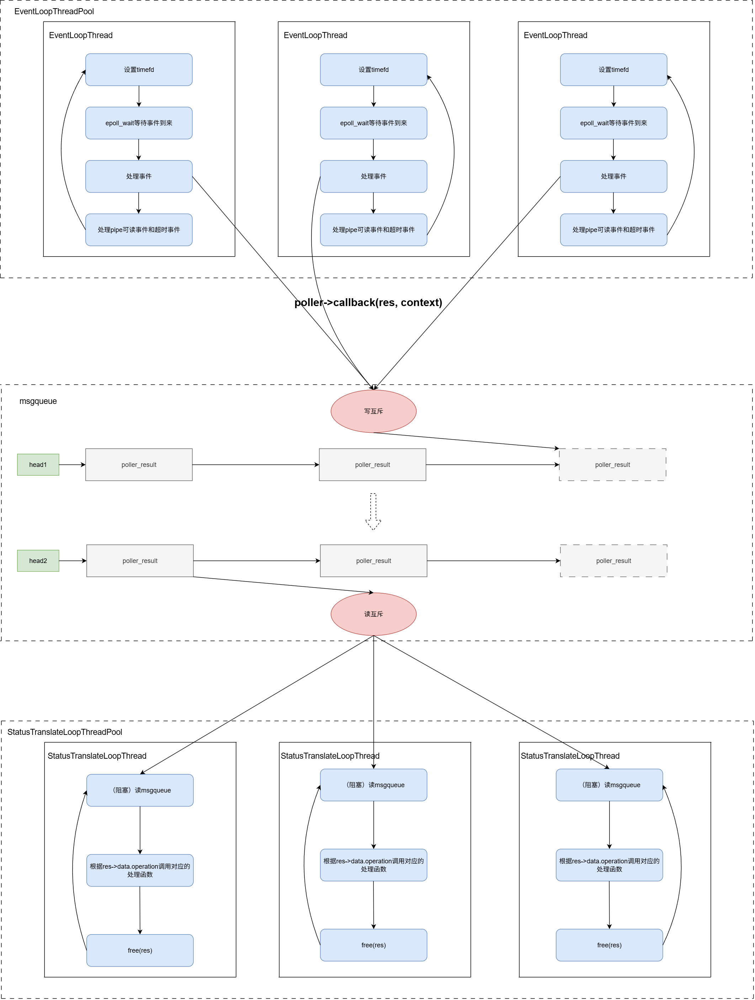
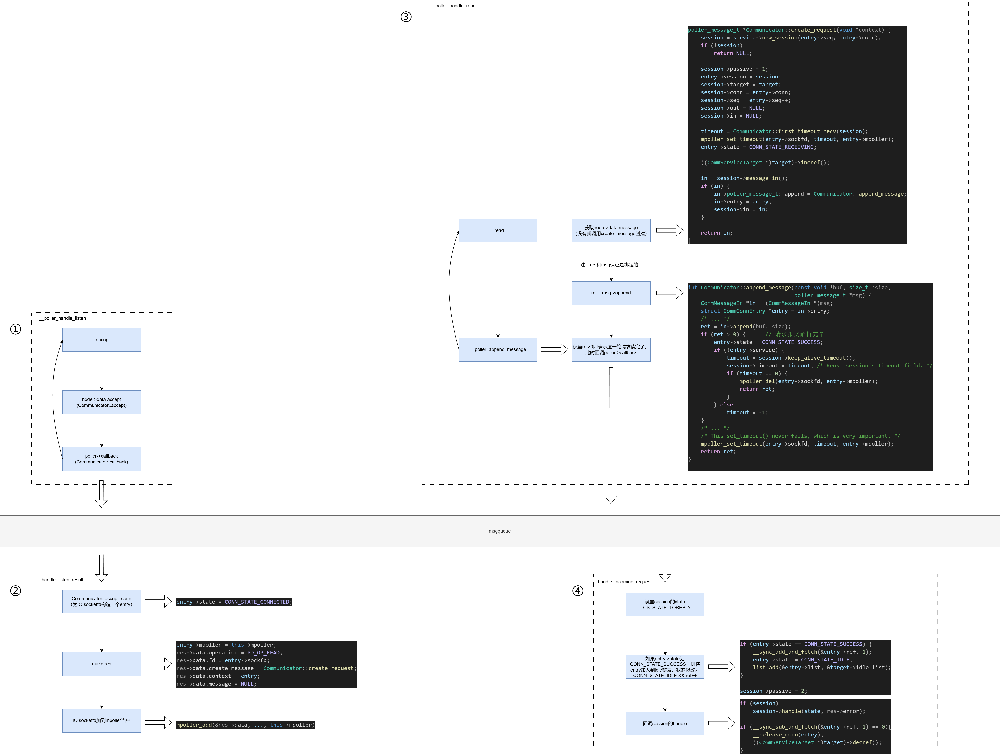

[WorkFlow源码剖析——GO-Task 源码分析](https://blog.csdn.net/m0_52566365/article/details/142903964)

[WorkFlow源码剖析——Communicator之TCPServer（上）](https://blog.csdn.net/m0_52566365/article/details/143452443)

[WorkFlow源码剖析——Communicator之TCPServer（中）](https://blog.csdn.net/m0_52566365/article/details/143493066)

[WorkFlow源码剖析——Communicator之TCPServer（下）](https://blog.csdn.net/m0_52566365/article/details/143605123)

## 前言

上节博客已经详细介绍了workflow的poller的实现，这节我们来看看Communicator是如何利用poller的，对连接对象生命周期的管理。（PS：与其说Communicator利用的是poller，其实Communicator使用的是mpoller，上节在介绍poller时也提到过mpoller，现场帮读者回忆一下：mpoller是poller的manager类，管理多个poller事件池，对外提供的接口负责将各种poller_node负载均衡的分散给不同的poller。）

上节在介绍poller时，出现了各种回调，比如poller->callback()、node->data.accept()、node->data.partial_written()、node->data.create_message()等，当时我们总是一笔带过，没有去深入分析这些回调会做什么？并且每次在IO事件结束都会回调poller->callback()为什么要这样做？在poller当中，只看到了针对poller_node的malloc函数，而没有看到对应的free函数，哪里调用了free函数去释放poller_node？

<!-- more -->

别着急，本节的源码分析会逐步揭晓这些疑问。

同样的，注意里还是放在TCPServer上，对于SSL和UDP相关的内容直接忽略。先把TCP给模清楚。

## 管理连接对象的实现

### 连接上下文数据结构的分析

既然谈到对连接对象的管理，那Communicator必然有一个数据结构来表示一个连接上下文对象，它就是CommConnEntry，代码如下：

```cpp
struct CommConnEntry
{
	struct list_head list;          // 链表节点，
	CommConnection *conn;           // 下一章介绍TCPServer的时候会用到，本文可忽略。
	long long seq;                  // seq的作用其实可以理解为：一条连接 请求-回复 的轮次。一条连接的服务端和客户端理论上讲seq值是同时递增的，并且一定是保持相同的。
	int sockfd;                     // 连接的句柄
#define CONN_STATE_CONNECTING	0
#define CONN_STATE_CONNECTED	1
#define CONN_STATE_RECEIVING	2
#define CONN_STATE_SUCCESS		3
#define CONN_STATE_IDLE			4
#define CONN_STATE_KEEPALIVE	5
#define CONN_STATE_CLOSING		6
#define CONN_STATE_ERROR		7
	int state;                      // 连接状态
	int error;
	int ref;                        // 对对象的引用计数
	struct iovec *write_iov;        // 异步写缓存
	CommSession *session;           // 含义同go-task，每次读写完毕或则出错了都会调用该对象的hanle函数
	CommTarget *target;             // 连接目的地。对于客户端，该成员是服务器的地址；对于服务端，该成员是客户端的地址。
	CommService *service;           // 该成员仅服务端有意义
	mpoller_t *mpoller;
	/* Connection entry's mutex is for client session only. */
	pthread_mutex_t mutex;
};
```

workflow将客户端、服务端、tcp、udp、ssl的实现都混杂在一个文件当中。在第一次阅读它的源码时有点双眼摸瞎的感觉。如果你有足够丰富的网络编程的经验可能还好。

需要注意一点的是：该连接上下文在客户端和服务端所使用成员可能是不同的，客户端不会使用service成员，服务端不会使用seq成员。

对于CommConnEntry::list成员，其实有两种用途：

- 一是被挂在服务端的CommService::alive_list上。可以理解为服务端的http保活池。

- 二是被挂在客户端的CommTarget::idle_list上。可以理解为客户端的（对同一个ipaddr:port的）http连接池。

广义上讲，服务端的CommServiceTarget::idle_list也是http连接池。只是服务端的idle_list上只可能会有一个连接。

然后可以预见的是：

1. 随着tcp连接状态的变化，state成员所记录的状态也会随之更新。

2. 当ref成员减为零，CommConnEntry对象将会被free掉。

根据以往的经验能大胆猜测到的就是这些信息。

### 状态迁移池

状态迁移池——没错，类似于事件池，状态迁移池也有一个循环，它的任务是不断根据IO的结果，转换连接上下文的状态，并且根据IO的结果去回调必要的处理函数，最为代表的是：session->handle，session的概念在go-task源码剖析一节中也是存在。它存在的意义在下一章讲解workflow对TCPServer的时候才适合透露。我们重点集中在communicator如何管理连接上下文的状态的。

这里其实就引入了一个问题，连接上下文为什么存在状态的迁移？别急，让我一步步道来。

======================================================

首先是状态池的启动————Communicator::init

代码如下：

```cpp
int Communicator::init(size_t poller_threads, size_t handler_threads) {
    /* ... */

	if (this->create_poller(poller_threads) >= 0)
	{
		if (this->create_handler_threads(handler_threads) >= 0)
		{
			this->stop_flag = 0;
			return 0;
		}

		mpoller_stop(this->mpoller);
		mpoller_destroy(this->mpoller);
		msgqueue_destroy(this->msgqueue);
	}

	return -1;
}
```

涉及的代码过多，这里仅挑重点。

1. Communicator::init首先会启动mpoller，也就是上章我们所讲的事件池。上节的poller->callback函数以及它的参数poller->context，在poller初始化时就是由struct poller_params提供。而该结构体的够着在Communicator::create_poller当中是这样被赋值的：

    ```cpp
    void Communicator::callback(struct poller_result *res, void *context) {
        msgqueue_t *msgqueue = (msgqueue_t *)context;
        msgqueue_put(res, msgqueue);
    }

    int Communicator::create_poller(size_t poller_threads) {
        struct poller_params params = {
            .max_open_files		=	(size_t)sysconf(_SC_OPEN_MAX),
            .callback			=	Communicator::callback,
        };

        this->msgqueue = msgqueue_create(16 * 1024, sizeof (struct poller_result));
        if (this->msgqueue) {
            params.context = this->msgqueue;
            /* ... */
        }

        return -1;
    }
    ```

    所以，可以看到，上章的poller->callback回调，会将传进来的poller_result追加到Communicator的状态迁移池的队列当中。

2. Communicator::init然后会启动状态迁移池。状态迁移池使用的就是workflow自己造了链式线程池轮子。特别的是，在线程池的每个线程都运行**一个**routine：Communicator::handler_thread_routine，该函数是一个死循环。在每个线程都分配到一个Communicator::handler_thread_routine后，**线程池的队列**其实就失去了它的意义。每个Communicator::handler_thread_routine会使用1当中分配的队列。

转到Communicator::handler_thread_routine，它的实现如下：

```cpp
void Communicator::handler_thread_routine(void *context) {
	Communicator *comm = (Communicator *)context;
	struct poller_result *res;

	while (1) {
		res = (struct poller_result *)msgqueue_get(comm->msgqueue);
		if (!res)
			break;

		switch (res->data.operation) {
		case PD_OP_TIMER:
			comm->handle_sleep_result(res);
			break;
		case PD_OP_READ:
			comm->handle_read_result(res);
			break;
		case PD_OP_WRITE:
			comm->handle_write_result(res);
			break;
		case PD_OP_LISTEN:
			comm->handle_listen_result(res);
			break;
        /* ... */
		}

		free(res);
	}

	if (!comm->thrdpool) {
		mpoller_destroy(comm->mpoller);
		msgqueue_destroy(comm->msgqueue);
	}
}
```

阅读过上面的代码后，我们应该惊喜，因为我们看到了free！这里我可以自信的回答这个问题：上节poller当中，只看到了针对poller_node的malloc函数，而没有看到对应的free函数，哪里调用了free函数去释放poller_node？

**没错，poller_node就是在这里释放的。**

poller_node生命周期是这样的链路：

```
__poller_new_node { malloc } -> write(addr) -> pipe -> __poller_handle_pipe { addr = read() } -> poller->callback(addr) -> handler_thread_routine { free }
```


最终在状态迁移池启动完毕后，结合poller的事件池，Communicator最终的系统架构如下图：



### IO结果的处理

还是贴出上章所讲解的基本tcp服务框架示例：

```
	+-----------+
	|	socket	|
	+-----------+
		|
		V
	+-----------+
	|	bind	|	这三步就是由本节的Communicator执行
	+-----------+
		|
		V
	+-----------+
	|	listen	|
	+-----------+
		|			______________________________________________
		V
	+-----------+
	|	accept	|	从这里开始涉及到的所有函数是poller负责。
	+-----------+
	|	|	|	|
	V	V	V	V
	fd	fd	fd	...
		/\
	read  write
```

当然Communicator会使用mpoller暴露的api对sockfd设置所关心的IO事件。间接调用了IO系统调用接口。下面从listen fd入手，逐步揭开communicator的真面目。

======================================================

创建绑定监听三部曲————Communicator::bind

函数如下：

```cpp
int Communicator::bind(CommService *service) {
	struct poller_data data;
	int errno_bak = errno;
	int sockfd;

	sockfd = this->nonblock_listen(service);
	if (sockfd >= 0) {
		data.fd = sockfd;
		data.context = service;
		/* ... */
		data.operation = PD_OP_LISTEN;
		data.accept = Communicator::accept;
		// 开始接收客户端连接
		if (mpoller_add(&data, service->listen_timeout, this->mpoller) >= 0) {
			errno = errno_bak;
			return 0;
		}

		close(sockfd);
	}

	return -1;
}
```

注意到，listen套接字被分配了一个Communicator::accept回调，上一章介绍poller时每当listen套接字接收到一个客户端的连接，都会将IO socket作为参数回调一下accept函数，此处代表Communicator::accept，它实际上会为IO socket创建一个CommServiceTarget对象。

三部曲核心在nonblock_listen，如下：

```cpp
int Communicator::nonblock_listen(CommService *service) {
	int sockfd = service->create_listen_fd();				// scoket()
	int ret;

	if (sockfd >= 0) {
		if (__set_fd_nonblock(sockfd) >= 0)	{				// 设置为非阻塞
			if (__bind_sockaddr(sockfd, service->bind_addr,
								service->addrlen) >= 0)	{ 	// 监听socket和addr绑定
				ret = listen(sockfd, SOMAXCONN);			// 开始监听
				if (ret >= 0 || errno == EOPNOTSUPP) {
					service->reliable = (ret >= 0);
					return sockfd;
				}
			}
		}

		close(sockfd);
	}

	return -1;
}
```

所以Communicator::bind绑定并启动一个tcpserver的流程是：

1. 初始化一个监听套接字。

2. 将监听套接字添加到mpoller事件池当中。开始接受来自客户端的连接。

======================================================

接收客户端连接————Communicator::handle_listen_result

了解了前面状态迁移池和bind的流程，结合上一章poller的源码分析，一旦poller的accept接收到一条连接会回调一下Communicator::accept，然后再调用poller->callback，并将IOsocket填到res，然后res被传回Communicator队列当中。状态迁移线程会从队列当中取res，然后根据res->data.operation，会去回调Communicator::handle_listen_result，它的实现如下：

```cpp
void Communicator::handle_listen_result(struct poller_result *res) {
	CommService *service = (CommService *)res->data.context;
	struct CommConnEntry *entry;
	CommServiceTarget *target;
	int timeout;

	switch (res->state) {
	case PR_ST_SUCCESS:
		target = (CommServiceTarget *)res->data.result;		// Communicator::accept的返回值
		entry = Communicator::accept_conn(target, service);
		if (entry) {
			entry->mpoller = this->mpoller;
			res->data.operation = PD_OP_READ;
			res->data.fd = entry->sockfd;
			res->data.create_message = Communicator::create_request;
			res->data.context = entry;
			res->data.message = NULL;
			timeout = target->response_timeout;
			if (mpoller_add(&res->data, timeout, this->mpoller) >= 0) {
				if (this->stop_flag)
					mpoller_del(res->data.fd, this->mpoller);
				break;
			}

			__release_conn(entry);
		}
		else
			close(target->sockfd);

		target->decref();
		break;
	}
}
```

Communicator::accept_conn函数根据res创建出IOsocket的连接上下文CommConnEntry，并且该连接上下文初始的state为CONN_STATE_CONNECTED。然后将该对象加入到mpoller事件池当中开启对IOsocket的读事件进行监听。

======================================================

边接收边解析————Communicator::create_request + Communicator::append_message

客户端请求报文解析完毕，状态转移————Communicator::handle_read_result

因为这两部分涉及的代码过于庞大，详细讲解的话避免不了要贴大量的代码，作者表达水平有限。还是觉得使用图解的方式去呈现比较省事。所以，为避免文章代码比例过高，下一小节将会以图画的形式向读者剖析这部分的源码。

### 状态迁移总结

服务端监听套接字的绑定就不说了，下面使用一张图来讲解：从服务端接收客户端连接 到 读客户端请求报文（边读边解析），最后向客户端发送回复的一个流程。

======================================================

接收客户端连接并读取解析客户端发来的报文流程————异步状态机之美



第一步，是poller当中的__poller_handle_listen回调函数：

1. 服务端在接收到一个客户端连接后首先会为其创建一个CommServiceTarget对象。

2. 然后将IO socketfd通过回调poller->callback（放到队列当中）传回给Communicator。

第二步，是Communicator的Communicator::handle_listen_result函数：

1. 状态变迁池拿到res对像后，得知operation为PD_OP_LISTEN的res，所以调用Communicator::handle_listen_result函数来处理res。

2. 在Communicator::handle_listen_result函数当中，首先会构造一个连接上下文entry，它的状态被初始化为CONN_STATE_CONNECTED。

3. 构造一个operation为READ的poller_node。并且data成员的create_message回调填为Communicator::create_request。

4. 将poller_node加入到mpoller，开始对其度事件进行监听。

第三步，是poller当中的读事件处理回调__poller_handle_read：

1. 读数据。

2. __poller_append_message，它里面会创建一个poller_message_t对象（如果不存在的话，一般在一轮请求的最开始会构造一个msg对象）。利用poller_message_t对象对读到的数据进行解析。这是一个边读边解析的过程，中间可能会调用数次。当msg->append返回值大于0时，说明请求报文读并且解析完了。此时将msg封装在res当中，并**回调poller->callback**。create_message和append两个回调分别对应Communicator::create_request和Communicator::append_message。这两个函数核心代码已经在上图③号虚框当中显示，读者可以仔细阅读一下。这里其实涉及到连接上下文entry的两次状态变换。在create_message时，entry->state会变更为CONN_STATE_RECEIVING，而在数据解析完毕，Communicator::append_message当中的in->append返回大于0进入到下面的if分支又会将entry->state变更为CONN_STATE_SUCCESS。

第四步，也是读流程的最后一步，Communicator::handle_read_result当中的Communicator::handle_incoming_request函数：

1. 状态变迁池拿到res对像后，得知operation为PD_OP_READ的res，所以调用Communicator::handle_read_result函数来处理res。因为是服务端所以Communicator::handle_read_result函数会调用Communicator::handle_incoming_request函数。

2. 这里会将session的state设置成CS_STATE_TOREPLY。

3. 如果entry->state == CONN_STATE_SUCCESS，则将entry挂到target的idle链表上、entry->ref++，同时entry->state修改成CONN_STATE_IDLE。session->passive 必须赋值为 2。

4. 回调session->handle，然后entry->ref--，当entry->ref为0时，调用__release_conn将连接关闭，并free掉entry连接上下文。

所以entry状态变化顺序为：

```
[CONN_STATE_CONNECTED] -> [CONN_STATE_RECEIVING] -> [CONN_STATE_SUCCESS] -> [CONN_STATE_IDLE]
```

======================================================

向客户端发送回复报文————先尽力而为的写，然后再异步写。

当服务端需要发送一个回复报文时会调用Communicator::reply接口，它的代码如下：

```cpp
int Communicator::reply(CommSession *session) {
	struct CommConnEntry *entry;
	CommServiceTarget *target;
	int errno_bak;
	int ret;

	if (session->passive != 2) {	// 处在读完毕的状态
		errno = EINVAL;
		return -1;
	}

	errno_bak = errno;
	session->passive = 3;			// 写状态
	target = (CommServiceTarget *)session->target;
	ret = this->reply_reliable(session, target);


	if (ret == 0) {					// 这里是同步写已经将所有数据发完了。无需异步写
		entry = session->in->entry;
		session->handle(CS_STATE_SUCCESS, 0);	// 再次回调session的handle
		if (__sync_sub_and_fetch(&entry->ref, 1) == 0) {
			__release_conn(entry);
			target->decref();
		}
	} else if (ret < 0)
		return -1;

	errno = errno_bak;
	return 0;
}

int Communicator::reply_reliable(CommSession *session, CommTarget *target) {
	struct CommConnEntry *entry;
	struct list_head *pos;
	int ret = -1;

	pthread_mutex_lock(&target->mutex);
	if (!list_empty(&target->idle_list)) {	// 处于CONN_STATE_IDLE状态
		pos = target->idle_list.next;
		entry = list_entry(pos, struct CommConnEntry, list);
		list_del(pos);

		session->out = session->message_out();
		if (session->out)
			ret = this->send_message(entry);


	} else
		errno = ENOENT;

	pthread_mutex_unlock(&target->mutex);
	return ret;
}

int Communicator::send_message(struct CommConnEntry *entry) {
	/* ... */
	end = vectors + cnt;
	cnt = this->send_message_sync(vectors, cnt, entry);		// 先尽力而为的同步写
	if (cnt <= 0)
		return cnt;

	return this->send_message_async(end - cnt, cnt, entry);	// 写缓存满了，需要异步写
}
```

写的设计思路和Muduo的很像[muduo源码阅读笔记（10、TcpConnection）](https://blog.csdn.net/m0_52566365/article/details/135720278)。这里不过多赘述，只讲一下差别。还是以全面的情况为例子，假设现在需要发送一批（回复）数据，并且同步写无法将所有的数据发送完。那么在同步写一部分我们的数据之后，肯定会触发异步写。

而异步写呢，就得靠poller层的__poller_handle_write函数。只要tcp的发送缓存区非满，poller_node就会收到通知，然后尽力向发送缓存区写一些数据，这可能也需要花几轮的功夫去写数据。在这期间，每写一部分数据__poller_handle_write函数就会回调node->data.partial_written，从Communicator::send_message_async函数在构造WRITE类型的poller_node时我们可以得知partial_written就是Communicator::partial_written，而它的实现如下：

```cpp
int Communicator::partial_written(size_t n, void *context) {
	struct CommConnEntry *entry = (struct CommConnEntry *)context;
	CommSession *session = entry->session;
	int timeout;

	timeout = Communicator::next_timeout(session);
	mpoller_set_timeout(entry->sockfd, timeout, entry->mpoller);
	return 0;
}
```

在写完部分数据后，为什么需要回调一下partial_written呢？这里其实就得到了合理的解释，既然在规定的写超时时间内，我能向发送缓存写一些数据，那就说明网没断，只是网络状况可能不好。所以，按理来说，在规定的时间内发送了部分数据就应该更新一下发送的超时时间，避免没有必要的超时。

一旦异步写完成了，和__poller_handle_read不同，**__poller_handle_write会自动将poller_node从epoll上移除**，然后回调poller->callback。（PS，如果你忘了poller的实现，建议回顾一下[WorkFlow源码剖析——Communicator之TCPServer（上）](./TcpServer_1.md)）

然后同读完成类似，在Communicator当中写完成会被Communicator::handle_write_result处理，因为是服务断，所以会调用Communicator::handle_reply_result。该函数逻辑如下：

```cpp
void Communicator::handle_reply_result(struct poller_result *res) {
	struct CommConnEntry *entry = (struct CommConnEntry *)res->data.context;
	CommService *service = entry->service;
	CommSession *session = entry->session;
	CommTarget *target = entry->target;
	int timeout;
	int state;

	switch (res->state) {
	case PR_ST_FINISHED:
		timeout = session->keep_alive_timeout();
		if (timeout != 0) {
			__sync_add_and_fetch(&entry->ref, 1);							// 避免被释放
			res->data.operation = PD_OP_READ;
			res->data.create_message = Communicator::create_request;
			res->data.message = NULL;
			pthread_mutex_lock(&target->mutex);
			if (mpoller_add(&res->data, timeout, this->mpoller) >= 0) {		// 以读的方式添加到mpoller当中
				pthread_mutex_lock(&service->mutex);
				if (!this->stop_flag && service->listen_fd >= 0) {
					entry->state = CONN_STATE_KEEPALIVE;					// entry->state修改成CONN_STATE_KEEPALIVE
					list_add_tail(&entry->list, &service->alive_list);		// 追加到保活链表
				} else {
					mpoller_del(res->data.fd, this->mpoller);
					entry->state = CONN_STATE_CLOSING;
				}

				pthread_mutex_unlock(&service->mutex);
			}
			else															// 出错，该释放了
				__sync_sub_and_fetch(&entry->ref, 1);		

			pthread_mutex_unlock(&target->mutex);
		}

		if (1)
			state = CS_STATE_SUCCESS;

		session->handle(state, res->error);									// 第二次回调session->handle
		if (__sync_sub_and_fetch(&entry->ref, 1) == 0) {
			__release_conn(entry);
			((CommServiceTarget *)target)->decref();
		}

		break;
	}
}
```

逻辑分成三部分：

1. 将entry->ref自增一 && 以读的方式将poller_node加回到mpoller当中继续监听客户端的读请求 && 将entry->state修改成CONN_STATE_KEEPALIVE并且加到CommService的保活链表当中。

2. 将session的state设置成CS_STATE_SUCCESS，再回调session->handle。

3. entry->ref自减一，为零就释放连接以及上下文。

所以在经过Communicator::handle_reply_result函数后，entry->state状态被修改为CONN_STATE_KEEPALIVE。然后再处理下一轮客户端请求。

最后备忘一下：

1. **对于session->passive的变化，在（create_request）创建msg（请求报文解析器）session->passive被置为1，在读取并解析完毕请求报文后，Communicator::handle_incoming_request函数回将session->passive置为2，在调用Communicator::reply向网络发送回复时session->passive会被置为3。**

2. Communicator::send_message_async当中在吧poller_node以WRITE方式加入到mpoller时会走到mpoller_mod分支。

3. 在Communicator当中，TCPServer端的session是个啥？有的人可能会联想可能是HTTPServer当中的Session？我刚开始看源码也是这样认为的，但是实际上并非如此，Communicator当中的session的定义其实和workflow里面的go-task定义很像。HTTPServer当中的Session生命周期同整个HTTP连接一样。而Communicator当中它的生命周期更像仅仅只有**一轮（请求-回复）**，在一轮 请求-回复 过后**自动**被销毁。而翻阅Communicator源码发现，session会在Communicator::create_request函数中通过service->new_session接口进行分配，而释放却并不在Communicator当中。结合之前go-task的实现来看，我们可以大胆猜想：Communicator所出现的session对象一定会派生一个子类，然后session对象的释放由子类对象 delete自身而被释放了。

到了这里其实就能回答这个问题：连接上下文为什么存在状态的迁移？

首先一条tcp连接在服务端必定纯在两种状态：接收、发送。而因为追求性能，我们不得不采用异步的方式将socketfd设置成非阻塞的。并且网络传输（不管是否阻塞）会引来一些问题：读不可能一次性读完、写不可能一次性写完，所以读的过程当中和写的过程当中都存在一种中间的状态。所以状态迁移是必然的。

最后，在了解了workflow的底层架构之后，其实就能感觉到**异步编程就是在实现一个状体机的过程**。

---

**本章完结**