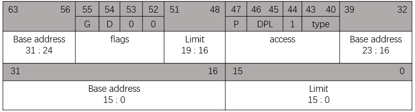
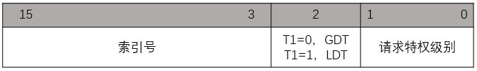
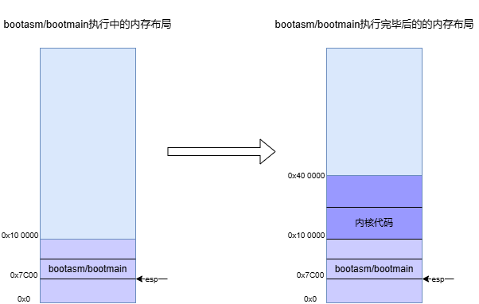
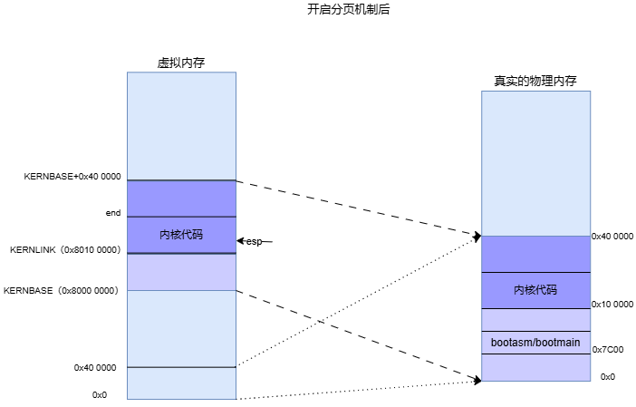

## 前言

Onix是一款相对于XV6来说功能更为健全的单核OS，由于功能更加完善，Onix也更加复杂。代码阅读起来会比较绕。

XV6是一款简单易读的多核操作系统，但其功能相对Onix来说更为简陋，比如Onix对物理内存的管理采用了位图、内核内存和进程相关的内存进行了分开管理，页目录使用单独的内核内存，没有和页表、页框混用等。而XV6显得非常简陋。尽管XV6的实验可以弥补部分缺陷。

Onix操作系统也实现了bootloader，对于将OS加载到内存的操作，Onix是采用汇编进行内核加载，并且在加载内核前，还会进行一个内存探测的操作，所以Onix的bootloader稍微有些复杂。而XV6操作系统的启动操作写的非常简洁，加载内核的操作采用的是C语言的形式，非常利于阅读学习，但是XV6不会进行内存探测。为求方便，本文主要叙述XV6的启动流程。

Onix相关链接：

- [github仓库链接](https://github.com/StevenBaby/onix)

- [B站配套视频链接](https://www.bilibili.com/video/BV1qM4y127om/)

XV6-x86的github链接：

- [链接](https://github.com/mit-pdos/xv6-public)

<!-- more -->

## Makefile & kernel.ld文件的分析

首先科普一个概念 —— 引导扇区

**引导扇区：是计算机启动过程中 BIOS 读取的第一个磁盘扇区（通常为 512 字节），用于加载操作系统或更复杂的引导程序（如 GRUB）。**

BISO规定引导扇区有如下要求：

1. 引导扇区的代码被加载到内存的0x7c00位置执行
2. 引导扇区有且仅有512字节。
3. 引导扇区的魔数在最后两个字节的位置，值0x55aa。

在叙述os启动前，必须要了解其Makefile是怎么写的。同时，在了解bootmain从镜像中加载os的代码到内存中前，因为os是elf格式，所以我们需要了解os的link脚本是怎么布局的。以便我们能更好掌握os的内存布局。

### Makefile

这里贴出makefile比较关键的代码：

```makefile
# 利用dd命令制作OS镜像，依赖bootblock和kernel，
# 首先划分了10000个扇区
# 然后将bootblock写到了第0号扇区
# 最后从1号扇区开始，填入OS的代码文件。
xv6.img: bootblock kernel
	dd if=/dev/zero of=xv6.img count=10000
	dd if=bootblock of=xv6.img conv=notrunc
	dd if=kernel of=xv6.img seek=1 conv=notrunc

# 单独产生os的bootloader模块，并且该模块是使用$(OBJCOPY)产生，
# 所以没有elf文件头信息，只是单纯的二进制可执行文件。并且$(LD)规定
# 代码的入口点是start、并且从地址0x7C00（物理地址）开始，最终的文件名是bootblock
# 最后一步，调用pl脚本对引导扇区进行签名，在512字节引导扇区最后两字节写入0x55aa
bootblock: bootasm.S bootmain.c
	$(CC) $(CFLAGS) -fno-pic -O -nostdinc -I. -c bootmain.c
	$(CC) $(CFLAGS) -fno-pic -nostdinc -I. -c bootasm.S
	$(LD) $(LDFLAGS) -N -e start -Ttext 0x7C00 -o bootblock.o bootasm.o bootmain.o
	$(OBJDUMP) -S bootblock.o > bootblock.asm
	$(OBJCOPY) -S -O binary -j .text bootblock.o bootblock
	./sign.pl bootblock

# 产生AP cpu的boot代码
# 指定程序的加载地址是0x7000（物理地址）
# 可执行代码的格式和bootblock相同，纯粹的二进制程序，没有elf的头部信息
# 但最终输出的entryother会和kernel合并
entryother: entryother.S
	$(CC) $(CFLAGS) -fno-pic -nostdinc -I. -c entryother.S
	$(LD) $(LDFLAGS) -N -e start -Ttext 0x7000 -o bootblockother.o entryother.o
	$(OBJCOPY) -S -O binary -j .text bootblockother.o entryother
	$(OBJDUMP) -S bootblockother.o > entryother.asm

# 产生第一个进程，init进程的boot代码
# 同样以$(OBJCOPY)提取纯粹的可执行代码，没有elf头部信息，输出文件名为initcode
# 指定程序的加载地址是0（虚拟地址）
initcode: initcode.S
	$(CC) $(CFLAGS) -nostdinc -I. -c initcode.S
	$(LD) $(LDFLAGS) -N -e start -Ttext 0 -o initcode.out initcode.o
	$(OBJCOPY) -S -O binary initcode.out initcode
	$(OBJDUMP) -S initcode.o > initcode.asm

# 产生内核的elf可执行文件
kernel: $(OBJS) entry.o entryother initcode kernel.ld
	$(LD) $(LDFLAGS) -T kernel.ld -o kernel entry.o $(OBJS) -b binary initcode entryother
	$(OBJDUMP) -S kernel > kernel.asm
	$(OBJDUMP) -t kernel | sed '1,/SYMBOL TABLE/d; s/ .* / /; /^$$/d' > kernel.sym

```

这里编译器、链接器的选项具体作用读者可以自行百度，这里只阐述比较关键的部分。

首先是利用dd命令制作xv6.img镜像，从代码中可以很清楚的看到，bootblock填到了第0号扇区、kernel填到了1号以及之后的扇区。bootblock作用就是使cpu从实时模式转换为保护模式，然后将kernel从磁盘上加载到内存。这里要注意一个特殊的数字0x7C00，它出现在生成bootblock二进制文件的\$(LD)阶段，这里暗示了bootblock代码在加载进内存时应该被放在0x7C00的位置。事实也是如此，**在BIOS完成硬件初始化后，就会将第0号扇区（一个扇区一般就是512字节）的512字节代码加载到内存的0x7C00的位置，然后BIOS就会让eip指向0x7C00的位置，去执行bootasm.S里面的汇编代码。**

这里有个关键点：在使用\$(LD)命令生成bootblock.o时，命令参数部分bootasm.o放在bootmain.o前面，会导致链接时，bootasm.o代码就会靠前，这样在eip执行0x7C00位置的代码时，一定是从start开始。

bootblock是由\$(OBJCOPY)生成，\$(OBJCOPY)的作用就是去除elf文件中的各种头部，因为BIOS只负责从第0号扇区加载bootblock，不会解析elf文件，所以，\$(OBJCOPY)去提取纯粹的二进制是非常有必要的！

bootblock具体细节下面会详细探讨

### kernel.ld

这里贴出kernel.ld比较关键的代码：

```link
OUTPUT_FORMAT("elf32-i386", "elf32-i386", "elf32-i386")
OUTPUT_ARCH(i386)
ENTRY(_start)

SECTIONS
{
	/* Link the kernel at this address: "." means the current address */
        /* Must be equal to KERNLINK */
	. = 0x80100000; // 定义代码起始的虚拟地址

	.text : AT(0x100000) {  // 定义了起始加载地址
		*(.text .stub .text.* .gnu.linkonce.t.*)
	}

  /*
    省略...
  */
}
```

从kernel的链接脚本我们可以看到，kernel的起始虚拟内存地址是0x8010 0000，内核实际加载的物理地址是x100000，由AT定义。这里我反复标注了 虚拟地址 / 物理地址 ，这两者一定要分清！

## 从实时模式到保护模式

本段代码实现位于xv6的bootasm.S文件。具体细节如下，xv6使用的AT&T的汇编，还是比较好懂的，读者有疑问的话，可以百度去搜相关指令的作用。英文注释已经非常详细，我就直接引用了。

```arm
#include "asm.h"
#include "memlayout.h"
#include "mmu.h"

# Start the first CPU: switch to 32-bit protected mode, jump into C.
# The BIOS loads this code from the first sector of the hard disk into
# memory at physical address 0x7c00 and starts executing in real mode
# with %cs=0 %ip=7c00.

.code16                       # Assemble for 16-bit mode
.globl start
start:
  cli                         # BIOS enabled interrupts; disable

  # Zero data segment registers DS, ES, and SS.
  xorw    %ax,%ax             # Set %ax to zero
  movw    %ax,%ds             # -> Data Segment
  movw    %ax,%es             # -> Extra Segment
  movw    %ax,%ss             # -> Stack Segment

  # 硬件相关，主线是OS的启动，该部分不深究也没影响，其实就是一个固定步骤。
  # Physical address line A20 is tied to zero so that the first PCs 
  # with 2 MB would run software that assumed 1 MB.  Undo that.
seta20.1:
  inb     $0x64,%al               # Wait for not busy
  testb   $0x2,%al
  jnz     seta20.1

  movb    $0xd1,%al               # 0xd1 -> port 0x64
  outb    %al,$0x64

seta20.2:
  inb     $0x64,%al               # Wait for not busy
  testb   $0x2,%al
  jnz     seta20.2

  movb    $0xdf,%al               # 0xdf -> port 0x60
  outb    %al,$0x60

  # Switch from real to protected mode.  Use a bootstrap GDT that makes
  # virtual addresses map directly to physical addresses so that the
  # effective memory map doesn't change during the transition.
  lgdt    gdtdesc
  movl    %cr0, %eax
  orl     $CR0_PE, %eax
  movl    %eax, %cr0
 ########################### 以下正式进入32位保护模式
//PAGEBREAK!
  # Complete the transition to 32-bit protected mode by using a long jmp
  # to reload %cs and %eip.  The segment descriptors are set up with no
  # translation, so that the mapping is still the identity mapping.
  ljmp    $(SEG_KCODE<<3), $start32

.code32  # Tell assembler to generate 32-bit code now.
start32:
  # Set up the protected-mode data segment registers
  movw    $(SEG_KDATA<<3), %ax    # Our data segment selector
  movw    %ax, %ds                # -> DS: Data Segment
  movw    %ax, %es                # -> ES: Extra Segment
  movw    %ax, %ss                # -> SS: Stack Segment
  movw    $0, %ax                 # Zero segments not ready for use
  movw    %ax, %fs                # -> FS
  movw    %ax, %gs                # -> GS

  # Set up the stack pointer and call into C.
  movl    $start, %esp            # 这里将esp栈设置到了start，由于栈向低地址处增长，所以刚好和bootasm文件的代码背道而驰。
  call    bootmain

  # If bootmain returns (it shouldn't), trigger a Bochs
  # breakpoint if running under Bochs, then loop.
  movw    $0x8a00, %ax            # 0x8a00 -> port 0x8a00
  movw    %ax, %dx
  outw    %ax, %dx
  movw    $0x8ae0, %ax            # 0x8ae0 -> port 0x8a00
  outw    %ax, %dx
spin:
  jmp     spin

# Bootstrap GDT
.p2align 2                                # force 4 byte alignment
gdt:
  SEG_NULLASM                             # null seg
  SEG_ASM(STA_X|STA_R, 0x0, 0xffffffff)   # code seg
  SEG_ASM(STA_W, 0x0, 0xffffffff)         # data seg

gdtdesc:
  .word   (gdtdesc - gdt - 1)             # sizeof(gdt) - 1
  .long   gdt                             # address gdt

```

这里先普及一下实时模式和保护模式的区别：

- 实时模式：为兼容以前的PC。特点是：寄存器都是16位。寻址方式：16位的段寄存器 + 16位的偏移寄存器，最大寻址范围是20位。

- 保护模式：现代CPU的寻址方式。特点是：寄存器有16位、32为、64位。寻址方式：段描述符 + 32位偏移寄存器。最大寻址范围4G+。

bootasm.S是操作系统被加载内存前，最先开始执行的代码。BIOS是运行在实时模式下的程序，只拥有1M的寻址空间（**boot代码被加载到0x7C00 < 1M 就能证明存在1M的限制**），所以在cpu拥有4G寻址空间前，还需要进行一些初始化操作，

从实时模式 -> 保护模式的转变流程非常固定，在xv6的bootasm中实现如下：

0. 对于多核处理器，最先启动的CPU（我们称为BSP（bootstrap processor）），BSP一上电就是实时模式。其余的从处理器（我们称为AP）在后面的内核初始化阶段会被BSP依次唤醒并初始化。

1. 关中断。清空各种段寄存器，包括ds、es、ss。

2. 打开A20地址线.

3. 加载全局描述符表。即使用lgdt指令将表的地址和大小放在GDTR中。（这里的全局描述符表是临时的，后面内核初始化会更换一张gdt表，那张表更加完善。

4. 将CR0寄存器第0位设置为1（PE位），此时正式转换成保护模式。

5. 使用ljmp（长跳转指令）指令刷新段寄存器，跳到start32。

    ```
    # xv6对ljmp的注释如下：
    # Complete the transition to 32-bit protected mode by using a long jmp
    # to reload %cs and %eip. 
    ```

6. 初始化数据段、栈段寄存器，将esp设置到0x7C00处，跳到bootmain函数中，该函数会将XV6 OS加载到内存。

相关的结构如下：

段描述符（Descriptor），描述一段地址的特性，包括基地址、范围、权限、粒度（范围以字节为单位还是以4K为单位）、类型（代码/数据）等信息：



全局描述符表，由许多个8字节段描述符组成的表：


全局描述符表寄存器，其**基地址**的内容是全局描述符表的首地址，**界限**是全局描述符表的大小：


段选择子，【代码、数据、栈等】段使用了哪个段描述符，索引号指使用段描述符在全局描述符表的偏移（8字节为单位），第2位指明是全局描述符还是局部描述符，0~1位指示段的特权级：



从低特权级的段空间 跳到 高特权级的段空间就会发生cpu特权级的切换，cpu就是通过全局描述符表来确定一个段的特权级。最典型的就是用户进程调用系统调用产生的特权级切换，这中间涉及查tss段、切栈等复杂操作，我们后面在进行详细的讨论。

对于GDT的详细描述，这里推荐两篇博客，这两篇博客写的真的非常好！相信阅读之后，对全局描述符会有一个清晰的认识，全局描述符的几幅图片也是取自这两篇文章，如有侵权，可告知删除：

[详细介绍了段描述符各个位的作用](https://blog.csdn.net/abc123lzf/article/details/109289567)

[可以作为扩展，里面介绍了局部描述符的作用](https://blog.csdn.net/me1171115772/article/details/51750442)

## 正式将XV6加载到内存

分析该部分细节前，先需要了解一下elf文件的格式，我们重点关注elf文件的ELF header和Program header table。直接上各个字段的描述：

引用自博客[https://zhuanlan.zhihu.com/p/165336511](https://zhuanlan.zhihu.com/p/165336511)如有侵权，可告知删除：

```cpp
#define ELF_MAGIC 0x464C457FU  // "\x7FELF" in little endian

// ELF 文件的头部
struct elfhdr {
  uint magic;       // 4 字节，为 0x464C457FU（大端模式）或 0x7felf（小端模式）
                      // 表明该文件是个 ELF 格式文件

  uchar elf[12];    // 12 字节，每字节对应意义如下：
                    //     0 : 1 = 32 位程序；2 = 64 位程序
                    //     1 : 数据编码方式，0 = 无效；1 = 小端模式；2 = 大端模式
                    //     2 : 只是版本，固定为 0x1
                    //     3 : 目标操作系统架构
                    //     4 : 目标操作系统版本
                    //     5 ~ 11 : 固定为 0

  ushort type;      // 2 字节，表明该文件类型，意义如下：
                    //     0x0 : 未知目标文件格式
                    //     0x1 : 可重定位文件
                    //     0x2 : 可执行文件
                    //     0x3 : 共享目标文件
                    //     0x4 : 转储文件
                    //     0xff00 : 特定处理器文件
                    //     0xffff : 特定处理器文件

  ushort machine;   // 2 字节，表明运行该程序需要的计算机体系架构，
                    // 这里我们只需要知道 0x0 为未指定；0x3 为 x86 架构

  uint version;     // 4 字节，表示该文件的版本号

  uint entry;       // 4 字节，该文件的入口地址，没有入口（非可执行文件）则为 0

  uint phoff;       // 4 字节，表示该文件的“程序头部表”相对于文件的位置，单位是字节

  uint shoff;       // 4 字节，表示该文件的“节区头部表”相对于文件的位置，单位是字节

  uint flags;       // 4 字节，特定处理器标志

  ushort ehsize;    // 2 字节，ELF文件头部的大小，单位是字节

  ushort phentsize; // 2 字节，表示程序头部表中一个入口的大小，单位是字节

  ushort phnum;     // 2 字节，表示程序头部表的入口个数，
                    // phnum * phentsize = 程序头部表大小（单位是字节）

  ushort shentsize; // 2 字节，节区头部表入口大小，单位是字节

  ushort shnum;     // 2 字节，节区头部表入口个数，
                    // shnum * shentsize = 节区头部表大小（单位是字节）

  ushort shstrndx;  // 2 字节，表示字符表相关入口的节区头部表索引
};

// 程序头表
struct proghdr {
  uint type;        // 4 字节， 段类型
                    //         1 PT_LOAD : 可载入的段
                    //         2 PT_DYNAMIC : 动态链接信息
                    //         3 PT_INTERP : 指定要作为解释程序调用的以空字符结尾的路径名的位置和大小
                    //         4 PT_NOTE : 指定辅助信息的位置和大小
                    //         5 PT_SHLIB : 保留类型，但具有未指定的语义
                    //         6 PT_PHDR : 指定程序头表在文件及程序内存映像中的位置和大小
                    //         7 PT_TLS : 指定线程局部存储模板
  uint off;         // 4 字节， 段的第一个字节在文件中的偏移
  uint vaddr;       // 4 字节， 段的第一个字节在内存中的虚拟地址
  uint paddr;       // 4 字节， 段的第一个字节在内存中的物理地址(适用于物理内存定位型的系统)
  uint filesz;      // 4 字节， 段在文件中的长度
  uint memsz;       // 4 字节， 段在内存中的长度
  uint flags;       // 4 字节， 段标志
                    //         1 : 可执行
                    //         2 : 可写入
                    //         4 : 可读取
  uint align;       // 4 字节， 段在文件及内存中如何对齐
};
```

如果感兴趣的话，可以参考文章：[ELF文件格式的详解](https://blog.csdn.net/pingxiaozhao/article/details/109239221)，这篇文章讲解的更为详细，但是对于现阶段来说，可以不用了解太仔细，知道elf文件的ELF header和Program header table各个字段的作用就足够你继续学习XV6操作系统。

对kernel elf文件解析的主流程：

```cpp
void
bootmain(void)
{
  struct elfhdr *elf;
  struct proghdr *ph, *eph;
  void (*entry)(void);
  uchar* pa;
  // 预留足够空间
  // 46K
  elf = (struct elfhdr*)0x10000;  // scratch space

  // 以0为偏移读4096个字节，读elf文件头
  // Read 1st page off disk
  readseg((uchar*)elf, 4096, 0);

  // 判断elf文件魔数。
  // Is this an ELF executable?
  if(elf->magic != ELF_MAGIC)
    return;  // let bootasm.S handle error

  // 定位到Program header table
  // Load each program segment (ignores ph flags).
  ph = (struct proghdr*)((uchar*)elf + elf->phoff);
  // 程序头部表个数
  eph = ph + elf->phnum;

  // 一个段一个段的读
  for(; ph < eph; ph++){  // 以struct proghdr为单位自增。
    // 应该加载到的物理内存，xv6中是0x100000
    pa = (uchar*)ph->paddr;
    // 读取整个段到pa中
    readseg(pa, ph->filesz, ph->off);
    if(ph->memsz > ph->filesz)
      // mem大小比file大小大，多余的补零
      stosb(pa + ph->filesz, 0, ph->memsz - ph->filesz);
  }

  // Call the entry point from the ELF header.
  // Does not return!
  entry = (void(*)(void))(elf->entry);  // 在xv6的kernel.ld中描述为_start
  entry();
}
```

前半部分做的操作就是不断从kernel的elf文件中按照程序头将各个段读取到内存。后面通过elf头中的entry，该字段保存内核入口点_start（这可以通过阅读kernel.ld文件来证明），去执行_start开始的代码，这里要提醒读者的是，到目前为止，对cpu来说状态是：保护模式 & 已经装填了全局描述符 & **一切地址皆是物理地址**。而kernel的elf文件中代码都是使用的（0x8010 0000开始的）虚拟地址，所以我们后面在entry.S中会看到，在给_start赋值前，会通过一个宏将真正的入口地址的虚拟地址转换为XV6加载到内存的物理地址。从而我们在物理地址寻址模式下，可以利用_start准确跳转到xv6的入口代码。

需要注意的是：**在执行bootasm汇编代码时，esp的位置是不确定的，唯一能确定的是esp在1M空间之内。在bootasm汇编最后才会将esp挪到0x7c00的位置！**

在bootmain执行完毕后，内存布局如下：



接下来深入分析一下从磁盘读取文件的细节，这些内容都是和硬件相关的，通过操作硬件寄存器来实现读写磁盘，这部分深入下去也是挺让人头大的，作者也是菜鸟一个，也就力所能及的叙述一些自己明白的东西吧。

```cpp
void
waitdisk(void)
{
  // Wait for disk ready.
  while((inb(0x1F7) & 0xC0) != 0x40)
    ;
}

// readsect也引用自https://zhuanlan.zhihu.com/p/165336511，如有侵权，可联系我删除
// Read a single sector at offset into dst.
void
readsect(void *dst, uint offset)
{
  // Issue command.
  waitdisk();
  outb(0x1F2, 1);   // count = 1          // 要读取的扇区数量 count = 1
  outb(0x1F3, offset);                    // 扇区 LBA 地址的 0-7 位
  outb(0x1F4, offset >> 8);               // 扇区 LBA 地址的 8-15 位
  outb(0x1F5, offset >> 16);              // 扇区 LBA 地址的 16-23 位
  outb(0x1F6, (offset >> 24) | 0xE0);     // offset | 11100000 保证高三位恒为 1
                                          //         第7位     恒为1
                                          //         第6位     LBA模式的开关，置1为LBA模式
                                          //         第5位     恒为1
                                          //         第4位     为0代表主硬盘、为1代表从硬盘
                                          //         第3~0位   扇区 LBA 地址的 24-27 位
  outb(0x1F7, 0x20);  // cmd 0x20 - read sectors  // 20h为读，30h为写

  // Read data.
  waitdisk();
  insl(0x1F0, dst, SECTSIZE/4); // 读的时候以4字节位单位读，所以需要扇区除以4，代表要读的次数
}

// Read 'count' bytes at 'offset' from kernel into physical address 'pa'.
// Might copy more than asked.
void
readseg(uchar* pa, uint count, uint offset)
{
  uchar* epa; // end phy addr

  epa = pa + count; // 结束地址

  // 这里将起始物理地址回退了offset的SECTSIZE（512）余数个Byte
  // 因为在从磁盘上读数据的时候，以512字节进行读取。所以offset会以512为单位向下取整，
  // 被换算成扇区号的偏移。如果offset原来不是SECTSIZE的整数倍，向下取整会导致offset截断，
  // 记换算后的offset为ofs，此时如果直接读取ofs扇区会多读offset % SECTSIZE个字节，
  // 所以需要提前将pa的地址减去offset % SECTSIZE个字节来排除offset被截断的多余的字节。
  // Round down to sector boundary.
  pa -= offset % SECTSIZE;    

  // 将offset换算成扇区号
  // Translate from bytes to sectors; kernel starts at sector 1.
  offset = (offset / SECTSIZE) + 1; 

  // 依次读取每个扇区，最后一个扇区多读了也没关系。
  for(; pa < epa; pa += SECTSIZE, offset++)
    readsect(pa, offset);
}
```

仔细推敲readseg函数中pa回滚的操作，总感觉这样贸然回滚，会覆盖之前已经被加载到内存中的代码。既然xv6敢这样写，八成说明是没有问题的，具体的原因，作者实在琢磨不透，如果有了解的朋友，可以在评论区交流一下。

## 跳到_start，正式进入内核前的预初始化

相关代码文件是entry.S

```arm
#include "asm.h"
#include "memlayout.h"
#include "mmu.h"
#include "param.h"

# Multiboot header.  Data to direct multiboot loader.
.p2align 2
.text
.globl multiboot_header
multiboot_header:
  #define magic 0x1badb002
  #define flags 0
  .long magic
  .long flags
  .long (-magic-flags)
  
# 这里就能看到，因为elf描述的一些标签是使用的虚拟地址，
# 而在进入entry开启分页前都是使用的物理地址，所以使用了
# V2P_WO宏将entry转换成了物理地址。方便bootmain跳转到entry.
# V2P_WO展开就是将输入的地址减去 0x8000 0000 的偏移。
.globl _start
_start = V2P_WO(entry)

# Entering xv6 on boot processor, with paging off.
.globl entry
entry:
  # 打开4M big page开关
  # Turn on page size extension for 4Mbyte pages
  movl    %cr4, %eax
  orl     $(CR4_PSE), %eax
  movl    %eax, %cr4

  # 将页目录设置为entrypgdir，同样由于在启用虚拟内存前，
  # 需要将虚拟地址entrypgdir转换为物理地址，有关entrypgdir
  # 的定义在内存管理章节进行详细叙述。
  # Set page directory
  movl    $(V2P_WO(entrypgdir)), %eax
  movl    %eax, %cr3

  # 开启分页
  # Turn on paging.
  movl    %cr0, %eax
  orl     $(CR0_PG|CR0_WP), %eax
  movl    %eax, %cr0

  ########################### 以下正式进入分页模式，地址皆是虚拟地址
  # 再一次修改esp指针，将esp移到内核代码范围中
  # Set up the stack pointer.
  movl $(stack + KSTACKSIZE), %esp

  # 真正进入内核main函数，开始各种初始化。
  mov $main, %eax
  jmp *%eax

.comm stack, KSTACKSIZE
```

该部分代码负责进入main函数前的初始化，主要工作如下：

1. 打开4M big page分页开关，让cpu支持4M大页。entrypgdir会将内核区域与映射为物理地址低4M的大页，我们后面会详细进行讨论，entrypgdir的生命周期非常短，在main函数中初始化过程中，会另外产生一个粒度更小的页表kpgdir（4K为一页），该页表会一直作为xv6的内核页表。

2. 设置entrypgdir为BSP（booststrap processor）的页目录。

3. 开启分页。

4. 修改esp。指向内核自己分配的4K大小的栈上。

5. 进入main。

在entry.S代码执行完后，cpu开启分页模式，所有的地址都将以虚拟地址的形式存在。此时内存布局如下：



至此，cpu的预初始化进行完毕。下面几章将围绕内核的初始化去讲解类unix操作系统的内存管理、进程调度、文件系统子模块。

---

**本章完结**

