## 前言

拖了这么久，终于到了最后一篇关于类unix源码分析的文章————文件系统。

（偷偷告诉你，本篇博客起草于我即将从毕业以来第一家公司离职前一个星期（2025-9-16），忍着牙痛ing ing ing）。

如你所见，文件系统完全值得另开一篇博文单独去记录它。这里为了方便，同样将Onix的文件系统和XV6的文件系统放一块进行记录。并且，Onix的文件系统确实更加规范和完善，而XV6的文件系统相对来说更加简洁。但值得一提的是，XV6文件系统实现了一个简单而确实又很重要的东西————基于写时日志的事务系统。这是Onix所没有的。

linux的一切皆文件的伟大思想，将所有的IO行为（包括IO设备读写、pipe读写、进程读写）都抽象成文件。在本篇文章当中，我们将通过两个小型操作系统源码一一揭开linux文件系统的面纱。

<!-- more -->

首先贴上XV6文件系统的模块方图：

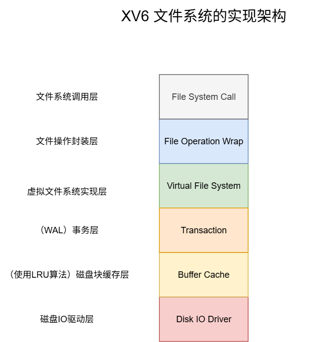

其次是Onix文件系统的模块方图：

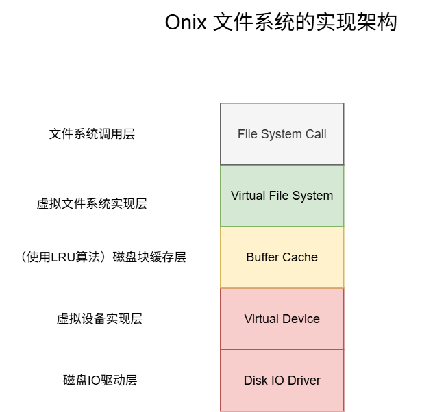

诈一看，你一定会认为XV6实现的文件系统比Onix的更复杂，实际上恰恰相反。尽管XV6实现了更多的模块，但是因为它教学系统的本质，每个模块的实现都以简单且精简为目的，没有为扩展性做任何多余操作。： ）读过的人表示非常干脆利落。

反观Onix，为了适配 终端、串口、键盘、磁盘、软盘以及以后可能有的各种IO设备，根据他们的特点，抽象出了 `struct device_t` 结构体，分离出虚拟设备抽象层，将共有的io操作提取出来。为了统一文件系统的管理，抽象出了 `fs_op_t` 结构体。更贴近真实Linux操作系统的做法。具体细节将逐一解释。

依据我阅读源码的习惯，下面就来自底向上逐步介绍文件系统的实现。**以Onix文件系统为主。**

## 磁盘IO驱动层 & 虚拟设备实现层

- 磁盘IO驱动层: 一句话概括该模块的作用：所谓磁盘IO驱动层，实际上就是操作系统当中，最底层的直接和磁盘设备打交道的代码。使用厂商规定的指令对磁盘设备按一定规则进行读写操作。

- 虚拟设备实现层: 对IO设备抽象出统一接口，并且针对磁盘设备访问，Onix还实现了经典的电梯算法。XV6当中虚拟设备实现层过于简单，这里以Onix为主进行深入讲解。 

### 对于XV6

XV6的磁盘IO驱动层可以分为两块：IO请求队列 和 磁盘IO驱动。实现可以参考文件：ide.c，IO请求队列的实现非常巧妙，其思想为：**多个进程需要并发对一块磁盘进行IO，为了保证正确性，我们必须对并行操作串行化处理。让请求IO的进程入队。仅让位于队头的进行执行磁盘IO，其他进程休眠等待。当队头的进程执行完IO请求后出队列唤醒进程，下一个队头再进行IO操作。** 如果你有看过LevelDB的源码，应该对这种思想非常熟悉，因为LevelDB的Write方法实现运用了同样的手法。参考：[LevelDB源码阅读笔记（1、整体架构）](https://blog.csdn.net/m0_52566365/article/details/137910783)

框图图如下：

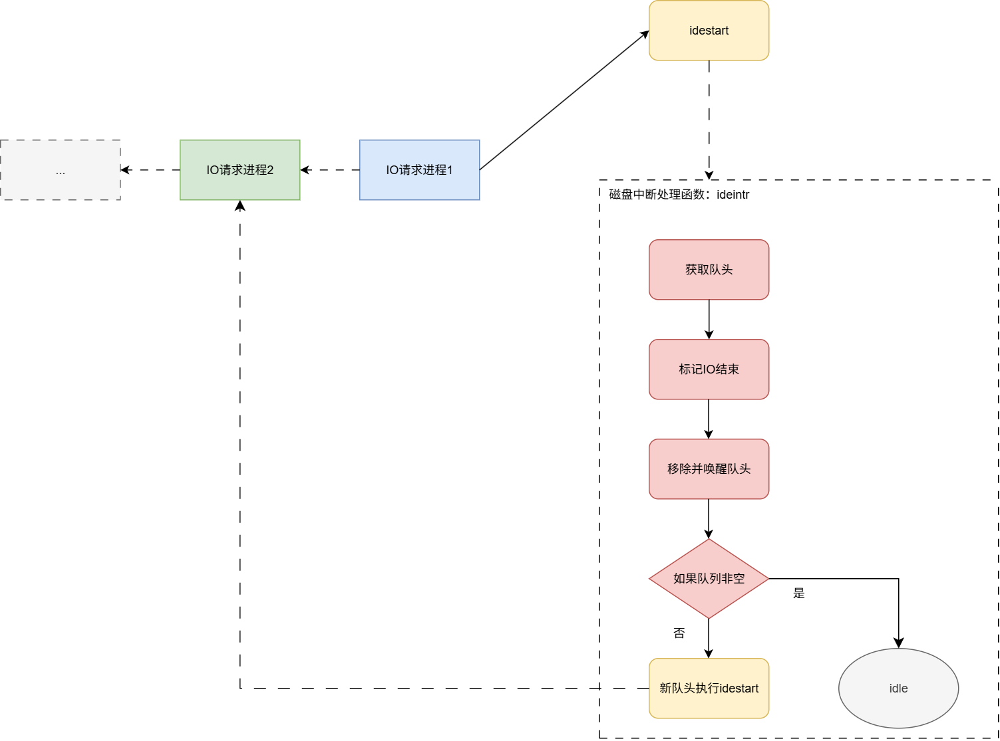

流程如下：

首先对外暴露iderw接口。

**iderw函数的逻辑：**

> 1. 上层调用对外暴露的磁盘操作接口 `iderw(struct buf *b)`。
> 2. 将请求push到IO队列尾部。
> 3. 如果本身就是队头，直接执行IO函数 `idestart`。
> 4. 非队头，**阻塞直到 IO任务 被中断处理函数消费。**

**磁盘中断处理函数ideintr的逻辑：**（一旦磁盘准备好，就会触发中断）

> 1. IO队列为空直接返回。
> 2. 移除并唤醒队头。
> 3. 如果IO队列还非空，**为 IO任务 执行IO函数 `idestart`。**

实现了简单的先来先服务(FCFS)调度

### 对于Onix

而Onix的磁盘IO驱动极其复杂，需要深入了解 IDE（Integrated Drive Electronics）硬盘控制器（IDE是一种常见的硬盘接口标准，也称为ATA（Advanced Technology Attachment））。感兴趣的可以先阅读一下XV6当中idestart函数，该函数使用几行代码实现了对磁盘设备的读写操作，然后深入去阅读Onix的磁盘IO驱动，代码路径：kernel/ide.c，我的重心在文件系统的架构，所以Onix最底层的磁盘IO驱动就跳过了。笔者重点要讲的是Onix的虚拟设备实现层。

Onix对虚拟设备的实现定义了如下虚拟设备控制结构体：

```c
typedef struct device_t
{
    char name[NAMELEN];  // 设备名
    int type;            // 设备类型
    int subtype;         // 设备子类型
    dev_t dev;           // 设备号
    dev_t parent;        // 父设备号
    void *ptr;           // 设备指针
    list_t request_list; // 块设备请求链表
    bool direct;         // 磁盘寻道方向

    // 设备控制
    int (*ioctl)(void *dev, int cmd, void *args, int flags);
    // 读设备
    int (*read)(void *dev, void *buf, size_t count, idx_t idx, int flags);
    // 写设备
    int (*write)(void *dev, void *buf, size_t count, idx_t idx, int flags);
} device_t;
```

针对IO设备，抽象出了ioctl、read、write接口，这样，每种IO设备只需根据实际情况实现回调函数，任何IO设备都能被实例化成该结构体，并且我们即将讲解的minix（onix文件系统类型）文件系统也能更好的对IO设备做适配。

Onix当中对IO设备的设备类型按读取的粒度分成了两类：字符设备（单字节）和块设备（1024为一快）。

```c
// 设备类型
enum device_type_t
{
    DEV_NULL,  // 空设备
    DEV_CHAR,  // 字符设备
    DEV_BLOCK, // 块设备
};
```

设备子类型（也即具体的设备）就多了，比如：控制台、键盘、串口、磁盘、磁盘分区、软盘等。设备子类型定义在枚举类型 `enum device_subtype_t` 当中。

Onix的设备抽象层，为了保证磁盘IO的正确性，其实也存在类似XV6的IO请求队列的设计，它的核心代码如下：

```c
// 块设备请求
err_t device_request(dev_t dev, void *buf, u8 count, idx_t idx, int flags, u32 type) {
    device_t *device = device_get(dev);
    request_t *req = kmalloc(sizeof(request_t));

    // ...

    // 判断列表是否为空
    bool empty = list_empty(&device->request_list);

    // 将请求插入链表
    list_insert_sort(&device->request_list, &req->node, element_node_offset(request_t, node, idx));

    // 如果列表不为空，则阻塞，因为已经有请求在处理了，等待处理完成；
    if (!empty)
    {
        req->task = running_task();
        assert(task_block(req->task, NULL, TASK_BLOCKED, TIMELESS) == EOK);
    }

    // do io
    err_t ret = do_request(req);

    // 跑一轮电梯算法，获取紧挨着req的下一个任务执行IO
    request_t *nextreq = request_nextreq(device, req);

    list_remove(&req->node);
    kfree(req);

    // 唤醒新队头
    if (nextreq)
    {
        assert(nextreq->task->magic == ONIX_MAGIC);
        task_unblock(nextreq->task, EOK);
    }

    return ret;
}
```

Onix IO请求队列的逻辑更加清晰易懂：

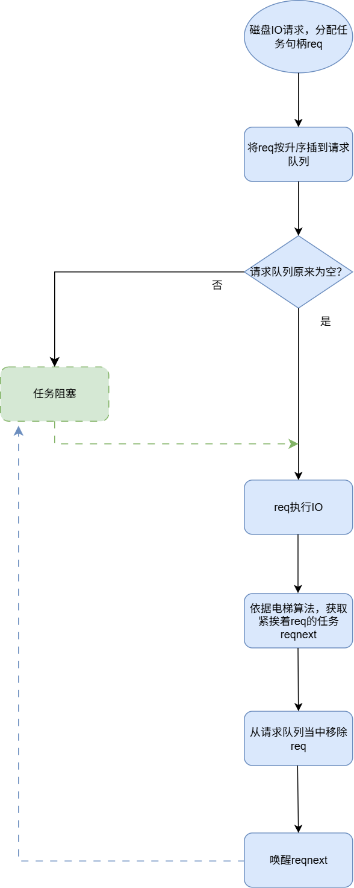

流程如下：

> 1. 进程调用磁盘IO接口 `device_request`。
> 2. 为IO请求分配一个句柄req。
> 3. 将req利用插入排序，升序插入请求队列。
> 4. 如果在该任务插入到队列前，队列非空，就当前阻塞进程。说明已经有进程在执行IO任务。
> 5. 如果在该任务插入到队列前，队列为空，由当前进程执行IO操作。
> 6. 依据电梯算法，获取到紧挨着req的下一个IO请求任务reqnext。
> 7. 从请求队列当中移除req。
> 8. 唤醒reqnext进程。注意可以确定的是，在请求队列当中只有一个进程是活跃状态其他进程都处于阻塞状态，所以在reqnext此前必定为阻塞状态，在这里我们需要唤醒它。

Onix实现了比XV6更高效的磁盘调度算法——电梯算法。电梯算法能有效避免饥饿现象，比简单的先来先服务（FCFS）更高效，减少了磁头移动距离，能够有效平衡响应时间和吞吐量。

电梯算法的工作原理：**磁头（电梯）沿一个方向移动（比如向上），处理该方向上所有的请求。到达该方向的最后一个请求后，改变方向（向下），处理反方向上的请求。如此往复循环，就像电梯在楼层间上下运行一样。**

Onix电梯算法实现函数request_nextreq如下：

```c
// 获得下一个请求
static request_t *request_nextreq(device_t *device, request_t *req) {
    list_t *list = &device->request_list;

    if (device->direct == DIRECT_UP && req->node.next == &list->tail) {
        device->direct = DIRECT_DOWN;
    } else if (device->direct == DIRECT_DOWN && req->node.prev == &list->head) {
        device->direct = DIRECT_UP;
    }

    void *next = NULL;
    if (device->direct == DIRECT_UP) {
        next = req->node.next;
    } else {
        next = req->node.prev;
    }

    if (next == &list->head || next == &list->tail) {
        return NULL;
    }

    return element_entry(request_t, node, next);
}
```

## 磁盘块缓存层

OS对磁盘的任何访问都是基于块的，XV6当中，一个磁盘块的大小为512字节，Onix当中，默认为1024字节。如果我们每次访问文件都直接从磁盘上去读取，显然大部分时间都被浪费在磁盘IO上。所以，为了提高效率，内存（高速设备）和磁盘（低速设备）之间必然需要缓存层。本小节以Onix的代码为主。代码参考：onix-dev/src/kernel/buffer.c

缓存层主要作用是：在在有限的内存当中，**缓存访问频率最高的部分磁盘块**。那么我们如何定性一个磁盘块的访问频率是高还是低呢？这就得靠大名鼎鼎的LRU算法。在CMU15445实验1当中可以学习到更高级的LRU算法——LRU-K算法、在LevelDB当中.sst文件结构的缓存也是用到了LRU算法。Onix实现的磁盘块缓存层使用的是最朴素的LRU算法。

本节简单介绍一下Onix当中LRU算法运行逻辑。

首先假设LRU相关数据结构的初始状态如下图：

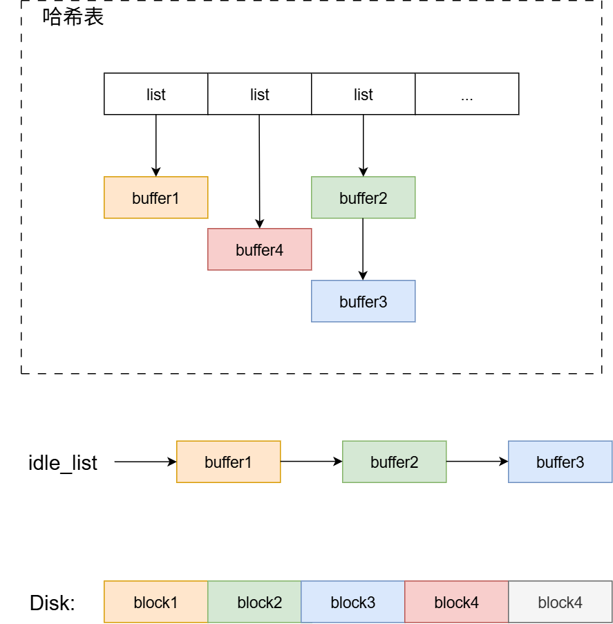

如图所示，LRU算法涉及的基本数据结构包括：哈希表和链表。

- 空闲链表 `idle_list`:  一旦OS对缓存块的引用为0，缓存块就会被放入到空闲链表。当OS需要读取一块没有缓存到内存的磁盘块时，就会触发LRU替换策略，LRU替换策略会将空闲链表当中最久未被访问过的缓存块写回磁盘，并且将缓存块的内容覆盖成新的磁盘块。空闲链表的插入和删除的逻辑非常重要，LRU替换策略实现的关键。
- 哈希表: 记录已经缓存的磁盘块。用于快速查找缓存的磁盘块。

磁盘块的读取：
- 有被缓存到内存（这里假设要读 `block1`）：
    1. 根据哈希算法 ` (设备号 ^ 块号) % 哈希表长度` 获取block1的所在哈希数组的位置，这里block1计算所得哈希数组索引为0。
    2. 遍历链表，得到buffer1。
    3. 将buffer1的引用计数加一。
    4. 从idle_list当中移除buffer1，防止缓存块被替换出磁盘。

    最终，结构如下：
    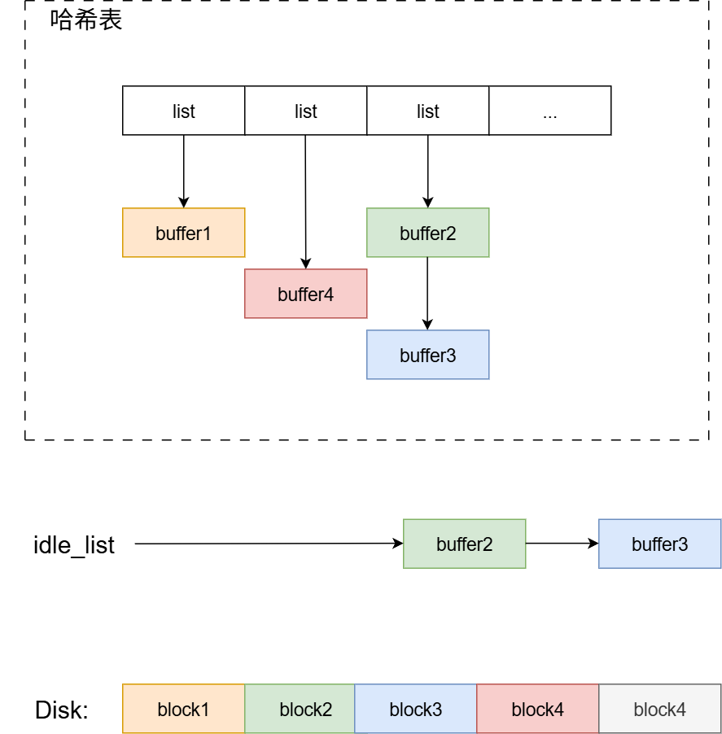

- 没有被缓存到内存（这里假设要读 `block4`）：
    1. 基于idle_list执行LRU替换策略。从idle_list可以了解到，idle_list的最后一个元素即为我们需要的 最久未被访问过的缓存块。也就是本节最开始所放图片当中的buffer3。
    2. 将buffer3写回磁盘（如果标记为脏）。并从哈希表当中去除buffer3。
    3. 将block4读到buffer3。
    4. 根据哈希算法，计算block4所在哈希表的位置。这里假设计算block4的哈希值为1，并将block4插入到哈希表。

    最终，结构如下：
    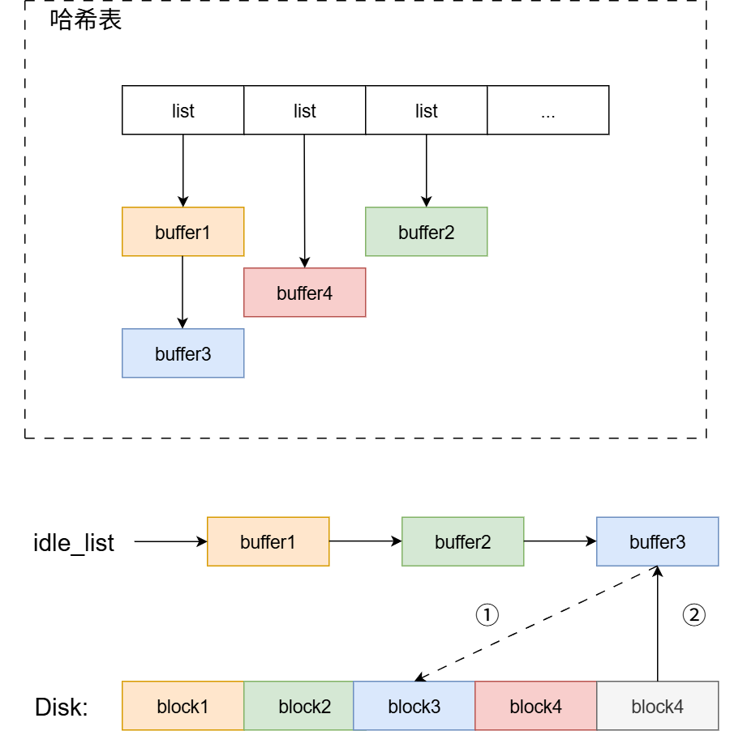

磁盘块的释放：
1. 假设，现在要释放buffer4，将缓存块的引用计数减一。
2. 当缓存块引用计数变为0时，将缓存块挂到idle_list开头。这样可以确保idle_list当中缓冲块从左到右，最后一次访问时间越来越长。

    最终，结构如下：
    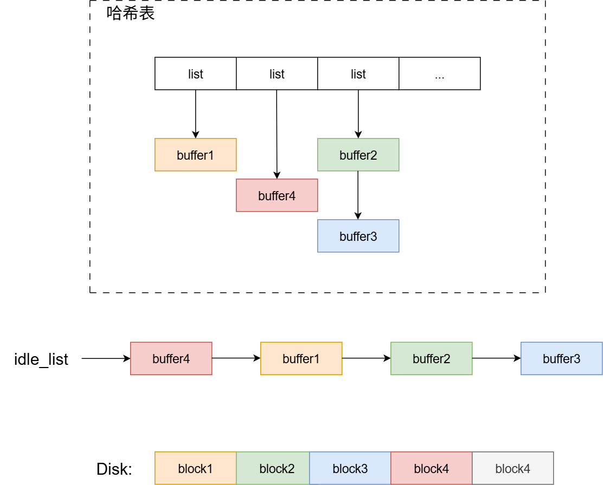

## 事务层（日志层）

### 日志层简介

事务层是XV6所拥有的模块，在Onix当中并不存在，所以，本节会以XV6为主进行叙述。在XV6的文档当中，将事务层称为日志层。不管是日志层还是事务层，作用都是一样的。**旨在实现错误恢复** 的机制，保证磁盘上文件系统的一致性。

依我的理解，其实linux文件系统本身就是一个通用数据库。像mysql、oracle、leveldb等数据库存在一些共有问题（包括：一致性、错误恢复等问题），解决问题的思想或多或少都借鉴linux的文件系统的实现。

文件系统设计中最有趣的问题之一就是错误恢复，产生这样的问题是因为大多数的文件系统都涉及到对磁盘多次的写操作，如果在写操作的过程当中系统崩溃了，就会使得磁盘上的文件系统处于不一致的状态中。举例来说，根据写的顺序的不同，上述错误可能会导致一个目录项指向一个空闲的 i 节点，或者产生一个已被分配但是未被引用的块。后一种情况相对来说好一些，但在前一种情况中，目录项指向了一个空闲的 i 节点，重启之后就会导致非常严重的问题。

xv6 通过简单的日志系统来解决文件操作过程当中崩溃所导致的问题。一个系统调用并不直接导致对磁盘上文件系统的写操作，相反，他会把一个对磁盘写操作的描述包装成一个日志写在磁盘中。当系统调用把所有的写操作都写入了日志，它就会写一个特殊的提交记录到磁盘上，代表一次完整的操作。从那时起，系统调用就会把日志中的数据写入磁盘文件系统的数据结构中。在那些写操作都成功完成后，系统调用就会删除磁盘上的日志文件。

为什么日志可以解决文件系统操作中出现的崩溃呢？如果崩溃发生在操作提交之前，那么磁盘上的日志文件就不会被标记为已完成，恢复系统的代码就会忽视它，磁盘的状态正如这个操作从未执行过一样。如果是在操作提交之后崩溃的，恢复程序会重演所有的写操作，可能会重复之前已经进行了的对磁盘文件系统的写操作。在任何一种情况下，日志文件都使得磁盘操作对于系统崩溃来说是原子操作：在恢复之后，要么所有的写操作都完成了，要么一个写操作都没有完成。

### 日志层设计——日志的磁盘结构

首先，这里可以放上一张XV6当中文件系统在磁盘上的结构图：

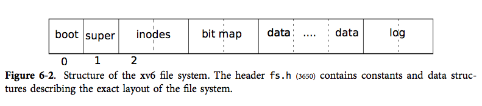

可以直观看到，我们的日志信息被放在磁盘分区最末尾的位置。

然后，你需要感到疑惑的是：那么末尾的日志信息具体的内部结构是啥？要弄清这个问题，就需要我们深入查看xv6的代码了，日志层实现代码位于log.c文件，我们直接来到initlog函数的实现：

```c
struct logheader {
  int n;
  int block[LOGSIZE];
};

struct log {
  struct spinlock lock;
  int start;
  int size;
  int outstanding; // how many FS sys calls are executing.
  int committing;  // in commit(), please wait.
  int dev;
  struct logheader lh;
};
struct log log;

void
initlog(int dev)
{
  struct superblock sb;
  initlock(&log.lock, "log");
  readsb(dev, &sb);
  log.start = sb.logstart;
  log.size = sb.nlog;
  log.dev = dev;
  recover_from_log();
}
```

1. 首先可以看到初始化函数从超级快当中获取了日志的起始块 `sb.logstart` 和 日志磁盘块数限制 `sb.nlog`。

2. 然后调用了recover_from_log函数，在系统初始化阶段，尝试进行磁盘错误恢复，recover_from_log函数实现如下：

    1. 调用read_head函数，读取前面拿到的日志起始块，日志起始块结构如下：
        ```c
        struct logheader {
            int n;
            int block[LOGSIZE];
        };
        ```
        简单来说，成员n代表block数组的有效长度，而block数组，其实表示日志起始块之后的日志块 和 文件（磁盘）的数据块的映射关系。这点在介绍install_trans函数时会更有体会。
    2. 调用install_trans函数，进行差错恢复，将上一次关机记录在日志块的没有提交完的数据重新提交。确保文件系统的一致性：
        ```c
        // Copy committed blocks from log to their home location
        static void
        install_trans(void)
        {
        int tail;

        for (tail = 0; tail < log.lh.n; tail++) {
            struct buf *lbuf = bread(log.dev, log.start+tail+1); // read log block
            struct buf *dbuf = bread(log.dev, log.lh.block[tail]); // read dst
            memmove(dbuf->data, lbuf->data, BSIZE);  // copy block to dst
            bwrite(dbuf);  // write dst to disk
            brelse(lbuf);
            brelse(dbuf);
        }
        }
        ```
        仔细阅读代码可以了解到，就是顺序将日志起始块后面的日志块读出，然后根据起始块提供的文件（磁盘）数据块映射数组，将日志块拷贝到文件（磁盘）的数据块当中。**并且同步到磁盘**
    3. 将日志起始块的logheader::n改为0，意味着日志的清空，标志着事务的完成。这一步也就是本节最开头所谓的“特殊的提交记录”。

综上所述，磁盘当中日志的结构如下图：

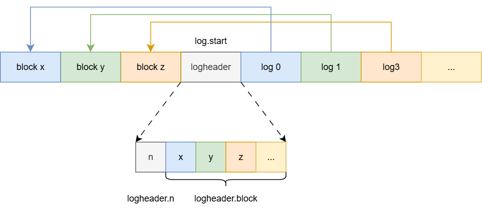

### 日志层设计——日志的封装

首先是日志写操作——log_write函数，xv6规定，所有文件的写操作，都使用log_write函数进行，并且log_write函数必须在begin_op函数和end_op函数之间调用。在进程每次写一些缓存块后都会调用log_write函数。该函数只做两件事：

1. 将被修改的缓存块的块号记录到logheader.block数组当中。
2. 将缓存块标记为脏。

需要明确的是：进程对文件任何写操作都是基于被缓存到内存的缓存块。写操作开始并未同步到磁盘块。真正的同步操作是在commit函数当中进行。

事务包装函数如下：

```c
// called at the start of each FS system call.
void
begin_op(void)
{
  acquire(&log.lock);
  while(1){
    if(log.committing){
      sleep(&log, &log.lock);
    } else if(log.lh.n + (log.outstanding+1)*MAXOPBLOCKS > LOGSIZE){
      // this op might exhaust log space; wait for commit.
      sleep(&log, &log.lock);
    } else {
      log.outstanding += 1;
      release(&log.lock);
      break;
    }
  }
}

// called at the end of each FS system call.
// commits if this was the last outstanding operation.
void
end_op(void)
{
  int do_commit = 0;

  acquire(&log.lock);
  log.outstanding -= 1;
  if(log.committing)
    panic("log.committing");
  if(log.outstanding == 0){
    do_commit = 1;
    log.committing = 1;
  } else {
    // begin_op() may be waiting for log space,
    // and decrementing log.outstanding has decreased
    // the amount of reserved space.
    wakeup(&log);
  }
  release(&log.lock);

  if(do_commit){
    // call commit w/o holding locks, since not allowed
    // to sleep with locks.
    commit();
    acquire(&log.lock);
    log.committing = 0;
    wakeup(&log);
    release(&log.lock);
  }
}
```

仔细阅读begin_op和end_op函数的源码，可以了解到，**xv6允许多个进程在begin_op和end_op之间执行事务。但是，提交操作只能由最后一个执行完的进程执行，并且提交期间，其他要执行事务的进程都将被阻塞在begin_op函数。**假设存在A、B、C三个进程要执行一组写操作。ABC都调用begin_op函数，然后对缓存块进行修改。此时 `log.outstanding` 为3。而A、B的写操作很快执行完调用end_op因为`log.outstanding`非0而直接退出，只有C执行完后，`log.outstanding` 为0，才能执行提交操作。并且在执行提交操作期间，其他任何准备执行事务的进程都将阻塞在begin_op函数。这里体现了xv6文档当中提到的：任何时候只能有一个进程在一个会话之中，其他进程必须等待当前会话中的进程结束。因此同一时刻日志最多只记录一次会话。

xv6 不允许并发会话，目的是为了避免下面几种问题。假设会话 X 把一个对 i 节点的修改写入了会话中。并发的会话 Y 从同一块中读出了另一个 i 节点，更新了它，把 i 节点块写入了日志并且提交。这就会导致可怕的后果：Y 的提交导致被 X 修改过的 i 节点块被写入磁盘，而 X 此时并没有提交它的修改。如果这时候发生崩溃会使得 X 的修改只应用了一部分而不是全部，从而打破会话是原子的这一性质。有一些复杂的办法可以解决这个问题，但 xv6 直接通过不允许并行的会话来回避这个问题。

commit函数实现如下：

```c
static void
commit()
{
  if (log.lh.n > 0) {
    write_log();     // Write modified blocks from cache to log
    write_head();    // Write header to disk -- the real commit
    install_trans(); // Now install writes to home locations
    log.lh.n = 0;
    write_head();    // Erase the transaction from the log
  }
}
```

从注释当中可以直观了解到，干了如下4件事：

> 1. 将被改动的文件缓存块**同步追加到日志（磁盘）块**当中。
> 2. 更新日志（磁盘）起始块logheader磁盘结构。
> 3. 将日志块同步到适合的文件（磁盘）数据块当中。
> 4. 清空日志块。

xv6 使用固定量的磁盘空间来保存日志。系统调用写入日志的块的总大小不能大于日志的总大小。所以源码当中，会有很多预防日志过大导致空间不足的处理措施。比如限制每个进程每次事务操作最大写数量，或者在空间不足时，阻塞进程，直到有足够可用空间被唤醒。

## 虚拟文件系统实现层

本小节将借Onix Minix文件系统的实现，解答虚拟文件神秘的面纱。在此之前，你一定对linux的文件系统有许多疑惑：

- 为什么一个int类型的fd能代表文件？
- 都说fd代表进程内核文件描述数组的下标，那么文件描述数组类型本身是什么？
- 一块256G的磁盘，linux怎么做到让每个文件打开，能从0开始顺序读写，就好像每个文件都占用了独立的磁盘一样？
- IO设备、网络套接字、管道等怎么被抽象成fd，可以使用统一的系统调用的？

### i节点初步介绍

这里从i节点作为切入。

i 节点这个术语可以有两个的意思。（对于常规文件系统）它可以指的是磁盘上的记录文件类型、文件大小、数据块扇区号的数据结构。也可以指内存中的一个 i 节点代理，它包含了i节点（实体）描述符、文件系统类型、文件操作回调等。

简单来说，一个i节点对应一个虚拟文件。并且，对于常规的文件系统，i节点分：内存结构、磁盘结构，这两种结构并不等同，内存i节点代理会引用磁盘上的i节点。

超级快代理和i节点代理的内存结构，如下：

```c
typedef struct super_t
{
    void *desc;           // 超级块描述符
    struct buffer_t *buf; // 超级块描述符 buffer
    dev_t dev;            // 设备号
    u32 count;            // 引用计数
    int type;             // 文件系统类型
    size_t sector_size;   // 扇区大小
    size_t block_size;    // 块大小
    list_t inode_list;    // 使用中 inode 链表
    inode_t *iroot;       // 根目录 inode
    inode_t *imount;      // 安装到的 inode
} super_t;

typedef struct inode_t
{
    list_node_t node; // 链表结点

    void *desc; // inode 描述符（可能是 磁盘i节点、套接字结构体、管道结构体等。

    union
    {
        struct buffer_t *buf; // inode 描述符对应 buffer
        void *addr;           // pipe 缓冲地址
    };

    dev_t dev;  // 设备号
    dev_t rdev; // 虚拟设备号

    idx_t nr;     // i 节点号
    size_t count; // 引用计数

    time_t atime; // 访问时间
    time_t mtime; // 修改时间
    time_t ctime; // 创建时间

    dev_t mount; // 安装设备

    mode_t mode; // 文件模式
    size_t size; // 文件大小
    int type;    // 文件系统类型

    int uid; // 用户 id
    int gid; // 组 id

    struct super_t *super;   // 超级块
    struct fs_op_t *op;      // 文件系统操作
    struct task_t *rxwaiter; // 读等待进程
    struct task_t *txwaiter; // 写等待进程
} inode_t;
```

对于inode_t::type字段，onix当中有如下可选值：

```c
enum
{
    FS_TYPE_NONE = 0,
    FS_TYPE_PIPE,
    FS_TYPE_SOCKET,
    FS_TYPE_MINIX,
    FS_TYPE_NUM,
};
```

虚拟文件系统将所有的IO操作都抽象成了这样一个i节点——inode_t。这里主要提一下 `inode_t::desc` 这个成员，如果i节点对应文件的话（FS_TYPE_MINIX），inode_t::desc会被赋值成 `minix_inode_t` 也就是i节点在磁盘上的数据结构；如果i节点对应网络套接字（FS_TYPE_SOCKET），那么inode_t::desc会被赋值成 `socket_t`。如果i节点对应管道（FS_TYPE_PIPE），那么inode_t::desc会被赋值成 `fifo_t`。

本文主要介绍FS_TYPE_MINIX类型的i节点。minix文件系统初始化函数会向数组 `fs_ops` 当中注册一组minix文件系统专用回调函数。

```c
static fs_op_t minix_op = {
    minix_mkfs,
    minix_super,

    minix_open,
    minix_close,

    minix_read,
    minix_write,
    minix_truncate,

    minix_stat,
    minix_permission,

    minix_namei,
    minix_mkdir,
    minix_rmdir,
    minix_link,
    minix_unlink,
    minix_mknod,
    minix_readdir,
};

void minix_init()
{
    fs_register_op(FS_TYPE_MINIX, &minix_op);
}
```

如果需要实现新的文件系统，仿照minix，只需实现上面所列的必要回调函数即可。使用minix文件系统创建的i节点inode_t::op都会被赋值成minix_op。

下面可以先了解一下minix文件系统在磁盘上的结构：

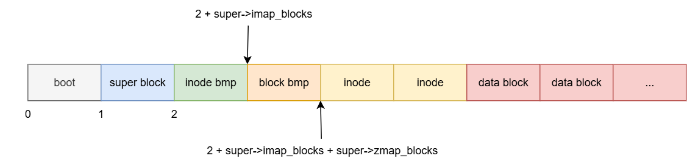

各字段起始位置和作用如下表：

>|  | 起始位置 | 作用 |
>| :-: | :-: | :-: |
>| 超级块 | 块1 | 记录i节点位图所占块数、（磁盘数据块）逻辑块位图所占块数、第一个逻辑块号等解析文件系统的关键信息 |
>| i节点位图 | 块2 | 管理磁盘i节点分配情况 |
>| （磁盘数据块）逻辑块位图 | 块2 + super->imap_blocks | 管理磁盘数据块分配情况 |
>| i节点 | 块2 + super->imap_blocks + super->zmap_blocks | 磁盘i节点数组 |
>| （磁盘数据块）逻辑块 | minix_super_t::firstdatazone | 磁盘数据块数组 |

### i节点的分配与释放

上面提到，由于i节点在虚拟文件系统当中有两种存在形式，所以本小节i节点的分配与释放也是分为两种。当需要创建文件时我们需要分配一个i节点，当文件需要被删除（文件磁盘i节点引用计数减为零）时我们需要释放这一个i节点。

首先对于磁盘i节点的分配与释放，磁盘i节点分配/释放的管理由磁盘上 i节点位图 和 磁盘i节点数组 共同管理，它们的起始位置在上小结已给出。所有的磁盘上的 i 节点都被统一存放在一个称为 i 节点数组的连续区域中。每一个 i 节点的大小都是一样的，所以对于一个给定的数字n，很容易找到磁盘上对应的 i 节点。事实上这个给定的数字就是操作系统中 i 节点的编号。

磁盘上的 i 节点由结构体 `minix_inode_t` 定义。`mode` 域用来区分文件、目录和特殊文件。nlink 域用来记录指向了这一个 i 节点的目录项，这是用于判断一个 i 节点是否应该被释放的。size 域记录了文件的字节数。`zone` 数组用于这个文件的数据块的块号。在后面 **虚拟文件的打开/读写/关闭** 小结就会看到，每个文件采用 `zone` 数组管理文件数据的方式非常巧妙，该数组就是每个文件都能从0偏移开始读取和写入，看起来像多块磁盘的原因。

i节点和超级快磁盘结构如下：

```c
typedef struct minix_inode_t
{
    u16 mode;    // 文件类型和属性(rwx 位)
    u16 uid;     // 用户id（文件拥有者标识符）
    u32 size;    // 文件大小（字节数）
    u32 mtime;   // 修改时间戳 这个时间戳应该用 UTC 时间，不然有瑕疵
    u8 gid;      // 组id(文件拥有者所在的组)
    u8 nlinks;   // 链接数（多少个文件目录项指向该i 节点）
    u16 zone[9]; // 直接 (0-6)、间接(7)或双重间接 (8) 逻辑块号
} minix_inode_t;

typedef struct minix_super_t
{
    u16 inodes;        // 节点数
    u16 zones;         // 逻辑块数
    u16 imap_blocks;   // i 节点位图所占用的数据块数
    u16 zmap_blocks;   // 逻辑块位图所占用的数据块数
    u16 firstdatazone; // 第一个数据逻辑块号
    u16 log_zone_size; // log2(每逻辑块数据块数)
    u32 max_size;      // 文件最大长度
    u16 magic;         // 文件系统魔数
} minix_super_t;
```

磁盘i节点分配/释放的核心函数是 `minix_ialloc` 和 `minix_ifree`。分配函数首先会从超级块当中定位i节点位图的起始位置和长度。然后遍历i节点位图，找到一个可用i节点编号，将位图置为true（占用）并返回。minix_ialloc只负责从磁盘上找到一个可用的i节点编号返回给调用者，其他的什么也不做。`minix_ifree` 就是 `minix_ialloc` 逆过程，将分配的i节点编号对应的位图置为false（可分配）。两函数代码如下：

```c
// 分配一个文件系统 inode
idx_t minix_ialloc(super_t *super)
{
    buffer_t *buf = NULL;
    idx_t bit = EOF;
    bitmap_t map;

    minix_super_t *desc = (minix_super_t *)super->desc;
    idx_t bidx = 2;
    for (size_t i = 0; i < desc->imap_blocks; i++)
    {
        buf = bread(super->dev, bidx + i);
        assert(buf);

        bitmap_make(&map, buf->data, BLOCK_BITS, i * BLOCK_BITS);
        bit = bitmap_scan(&map, 1);
        if (bit != EOF)
        {
            assert(bit < desc->inodes);
            buf->dirty = true;
            break;
        }
    }
    brelse(buf); // todo 调试期间强同步
    return bit;
}

// 释放一个文件系统 inode
void minix_ifree(super_t *super, idx_t idx)
{
    minix_super_t *desc = (minix_super_t *)super->desc;
    assert(idx < desc->inodes);

    buffer_t *buf;
    bitmap_t map;

    idx_t bidx = 2;
    for (size_t i = 0; i < desc->imap_blocks; i++)
    {
        if (idx > BLOCK_BITS * (i + 1))
        {
            continue;
        }

        buf = bread(super->dev, bidx + i);
        assert(buf);

        bitmap_make(&map, buf->data, BLOCK_BITS, i * BLOCK_BITS);
        assert(bitmap_test(&map, idx));
        bitmap_set(&map, idx, 0);
        buf->dirty = true;
        break;
    }
    brelse(buf); // todo 调试期间强同步
}
```

调用者得到i节点编号后，可以通过 `iget` 函数**将i节点编号转为i节点代理**。它的逻辑是这样的，先尝试在现有内存i节点代理当中根据i节点编号查找i节点，如果查到了，就直接返回，否则调用 `get_free_inode` 函数先从空闲的i节点代理缓存当中获取一个空闲i节点代理，再将i节点编号转为磁盘i节点所在块号，然后将磁盘i节点所在磁盘块缓存到内存获取磁盘上的i节点，然后对空闲的i节点代理进行初始化。

i节点代理的核心初始化步骤包括：

>- 将inode_t::desc填充成 磁盘i节点缓存地址。
>- inode::buf填充成 磁盘i节点所在块缓存地址，inode::buf指向 磁盘i节点所在块缓存地址 这样能保证 磁盘i节点所在块缓存 的引用计数非零，防止inode_t::desc所指向的磁盘i节点缓存地址 因磁盘块的lru算法被置换出内存而失效。
>- 如果i节点对应的是IO设备，而非文件，将inode_t::rdev填充为minix_inode_t::zone[0]，对于设备文件，minix_inode_t::zone[0]表示IO设备的虚拟设备号。
>- inode_t::super填充成所在设备的超级快。同一设备上的文件系统，超级快是相同的！
>- inode_t::type设置成FS_TYPE_MINIX。
>- 并且inode_t::op安装成FS_TYPE_MINIX对应的回调。

核心代码如下：

```c
#define BLOCK_INODES (BLOCK_SIZE / sizeof(minix_inode_t))    // 1个磁盘块能容纳 inode的数量

// 计算 inode nr 对应的块号
static inline idx_t inode_block(minix_super_t *desc, idx_t nr) {
    // inode 编号 从 1 开始
    return 2 + desc->imap_blocks + desc->zmap_blocks + (nr - 1) / BLOCK_INODES;
}

// 将i节点编号转为i节点代理
static inode_t *iget(dev_t dev, idx_t nr) {
    inode_t *inode = find_inode(dev, nr);
    if (inode)
    {
        inode->count++;
        inode->atime = time();
        return fit_inode(inode);
    }

    super_t *super = get_super(dev);
    assert(super);

    minix_super_t *desc = (minix_super_t *)super->desc;

    assert(nr <= desc->inodes);

    inode = get_free_inode();
    inode->dev = dev;
    inode->nr = nr;
    inode->count++;

    // 加入超级块 inode 链表
    list_push(&super->inode_list, &inode->node);

    idx_t block = inode_block(desc, inode->nr);
    buffer_t *buf = bread(inode->dev, block);

    inode->buf = buf;

    // 将缓冲视为一个 inode 描述符数组，获取对应的指针；
    inode->desc = &((minix_inode_t *)buf->data)[(inode->nr - 1) % BLOCK_INODES];
    minix_inode_t *minode = (minix_inode_t *)inode->desc;

    inode->rdev = minode->zone[0];

    inode->mode = minode->mode;
    inode->size = minode->size;
    inode->super = super;

    inode->type = FS_TYPE_MINIX;
    inode->op = fs_get_op(FS_TYPE_MINIX);

    return fit_inode(inode);
}
```

与iget对立的是iput函数，该函数定义在onix-dev/src/fs/inode.c，函数iput用于将i节点代理进行释放，iput会借助 minix_close 函数，一旦inode_t::count成员减为零，就将inode::buf（磁盘i节点所在块缓存）释放，然后将i节点代理放回空闲缓存区。

### 磁盘数据块的分配与释放

onix当中，文件系统文件的数据存在于分散的磁盘数据块当中。文件使用磁盘上的i节点minix_inode_t::zone数组管理磁盘数据块。文件创建后，向里面不断顺序写入数据，一旦当前磁盘数据块写满了，文件系统就会调用 `minix_balloc` 函数给文件分配一块磁盘数据块。相反的，如果一个文件需要被删除，调用 `minix_bfree` 函数释放所有分配的磁盘数据块。磁盘块同样采用位图的方式去管理。

磁盘数据块分配释放/器的原理和 磁盘i节点分配/释放器（`minix_ialloc` 和 `minix_ifree`）极其类似。磁盘数据块分配器首先会从超级块当中定位磁盘数据块位图的起始位置和长度。然后遍历磁盘数据块位图，找到一个可用磁盘数据块号，将位图置为true（占用）并返回。minix_ialloc只负责从磁盘上找到一个可用的磁盘数据块号返回给调用者，其他的什么也不做。`minix_bfree` 就是 `minix_balloc` 逆过程，将分配的磁盘数据块号对应的位图置为false（可分配）。

代码如下：

```c
// 分配一个文件块
idx_t minix_balloc(super_t *super)
{
    buffer_t *buf = NULL;
    idx_t bit = EOF;
    bitmap_t map;

    minix_super_t *desc = (minix_super_t *)super->desc;
    idx_t bidx = 2 + desc->imap_blocks;

    for (size_t i = 0; i < desc->zmap_blocks; i++)
    {
        buf = bread(super->dev, bidx + i);
        assert(buf);

        // 将整个缓冲区作为位图
        bitmap_make(&map, buf->data, BLOCK_SIZE, i * BLOCK_BITS + desc->firstdatazone - 1);

        // 从位图中扫描一位
        bit = bitmap_scan(&map, 1);
        if (bit != EOF)
        {
            // 如果扫描成功，则 标记缓冲区脏，中止查找
            assert(bit < desc->zones);
            buf->dirty = true;
            break;
        }
    }
    brelse(buf); // todo 调试期间强同步
    return bit;
}

// 释放一个文件块
void minix_bfree(super_t *super, idx_t idx)
{
    minix_super_t *desc = (minix_super_t *)super->desc;
    assert(idx < desc->zones);

    buffer_t *buf;
    bitmap_t map;

    idx_t bidx = 2 + desc->imap_blocks;

    for (size_t i = 0; i < desc->zmap_blocks; i++)
    {
        // 跳过开始的块
        if (idx > BLOCK_BITS * (i + 1))
        {
            continue;
        }

        buf = bread(super->dev, bidx + i);
        assert(buf);

        // 将整个缓冲区作为位图
        bitmap_make(&map, buf->data, BLOCK_SIZE, BLOCK_BITS * i + desc->firstdatazone - 1);

        // 将 idx 对应的位图置位 0
        assert(bitmap_test(&map, idx));
        bitmap_set(&map, idx, 0);

        // 标记缓冲区脏
        buf->dirty = true;
        break;
    }
    brelse(buf); // todo 调试期间强同步
}
```

### 根文件系统的挂载

在onix初始化阶段在使用文件系统之前，必须先对根目录进行挂载。我们使用系统调用 `open` 函数打开的文件时，需要传入路径作为参数，而想要通过路径找到最终文件的i节点，必经过根目录的i节点。任何路径的解析，都以根目录为基础的。所以，分析onix根目录的挂载流程是很重要的。

根文件系统挂载触发点位于super_init函数：

- super_init函数首先会初始化全局超级块表，为后续文件系统挂载做准备，每个超级块维护一个inode链表，用于管理该文件系统打开的文件节点，超级块表初始化完毕后，会调用mount_root函数。
- mount_root函数首先获取磁盘第一个分区的虚拟设备控制句柄，然后从设备控制句柄当中获取设备号dev（方便读写），然后调用read_super函数获取dev设备的超级快。最后将**超级块和根目录i节点代理做绑定**，方便将路径解析为i节点。
    ```c
    // 挂载根文件系统
    static void mount_root() {
        LOGK("Mount root file system...\n");
        // 假设主硬盘第一个分区是根文件系统
        device_t *device = device_find(DEV_IDE_PART, 0);
        assert(device);

        // 读根文件系统超级块
        root = read_super(device->dev);

        // 超级快和根目录i节点代理做绑定。
        root->imount = root->iroot;
        root->imount->count++;

        root->iroot->mount = device->dev;
    }
    ```
- read_super函数首先会尝试使用设备号dev从超级快列表当中直接获取超级快，但由于系统刚启动，正处在初始化阶段，所以，必然失败。然后read_super函数会尝试从超级块列表当中获取一个空闲的超级快，然后调用minix_super函数对空闲超级快进行初始化。
    ```c
    // 读设备 dev 的超级块
    super_t *read_super(dev_t dev) {
        super_t *super = get_super(dev);
        if (super) {
            super->count++;
            return super;
        }

        LOGK("Reading super block of device %d\n", dev);

        // 获得空闲超级块
        super = get_free_super();
        super->count++;

        for (size_t i = 1; i < FS_TYPE_NUM; i++) {
            fs_op_t *op = fs_get_op(i);
            if (!op)
                continue;
            // minix_super
            if (op->super(dev, super) == EOK) {
                return super;
            }
        }

        put_super(super);
        return NULL;
    }
    ```
- minix_super函数实现较为简单，通过读取磁盘的 磁盘块1 （在前面的列出的磁盘分区结构图当中有列出，超级块位于1号磁盘块），将 磁盘超级快 读到内存当中，然后将磁盘超级块缓存填充到super_t::desc，当然为了避免磁盘超级块缓存被替换出磁盘，将磁盘超级快所在的磁盘块缓存填充给super_t::buf，最后调用 iget 函数获取根目录的i节点代理（按规定，根目录磁盘i节点的编号为1）。
    ```c
    static int minix_super(dev_t dev, super_t *super) {
        // 读取超级块
        buffer_t *buf = bread(dev, 1);
        if (!buf)
            return -EFSUNK;

        assert(buf);
        minix_super_t *desc = (minix_super_t *)buf->data;

        if (desc->magic != MINIX1_MAGIC) {
            brelse(buf);
            return -EFSUNK;
        }

        super->buf = buf;
        super->desc = desc;
        super->dev = dev;
        super->type = FS_TYPE_MINIX;
        super->block_size = BLOCK_SIZE;
        super->sector_size = SECTOR_SIZE;
        super->iroot = iget(dev, 1);

        return EOK;
    }
    ```

注意 `super->iroot` 成员的初始化被放在了最后，这里是一定要放在最后。如果你深入阅读 iget 函数的代码就会发现 iget函数 里面需要用到超级块如下：

```c
static inode_t *iget(dev_t dev, idx_t nr) {
    inode_t *inode = find_inode(dev, nr);
    if (inode) {
        inode->count++;
        inode->atime = time();
        return fit_inode(inode);
    }

    super_t *super = get_super(dev);
    assert(super);

    // ...
    return fit_inode(inode);
}
```

等等，我们正在初始化超级快，但是 iget 函数又用到了超级快，这样对吗？我的回答是没有任何毛病，因为 在minix_super超级快初始化函数当中最后一刻才调用了iget函数，此时超级快其实已经初始化的差不多了，并且iget函数内部也并没有用到 `super->iroot` 成员，所以逻辑并没有什么问题。

### 虚拟文件的打开/关闭

onix当中，使用open函数打开一个文件，如果要创建以一个文件，实际上使用的是带 `O_CREAT | O_TRUNC` 标志的open函数，我们只需要重点研究open系统调用 `sys_open` 的实现，伪代码如下：

```c
fd_t sys_open(char *filename, int flags, int mode) {
    char *next;
    inode_t *dir = NULL;

    // 获取filename父目录i节点代理，并且，将最后的文件名填到next当中。
    dir = named(filename, &next);

    // 如果路径本身是目录（/a/b/）。跳过minix文件系统open回调
    if (!*next) {
        inode = dir;
        dir->count++;
        goto makeup;
    }
    // 调用minix文件系统open回调。打开/创建文件。
    int ret = dir->op->open(dir, next, flags, mode, &inode);

    // 从进程文件表（数组）当中获取一个空闲的文件描述符，并且初始化其元素file_t。
    file_t *file;
    fd_t fd = fd_get(&file);

    file->inode = inode;
    file->flags = flags;
    file->count = 1;
    file->offset = 0;
    // 有追加参数就将file的偏移移到文件末尾。
    if (flags & O_APPEND) {
        file->offset = file->inode->size;
    }

    return fd;
}
```

> 1. 调用named函数，获取filename父目录i节点代理，并且，将最后的文件名填到next当中。
> 2. 如果路径本身是目录（/a/b/）。跳过minix文件系统open回调。进入4。
> 3. 调用minix的open回调，打开/创建文件。获取文件的i节点代理。
> 4. 从进程文件表（数组）当中获取一个空闲的文件描述符，并且初始化其元素file_t。
> 5. 如果flags标志包含 `O_APPEND` ，将file的偏移移到文件末尾。

named函数的作用就是根据路径找到文件父目录的i节点，并且将最后的文件名填到next当中。named函数代码稍微有些复杂，特别是这一段：

```c
// 获取 pathname 对应的父目录 inode
inode_t *named(char *pathname, char **next) {

    // ...
    while (true) {
        // 返回上一级目录且上一级目录是个挂载点
        if (match_name(name, "..", next) && dir == dir->super->iroot) {
            super_t *super = dir->super;
            inode = super->imount;
            inode->count++;
            iput(dir);
            dir = inode;
        }
    }
    // ...
}
```

如果路径 `name`（基于pathname经过预处理的路径） 解析到了 `..` 文件名并且（同一文件系统下）其父目录正好是设备的根节点，就会进入该if分支。因为linux当中一切皆文件的思想，（跨文件系统）父目录可能是作为子目录的挂载点而存在，导致父目录和子目录不在一个设备（文件系统）上。故我们在跨文件系统的情况下执行 `..` 目录回退操作时，必须执行这样一段 "换根" 代码。

这段if换根代码强烈建议读者结合 `sys_mknod` 和 `sys_mount` 函数实现去理解。在onix当中（参考：onix-dev/src/fs/dev.c），挂载一个设备首先要使用 sys_mknod 系统调用为设备创建一个设备文件，然后，在根文件系统下寻找一个目录作为挂载点，最后使用 sys_mount 系统调用挂载设备。

下面深入介绍一下onix当中如何实现设备挂载的：

挂载点内部数据结构链接细节如下图：

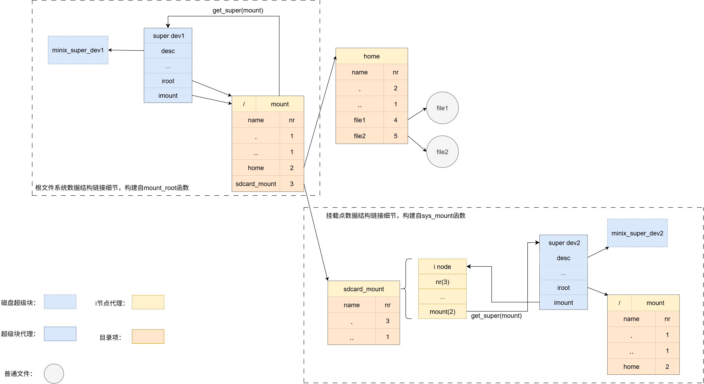

sys_mknod会接收设备号作为参数。它的实现最终会调用minix_mknod函数，这会创建一个特殊的文件，我们称它为设备文件，然后文件的磁盘i节点当中zone数组只使用第一个元素，存放传入的设备号，在将磁盘i节点转成i节点代理过程当中，i节点代理的rdev成员就会被赋值成minode->zone[0]，minix_mknod伪代码如下：

```c
int minix_mknod(inode_t *dir, char *name, int mode, int dev) {
    // ...
    // 创建一个特殊的文件。
    // ...
    if (ISBLK(mode) || ISCHR(mode))
        minode->zone[0] = dev;

    // ...
}
```

sys_mount函数负责将一个设备文件挂载到指定目录下。比如sd卡，一般来说，它的设备文件名为/dev/sdb1，当我们要访问sd卡时，需要执行命令 `mount /dev/sdb1 /mnt` 。**这里需要注意的是，sd卡所有的文件系统 和 我们的根目录所挂载的文件系统一定是两个独立的互不相干的两个文件系统，他们各自拥有自己独立、自包含的i节点编号空间。在同一个Linux系统下，SD卡上文件的i节点号与根文件系统下文件的i节点号即使数字相同，也绝对不会发生冲突。系统能够清晰地区分它们。** onix sys_mount函数实现伪代码如下：

```c
int sys_mount(char *devname, char *dirname, int flags) {
    // 获取设备文件i节点代理
    devinode = namei(devname);

    // 获取挂载点i节点代理
    dirinode = namei(dirname);

    // 获取设备超级块
    super = read_super(devinode->rdev);

    // 设备超级快指向挂载点
    super->imount = dirinode;

    // 挂载点指向挂载的设备
    dirinode->mount = devinode->rdev;
    iput(devinode);
    return EOK;
}
```

核心逻辑如下：

> 1. 获取设备文件i节点代理。
> 2. 获取挂载点i节点代理。
> 3. 获取设备超级块。
> 4. 将设备超级块指向挂载点。
> 5. 挂载点指向挂载的设备。

sys_open当中核心函数还是中间调用的minix_open回调，它的伪代码如下：

```c
static int minix_open(inode_t *dir, char *name, int flags, int mode, inode_t **result) {
    minix_dentry_t *entry = NULL;

    // 在dir下尝试查找name文件，并将目录项存到entry。
    buf = find_entry(dir, name, &next, &entry);
    if (buf) {
        // 如果找到了根据目录项将 i节点号转为i节点代理。iget函数是老朋友了，前面小结经常用到。
        inode = iget(dir->dev, entry->nr);
        assert(inode);
        goto makeup;
    } // 不存在

    // 不带创建标志，返回文件不存在的错误。
    if (!(flags & O_CREAT)) {
        ret = -EEXIST;
        return res;
    }

    // 向父目录当中添加名为name的文件项。并且返回其文件项缓存块地址，确保entry有效。
    buf = add_entry(dir, name, &entry);

    // 申请一个i节点号。
    entry->nr = minix_ialloc(dir->super);

    // 初始化磁盘i节点和i节点代理。
    inode = new_inode(dir->dev, entry->nr);

makeup:
    // 传给输出参数。
    *result = inode;
    return EOK;
}
```

首先明确：sys_open调用minix_open，传入的name是单个文件名，dir是name文件的父目录i节点。

> 1. 调用find_entry函数，首先在dir下尝试查找name文件，并将目录项存到entry。如果找到了，根据目录项将 i节点号转为i节点代理，并快进到 `makeup` 阶段。iget函数是老朋友了，前面小结经常用到。如果没找到，尝试去创建一个新文件。
> 2. 检测是否带 `O_CREAT` 标志，不带标志就返回文件不存在的错误。
> 3. 调用add_entry函数向父目录当中添加名为name的文件项。并且返回其文件项缓存块地址，确保entry有效。
> 4. 申请一个i节点号。
> 5. 初始化磁盘i节点和i节点代理。

有关 `find_entry` 和 `add_entry` 函数，这两函数属于目录操作函数，在 **目录的操作** 小结将深入展开讲解。

踪上，一个进程打开一个文件后，系统状态图如下：

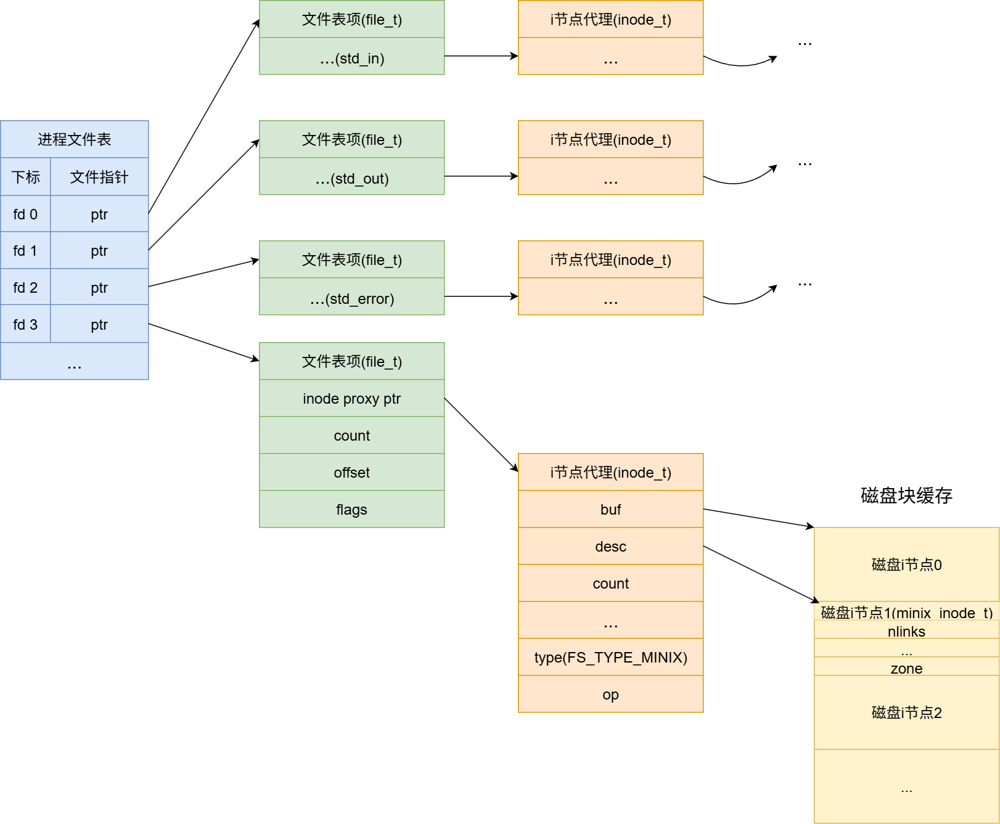

### 虚拟文件的读/写

如果说超级块是更高维度的能解析文件系统的磁盘结构，那么i节点其实可以理解成低维度的能解析文件的磁盘结构。

在 **i节点的分配与释放** 小结已经列出过i节点的磁盘结构，但因为文章结构原因我们没有多费口舌去讲解它具体成员的作用。在本节，因为文件的操作是极度依赖i节点磁盘结构的。所以，下面用一张图片直观了解i节点的磁盘结构：

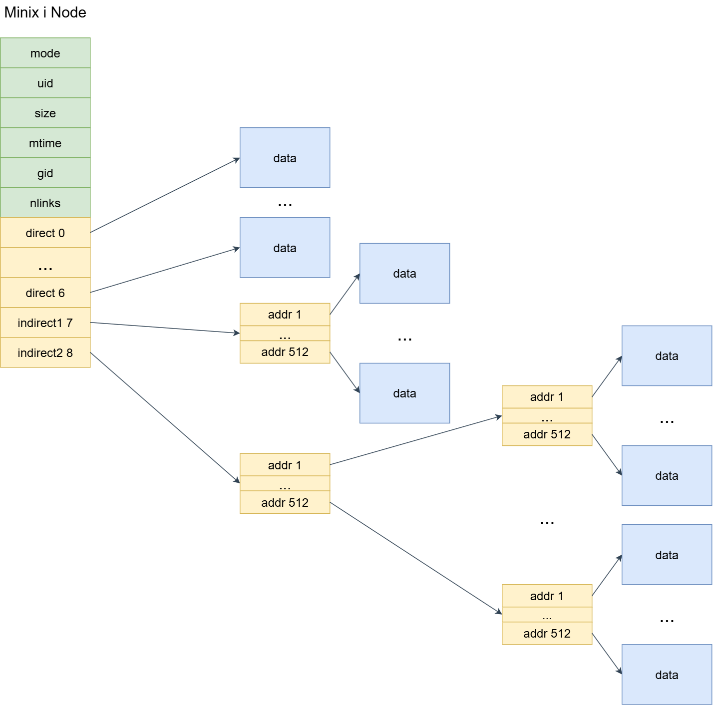

一般的，i节点磁盘数据结构各个字段作用如下：

| i节点字段名 | 作用 |
| :-: | :-: |
| minix_inode_t::mode | 文件类型和属性位，onix支持的文件类型包含：常规文件、目录文件、字符设备文件、块设备文件。文件屬性包含：读、写、可执行。 |
| minix_inode_t::uid | 用户id，也即文件拥有者标识符 |
| minix_inode_t::size | 文件大小（Byte） |
| minix_inode_t::mtime | 最后修改的时间戳 |
| minix_inode_t::gid | 用户所属组id |
| minix_inode_t::nlinks | 链接数，表示有多少目录项指向该i节点 |
| minix_inode_t::zone | 长度为9的uint16_t类型数组，前7个元素代表直接块，直接指向磁盘数据块，第8个元素为一级间接块，第9个元素为二级间接块 |

磁盘i节点的设计非常精妙，前面部分存放文件属性，**后面的数组 `minix_inode_t::zone` 是你打开每一个文件，都能从0偏移开始读取的根本原因**。如果你有仔细研究过onix/xv6内存管理当中内存虚拟内存机制，你会发现，i节点对文件数据块的管理 和 虚拟内存的页表-页框-页目录机制思想一模一样。

尽管物理上磁盘只有一块，i节点磁盘数据结构这种 直接块-间接块-双重间接块 机制让虚拟文件系统当中的每个文件都像独占一块磁盘一样，使（实际上）非连续空间连续化，可以从偏移0位置开始顺序读写数据。同时，在这种机制的加持下，更便于磁盘块的管理，增加零散磁盘块的利用率。

有了上面i节点管理数据块的理论知识，下面让我们一步步了解 `sys_read` 和 `sys_write` 系统调用的实现。

首先是 `sys_read` 函数，伪代码如下：

```c
int sys_read(fd_t fd, char *buf, int count) {
    // ...
    if ((ret = fd_check(fd, &file)) < EOK)
        return ret;

    inode_t *inode = file->inode;

    int len = inode->op->read(inode, buf, count, file->offset);

    if (len > 0)
        file->offset += len;

    return len;
}
```

> 1. 首先将fd转换为文件表项 `file_t` 。
> 2. 由文件表项获得文件的i节点代理。
> 3. 调用 minix read 回调读取数据。

直接来到了minix read 回调——minix_read。该函数根据传入的要读的数据长度len和文件偏移offset来来逐块读取数据。如下：

```c
// 从 inode 的 offset 处，读 len 个字节到 buf
static int minix_read(inode_t *inode, char *data, int len, off_t offset) {
    minix_inode_t *minode = (minix_inode_t *)inode->desc;
    if (ISCHR(minode->mode)) {
        assert(minode->zone[0]);
        return device_read(minode->zone[0], data, len, 0, 0);
    } else if (ISBLK(minode->mode)) {
        assert(minode->zone[0]);
        device_t *device = device_get(minode->zone[0]);
        assert(len % BLOCK_SIZE == 0);
        assert(device_read(minode->zone[0], data, len / BLOCK_SIZE, offset / BLOCK_SIZE, 0) == EOK);
        return len;
    }

    assert(ISFILE(minode->mode) || ISDIR(minode->mode));

    // 如果偏移量超过文件大小，返回 EOF
    if (offset >= minode->size) {
        return EOF;
    }

    // 开始读取的位置
    u32 begin = offset;

    // 剩余字节数
    u32 left = MIN(len, minode->size - offset);
    while (left) {
        // 找到对应的文件便宜，所在文件块
        idx_t nr = minix_bmap(inode, offset / BLOCK_SIZE, false);
        assert(nr);

        // 读取文件块缓冲
        buffer_t *buf = bread(inode->dev, nr);

        // 文件块中的偏移量
        u32 start = offset % BLOCK_SIZE;

        // 本次需要读取的字节数
        u32 chars = MIN(BLOCK_SIZE - start, left);

        // 更新 偏移量 和 剩余字节数
        offset += chars;
        left -= chars;

        // 文件块中的指针
        char *ptr = buf->data + start;

        // 拷贝内容
        memcpy(data, ptr, chars);

        // 更新缓存位置
        data += chars;

        // 释放文件块缓冲
        brelse(buf);
    }

    // 更新访问时间
    inode->atime = time();

    // 返回读取数量
    return offset - begin;
}
```

函数逻辑如下：

> 1. 判断文件类型，如果是字符设备或者块设备，就根据minode->zone[0]获取到设备的设备号，然后调用虚拟设备回调函数，去读取数据并返回。如果是普通文件/目录，继续下面步骤。
> 2. 普通文件的话，进入while循环，调用minix_bmap函数基于i节点的zone数组将offset转换为数据所在磁盘块。
> 3. 获取磁盘块缓存。
> 4. 读取 `MIN(BLOCK_SIZE - start, left)` 长的数据。
> 5. 如果读取的数据不够len字节，重复2~4步骤。

那么，minix_bmap函数是怎么实现的呢？onix对minix_bmap稍微有些复杂。这里附上我的想法，我觉得可以重用 [这才是计科之 Onix & XV6 源码分析（2、类Unix的内存管理）](https://blog.csdn.net/m0_52566365/article/details/139525258) 的做法。思想就是基于 i节点的磁盘结构图 对offset进行划分，如下：

> - 如果 offset 在直接块覆盖范围内，直接通过zone数组读取数据块即可。
> - 如果 offset 在一级间接块覆盖范围内。
>   - 首先将offset减去直接块所能表示的最大地址。
>   - 将offset看成虚拟磁盘地址，然后由 `(offset & 0x7FC00) >> 10` 公式获取虚拟磁盘地址高9位作为一级间接块的数组（元素为uint16_t）索引，然后取得磁盘数据块号后，将offset末尾的10位作为磁盘数据块内偏移。 获取块内偏移的公式：`offset & 0x3FF` ，最终获得到物理磁盘地址。
> - 如果 offset 在二级间接块覆盖范围内。
>   - 首先将offset减去直接块 + 一级间接块所能表示的最大地址。
>   - 将offset看成虚拟磁盘地址，然后由 `(offset & 0xFF80000) >> 10` 公式获取虚拟磁盘地址高9位作为一级间接块的数组（元素为uint16_t）索引，取得二级间接块号后，根据公式 `(offset & 0x7FC00) >> 10` 得到二级间接块数组（元素同样为uint16_t）索引，取得磁盘数据块号后，将offset末尾的10位作为磁盘数据块内偏移。 获取块内偏移的公式：`offset & 0x3FF` ，最终获得到物理磁盘地址。

但是， **由于onix规定zone数组元素类型为uint16_t，所以这决定了onix最大能表示的磁盘块号为2^16 - 1， 故onix的磁盘有效大小的上限为 64MB。** 当然，作为学习操作系统，我们就不必太过于精益求精。

文件系统的写，是读的逆过程，代码逻辑极其相似，行文至此，篇幅过多，这里就不带着大家读代码了，建议读者亲自去扒一扒onix的源码。

### 目录的操作

最后就是文件系统目录的操作，这里主要讲解两个函数：`find_entry` 和 `add_entry`。面对目录，只需要记住一点，目录其实就是一个 文件内容被规定死的 普通文件。目录文件会存放一个个目录条目，onix当中目录条目数据结构如下：

```c
// 文件目录项结构
typedef struct minix_dentry_t
{
    u16 nr;              // i 节点
    char name[NAME_LEN]; // 文件名
} minix_dentry_t;
```

目录项图解如下：

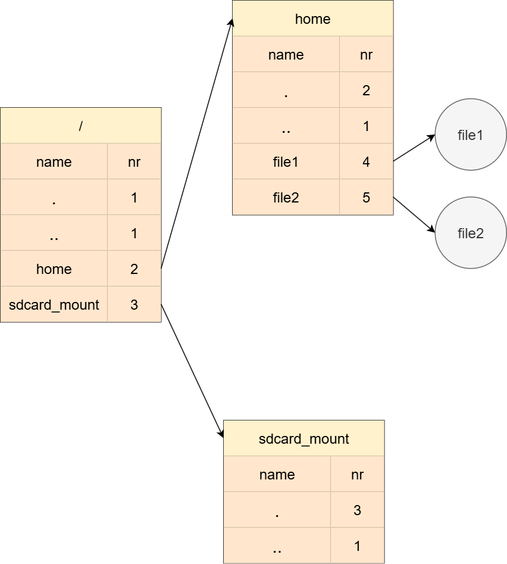

在onix当中，find_entry函数为了找到目标目录项会使用for循环遍历传进来的目录的所有目录项。

add_entry同样会遍历目录的目录项，直到找到一个 `nr` 成员为0的目录项，在onix当中，nr为0意味这该目录项未被占用。所以相应的，如果你想删除一个目录项，只需将对应的nr置为0即可。onix的minix_rmdir函数也正是这样做的。

---

**本章完结**