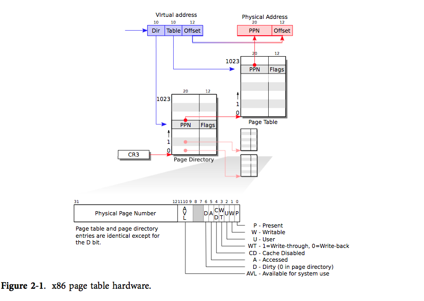

## 前言

前一章我们介绍了XV6的启动流程，在本章，我们就要开始介绍类Unix操作系统最重要的一部分——内存管理模块。

本文以XV6里面的内存管理为主，后面会提炼Onix中内存管理比较好的部分，来对XV6进行一个补充。

Onix相关链接：

- [github仓库链接](https://github.com/StevenBaby/onix)。

- [B站配套视频链接](https://www.bilibili.com/video/BV1qM4y127om/)。

XV6-x86的github链接：

- [链接](https://github.com/mit-pdos/xv6-public)。

<!-- more -->

## 分页

首先了解一下unix-like系统虚拟内存做法。

x86中分页涉及两个主要寄存器：cr0、cr3，cr0主要用于控制是否开启分页，cr3用于存放页目录的地址。当cr0寄存器设置开启分页，cpu所使用的一切地址皆是虚拟地址，在分页机制中，一个虚拟地址被划分成3个部分，如下图：


如图中所注释的那样，地址的高10位代表在**页目录**中的索引（一个目录项占4Byte）、中间10位代表**页表**上的索引（一个页表项占4Byte）、低12位代表在**页框**上的偏移（1Byte为单位）。一个典型的页目录大小是4096字节（一个Page的大小），页表和页目录大小一样。并且低12位的寻址范围正好也是4096，这样一切就恰到好处。此时：sizeof(页目录) == sizeof(页表) == sizeof(页框) == 4096。

此外，由于页目录（页表）每一项都是4Byte为单位。所以每个页目录（页表）正好有1024个entry。

一个页目录（页表）的每一个索引项都是4Byte，这4Byte格式如下图：


从entry的结构图可以看出，它的高20位指向页框号（物理上的），在4G的物理地址空间内，一个页面按4096个字节算的话，正好有1M个页面（页框）。所以20位正好能为每一个页框从0开始编址。

entry的低12位是一些控制位，比如0位指示该entry所指向的物理地址是否有效，第1位指示entry所指的物理页是否可写，第3位代表用户态能否访问，等等。我们可以利用这些位来实现很多unix-like中的骚操作，最有名的应该是利用第1位实现**写时拷贝**。

CPU会通过MMU来完成虚拟地址到物理地址的翻译，记要翻译的虚拟地址是vaddr，过程如下：

0. 拿到cr3指向的页目录地址（物理地址），dir_paddr。

1. 位运算取vaddr的高10位，将高10位作为页目录的索引，得到dir_entry，dir_entry会指向下一级的页表，所以通过dir_entry可以得到页表的地址（物理地址），tab_paddr。
s
2. 位运算取vaddr中间10位，将中间10位作为页表的索引，得到tab_entry，tab_entry会指向最后一级的页框，所以通过tab_entry可以得到页框的地址（物理地址），frm_paddr。

3. 最后，位运算取vaddr的低12位，这12位作为页框的物理地址frm_addr的偏移，于此得到了虚拟地址对应的物理地址：frm_paddr + offset。

整个流程可以使用xv6官方提供的图来描绘：



## 内存管理

首先回顾一下，在进入main前，cpu的状态如下：关中断 & 进入了保护模式 & 安装了一个临时全局描述符 & BSP分配了一个4K的内核栈 & 开启了4M big page的临时分页。

XV6在main函数中会进行内存管理相关的初始化：

```cpp
int
main(void)
{
  kinit1(end, P2V(4*1024*1024)); // phys page allocator
  kvmalloc();      // kernel page table
  seginit();       // segment descriptors // 扩张了用户【数据&代码】段描述符，源码很简单，读者可自行阅读，这里就不去帖代码了
  // ...
  startothers();   // start other processors  // 唤醒其他处理器，本文不会做过多讲解，后面的文章再深入探讨。
  kinit2(P2V(4*1024*1024), P2V(PHYSTOP)); // must come after startothers()
  // ...
}
```

因为cpu现在是开启分页的，所以，我们利用P2V宏来获得4M物理地址对应的虚拟地址，实现也很简单，就是物理地址加上内核基地址的偏移就能得到物理地址对应的虚拟地址：

```cpp
#define V2P_WO(x) ((x) - KERNBASE)    // same as V2P, but without casts
#define P2V_WO(x) ((x) + KERNBASE)    // same as P2V, but without casts
```

### kinit1：初始化内核内存分配器（阶段1）。

xv6的注释将kalloc称为物理内存分配器，这是第一个吐槽点，从它的源码上来看，我认为把它称为内核内存分配器更加合适。因为xv6把物理内存、内核内存的管理全都交给kalloc做，并且内存粒度也固定为4K。由于所有的物理地址也由kalloc管理，**为此内核不得不去在自己的页表上去映射所有的物理内存！**，其优点就是代码实现上会很简单（特别是在软件实现修改页表的操作上），但是这样做是非常暴力的。如果你阅读过Onix、或者其他更完善的unix-like操作系统的话会发现，更加严谨的做法是：get_page + alloc_kpage + kmalloc：

```cpp
// Onix

// src/kernel/memory.c

// 底层实现为：使用连续的256页来跟踪每个页框，每个页框会对应1Byte的entry
// 使用1Byte的好处是可以记录每个页框的索引。这里方便实现copy on write
// 和xv6不同，我们在后面就会看到，Onix在实现fork的copy on write时，子进程的
// 页表也是动态复制的。

// 分配一页物理内存
static u32 get_page() { /* ... */ }
// 释放一页物理内存
static void put_page(u32 addr) {/* ... */}

// 该函数是基于位图实现，利用位图来管理内核的内存，只有页目录的内存分配会使用内核内存，
// 页表、页框的内存分配全部通过get_page()函数。内核页表也不用相xv6那样去映射所有物理页，
// 另外一个优点是该函数可以连续分配多个内核页，xv6就存在最大只能分配1个page的限制！

// src/kernel/memory.c

// 分配 count 个连续的内核页
u32 alloc_kpage(u32 count) { /* ... */ }
// 释放 count 个连续的内核页
void free_kpage(u32 vaddr, u32 count) { /* ... */ }

// src/kernel/area.c
// 该函数是更加细粒度的分配内核内存，可以分配小于4K的小块内存。内部有一个内存池，

// 对细小内存进行池化管理。
void *kmalloc(size_t size) { /* ... */ }
void kfree(void *ptr) { /* ... */ }
```

这里可以计算一下：如果以1byte为单位去管理1M的页（1M * pagesieze（4096）== 4G），1页可以管理4096页内存，所以1M的页需要 （1024 * 1024） / （4 * 1024） = 256页。

回到kinit1函数，kinit1函数执行第一个阶段的内核内存管理的初始化。它会把从内核代码结束的位置开始往上4M的位置为止，以page为单位将每一页利用链表串起来。这部分涉及代码非常简单，直接看源码会比较清晰，这里就不贴它的代码了。大概的结构图如下：


### kvmalloc：构造并安装更加细粒度的页表kpgdir

首先明确，到目前为止cpu使用的entrypgdir是4M big page的页表。kvmalloc会构造一个页表kpgdir，该页表会使用4K的页，分页粒度更加细粒，相对于entrypgdir来说做了进一步细分。kpgdir的内核映射的地址是没有任何变化的，切换到kpgdir页表后，内核的地址空间和之前没有什么区别。唯一的区别就是kpgdir的地址映射范围更大，多了一些entrypgdir页表所不可访问的范围。从数组kmap可以看到，pgdir将原来4M的内核空间扩张到了PHYSTOP（224M），同时将物理内存的高位的设备空间**直接映射**到内核高位虚拟地址空间。XV6在启动阶段没有进行内存探测，只是暴力的将可分配物理内存规定为PHYSTOP（224M）大小，我们可以通过修改PHYSTOP来动态调整XV6的物理内存上限。但是由于PHYSTOP被映射到了KERNBASE之上，所以PHYSTOP的大小是有限制的，即使物理内存是4G，KERNBASE + PHYSTOP的大小也不能覆盖设备地址空间。

```cpp
static struct kmap {
  void *virt;
  uint phys_start;
  uint phys_end;
  int perm;
} kmap[] = {
 { (void*)KERNBASE, 0,             EXTMEM,    PTE_W}, // I/O space
 { (void*)KERNLINK, V2P(KERNLINK), V2P(data), 0},     // kern text+rodata
 { (void*)data,     V2P(data),     PHYSTOP,   PTE_W}, // kern data+memory
 { (void*)DEVSPACE, DEVSPACE,      0,         PTE_W}, // more devices
};
```

直接上代码：

下面这个函数主要作用就是根据页表，用软件模拟MMU的方式，找到传进来的虚拟地址va对应的页表项的虚拟地址，这里用语言表述的可能有点绕。代码从某种程度上比语言好懂。如果alloc为1，在对应的页表不存在时就创建一个页表：

```cpp
// 简单讲，就是返回va对应页表项的虚拟地址
static pte_t *
walkpgdir(pde_t *pgdir, const void *va, int alloc)
{
  pde_t *pde;   // vaddr 虚拟地址
  pte_t *pgtab; // vaddr 虚拟地址

  pde = &pgdir[PDX(va)];                          // 虚拟地址va对应的页表所在页目录项
  if(*pde & PTE_P){
    pgtab = (pte_t*)P2V(PTE_ADDR(*pde));          // 存在，转换页表物理地址为虚拟地址
  } else {
    if(!alloc || (pgtab = (pte_t*)kalloc()) == 0) // 不存在就创建
      return 0;
    // Make sure all those PTE_P bits are zero.
    memset(pgtab, 0, PGSIZE);                     // 清零，防止垃圾值干扰
    // The permissions here are overly generous, but they can
    // be further restricted by the permissions in the page table
    // entries, if necessary.
    *pde = V2P(pgtab) | PTE_P | PTE_W | PTE_U;    // 用物理地址填充页目录项
  }
  return &pgtab[PTX(va)];
}
```

mappages函数作用就简单了，利用walkpgdir函数将传进来的虚拟地址映射到物理地址上。当然，如果页框的页表还没被映射，walkpgdir就会创建页表项：

```cpp
// Create PTEs for virtual addresses starting at va that refer to
// physical addresses starting at pa. va and size might not
// be page-aligned.
static int
mappages(pde_t *pgdir, void *va, uint size, uint pa, int perm)
{
  char *a, *last;
  pte_t *pte;

  a = (char*)PGROUNDDOWN((uint)va);                 // 4k对齐
  last = (char*)PGROUNDDOWN(((uint)va) + size - 1); // 结尾对齐
  for(;;){
    if((pte = walkpgdir(pgdir, a, 1)) == 0)         // 查询虚拟地址a的页表项，不存在就创建。
      return -1;
    if(*pte & PTE_P)
      panic("remap");
    *pte = pa | perm | PTE_P;                       // 填充页表项，让页表项指向页框。
    if(a == last)
      break;
    a += PGSIZE;
    pa += PGSIZE;
  }
  return 0;
}

```

setupkvm函数利用mappages根据数组kmap来构造一个正式的内核页表：kpgdir：

```cpp

// Set up kernel part of a page table.
pde_t*
setupkvm(void)
{
  pde_t *pgdir;
  struct kmap *k;

  if((pgdir = (pde_t*)kalloc()) == 0)   // 分配页目录
    return 0;
  memset(pgdir, 0, PGSIZE);             // 清零，以免野值干扰
  if (P2V(PHYSTOP) > (void*)DEVSPACE)   // PHYSTOP要合理，不能占用设备io空间
    panic("PHYSTOP too high");
  for(k = kmap; k < &kmap[NELEM(kmap)]; k++)    // 这里主要就是对内核映射进行细化，因为最开始内核是4M big page映射
    if(mappages(pgdir, k->virt, k->phys_end - k->phys_start,
                (uint)k->phys_start, k->perm) < 0) {
      freevm(pgdir);
      return 0;
    }
  return pgdir;
}

// Allocate one page table for the machine for the kernel address
// space for scheduler processes.
void
kvmalloc(void)
{
  kpgdir = setupkvm();
  switchkvm();
}
```

在阅读上面这段代码时，一定要分清哪里是物理地址，哪里是物理地址。读者一定要时刻铭记，只要开启分页后，一切地址都是虚拟地址，但是页目录项、页表项都是存的物理地址，我们在拿到物理地址后，在访问前需要将他们进一步转换为虚拟地址。V2P、P2V的实现代码上面已经贴过，就是减去或者加上一个偏移量即可。

我们的内存空间又有了一些变化：


### kinit2：初始化内核内存分配器（阶段2）。

根据注释要求：该函数是在所有其他AP（从处理器）处理器启动之后调用。在查看startothers的实现得知，BSP会为每个AP核都会单独分配一个（scheduler的）内核栈，所以结合kfree的头插法实现，我猜测，XV6是要让这（scheduler的）内核栈在KERNBASE + 4M以内，这暗示了只有KERNBASE + 4M才是内核真正的内存，尽管物理内存和内核内存都在kmem上混合管理。

回归正题，和kinit1类似，kinit2就是将KERNBASE + 4M到KERNBASE + PHYSTOP之间的物理内存页正式挂到kmem的freelist上。**进程页表、页目录、页框的内存分配统一由kalloc来做。**（又一次强调！）

最后，cpu的状态如下：关中断 & 进入了保护模式 & 安装了包括【内核&用户】【代码&数据】段描述符 & BSP分配了一个4K的内核栈 & 开启了以kmap为基础的粒度为4K的内核分页。

至此XV6的内存管理的介绍差不多结束，

## 简单聊一下内存管理在Onix中的做法

首先再次强调，XV6将所有物理地址映射到内核页表并且统一交由kalloc管理的做法极大简化了我们对页目录、页表的修改。但这种将所有物理内存都映射到内核页表的做法是不明智的！

Onix内核页表采用的是直接映射，直接将Onix内核虚拟地址空间映射到物理地址空间。前面提到过，Onix操作系统对内存的管理采用：get_page + alloc_kpage + kmalloc的方式。get_page（管理单位：page）管理的是整个4G物理内存空间，底层是一个256页的大数组，每一byte记录4G物理内存的一个page的引用计数；alloc_kpage（管理单位：page）管理的就是Onix内核（虚拟）页内存，底层是位图，Onix初始化时会向大数组中申请内核所需要的连续的物理内存（将物理数组的byte置为1），申请的内核页会以位图的方式交由alloc_kpage管理；kmalloc（管理单位：小于page的内存碎片）管理内核的小块（虚拟）内存分配与释放，实现较为复杂，底层它是一个小块内存的内存池，实现上和C++中标准库的内存分配器类似。感兴趣的读者可以去深入阅读Onix的代码。这里了解Onix的内存管理基本架构即可。

Onix内存布局如下，盗取了Onix作者的图：


关于虚拟内存，Onix同样采用了两级页表的形式，所不同的是，Onix中进程的页表是由内核页内存分配器alloc_kpage负责，而像进程的页表、页框则是由get_page负责。

这就引入了一个问题，Onix内核页表并不会像XV6那样，把所有的物理内存页都映射到内核页上，那么Onix是如何实现修改页表、页框的操作的呢？

**答案就是将页目录的最后一个entry指向自己**，这里还是引用Onix作者画的页表映射图为例：


从图中我们可以看到，页目录的最后一个entry指向了页目录本身。（0x1007中低12位是控制位！

有了这个前提，我们的页目录就有两种访问方式：

1. 直接通过页目录的虚拟地址访问。

2. **通过虚拟地址：0xfffff000访问。**

你可以在脑海中模拟MMU映射地址过程，试着去翻译地址0xfffff000，最终你一定会发现，翻译后的物理地址确实指向页目录本身。这真的是一种很神奇的方法。

同理在Onix中，如果你想访问一个虚拟地址的页表，你可以且只能使用：

- **虚拟地址：0xFFC00000 | 虚拟地址在页目录中的索引（虚拟地址高10位）**

至此，我们通过“欺骗”MMU的方式实现了，即使我们的内核页表没有映射进程的页表、页框的物理地址，我门的程序还是可以去修改进程的页表。

Onix操作页表、页框的核心函数如下：

```cpp
// 获取页目录vd
static page_entry_t *get_pde()
{
    return (page_entry_t *)(0xfffff000);
}

// 获取虚拟地址 vaddr 对应的页表vd
static page_entry_t *get_pte(u32 vaddr, bool create)
{
    page_entry_t *pde = get_pde();
    u32 idx = DIDX(vaddr);
    page_entry_t *entry = &pde[idx];

    assert(create || (!create && entry->present));

    page_entry_t *table = (page_entry_t *)(PDE_MASK | (idx << 12));

    if (!entry->present)
    {
        LOGK("Get and create page table entry for 0x%p\n", vaddr);
        u32 page = get_page();

        //页目录、页表项的项必须存物理地址!!!
        entry_init(entry, IDX(page));
        memset(table, 0, PAGE_SIZE);
    }

    return table;
}

page_entry_t *get_entry(u32 vaddr, bool create)
{
    page_entry_t *pte = get_pte(vaddr, create);
    return &pte[TIDX(vaddr)];
}
```

再有一次，强烈建议各位想深入学习Unix-like操作系统的同学去阅读一下Onix的源码。链接放在文章的开头了。

参考文档：

XV6中文文档：https://th0ar.gitbooks.io/xv6-chinese/content/

Onix分页机制（含）的文档：https://github.com/StevenBaby/onix/blob/dev/docs/05%20%E5%86%85%E5%AD%98%E7%AE%A1%E7%90%86/041%20%E5%86%85%E5%AD%98%E6%98%A0%E5%B0%84%E5%8E%9F%E7%90%86.md

CR0寄存器详解：https://blog.csdn.net/qq_30528603/article/details/131143850

---

**本章完结**
