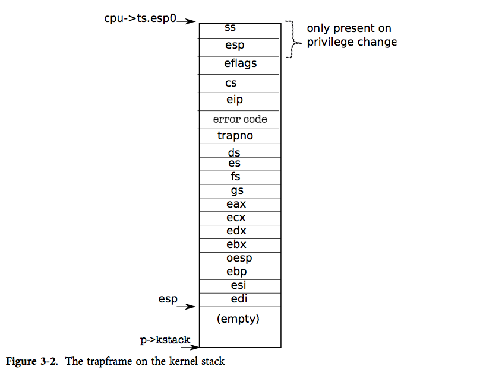

## 前言

前面已经分析了XV6的启动流程以及内存管理，接下来，我们探究进程调度的实现。与其说进程调度，我觉得可以顺应内存的虚拟化的叫法，将进程调度称为“CPU的虚拟化”更加贴切。

首先明确目前XV6的cpu的状态如下：关中断 & 进入了保护模式 & 安装了包括【内核&用户】【代码&数据】段描述符 & BSP分配了一个4K的内核栈 & 开启了以kmap为基础的粒度为4K的内核分页。

Onix相关链接：

- [github仓库链接](https://github.com/StevenBaby/onix)。

- [B站配套视频链接](https://www.bilibili.com/video/BV1qM4y127om/)。

XV6-x86的github链接：

- [链接](https://github.com/mit-pdos/xv6-public)。

<!-- more -->

## 中断机制

对于中断的部分，这里会涉及大量硬件相关的知识，由于博主的目的是了解OS的基本框架，所以硬件相关的知识储备可能不会太深，如果你是想弄清某个硬件具体实现，这篇博客可能不适合你。

这里总结一下我对中断的理解：

引发中断的方式有三种：外中断、异常、软中断。

- 外中断：就是由外部中断控制器通知 CPU 某个事件完成了，比如：磁盘寻道完成可以进行读写了、UART输入寄存器非空（可读）、UART输出寄存器为空（可写）、键盘缓冲有数据了（可读）等等。

- 异常是 CPU 在执行过程中，因为出错而执行不下去了，比如：除零异常、因为虚拟页面还没映射发生缺页异常、对只读段进行写操作触发段错误异常等等。

- 软中断，可以认为是应用程序和操作系统沟通的一种方式，运行在低优先级程序想要对硬件做IO，但是由于只有处于特权级的内核能够直接和设备打交道，从而低优先级程序必须通过某种机制来完成特权级转换，这种机制就是软中断。我们也可以将实现这种功能的函数称为系统调用。

如有些教科书那样，我们也可以把异常和软中断统称为 内中断，也就是这个中断时 CPU 和 软件内部产生的，与外部硬件无关。

### Onix单核处理器的中断原理

单核PC机上，一般会采用（主从）两片 8259a PIC（programmable interrupt controller），将PIC的INT引脚接到CPU的一个引脚上，如下图，图片引用自onix的文档，如有侵权，可告知删除：


从图中可以看到有两个8259a，上面那个8259a是主PIC，它的INT引脚直接接到CPU上；下面那个8259a的INT引脚接到主PIC的IR2引脚，所以它是从PIC。 每一个PIC的引脚会接一个外设，（如果对应的引脚没被屏蔽的话）外设会通过PIC间接向CPU发中断。

在PIC正式工作前，需要对其进行一系列初始化。初始化操作由cpu发送一系列的控制字完成。有两类控制字：

- 初始化命令字 (Initialization Command Words, ICW), ICW 共 4 个， ICW1 ~ ICW4；

- 操作命令字 (Operation Command Word, OCW), OCW 共 3 个， OCW1 ~ OCW3；

ICW 做初始化，用来确定是否需要级联，设置起始中断向量号，设置中断结束模式。因为某些设置之间是具有依赖性的，也许后面的某个设置会依赖前面某个 ICW 写入的设置，所以这部分要求严格的顺序，**必须依次写入** ICW1、ICW2、ICW3、ICW4；

OCW 来操作控制 8259A，中断的屏蔽和中断处理结束就是通过往 8259A 端口发送 OCW 实现的。OCW 的发送顺序不固定，3 个之中先发送哪个都可以。

**具体细节非常推荐读者去阅读一下Onix文档，讲的真的很细致**：https://github.com/StevenBaby/onix/blob/dev/docs/04%20%E4%B8%AD%E6%96%AD%E5%92%8C%E6%97%B6%E9%92%9F/033%20%E5%A4%96%E4%B8%AD%E6%96%AD%E6%8E%A7%E5%88%B6%E5%99%A8.md

8259a中断控制器的初始化就是一种固定套路，截取Onix代码如下：

```cpp
#define PIC_M_CTRL 0x20 // 主片的控制端口
#define PIC_M_DATA 0x21 // 主片的数据端口
#define PIC_S_CTRL 0xa0 // 从片的控制端口
#define PIC_S_DATA 0xa1 // 从片的数据端口
#define PIC_EOI 0x20    // 通知中断控制器中断结束

// 初始化中断控制器
void pic_init()
{
    // 主PIC
    outb(PIC_M_CTRL, 0b00010001); // ICW1: 边沿触发, 级联 8259, 需要ICW4.
    outb(PIC_M_DATA, 0x20);       // ICW2: 起始中断向量号 0x20
    outb(PIC_M_DATA, 0b00000100); // ICW3: IR2接从片.
    outb(PIC_M_DATA, 0b00000001); // ICW4: 8086模式, 正常EOI

    // 从PIC
    outb(PIC_S_CTRL, 0b00010001); // ICW1: 边沿触发, 级联 8259, 需要ICW4.
    outb(PIC_S_DATA, 0x28);       // ICW2: 起始中断向量号 0x28
    outb(PIC_S_DATA, 2);          // ICW3: 设置从片连接到主片的 IR2 引脚
    outb(PIC_S_DATA, 0b00000001); // ICW4: 8086模式, 正常EOI

    outb(PIC_M_DATA, 0b11111111); // OCW1：屏蔽字，关闭主PIC所有中断，后面需要什么中断再依据需求打开。
    outb(PIC_S_DATA, 0b11111111); // OCW1：屏蔽字，关闭从PIC所有中断，后面需要什么中断再依据需求打开。
}
```

CPU在处理每个外中断后，需要向PIC发生一个结束字为的是通知PIC中断处理结束，具体中断结束方式由OCW2 来设置。代码如下：

```cpp
// 通知中断控制器，中断处理结束
void send_eoi(int vector)
{
    if (vector >= 0x20 && vector < 0x28)
    {
        outb(PIC_M_CTRL, PIC_EOI);
    }
    if (vector >= 0x28 && vector < 0x30)
    {
        outb(PIC_M_CTRL, PIC_EOI);
        outb(PIC_S_CTRL, PIC_EOI);
    }
}
```

至此单核OS中断的初始化到这里就结束了。

### XV6多核处理的中断原理

多核处理器中断控制器的结构更为复杂，因为偏向硬件，这里就只记录一下我对APIC的理解，理解不会太深，如果有错误，非常欢迎读者纠正！

首先还是供上架构框图：


图片截取自：https://pdos.csail.mit.edu/6.828/2014/readings/ia32/MPspec.pdf

注释：

BSP：bootstrap processor，可以简单理解为主处理器。

APx：application processors ，可以简单理解为从处理器。

关于BSP和APx的关系这里先埋个伏笔。在【AP（从）处理器的启动】段落会进行详细叙述。

从图中的上半部分可以了解到，每个CPU各自接着一个Local APIC（Advanced Programmable Interrupt Controller）。注意，**每个lapic和cpu是封装在一起的**（这里并不严谨，是否和cpu封装在一起其实和cpu的架构有关）。后面我们会看到，不止APIC，在多核cpu上，它的每一个cpu都有自己的一套cpu寄存器，比如：esp、eip、eflag等等。具体情况我们在“进程调度”段落进行详细讲解。

从图的下半部分，我们可以了解到所有的lapic都接到了ICC（interrupt controller communications） Bus上，并且，总线上还接了一个IO APIC，这里的**ioapic是和cpu分离的**，它被接在cpu的外部。**ioapic会接收来自各个外设的中断。然后对各个外设发来的中断做一些判断和处理，再将中断的IRQ号和lapic的ID封装在一条“报文”中分发給对应的lapic**，具体发给哪些lapic，我们可以通过配置ioapic来进行设置。ioapic左边其实是有很多引脚（实际16个，如果级联了8259a可能会更多）每个引脚都可以接外设。有趣的是，从图中ioapic的左边可以看到，**ioapic的引脚还可以接8259a PIC控制器**，这非常完美的兼容了单核cpu的中断控制器的架构。

iopic是依据重定向表项 RTE(Redirection Table Entry)来构建“报文“，RTE对每一个中断都会有一项64位的entry。通过entry，可以单独设置ioapic在收到中断后对中断的操作。每一项entry描述：中断对应的中断向量？中断有没有使能？中断传输状态？发给哪个lapic？

每个lapic都有一个唯一的ID，cpu可以在特定的内存（device space）上来查询自己所对应的lapic的ID号，lapic的ID其实也唯一标识了一个cpu。lapic会根据自己的ID从ICC Bus上接收属于自己的中断”报文“，然后经过一系列检查最后将中断发给cpu，当cpu处理完中断后，会反馈给自己的lapic，lapic收到cpu的回复后，同样将中断处理完毕的消息通知给ioapic，这点和单核架构中，cpu处理完中断后向master pic发送PIC_EOI是一样的道理。

特别的是，lapic也可以像ioapic那样作为中断“源”（这里可能不严谨，但是可以类比去理解），向其他的lapic发送中断“报文”，这是通过ICR(Interrupt Command Register)寄存器实现，ICR的结构和ioapic的RTE表的entry结构类似，也有中断向量号、lapic的ID等字段。lapic主动向其他lapic发送中断“报文”最常见的场景就是BSP去启动其他APs，这一般通过会发送INIT or STARTUP IPI（interprocessor interrupts）。

由于XV6中cpu对lapic、iopic初始化代码上，依赖于mpinit函数，而mpinit和多处理器内容相关，所以lapic、iopic初始化我们放到"AP（从）处理器的启动"段落进行讨论。

关于Local APIC和IO APIIC详细内容可以参考博客：https://blog.csdn.net/weixin_46645613/article/details/119207945

### 中断描述符表

之前一直在介绍中断相关的外设，接下来我们看看cpu内部是怎么利用寄存器来定义中断的。

因为中断不止一个，所以，和全局描述符类表似，中断表也是通过一个大的数组来记录每一个中断的属性。数组中每一个Entry格式如下图，每一个Entry同样是8个字节：


- Offset：记录中断门或陷阱门的处理函数的地址。

- Selector：处理函数的段选择子。

- Type：标记是中断门还是陷阱门。 **注意：中断门会自动清除eflag寄存器的FL_IF标志位，而陷阱门则保留eflag的FL_IF标志位。** 也即中断门会i自动关（外）中断，而陷阱门则不会有关中断的操作！

- S：必须为0。

- DPL：描述符可以被哪个特权级使用。对于中断门一般是0x0，对于陷阱门就是0x3（DPL_USER）。

- P：是否有效，固定填1.

XV6相关代码注释写的非常好，上面的中文注释也是参考XV6的注释写的，如下：

```cpp
// Gate descriptors for interrupts and traps
struct gatedesc {
  uint off_15_0 : 16;   // low 16 bits of offset in segment
  uint cs : 16;         // code segment selector
  uint args : 5;        // # args, 0 for interrupt/trap gates
  uint rsv1 : 3;        // reserved(should be zero I guess)
  uint type : 4;        // type(STS_{IG32,TG32})
  uint s : 1;           // must be 0 (system)
  uint dpl : 2;         // descriptor(meaning new) privilege level
  uint p : 1;           // Present
  uint off_31_16 : 16;  // high bits of offset in segment
};

// Set up a normal interrupt/trap gate descriptor.
// - istrap: 1 for a trap (= exception) gate, 0 for an interrupt gate.
//   interrupt gate clears FL_IF, trap gate leaves FL_IF alone
// - sel: Code segment selector for interrupt/trap handler
// - off: Offset in code segment for interrupt/trap handler
// - dpl: Descriptor Privilege Level -
//        the privilege level required for software to invoke
//        this interrupt/trap gate explicitly using an int instruction.
#define SETGATE(gate, istrap, sel, off, d)                \
{                                                         \
  (gate).off_15_0 = (uint)(off) & 0xffff;                \
  (gate).cs = (sel);                                      \
  (gate).args = 0;                                        \
  (gate).rsv1 = 0;                                        \
  (gate).type = (istrap) ? STS_TG32 : STS_IG32;           \
  (gate).s = 0;                                           \
  (gate).dpl = (d);                                       \
  (gate).p = 1;                                           \
  (gate).off_31_16 = (uint)(off) >> 16;                  \
}
```

中断描述符寄存器如下：

高32位存放中断描述符表的基地址，低16位存放中断描述符表的大小（字节为单位）。


## AP（从）处理器的启动

首先还是回归main函数：

```cpp
// Bootstrap processor starts running C code here.
// Allocate a real stack and switch to it, first
// doing some setup required for memory allocator to work.
int
main(void)
{
  kinit1(end, P2V(4*1024*1024)); // 内存内存管理已讲
  kvmalloc();      // 内存内存管理已讲
  mpinit();        // detect other processors
  lapicinit();     // interrupt controller
  seginit();       // 内存内存管理已讲
  picinit();       // disable pic // 禁用单核架构下的8259A，实现很简单，这里就不去贴代码了
  ioapicinit();    // another interrupt controller
  // ...
  pinit();         // process table // 实现很简单就是对自ptable的自旋锁进行一个初始化。读者可以自行阅读代码，这里就不过多赘述。
  tvinit();        // trap vectors
  // ...
  startothers();   // start other processors
  kinit2(P2V(4*1024*1024), P2V(PHYSTOP)); // 内存内存管理已讲
  userinit();      // first user process // 就是对init进程的内核栈做一个初始化。利用了ROP（面向返回点编程）编程思想。因为这又是一个大主题，本文不会过多讲解。以后有机会在另开一篇博客专门讨论。
  mpmain();        // finish this processor's setup // 进入mpmain
}

// Other AP CPUs jump here from entryother.S.
static void
mpenter(void)
{
  switchkvm();  // AP的内核页表换成kpgdir
  seginit();    // 内存内存管理已讲
  lapicinit();  // 作用同main函数中BSP核执行的lapicinit函数
  mpmain();     // 进入mpmain
}

// BSP、APS最终都会进入改函数。
// 主要工作就是
//    1、加载中断描述表。
//    2、设置状态，已启动。
//    3、 进入调度循环。
// Common CPU setup code.
static void
mpmain(void)
{
  cprintf("cpu%d: starting %d\n", cpuid(), cpuid());
  idtinit();       // load idt register // 使用lidt命令加载中断描述符
  xchg(&(mycpu()->started), 1); // tell startothers() we're up
  scheduler();     // start running processes
}
```

接下我们要从BSP执行的maiin函数开始，深入分析以上代码的作用。

### mpinit：探测各个cpu

该部分主要参考：[多处理器规范](https://pdos.csail.mit.edu/6.828/2014/readings/ia32/MPspec.pdf)，因为我英语也是很菜，所以硬着头皮捡重点去看了一部分。

这里对多核处理器的启动流程做一个简单总结：我们可以理解为，多核CPU中，有一个CPU被设计成BSP，其他的CPU都被设计成AP。当然，在实际硬件设计上为了考虑容错性，任何一个CPU都能成为BSP核。 **系统最开始，BSP有对硬件的绝对控制权，包括去控制其他AP的启动和停止。为了启动其他AP核，BSP首先通过三种可能的方式搜索MP floating pointer structure，如果找到了一个有效的MP floating pointer structure就去遍历MP configuration table查询处理器信息和ioapic的信息；如果无法找到一个有效MP floating pointer structure，那就认为系统只有一个CPU——BSP。在所有CPU启动后，BSP就退化成AP，系统不存在BSP、AP之分。** 当然，我们需要要记录BSP CPU的lapic的ID（这个ID也唯一标识着CPU），这样我们才知道谁可以去其控制其他CPU的停止。在BSP启动其他AP前，因为AP CPU是暂停状态，所以其他AP无法执行OS代码，并且大部分中断都是被禁用，**但是INIT or STARTUP interprocessor interrupts (IPIs)不会被屏蔽，当AP收到来自BSP的INIT or STARTUP中断，就会启动它自己。** AP在收到BSP的启动中断后，也会进入保护模式、**有自己的独立的一套寄存器**、设置自己的全局描述符、开启分页、有自己的堆栈等。

首先BSP会通过三种方式去搜索MP floating pointer structure，**三种搜索范围都在1M以内，因为MP floating pointer structure就是由BIOS提供，而BISO寻址范围就1M**：

1. In the first kilobyte of Extended BIOS Data Area (EBDA), or
2. Within the last kilobyte of system base memory, or
3. In the BIOS ROM address space between 0F0000h and 0FFFFFh.

低1M内存的内存映射参考：https://wiki.osdev.org/BDA#BIOS_Data_Area_.28BDA.29

MP Configuration Data Structures整体框架如下图，图解了MP floating pointer structure、MP Configuration Table Header、Table Entries三者之间的一个关系，先了解一下大致的框架，接下来我门逐一剖析。


MP floating pointer structure图解如下：


主要关注它的PHYSICAL ADDRESS POINTER，它指向MP config table的物理地址。

MP Configuration Table Header结构如下：


主要关注几个字段：
- MEMORY-MAPPED ADDRESS OF LOCAL APIC：描述 cpu（**每个CPU都将它的lapic映射到了同一个物理地址**）的lapic的寄存器物理地址。注意这里是"每个cpu"，虽然是同一个物理地址，但是在每一个cpu去读的时候，分别映射到了各自的lapic的寄存器地址上了。

- BASE TABLE LENGTH：整个table的长度，虽然存在扩展表长度，但是我们还用不到。

MP Configuration Table Header后面会跟上各自类型的Base MP Configuration Table Entries，每个Entry的第一个字节会标明其类型，并且每种Entry的长度都各自固定，所以我们可以通过一个循环来遍历每个Entry，一共有5种类型的Entry，如下图：


XV6中我们主要关注Processor Entries和I/O APIC两种类型的Entry。

Processor Entries结构如下：


主要关注LOCAL APIC ID，如该字段名字那样，就是代表和CPU绑定的lapic的ID，通过它我们也可以唯一标识一个CPU。

I/O APIC Entries结构如下：


主要关注I/O APIC ID，代表I/O APIC的ID。

然后上代码：

```cpp
void
mpinit(void)
{
  uchar *p, *e;
  int ismp;
  struct mp *mp;              // 前面提到的MP floating pointer structure
  struct mpconf *conf;        // 前面提到的MP Configuration Table Header
  struct mpproc *proc;        // 前面提到的Processor Entries
  struct mpioapic *ioapic;    // 前面提到的I/O APIC Entries

  if((conf = mpconfig(&mp)) == 0)     // 用上面提到的三种方法寻找MP floating pointer structure，并且判断它的合法性，然后将结构体里面的PHYSICAL ADDRESS POINTER（指向MP Configuration Table Header）作为返回值
    panic("Expect to run on an SMP");
  ismp = 1;
  lapic = (uint*)conf->lapicaddr;     // 将lapic的寄存器地址放到全局变量lapic中
  for(p=(uchar*)(conf+1), e=(uchar*)conf+conf->length; p<e; ){  // 依据MP Configuration Table Header遍历每一个Table Entry。
    switch(*p){
    case MPPROC:                      // Processor Entries
      proc = (struct mpproc*)p;
      if(ncpu < NCPU) {
        cpus[ncpu].apicid = proc->apicid;  // apicid may differ from ncpu // 保存cpu的lapic的id
        ncpu++;                       // 找到一个CPU
      }
      p += sizeof(struct mpproc);
      continue;
    case MPIOAPIC:                    // I/O APIC Entries
      ioapic = (struct mpioapic*)p;
      ioapicid = ioapic->apicno;      // 将ioapicid存到全局变量，将来初始化的时候会用
      p += sizeof(struct mpioapic);
      continue;
    case MPBUS:                       // 其他的不关注，加上他们的大小去找下一个Table Entry。
    case MPIOINTR:
    case MPLINTR:
      p += 8;
      continue;
    default:
      ismp = 0;
      break;
    }
  }
  if(!ismp)
    panic("Didn't find a suitable machine");

  if(mp->imcrp){
    // 如果之前是PIC Mode，就切换到APIC模式 
    // interrupt mode configuration register --> IMCR
    // Bochs doesn't support IMCR, so this doesn't run on Bochs.
    // But it would on real hardware.
    outb(0x22, 0x70);   // Select IMCR
    outb(0x23, inb(0x23) | 1);  // Mask external interrupts.  // 进入APIC模式
  }
}
```

mp->imcrp字段的解释如下：


详细信息可以了解一下：[多处理器规范](https://pdos.csail.mit.edu/6.828/2014/readings/ia32/MPspec.pdf)

### lapicinit：BSP初始化自己cpu的lapic

这部分和硬件强相关，我也了解不是特别多，尽可能的讲清楚吧。硬件相关的初始化深入下去也是一个无底洞。如果读者感兴趣的话，可以去查intel 64 and IA-32 卷3开发手册。 

```cpp
void
lapicinit(void)
{
  if(!lapic)    // lapic就是上面mpinit函数在MP Configuration Table Header中得到的lapic寄存器的物理映射地址，所以说初始化的顺序非常严格！
    return;

  // Enable local APIC; set spurious interrupt vector.
  lapicw(SVR, ENABLE | (T_IRQ0 + IRQ_SPURIOUS));      // 开启此cpu的APIC

  // 配置时钟，属于lapic的本地中断
  // The timer repeatedly counts down at bus frequency
  // from lapic[TICR] and then issues an interrupt.
  // If xv6 cared more about precise timekeeping,
  // TICR would be calibrated using an external time source.
  lapicw(TDCR, X1);                               // 分频系数为X1
  lapicw(TIMER, PERIODIC | (T_IRQ0 + IRQ_TIMER)); // 以PERIODIC为周期，映射到0x20中断
  lapicw(TICR, 10000000);                         // 时钟频率

  // Disable logical interrupt lines.
  lapicw(LINT0, MASKED);                          // 屏蔽LINT0（lapic本地中断
  lapicw(LINT1, MASKED);                          // 屏蔽LINT1（lapic本地中断

  // Disable performance counter overflow interrupts
  // on machines that provide that interrupt entry.
  if(((lapic[VER]>>16) & 0xFF) >= 4)
    lapicw(PCINT, MASKED);                        // 屏蔽PCINT（好像是废话？

  // Map error interrupt to IRQ_ERROR.
  lapicw(ERROR, T_IRQ0 + IRQ_ERROR);            // 0x20 + 0x13（ERROR）

  // Clear error status register (requires back-to-back writes).
  lapicw(ESR, 0);
  lapicw(ESR, 0);

  // Ack any outstanding interrupts.
  lapicw(EOI, 0);                               // 向ioapic发送一个EOI，以免中断丢失

  // Send an Init Level De-Assert to synchronise arbitration ID's.
  lapicw(ICRHI, 0);                             // ？？？// 这里应该是向其他apic广播一条“报文”，通知“我”启动了
  lapicw(ICRLO, BCAST | INIT | LEVEL);          // 广播的形式 & 传送模式为INIT & 水平触发
  while(lapic[ICRLO] & DELIVS)                  // 中断的传输状态：是否已经发送？
    ;

  // Enable interrupts on the APIC (but not on the processor).
  lapicw(TPR, 0);
}
```

**以上代码就是初始化BSP的lapic，在其他AP启动后，都要执行一遍这段代码。**

### ioapicinit：初始化ioapic

ioapic的作用和单核架构下master pic很像，但是对于ioapic的初始化步骤很简单，不需要发送一系列的控制字。对于ioapic的初始化就是简单的配置一下重定向表项 RTE(Redirection Table Entry)，给RTE的每一项一个初值，设置它的中断向量号（起始T_IRQ0，T_IRQ0 == 0x20），并且默认是中断屏蔽的。后续需要什么中断再对相应的Entry做配置即可，比如consoleinit为了使用键盘调用了ioapicenable去配置对应的Entry打开中断等。关于重定向表项 RTE(Redirection Table Entry)的解释，读者可以看一下这篇文章，讲的非常详细：https://blog.csdn.net/weixin_46645613/article/details/119207945

```cpp
void
ioapicinit(void)
{
  int i, id, maxintr;

  ioapic = (volatile struct ioapic*)IOAPIC;           // 默认地址：0xFEC00000   // Default physical address of IO APIC
  maxintr = (ioapicread(REG_VER) >> 16) & 0xFF;       // ioapic支持的最大中断号
  id = ioapicread(REG_ID) >> 24;                      // 从寄存器读到的ioapic的ID
  if(id != ioapicid)                                  // 必须一致
    cprintf("ioapicinit: id isn't equal to ioapicid; not a MP\n");

  // Mark all interrupts edge-triggered, active high, disabled,
  // and not routed to any CPUs.
  for(i = 0; i <= maxintr; i++){    // 初始化重定向表项 RTE(Redirection Table Entry)，这里和单核架构下主从PIC一样，先将所有的中断屏蔽掉，在后面初始化的时候再按需使能。
    ioapicwrite(REG_TABLE+2*i, INT_DISABLED | (T_IRQ0 + i));
    ioapicwrite(REG_TABLE+2*i+1, 0);
  }
}
```

### tvinit：初始化中断向量表

这里自顶向下介绍XV6的中断向量表是如何构造的。

涉及到的变量如下：

```cpp
// Interrupt descriptor table (shared by all CPUs).
struct gatedesc idt[256];   // 中断描述符表
extern uint vectors[];  // vectors的定义文件是：由vectors.pl生成的汇编代码文件。
```

首先是tvinit函数，它是最顶层负责构造中断向量表的函数，SETGATE宏在上面已经贴过它的实现，这里简单介绍一个各个参数的作用。

SETGATE(gate, istrap, sel, off, d) ：

- 参数1：对应idt[i]，表示每一项entry。

- 参数2：标记是中断门还是陷阱门。

- 参数3：段选择子。

- 参数4：中断处理函数地址。

- 参数5：中断描述符被哪个特权级使用。

结合代码来看：

```cpp
void
tvinit(void)
{
  int i;
  // 构造中断描述符表
  for(i = 0; i < 256; i++)
    SETGATE(idt[i], 0, SEG_KCODE<<3, vectors[i], 0);

  // 初始化系统调用中断描述符，类型是陷阱门（发生中断不会关中断），特权级是DPL_USER。
  SETGATE(idt[T_SYSCALL], 1, SEG_KCODE<<3, vectors[T_SYSCALL], DPL_USER);

  initlock(&tickslock, "time");
}
```

然后是vectors.pl文件生成汇编代码的过程，pl我之前也没有了解过，不过从它的代码可以看出，有点像字符串拼接的处理语言，简化了重复性代码的编写，代码如下：

```pl
#!/usr/bin/perl -w

# Generate vectors.S, the trap/interrupt entry points.
# There has to be one entry point per interrupt number
# since otherwise there's no way for trap() to discover
# the interrupt number.

print "# generated by vectors.pl - do not edit\n";
print "# handlers\n";
print ".globl alltraps\n";
for(my $i = 0; $i < 256; $i++){
    print ".globl vector$i\n";
    print "vector$i:\n";
    if(!($i == 8 || ($i >= 10 && $i <= 14) || $i == 17)){
        # 这些中断cpu自动压入errcode参数，
        # 为保证中断栈帧的统一，所以我们在
        # 这些特殊中断手动压入0值，这样就能
        # 统一使用trapret来恢复上下文。
        print "  pushl \$0\n";
    }
    print "  pushl \$$i\n";
    print "  jmp alltraps\n";
}

print "\n# vector table\n";
print ".data\n";
print ".globl vectors\n";
print "vectors:\n";
for(my $i = 0; $i < 256; $i++){
    print "  .long vector$i\n";
}
```

从pl代码上我们可以看到，就是利用for循环构造vectors数组，该数组专门存放中断处理函数。我们先来分析一下它如何构造vectors的，首先最上面有一个for循环，for循环中使用了一个if判断，因为有些中断cpu不会自动压入错误码，所以我们需要**手动压入一个占位值**，方便trapret的处理。在for循环下面最后压入了一个jmp指令，所以pl生成的汇编并不是中断处理函数最终代码，pl生成的中断处理函数会跳到alltraps，alltraps代码我们下面再进行分析。pl在最后生成的汇编代码定义了一个vectors数组，数组里面元素就是上面定义的256个vectori（i=1、2、...）。

最后就是trapasm.S文件对alltraps的实现，常规的进行上下文保护：

```asm
#include "mmu.h"

  # vectors.S sends all traps here.
.globl alltraps
alltraps:          # 保存上下文
  # Build trap frame.
  pushl %ds
  pushl %es
  pushl %fs
  pushl %gs
  pushal
  
  # Set up data segments.
  movw $(SEG_KDATA<<3), %ax
  movw %ax, %ds
  movw %ax, %es

  # Call trap(tf), where tf=%esp
  pushl %esp
  call trap       # 进入trap函数
  addl $4, %esp

  # Return falls through to trapret...
.globl trapret
trapret:          # 恢复上下文
  popal
  popl %gs
  popl %fs
  popl %es
  popl %ds
  addl $0x8, %esp  # trapno and errcode
  iret
```

tvinit、pl、alltraps三者之间的关系总览图如下：


关于中断帧，这里要注意，涉及特权级转换的中断帧和不涉及特权级转换的中断帧有些许不一样。如下：

用户态触发中断（陷阱门或中断门）过程如下：

0. 用户查询TSS（任务状态段）段，找到用户进程在内核态的栈段和栈顶指针（ss0、esp0）。

1. **cpu将ss、esp压入（内核）栈中。**（硬件

2. cpu将eflags、cs、eip压入栈中。**中断门还要关中断**，陷阱门不用。（硬件

3. 执行用户中断处理函数**alltraps**的**上下文保护**的代码。（软件

4. 调用trap函数，处理各种中断。

5. 执行用户中断处理函数**trapret**的**上下文恢复**的代码。（软件

6. 调用iret，cpu恢复eflags、cs、eip。（硬件

7. cpu恢复ss、esp。（硬件

而内核线程发生中断（**注意，内核态不会发生系统调用，这不应该也不合理**），过程如下：

1. cpu将eflags、cs、eip压入栈中。**中断门还要关中断**，陷阱门不用。（硬件

2. 执行用户中断处理函数**alltraps**的**上下文保护**的代码。（软件

3. 调用trap函数，处理各种中断。

4. 执行用户中断处理函数**trapret**的**上下文恢复**的代码。（软件

5. 调用iret，cpu恢复eflags、cs、eip。（硬件

XV6中定义的栈帧结构体如下：

```cpp
//PAGEBREAK: 36
// Layout of the trap frame built on the stack by the
// hardware and by trapasm.S, and passed to trap().
struct trapframe {
  // registers as pushed by pusha
  uint edi;
  uint esi;
  uint ebp;
  uint oesp;      // useless & ignored
  uint ebx;
  uint edx;
  uint ecx;
  uint eax;

  // rest of trap frame
  ushort gs;
  ushort padding1;
  ushort fs;
  ushort padding2;
  ushort es;
  ushort padding3;
  ushort ds;
  ushort padding4;
  uint trapno;

  // below here defined by x86 hardware
  uint err;
  uint eip;
  ushort cs;
  ushort padding5;
  uint eflags;

  // below here only when crossing rings, such as from user to kernel
  uint esp;
  ushort ss;
  ushort padding6;
};
```

中断帧如下图：



图片引用自：https://pdos.csail.mit.edu/6.828/2018/xv6/book-rev10.pdf

### startothers：激活其他AP处理器

到这里终于要开始启动其他AP核了，AP核的启动也是一种固定套路，在[多处理器规范](https://pdos.csail.mit.edu/6.828/2014/readings/ia32/MPspec.pdf)中这种套路称为universal algorithm。XV6中这个算法实现在lapicstartap函数中。

流程如下：


XV6代码启动其他AP处理器的核心流程如下：

```cpp
// Start the non-boot (AP) processors.
static void
startothers(void)
{
  extern uchar _binary_entryother_start[], _binary_entryother_size[];
  uchar *code;
  struct cpu *c;
  char *stack;

  // Write entry code to unused memory at 0x7000.
  // The linker has placed the image of entryother.S in
  // _binary_entryother_start.
  // AP核的entryother代码的入口点，entryother 就是 boot + entry的结合体
  code = P2V(0x7000);

  // 这里将entryother的代码移到物理地址0x7000处
  memmove(code, _binary_entryother_start, (uint)_binary_entryother_size);

  // BSP for循环向每个AP发送中断。
  for(c = cpus; c < cpus+ncpu; c++){
    if(c == mycpu())  // We've started already.
      continue;

    // Tell entryother.S what stack to use, where to enter, and what
    // pgdir to use. We cannot use kpgdir yet, because the AP processor
    // is running in low  memory, so we use entrypgdir for the APs too.
    stack = kalloc();   // 为每个AP核分配一个执行scheduler函数的内核栈
    *(void**)(code-4) = stack + KSTACKSIZE;
    *(void(**)(void))(code-8) = mpenter;  // 指定AP特有main（mpenter）函数入口点。
    // 同BSP刚启动一样，使用使用4M big page页表。
    *(int**)(code-12) = (void *) V2P(entrypgdir);

    // lapicstartap就是实现了universal algorithm，因为我也不太懂，这里就不贴了。
    lapicstartap(c->apicid, V2P(code));   

    // 等待AP初始化完毕
    // wait for cpu to finish mpmain()
    while(c->started == 0)  
      ;
  }
}
```

在每个AP boot点和BSP的boot点类似，BSP是在0x7c00启动，AP是在0x7000启动。同样，0x7000也会执行一段汇编代码，这段汇编代码作用就是bootasm.S + entry.S代码的结合体。这里简单总结一下：

1. 加载临时全局描述符，进入保护模式

2. 使用entrypgdir开启分页。

3. 切换到预分配的内核（scheduler）栈。

4. 进入mpenter。

考虑到文章太长，代码就不放了。文件是entryother.S，有兴趣的读者可自行研究。

mpenter代码如下：

```cpp
// Other CPUs jump here from entryother.S.
static void
mpenter(void)
{
  switchkvm();    // 切换到粒度更小（4k）的内核页，kpgdir。
  seginit();       //效果同BSP，在main中BSP也调用了该函数。就是第二次初始化段描述符。（第一次是在entryother.S
  lapicinit();    // 效果同BSP
  mpmain();       // 进入mpmain
}
```

上面那段代码就是：AP会像BSP那样，调用一遍所有的和CPU相关初始化函数，最终进入mpmain。（BSP在main最后也会进入mpmain，前面提到过BSP启动其他后，也成为了一个AP）

mpmain在加载中断描述符表后，最终就会进入scheduler，CPU正式开启操作系统的任务调度！

mpmain如下：

```cpp
// Common CPU setup code.
static void
mpmain(void)
{
  cprintf("cpu%d: starting %d\n", cpuid(), cpuid());
  idtinit();       // load idt register
  xchg(&(mycpu()->started), 1); // tell startothers() we're up
  scheduler();     // start running processes
}
```

## 进程调度

首先了解一下XV6对CPU的定义，注释写的非常详细：

```cpp
// Per-CPU state
struct cpu {
  // lapci的id
  uchar apicid;                // Local APIC ID
  // 执行调度器栈指针
  struct context *scheduler;   // swtch() here to enter scheduler
  // 任务状态段、为进程从用户态陷入内核态切栈使用
  struct taskstate ts;         // Used by x86 to find stack for interrupt
  // 全局描述符
  struct segdesc gdt[NSEGS];   // x86 global descriptor table
  // 指示cpu是否启动
  volatile uint started;       // Has the CPU started?
  // 关中断的深度
  int ncli;                    // Depth of pushcli nesting.
  // 记录在cpu第一层关中断前，中断关闭情况
  int intena;                  // Were interrupts enabled before pushcli?
  // cpu当前运行的进程PCB
  struct proc *proc;           // The process running on this cpu or null
};

extern struct cpu cpus[NCPU]; // 多个cpu
extern int ncpu;              // cpu的个数
```

下面列出了各个CPU资源的共享情况，可以做一个参考：

| 资源                                      |  共享     | 不共享  |
| :-:                                       |  :-:      |  :-:    |
| 中断描述符表                               |√         |         |
| lapic（也指外中断，包括定时器等）           |           | √       |
|ioapic                                     |√         |          |
|cpu的各种寄存器，包括eip、esp、eflag等等     |          |√         |
|全局描述符表（包括任务状态段）               |           |√        |
|kpgdir（内核调度器使用的页表）               |√         |          |
|物理内存                                   |√         |          |
|任务队列（ptable）                          |√        |          |
|调度器的执行栈                              |         |√         |
|外设                                       |         |√         |

接下来是XV6的PCB（进程控制块），之前老是在教科书上看到它，当时感觉很难理解，在分析过OS源码后，再回过头去看，就感觉特别通透。XV6的PCB就是一个结构体，里面存放了很多成员，XV6的PCB和进程的内核栈是分开的，PCB结构体是通过一个指针来指向进程的内核栈。相比之下，Onix的PCB和内核栈是连在一起的，内核栈的低地址就是存放的PDB结构体，因为esp是线下增长，所以esp指向高地址处，并且典型的内核栈大小是一页（4K）（于是esp指向页面的4K处）。

XV6的PCB定义如下：

```cpp
// proc.h
enum procstate { UNUSED, EMBRYO, SLEEPING, RUNNABLE, RUNNING, ZOMBIE };

// Per-process state
struct proc {
  // 进程（映射了页框的）虚拟内存大小
  uint sz;                     // Size of process memory (bytes)
  // 进程的页表
  pde_t* pgdir;                // Page table
  // 进程的内核栈
  char *kstack;                // Bottom of kernel stack for this process
  // 进程状态
  enum procstate state;        // Process state
  // 进程pid
  int pid;                     // Process ID
  // 进程的父进程
  struct proc *parent;         // Parent process
  // 调用系统调用时的栈帧
  struct trapframe *tf;        // Trap frame for current syscall
  // 内核态的上下文
  struct context *context;     // swtch() here to run process
  // 等待条件
  void *chan;                  // If non-zero, sleeping on chan
  // 是否被杀死
  int killed;                  // If non-zero, have been killed
  // 打开的文件
  struct file *ofile[NOFILE];  // Open files
  // 工作目录的inode
  struct inode *cwd;           // Current directory
  // 进程名
  char name[16];               // Process name (debugging)
};

// proc.c
struct {
  struct spinlock lock;       // 自旋锁
  struct proc proc[NPROC];
} ptable;                     // 多个cpu之间共享该结构

static struct proc *initproc; // 存放init进程PCB
int nextpid = 1;              // 分配唯一pid
```

XV6为进程定义了6种状态：UNUSED（PCB未使用）, EMBRYO（初始化中）, SLEEPING（阻塞休眠）, RUNNABLE（可调度）, RUNNING（运行中）, ZOMBIE（僵尸/待回收）。 这里特别说明一下PCB的chan成员，该成员一个进程的等待条件。XV6中一个进程可能会调用sleep、wait系統調用，或者在調用read系統調用时间接调用了sleeplock，这些函数都会使一个进程进入阻塞状态，XV6的阻塞状态统一使用SLEEPING来表示，阻塞就是为了等待某个条件发生，当等待的条件发生时，阻塞的进程就会被唤醒，但是ptable有那么多阻塞的进程，我应该唤醒ptable中的哪些进程呢？此时chan就起到关键作用，在进程进入阻塞之前，会将chan设置为某一个变量的地址，当条件满足XV6就是通过chan来唤醒对应的进程的，当然这个变量的选取是很有讲究的，比如在XV6中因为sleep而休眠的进程，它的chan会被设置成ticks（作用类似jefrris，定时器中断的计数器）的地址。具体细节就不深入讨论，感兴趣的读者可以看看XV6的源码。

从AP（从）处理器的启动段落我们知道，BSP、AP最终都进入scheduler函数，铺垫了这么久，scheduler函数也是本文的主题，那么先来看看它的代码实现吧：

```cpp
//PAGEBREAK: 42
// Per-CPU process scheduler.
// Each CPU calls scheduler() after setting itself up.
// Scheduler never returns.  It loops, doing:
//  - choose a process to run
//  - swtch to start running that process
//  - eventually that process transfers control
//      via swtch back to the scheduler.
void
scheduler(void)
{
  struct proc *p;
  struct cpu *c = mycpu();  // 找到scheduler正运行在哪个cpu上
  c->proc = 0;              // 将cpu结构体的当前运行的进程清零
  
  for(;;){
    // Enable interrupts on this processor.
    sti();                  // 打开中断、之前中断一直是关闭的！

    // 这里pushcli保存的mycpu()->intena其实没有意义，在切换后会被外面的sched直接覆盖。
    // Loop over process table looking for process to run.
    acquire(&ptable.lock); // 共用ptable，所以需要获取自旋锁，互斥访问。
    // 遍历ptable
    for(p = ptable.proc; p < &ptable.proc[NPROC]; p++){
      if(p->state != RUNNABLE)  // 进程状态不可运行
        continue;
      // else 找到了一个可运行的进程
      // Switch to chosen process.  It is the process's job
      // to release ptable.lock and then reacquire it
      // before jumping back to us.
      c->proc = p;  // 设置p为cpu当前运行进程
      //  这个函数非常关键，主要做两个三个操作：
      // 1、设置tss，并将其追加到全局描述符
      // 2、设置tss的选择子
      // 3、让cpu使用进程p的页表。
      switchuvm(p);
      p->state = RUNNING; // 设置p为运行状态

      swtch(&(c->scheduler), p->context); // 正式开始切换，等到p放弃cpu才会返回
      switchkvm();        // 切换回内核页表kpgdir

      // Process is done running for now.
      // It should have changed its p->state before coming back.
      c->proc = 0;        // 当前运行的进程清零
    }
    release(&ptable.lock);  // 释放自旋锁

  }
}
```

XV6的调度算法非常简单，就是简单的round robin算法。主要精华是整个调度的过程，至于它具体的调度算法其实显得并不是特别重要。

switchuvm函数实现非常关键，它里面会设置tss，并且设置cpu使用进程p的页表。**tss全称是任务状态段，它可以帮助处于用户态的进程回到内核态**，因为一个进程有两个栈，一个是出于用户态使用，另外一个是处于内核态使用，进程从内核态转变成用户态容易。只需要将中断帧弹出恢复上下文即可，但是从用户态回到内核态就难了，因为进入用户态后，进程的用户态空间不会保留进程任何内核态信息，所以，我们需要一个东西来帮助处于用户态的进程在需要陷入内核态时，找到它的内核态的栈，这个东西就是TSS，TSS会记录一个进程的内核栈的栈指针esp和栈段ss，switchuvm函数正是完成了这样的功能。实现如下：

```cpp
// Switch TSS and h/w page table to correspond to process p.
void
switchuvm(struct proc *p)
{
  if(p == 0)
    panic("switchuvm: no process");
  if(p->kstack == 0)
    panic("switchuvm: no kstack");
  if(p->pgdir == 0)
    panic("switchuvm: no pgdir");

  pushcli();
  // 因为tss也是一个段，所以向cpu的全局描述符中追加tss的描述符
  mycpu()->gdt[SEG_TSS] = SEG16(STS_T32A, &mycpu()->ts,
                                sizeof(mycpu()->ts)-1, 0);
  mycpu()->gdt[SEG_TSS].s = 0;
  mycpu()->ts.ss0 = SEG_KDATA << 3;                 // 内核栈段
  mycpu()->ts.esp0 = (uint)p->kstack + KSTACKSIZE;  // 内核栈指针
  // setting IOPL=0 in eflags *and* iomb beyond the tss segment limit
  // forbids I/O instructions (e.g., inb and outb) from user space
  mycpu()->ts.iomb = (ushort) 0xFFFF;
  ltr(SEG_TSS << 3);                                // tss段选择子
  // 切换到p的页表
  lcr3(V2P(p->pgdir));  // switch to process's address space
  popcli();
}
```

关于任务状态段的详情描述可以参考：https://github.com/StevenBaby/onix/blob/dev/docs/07%20%E4%BB%BB%E5%8A%A1%E7%AE%A1%E7%90%86/062%20%E4%BB%BB%E5%8A%A1%E7%8A%B6%E6%80%81%E6%AE%B5%E7%AE%80%E4%BB%8B.md

swtch函数由汇编实现，是进程切换的核心函数，实现如下：

```asm
# Context switch
#
#   void swtch(struct context **old, struct context *new);
# 
# Save the current registers on the stack, creating
# a struct context, and save its address in *old.
# Switch stacks to new and pop previously-saved registers.

.globl swtch
swtch:                # 这里有个pushl eip，cpu帮我们自动执行了
  movl 4(%esp), %eax  # 第一个参数，struct context**
  movl 8(%esp), %edx  # 第二个参数  struct context*

  # Save old callee-saved registers
  pushl %ebp
  pushl %ebx
  pushl %esi
  pushl %edi

  # Switch stacks
  movl %esp, (%eax) # 加括号和在指针前面加*一个道理，这里保存当前内核栈指针到第一个参数上
  movl %edx, %esp   # 将esp切换到第二个参数指向的内核栈上

  # Load new callee-saved registers
  popl %edi
  popl %esi
  popl %ebx
  popl %ebp
  ret
```

struct context结构体定义如下：

```cpp
struct context {
  uint edi;
  uint esi;
  uint ebx;
  uint ebp;
  uint eip;
};
```

一个进程在（因为时间片用完）需要放弃cpu执行权限，如何回到scheduler呢？答案就是使用sched函数，本文我们以普遍的事件来分析————因为时间片用完而放弃的cpu。处于**用户态的进程因为时间片用完会发生定时器中断**，定时器中断又会引发从用户态到内核态的切栈、保存上下文、执行trap函数，trap函数中最后调用了yield，yield最终会调用sched，trap函数伪代码如下：

```cpp
struct spinlock tickslock;
uint ticks;

//PAGEBREAK: 41
void
trap(struct trapframe *tf)
{
  if(tf->trapno == T_SYSCALL){  // 是系统调用
    // ...
    return;
  }

  switch(tf->trapno){
  case T_IRQ0 + IRQ_TIMER:
    if(cpuid() == 0){
      acquire(&tickslock);
      ticks++;            // 每次定时器中断都自增1
      wakeup(&ticks);     // 唤醒sleeping进程，检查休眠是否到期
      release(&tickslock);
    }
    lapiceoi();           // 通知lapic中断处理完毕
    break;
  // ...
  }

  // ...

  // Force process to give up CPU on clock tick.
  // If interrupts were on while locks held, would need to check nlock.
  if(myproc() && myproc()->state == RUNNING &&
     tf->trapno == T_IRQ0+IRQ_TIMER)
    yield();    // 时间片用完，cpu让给下一个进程

  // ...
}
```

yield函数实现就是封装了一下sched函数，在调用sched之前，将进程的状态设置成了RUNNABLE状态：

```cpp
// Enter scheduler.  Must hold only ptable.lock
// and have changed proc->state. Saves and restores
// intena because intena is a property of this
// kernel thread, not this CPU. It should
// be proc->intena and proc->ncli, but that would
// break in the few places where a lock is held but
// there's no process.
void
sched(void)
{
  int intena;
  struct proc *p = myproc();

  if(!holding(&ptable.lock))
    panic("sched ptable.lock");
  if(mycpu()->ncli != 1)        // 最多一层关中断
    panic("sched locks");
  if(p->state == RUNNING)       // 在调用sched前，应该改变进程状态
    panic("sched running");
  if(readeflags()&FL_IF)        // 中断必须被关闭！
    panic("sched interruptible");
  intena = mycpu()->intena;     // intena是进程私有的
  swtch(&p->context, mycpu()->scheduler); // 切换到scheduler
  mycpu()->intena = intena;     // 还原intena
}

// Give up the CPU for one scheduling round.
void
yield(void)
{
  acquire(&ptable.lock);  //DOC: yieldlock
  myproc()->state = RUNNABLE;
  sched();
  release(&ptable.lock);
}
```

sched中保存intena状态到进程的内核栈中的做法，好像把intena变量放到PCB中更合适，但是XV6没有这么做。从shced函数注释中了解到，如果把intena变量放到PCB中的话，有些情况下会有问题。具体呢，就不去细究了（我也每深究），本文内容太长了，还是以调度为主。这里主要是想表达一个点：**scheduler函数给ptable.lock加锁时，pushcli保存的intena没有任何意义。因为最终在切换进程时，会被sched中进程的intena给覆盖掉。同样，在进程回到scheduler函数后，scheduler函数给ptable.lock解锁时，popcli还原的intena也没有任何意义，因为无论intena原来是否开中断，外层的for都会开中断！**

最终，一个待调度的进程的内核栈帧就形成了：


一张图片概括yield、scheduler的加锁关系。如下图，进程利用yield进入调度器时会获取ptable的自旋锁（自旋锁内部会关中断，并且将关中断之前的中断状态保存到intena中），在切换到scheduler后（可能）会由scheduler解锁。在从scheduler切换到下一个任务前，（可能）scheduler会获取ptable的自旋锁，在却换到下一个任务后，由任务进行解除ptable的自选锁，注意这里是可能，因为还有可能scheduler的内层循环还没有执行完，以至于内层循环还可以找到下一个待执行的日任务，此时ptable的锁，就是：老进程加锁，新进程解锁：


总的来说，XV6进程调度整体流程是：**每个cpu上都运行调度线程，调度线程运行sheduler函数，scheduler不断从ptable取进行任务，然后（swapIn）切换去执行进程任务，当进程任务用完时间片（通过定时器中断）就会放弃cpu的执行权限，（swapOut）切换到内核调度线程继续去调度下一个进程任务。**

如果类比于用户态的协程的：**对称协程和非对称协程之分吗的话，结合非对称协程的特点：协程的切换需要经过调度协程，而由于XV6进程的调度都必须经内核的过调度线程，所以XV6的调度器模型更像一种“非对称进程”。**

**作为对比，如果你阅读过Onix的代码，你会发现Onix的调度模型更像是一种”对称进程“，因为Onix的进程切换是两个进程之间直接进行，不存在中间的调度线程。**

这里我可以用一张**类似sylar的协程调度器模型来总结XV6进程调度模型**：


**其实CPU Pool和线程池非常像，XV6的每个CPU都互斥到ptable中去取进程，然后去消化进程。唯一的区别就是CPU要和很多寄存器、硬件打交道，但是最终整体的框架思想都是一同百通，**

如果你看过sylar的源码，你会深有感触！ **sylar的协程调度器模型和XV6进程的调度模型不能说像，只能是真的一模一样！** sylar是一个C++的基于协程的网络框架。我之前也有写过sylar的博客，这里推荐大家去看看：https://blog.csdn.net/m0_52566365/article/details/135991331。

## 总结

XV6有很多地方写的很暴力，有很大的优化空间，比如：

|                             |XV6做法                        |Onix做法                 |
|:-:                          |:-:|:-:|
|内存管理|不管是物理内存还是内核内存一股脑使用kalloc，用户页表所有的内容都靠kalloc|get_page（使用256个页管理4G物理页，专门给页表和页框分配内存/page） + alloc_kpage（专门给内核分配内核页所有的页目录都采用alloc_kpage/page） + kmalloc（使用了内存池专门管理内核中的小快内存/byte）|
|内核对系统调用参数的获取       |直接访问用户栈空间               |使用ebp、edi、esi、edx、ecx、ebx寄存器获取系统调用参数|
|软件定时器                     |没有实现软件定时器               |利用链表实现了软件定时器 |
|内存探测                       |未实现内存探测                 |loader实现了内存探测     |
|idle任务                     |没实现idle任务                   |实现了idle任务           |
|...                          |...                             |...                     |

从上表可以看到Onix每一项都是存在优势的。但是Onix唯一的缺点，也是我读了Onix源码又来读XV6源码的原因：Onix是一个**单核**OS。其实读完XV6了解了多核OS的实现后，也没感到很大的震撼，多核CPU无非就是比单核CPU多了几套eip、esp、eflag等cpu相关的寄存器，cpu访问共享资源的的时候注意加锁就好了。

最后谈谈XV6调度模型的优化：从**XV6进程调度模型图**我们可以看到，XV6的调度模型可以参考Muduo的One loop per thread 思想（可能说Muduo的One loop per thread思想参考了现代Linux对CPU的调度模型更合适？），因为XV6进程调度模型非常暴力，所有cpu共享有一个任务池（ptable），锁的竞争非常激烈。我们可以考虑让每个cpu都拥有一个自己独立的ptable（当然里面还是有自旋锁），由一个cpu负责负载均衡，将任务均匀的分发给各个cpu，需要修改cpux内部数据结构时，其他cpu只需向cpux的回调队列中添加操作函数即可，具体的操作还是由cpux自己完成。**也即One loop per CPU**。如下图：


终于4干完了这篇文章，字数预计上万了，第一次写这么长的文章，也是真的用心了。创作不易，赏个赞把！

**参考资料**

多处理器规范：https://pdos.csail.mit.edu/6.828/2014/readings/ia32/MPspec.pdf

XV6的官方中文文档：https://pdos.csail.mit.edu/6.828/2018/xv6/book-rev10.pdf

Onix单核操作系统：https://github.com/StevenBaby/onix/

APIC中断讲解比较好的范文：https://blog.csdn.net/weixin_46645613/article/details/119207945

多核处理器启动博客1：https://zhuanlan.zhihu.com/p/394247844

---

**本章完结**

